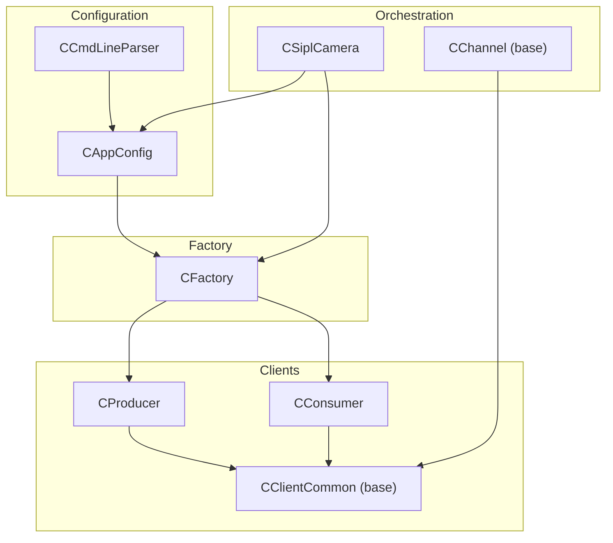
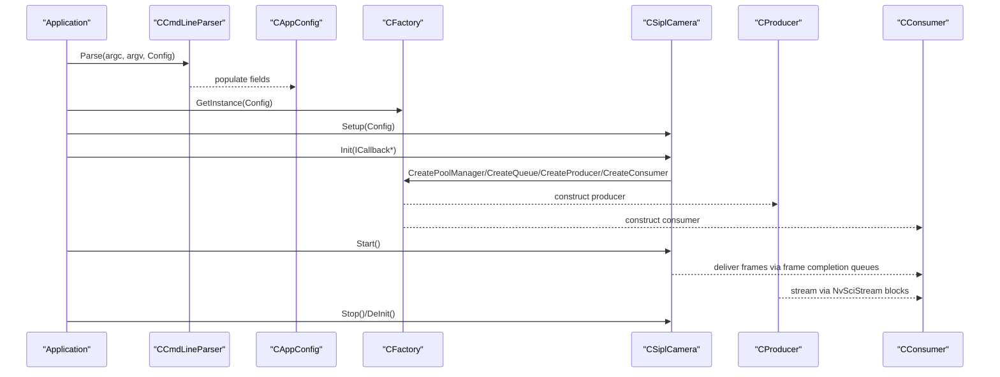
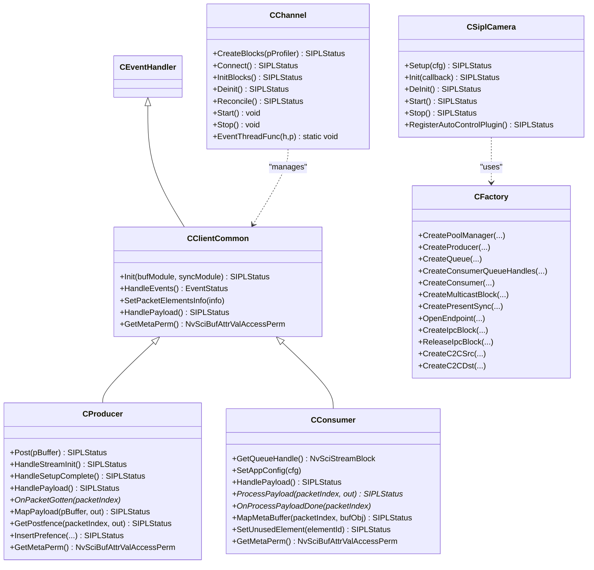
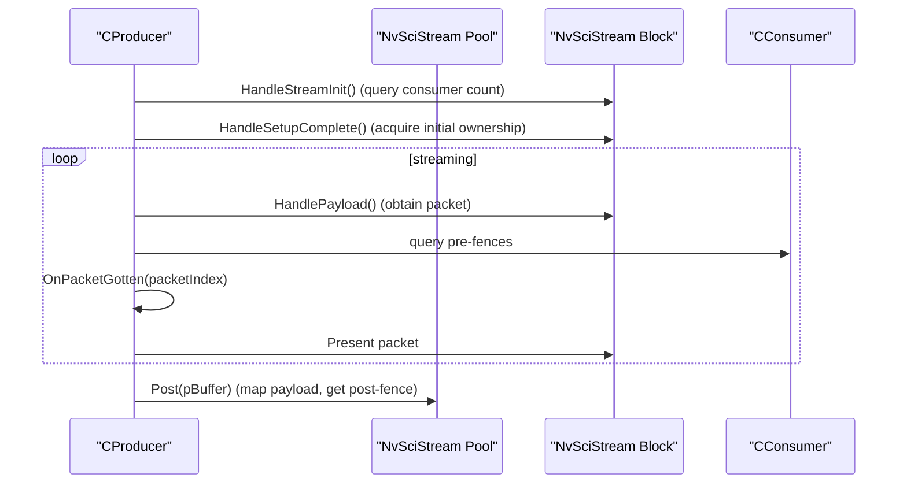
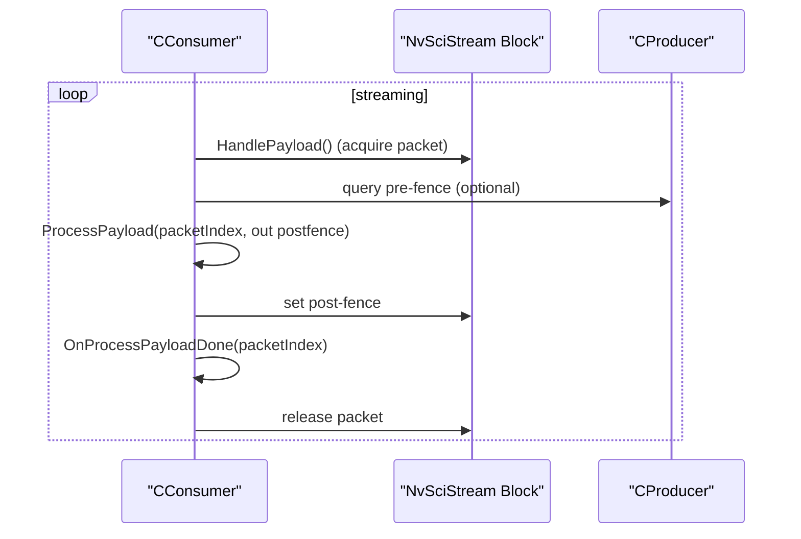
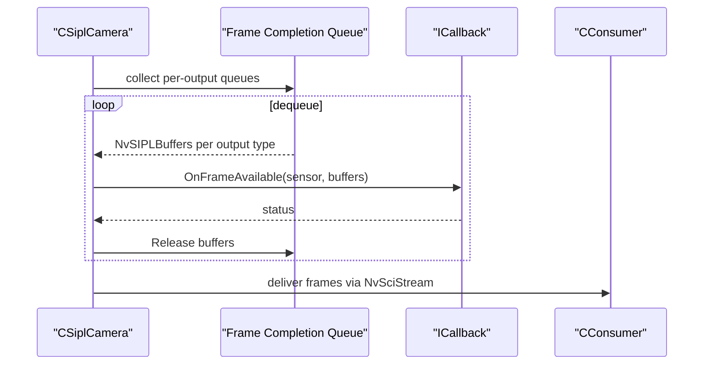
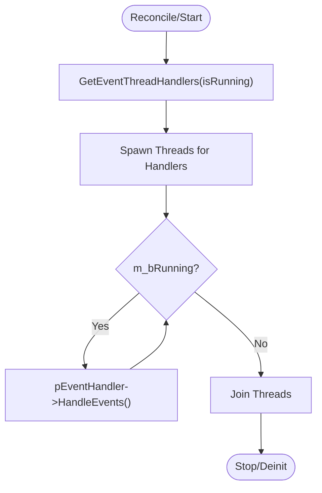
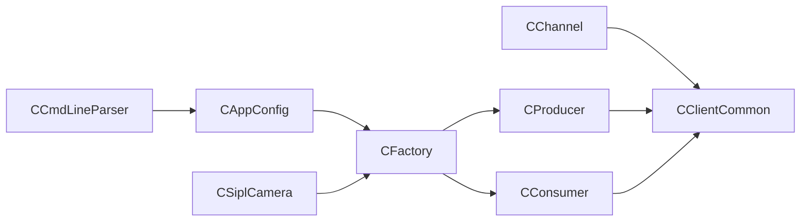

# API Reference

<cite>
**Referenced Files in This Document**
- [CAppConfig.hpp](file://CAppConfig.hpp)
- [CAppConfig.cpp](file://CAppConfig.cpp)
- [CCmdLineParser.hpp](file://CCmdLineParser.hpp)
- [CCmdLineParser.cpp](file://CCmdLineParser.cpp)
- [CProducer.hpp](file://CProducer.hpp)
- [CProducer.cpp](file://CProducer.cpp)
- [CConsumer.hpp](file://CConsumer.hpp)
- [CConsumer.cpp](file://CConsumer.cpp)
- [CSiplCamera.hpp](file://CSiplCamera.hpp)
- [CFactory.hpp](file://CFactory.hpp)
- [CFactory.cpp](file://CFactory.cpp)
- [CChannel.hpp](file://CChannel.hpp)
- [CClientCommon.hpp](file://CClientCommon.hpp)
- [Common.hpp](file://Common.hpp)
- [README.md](file://README.md)
- [ReleaseNote.md](file://ReleaseNote.md)
</cite>

## Table of Contents
1. [Introduction](#introduction)
2. [Project Structure](#project-structure)
3. [Core Components](#core-components)
4. [Architecture Overview](#architecture-overview)
5. [Detailed Component Analysis](#detailed-component-analysis)
6. [Dependency Analysis](#dependency-analysis)
7. [Performance Considerations](#performance-considerations)
8. [Troubleshooting Guide](#troubleshooting-guide)
9. [Conclusion](#conclusion)
10. [Appendices](#appendices)

## Introduction
This document provides a comprehensive API reference for the NVIDIA SIPL Multicast system. It covers public classes and interfaces used to configure, initialize, and operate multicast streaming pipelines. The primary focus is on:
- CAppConfig: Application configuration and platform configuration resolution
- CCmdLineParser: Command-line argument parsing and configuration population
- CProducer: Producer-side stream client with packet posting and synchronization
- CConsumer: Consumer-side stream client with payload processing and synchronization
- CSiplCamera: High-level camera orchestration and callbacks
- CFactory: Factory for creating pools, queues, producers, consumers, and IPC blocks
- CChannel: Base channel abstraction for building producer/consumer channels

The document also documents class hierarchies, inheritance relationships, interface contracts, constructor parameters, initialization sequences, configuration options, usage examples, error handling, thread-safety, lifecycle management, and API versioning considerations.

## Project Structure
The multicast module exposes a layered API:
- Configuration and CLI: CAppConfig, CCmdLineParser
- Stream clients: CProducer, CConsumer, CClientCommon (base)
- Camera orchestration: CSiplCamera, internal handlers
- Channel abstraction: CChannel
- Factory: CFactory

**Diagram sources**
- [CAppConfig.hpp:19-80](file://CAppConfig.hpp#L19-L80)
- [CCmdLineParser.hpp:34-44](file://CCmdLineParser.hpp#L34-L44)
- [CClientCommon.hpp:47-202](file://CClientCommon.hpp#L47-L202)
- [CProducer.hpp:16-51](file://CProducer.hpp#L16-L51)
- [CConsumer.hpp:16-44](file://CConsumer.hpp#L16-L44)
- [CSiplCamera.hpp:46-85](file://CSiplCamera.hpp#L46-L85)
- [CChannel.hpp:28-154](file://CChannel.hpp#L28-L154)
- [CFactory.hpp:27-92](file://CFactory.hpp#L27-L92)

**Section sources**
- [CAppConfig.hpp:19-80](file://CAppConfig.hpp#L19-L80)
- [CCmdLineParser.hpp:34-44](file://CCmdLineParser.hpp#L34-L44)
- [CClientCommon.hpp:47-202](file://CClientCommon.hpp#L47-L202)
- [CProducer.hpp:16-51](file://CProducer.hpp#L16-L51)
- [CConsumer.hpp:16-44](file://CConsumer.hpp#L16-L44)
- [CSiplCamera.hpp:46-85](file://CSiplCamera.hpp#L46-L85)
- [CChannel.hpp:28-154](file://CChannel.hpp#L28-L154)
- [CFactory.hpp:27-92](file://CFactory.hpp#L27-L92)

## Core Components

### CAppConfig
Public API surface:
- Getters for configuration fields:
  - GetVerbosity()
  - GetStaticConfigName(), GetDynamicConfigName(), GetNitoFolderPath()
  - GetCommType(), GetEntityType(), GetConsumerType(), GetQueueType()
  - IsStitchingDisplayEnabled(), IsDPMSTDisplayEnabled(), IsErrorIgnored(), IsFileDumped(), IsVersionShown(), IsMultiElementsEnabled(), IsLateAttachEnabled(), IsSC7BootEnabled()
  - GetFrameFilter(), GetConsumerNum(), GetConsumerIdx(), GetRunDurationSec()
  - GetPlatformCfg(): resolves platform configuration dynamically or statically
  - GetResolutionWidthAndHeight(sensorId, width&, height&): resolves sensor resolution
  - IsYUVSensor(sensorId): checks sensor input format
- Internal/protected members include defaults and flags for communication, entity type, consumer type, queue type, frame filter, run duration, consumer count/index, platform configuration, and various feature flags.

Constructor and initialization:
- Constructed by application and populated by CCmdLineParser.
- Platform configuration is resolved lazily via GetPlatformCfg().

Configuration options:
- Verbosity, static/dynamic platform config, link masks, late attach, file dump, frame filter, run duration, consumer count/index, display modes (stitching vs DP-MST), multi-element enablement, SC7 boot, queue type selection, and error handling behavior.

Usage example pattern:
- Instantiate CCmdLineParser, parse argv into CAppConfig, then pass CAppConfig to CFactory and CSiplCamera.

Thread safety:
- Access to configuration fields is read-only after construction; no internal synchronization is exposed.

Lifecycle:
- Lifetime managed by application; platform configuration pointer is cached after first resolution.

**Section sources**
- [CAppConfig.hpp:21-80](file://CAppConfig.hpp#L21-L80)
- [CAppConfig.cpp:21-108](file://CAppConfig.cpp#L21-L108)

### CCmdLineParser
Public API surface:
- Parse(argc, argv, pAppConfig): parses command-line options and populates CAppConfig; returns status code

Private helpers:
- ShowUsage(): prints usage
- ShowConfigs(): lists supported platform configurations
- ParseConsumerTypeStr(s, out): maps consumer type string to ConsumerType
- ParseQueueTypeStr(s, out): maps queue type string to QueueType

Command-line options:
- Help, verbosity, platform config (dynamic/static), link masks, late-attach, ignore errors, inter-process vs inter-chip, consumer type, queue type, file dump, frame filter, run duration, display mode, multi-elements, SC7 boot, consumer count/index.

Validation:
- Enforces ranges and mutual exclusivity (e.g., dynamic config requires masks; static and dynamic cannot be combined).

Usage example pattern:
- Call Parse() early in main() to populate CAppConfig before constructing other components.

**Section sources**
- [CCmdLineParser.hpp:34-44](file://CCmdLineParser.hpp#L34-L44)
- [CCmdLineParser.cpp:13-208](file://CCmdLineParser.cpp#L13-L208)

### CProducer
Public API surface:
- Constructor: CProducer(name, NvSciStreamBlock, sensorId)
- Destructor: default
- Post(pBuffer): maps payload, obtains post-fence, presents packet, updates counters
- Protected overrides:
  - HandleStreamInit(): queries consumer count and sets wait objects
  - HandleSetupComplete(): acquires initial packet ownership
  - HandlePayload(): obtains packet, waits for pre-fences, invokes OnPacketGotten(packetIndex)
  - MapPayload(pBuffer, out packetIndex): optional payload mapping hook
  - GetPostfence(packetIndex, out): optional post-fence retrieval hook
  - InsertPrefence(...): inserts pre-fence into pipeline
  - GetMetaPerm(): meta buffer permissions

Protected members:
- m_numConsumers, m_numBuffersWithConsumer (atomic)

Usage example pattern:
- Construct via CFactory::CreateProducer
- In HandlePayload(), implement OnPacketGotten() to prepare buffers
- In MapPayload()/GetPostfence()/InsertPrefence(), integrate with device-specific synchronization

**Section sources**
- [CProducer.hpp:16-51](file://CProducer.hpp#L16-L51)
- [CProducer.cpp:11-157](file://CProducer.cpp#L11-L157)

### CConsumer
Public API surface:
- Constructor: CConsumer(name, NvSciStreamBlock, sensorId, queueHandle)
- Destructor: default
- GetQueueHandle(): returns consumer queue handle
- SetAppConfig(pAppConfig): injects configuration
- Protected overrides:
  - HandlePayload(): acquires packet, optionally waits on pre-fences, calls ProcessPayload(packetIndex, out postfence), releases packet
  - ProcessPayload(packetIndex, out postfence): pure virtual; implement to process image buffers
  - OnProcessPayloadDone(packetIndex): pure virtual; implement to finalize processing
  - MapMetaBuffer(packetIndex, bufObj): maps metadata buffer
  - SetUnusedElement(elementId): marks element unused
  - GetMetaPerm(): meta buffer permissions

Protected members:
- m_frameNum, m_pAppConfig, m_queueHandle

Usage example pattern:
- Construct via CFactory::CreateConsumer
- Implement ProcessPayload() to decode/process frames
- Implement OnProcessPayloadDone() to release resources and signal completion

**Section sources**
- [CConsumer.hpp:16-44](file://CConsumer.hpp#L16-L44)
- [CConsumer.cpp:11-127](file://CConsumer.cpp#L11-L127)

### CSiplCamera
Public API surface:
- Inner interface ICallback: OnFrameAvailable(uSensor, siplBuffers) -> SIPLStatus
- Setup(pAppConfig) -> SIPLStatus
- Init(callback) -> SIPLStatus
- DeInit() -> SIPLStatus
- Start() -> SIPLStatus
- Stop() -> SIPLStatus
- RegisterAutoControlPlugin() -> SIPLStatus

Internal handler classes:
- CDeviceBlockNotificationHandler: device-level error handling and event thread
- CPipelineNotificationHandler: pipeline-level notifications and frame drop tracking
- CPipelineFrameQueueHandler: frame completion queue aggregation and callback dispatch

Member data:
- m_vCameraModules, m_upCamera, m_vupFrameCompletionQueueHandler, m_vupNotificationHandler, m_vupDeviceBlockNotifyHandler
- Private members: m_pAppConfig, m_pPlatformCfg

Usage example pattern:
- Instantiate CSiplCamera
- Call Setup() with CAppConfig
- Call Init(ICallback*) to start camera pipeline
- Implement ICallback::OnFrameAvailable to receive NvSIPLBuffers per sensor/output type
- Call Start() to begin streaming; Stop() to halt

**Section sources**
- [CSiplCamera.hpp:46-85](file://CSiplCamera.hpp#L46-L85)

### CFactory
Public API surface:
- GetInstance(pAppConfig) -> static CFactory&
- CreatePoolManager(uSensorId, numPackets, isC2C=false) -> unique_ptr<CPoolManager>
- CreateProducer(producerType, poolHandle, uSensorId=0) -> CProducer*
- CreateQueue(queueType, out pQueueHandle) -> SIPLStatus
- CreateConsumerQueueHandles(queueType, out pQueueHandle, out pConsumerHandle) -> SIPLStatus
- CreateConsumer(consumerType, uSensorId) -> unique_ptr<CConsumer>
- CreateConsumer(consumerType, uSensorId, queueType) -> unique_ptr<CConsumer>
- CreateMulticastBlock(consumerCount, out multicastHandle) -> SIPLStatus
- CreatePresentSync(syncModule, out presentSyncHandle) -> SIPLStatus
- OpenEndpoint(channel, out pEndPoint) -> SIPLStatus
- CreateIpcBlock(syncModule, bufModule, channel, isSrc, pEndPoint, out pIpcBlock) -> SIPLStatus
- ReleaseIpcBlock(endpoint, ipcBlock) -> SIPLStatus
- CreateC2CSrc(syncModule, bufModule, channel, c2cQueueHandle, out pEndPoint, out pIpcBlock) -> SIPLStatus
- CreateC2CDst(syncModule, bufModule, channel, poolHandle, out pEndPoint, out pIpcBlock) -> SIPLStatus

Usage example pattern:
- Use GetInstance(pAppConfig) to obtain factory singleton
- Create pool, queues, producers, and consumers as needed
- For IPC/C2C, open endpoint and create IPC blocks

**Section sources**
- [CFactory.hpp:27-92](file://CFactory.hpp#L27-L92)
- [CFactory.cpp:11-315](file://CFactory.cpp#L11-L315)

### CChannel
Public API surface:
- Constructors: CChannel(name, bufModule, syncModule, pSensorInfo, pAppConfig)
- Destructor: default
- CreateBlocks(pProfiler)=0, Connect()=0, InitBlocks()=0, Deinit()=0, Init()=0
- Reconcile() -> SIPLStatus: starts event threads for handlers
- Start() -> void: starts event threads
- Stop() -> void: stops and joins event threads
- Static EventThreadFunc(pEventHandler, pChannel) -> void: per-thread event loop

Protected members:
- m_name, m_bufModule, m_syncModule, m_pSensorInfo, m_pAppConfig
- m_bRunning (atomic), m_vupThreads

Usage example pattern:
- Subclass CChannel to implement CreateBlocks()/Connect()/InitBlocks()/Deinit()
- Call Reconcile() to spin up event threads
- Call Start()/Stop() to control runtime

**Section sources**
- [CChannel.hpp:28-154](file://CChannel.hpp#L28-L154)

## Architecture Overview
The system orchestrates camera pipelines and stream clients through a factory-driven model. CSiplCamera coordinates NvSIPL pipelines and dispatches frames to consumers via frame completion queues. CFactory constructs pools, queues, producers, and consumers, and manages IPC/C2C blocks. CProducer and CConsumer implement the stream protocol using NvSciStream/NvSciBuf and handle synchronization via NvSciSync fences.

**Diagram sources**
- [CCmdLineParser.cpp:13-208](file://CCmdLineParser.cpp#L13-L208)
- [CAppConfig.cpp:21-108](file://CAppConfig.cpp#L21-L108)
- [CFactory.cpp:11-315](file://CFactory.cpp#L11-L315)
- [CSiplCamera.hpp:46-85](file://CSiplCamera.hpp#L46-L85)
- [CProducer.cpp:11-157](file://CProducer.cpp#L11-L157)
- [CConsumer.cpp:11-127](file://CConsumer.cpp#L11-L127)

## Detailed Component Analysis

### Class Hierarchies and Interfaces

**Diagram sources**
- [CClientCommon.hpp:47-202](file://CClientCommon.hpp#L47-L202)
- [CProducer.hpp:16-51](file://CProducer.hpp#L16-L51)
- [CConsumer.hpp:16-44](file://CConsumer.hpp#L16-L44)
- [CSiplCamera.hpp:46-85](file://CSiplCamera.hpp#L46-L85)
- [CChannel.hpp:28-154](file://CChannel.hpp#L28-L154)
- [CFactory.hpp:27-92](file://CFactory.hpp#L27-L92)

### CProducer Lifecycle and Payload Posting

**Diagram sources**
- [CProducer.cpp:17-151](file://CProducer.cpp#L17-L151)

### CConsumer Lifecycle and Payload Processing

**Diagram sources**
- [CConsumer.cpp:17-94](file://CConsumer.cpp#L17-L94)

### CSiplCamera Callback Flow

**Diagram sources**
- [CSiplCamera.hpp:523-618](file://CSiplCamera.hpp#L523-L618)

### CChannel Event Thread Management

**Diagram sources**
- [CChannel.hpp:55-140](file://CChannel.hpp#L55-L140)

## Dependency Analysis
- CAppConfig depends on platform configuration headers and NvSIPL query interfaces (when dynamic config is used).
- CCmdLineParser depends on CAppConfig and platform headers; it validates and normalizes configuration.
- CFactory depends on CAppConfig and constructs NvSciStream/NvSciBuf objects; it also manages IPC/C2C endpoints.
- CClientCommon is the base for CProducer and CConsumer; it encapsulates NvSciStream/NvSciBuf setup, packet mapping, and synchronization.
- CSiplCamera composes multiple internal handlers and interacts with NvSIPL camera APIs.

**Diagram sources**
- [CAppConfig.hpp:19-80](file://CAppConfig.hpp#L19-L80)
- [CCmdLineParser.hpp:34-44](file://CCmdLineParser.hpp#L34-L44)
- [CFactory.hpp:27-92](file://CFactory.hpp#L27-L92)
- [CClientCommon.hpp:47-202](file://CClientCommon.hpp#L47-L202)
- [CProducer.hpp:16-51](file://CProducer.hpp#L16-L51)
- [CConsumer.hpp:16-44](file://CConsumer.hpp#L16-L44)
- [CSiplCamera.hpp:46-85](file://CSiplCamera.hpp#L46-L85)
- [CChannel.hpp:28-154](file://CChannel.hpp#L28-L154)

**Section sources**
- [CAppConfig.hpp:19-80](file://CAppConfig.hpp#L19-L80)
- [CCmdLineParser.hpp:34-44](file://CCmdLineParser.hpp#L34-L44)
- [CFactory.hpp:27-92](file://CFactory.hpp#L27-L92)
- [CClientCommon.hpp:47-202](file://CClientCommon.hpp#L47-L202)
- [CProducer.hpp:16-51](file://CProducer.hpp#L16-L51)
- [CConsumer.hpp:16-44](file://CConsumer.hpp#L16-L44)
- [CSiplCamera.hpp:46-85](file://CSiplCamera.hpp#L46-L85)
- [CChannel.hpp:28-154](file://CChannel.hpp#L28-L154)

## Performance Considerations
- Frame filtering: CAppConfig::GetFrameFilter() allows processing every Nth frame to reduce load.
- Queue types: FIFO vs mailbox queues influence latency and throughput; choose based on consumer needs.
- Multi-elements: enabling multi-elements increases bandwidth and processing overhead; use selectively.
- CPU wait context: when present, fences are waited on CPU to avoid ISP registration issues; this adds latency but improves reliability.
- Frame drop tracking: pipeline notification handler tracks drops; monitor for performance tuning.

[No sources needed since this section provides general guidance]

## Troubleshooting Guide
Common statuses and meanings:
- NVSIPL_STATUS_OK: success
- NVSIPL_STATUS_ERROR: generic failure
- NVSIPL_STATUS_BAD_ARGUMENT: invalid arguments or configuration
- NVSIPL_STATUS_EOF: end-of-file or shutdown
- NVSIPL_STATUS_TIMED_OUT: operation timed out
- NVSIPL_STATUS_NOT_SUPPORTED: feature not supported

Error handling patterns:
- Many methods return SIPLStatus; check return values and log messages for diagnostics.
- CProducer/CConsumer log detailed errors during NvSciStream/NvSciBuf operations.
- CSiplCamera handlers log device/block/pipeline errors and frame drop counts.

Typical issues:
- Invalid consumer count or index: validated by CCmdLineParser and CAppConfig.
- Dynamic config and masks mismatch: enforced by CCmdLineParser.
- Queue creation failures: handled by CFactory; inspect NvSciStream error codes.
- Fence wait failures: indicate synchronization problems; consider enabling CPU wait context.

**Section sources**
- [CProducer.cpp:17-151](file://CProducer.cpp#L17-L151)
- [CConsumer.cpp:17-127](file://CConsumer.cpp#L17-L127)
- [CFactory.cpp:138-315](file://CFactory.cpp#L138-L315)
- [CSiplCamera.hpp:315-355](file://CSiplCamera.hpp#L315-L355)

## Conclusion
The NVIDIA SIPL Multicast system exposes a robust, factory-driven API for configuring and operating camera pipelines with producer/consumer streaming. CAppConfig and CCmdLineParser provide flexible configuration, CFactory constructs the underlying NvSciStream/NvSciBuf infrastructure, and CProducer/CConsumer implement the streaming protocol with precise synchronization. CSiplCamera orchestrates NvSIPL pipelines and delivers frames to consumers via frame completion queues. Proper use of these APIs enables efficient, scalable multicast streaming with clear error handling and diagnostic capabilities.

[No sources needed since this section summarizes without analyzing specific files]

## Appendices

### API Versioning and Compatibility
- Version header inclusion indicates version awareness in CSiplCamera.
- Backward compatibility is maintained by keeping public constructors and methods stable; internal changes are isolated within implementation files.
- Migration guidance:
  - Prefer CFactory for constructing pools, queues, and stream clients to centralize NvSciStream/NvSciBuf setup.
  - Use CAppConfig getters to query runtime options rather than hardcoding values.
  - For IPC/C2C, use CFactory’s endpoint and IPC block creation helpers to ensure consistent behavior.

**Section sources**
- [CSiplCamera.hpp:19-29](file://CSiplCamera.hpp#L19-L29)
- [CFactory.cpp:223-315](file://CFactory.cpp#L223-L315)
- [ReleaseNote.md](file://ReleaseNote.md)

### Usage Examples and Integration Patterns
- Basic initialization:
  - Parse command line with CCmdLineParser::Parse()
  - Resolve platform configuration via CAppConfig::GetPlatformCfg()
  - Create pool and queues via CFactory
  - Construct producer and consumer via CFactory
  - Start CSiplCamera and streaming

- Consumer integration:
  - Implement CConsumer::ProcessPayload() to decode/process frames
  - Implement CConsumer::OnProcessPayloadDone() to release resources
  - Optionally implement CProducer::OnPacketGotten() for producer-side preparation

- Camera callback integration:
  - Implement CSiplCamera::ICallback::OnFrameAvailable() to receive NvSIPLBuffers
  - Use output type enumeration to route buffers to appropriate consumers

**Section sources**
- [CCmdLineParser.cpp:13-208](file://CCmdLineParser.cpp#L13-L208)
- [CAppConfig.cpp:21-108](file://CAppConfig.cpp#L21-L108)
- [CFactory.cpp:68-205](file://CFactory.cpp#L68-L205)
- [CProducer.cpp:123-151](file://CProducer.cpp#L123-L151)
- [CConsumer.cpp:72-94](file://CConsumer.cpp#L72-L94)
- [CSiplCamera.hpp:49-85](file://CSiplCamera.hpp#L49-L85)