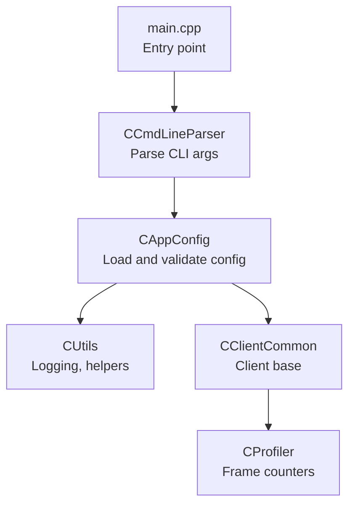
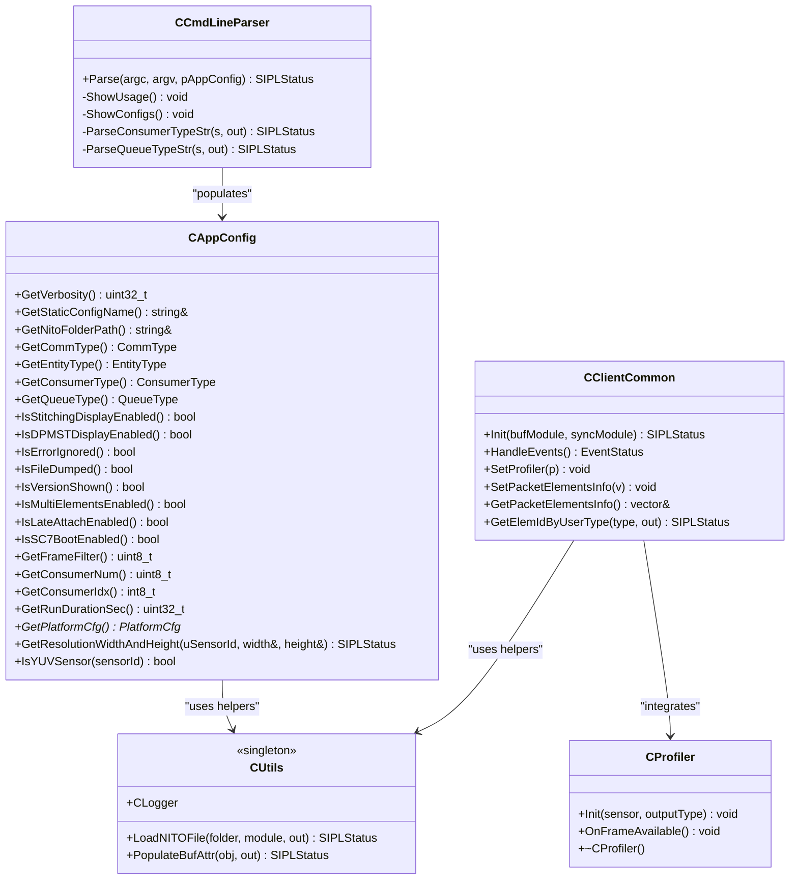
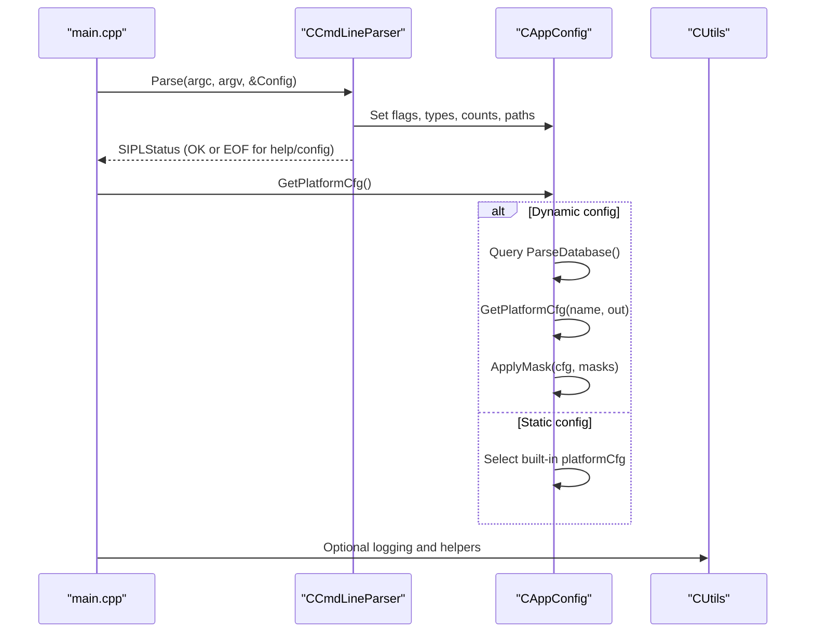
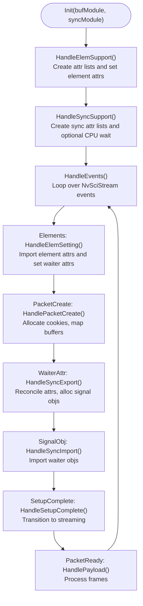
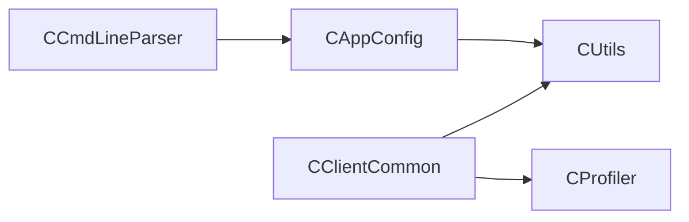

# Configuration and Utility API

<cite>
**Referenced Files in This Document**
- [CAppConfig.hpp](file://CAppConfig.hpp)
- [CAppConfig.cpp](file://CAppConfig.cpp)
- [CCmdLineParser.hpp](file://CCmdLineParser.hpp)
- [CCmdLineParser.cpp](file://CCmdLineParser.cpp)
- [CUtils.hpp](file://CUtils.hpp)
- [CUtils.cpp](file://CUtils.cpp)
- [CClientCommon.hpp](file://CClientCommon.hpp)
- [CClientCommon.cpp](file://CClientCommon.cpp)
- [CProfiler.hpp](file://CProfiler.hpp)
- [main.cpp](file://main.cpp)
</cite>

## Table of Contents
1. [Introduction](#introduction)
2. [Project Structure](#project-structure)
3. [Core Components](#core-components)
4. [Architecture Overview](#architecture-overview)
5. [Detailed Component Analysis](#detailed-component-analysis)
6. [Dependency Analysis](#dependency-analysis)
7. [Performance Considerations](#performance-considerations)
8. [Troubleshooting Guide](#troubleshooting-guide)
9. [Conclusion](#conclusion)

## Introduction
This document provides detailed API documentation for configuration and utility classes in the NVIDIA SIPL Multicast system. It focuses on:
- CAppConfig: configuration loading, parameter validation, and runtime configuration management
- CCmdLineParser: command-line argument parsing, validation, and configuration overrides
- CUtils: utility functions, logging helpers, and common operations
- CClientCommon: shared client-side functionality, synchronization primitives, and interfaces
- CProfiler: performance monitoring, timing measurements, and profiling utilities

It also covers configuration precedence, validation rules, and integration patterns with the main system components.

## Project Structure
The configuration and utility subsystems are centered around the following files:
- Configuration: CAppConfig.hpp/cpp
- Command-line parsing: CCmdLineParser.hpp/cpp
- Utilities and logging: CUtils.hpp/cpp
- Client base class: CClientCommon.hpp/cpp
- Profiling: CProfiler.hpp
- Integration entry point: main.cpp

**Diagram sources**
- [main.cpp:1-200](file://main.cpp#L1-L200)
- [CCmdLineParser.cpp:13-208](file://CCmdLineParser.cpp#L13-L208)
- [CAppConfig.cpp:21-75](file://CAppConfig.cpp#L21-L75)
- [CUtils.cpp:17-143](file://CUtils.cpp#L17-L143)
- [CClientCommon.cpp:95-112](file://CClientCommon.cpp#L95-L112)
- [CProfiler.hpp:21-54](file://CProfiler.hpp#L21-L54)

**Section sources**
- [main.cpp:1-200](file://main.cpp#L1-L200)

## Core Components
This section summarizes the primary APIs and responsibilities.

- CAppConfig
  - Purpose: Centralized runtime configuration, platform configuration resolution, and capability queries (resolution, YUV sensor detection).
  - Key responsibilities:
    - Resolve platform configuration (dynamic via SIPL Query or static via built-in platform configs)
    - Validate and expose runtime flags and parameters
    - Provide sensor resolution and format information derived from platform config
  - Notable members:
    - Accessors for verbosity, communication type, entity type, consumer type, queue type, flags, counts, durations, and platform configuration pointer
    - Methods to resolve platform configuration, query resolution by sensor ID, and detect YUV sensors

- CCmdLineParser
  - Purpose: Parse command-line arguments, enforce validation rules, and populate CAppConfig.
  - Key responsibilities:
    - Short and long option parsing
    - Validation of ranges and combinations (e.g., frame filter, consumer count, consumer index)
    - Consumer type and queue type parsing
    - Dynamic/static platform configuration exclusivity and mask pairing rules
  - Public API:
    - Parse(argc, argv, pAppConfig): returns status and may request usage or config listing

- CUtils
  - Purpose: Provide logging utilities, macros for error/status checks, and helper functions for buffer/sync attributes.
  - Key responsibilities:
    - Singleton logger with configurable log level/style and formatted output
    - Macros for checking pointers, statuses, and system calls with consistent error handling
    - Helper to load NITO files for camera modules
    - Helper to populate buffer attributes from NvSciBuf objects

- CClientCommon
  - Purpose: Shared client-side logic for NvSciStream/NvSciBuf/NvSciSync orchestration.
  - Key responsibilities:
    - Initialization and lifecycle management
    - Event handling for stream setup and payload processing
    - Buffer/sync attribute list creation and reconciliation
    - Packet lifecycle management and cookie-based indexing
    - Integration with CProfiler for frame counting

- CProfiler
  - Purpose: Lightweight frame counter and synchronization primitive wrapper for performance monitoring.
  - Key responsibilities:
    - Initialize per-sensor and output-type counters
    - Increment frame count on frame availability
    - Expose mutex-protected profiling data

**Section sources**
- [CAppConfig.hpp:19-80](file://CAppConfig.hpp#L19-L80)
- [CAppConfig.cpp:21-109](file://CAppConfig.cpp#L21-L109)
- [CCmdLineParser.hpp:34-44](file://CCmdLineParser.hpp#L34-L44)
- [CCmdLineParser.cpp:13-208](file://CCmdLineParser.cpp#L13-L208)
- [CUtils.hpp:27-311](file://CUtils.hpp#L27-L311)
- [CUtils.cpp:17-438](file://CUtils.cpp#L17-L438)
- [CClientCommon.hpp:47-200](file://CClientCommon.hpp#L47-L200)
- [CClientCommon.cpp:95-634](file://CClientCommon.cpp#L95-L634)
- [CProfiler.hpp:21-54](file://CProfiler.hpp#L21-L54)

## Architecture Overview
The configuration and utility classes integrate as follows:
- main initializes CCmdLineParser and invokes Parse to populate CAppConfig
- CAppConfig resolves platform configuration and exposes capabilities
- CUtils provides logging and helper utilities used across components
- CClientCommon orchestrates stream/sync/buffer setup and integrates CProfiler for frame counting
- CProfiler is owned by higher-level components and passed down to clients

**Diagram sources**
- [CCmdLineParser.hpp:34-44](file://CCmdLineParser.hpp#L34-L44)
- [CAppConfig.hpp:19-80](file://CAppConfig.hpp#L19-L80)
- [CUtils.hpp:177-311](file://CUtils.hpp#L177-L311)
- [CClientCommon.hpp:47-200](file://CClientCommon.hpp#L47-L200)
- [CProfiler.hpp:21-54](file://CProfiler.hpp#L21-L54)

## Detailed Component Analysis

### CAppConfig API
- Responsibilities
  - Load and cache platform configuration (dynamic via SIPL Query or static built-ins)
  - Expose runtime flags and parameters
  - Provide sensor resolution and format information
- Key methods and behaviors
  - GetPlatformCfg(): resolves platform configuration; applies masks when dynamic config is used; returns pointer to cached PlatformCfg
  - GetResolutionWidthAndHeight(uSensorId, width&, height&): finds sensor by ID and returns resolution; logs error and returns failure if not found
  - IsYUVSensor(sensorId): determines if a sensor uses YUV input format
  - Accessors for verbosity, communication type, entity type, consumer type, queue type, flags, counts, durations, and platform config
- Validation and error handling
  - Dynamic config requires masks to be provided together; mutually exclusive with static config
  - Returns error status on invalid sensor ID or unsupported platform configuration
- Practical usage examples
  - Resolve platform configuration before initializing streams
  - Query sensor resolution before setting up consumers
  - Detect YUV sensor to choose appropriate consumer pipeline

**Section sources**
- [CAppConfig.hpp:19-80](file://CAppConfig.hpp#L19-L80)
- [CAppConfig.cpp:21-109](file://CAppConfig.cpp#L21-L109)

### CCmdLineParser API
- Responsibilities
  - Parse command-line options and populate CAppConfig
  - Enforce validation rules and report usage/configs
- Public API
  - Parse(int argc, char *argv[], CAppConfig *pAppConfig): returns status; may return end-of-file status to indicate help/config listing was requested
- Options and validation rules
  - Verbosity, platform config selection, NITO folder path, file dump, frame filter (range 1–5), version, run duration, display modes, multi-element enablement, SC7 boot, consumer count (1–8), consumer index (-1 or within [0, consumerNum))
  - Consumer type and queue type parsing with supported values
  - Dynamic/static platform config exclusivity and mask pairing rules
- Practical usage examples
  - Call Parse early in main to initialize configuration before subsystem initialization
  - Use ShowUsage/ShowConfigs for help and platform configuration listings

**Section sources**
- [CCmdLineParser.hpp:34-44](file://CCmdLineParser.hpp#L34-L44)
- [CCmdLineParser.cpp:13-208](file://CCmdLineParser.cpp#L13-L208)

### CUtils API
- Responsibilities
  - Logging: singleton CLogger with configurable level/style and formatted output
  - Status/error macros: unified macros for pointer checks, SIPL status, NvMedia status, NvSci status, CUDA status, WFD errors, and cleanup
  - Helpers: LoadNITOFile for camera module blobs, PopulateBufAttr for NvSciBuf metadata extraction
- Logging
  - CLogger singleton with SetLogLevel/SetLogStyle and multiple overloads for formatted messages
  - Prefix variants for component-specific logging
- Helpers
  - LoadNITOFile: attempts uppercase/lowercase/default naming; validates file size and reads blob
  - PopulateBufAttr: retrieves NvSciBuf attributes and populates a structured BufferAttrs object
- Practical usage examples
  - Use macros to unify error handling across subsystems
  - Use LoadNITOFile to support image quality features per camera module
  - Use PopulateBufAttr to derive buffer geometry for downstream consumers

**Section sources**
- [CUtils.hpp:27-311](file://CUtils.hpp#L27-L311)
- [CUtils.cpp:17-438](file://CUtils.cpp#L17-L438)

### CClientCommon API
- Responsibilities
  - Client-side orchestration for NvSciStream/NvSciBuf/NvSciSync
  - Event-driven lifecycle: element support, packet creation, sync export/import, payload handling
  - Buffer/sync attribute list creation and reconciliation
  - Packet lifecycle management with cookie-based indexing
- Key methods and behaviors
  - Init(bufModule, syncModule): performs initialization and setup
  - HandleEvents(): processes NvSciStream events and transitions to streaming phase
  - SetProfiler(pProfiler): injects profiler for frame counting
  - Element/sync/buffer attribute list management and registration
  - Packet creation, mapping, and status reporting
- Practical usage examples
  - Subclass CClientCommon to implement custom payload handling
  - Override attribute list setters to match specific pipeline needs
  - Integrate with CProfiler to monitor frame throughput

**Section sources**
- [CClientCommon.hpp:47-200](file://CClientCommon.hpp#L47-L200)
- [CClientCommon.cpp:95-634](file://CClientCommon.cpp#L95-L634)

### CProfiler API
- Responsibilities
  - Lightweight frame counter with thread-safe increments
  - Per-sensor and per-output-type profiling context
- Key methods and behaviors
  - Init(uSensor, outputType): initializes counters and metadata
  - OnFrameAvailable(): increments frame count under mutex protection
  - Destructor: no-op cleanup
- Practical usage examples
  - Pass a CProfiler instance to clients during channel creation
  - Use OnFrameAvailable in payload handlers to track throughput

**Section sources**
- [CProfiler.hpp:21-54](file://CProfiler.hpp#L21-L54)

## Architecture Overview

### Configuration Loading Sequence

**Diagram sources**
- [main.cpp:1-200](file://main.cpp#L1-L200)
- [CCmdLineParser.cpp:13-208](file://CCmdLineParser.cpp#L13-L208)
- [CAppConfig.cpp:21-75](file://CAppConfig.cpp#L21-L75)
- [CUtils.cpp:17-143](file://CUtils.cpp#L17-L143)

### Client Event Handling Flow

**Diagram sources**
- [CClientCommon.cpp:95-112](file://CClientCommon.cpp#L95-L112)
- [CClientCommon.cpp:119-205](file://CClientCommon.cpp#L119-L205)
- [CClientCommon.cpp:300-408](file://CClientCommon.cpp#L300-L408)
- [CClientCommon.cpp:410-467](file://CClientCommon.cpp#L410-L467)
- [CClientCommon.cpp:469-553](file://CClientCommon.cpp#L469-L553)
- [CClientCommon.cpp:555-591](file://CClientCommon.cpp#L555-L591)

## Dependency Analysis
- CCmdLineParser depends on CAppConfig to populate runtime flags and types
- CAppConfig optionally depends on platform configuration modules and SIPL Query for dynamic configs
- CClientCommon depends on CProfiler for frame counting and on CUtils for logging and buffer/sync helpers
- CUtils is a standalone utility layer consumed by multiple components

**Diagram sources**
- [CCmdLineParser.hpp:21-26](file://CCmdLineParser.hpp#L21-L26)
- [CAppConfig.hpp:10-11](file://CAppConfig.hpp#L10-L11)
- [CClientCommon.hpp:18-19](file://CClientCommon.hpp#L18-L19)
- [CProfiler.hpp:14](file://CProfiler.hpp#L14)

**Section sources**
- [CCmdLineParser.hpp:21-26](file://CCmdLineParser.hpp#L21-L26)
- [CAppConfig.hpp:10-11](file://CAppConfig.hpp#L10-L11)
- [CClientCommon.hpp:18-19](file://CClientCommon.hpp#L18-L19)
- [CProfiler.hpp:14](file://CProfiler.hpp#L14)

## Performance Considerations
- Use CProfiler to monitor frame throughput per sensor and output type
- Keep frame filter reasonable to balance processing overhead and data rate
- Minimize repeated platform configuration resolution; cache results in CAppConfig
- Prefer batched attribute reconciliation in CClientCommon to reduce NvSci operations
- Use logging levels appropriately to avoid excessive I/O during performance-sensitive runs

## Troubleshooting Guide
- Command-line validation failures
  - Frame filter out of range (1–5)
  - Consumer count out of range (1–8)
  - Consumer index out of bounds
  - Dynamic and static platform configuration exclusivity
  - Link masks require dynamic config
- Platform configuration resolution
  - Dynamic config database parse failure
  - Unknown platform configuration name
  - Mask application failure
- Buffer/sync attribute issues
  - Attribute retrieval or reconciliation failures
  - Packet overflow or invalid cookie
- Logging
  - Use CLogger to adjust verbosity and style for diagnostics
  - Utilize macro variants to prefix logs with component names

**Section sources**
- [CCmdLineParser.cpp:169-207](file://CCmdLineParser.cpp#L169-L207)
- [CAppConfig.cpp:33-50](file://CAppConfig.cpp#L33-L50)
- [CClientCommon.cpp:420-425](file://CClientCommon.cpp#L420-L425)
- [CClientCommon.cpp:125-133](file://CClientCommon.cpp#L125-L133)
- [CUtils.cpp:38-84](file://CUtils.cpp#L38-L84)

## Conclusion
The configuration and utility subsystems provide a robust foundation for the NVIDIA SIPL Multicast system:
- CCmdLineParser enforces strict validation and cleanly populates CAppConfig
- CAppConfig centralizes platform configuration and capability queries
- CUtils standardizes logging and helper operations across components
- CClientCommon encapsulates stream/sync/buffer orchestration with extensibility
- CProfiler enables lightweight performance monitoring integrated into client pipelines

Together, these components ensure predictable configuration precedence, strong validation, and efficient integration patterns across producers and consumers.