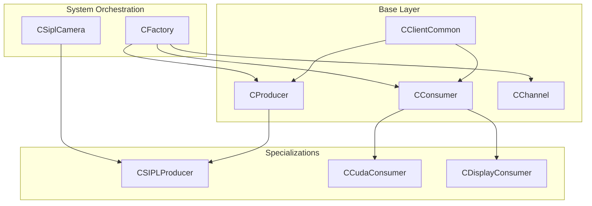
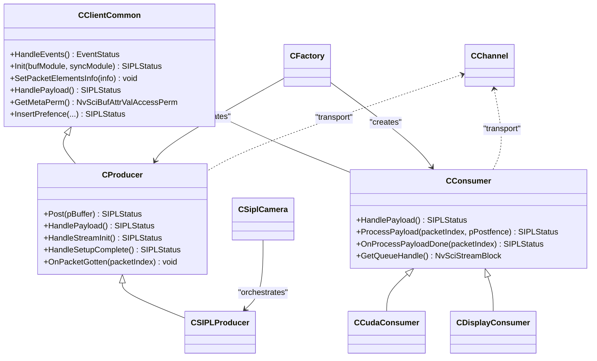
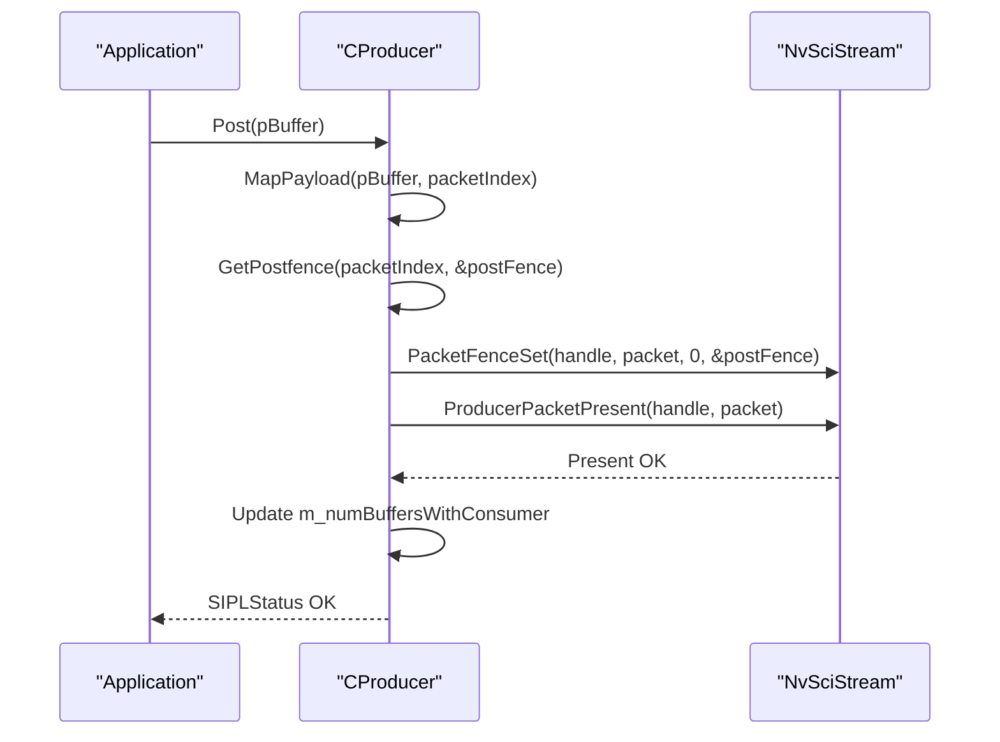
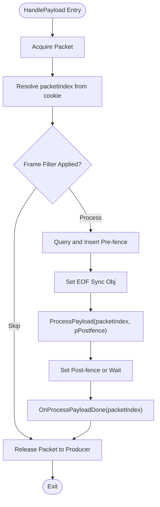
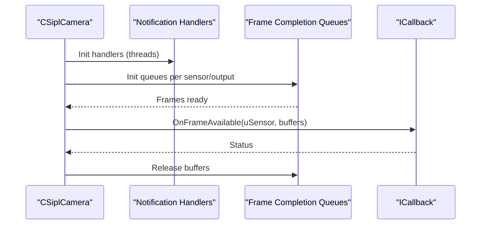
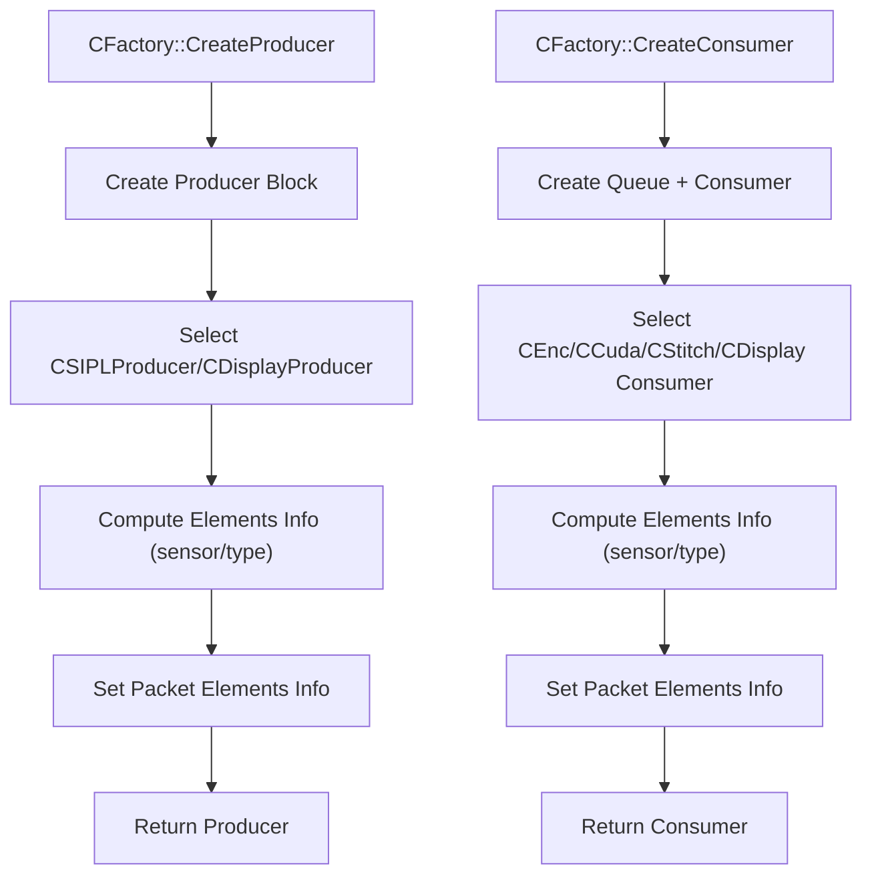
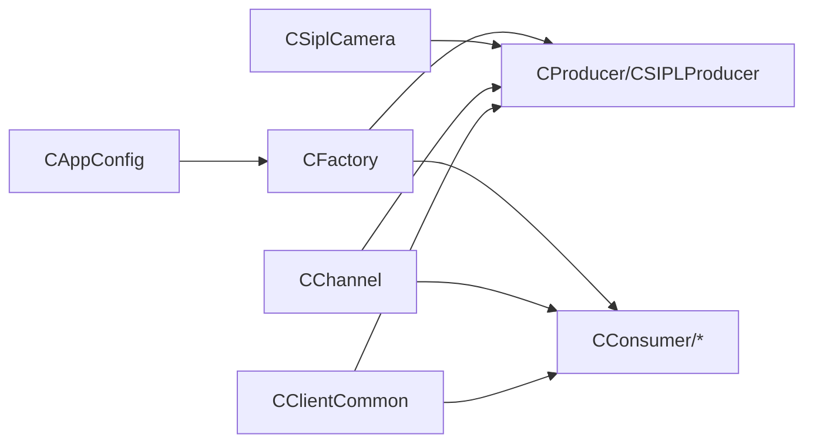

# Core Classes API

<cite>
**Referenced Files in This Document**
- [CProducer.hpp](file://CProducer.hpp)
- [CProducer.cpp](file://CProducer.cpp)
- [CConsumer.hpp](file://CConsumer.hpp)
- [CConsumer.cpp](file://CConsumer.cpp)
- [CSiplCamera.hpp](file://CSiplCamera.hpp)
- [CSiplCamera.cpp](file://CSiplCamera.cpp)
- [CFactory.hpp](file://CFactory.hpp)
- [CFactory.cpp](file://CFactory.cpp)
- [CChannel.hpp](file://CChannel.hpp)
- [CClientCommon.hpp](file://CClientCommon.hpp)
- [Common.hpp](file://Common.hpp)
- [CSIPLProducer.hpp](file://CSIPLProducer.hpp)
- [CCudaConsumer.hpp](file://CCudaConsumer.hpp)
- [CDisplayConsumer.hpp](file://CDisplayConsumer.hpp)
</cite>

## Table of Contents
1. [Introduction](#introduction)
2. [Project Structure](#project-structure)
3. [Core Components](#core-components)
4. [Architecture Overview](#architecture-overview)
5. [Detailed Component Analysis](#detailed-component-analysis)
6. [Dependency Analysis](#dependency-analysis)
7. [Performance Considerations](#performance-considerations)
8. [Troubleshooting Guide](#troubleshooting-guide)
9. [Conclusion](#conclusion)

## Introduction
This document provides comprehensive API documentation for the core classes in the NVIDIA SIPL Multicast system. It focuses on:
- CProducer base class: virtual methods, frame posting, lifecycle hooks, and synchronization.
- CConsumer base class: consumer registration, payload processing, and cleanup.
- CSiplCamera: camera initialization, configuration, and frame capture interfaces.
- CFactory: dynamic consumer/producer creation via factory pattern and channel/block creation.
- CChannel base class: communication patterns, channel setup, data transmission, and resource management.

The documentation includes method signatures, parameters, return values, usage notes, and diagrams to illustrate relationships and flows.

## Project Structure
The core classes are organized around a streaming framework built on NvSIPL and NvSciStream. The base classes CProducer and CConsumer derive from CClientCommon, which encapsulates common stream setup, packet handling, and synchronization. Specializations like CSIPLProducer and CCudaConsumer demonstrate typical implementations. CSiplCamera orchestrates camera pipelines and frame delivery callbacks. CFactory centralizes creation of producers, consumers, queues, and IPC blocks. CChannel defines the channel abstraction for inter-process or inter-chip communication.

**Diagram sources**
- [CClientCommon.hpp:47-200](file://CClientCommon.hpp#L47-L200)
- [CProducer.hpp:16-51](file://CProducer.hpp#L16-L51)
- [CConsumer.hpp:16-44](file://CConsumer.hpp#L16-L44)
- [CChannel.hpp:28-154](file://CChannel.hpp#L28-L154)
- [CSIPLProducer.hpp:18-81](file://CSIPLProducer.hpp#L18-L81)
- [CCudaConsumer.hpp:25-78](file://CCudaConsumer.hpp#L25-L78)
- [CDisplayConsumer.hpp:15-47](file://CDisplayConsumer.hpp#L15-L47)
- [CFactory.hpp:27-92](file://CFactory.hpp#L27-L92)
- [CSiplCamera.hpp:46-85](file://CSiplCamera.hpp#L46-L85)

**Section sources**
- [CProducer.hpp:16-51](file://CProducer.hpp#L16-L51)
- [CConsumer.hpp:16-44](file://CConsumer.hpp#L16-L44)
- [CClientCommon.hpp:47-200](file://CClientCommon.hpp#L47-L200)
- [CChannel.hpp:28-154](file://CChannel.hpp#L28-L154)
- [CFactory.hpp:27-92](file://CFactory.hpp#L27-L92)
- [CSiplCamera.hpp:46-85](file://CSiplCamera.hpp#L46-L85)

## Core Components

### CProducer Base Class
CProducer extends CClientCommon to implement producer-side streaming. It manages packet acquisition, pre/post fence handling, and frame posting.

Key methods and behaviors:
- Constructor: initializes with a name, NvSciStreamBlock handle, and sensor ID.
- Post(pBuffer): maps payload, obtains post-fence, presents packet, updates buffer counters, and triggers profiling.
- HandlePayload(): acquires a packet, queries pre-fences from consumers, inserts pre-fences, invokes OnPacketGotten, and logs.
- HandleStreamInit(): queries consumer count and validates against limits.
- HandleSetupComplete(): receives initial ownership of packets upon setup completion.
- Protected hooks:
  - OnPacketGotten(packetIndex): pure virtual; invoked after acquiring a packet.
  - MapPayload(pBuffer, packetIndex): optional override to map buffers to internal packet indices.
  - GetPostfence(packetIndex, pPostfence): optional override to supply post-fence.
  - InsertPrefence(...): optional overrides to insert pre-fences for element/user types.
- Access permissions: GetMetaPerm returns read-write for metadata.

Typical usage pattern:
- Initialize producer via factory or constructor.
- Set packet element info and synchronization attributes.
- In streaming loop, call Post with mapped buffers; producer handles packet lifecycle and synchronization.

Return values:
- Methods return SIPLStatus; common statuses include OK, BAD_ARGUMENT, ERROR, TIMED_OUT, EOF.

Parameters:
- pBuffer: pointer to producer payload buffer.
- packetIndex: internal packet index derived from cookie.
- pPostfence: pointer to NvSciSyncFence for post-synchronization.

**Section sources**
- [CProducer.hpp:16-51](file://CProducer.hpp#L16-L51)
- [CProducer.cpp:11-157](file://CProducer.cpp#L11-L157)
- [CClientCommon.hpp:66-113](file://CClientCommon.hpp#L66-L113)

### CConsumer Base Class
CConsumer extends CClientCommon to implement consumer-side streaming. It processes frames, manages pre/post fences, and releases packets back to the producer.

Key methods and behaviors:
- Constructor: initializes with name, stream handle, sensor ID, and queue handle.
- HandlePayload(): acquires packet, optionally filters frames based on AppConfig, waits for pre-fences, sets EOF sync, processes payload, sets post-fence, and releases packet.
- ProcessPayload(packetIndex, pPostfence): pure virtual; performs consumer-specific processing and returns post-fence.
- OnProcessPayloadDone(packetIndex): pure virtual; cleanup after payload processing.
- GetQueueHandle(): returns associated queue handle.
- MapMetaBuffer(packetIndex, bufObj): maps metadata buffer for read-only access.
- SetUnusedElement(elementId): marks an element as unused.
- SetAppConfig(pAppConfig): injects application configuration.

Typical usage pattern:
- Create consumer via CFactory with desired type and queue type.
- Configure element usage and synchronization attributes.
- In streaming loop, HandlePayload drives processing; consumers release packets back to producer.

Return values:
- Methods return SIPLStatus; common statuses include OK, BAD_ARGUMENT, ERROR, TIMED_OUT, EOF.

Parameters:
- packetIndex: internal packet index derived from cookie.
- pPostfence: pointer to NvSciSyncFence for post-synchronization.

**Section sources**
- [CConsumer.hpp:16-44](file://CConsumer.hpp#L16-L44)
- [CConsumer.cpp:11-127](file://CConsumer.cpp#L11-L127)
- [CClientCommon.hpp:87-113](file://CClientCommon.hpp#L87-L113)

### CSiplCamera Class
CSiplCamera orchestrates camera pipeline setup, notifications, and frame delivery. It exposes a callback interface for frame availability and manages device/pipeline notification handlers.

Public API:
- Setup(pAppConfig): initializes platform configuration, validates versions, and collects camera module info.
- Init(callback): initializes camera pipeline and registers callbacks.
- DeInit(): tears down camera resources.
- Start()/Stop(): starts/stops frame capture and event loops.
- RegisterAutoControlPlugin(): registers auto-control plugin if applicable.

Inner types and helpers:
- ICallback: callback interface with OnFrameAvailable(uSensor, siplBuffers) for delivering captured frames.
- CDeviceBlockNotificationHandler: handles device block errors and GPIO interrupts; runs an event thread.
- CPipelineNotificationHandler: monitors pipeline events (warnings, errors, drops) and tracks frame drops.
- CPipelineFrameQueueHandler: aggregates frame completion queues per output type and invokes callback.

Key behaviors:
- Uses NvSIPL camera interfaces to configure pipelines and outputs.
- Manages multiple notification handlers and frame queue handlers per sensor.
- Provides thread-safe event processing and graceful shutdown.

Return values:
- Methods return SIPLStatus; Setup/Init/Start/Stop/DeInit follow standard status codes.

Parameters:
- pAppConfig: pointer to application configuration controlling pipeline and display options.
- uSensor: sensor identifier.
- siplBuffers: vector of pairs of output type and buffer.

**Section sources**
- [CSiplCamera.hpp:46-85](file://CSiplCamera.hpp#L46-L85)
- [CSiplCamera.cpp:137-200](file://CSiplCamera.cpp#L137-L200)

### CFactory Class
CFactory provides a centralized factory for creating producers, consumers, queues, pools, and IPC blocks. It enforces configuration-driven element usage and supports multichannel scenarios.

Public API:
- GetInstance(pAppConfig): singleton accessor.
- CreatePoolManager(uSensorId, numPackets, isC2C): creates a static pool manager.
- CreateProducer(producerType, poolHandle, uSensorId): creates a producer with configured elements.
- CreateQueue(queueType, pQueueHandle): creates mailbox or FIFO queue.
- CreateConsumerQueueHandles(queueType, pQueueHandle, pConsumerHandle): creates queue and consumer pair.
- CreateConsumer(consumerType, uSensorId[, queueType]): creates a consumer with configured elements and queue.
- CreateMulticastBlock(consumerCount, multicastHandle): creates a multicast block.
- CreatePresentSync(syncModule, presentSyncHandle): creates a present sync block.
- OpenEndpoint(channel, pEndPoint)/ReleaseIpcBlock(endpoint, ipcBlock): manages IPC endpoints and blocks.
- CreateIpcBlock/specialized C2C variants: create IPC source/destination blocks.

Behavior:
- Determines element usage per sensor and consumer type.
- Supports mailbox and FIFO queues.
- Handles endpoint opening/closing and IPC block lifecycle.

Return values:
- Methods return SIPLStatus or pointers/unique_ptr depending on operation.

Parameters:
- producerType/consumerType/queueType: enums controlling behavior.
- uSensorId: sensor identifier.
- poolHandle/queueHandle/consumerHandle: NvSciStreamBlock handles.
- channel: endpoint/channel name string.

**Section sources**
- [CFactory.hpp:27-92](file://CFactory.hpp#L27-L92)
- [CFactory.cpp:11-315](file://CFactory.cpp#L11-L315)

### CChannel Base Class
CChannel defines a channel abstraction for building streaming topologies across processes or chips. It manages block creation, connection, initialization, reconciliation, and lifecycle.

Public API:
- Constructor: stores name, buffer/sync modules, sensor info, and AppConfig.
- CreateBlocks(pProfiler)=0: virtual; constructs underlying blocks.
- Connect()=0: virtual; connects blocks.
- InitBlocks()=0: virtual; initializes blocks.
- Deinit()=0: virtual; deinitializes blocks.
- Init(): default implementation returns OK; overridden by subclasses.
- Reconcile(): starts event threads for setup and waits until running.
- Start(): starts event threads for streaming.
- Stop(): stops and joins event threads.

Protected:
- GetEventThreadHandlers(isStreamRunning, vEventHandlers)=0: virtual; supplies event handlers for threads.

Lifecycle:
- Channels are created, connected, reconciled, started, and stopped in sequence.
- EventThreadFunc runs event handlers until stopped or completion.

Return values:
- Methods return SIPLStatus; thread control uses atomic running flag and vector of threads.

Parameters:
- pProfiler: optional profiler for frame timing.
- isStreamRunning: toggles between setup and streaming event handlers.

**Section sources**
- [CChannel.hpp:28-154](file://CChannel.hpp#L28-L154)

## Architecture Overview
The system follows a producer-consumer model with specialized implementations and orchestration via CSiplCamera and CFactory. CClientCommon unifies stream setup, packet handling, and synchronization across producers and consumers. CChannel abstracts transport mechanisms for intra-process, inter-process, and inter-chip scenarios.

**Diagram sources**
- [CClientCommon.hpp:47-200](file://CClientCommon.hpp#L47-L200)
- [CProducer.hpp:16-51](file://CProducer.hpp#L16-L51)
- [CConsumer.hpp:16-44](file://CConsumer.hpp#L16-L44)
- [CSIPLProducer.hpp:18-81](file://CSIPLProducer.hpp#L18-L81)
- [CCudaConsumer.hpp:25-78](file://CCudaConsumer.hpp#L25-L78)
- [CDisplayConsumer.hpp:15-47](file://CDisplayConsumer.hpp#L15-L47)
- [CFactory.hpp:27-92](file://CFactory.hpp#L27-L92)
- [CSiplCamera.hpp:46-85](file://CSiplCamera.hpp#L46-L85)
- [CChannel.hpp:28-154](file://CChannel.hpp#L28-L154)

## Detailed Component Analysis

### CProducer Lifecycle and Frame Posting
This sequence illustrates the producer posting a frame and handling pre/post fences.

**Diagram sources**
- [CProducer.cpp:123-151](file://CProducer.cpp#L123-L151)

**Section sources**
- [CProducer.cpp:123-151](file://CProducer.cpp#L123-L151)

### Consumer Payload Processing Flow
This flow shows consumer acquisition, pre-fence handling, processing, and release.

**Diagram sources**
- [CConsumer.cpp:17-94](file://CConsumer.cpp#L17-L94)

**Section sources**
- [CConsumer.cpp:17-94](file://CConsumer.cpp#L17-L94)

### CSIPLProducer Implementation Highlights
CSIPLProducer specializes CProducer for NvSIPL camera pipelines. It:
- Registers buffers per output type.
- Maps element types to output types and vice versa.
- Supplies buffer and sync attribute lists for each element.
- Implements pre/post fence insertion tailored to SIPL outputs.

Key methods:
- PreInit(pCamera, lateConsHelper): prepares camera and late consumer helper.
- Post(pBuffer): overrides to integrate with SIPL buffers.
- HandleClientInit/HandleStreamInit/SetDataBufAttrList/SetSyncAttrList: configure SIPL pipeline elements.
- OnPacketGotten: triggers downstream processing.
- RegisterBuffers/MapDataBuffer/MapMetaBuffer: maps SIPL buffers to internal structures.
- InsertPrefence(userType, ...): inserts pre-fences per output type.

Return values and parameters align with CProducer base contract.

**Section sources**
- [CSIPLProducer.hpp:18-81](file://CSIPLProducer.hpp#L18-L81)

### CCudaConsumer Implementation Highlights
CCudaConsumer specializes CConsumer for CUDA-based processing:
- Allocates CUDA memory and external memory objects per packet.
- Converts BL to PL formats when needed.
- Integrates with optional inference pipeline (Linux/QNX).
- Manages CUDA streams and semaphores for synchronization.

Key methods:
- HandleClientInit: initializes CUDA and buffers.
- SetDataBufAttrList/SetSyncAttrList: configures buffer and sync attributes.
- MapDataBuffer: maps external memory to device pointers.
- InsertPrefence: integrates CUDA semaphores.
- ProcessPayload: performs conversion/inference and produces post-fence.
- OnProcessPayloadDone: cleans up resources.

Return values and parameters align with CConsumer base contract.

**Section sources**
- [CCudaConsumer.hpp:25-78](file://CCudaConsumer.hpp#L25-L78)

### CDisplayConsumer Implementation Highlights
CDisplayConsumer specializes CConsumer for display pipelines:
- Integrates with WFD controller for display output.
- Configures ABGR8888 pipeline elements for display.
- Manages buffer attributes and display pipeline lifecycle.

Key methods:
- PreInit(wfdController, pipelineId): prepares display pipeline.
- SetDataBufAttrList/SetSyncAttrList: configures display buffers.
- InsertPrefence/SetEofSyncObj: synchronizes presentation.
- ProcessPayload/OnProcessPayloadDone: displays frames and cleans up.

Return values and parameters align with CConsumer base contract.

**Section sources**
- [CDisplayConsumer.hpp:15-47](file://CDisplayConsumer.hpp#L15-L47)

### CSiplCamera Frame Delivery and Notifications
CSiplCamera coordinates camera pipelines and delivers frames to clients via callbacks. It manages:
- Device block notifications for deserializer/serializer/sensor failures.
- Pipeline notifications for processing info/warnings/errors.
- Frame completion queues aggregation and callback invocation.

**Diagram sources**
- [CSiplCamera.hpp:523-618](file://CSiplCamera.hpp#L523-L618)

**Section sources**
- [CSiplCamera.hpp:523-618](file://CSiplCamera.hpp#L523-L618)

### CFactory Creation Patterns
CFactory centralizes creation and configuration:
- Pool manager creation via static pool.
- Producer creation with element usage determined by sensor and type.
- Consumer creation with queue and element usage determined by type.
- Multicast and present sync block creation.
- IPC endpoint and block creation for inter-process/inter-chip.

**Diagram sources**
- [CFactory.cpp:68-94](file://CFactory.cpp#L68-L94)
- [CFactory.cpp:171-205](file://CFactory.cpp#L171-L205)

**Section sources**
- [CFactory.cpp:68-94](file://CFactory.cpp#L68-L94)
- [CFactory.cpp:171-205](file://CFactory.cpp#L171-L205)

## Dependency Analysis
The core classes exhibit clear separation of concerns:
- CClientCommon encapsulates shared stream logic, enabling specialization via CProducer/CConsumer.
- CSIPLProducer and CCudaConsumer/CDisplayConsumer implement domain-specific behaviors.
- CFactory depends on configuration and NvSciStream/NvSIPL APIs to construct runtime topologies.
- CSiplCamera depends on NvSIPL camera interfaces and notification queues.
- CChannel abstracts transport and threading for producer/consumer blocks.

**Diagram sources**
- [CFactory.hpp:27-92](file://CFactory.hpp#L27-L92)
- [CProducer.hpp:16-51](file://CProducer.hpp#L16-L51)
- [CConsumer.hpp:16-44](file://CConsumer.hpp#L16-L44)
- [CSiplCamera.hpp:46-85](file://CSiplCamera.hpp#L46-L85)
- [CChannel.hpp:28-154](file://CChannel.hpp#L28-L154)
- [CClientCommon.hpp:47-200](file://CClientCommon.hpp#L47-L200)

**Section sources**
- [Common.hpp:35-86](file://Common.hpp#L35-L86)
- [CAppConfig.hpp:19-82](file://CAppConfig.hpp#L19-L82)

## Performance Considerations
- Fence handling: Producer queries pre-fences from consumers; Consumer waits on pre-fences before processing. CPU wait contexts can be used to avoid blocking ISP threads on certain platforms.
- Frame filtering: Consumers can skip frames based on AppConfig to reduce processing load.
- Thread management: CChannel’s event threads continuously poll event handlers; timeouts are tracked to detect stalled handlers.
- Buffer mapping: CSIPLProducer maps SIPL buffers efficiently; CCudaConsumer uses external memory and streams for GPU processing.
- IPC overhead: Inter-process and inter-chip channels introduce latency; minimize unnecessary buffer copies and synchronize only when required.

[No sources needed since this section provides general guidance]

## Troubleshooting Guide
Common issues and diagnostics:
- Bad arguments or invalid handles: Factory methods and constructors return BAD_ARGUMENT on invalid inputs; validate pointers and handles.
- Timeout conditions: Event handling and queue operations may return TIMED_OUT; check handler responsiveness and thread lifecycles.
- EOF conditions: Queue shutdown returns EOF; ensure proper Stop() sequence to join threads.
- Fence errors: Pre/post fence operations failing indicate misconfiguration or missing synchronization objects; verify element usage and waiter signaler pairing.
- Consumer count limit: Producer validates consumer count against maximum; adjust configuration if exceeding limits.

**Section sources**
- [CProducer.cpp:17-31](file://CProducer.cpp#L17-L31)
- [CProducer.cpp:33-54](file://CProducer.cpp#L33-L54)
- [CConsumer.cpp:17-94](file://CConsumer.cpp#L17-L94)
- [CFactory.cpp:223-234](file://CFactory.cpp#L223-L234)
- [CFactory.cpp:265-274](file://CFactory.cpp#L265-L274)

## Conclusion
The NVIDIA SIPL Multicast system provides a robust, extensible framework for camera streaming across diverse environments. CProducer and CConsumer define the streaming contract, CClientCommon unifies common logic, CSIPLProducer and CCudaConsumer demonstrate specialized implementations, CSiplCamera orchestrates camera pipelines and notifications, CFactory centralizes creation and configuration, and CChannel abstracts transport. Together, these components enable efficient, synchronized, and scalable multimedia pipelines.