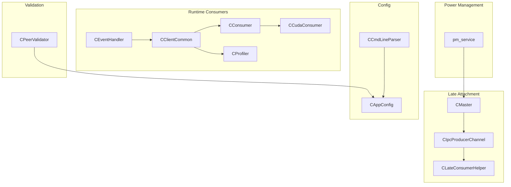
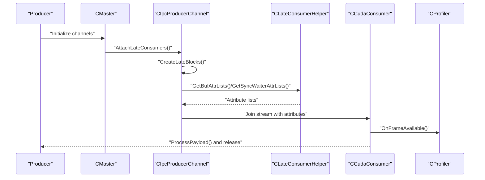
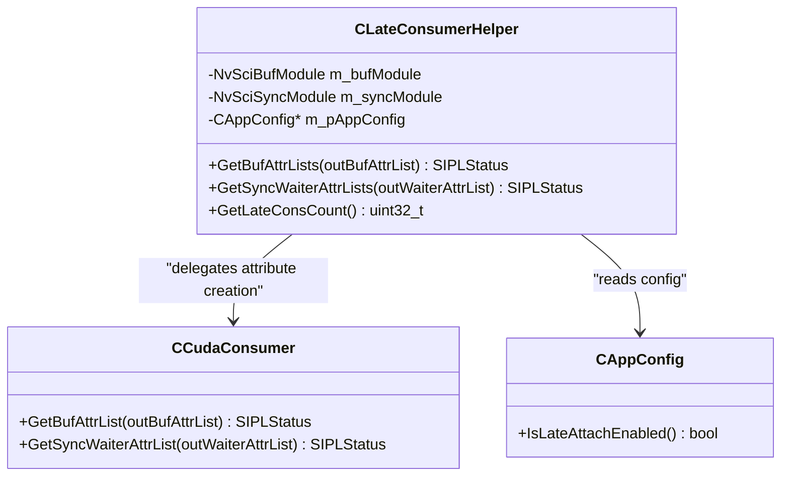
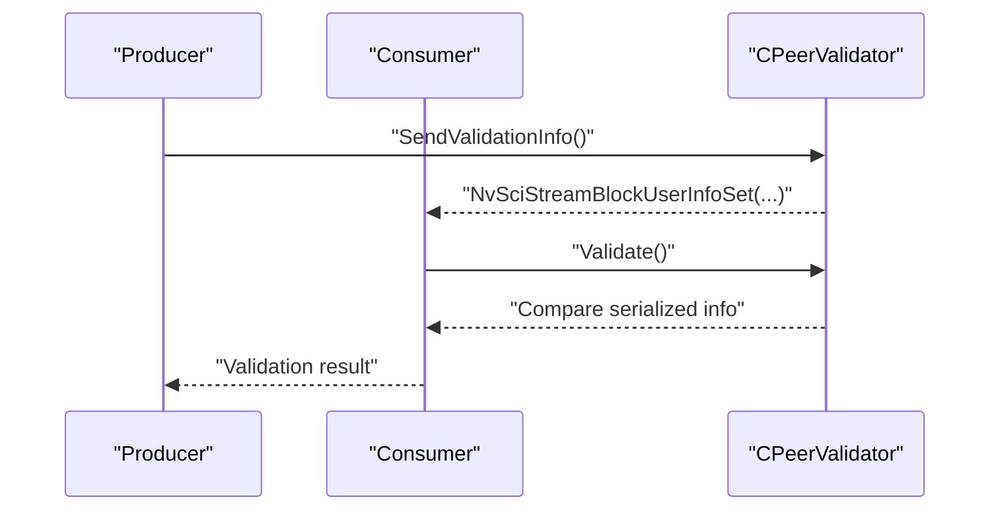
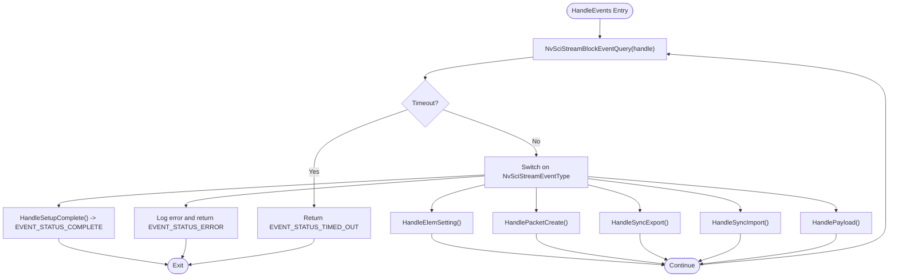
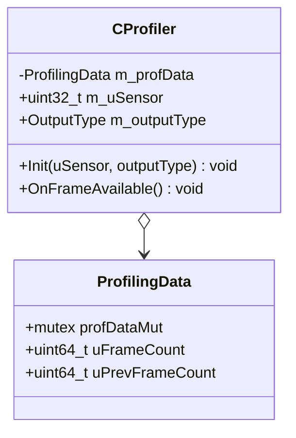
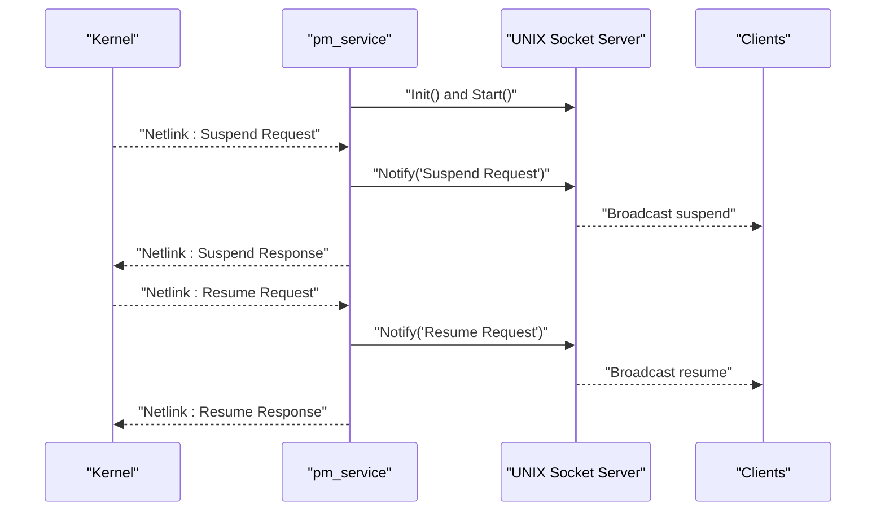
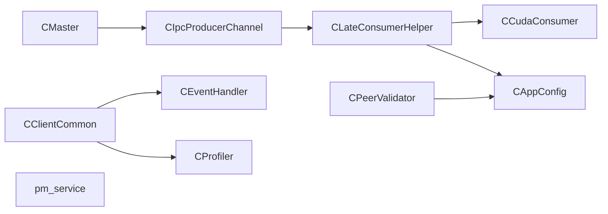

# Advanced Features

<cite>
**Referenced Files in This Document**
- [CLateConsumerHelper.hpp](file://multicast/CLateConsumerHelper.hpp)
- [CLateConsumerHelper.cpp](file://multicast/CLateConsumerHelper.cpp)
- [CPeerValidator.hpp](file://multicast/CPeerValidator.hpp)
- [CPeerValidator.cpp](file://multicast/CPeerValidator.cpp)
- [CEventHandler.hpp](file://multicast/CEventHandler.hpp)
- [CProfiler.hpp](file://multicast/CProfiler.hpp)
- [CAppConfig.hpp](file://multicast/CAppConfig.hpp)
- [CAppConfig.cpp](file://multicast/CAppConfig.cpp)
- [CCudaConsumer.hpp](file://multicast/CCudaConsumer.hpp)
- [CCudaConsumer.cpp](file://multicast/CCudaConsumer.cpp)
- [CConsumer.hpp](file://multicast/CConsumer.hpp)
- [CConsumer.cpp](file://multicast/CConsumer.cpp)
- [CClientCommon.hpp](file://multicast/CClientCommon.hpp)
- [CClientCommon.cpp](file://multicast/CClientCommon.cpp)
- [CIpcProducerChannel.hpp](file://multicast/CIpcProducerChannel.hpp)
- [CMaster.cpp](file://multicast/CMaster.cpp)
- [CCmdLineParser.cpp](file://multicast/CCmdLineParser.cpp)
- [pm_service.cpp](file://multicast/utils/pm_service.cpp)
</cite>

## Table of Contents
1. [Introduction](#introduction)
2. [Project Structure](#project-structure)
3. [Core Components](#core-components)
4. [Architecture Overview](#architecture-overview)
5. [Detailed Component Analysis](#detailed-component-analysis)
6. [Dependency Analysis](#dependency-analysis)
7. [Performance Considerations](#performance-considerations)
8. [Troubleshooting Guide](#troubleshooting-guide)
9. [Conclusion](#conclusion)
10. [Appendices](#appendices)

## Introduction
This document explains the advanced features of the NVIDIA SIPL Multicast system with a focus on:
- Dynamic consumer attachment and detachment during runtime via CLateConsumerHelper and channel orchestration
- Cross-process consumer-producer validation and configuration consistency via CPeerValidator
- Event-driven consumer management and system notifications via CEventHandler
- Performance monitoring and debugging via CProfiler
- Utility services for power management via pm_service

It provides implementation details, usage patterns, integration examples, and best practices for dynamic pipeline reconfiguration, cross-process validation, and performance optimization.

## Project Structure
The advanced features are implemented across several modules:
- Late consumer management: CLateConsumerHelper, CIpcProducerChannel, CMaster
- Validation: CPeerValidator
- Eventing: CEventHandler, CClientCommon, CConsumer
- Profiling: CProfiler
- Power management: pm_service
- Configuration: CAppConfig, CCmdLineParser

**Diagram sources**
- [CEventHandler.hpp:23-51](file://multicast/CEventHandler.hpp#L23-L51)
- [CClientCommon.hpp:47-199](file://multicast/CClientCommon.hpp#L47-L199)
- [CConsumer.hpp:16-43](file://multicast/CConsumer.hpp#L16-L43)
- [CCudaConsumer.hpp:25-78](file://multicast/CCudaConsumer.hpp#L25-L78)
- [CLateConsumerHelper.hpp:15-35](file://multicast/CLateConsumerHelper.hpp#L15-L35)
- [CIpcProducerChannel.hpp:205-233](file://multicast/CIpcProducerChannel.hpp#L205-L233)
- [CMaster.cpp:494-513](file://multicast/CMaster.cpp#L494-L513)
- [CPeerValidator.hpp:21-61](file://multicast/CPeerValidator.hpp#L21-L61)
- [CAppConfig.hpp:19-80](file://multicast/CAppConfig.hpp#L19-L80)
- [CCmdLineParser.cpp:66-82](file://multicast/CCmdLineParser.cpp#L66-L82)
- [pm_service.cpp:261-273](file://multicast/utils/pm_service.cpp#L261-L273)

**Section sources**
- [CEventHandler.hpp:15-51](file://multicast/CEventHandler.hpp#L15-L51)
- [CClientCommon.hpp:47-199](file://multicast/CClientCommon.hpp#L47-L199)
- [CConsumer.hpp:16-43](file://multicast/CConsumer.hpp#L16-L43)
- [CCudaConsumer.hpp:25-78](file://multicast/CCudaConsumer.hpp#L25-L78)
- [CLateConsumerHelper.hpp:15-35](file://multicast/CLateConsumerHelper.hpp#L15-L35)
- [CIpcProducerChannel.hpp:205-233](file://multicast/CIpcProducerChannel.hpp#L205-L233)
- [CMaster.cpp:494-513](file://multicast/CMaster.cpp#L494-L513)
- [CPeerValidator.hpp:21-61](file://multicast/CPeerValidator.hpp#L21-L61)
- [CAppConfig.hpp:19-80](file://multicast/CAppConfig.hpp#L19-L80)
- [CCmdLineParser.cpp:66-82](file://multicast/CCmdLineParser.cpp#L66-L82)
- [pm_service.cpp:261-273](file://multicast/utils/pm_service.cpp#L261-L273)

## Core Components
- CLateConsumerHelper: Provides late-attach capability by generating NvSciBuf/NvSciSync attribute lists for CUDA consumers and reporting late-consumer counts based on configuration.
- CPeerValidator: Exchanges and validates configuration metadata across process boundaries using NvSciStream user info APIs.
- CEventHandler: Base class for event-driven handling of NvSciStream events in clients.
- CProfiler: Lightweight frame counter for performance monitoring and debugging.
- pm_service: Power management utility service that listens for kernel suspend/resume events and notifies clients via UNIX domain sockets.

**Section sources**
- [CLateConsumerHelper.hpp:15-35](file://multicast/CLateConsumerHelper.hpp#L15-L35)
- [CLateConsumerHelper.cpp:13-49](file://multicast/CLateConsumerHelper.cpp#L13-L49)
- [CPeerValidator.hpp:21-61](file://multicast/CPeerValidator.hpp#L21-L61)
- [CPeerValidator.cpp:24-92](file://multicast/CPeerValidator.cpp#L24-L92)
- [CEventHandler.hpp:23-51](file://multicast/CEventHandler.hpp#L23-L51)
- [CProfiler.hpp:21-54](file://multicast/CProfiler.hpp#L21-L54)
- [pm_service.cpp:34-163](file://multicast/utils/pm_service.cpp#L34-L163)

## Architecture Overview
The advanced features integrate with the streaming pipeline as follows:
- Late consumer attachment is orchestrated by CMaster and CIpcProducerChannel, which create and connect additional consumer links after initial setup.
- CLateConsumerHelper supplies the necessary NvSci attributes for CUDA consumers to join the stream.
- CPeerValidator ensures producer and consumer configurations are consistent by exchanging serialized metadata.
- CEventHandler drives runtime event handling for setup, packet acquisition, and teardown.
- CProfiler integrates into the payload processing path to count frames.
- pm_service runs as a standalone service to coordinate power transitions.

**Diagram sources**
- [CMaster.cpp:494-513](file://multicast/CMaster.cpp#L494-L513)
- [CIpcProducerChannel.hpp:205-233](file://multicast/CIpcProducerChannel.hpp#L205-L233)
- [CLateConsumerHelper.cpp:13-49](file://multicast/CLateConsumerHelper.cpp#L13-L49)
- [CCudaConsumer.cpp:386-462](file://multicast/CCudaConsumer.cpp#L386-L462)
- [CProfiler.hpp:42-47](file://multicast/CProfiler.hpp#L42-L47)

## Detailed Component Analysis

### CLateConsumerHelper: Dynamic Consumer Late-Attach
CLateConsumerHelper enables adding consumers to an existing multicast session at runtime. It:
- Generates NvSciBuf attribute lists for data buffers
- Generates NvSciSync waiter attribute lists for synchronization
- Reports the number of late consumers based on configuration flags

Implementation highlights:
- Attribute list creation and population are delegated to CCudaConsumer helpers.
- Late consumer count is derived from CAppConfig’s late-attach flag.

**Diagram sources**
- [CLateConsumerHelper.hpp:15-35](file://multicast/CLateConsumerHelper.hpp#L15-L35)
- [CLateConsumerHelper.cpp:13-49](file://multicast/CLateConsumerHelper.cpp#L13-L49)
- [CCudaConsumer.hpp:32-33](file://multicast/CCudaConsumer.hpp#L32-L33)
- [CAppConfig.hpp:40-40](file://multicast/CAppConfig.hpp#L40-L40)

Usage pattern:
- Producer invokes channel-level late-attach orchestration.
- CLateConsumerHelper is queried for attribute lists and late-consumer count.
- Consumers are attached and integrated into the multicast graph.

Integration example:
- Late-attach is enabled via command-line and propagated to CAppConfig.
- Channel code checks readiness and creates/connects consumer blocks using the helper-provided attributes.

**Section sources**
- [CLateConsumerHelper.cpp:13-49](file://multicast/CLateConsumerHelper.cpp#L13-L49)
- [CAppConfig.hpp:40-40](file://multicast/CAppConfig.hpp#L40-L40)
- [CCmdLineParser.cpp:80-82](file://multicast/CCmdLineParser.cpp#L80-L82)
- [CIpcProducerChannel.hpp:205-233](file://multicast/CIpcProducerChannel.hpp#L205-L233)
- [CMaster.cpp:494-513](file://multicast/CMaster.cpp#L494-L513)

### CPeerValidator: Cross-Process Validation and Configuration Consistency
CPeerValidator serializes selected configuration fields into a compact string and exchanges them across processes using NvSciStream user info APIs. It:
- Sends validation info from the producer/consumer to the peer
- Validates that the peer’s configuration matches expectations
- Supports multi-element enablement and platform-specific flags

**Diagram sources**
- [CPeerValidator.cpp:24-63](file://multicast/CPeerValidator.cpp#L24-L63)
- [CPeerValidator.cpp:65-92](file://multicast/CPeerValidator.cpp#L65-L92)

Validation fields include:
- Static vs dynamic configuration selection
- Platform name
- Link masks
- Multi-elements enablement

**Section sources**
- [CPeerValidator.hpp:21-61](file://multicast/CPeerValidator.hpp#L21-L61)
- [CPeerValidator.cpp:24-92](file://multicast/CPeerValidator.cpp#L24-L92)
- [CAppConfig.cpp:21-75](file://multicast/CAppConfig.cpp#L21-L75)

### CEventHandler: Event-Driven Consumer Management
CEventHandler defines the interface for event-driven handling of NvSciStream events. CClientCommon extends it to:
- Query and dispatch events
- Drive element support, packet creation, sync export/import, and payload processing
- Transition to streaming phase upon setup completion

**Diagram sources**
- [CClientCommon.cpp:119-205](file://multicast/CClientCommon.cpp#L119-L205)

**Section sources**
- [CEventHandler.hpp:23-51](file://multicast/CEventHandler.hpp#L23-L51)
- [CClientCommon.cpp:119-205](file://multicast/CClientCommon.cpp#L119-L205)

### CProfiler: Performance Monitoring and Debugging
CProfiler maintains a simple frame counter per sensor and output type. It is integrated into the consumer payload path to increment counters when frames become available.

**Diagram sources**
- [CProfiler.hpp:21-54](file://multicast/CProfiler.hpp#L21-L54)

Usage pattern:
- Initialize profiler with sensor ID and output type
- Increment counter on each frame arrival
- Use counters for throughput monitoring and debugging

**Section sources**
- [CProfiler.hpp:31-47](file://multicast/CProfiler.hpp#L31-L47)
- [CConsumer.cpp:33-35](file://multicast/CConsumer.cpp#L33-L35)

### pm_service: Power Management Utility
pm_service is a standalone utility that:
- Listens for kernel power management netlink messages
- Registers interest and responds to suspend/resume requests
- Notifies connected clients via UNIX domain socket and waits for acknowledgment

**Diagram sources**
- [pm_service.cpp:220-258](file://multicast/utils/pm_service.cpp#L220-L258)
- [pm_service.cpp:51-163](file://multicast/utils/pm_service.cpp#L51-L163)

**Section sources**
- [pm_service.cpp:261-273](file://multicast/utils/pm_service.cpp#L261-L273)

## Dependency Analysis
- CLateConsumerHelper depends on CCudaConsumer for attribute list generation and CAppConfig for runtime flags.
- CIpcProducerChannel orchestrates late-attach and uses CLateConsumerHelper to populate attributes.
- CMaster coordinates channel operations and exposes detach APIs for consumers.
- CPeerValidator depends on CAppConfig for configuration serialization and NvSciStream user info APIs.
- CClientCommon integrates CEventHandler and CProfiler into the event loop and payload processing.
- pm_service is independent and communicates via UNIX sockets and netlink.

**Diagram sources**
- [CLateConsumerHelper.cpp:13-49](file://multicast/CLateConsumerHelper.cpp#L13-L49)
- [CCudaConsumer.cpp:112-171](file://multicast/CCudaConsumer.cpp#L112-L171)
- [CIpcProducerChannel.hpp:205-233](file://multicast/CIpcProducerChannel.hpp#L205-L233)
- [CMaster.cpp:494-513](file://multicast/CMaster.cpp#L494-L513)
- [CPeerValidator.cpp:24-63](file://multicast/CPeerValidator.cpp#L24-L63)
- [CClientCommon.cpp:119-205](file://multicast/CClientCommon.cpp#L119-L205)
- [CProfiler.hpp:31-47](file://multicast/CProfiler.hpp#L31-L47)
- [pm_service.cpp:220-258](file://multicast/utils/pm_service.cpp#L220-L258)

**Section sources**
- [CLateConsumerHelper.cpp:13-49](file://multicast/CLateConsumerHelper.cpp#L13-L49)
- [CCudaConsumer.cpp:112-171](file://multicast/CCudaConsumer.cpp#L112-L171)
- [CIpcProducerChannel.hpp:205-233](file://multicast/CIpcProducerChannel.hpp#L205-L233)
- [CMaster.cpp:494-513](file://multicast/CMaster.cpp#L494-L513)
- [CPeerValidator.cpp:24-63](file://multicast/CPeerValidator.cpp#L24-L63)
- [CClientCommon.cpp:119-205](file://multicast/CClientCommon.cpp#L119-L205)
- [CProfiler.hpp:31-47](file://multicast/CProfiler.hpp#L31-L47)
- [pm_service.cpp:220-258](file://multicast/utils/pm_service.cpp#L220-L258)

## Performance Considerations
- Late consumer attachment adds overhead during attribute reconciliation and sync object allocation; batch attach when possible.
- Profiling counters are guarded by mutexes; minimize contention by aggregating metrics externally if high-frequency sampling is required.
- Event handling loops should avoid blocking operations; delegate heavy work to worker threads.
- Power management notifications should be handled asynchronously to prevent blocking the main event loop.

[No sources needed since this section provides general guidance]

## Troubleshooting Guide
Common issues and remedies:
- Late-attach fails silently: Verify that late-attach is enabled in configuration and that the channel is ready for late attachment.
- Validation mismatch: Ensure both producer and consumer serialize identical configuration keys and values; check masks and platform names.
- Event timeouts: Increase query timeouts or reduce workload in the event loop; ensure proper event dispatch.
- Profiler not counting: Confirm that OnFrameAvailable is invoked from the payload path and that the profiler is initialized with correct sensor/output type.
- Power notifications not received: Confirm UNIX socket path permissions and that the service is running; verify netlink registration and message routing.

**Section sources**
- [CIpcProducerChannel.hpp:205-233](file://multicast/CIpcProducerChannel.hpp#L205-L233)
- [CPeerValidator.cpp:37-63](file://multicast/CPeerValidator.cpp#L37-L63)
- [CClientCommon.cpp:119-205](file://multicast/CClientCommon.cpp#L119-L205)
- [CProfiler.hpp:31-47](file://multicast/CProfiler.hpp#L31-L47)
- [pm_service.cpp:51-163](file://multicast/utils/pm_service.cpp#L51-L163)

## Conclusion
The advanced features in the NVIDIA SIPL Multicast system enable dynamic pipeline reconfiguration, robust cross-process validation, responsive event-driven management, and practical performance monitoring. By leveraging CLateConsumerHelper, CPeerValidator, CEventHandler, CProfiler, and pm_service, developers can build flexible, validated, and observable streaming systems suitable for production environments.

[No sources needed since this section summarizes without analyzing specific files]

## Appendices

### Integration Examples

- Dynamic pipeline reconfiguration (late attach):
  - Enable late-attach via command-line and propagate to CAppConfig.
  - Invoke channel-level late-attach; the channel queries CLateConsumerHelper for attributes and connects new consumers.

- Cross-process validation:
  - Serialize configuration fields using CPeerValidator and exchange via NvSciStream user info.
  - Validate on the peer side and fail fast on mismatches.

- Event-driven consumer management:
  - Implement CEventHandler-derived handlers to process NvSciStream events and integrate with CClientCommon’s event loop.

- Performance optimization:
  - Use CProfiler to monitor frame rates; correlate with event loop timings and payload processing durations.
  - Offload heavy operations from the event thread to worker threads.

- Power management:
  - Run pm_service to receive kernel power events and notify clients; ensure clients acknowledge to avoid deadlocks.

**Section sources**
- [CCmdLineParser.cpp:80-82](file://multicast/CCmdLineParser.cpp#L80-L82)
- [CIpcProducerChannel.hpp:205-233](file://multicast/CIpcProducerChannel.hpp#L205-L233)
- [CLateConsumerHelper.cpp:13-49](file://multicast/CLateConsumerHelper.cpp#L13-L49)
- [CPeerValidator.cpp:24-63](file://multicast/CPeerValidator.cpp#L24-L63)
- [CClientCommon.cpp:119-205](file://multicast/CClientCommon.cpp#L119-L205)
- [CProfiler.hpp:31-47](file://multicast/CProfiler.hpp#L31-L47)
- [pm_service.cpp:220-258](file://multicast/utils/pm_service.cpp#L220-L258)