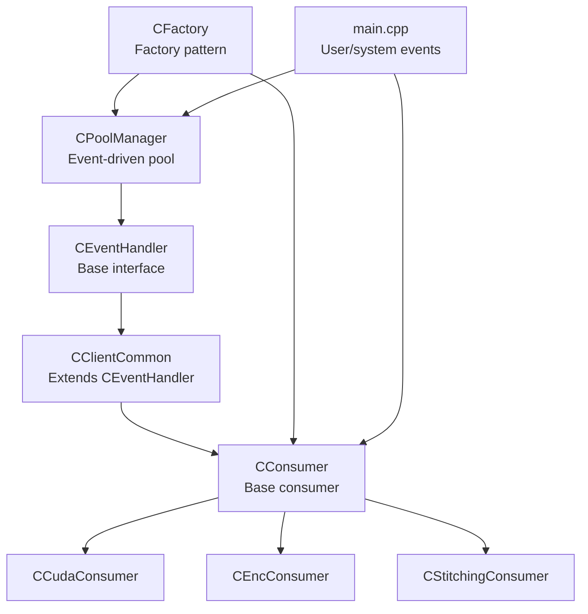
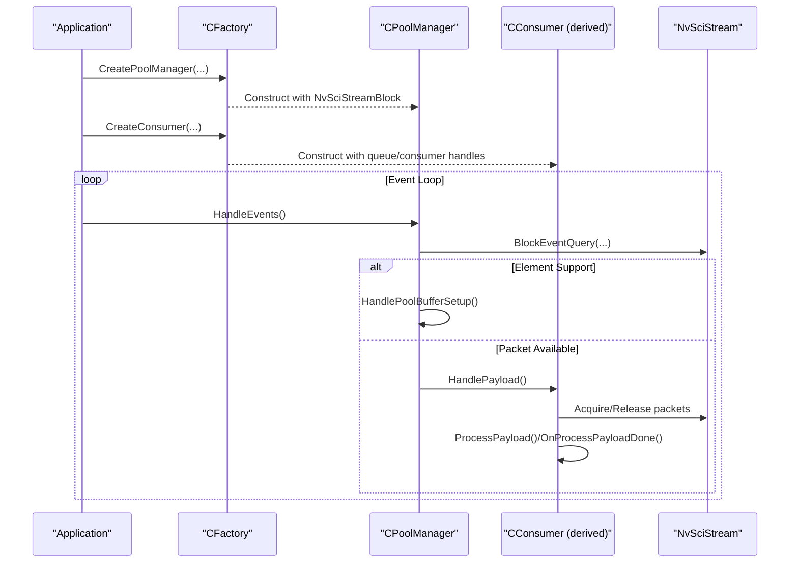
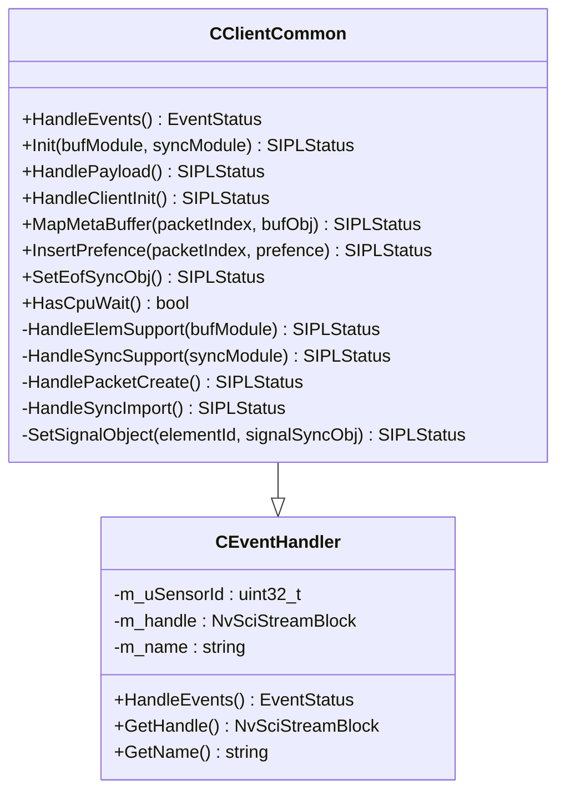
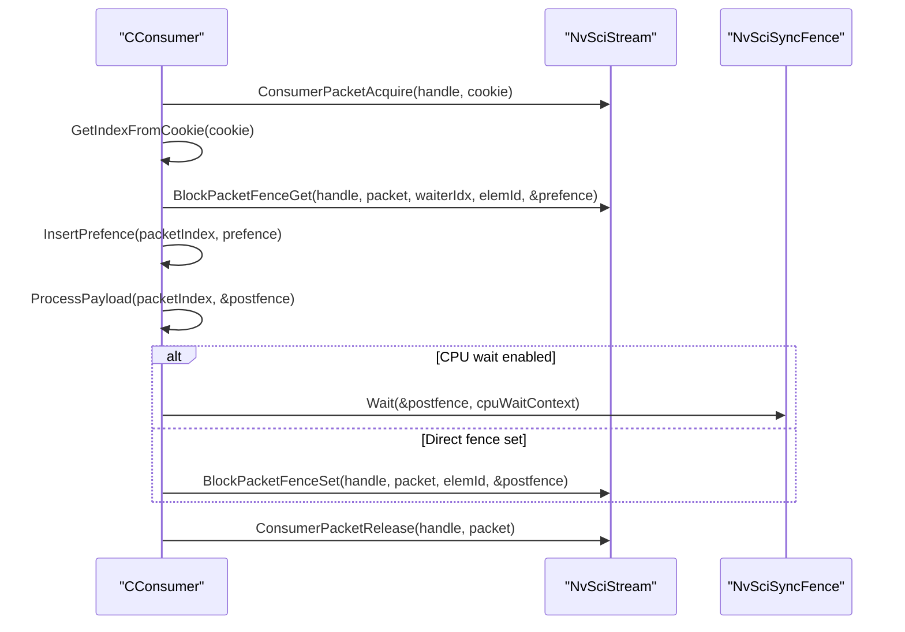
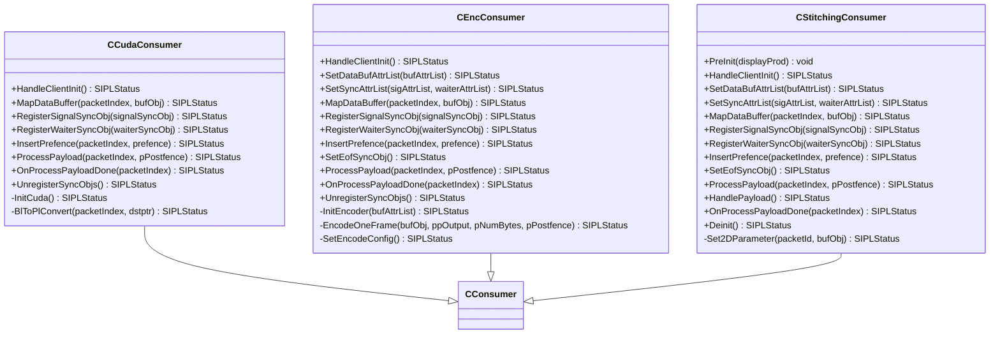
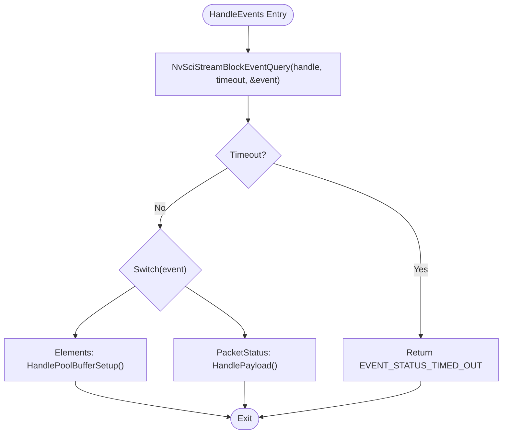
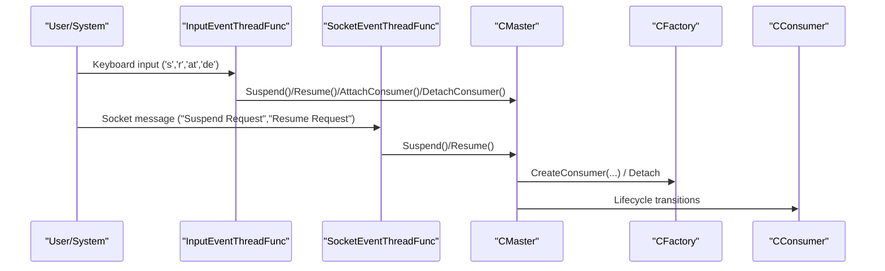
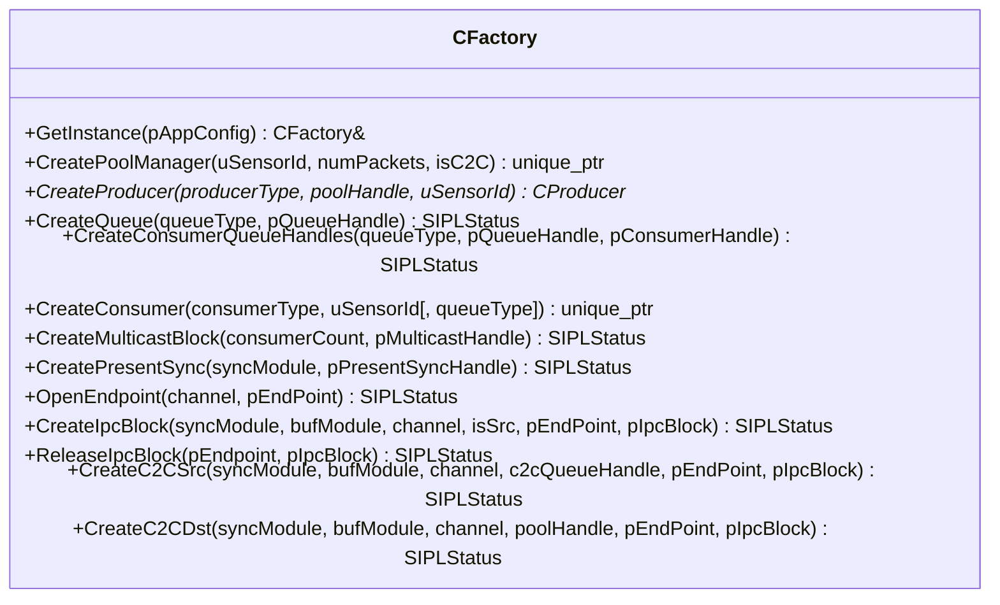
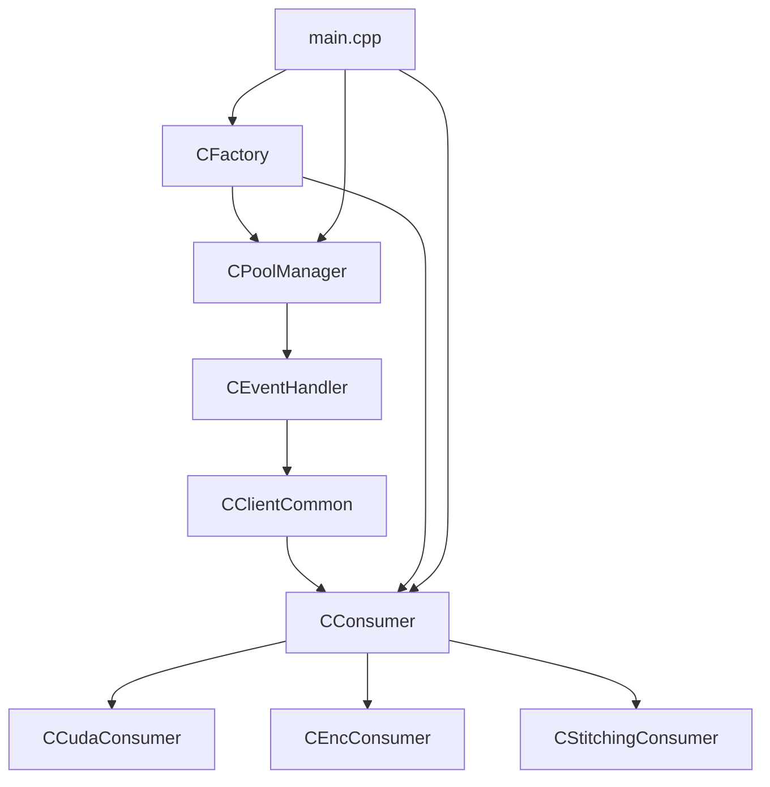

# Event Handler

<cite>
**Referenced Files in This Document**
- [CEventHandler.hpp](file://CEventHandler.hpp)
- [CClientCommon.hpp](file://CClientCommon.hpp)
- [CConsumer.hpp](file://CConsumer.hpp)
- [CConsumer.cpp](file://CConsumer.cpp)
- [CCudaConsumer.hpp](file://CCudaConsumer.hpp)
- [CCudaConsumer.cpp](file://CCudaConsumer.cpp)
- [CEncConsumer.hpp](file://CEncConsumer.hpp)
- [CEncConsumer.cpp](file://CEncConsumer.cpp)
- [CStitchingConsumer.hpp](file://CStitchingConsumer.hpp)
- [CPoolManager.hpp](file://CPoolManager.hpp)
- [CPoolManager.cpp](file://CPoolManager.cpp)
- [CFactory.hpp](file://CFactory.hpp)
- [CFactory.cpp](file://CFactory.cpp)
- [main.cpp](file://main.cpp)
- [CAppConfig.hpp](file://CAppConfig.hpp)
</cite>

## Table of Contents
1. [Introduction](#introduction)
2. [Project Structure](#project-structure)
3. [Core Components](#core-components)
4. [Architecture Overview](#architecture-overview)
5. [Detailed Component Analysis](#detailed-component-analysis)
6. [Dependency Analysis](#dependency-analysis)
7. [Performance Considerations](#performance-considerations)
8. [Troubleshooting Guide](#troubleshooting-guide)
9. [Conclusion](#conclusion)
10. [Appendices](#appendices)

## Introduction
This document explains the event handler system in the NVIDIA SIPL Multicast architecture. It focuses on the CEventHandler interface and its implementation for event-driven consumer management and system notifications. The event-driven architecture enables asynchronous lifecycle management of consumers, system state changes, and notification delivery via NvSciStream blocks. The document also covers event types, registration mechanisms, callback handling, integration with the consumer framework, and practical examples using the factory pattern for dynamic consumer creation and management.

## Project Structure
The event handling system spans several core files:
- CEventHandler defines the base interface for event-driven components.
- CClientCommon extends CEventHandler and orchestrates initialization, synchronization, and payload processing for consumers.
- CConsumer and its derived classes (e.g., CCudaConsumer, CEncConsumer, CStitchingConsumer) implement the streaming pipeline and event callbacks.
- CPoolManager demonstrates event-driven handling for pool and multicast blocks.
- CFactory provides dynamic creation of producers, consumers, queues, and IPC blocks, integrating with the event-driven model.
- main.cpp wires user/system events (keyboard and socket) to application control and integrates with the master orchestration.

**Diagram sources**
- [CEventHandler.hpp:23-51](file://CEventHandler.hpp#L23-L51)
- [CClientCommon.hpp:47-199](file://CClientCommon.hpp#L47-L199)
- [CConsumer.hpp:16-43](file://CConsumer.hpp#L16-L43)
- [CCudaConsumer.hpp:25-78](file://CCudaConsumer.hpp#L25-L78)
- [CEncConsumer.hpp:17-64](file://CEncConsumer.hpp#L17-L64)
- [CStitchingConsumer.hpp:17-73](file://CStitchingConsumer.hpp#L17-L73)
- [CPoolManager.hpp:33-41](file://CPoolManager.hpp#L33-L41)
- [CFactory.hpp:27-92](file://CFactory.hpp#L27-L92)
- [main.cpp:74-153](file://main.cpp#L74-L153)

**Section sources**
- [CEventHandler.hpp:23-51](file://CEventHandler.hpp#L23-L51)
- [CClientCommon.hpp:47-199](file://CClientCommon.hpp#L47-L199)
- [CConsumer.hpp:16-43](file://CConsumer.hpp#L16-L43)
- [CCudaConsumer.hpp:25-78](file://CCudaConsumer.hpp#L25-L78)
- [CEncConsumer.hpp:17-64](file://CEncConsumer.hpp#L17-L64)
- [CStitchingConsumer.hpp:17-73](file://CStitchingConsumer.hpp#L17-L73)
- [CPoolManager.hpp:33-41](file://CPoolManager.hpp#L33-L41)
- [CFactory.hpp:27-92](file://CFactory.hpp#L27-L92)
- [main.cpp:74-153](file://main.cpp#L74-L153)

## Core Components
- CEventHandler: Base interface defining the HandleEvents method and exposing the NvSciStreamBlock handle and component name. It encapsulates the event-driven contract for all components.
- CClientCommon: Extends CEventHandler to coordinate initialization, attribute reconciliation, synchronization, and payload processing. It exposes virtual hooks for derived consumers to implement specialized behavior.
- CConsumer: Base consumer class implementing the streaming loop, packet acquisition, fence handling, payload processing, and release semantics.
- Derived Consumers: CCudaConsumer, CEncConsumer, and CStitchingConsumer specialize buffer mapping, synchronization, and payload processing for their domains.
- CPoolManager: Demonstrates event-driven handling for pool and multicast blocks, reacting to element support and packet availability events.
- CFactory: Provides factory methods to dynamically create producers, consumers, queues, and IPC blocks, enabling runtime composition of the streaming topology.

**Section sources**
- [CEventHandler.hpp:23-51](file://CEventHandler.hpp#L23-L51)
- [CClientCommon.hpp:47-199](file://CClientCommon.hpp#L47-L199)
- [CConsumer.hpp:16-43](file://CConsumer.hpp#L16-L43)
- [CConsumer.cpp:17-94](file://CConsumer.cpp#L17-L94)
- [CCudaConsumer.hpp:25-78](file://CCudaConsumer.hpp#L25-L78)
- [CEncConsumer.hpp:17-64](file://CEncConsumer.hpp#L17-L64)
- [CStitchingConsumer.hpp:17-73](file://CStitchingConsumer.hpp#L17-L73)
- [CPoolManager.hpp:33-41](file://CPoolManager.hpp#L33-L41)
- [CPoolManager.cpp:41-100](file://CPoolManager.cpp#L41-L100)
- [CFactory.hpp:27-92](file://CFactory.hpp#L27-L92)
- [CFactory.cpp:11-22](file://CFactory.cpp#L11-L22)

## Architecture Overview
The event-driven architecture leverages NvSciStream blocks to deliver asynchronous events to components. Components register with NvSciStream and react to events such as element support negotiation, packet availability, and synchronization signals. The CEventHandler interface standardizes event handling across components, while CClientCommon coordinates the consumer lifecycle and payload processing.

**Diagram sources**
- [CFactory.cpp:11-22](file://CFactory.cpp#L11-L22)
- [CFactory.cpp:166-205](file://CFactory.cpp#L166-L205)
- [CPoolManager.cpp:41-100](file://CPoolManager.cpp#L41-L100)
- [CConsumer.cpp:17-94](file://CConsumer.cpp#L17-L94)

## Detailed Component Analysis

### CEventHandler and CClientCommon
- CEventHandler defines the HandleEvents contract and exposes the NvSciStreamBlock handle and component name. It is extended by CClientCommon to integrate with the consumer pipeline.
- CClientCommon adds lifecycle hooks for initialization, attribute reconciliation, synchronization, and payload processing. It manages packet cookies, metadata buffers, and synchronization objects.

**Diagram sources**
- [CEventHandler.hpp:23-51](file://CEventHandler.hpp#L23-L51)
- [CClientCommon.hpp:47-199](file://CClientCommon.hpp#L47-L199)

**Section sources**
- [CEventHandler.hpp:23-51](file://CEventHandler.hpp#L23-L51)
- [CClientCommon.hpp:47-199](file://CClientCommon.hpp#L47-L199)

### Consumer Lifecycle and Payload Processing
- CConsumer implements the streaming loop: acquire a packet, optionally filter frames, wait on pre-fences, process payload, set post-fences, and release the packet.
- Derived consumers override buffer mapping, synchronization, and payload processing to meet domain-specific needs.

**Diagram sources**
- [CConsumer.cpp:17-94](file://CConsumer.cpp#L17-L94)

**Section sources**
- [CConsumer.hpp:16-43](file://CConsumer.hpp#L16-L43)
- [CConsumer.cpp:17-94](file://CConsumer.cpp#L17-L94)

### Derived Consumers: Specialized Event Handling
- CCudaConsumer: Manages CUDA streams and semaphores, converts block-linear to pitch-linear buffers, performs optional inference, and dumps frames to disk.
- CEncConsumer: Integrates with NvMedia IEP to encode frames, registers NvSciBuf/NvSciSync objects, and writes encoded output.
- CStitchingConsumer: Coordinates 2D compositing with a display producer, manages destination buffers, and composes frames.

**Diagram sources**
- [CCudaConsumer.hpp:25-78](file://CCudaConsumer.hpp#L25-L78)
- [CCudaConsumer.cpp:11-492](file://CCudaConsumer.cpp#L11-L492)
- [CEncConsumer.hpp:17-64](file://CEncConsumer.hpp#L17-L64)
- [CEncConsumer.cpp:12-356](file://CEncConsumer.cpp#L12-L356)
- [CStitchingConsumer.hpp:17-73](file://CStitchingConsumer.hpp#L17-L73)

**Section sources**
- [CCudaConsumer.hpp:25-78](file://CCudaConsumer.hpp#L25-L78)
- [CCudaConsumer.cpp:11-492](file://CCudaConsumer.cpp#L11-L492)
- [CEncConsumer.hpp:17-64](file://CEncConsumer.hpp#L17-L64)
- [CEncConsumer.cpp:12-356](file://CEncConsumer.cpp#L12-L356)
- [CStitchingConsumer.hpp:17-73](file://CStitchingConsumer.hpp#L17-L73)

### Event Types and Registration Mechanisms
- Event types observed in the codebase include element support negotiation and packet availability. Components register with NvSciStream and poll/query for events using NvSciStreamBlockEventQuery.
- Registration mechanisms include setting buffer/sync attribute lists, importing/exporting synchronization objects, and mapping NvSciBuf objects to device memory.

**Diagram sources**
- [CPoolManager.cpp:41-100](file://CPoolManager.cpp#L41-L100)

**Section sources**
- [CPoolManager.cpp:41-100](file://CPoolManager.cpp#L41-L100)
- [CClientCommon.hpp:103-159](file://CClientCommon.hpp#L103-L159)

### Callback Handling for System Events
- System events originate from user input and external services. The main application sets up threads to listen for keyboard input and socket messages, translating them into application control actions such as suspend/resume and attach/detach consumers.
- These actions are delegated to the master orchestration component, which coordinates the factory and consumers accordingly.

**Diagram sources**
- [main.cpp:74-153](file://main.cpp#L74-L153)

**Section sources**
- [main.cpp:74-153](file://main.cpp#L74-L153)

### Integration with the Factory Pattern
- CFactory centralizes creation of pools, queues, consumers, and IPC blocks. It encapsulates NvSciStream and NvSciBuf/NvSciSync module usage, returning RAII-managed smart pointers for safe resource handling.
- Dynamic consumer management is achieved by invoking factory methods to create or destroy consumers and by coordinating with the master orchestration for attach/detach operations.

**Diagram sources**
- [CFactory.hpp:27-92](file://CFactory.hpp#L27-L92)
- [CFactory.cpp:11-315](file://CFactory.cpp#L11-L315)

**Section sources**
- [CFactory.hpp:27-92](file://CFactory.hpp#L27-L92)
- [CFactory.cpp:11-315](file://CFactory.cpp#L11-L315)

### Practical Examples
- Real-time event processing: Implement HandleEvents in a derived component to react to NvSciStream events and drive downstream processing.
- Consumer state change notifications: Use CClientCommon hooks (e.g., HandleSetupComplete, OnProcessPayloadDone) to notify observers or update internal state.
- System monitoring through event-driven architecture: Integrate with main.cpp’s input/socket threads to translate user/system events into application control and logging.

**Section sources**
- [CClientCommon.hpp:66-102](file://CClientCommon.hpp#L66-L102)
- [CConsumer.cpp:86-94](file://CConsumer.cpp#L86-L94)
- [main.cpp:74-153](file://main.cpp#L74-L153)

## Dependency Analysis
The event handler system exhibits clear separation of concerns:
- CEventHandler is the foundation for all event-driven components.
- CClientCommon depends on NvSciStream/NvSciBuf/NvSciSync modules and coordinates consumer lifecycle.
- Derived consumers depend on domain-specific libraries (CUDA, NvMedia IEP, 2D compositing).
- CPoolManager depends on CEventHandler and reacts to pool/multicast events.
- CFactory encapsulates creation logic and hides NvSci complexities from higher layers.

**Diagram sources**
- [CEventHandler.hpp:23-51](file://CEventHandler.hpp#L23-L51)
- [CClientCommon.hpp:47-199](file://CClientCommon.hpp#L47-L199)
- [CConsumer.hpp:16-43](file://CConsumer.hpp#L16-L43)
- [CCudaConsumer.hpp:25-78](file://CCudaConsumer.hpp#L25-L78)
- [CEncConsumer.hpp:17-64](file://CEncConsumer.hpp#L17-L64)
- [CStitchingConsumer.hpp:17-73](file://CStitchingConsumer.hpp#L17-L73)
- [CPoolManager.hpp:33-41](file://CPoolManager.hpp#L33-L41)
- [CFactory.hpp:27-92](file://CFactory.hpp#L27-L92)
- [main.cpp:74-153](file://main.cpp#L74-L153)

**Section sources**
- [CEventHandler.hpp:23-51](file://CEventHandler.hpp#L23-L51)
- [CClientCommon.hpp:47-199](file://CClientCommon.hpp#L47-L199)
- [CConsumer.hpp:16-43](file://CConsumer.hpp#L16-L43)
- [CCudaConsumer.hpp:25-78](file://CCudaConsumer.hpp#L25-L78)
- [CEncConsumer.hpp:17-64](file://CEncConsumer.hpp#L17-L64)
- [CStitchingConsumer.hpp:17-73](file://CStitchingConsumer.hpp#L17-L73)
- [CPoolManager.hpp:33-41](file://CPoolManager.hpp#L33-L41)
- [CFactory.hpp:27-92](file://CFactory.hpp#L27-L92)
- [main.cpp:74-153](file://main.cpp#L74-L153)

## Performance Considerations
- Asynchronous event polling: Use non-blocking event queries to avoid stalling the pipeline. Return appropriate EventStatus values to indicate timeouts or errors.
- Fence-based synchronization: Prefer device-side waits (e.g., CUDA external semaphore waits) to minimize CPU overhead when possible.
- Frame filtering: Apply frame filters early to reduce unnecessary processing and memory copies.
- Buffer mapping: Reuse mapped buffers and avoid repeated import/unimport cycles to reduce overhead.
- Factory resource management: Use RAII-managed smart pointers to ensure timely cleanup of NvSci resources.

[No sources needed since this section provides general guidance]

## Troubleshooting Guide
- Event query timeouts: If HandleEvents returns a timeout, investigate NvSciStream block readiness and consumer/producer alignment.
- Fence errors: Verify pre-fence insertion and post-fence signaling sequences. Ensure CPU wait contexts are configured when required.
- Attribute reconciliation failures: Confirm that buffer/sync attribute lists are properly populated and reconciled before packet processing.
- Consumer lifecycle issues: Validate initialization order (Init -> HandleSetupComplete -> HandlePayload) and ensure proper deinitialization.

**Section sources**
- [CPoolManager.cpp:47-55](file://CPoolManager.cpp#L47-L55)
- [CConsumer.cpp:56-84](file://CConsumer.cpp#L56-L84)
- [CClientCommon.hpp:103-159](file://CClientCommon.hpp#L103-L159)

## Conclusion
The event handler system in NVIDIA SIPL Multicast provides a robust, modular foundation for asynchronous consumer management and system notifications. By leveraging CEventHandler and CClientCommon, the architecture cleanly separates event-driven concerns from domain-specific logic. The factory pattern enables dynamic, runtime composition of producers and consumers, while integration with user/system events supports flexible operational control. Following the best practices outlined here ensures reliable, high-performance event-driven processing across diverse use cases.

[No sources needed since this section summarizes without analyzing specific files]

## Appendices

### Event Status Enum
- EVENT_STATUS_OK: Normal completion.
- EVENT_STATUS_COMPLETE: Operation completed successfully.
- EVENT_STATUS_TIMED_OUT: Event query timed out.
- EVENT_STATUS_ERROR: Event query failed.

**Section sources**
- [CEventHandler.hpp:15-21](file://CEventHandler.hpp#L15-L21)

### Configuration and Runtime Controls
- Application configuration influences consumer types, queue types, and runtime behaviors such as frame filtering and file dumping.
- Command-line parsing populates CAppConfig, which is consumed by the factory and consumers.

**Section sources**
- [CAppConfig.hpp:19-82](file://CAppConfig.hpp#L19-L82)
- [main.cpp:253-288](file://main.cpp#L253-L288)