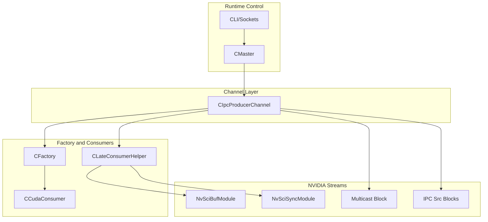
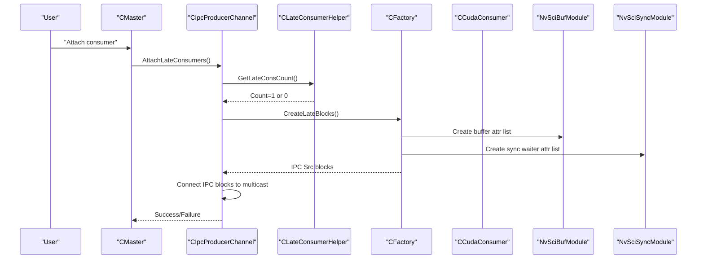
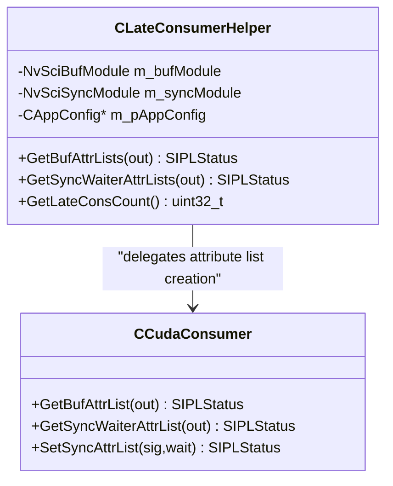
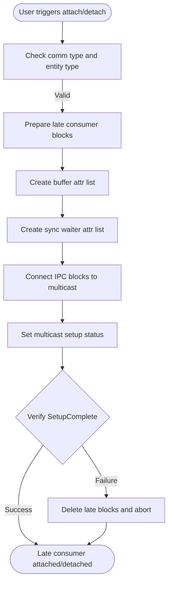
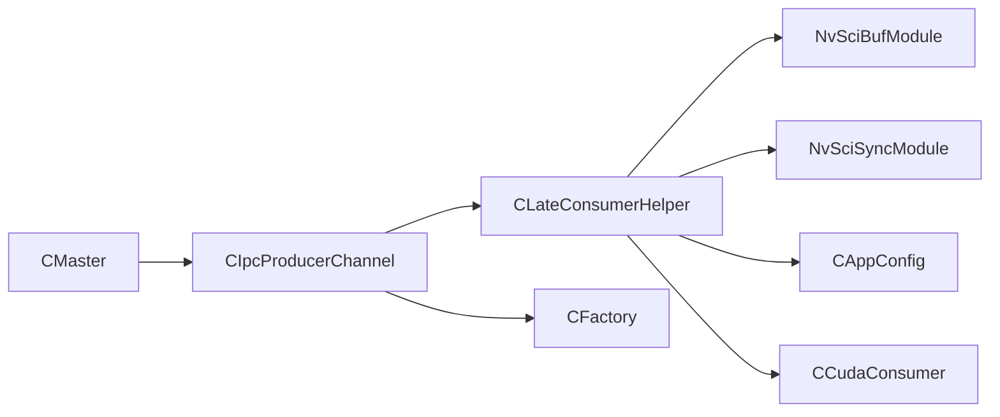

# Late Consumer Attachment

<cite>
**Referenced Files in This Document**
- [CLateConsumerHelper.hpp](file://CLateConsumerHelper.hpp)
- [CLateConsumerHelper.cpp](file://CLateConsumerHelper.cpp)
- [CCudaConsumer.hpp](file://CCudaConsumer.hpp)
- [CCudaConsumer.cpp](file://CCudaConsumer.cpp)
- [CFactory.hpp](file://CFactory.hpp)
- [CFactory.cpp](file://CFactory.cpp)
- [CAppConfig.hpp](file://CAppConfig.hpp)
- [CAppConfig.cpp](file://CAppConfig.cpp)
- [CMaster.hpp](file://CMaster.hpp)
- [CMaster.cpp](file://CMaster.cpp)
- [CIpcProducerChannel.hpp](file://CIpcProducerChannel.hpp)
- [CSiplCamera.hpp](file://CSiplCamera.hpp)
- [main.cpp](file://main.cpp)
</cite>

## Table of Contents
1. [Introduction](#introduction)
2. [Project Structure](#project-structure)
3. [Core Components](#core-components)
4. [Architecture Overview](#architecture-overview)
5. [Detailed Component Analysis](#detailed-component-analysis)
6. [Dependency Analysis](#dependency-analysis)
7. [Performance Considerations](#performance-considerations)
8. [Troubleshooting Guide](#troubleshooting-guide)
9. [Conclusion](#conclusion)
10. [Appendices](#appendices)

## Introduction
This document explains the late consumer attachment feature in the NVIDIA SIPL Multicast system. It focuses on the CLateConsumerHelper class and its role in enabling dynamic consumer attachment and detachment during runtime. The documentation covers:
- Late-attach workflow and integration points
- Buffer attribute list and synchronization waiter attribute list management
- Consumer count tracking via application configuration
- Integration with NvSciBufModule and NvSciSyncModule for cross-process synchronization
- Practical scenarios: dynamic addition/removal, runtime pipeline reconfiguration, and factory-based consumer creation
- Troubleshooting and performance considerations

## Project Structure
The late consumer attachment feature spans several modules:
- CLateConsumerHelper: encapsulates late-attach resource preparation and consumer count logic
- CCudaConsumer: provides buffer and sync attribute list construction for CUDA consumers
- CFactory: creates consumers and NvSciStream blocks; integrates CLateConsumerHelper
- CIpcProducerChannel: orchestrates late consumer attach/detach and NvSciStream block connections
- CMaster: exposes user-triggered attach/detach actions
- CAppConfig: controls late-attach enablement and consumer counts

**Diagram sources**
- [CMaster.cpp:494-513](file://CMaster.cpp#L494-L513)
- [CIpcProducerChannel.hpp:205-272](file://CIpcProducerChannel.hpp#L205-L272)
- [CLateConsumerHelper.cpp:13-44](file://CLateConsumerHelper.cpp#L13-L44)
- [CFactory.cpp:166-205](file://CFactory.cpp#L166-L205)
- [CCudaConsumer.cpp:112-171](file://CCudaConsumer.cpp#L112-L171)

**Section sources**
- [CMaster.hpp:47-65](file://CMaster.hpp#L47-L65)
- [CMaster.cpp:494-513](file://CMaster.cpp#L494-L513)
- [CIpcProducerChannel.hpp:205-272](file://CIpcProducerChannel.hpp#L205-L272)
- [CLateConsumerHelper.hpp:15-35](file://CLateConsumerHelper.hpp#L15-L35)
- [CLateConsumerHelper.cpp:13-49](file://CLateConsumerHelper.cpp#L13-L49)
- [CFactory.hpp:27-92](file://CFactory.hpp#L27-L92)
- [CFactory.cpp:166-205](file://CFactory.cpp#L166-L205)
- [CCudaConsumer.hpp:25-81](file://CCudaConsumer.hpp#L25-L81)
- [CCudaConsumer.cpp:112-171](file://CCudaConsumer.cpp#L112-L171)

## Core Components
- CLateConsumerHelper
  - Purpose: Provides late-attach resource attribute lists and consumer count logic
  - Methods:
    - GetBufAttrLists(out): builds a single NvSciBufAttrList for CUDA consumers
    - GetSyncWaiterAttrLists(out): builds a single NvSciSyncAttrList for CUDA consumers
    - GetLateConsCount(): returns 1 if late-attach enabled, else 0
  - Dependencies: NvSciBufModule, NvSciSyncModule, CAppConfig

- CCudaConsumer
  - Purpose: Implements buffer and sync attribute list construction for CUDA consumers
  - Methods:
    - GetBufAttrList(out): sets image type, GPU ID, permissions, and CPU access flags
    - GetSyncWaiterAttrList(out): queries CUDA-specific waiter attributes
    - SetSyncAttrList(signaler, waiter): queries CUDA-specific signaler/waiter attributes

- CFactory
  - Purpose: Creates consumers and NvSciStream blocks; integrates CLateConsumerHelper
  - Methods:
    - CreateConsumer(...): constructs a consumer with queue and elements info
    - CreateMulticastBlock(count): creates multicast block sized for configured consumer count
    - CreatePresentSync(syncModule, handle): creates present sync block

- CIpcProducerChannel
  - Purpose: Manages late consumer attach/detach and connects IPC blocks to multicast
  - Methods:
    - AttachLateConsumers(): creates and connects late consumer IPC blocks
    - DetachLateConsumers(): disconnects and releases late consumer IPC blocks
    - CreateLateBlocks()/DeleteLateBlocks(): manages IPC resources

- CMaster
  - Purpose: Exposes CLI-driven attach/detach commands for producers
  - Methods:
    - AttachConsumer()/DetachConsumer(): triggers channel-level late-attach operations

**Section sources**
- [CLateConsumerHelper.hpp:15-35](file://CLateConsumerHelper.hpp#L15-L35)
- [CLateConsumerHelper.cpp:13-49](file://CLateConsumerHelper.cpp#L13-L49)
- [CCudaConsumer.hpp:25-81](file://CCudaConsumer.hpp#L25-L81)
- [CCudaConsumer.cpp:112-171](file://CCudaConsumer.cpp#L112-L171)
- [CFactory.hpp:27-92](file://CFactory.hpp#L27-L92)
- [CFactory.cpp:166-205](file://CFactory.cpp#L166-L205)
- [CIpcProducerChannel.hpp:205-272](file://CIpcProducerChannel.hpp#L205-L272)
- [CMaster.hpp:47-65](file://CMaster.hpp#L47-L65)
- [CMaster.cpp:494-513](file://CMaster.cpp#L494-L513)

## Architecture Overview
The late consumer attachment architecture enables dynamic runtime attachment/detachment of consumers in inter-process or inter-chip environments. The flow integrates:
- Application configuration controlling late-attach enablement and consumer counts
- Factory-created consumers and NvSciStream blocks
- Late-attach resource preparation via CLateConsumerHelper
- Channel orchestration to connect IPC blocks to multicast and synchronize setup

**Diagram sources**
- [CMaster.cpp:494-513](file://CMaster.cpp#L494-L513)
- [CIpcProducerChannel.hpp:205-272](file://CIpcProducerChannel.hpp#L205-L272)
- [CLateConsumerHelper.cpp:13-49](file://CLateConsumerHelper.cpp#L13-L49)
- [CFactory.cpp:166-205](file://CFactory.cpp#L166-L205)
- [CCudaConsumer.cpp:112-171](file://CCudaConsumer.cpp#L112-L171)

## Detailed Component Analysis

### CLateConsumerHelper
- Responsibilities
  - Build NvSciBufAttrList for CUDA consumers
  - Build NvSciSyncAttrList for CUDA consumers
  - Report late consumer count based on configuration
- Implementation highlights
  - Buffer attributes: image type, GPU ID, read-only permission, optional CPU access
  - Sync waiter attributes: CUDA-specific waiter attributes
  - Late consumer count: derived from CAppConfig late-attach flag

**Diagram sources**
- [CLateConsumerHelper.hpp:15-35](file://CLateConsumerHelper.hpp#L15-L35)
- [CLateConsumerHelper.cpp:13-49](file://CLateConsumerHelper.cpp#L13-L49)
- [CCudaConsumer.hpp:25-81](file://CCudaConsumer.hpp#L25-L81)
- [CCudaConsumer.cpp:112-171](file://CCudaConsumer.cpp#L112-L171)

**Section sources**
- [CLateConsumerHelper.hpp:15-35](file://CLateConsumerHelper.hpp#L15-L35)
- [CLateConsumerHelper.cpp:13-49](file://CLateConsumerHelper.cpp#L13-L49)
- [CCudaConsumer.cpp:112-171](file://CCudaConsumer.cpp#L112-L171)

### Late-Attach Workflow
- Trigger points
  - CLI command: “at” attaches late consumers
  - CLI command: “de” detaches late consumers
- Channel orchestration
  - AttachLateConsumers():
    - Validates readiness and state
    - Creates IPC Src blocks per late consumer
    - Connects consumer links to multicast
    - Sets multicast setup status and waits for SetupComplete
  - DetachLateConsumers():
    - Disconnects and releases IPC Src blocks
    - Resets state flags

**Diagram sources**
- [CMaster.cpp:494-513](file://CMaster.cpp#L494-L513)
- [CIpcProducerChannel.hpp:205-272](file://CIpcProducerChannel.hpp#L205-L272)
- [CLateConsumerHelper.cpp:13-49](file://CLateConsumerHelper.cpp#L13-L49)

**Section sources**
- [CMaster.cpp:494-513](file://CMaster.cpp#L494-L513)
- [CIpcProducerChannel.hpp:205-272](file://CIpcProducerChannel.hpp#L205-L272)
- [main.cpp:140-149](file://main.cpp#L140-L149)

### Buffer Attribute List Management
- Purpose: Ensure late consumers receive compatible buffer attributes for CUDA processing
- Mechanism:
  - CLateConsumerHelper::GetBufAttrLists creates a NvSciBufAttrList
  - CCudaConsumer::GetBufAttrList sets image type, GPU ID, access permissions, and CPU access flag
- Integration:
  - Used by CFactory during late consumer block creation
  - Ensures compatibility with producer’s NvSciBufModule

**Section sources**
- [CLateConsumerHelper.cpp:13-28](file://CLateConsumerHelper.cpp#L13-L28)
- [CCudaConsumer.cpp:112-141](file://CCudaConsumer.cpp#L112-L141)
- [CFactory.cpp:166-205](file://CFactory.cpp#L166-L205)

### Synchronization Waiter Attribute Lists
- Purpose: Configure CUDA waiter-side NvSciSync attributes for proper cross-process synchronization
- Mechanism:
  - CLateConsumerHelper::GetSyncWaiterAttrLists creates a NvSciSyncAttrList
  - CCudaConsumer::GetSyncWaiterAttrList queries CUDA-specific waiter attributes
- Integration:
  - Used alongside buffer attributes to build consumer-side sync configuration

**Section sources**
- [CLateConsumerHelper.cpp:30-44](file://CLateConsumerHelper.cpp#L30-L44)
- [CCudaConsumer.cpp:148-158](file://CCudaConsumer.cpp#L148-L158)

### Consumer Count Tracking
- Purpose: Determine how many late consumers to provision
- Mechanism:
  - CLateConsumerHelper::GetLateConsCount returns 1 if late-attach enabled, else 0
  - Controlled by CAppConfig::IsLateAttachEnabled()

**Section sources**
- [CLateConsumerHelper.cpp:46-49](file://CLateConsumerHelper.cpp#L46-L49)
- [CAppConfig.hpp:39-40](file://CAppConfig.hpp#L39-L40)

### Integration with NvSciBufModule and NvSciSyncModule
- NvSciBufModule
  - Used to create buffer attribute lists for late consumers
  - Ensures buffer compatibility across process boundaries
- NvSciSyncModule
  - Used to create sync waiter attribute lists for late consumers
  - Enables cross-process synchronization via CUDA external semaphores

**Section sources**
- [CLateConsumerHelper.cpp:13-44](file://CLateConsumerHelper.cpp#L13-L44)
- [CCudaConsumer.cpp:148-171](file://CCudaConsumer.cpp#L148-L171)

### GetBufAttrLists and GetSyncWaiterAttrLists Methods
- GetBufAttrLists
  - Creates a NvSciBufAttrList via NvSciBufAttrListCreate
  - Delegates to CCudaConsumer::GetBufAttrList to populate attributes
  - Returns the populated list in outBufAttrList
- GetSyncWaiterAttrLists
  - Creates a NvSciSyncAttrList via NvSciSyncAttrListCreate
  - Delegates to CCudaConsumer::GetSyncWaiterAttrList to populate attributes
  - Returns the populated list in outWaiterAttrList

**Section sources**
- [CLateConsumerHelper.cpp:13-44](file://CLateConsumerHelper.cpp#L13-L44)
- [CCudaConsumer.cpp:112-158](file://CCudaConsumer.cpp#L112-L158)

### Practical Examples

#### Example 1: Dynamic Consumer Addition
- Steps:
  - Ensure comm type is inter-process or inter-chip and entity type is producer
  - Invoke attach consumer command
  - Channel creates IPC Src blocks, connects to multicast, and proceeds with setup
- Outcome:
  - New consumer joins the multicast stream without restarting the pipeline

**Section sources**
- [CMaster.cpp:494-513](file://CMaster.cpp#L494-L513)
- [CIpcProducerChannel.hpp:205-272](file://CIpcProducerChannel.hpp#L205-L272)
- [main.cpp:140-143](file://main.cpp#L140-L143)

#### Example 2: Dynamic Consumer Removal
- Steps:
  - Invoke detach consumer command
  - Channel disconnects and releases IPC Src blocks
  - Resets internal state for future late-attach cycles
- Outcome:
  - Consumer removed gracefully; resources reclaimed

**Section sources**
- [CMaster.cpp:494-513](file://CMaster.cpp#L494-L513)
- [CIpcProducerChannel.hpp:274-289](file://CIpcProducerChannel.hpp#L274-L289)
- [main.cpp:145-148](file://main.cpp#L145-L148)

#### Example 3: Runtime Pipeline Reconfiguration
- Steps:
  - Adjust consumer count via configuration
  - Late consumer count is recalculated accordingly
  - Channel provisions or releases IPC blocks to match new count
- Outcome:
  - Pipeline adapts dynamically to workload changes

**Section sources**
- [CLateConsumerHelper.cpp:46-49](file://CLateConsumerHelper.cpp#L46-L49)
- [CIpcProducerChannel.hpp:304-327](file://CIpcProducerChannel.hpp#L304-L327)

#### Example 4: Factory Pattern for Consumer Creation
- Steps:
  - CFactory::CreateConsumer constructs a consumer with queue and element info
  - CLateConsumerHelper supplies buffer/sync attribute lists for late consumers
- Outcome:
  - Consistent consumer creation aligned with late-attach requirements

**Section sources**
- [CFactory.cpp:166-205](file://CFactory.cpp#L166-L205)
- [CLateConsumerHelper.cpp:13-44](file://CLateConsumerHelper.cpp#L13-L44)

## Dependency Analysis
- CLateConsumerHelper depends on:
  - NvSciBufModule and NvSciSyncModule for attribute list creation
  - CAppConfig for late-attach enablement and consumer count
- CCudaConsumer provides:
  - Static methods to construct buffer and sync waiter attributes
- CIpcProducerChannel coordinates:
  - Late consumer attach/detach lifecycle
  - NvSciStream block connections and setup status
- CMaster exposes:
  - CLI commands to trigger late-attach operations

**Diagram sources**
- [CLateConsumerHelper.hpp:15-35](file://CLateConsumerHelper.hpp#L15-L35)
- [CLateConsumerHelper.cpp:13-49](file://CLateConsumerHelper.cpp#L13-L49)
- [CCudaConsumer.hpp:25-81](file://CCudaConsumer.hpp#L25-L81)
- [CIpcProducerChannel.hpp:205-272](file://CIpcProducerChannel.hpp#L205-L272)
- [CFactory.hpp:27-92](file://CFactory.hpp#L27-L92)
- [CMaster.hpp:47-65](file://CMaster.hpp#L47-L65)

**Section sources**
- [CLateConsumerHelper.hpp:15-35](file://CLateConsumerHelper.hpp#L15-L35)
- [CCudaConsumer.hpp:25-81](file://CCudaConsumer.hpp#L25-L81)
- [CIpcProducerChannel.hpp:205-272](file://CIpcProducerChannel.hpp#L205-L272)
- [CFactory.hpp:27-92](file://CFactory.hpp#L27-L92)
- [CMaster.hpp:47-65](file://CMaster.hpp#L47-L65)

## Performance Considerations
- Minimize repeated late-attach/detach cycles to avoid frequent NvSciStream block creation/destruction overhead
- Ensure buffer and sync attribute lists are constructed efficiently; reuse where possible
- Validate consumer count and configuration to prevent unnecessary provisioning
- Monitor SetupComplete events promptly to reduce idle time during attach/detach sequences

## Troubleshooting Guide
- Late attach not supported
  - Symptom: Warning indicating only IPC(P2P or C2C) Producer supports late attach
  - Cause: Comm type or entity type mismatch
  - Action: Set appropriate comm type and entity type for producer
- Not ready for attach
  - Symptom: Warning indicating not ready for attach
  - Cause: Channel state not prepared for late-attach
  - Action: Ensure channel initialization and readiness flags are set
- Setup failure during attach
  - Symptom: Multicast block setup error; attach aborted
  - Cause: Connection or setup status issues
  - Action: Inspect connection logs and retry after verifying peer validation and block connectivity
- Detach without prior attach
  - Symptom: Warning indicating late consumer already detached
  - Cause: Attempting to detach when not attached
  - Action: Only detach after successful attach

**Section sources**
- [CMaster.cpp:494-513](file://CMaster.cpp#L494-L513)
- [CIpcProducerChannel.hpp:205-272](file://CIpcProducerChannel.hpp#L205-L272)

## Conclusion
The late consumer attachment feature in the NVIDIA SIPL Multicast system provides a robust mechanism for dynamic consumer lifecycle management. CLateConsumerHelper centralizes attribute list creation and consumer count logic, while CIpcProducerChannel orchestrates the runtime attach/detach workflow. Integration with NvSciBufModule and NvSciSyncModule ensures cross-process synchronization and buffer compatibility. The factory pattern and CLI-driven controls enable flexible runtime pipeline reconfiguration.

## Appendices

### Appendix A: Configuration Flags
- Late-attach enablement
  - Controlled by CAppConfig::IsLateAttachEnabled()
  - Determines whether late consumers are provisioned

**Section sources**
- [CAppConfig.hpp:39-40](file://CAppConfig.hpp#L39-L40)
- [CLateConsumerHelper.cpp:46-49](file://CLateConsumerHelper.cpp#L46-L49)

### Appendix B: CLI Controls
- Attach consumer: “at”
- Detach consumer: “de”

**Section sources**
- [main.cpp:140-149](file://main.cpp#L140-L149)