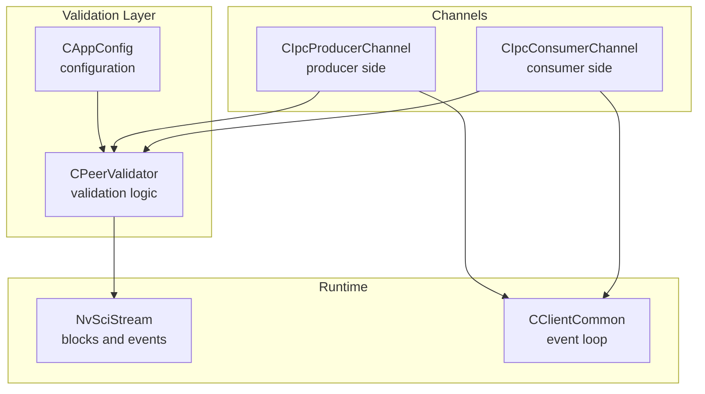
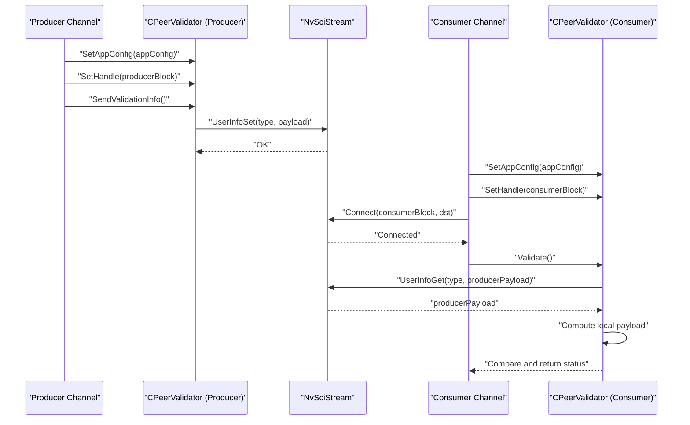
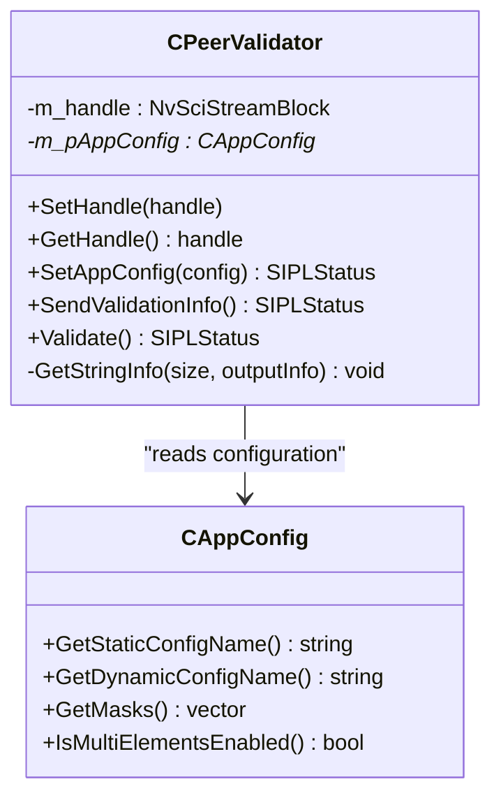
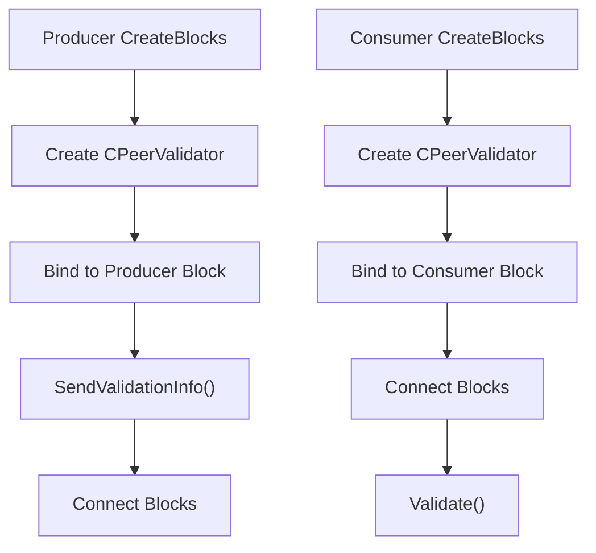
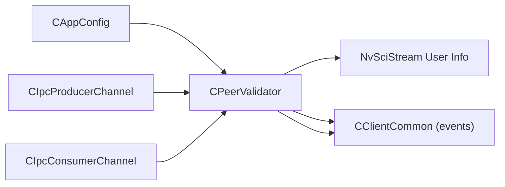

# Peer Validation

<cite>
**Referenced Files in This Document**
- [CPeerValidator.hpp](file://multicast/CPeerValidator.hpp)
- [CPeerValidator.cpp](file://multicast/CPeerValidator.cpp)
- [CAppConfig.hpp](file://multicast/CAppConfig.hpp)
- [CAppConfig.cpp](file://multicast/CAppConfig.cpp)
- [CIpcConsumerChannel.hpp](file://multicast/CIpcConsumerChannel.hpp)
- [CIpcProducerChannel.hpp](file://multicast/CIpcProducerChannel.hpp)
- [CClientCommon.hpp](file://multicast/CClientCommon.hpp)
- [CClientCommon.cpp](file://multicast/CClientCommon.cpp)
- [main.cpp](file://multicast/main.cpp)
</cite>

## Table of Contents
1. [Introduction](#introduction)
2. [Project Structure](#project-structure)
3. [Core Components](#core-components)
4. [Architecture Overview](#architecture-overview)
5. [Detailed Component Analysis](#detailed-component-analysis)
6. [Dependency Analysis](#dependency-analysis)
7. [Performance Considerations](#performance-considerations)
8. [Troubleshooting Guide](#troubleshooting-guide)
9. [Conclusion](#conclusion)

## Introduction
This document explains the peer validation system used by the NVIDIA SIPL Multicast framework to ensure correct consumer-producer pairing and configuration consistency across processes. It focuses on the CPeerValidator class and its integration with CAppConfig, NvSciStream, and channel implementations. The goal is to help developers understand how validation works, how to troubleshoot failures, and how to maintain consistency in distributed environments.

## Project Structure
The peer validation mechanism spans several modules:
- CPeerValidator encapsulates validation logic and interacts with NvSciStream user info APIs.
- CAppConfig supplies configuration parameters consumed by the validator.
- Channel classes (CIpcProducerChannel, CIpcConsumerChannel) orchestrate validation timing and lifecycle.
- CClientCommon provides the base event-driven client behavior used by producers and consumers.

**Diagram sources**
- [CPeerValidator.hpp:21-61](file://multicast/CPeerValidator.hpp#L21-L61)
- [CPeerValidator.cpp:24-63](file://multicast/CPeerValidator.cpp#L24-L63)
- [CAppConfig.hpp:19-80](file://multicast/CAppConfig.hpp#L19-L80)
- [CIpcProducerChannel.hpp:20-379](file://multicast/CIpcProducerChannel.hpp#L20-L379)
- [CIpcConsumerChannel.hpp:19-148](file://multicast/CIpcConsumerChannel.hpp#L19-L148)
- [CClientCommon.hpp:47-200](file://multicast/CClientCommon.hpp#L47-L200)

**Section sources**
- [CPeerValidator.hpp:11-63](file://multicast/CPeerValidator.hpp#L11-L63)
- [CPeerValidator.cpp:14-92](file://multicast/CPeerValidator.cpp#L14-L92)
- [CAppConfig.hpp:19-80](file://multicast/CAppConfig.hpp#L19-L80)
- [CIpcProducerChannel.hpp:20-379](file://multicast/CIpcProducerChannel.hpp#L20-L379)
- [CIpcConsumerChannel.hpp:19-148](file://multicast/CIpcConsumerChannel.hpp#L19-L148)
- [CClientCommon.hpp:47-200](file://multicast/CClientCommon.hpp#L47-L200)

## Core Components
- CPeerValidator
  - Purpose: Build and exchange a compact configuration signature between producer and consumer, then compare for compatibility.
  - Key responsibilities:
    - Serialize selected configuration fields into a fixed-size string payload.
    - Send the payload via NvSciStream user info on the producer side.
    - Retrieve and compare the payload on the consumer side.
  - Exposed methods:
    - SetHandle/GetHandle: bind to a NvSciStream block.
    - SetAppConfig: inject configuration provider.
    - SendValidationInfo: serialize and send payload.
    - Validate: fetch producer payload and compare with local computed value.

- CAppConfig
  - Supplies the configuration fields used by the validator:
    - Static vs dynamic config selection.
    - Platform name.
    - Link masks (for dynamic config).
    - Multi-elements enablement flag.

- Channel Integrations
  - CIpcProducerChannel: creates CPeerValidator, sets its handle to the producer block, sends validation info during block creation.
  - CIpcConsumerChannel: creates CPeerValidator, sets its handle to the consumer block, validates after connecting.

- CClientCommon
  - Provides the event-driven runtime behavior for producers/consumers, including event handling and setup phases that precede validation.

**Section sources**
- [CPeerValidator.hpp:21-61](file://multicast/CPeerValidator.hpp#L21-L61)
- [CPeerValidator.cpp:24-92](file://multicast/CPeerValidator.cpp#L24-L92)
- [CAppConfig.hpp:19-80](file://multicast/CAppConfig.hpp#L19-L80)
- [CAppConfig.cpp:21-75](file://multicast/CAppConfig.cpp#L21-L75)
- [CIpcProducerChannel.hpp:111-129](file://multicast/CIpcProducerChannel.hpp#L111-L129)
- [CIpcConsumerChannel.hpp:77-82](file://multicast/CIpcConsumerChannel.hpp#L77-L82)
- [CIpcConsumerChannel.hpp:112-117](file://multicast/CIpcConsumerChannel.hpp#L112-L117)
- [CClientCommon.hpp:47-200](file://multicast/CClientCommon.hpp#L47-L200)

## Architecture Overview
The validation workflow is orchestrated around NvSciStream user info exchange. The producer serializes a compact signature and stores it on its block; the consumer retrieves it and compares against its own computed signature.

**Diagram sources**
- [CPeerValidator.cpp:24-63](file://multicast/CPeerValidator.cpp#L24-L63)
- [CIpcProducerChannel.hpp:122-129](file://multicast/CIpcProducerChannel.hpp#L122-L129)
- [CIpcConsumerChannel.hpp:112-117](file://multicast/CIpcConsumerChannel.hpp#L112-L117)

## Detailed Component Analysis

### CPeerValidator Class
CPeerValidator encapsulates the validation logic and data flow. It builds a deterministic string representation of selected configuration fields and exchanges it via NvSciStream user info.

**Diagram sources**
- [CPeerValidator.hpp:21-61](file://multicast/CPeerValidator.hpp#L21-L61)
- [CPeerValidator.cpp:65-92](file://multicast/CPeerValidator.cpp#L65-L92)
- [CAppConfig.hpp:19-80](file://multicast/CAppConfig.hpp#L19-L80)

Implementation highlights:
- Serialization constants define the payload type and size, and the keys included in the signature.
- GetStringInfo computes a string containing:
  - Static/dynamic configuration mode.
  - Platform name.
  - Comma-separated link masks (dynamic config).
  - Multi-elements enablement flag.
- SendValidationInfo writes the serialized payload to the producer’s NvSciStream block.
- Validate reads the producer’s payload, re-computes the local signature, and compares them.

Operational flow:
- Producer: Create CPeerValidator bound to the producer block, send validation info.
- Consumer: After connecting, create CPeerValidator bound to the consumer block, validate against producer info.

**Section sources**
- [CPeerValidator.hpp:21-61](file://multicast/CPeerValidator.hpp#L21-L61)
- [CPeerValidator.cpp:14-92](file://multicast/CPeerValidator.cpp#L14-L92)

### Configuration Consumption in CAppConfig
CAppConfig exposes the fields consumed by CPeerValidator:
- Static vs dynamic configuration selection and platform name.
- Link masks used when dynamic configuration is active.
- Multi-elements enablement flag.

These fields are used to construct a stable, comparable signature across processes.

**Section sources**
- [CAppConfig.hpp:22-46](file://multicast/CAppConfig.hpp#L22-L46)
- [CAppConfig.cpp:21-75](file://multicast/CAppConfig.cpp#L21-L75)

### Channel Integration Points
- CIpcProducerChannel
  - Creates CPeerValidator, binds it to the producer block, and sends validation info during block creation.
  - Uses a static flag to avoid repeated validation across multiple early consumers.

- CIpcConsumerChannel
  - Creates CPeerValidator, binds it to the consumer block.
  - Validates immediately after connecting to ensure pairing correctness before proceeding.

**Diagram sources**
- [CIpcProducerChannel.hpp:122-129](file://multicast/CIpcProducerChannel.hpp#L122-L129)
- [CIpcConsumerChannel.hpp:77-82](file://multicast/CIpcConsumerChannel.hpp#L77-L82)
- [CIpcConsumerChannel.hpp:112-117](file://multicast/CIpcConsumerChannel.hpp#L112-L117)

**Section sources**
- [CIpcProducerChannel.hpp:111-131](file://multicast/CIpcProducerChannel.hpp#L111-L131)
- [CIpcConsumerChannel.hpp:85-118](file://multicast/CIpcConsumerChannel.hpp#L85-L118)

### Runtime Compatibility and Event Handling
CClientCommon manages the NvSciStream event loop and setup phases. While CPeerValidator operates independently, the underlying blocks must reach connectivity and setup-complete phases before validation is meaningful. The event loop ensures proper ordering of element export/import, sync object reconciliation, and transition to streaming.

**Section sources**
- [CClientCommon.hpp:47-200](file://multicast/CClientCommon.hpp#L47-L200)
- [CClientCommon.cpp:119-205](file://multicast/CClientCommon.cpp#L119-L205)

## Dependency Analysis
- CPeerValidator depends on:
  - CAppConfig for configuration fields.
  - NvSciStream user info APIs for payload exchange.
- Channels depend on CPeerValidator for validation:
  - Producer channel triggers sending.
  - Consumer channel triggers validation post-connect.
- CClientCommon provides the event-driven runtime that underpins block connectivity and setup.

**Diagram sources**
- [CPeerValidator.hpp:14-20](file://multicast/CPeerValidator.hpp#L14-L20)
- [CPeerValidator.cpp:24-63](file://multicast/CPeerValidator.cpp#L24-L63)
- [CIpcProducerChannel.hpp:122-129](file://multicast/CIpcProducerChannel.hpp#L122-L129)
- [CIpcConsumerChannel.hpp:112-117](file://multicast/CIpcConsumerChannel.hpp#L112-L117)
- [CClientCommon.hpp:47-200](file://multicast/CClientCommon.hpp#L47-L200)

**Section sources**
- [CPeerValidator.hpp:14-20](file://multicast/CPeerValidator.hpp#L14-L20)
- [CPeerValidator.cpp:24-63](file://multicast/CPeerValidator.cpp#L24-L63)
- [CIpcProducerChannel.hpp:122-129](file://multicast/CIpcProducerChannel.hpp#L122-L129)
- [CIpcConsumerChannel.hpp:112-117](file://multicast/CIpcConsumerChannel.hpp#L112-L117)
- [CClientCommon.hpp:47-200](file://multicast/CClientCommon.hpp#L47-L200)

## Performance Considerations
- Payload size is bounded and constant, minimizing overhead.
- Validation occurs once per pairing, typically during initial connection.
- Avoid redundant validation by reusing the validator across multiple consumers where appropriate.
- Keep configuration computation lightweight; CPeerValidator already uses a small, fixed-size buffer.

## Troubleshooting Guide
Common validation failures and resolutions:
- Validation info not provided by producer
  - Symptom: Consumer reports validation info not provided by producer.
  - Causes:
    - Producer did not send validation info.
    - Consumer queried before producer finished sending.
  - Resolution:
    - Ensure producer calls SendValidationInfo during block creation.
    - Ensure consumer waits for full connectivity before Validate.

- Mismatched configuration signature
  - Symptom: Consumer detects mismatch between producer and consumer signatures.
  - Causes:
    - Different static/dynamic configuration modes.
    - Different platform names.
    - Different link masks (dynamic config).
    - Different multi-elements enablement flags.
  - Resolution:
    - Align configuration sources and parameters on both sides.
    - Verify platform database and mask application for dynamic configs.

- NvSciStream errors during UserInfoGet
  - Symptom: Consumer fails to query producer info.
  - Causes:
    - NvSci error conditions (e.g., info not provided).
    - Connectivity or setup issues.
  - Resolution:
    - Confirm producer block is reachable and setup-complete.
    - Inspect NvSci error logs and retry after connectivity stabilization.

Debugging techniques:
- Enable verbose logging around SendValidationInfo and Validate to correlate producer and consumer logs.
- Compare printed producer and consumer signatures to identify differing fields.
- Verify CAppConfig fields (static/dynamic config, platform name, masks, multi-elements) on both ends.
- Ensure channels create and bind CPeerValidator before attempting validation.

**Section sources**
- [CPeerValidator.cpp:37-63](file://multicast/CPeerValidator.cpp#L37-L63)
- [CIpcProducerChannel.hpp:122-129](file://multicast/CIpcProducerChannel.hpp#L122-L129)
- [CIpcConsumerChannel.hpp:112-117](file://multicast/CIpcConsumerChannel.hpp#L112-L117)

## Conclusion
The CPeerValidator subsystem provides a robust, lightweight mechanism to validate consumer-producer pairing and configuration consistency across processes using NvSciStream user info. By serializing a compact signature derived from CAppConfig and comparing it on both ends, it prevents mismatches and enables safe runtime operation. Proper integration in CIpcProducerChannel and CIpcConsumerChannel ensures timely validation, while CClientCommon’s event loop guarantees correct setup sequencing. Following the troubleshooting steps and best practices outlined here will help maintain peer consistency in distributed deployments.