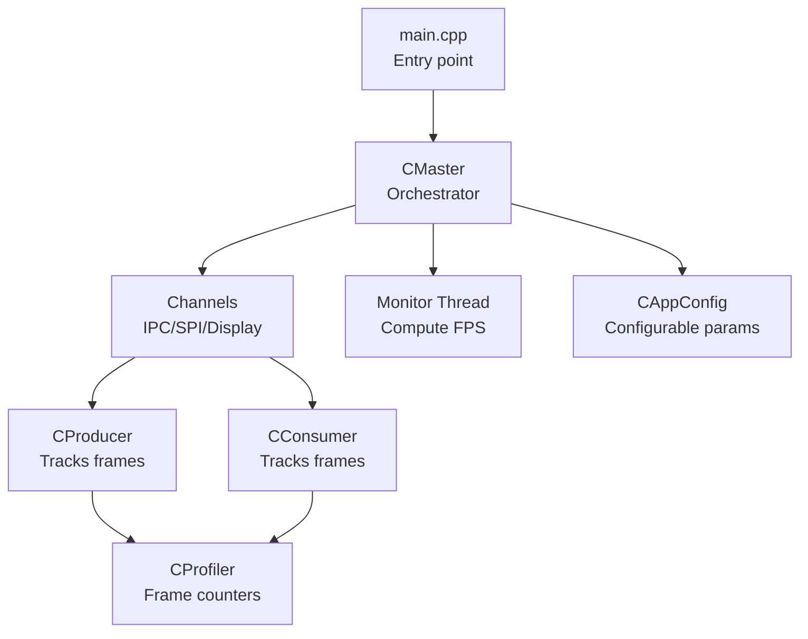
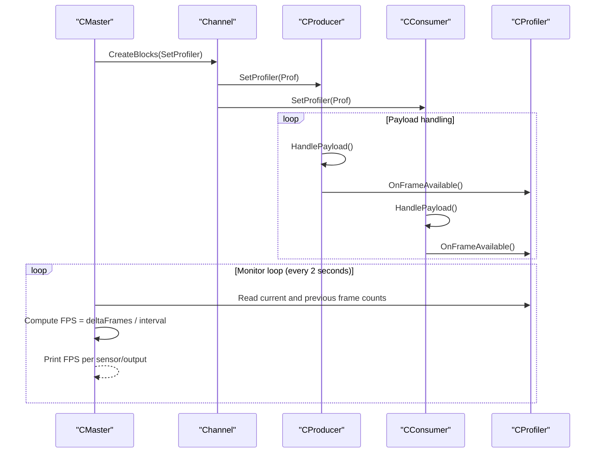
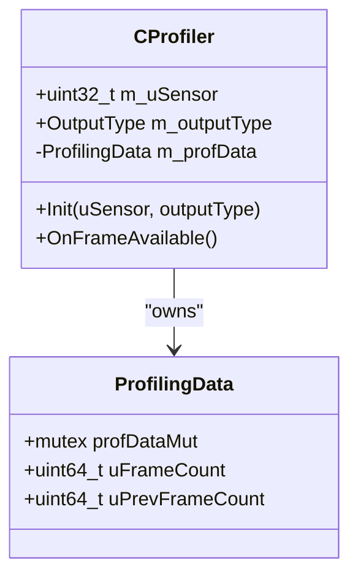
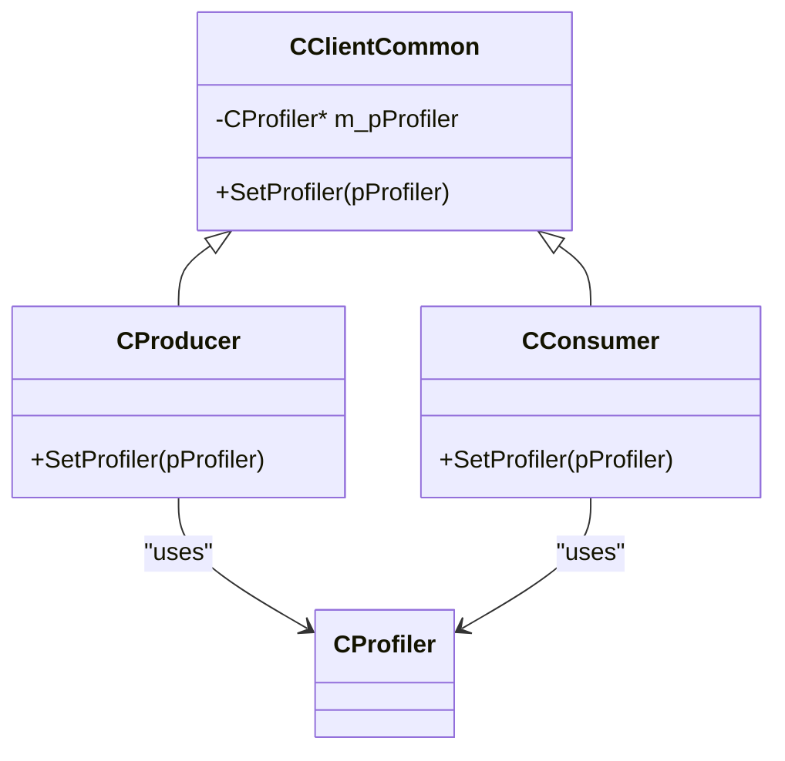
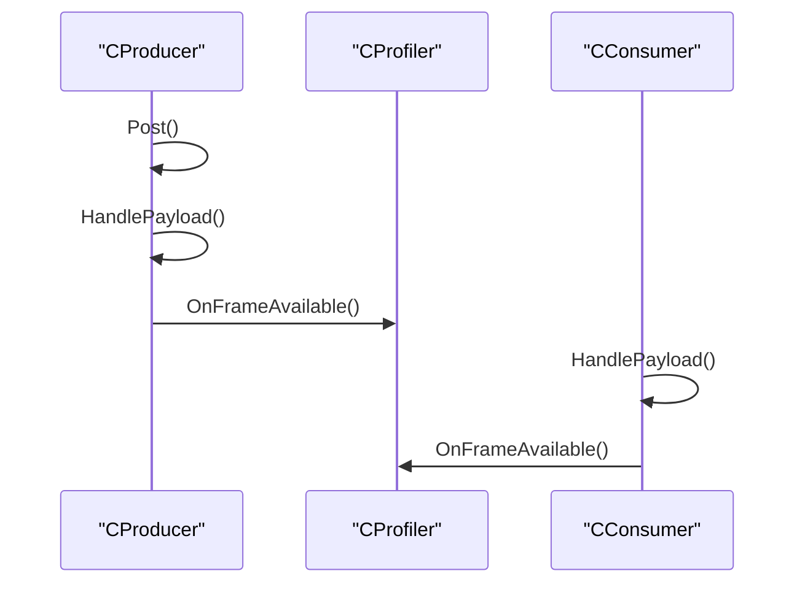
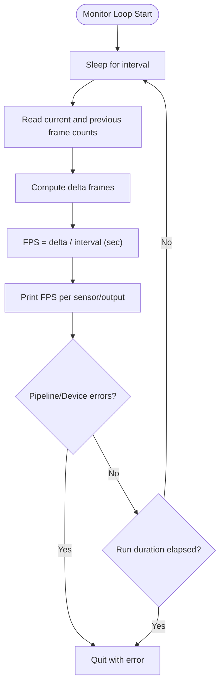
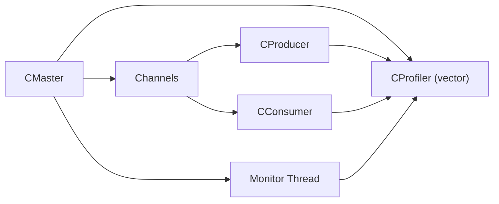

# Profiler and Monitoring

<cite>
**Referenced Files in This Document**
- [CProfiler.hpp](file://CProfiler.hpp)
- [CAppConfig.hpp](file://CAppConfig.hpp)
- [CAppConfig.cpp](file://CAppConfig.cpp)
- [CClientCommon.hpp](file://CClientCommon.hpp)
- [CClientCommon.cpp](file://CClientCommon.cpp)
- [CConsumer.hpp](file://CConsumer.hpp)
- [CConsumer.cpp](file://CConsumer.cpp)
- [CProducer.hpp](file://CProducer.hpp)
- [CProducer.cpp](file://CProducer.cpp)
- [CMaster.hpp](file://CMaster.hpp)
- [CMaster.cpp](file://CMaster.cpp)
- [CIpcProducerChannel.hpp](file://CIpcProducerChannel.hpp)
- [CIpcConsumerChannel.hpp](file://CIpcConsumerChannel.hpp)
- [CSingleProcessChannel.hpp](file://CSingleProcessChannel.hpp)
- [main.cpp](file://main.cpp)
</cite>

## Table of Contents
1. [Introduction](#introduction)
2. [Project Structure](#project-structure)
3. [Core Components](#core-components)
4. [Architecture Overview](#architecture-overview)
5. [Detailed Component Analysis](#detailed-component-analysis)
6. [Dependency Analysis](#dependency-analysis)
7. [Performance Considerations](#performance-considerations)
8. [Troubleshooting Guide](#troubleshooting-guide)
9. [Conclusion](#conclusion)
10. [Appendices](#appendices)

## Introduction
This document explains the profiling and monitoring capabilities in the NVIDIA SIPL Multicast system with a focus on the CProfiler class for performance monitoring, debugging, and system optimization. It covers how frames are tracked, how profiling integrates with producers and consumers, how configurable parameters influence monitoring via CAppConfig, and how the monitoring loop reports frame rates. Practical guidance is included for real-time performance monitoring, identifying bottlenecks, interpreting metrics, and integrating with external monitoring systems.

## Project Structure
The profiling system spans several layers:
- Application entrypoint initializes configuration and starts the runtime.
- Master orchestrates channels, producers, and consumers, and runs a periodic monitor thread.
- Channels create and wire producer/consumer instances and inject a profiler per sensor/output combination.
- Producers and consumers increment the frame counter upon payload handling.
- The monitor thread periodically computes instantaneous frame rates per profiler instance.

**Diagram sources**
- [main.cpp:253-304](file://main.cpp#L253-L304)
- [CMaster.cpp:50-122](file://CMaster.cpp#L50-L122)
- [CIpcProducerChannel.hpp:88-131](file://CIpcProducerChannel.hpp#L88-L131)
- [CIpcConsumerChannel.hpp:63-83](file://CIpcConsumerChannel.hpp#L63-L83)
- [CProducer.cpp:146-151](file://CProducer.cpp#L146-L151)
- [CConsumer.cpp:33-43](file://CConsumer.cpp#L33-L43)
- [CMaster.cpp:354-403](file://CMaster.cpp#L354-L403)

**Section sources**
- [main.cpp:253-304](file://main.cpp#L253-L304)
- [CMaster.hpp:47-95](file://CMaster.hpp#L47-L95)
- [CMaster.cpp:50-122](file://CMaster.cpp#L50-L122)

## Core Components
- CProfiler: Lightweight frame counter with thread-safe increments and persistent previous-frame counts for delta computation.
- CClientCommon: Base class that holds a pointer to a profiler and exposes SetProfiler for wiring.
- CProducer and CConsumer: Call OnFrameAvailable on their profiler during payload handling.
- CMaster: Creates a profiler per sensor/output, wires them into channels, and runs a monitor thread that prints instantaneous FPS.

Key responsibilities:
- Frame counting: Incremented on each handled payload.
- Delta-based FPS: Monitor thread computes frames/sec over a fixed interval.
- Configurable filtering: Frame filter from CAppConfig controls sampling.

**Section sources**
- [CProfiler.hpp:21-54](file://CProfiler.hpp#L21-L54)
- [CClientCommon.hpp:187](file://CClientCommon.hpp#L187)
- [CProducer.cpp:146-151](file://CProducer.cpp#L146-L151)
- [CConsumer.cpp:33-43](file://CConsumer.cpp#L33-L43)
- [CMaster.cpp:73-84](file://CMaster.cpp#L73-L84)
- [CMaster.cpp:354-403](file://CMaster.cpp#L354-L403)

## Architecture Overview
The profiling architecture is event-driven around NvSciStream events. Producers and consumers update frame counters when packets are processed. The monitor thread periodically reads counters and prints FPS.

**Diagram sources**
- [CMaster.cpp:73-84](file://CMaster.cpp#L73-L84)
- [CIpcProducerChannel.hpp:108](file://CIpcProducerChannel.hpp#L108)
- [CIpcConsumerChannel.hpp:70](file://CIpcConsumerChannel.hpp#L70)
- [CProducer.cpp:146-151](file://CProducer.cpp#L146-L151)
- [CConsumer.cpp:33-43](file://CConsumer.cpp#L33-L43)
- [CMaster.cpp:370-379](file://CMaster.cpp#L370-L379)

## Detailed Component Analysis

### CProfiler
CProfiler maintains:
- Sensor ID and output type for labeling.
- A mutex-protected struct containing current and previous frame counts.
- An initialization routine to reset counters.
- A method to increment the frame count on each handled frame.

**Diagram sources**
- [CProfiler.hpp:21-54](file://CProfiler.hpp#L21-L54)

**Section sources**
- [CProfiler.hpp:21-54](file://CProfiler.hpp#L21-L54)

### CClientCommon and Profiler Wiring
- CClientCommon stores a pointer to CProfiler and exposes SetProfiler for subclasses.
- Subclasses (CProducer, CConsumer) call SetProfiler during channel creation.

**Diagram sources**
- [CClientCommon.hpp:187](file://CClientCommon.hpp#L187)
- [CIpcProducerChannel.hpp:108](file://CIpcProducerChannel.hpp#L108)
- [CIpcConsumerChannel.hpp:70](file://CIpcConsumerChannel.hpp#L70)

**Section sources**
- [CClientCommon.hpp:187](file://CClientCommon.hpp#L187)
- [CIpcProducerChannel.hpp:108](file://CIpcProducerChannel.hpp#L108)
- [CIpcConsumerChannel.hpp:70](file://CIpcConsumerChannel.hpp#L70)

### Producer and Consumer Frame Tracking
- Producer increments the frame counter in Post after posting a packet.
- Consumer increments the frame counter in HandlePayload after acquiring and processing a packet.

**Diagram sources**
- [CProducer.cpp:146-151](file://CProducer.cpp#L146-L151)
- [CConsumer.cpp:33-43](file://CConsumer.cpp#L33-L43)

**Section sources**
- [CProducer.cpp:146-151](file://CProducer.cpp#L146-L151)
- [CConsumer.cpp:33-43](file://CConsumer.cpp#L33-L43)

### Monitor Thread and Reporting
- The monitor thread runs every fixed interval, computes delta frame counts, and prints FPS per profiler instance.
- It also checks for pipeline/device errors and respects optional runtime duration limits.

**Diagram sources**
- [CMaster.cpp:354-403](file://CMaster.cpp#L354-L403)

**Section sources**
- [CMaster.cpp:354-403](file://CMaster.cpp#L354-L403)

### Integration with CAppConfig
- CAppConfig provides:
  - Frame filter to subsample frames for reporting.
  - Run duration to automatically stop after a configured time.
  - Verbosity level for logging/tracing.
- Consumers apply the frame filter before releasing packets, reducing report frequency and overhead.

Practical implications:
- Lower frame filter values reduce CPU work but smooth out FPS reporting.
- Run duration enables automated long-running tests or demos.

**Section sources**
- [CAppConfig.hpp:22-52](file://CAppConfig.hpp#L22-L52)
- [CAppConfig.cpp:77-94](file://CAppConfig.cpp#L77-L94)
- [CConsumer.cpp:38-43](file://CConsumer.cpp#L38-L43)

## Dependency Analysis
- CMaster creates CProfiler instances per sensor/output and stores them in a vector.
- Channels (single-process and IPC variants) call SetProfiler on producer/consumer instances.
- Monitor thread iterates over stored profilers to compute and print FPS.

**Diagram sources**
- [CMaster.cpp:73-84](file://CMaster.cpp#L73-L84)
- [CIpcProducerChannel.hpp:108](file://CIpcProducerChannel.hpp#L108)
- [CIpcConsumerChannel.hpp:70](file://CIpcConsumerChannel.hpp#L70)
- [CMaster.cpp:370-379](file://CMaster.cpp#L370-L379)

**Section sources**
- [CMaster.hpp:89](file://CMaster.hpp#L89)
- [CMaster.cpp:73-84](file://CMaster.cpp#L73-L84)
- [CMaster.cpp:370-379](file://CMaster.cpp#L370-L379)

## Performance Considerations
- Frame counting is lightweight and lock-protected to avoid race conditions.
- The monitor interval is fixed; adjust as needed for responsiveness vs. overhead balance.
- Frame filter reduces reporting frequency and can lower CPU load during analysis.
- Profiler granularity is per sensor/output combination; consider aggregating or grouping for high-sensor setups.

[No sources needed since this section provides general guidance]

## Troubleshooting Guide
Common scenarios and remedies:
- No FPS reported:
  - Verify profiler is set on producer/consumer via channel creation.
  - Ensure HandlePayload is reached in both producer and consumer paths.
- Erratic FPS spikes/dips:
  - Check frame filter; higher filter values smooth reporting but reduce fidelity.
  - Confirm monitor interval and that the thread is not starved by other work.
- Pipeline/device errors:
  - The monitor thread checks for asynchronous failures and quits on detection.
  - Inspect logs for error events and NvSciStream error codes.

Operational tips:
- Use run duration to automatically terminate long tests.
- Increase verbosity to capture NvSIPL tracing and debug logs for deeper insight.

**Section sources**
- [CMaster.cpp:382-398](file://CMaster.cpp#L382-L398)
- [CAppConfig.hpp:22-52](file://CAppConfig.hpp#L22-L52)
- [CAppConfig.cpp:77-94](file://CAppConfig.cpp#L77-L94)

## Conclusion
The CProfiler class provides a minimal yet effective mechanism to track frame throughput per sensor/output pair. Combined with CAppConfig’s frame filter and run duration, and the periodic monitor thread, the system supports real-time performance monitoring, debugging of consumer interactions, and system-wide analysis. For production deployments, tune the frame filter and monitor interval to balance accuracy and overhead, and integrate the printed FPS with external monitoring systems as needed.

[No sources needed since this section summarizes without analyzing specific files]

## Appendices

### Practical Usage Examples
- Real-time FPS monitoring:
  - Start the application; monitor thread prints FPS every interval.
  - Observe steady FPS across sensors/outputs to validate balanced loads.
- Debugging consumer interactions:
  - Temporarily lower frame filter to increase reporting cadence.
  - Watch for drops when adding new consumers or changing queue modes.
- System-wide performance analysis:
  - Use run duration to collect continuous metrics over time.
  - Correlate FPS drops with external triggers (e.g., thermal throttling).

[No sources needed since this section provides general guidance]

### Profiler Configuration Tips
- Configure frame filter to match desired reporting cadence.
- Adjust run duration for automated test cycles.
- Use verbosity to enable deeper tracing for diagnostics.

**Section sources**
- [CAppConfig.hpp:22-52](file://CAppConfig.hpp#L22-L52)
- [CAppConfig.cpp:77-94](file://CAppConfig.cpp#L77-L94)

### Integration with External Monitoring Systems
- Capture monitor thread output and forward to your telemetry pipeline.
- Pair FPS with system metrics (CPU, GPU, memory) for correlation.
- Automate collection using run duration and exit codes.

[No sources needed since this section provides general guidance]