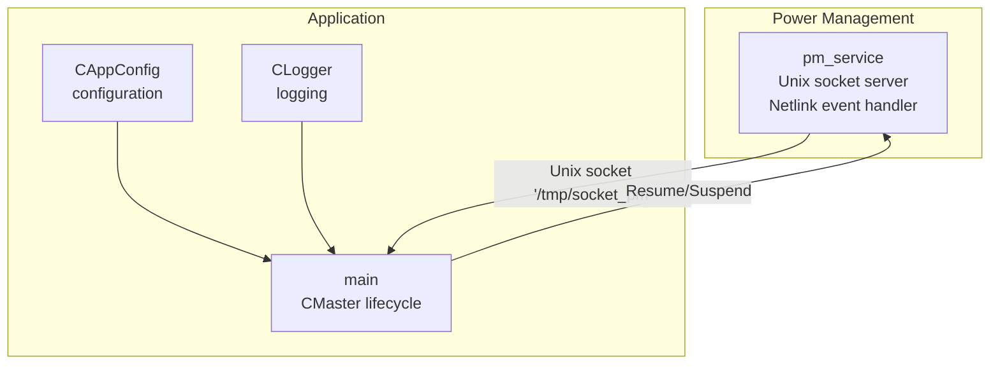
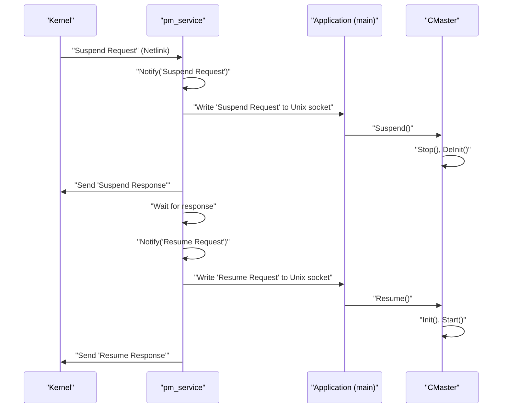
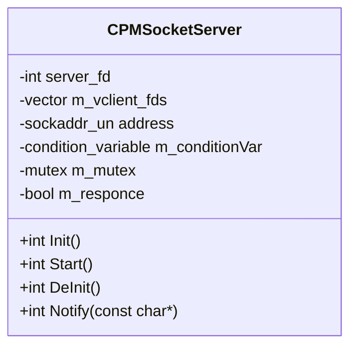
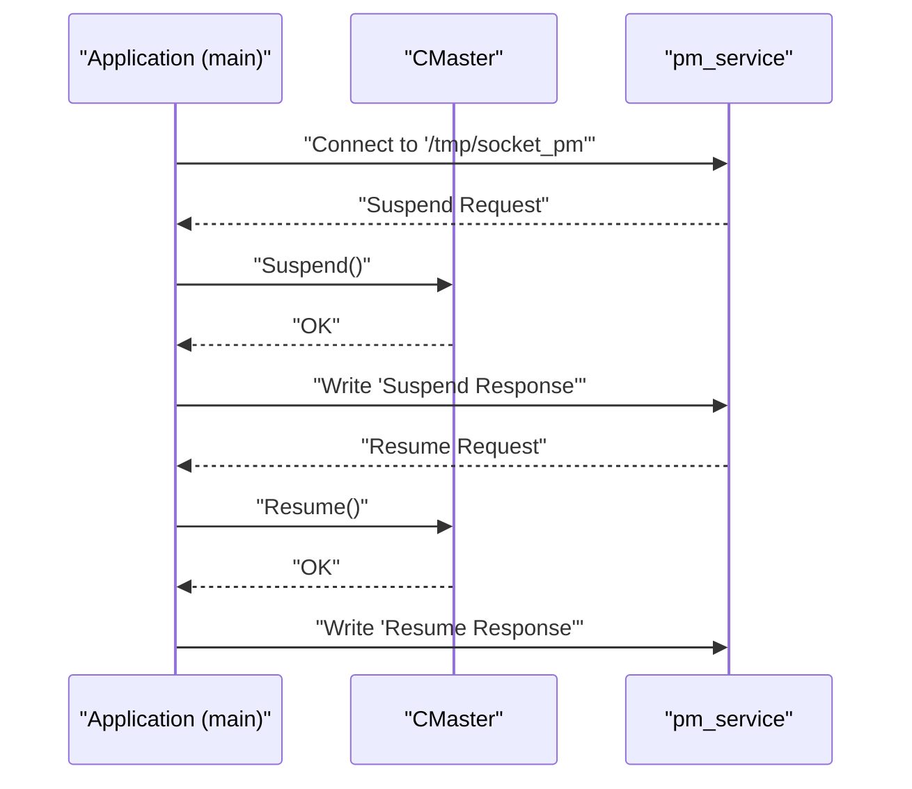
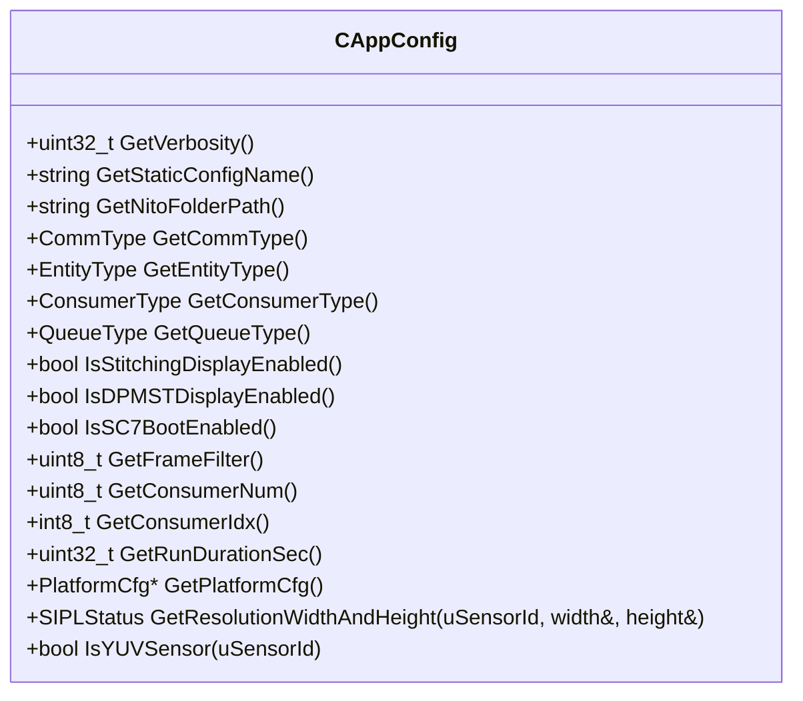
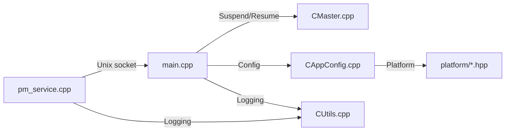

# Utility Services

<cite>
**Referenced Files in This Document**
- [pm_service.cpp](file://utils/pm_service.cpp)
- [main.cpp](file://main.cpp)
- [CAppConfig.hpp](file://CAppConfig.hpp)
- [CAppConfig.cpp](file://CAppConfig.cpp)
- [CMaster.hpp](file://CMaster.hpp)
- [CMaster.cpp](file://CMaster.cpp)
- [CUtils.hpp](file://CUtils.hpp)
- [CUtils.cpp](file://CUtils.cpp)
- [README.md](file://README.md)
- [ar0820.hpp](file://platform/ar0820.hpp)
- [max96712_tpg_yuv.hpp](file://platform/max96712_tpg_yuv.hpp)
</cite>

## Table of Contents
1. [Introduction](#introduction)
2. [Project Structure](#project-structure)
3. [Core Components](#core-components)
4. [Architecture Overview](#architecture-overview)
5. [Detailed Component Analysis](#detailed-component-analysis)
6. [Dependency Analysis](#dependency-analysis)
7. [Performance Considerations](#performance-considerations)
8. [Troubleshooting Guide](#troubleshooting-guide)
9. [Conclusion](#conclusion)
10. [Appendices](#appendices)

## Introduction
This document describes the utility services in the NVIDIA SIPL Multicast framework with a focus on the power management service (pm_service). It explains how the power management subsystem integrates with the application lifecycle, how system services are configured via CAppConfig, and how operational maintenance is performed. It also covers practical usage scenarios, integration patterns, and best practices for production deployments.

## Project Structure
The utility services are centered around a dedicated power management daemon (pm_service) and integrate with the main application through Unix domain sockets and Netlink kernel events. Configuration is provided via CAppConfig, which supplies platform and runtime parameters to the application and power management components.

**Diagram sources**
- [pm_service.cpp:30-78](file://utils/pm_service.cpp#L30-L78)
- [main.cpp:155-251](file://main.cpp#L155-L251)
- [CAppConfig.hpp:19-80](file://CAppConfig.hpp#L19-L80)
- [CUtils.hpp:177-275](file://CUtils.hpp#L177-L275)

**Section sources**
- [README.md:11-109](file://README.md#L11-L109)
- [pm_service.cpp:30-78](file://utils/pm_service.cpp#L30-L78)
- [main.cpp:155-251](file://main.cpp#L155-L251)
- [CAppConfig.hpp:19-80](file://CAppConfig.hpp#L19-L80)
- [CUtils.hpp:177-275](file://CUtils.hpp#L177-L275)

## Core Components
- Power Management Service (pm_service): A standalone daemon that listens on a Unix domain socket and handles suspend/resume requests initiated by the kernel via Netlink messages. It notifies clients (application) and coordinates lifecycle transitions.
- Application Lifecycle Manager (CMaster): Manages initialization, streaming, suspend, and resume operations. It receives suspend/resume notifications from pm_service and performs resource acquisition/release accordingly.
- Configuration Provider (CAppConfig): Supplies platform configuration, runtime flags, and operational parameters to the application and indirectly to power management integration points.
- Logging Utility (CLogger): Provides structured logging across the application and power management components.

**Section sources**
- [pm_service.cpp:34-163](file://utils/pm_service.cpp#L34-L163)
- [CMaster.hpp:36-92](file://CMaster.hpp#L36-L92)
- [CMaster.cpp:282-318](file://CMaster.cpp#L282-L318)
- [CAppConfig.hpp:19-80](file://CAppConfig.hpp#L19-L80)
- [CUtils.hpp:177-275](file://CUtils.hpp#L177-L275)

## Architecture Overview
The power management architecture uses a dual-path communication model:
- Kernel-to-userspace via Netlink: The kernel sends suspend/resume requests to pm_service.
- Userspace-to-application via Unix domain socket: pm_service forwards these requests to the application, which executes suspend/resume routines through CMaster.

**Diagram sources**
- [pm_service.cpp:220-259](file://utils/pm_service.cpp#L220-L259)
- [pm_service.cpp:151-163](file://utils/pm_service.cpp#L151-L163)
- [main.cpp:155-251](file://main.cpp#L155-L251)
- [CMaster.cpp:282-318](file://CMaster.cpp#L282-L318)

## Detailed Component Analysis

### Power Management Service (pm_service)
- Unix Domain Socket Server:
  - Initializes a Unix socket at a fixed path and accepts up to a configurable number of clients.
  - Maintains a set of client file descriptors and uses select() to multiplex reads.
  - Provides a blocking notify mechanism synchronized with a condition variable to coordinate responses.
- Netlink Event Handler:
  - Creates a raw Netlink socket with a specific protocol identifier.
  - Registers with the kernel and waits for suspend/resume messages.
  - For each received message, it notifies clients via the Unix socket and responds to the kernel.
- Synchronization:
  - Uses a mutex and condition variable to ensure ordered acknowledgment between pm_service and clients.

**Diagram sources**
- [pm_service.cpp:34-163](file://utils/pm_service.cpp#L34-L163)

**Section sources**
- [pm_service.cpp:34-163](file://utils/pm_service.cpp#L34-L163)
- [pm_service.cpp:165-259](file://utils/pm_service.cpp#L165-L259)

### Application Integration (main and CMaster)
- Socket Event Thread:
  - Connects to the pm_service Unix socket and listens for suspend/resume messages.
  - On receiving a message, invokes CMaster::Suspend() or CMaster::Resume() and acknowledges the kernel via pm_service.
- Lifecycle Management:
  - CMaster::Suspend() stops streaming and deinitializes resources.
  - CMaster::Resume() reinitializes and restarts streaming.
- Conditional Execution:
  - If SC7 boot is enabled, the application runs in socket-driven mode; otherwise, it runs interactively.

**Diagram sources**
- [main.cpp:155-251](file://main.cpp#L155-L251)
- [CMaster.cpp:282-318](file://CMaster.cpp#L282-L318)

**Section sources**
- [main.cpp:155-251](file://main.cpp#L155-L251)
- [CMaster.cpp:282-318](file://CMaster.cpp#L282-L318)

### Configuration Integration (CAppConfig)
- Platform Configuration:
  - Provides platform-specific camera and sensor configurations via platform header files.
  - Supports dynamic and static configuration selection, enabling flexible platform setups.
- Runtime Flags:
  - Controls verbosity, communication type, entity type, consumer settings, and operational toggles (e.g., stitching display, DPMST, SC7 boot).
- Resolution and Sensor Queries:
  - Retrieves sensor resolution and determines pixel format characteristics for downstream consumers.

**Diagram sources**
- [CAppConfig.hpp:19-80](file://CAppConfig.hpp#L19-L80)

**Section sources**
- [CAppConfig.hpp:19-80](file://CAppConfig.hpp#L19-L80)
- [CAppConfig.cpp:21-108](file://CAppConfig.cpp#L21-L108)
- [ar0820.hpp:14-183](file://platform/ar0820.hpp#L14-L183)
- [max96712_tpg_yuv.hpp:86-213](file://platform/max96712_tpg_yuv.hpp#L86-L213)

### Logging and Utilities (CLogger)
- Singleton logger with configurable verbosity and log styles.
- Macros wrap logging calls for consistent formatting and performance.
- Used across pm_service and application for diagnostics and operational visibility.

**Section sources**
- [CUtils.hpp:177-275](file://CUtils.hpp#L177-L275)
- [CUtils.cpp:17-118](file://CUtils.cpp#L17-L118)

## Dependency Analysis
- pm_service depends on:
  - POSIX sockets and Netlink for interprocess and kernel communication.
  - Standard threading primitives for concurrent event handling.
- Application depends on:
  - CMaster for lifecycle orchestration.
  - CAppConfig for platform/runtime configuration.
  - CLogger for logging.
- Platform configuration is injected via platform header files and selected by CAppConfig.

**Diagram sources**
- [pm_service.cpp:30-78](file://utils/pm_service.cpp#L30-L78)
- [main.cpp:155-251](file://main.cpp#L155-L251)
- [CMaster.cpp:282-318](file://CMaster.cpp#L282-L318)
- [CAppConfig.cpp:21-108](file://CAppConfig.cpp#L21-L108)
- [ar0820.hpp:14-183](file://platform/ar0820.hpp#L14-L183)
- [CUtils.cpp:17-118](file://CUtils.cpp#L17-L118)

**Section sources**
- [pm_service.cpp:30-78](file://utils/pm_service.cpp#L30-L78)
- [main.cpp:155-251](file://main.cpp#L155-L251)
- [CMaster.cpp:282-318](file://CMaster.cpp#L282-L318)
- [CAppConfig.cpp:21-108](file://CAppConfig.cpp#L21-L108)
- [CUtils.cpp:17-118](file://CUtils.cpp#L17-L118)

## Performance Considerations
- Socket Multiplexing: The Unix socket server uses select() to handle multiple clients efficiently. Ensure client limits are tuned to system capacity.
- Netlink Latency: Kernel-to-userspace transitions introduce latency; keep message sizes minimal and avoid synchronous heavy work in the event handler.
- Resource Cleanup: Suspend/Resume cycles should minimize resource churn; ensure Stop()/DeInit() and Init()/Start() are efficient and idempotent.
- Logging Overhead: Adjust verbosity levels to reduce I/O overhead during high-throughput operation.

[No sources needed since this section provides general guidance]

## Troubleshooting Guide
- Socket Path Conflicts:
  - Verify the Unix socket path is not in use and permissions allow access.
  - Check for stale sockets and remove them before starting pm_service.
- Netlink Registration Failures:
  - Confirm the Netlink protocol identifier and kernel module availability.
  - Validate that the application connects to the correct socket path.
- Deadlocks:
  - Ensure Notify() and response acknowledgments are handled promptly to avoid condition-variable timeouts.
- Lifecycle Errors:
  - If Resume() fails, inspect InitStream()/StartStream() logs for resource initialization issues.
  - If Suspend() fails, verify StopStream()/DeInitStream() completion and thread join semantics.

**Section sources**
- [pm_service.cpp:51-78](file://utils/pm_service.cpp#L51-L78)
- [pm_service.cpp:151-163](file://utils/pm_service.cpp#L151-L163)
- [main.cpp:155-251](file://main.cpp#L155-L251)
- [CMaster.cpp:282-318](file://CMaster.cpp#L282-L318)

## Conclusion
The utility services in the NVIDIA SIPL Multicast framework provide a robust power management integration through a dedicated daemon and seamless application lifecycle coordination. By leveraging CAppConfig for configuration and CLogger for diagnostics, the system supports automated power transitions, operational maintenance, and efficient resource management across diverse platforms.

[No sources needed since this section summarizes without analyzing specific files]

## Appendices

### Practical Usage Scenarios
- Automated Power Management:
  - Configure the kernel to send suspend/resume requests to pm_service; the application will automatically suspend or resume streaming.
- System Health Monitoring:
  - Use CLogger to monitor lifecycle transitions and detect anomalies during suspend/resume sequences.
- Operational Efficiency Optimization:
  - Tune verbosity and runtime flags via CAppConfig to balance diagnostics and performance.

**Section sources**
- [README.md:16-109](file://README.md#L16-L109)
- [CAppConfig.hpp:23-80](file://CAppConfig.hpp#L23-L80)
- [CUtils.hpp:142-174](file://CUtils.hpp#L142-L174)

### Integration Patterns
- Standalone Daemon Deployment:
  - Run pm_service independently and ensure the application connects to the Unix socket path.
- Embedded Integration:
  - Embed power management logic within the application process for tightly coupled control.
- Platform Configuration:
  - Select platform configurations via CAppConfig to match hardware capabilities and sensor setups.

**Section sources**
- [pm_service.cpp:30-78](file://utils/pm_service.cpp#L30-L78)
- [CAppConfig.cpp:21-108](file://CAppConfig.cpp#L21-L108)
- [ar0820.hpp:14-183](file://platform/ar0820.hpp#L14-L183)

### Best Practices for Production
- Isolate pm_service in a dedicated systemd unit with appropriate privileges.
- Validate platform configurations before deployment using CAppConfig.
- Monitor logs and adjust verbosity levels for production environments.
- Test suspend/resume sequences under realistic loads to ensure reliability.

[No sources needed since this section provides general guidance]