# Architecture Overview

<cite>
**Referenced Files in This Document**
- [main.cpp](file://main.cpp)
- [CMaster.hpp](file://CMaster.hpp)
- [CSiplCamera.hpp](file://CSiplCamera.hpp)
- [CFactory.hpp](file://CFactory.hpp)
- [CChannel.hpp](file://CChannel.hpp)
- [CDisplayChannel.hpp](file://CDisplayChannel.hpp)
- [CConsumer.hpp](file://CConsumer.hpp)
- [CCudaConsumer.hpp](file://CCudaConsumer.hpp)
- [CEncConsumer.hpp](file://CEncConsumer.hpp)
- [CStitchingConsumer.hpp](file://CStitchingConsumer.hpp)
- [CDisplayConsumer.hpp](file://CDisplayConsumer.hpp)
- [CProducer.hpp](file://CProducer.hpp)
- [CSIPLProducer.hpp](file://CSIPLProducer.hpp)
- [CDisplayProducer.hpp](file://CDisplayProducer.hpp)
- [CEventHandler.hpp](file://CEventHandler.hpp)
- [CAppConfig.hpp](file://CAppConfig.hpp)
- [Common.hpp](file://Common.hpp)
</cite>

## Table of Contents
1. [Introduction](#introduction)
2. [Project Structure](#project-structure)
3. [Core Components](#core-components)
4. [Architecture Overview](#architecture-overview)
5. [Detailed Component Analysis](#detailed-component-analysis)
6. [Dependency Analysis](#dependency-analysis)
7. [Performance Considerations](#performance-considerations)
8. [Troubleshooting Guide](#troubleshooting-guide)
9. [Conclusion](#conclusion)

## Introduction
This document describes the architecture of the NVIDIA SIPL Multicast system. The system follows a modular Producer-Consumer pattern with a Factory pattern for creating pluggable components. It orchestrates NvSIPL camera capture, streams frames via NvStreams to multiple asynchronous consumers, and supports dynamic attachment/detachment of consumers. Architectural patterns include:
- Observer pattern for dynamic consumer attachment
- Strategy pattern for pluggable consumer implementations
- Singleton pattern for centralized factory management

System boundaries include intra-process, inter-process, and inter-chip integration points via NvStreams and NvSIPL.

## Project Structure
The project is organized around core orchestration, camera abstraction, streaming channels, and pluggable consumers/producers. Key modules:
- Application entry and lifecycle control
- Master orchestrator managing camera and channels
- Camera abstraction integrating NvSIPL
- Channel abstractions for different streaming topologies
- Factory for constructing producers/consumers/pools/blocks
- Pluggable consumer implementations (CUDA, encoder, stitching, display)
- Producer implementations (NvSIPL-backed and display composition)

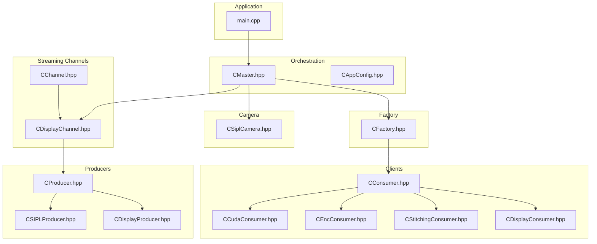

**Diagram sources**
- [main.cpp:253-304](file://main.cpp#L253-L304)
- [CMaster.hpp:46-92](file://CMaster.hpp#L46-L92)
- [CSiplCamera.hpp:46-85](file://CSiplCamera.hpp#L46-L85)
- [CChannel.hpp:28-154](file://CChannel.hpp#L28-L154)
- [CDisplayChannel.hpp:19-223](file://CDisplayChannel.hpp#L19-L223)
- [CFactory.hpp:27-92](file://CFactory.hpp#L27-L92)
- [CConsumer.hpp:16-44](file://CConsumer.hpp#L16-L44)
- [CCudaConsumer.hpp:25-81](file://CCudaConsumer.hpp#L25-L81)
- [CEncConsumer.hpp:17-66](file://CEncConsumer.hpp#L17-L66)
- [CStitchingConsumer.hpp:17-74](file://CStitchingConsumer.hpp#L17-L74)
- [CDisplayConsumer.hpp:15-49](file://CDisplayConsumer.hpp#L15-L49)
- [CProducer.hpp:16-52](file://CProducer.hpp#L16-L52)
- [CSIPLProducer.hpp:18-84](file://CSIPLProducer.hpp#L18-L84)
- [CDisplayProducer.hpp:18-127](file://CDisplayProducer.hpp#L18-L127)

**Section sources**
- [main.cpp:253-304](file://main.cpp#L253-L304)
- [CMaster.hpp:46-92](file://CMaster.hpp#L46-L92)
- [CChannel.hpp:28-154](file://CChannel.hpp#L28-L154)
- [CFactory.hpp:27-92](file://CFactory.hpp#L27-L92)
- [CConsumer.hpp:16-44](file://CConsumer.hpp#L16-L44)
- [CProducer.hpp:16-52](file://CProducer.hpp#L16-L52)

## Core Components
- CMaster: Central orchestrator that initializes camera, creates channels, starts/stops streams, and handles power management and dynamic consumer attach/detach.
- CSiplCamera: NvSIPL camera wrapper with callbacks and pipeline/notification queues for frame availability and error reporting.
- CFactory: Singleton-style factory for creating producers, consumers, pools, queues, multicast blocks, and IPC blocks.
- CChannel: Base channel abstraction for building streaming pipelines with event-driven threads and reconciliation/connect/init routines.
- CDisplayChannel: Concrete channel implementing a display pipeline with a producer and a display consumer.
- CConsumer and subclasses: Base consumer and specialized implementations for CUDA inference, encoding, stitching, and display.
- CProducer and subclasses: Base producer and specialized implementations for NvSIPL-backed and display composition producers.
- CEventHandler: Event handler interface used by channel threads to process NvStreams events.
- CAppConfig and Common: Configuration and shared enums/types for communication modes, entity types, consumer types, and queue types.

**Section sources**
- [CMaster.hpp:46-92](file://CMaster.hpp#L46-L92)
- [CSiplCamera.hpp:46-85](file://CSiplCamera.hpp#L46-L85)
- [CFactory.hpp:27-92](file://CFactory.hpp#L27-L92)
- [CChannel.hpp:28-154](file://CChannel.hpp#L28-L154)
- [CDisplayChannel.hpp:19-223](file://CDisplayChannel.hpp#L19-L223)
- [CConsumer.hpp:16-44](file://CConsumer.hpp#L16-L44)
- [CCudaConsumer.hpp:25-81](file://CCudaConsumer.hpp#L25-L81)
- [CEncConsumer.hpp:17-66](file://CEncConsumer.hpp#L17-L66)
- [CStitchingConsumer.hpp:17-74](file://CStitchingConsumer.hpp#L17-L74)
- [CDisplayConsumer.hpp:15-49](file://CDisplayConsumer.hpp#L15-L49)
- [CProducer.hpp:16-52](file://CProducer.hpp#L16-L52)
- [CSIPLProducer.hpp:18-84](file://CSIPLProducer.hpp#L18-L84)
- [CDisplayProducer.hpp:18-127](file://CDisplayProducer.hpp#L18-L127)
- [CEventHandler.hpp:23-51](file://CEventHandler.hpp#L23-L51)
- [CAppConfig.hpp:19-83](file://CAppConfig.hpp#L19-L83)
- [Common.hpp:35-87](file://Common.hpp#L35-L87)

## Architecture Overview
High-level design:
- Modular Producer-Consumer pattern: Producers emit frames; Consumers consume asynchronously.
- Factory pattern: Centralized creation of producers/consumers/pools/blocks.
- Observer pattern: Dynamic attach/detach of consumers at runtime.
- Strategy pattern: Pluggable consumer implementations selected via configuration.

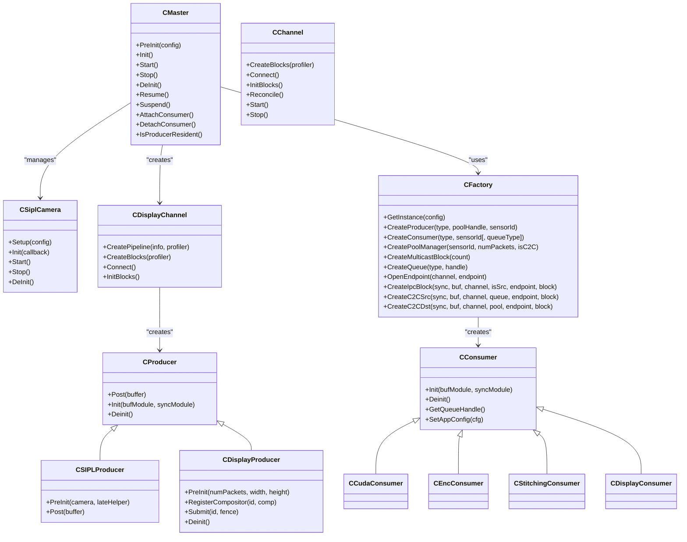

**Diagram sources**
- [CMaster.hpp:46-92](file://CMaster.hpp#L46-L92)
- [CSiplCamera.hpp:46-85](file://CSiplCamera.hpp#L46-L85)
- [CFactory.hpp:27-92](file://CFactory.hpp#L27-L92)
- [CChannel.hpp:28-154](file://CChannel.hpp#L28-L154)
- [CDisplayChannel.hpp:19-223](file://CDisplayChannel.hpp#L19-L223)
- [CProducer.hpp:16-52](file://CProducer.hpp#L16-L52)
- [CSIPLProducer.hpp:18-84](file://CSIPLProducer.hpp#L18-L84)
- [CDisplayProducer.hpp:18-127](file://CDisplayProducer.hpp#L18-L127)
- [CConsumer.hpp:16-44](file://CConsumer.hpp#L16-L44)
- [CCudaConsumer.hpp:25-81](file://CCudaConsumer.hpp#L25-L81)
- [CEncConsumer.hpp:17-66](file://CEncConsumer.hpp#L17-L66)
- [CStitchingConsumer.hpp:17-74](file://CStitchingConsumer.hpp#L17-L74)
- [CDisplayConsumer.hpp:15-49](file://CDisplayConsumer.hpp#L15-L49)

## Detailed Component Analysis

### Orchestration and Lifecycle: CMaster
- Responsibilities: Pre-initialization, initialization, starting/stopping streams, power management, and dynamic consumer attach/detach.
- Interactions:
  - Creates channels and display channel instances.
  - Manages NvStreams synchronization and buffer modules.
  - Starts monitoring threads and handles graceful shutdown.
- Integration points:
  - Uses NvSIPL camera via CSiplCamera.
  - Coordinates CFactory-created producers/consumers.
  - Integrates with OpenWFD controller for display.

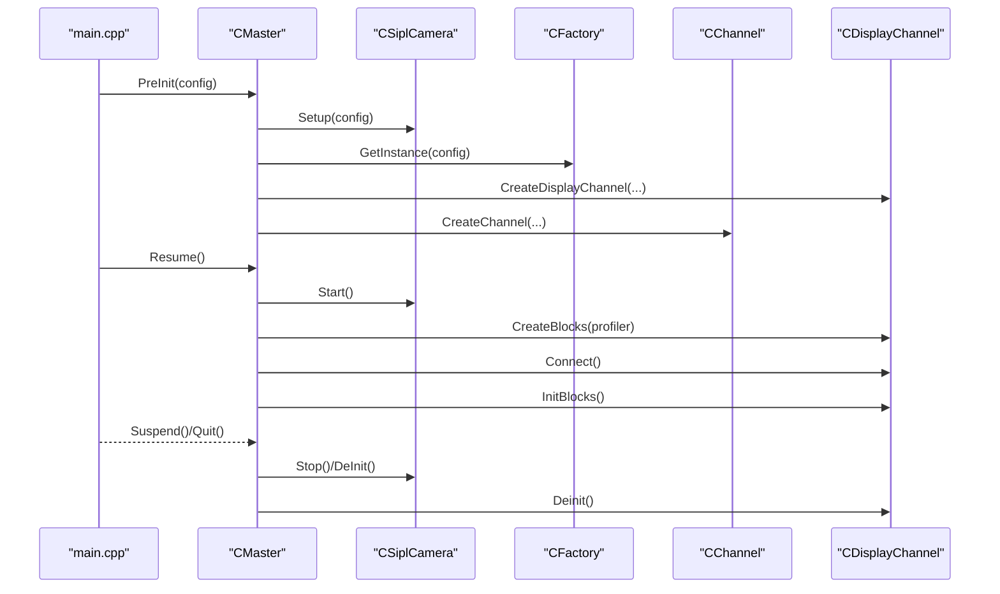

**Diagram sources**
- [main.cpp:271-288](file://main.cpp#L271-L288)
- [CMaster.hpp:55-76](file://CMaster.hpp#L55-L76)
- [CSiplCamera.hpp:59-64](file://CSiplCamera.hpp#L59-L64)
- [CFactory.hpp:30-34](file://CFactory.hpp#L30-L34)
- [CDisplayChannel.hpp:124-202](file://CDisplayChannel.hpp#L124-L202)

**Section sources**
- [CMaster.hpp:46-92](file://CMaster.hpp#L46-L92)
- [main.cpp:271-288](file://main.cpp#L271-L288)

### Camera Capture and Frame Availability: CSiplCamera
- Provides NvSIPL camera setup, init, start/stop, and deinit.
- Implements callbacks and frame completion queues to notify CMaster when frames are available.
- Manages device/block/notification handlers and error reporting.

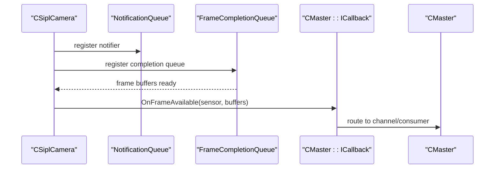

**Diagram sources**
- [CSiplCamera.hpp:59-64](file://CSiplCamera.hpp#L59-L64)
- [CSiplCamera.hpp:523-618](file://CSiplCamera.hpp#L523-L618)
- [CMaster.hpp:49-52](file://CMaster.hpp#L49-L52)

**Section sources**
- [CSiplCamera.hpp:46-85](file://CSiplCamera.hpp#L46-L85)
- [CSiplCamera.hpp:523-618](file://CSiplCamera.hpp#L523-L618)
- [CMaster.hpp:49-52](file://CMaster.hpp#L49-L52)

### Channel Abstraction and Event Loop: CChannel
- Base class for building streaming pipelines.
- Provides event-thread loop, reconcile/start/stop, and connection management.
- Derived classes implement CreateBlocks/Connect/InitBlocks tailored to specific topologies.

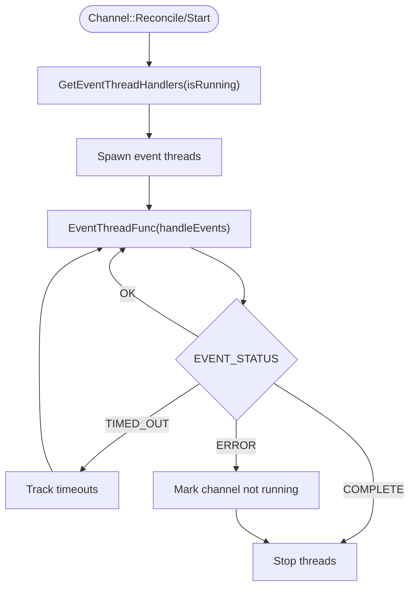

**Diagram sources**
- [CChannel.hpp:112-140](file://CChannel.hpp#L112-L140)
- [CChannel.hpp:55-82](file://CChannel.hpp#L55-L82)

**Section sources**
- [CChannel.hpp:28-154](file://CChannel.hpp#L28-L154)

### Display Channel Pipeline: CDisplayChannel
- Builds a pipeline with a PoolManager, a Producer, and one or more Consumers.
- Supports connecting producer to consumer(s) directly or via a multicast block.
- Handles connection verification and initialization of blocks.

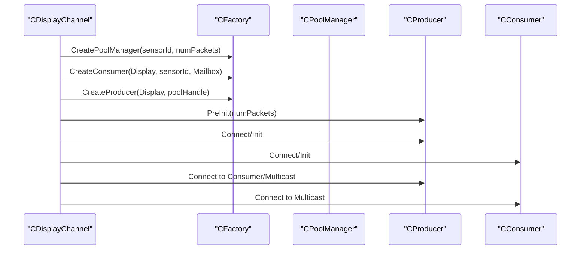

**Diagram sources**
- [CDisplayChannel.hpp:90-122](file://CDisplayChannel.hpp#L90-L122)
- [CDisplayChannel.hpp:134-184](file://CDisplayChannel.hpp#L134-L184)

**Section sources**
- [CDisplayChannel.hpp:19-223](file://CDisplayChannel.hpp#L19-L223)

### Factory Pattern: CFactory
- Singleton-style access via GetInstance.
- Creates producers, consumers, pools, queues, multicast blocks, and IPC blocks.
- Encapsulates element information and block creation logic.

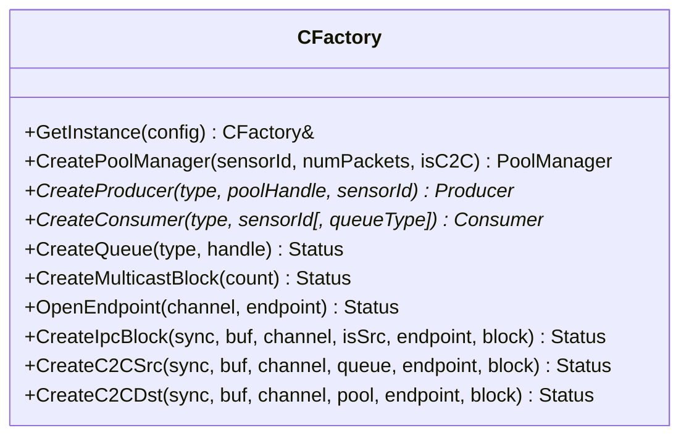

**Diagram sources**
- [CFactory.hpp:27-92](file://CFactory.hpp#L27-L92)

**Section sources**
- [CFactory.hpp:27-92](file://CFactory.hpp#L27-L92)

### Consumer Implementations and Strategy Pattern
- Strategy pattern: Consumers are pluggable (CUDA, encoder, stitching, display) selected by configuration.
- Each consumer implements payload processing and synchronization primitives.

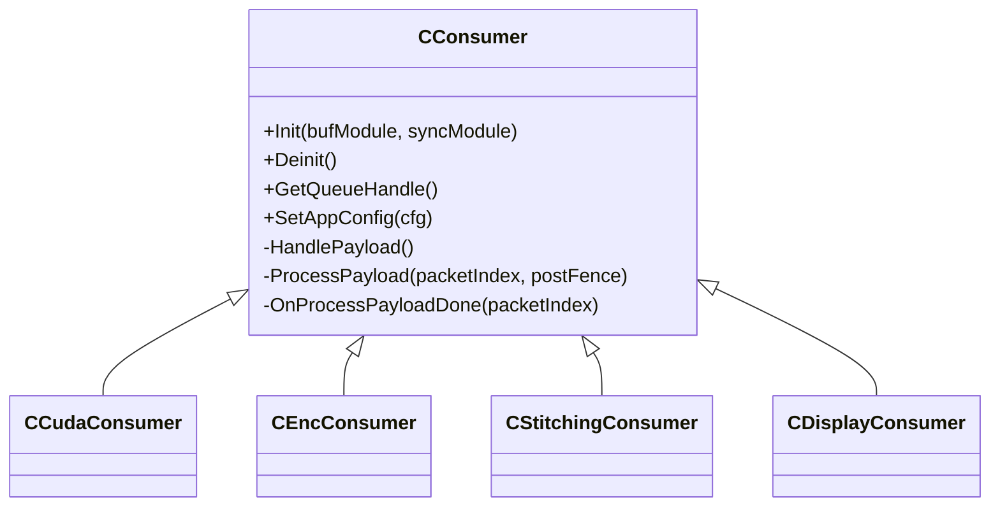

**Diagram sources**
- [CConsumer.hpp:16-44](file://CConsumer.hpp#L16-L44)
- [CCudaConsumer.hpp:25-81](file://CCudaConsumer.hpp#L25-L81)
- [CEncConsumer.hpp:17-66](file://CEncConsumer.hpp#L17-L66)
- [CStitchingConsumer.hpp:17-74](file://CStitchingConsumer.hpp#L17-L74)
- [CDisplayConsumer.hpp:15-49](file://CDisplayConsumer.hpp#L15-L49)

**Section sources**
- [CConsumer.hpp:16-44](file://CConsumer.hpp#L16-L44)
- [CCudaConsumer.hpp:25-81](file://CCudaConsumer.hpp#L25-L81)
- [CEncConsumer.hpp:17-66](file://CEncConsumer.hpp#L17-L66)
- [CStitchingConsumer.hpp:17-74](file://CStitchingConsumer.hpp#L17-L74)
- [CDisplayConsumer.hpp:15-49](file://CDisplayConsumer.hpp#L15-L49)

### Producer Implementations and NvSIPL Integration
- CSIPLProducer: Bridges NvSIPL camera outputs to NvStreams, mapping outputs to packet elements and fences.
- CDisplayProducer: Composes frames from multiple stitching consumers and submits to display.

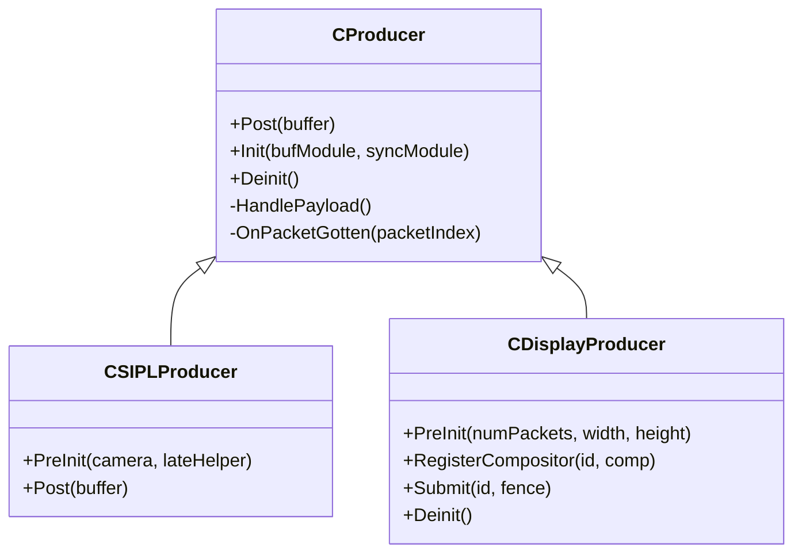

**Diagram sources**
- [CProducer.hpp:16-52](file://CProducer.hpp#L16-L52)
- [CSIPLProducer.hpp:18-84](file://CSIPLProducer.hpp#L18-L84)
- [CDisplayProducer.hpp:18-127](file://CDisplayProducer.hpp#L18-L127)

**Section sources**
- [CProducer.hpp:16-52](file://CProducer.hpp#L16-L52)
- [CSIPLProducer.hpp:18-84](file://CSIPLProducer.hpp#L18-L84)
- [CDisplayProducer.hpp:18-127](file://CDisplayProducer.hpp#L18-L127)

### Data Flow: Camera Capture to Consumers
End-to-end flow:
- CSiplCamera captures frames and signals via frame completion queues.
- CMaster receives OnFrameAvailable and routes to channel/consumer.
- CDisplayChannel connects producer to consumer(s) via NvStreams blocks.
- Consumers process payloads asynchronously with synchronization via NvSciSync.

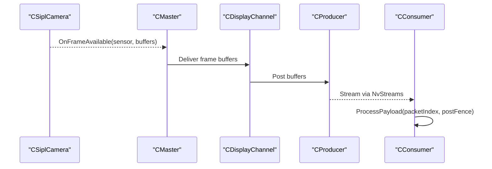

**Diagram sources**
- [CSiplCamera.hpp:577-582](file://CSiplCamera.hpp#L577-L582)
- [CMaster.hpp:51-52](file://CMaster.hpp#L51-L52)
- [CDisplayChannel.hpp:134-184](file://CDisplayChannel.hpp#L134-L184)
- [CConsumer.hpp:30-35](file://CConsumer.hpp#L30-L35)

**Section sources**
- [CSiplCamera.hpp:577-582](file://CSiplCamera.hpp#L577-L582)
- [CMaster.hpp:51-52](file://CMaster.hpp#L51-L52)
- [CDisplayChannel.hpp:134-184](file://CDisplayChannel.hpp#L134-L184)
- [CConsumer.hpp:30-35](file://CConsumer.hpp#L30-L35)

### System Boundaries and Integration Points
- Intra-process: All components run in a single process; channels and clients communicate via NvStreams blocks.
- Inter-process: IPC endpoints and blocks created via CFactory enable cross-process distribution.
- Inter-chip: PCIe C2C endpoints and blocks created via CFactory enable inter-chip distribution.
- Integration with NVIDIA SIPL: CSiplCamera integrates with NvSIPL camera APIs and pipelines.
- Integration with NvStreams: NvSciBuf/NvSciSync/NvSciStream are used for buffer and synchronization primitives.

Communication modes and types are defined in Common.hpp and configured via CAppConfig.

**Section sources**
- [Common.hpp:35-87](file://Common.hpp#L35-L87)
- [CAppConfig.hpp:19-83](file://CAppConfig.hpp#L19-L83)
- [CFactory.hpp:52-76](file://CFactory.hpp#L52-L76)

## Dependency Analysis
Key dependencies:
- CMaster depends on CSiplCamera, CFactory, CChannel, and display channel.
- CDisplayChannel depends on CFactory for pool/consumer/producer creation.
- Consumers depend on CClientCommon and NvSci primitives.
- Producers depend on NvSIPL camera and NvStreams.

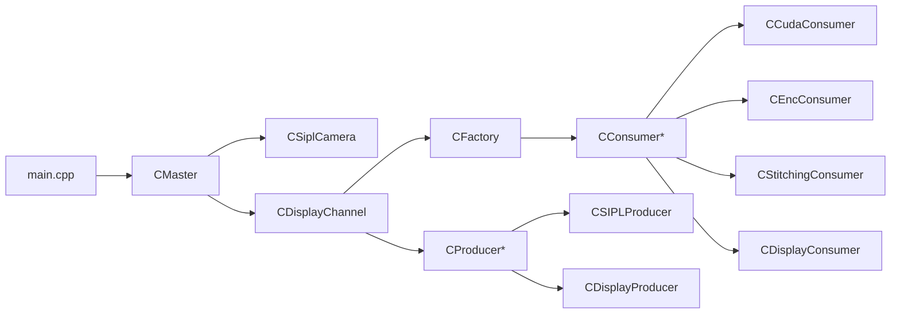

**Diagram sources**
- [main.cpp:253-304](file://main.cpp#L253-L304)
- [CMaster.hpp:46-92](file://CMaster.hpp#L46-L92)
- [CDisplayChannel.hpp:19-223](file://CDisplayChannel.hpp#L19-L223)
- [CFactory.hpp:27-92](file://CFactory.hpp#L27-L92)
- [CConsumer.hpp:16-44](file://CConsumer.hpp#L16-L44)
- [CProducer.hpp:16-52](file://CProducer.hpp#L16-L52)

**Section sources**
- [main.cpp:253-304](file://main.cpp#L253-L304)
- [CMaster.hpp:46-92](file://CMaster.hpp#L46-L92)
- [CDisplayChannel.hpp:19-223](file://CDisplayChannel.hpp#L19-L223)
- [CFactory.hpp:27-92](file://CFactory.hpp#L27-L92)
- [CConsumer.hpp:16-44](file://CConsumer.hpp#L16-L44)
- [CProducer.hpp:16-52](file://CProducer.hpp#L16-L52)

## Performance Considerations
- Asynchronous processing: Consumers process payloads independently, reducing latency and improving throughput.
- Fence-based synchronization: NvSciSync fences coordinate producer-consumer handoffs efficiently.
- Multicast distribution: Single producer can distribute to multiple consumers with minimal duplication.
- Event-driven channels: Thread-per-block event loops reduce CPU overhead and improve responsiveness.
- Queue types: Mailbox vs FIFO queues influence latency and ordering guarantees; selection impacts performance.

## Troubleshooting Guide
- Power management events: CMaster handles suspend/resume and forwards commands from stdin or socket.
- Dynamic attach/detach: Consumers can be attached/detached when the producer is resident.
- Error handling: CSiplCamera and pipeline notification handlers report errors and frame drops; configuration allows ignoring certain errors.
- Event timeouts: Channel event handlers track timeouts and log warnings; persistent timeouts indicate stalled blocks.

Operational controls:
- stdin: q (quit), s (suspend), r (resume), at (attach), de (detach)
- socket: messages for suspend/resume requests

**Section sources**
- [main.cpp:74-153](file://main.cpp#L74-L153)
- [main.cpp:155-251](file://main.cpp#L155-L251)
- [CMaster.hpp:53-64](file://CMaster.hpp#L53-L64)
- [CSiplCamera.hpp:414-485](file://CSiplCamera.hpp#L414-L485)

## Conclusion
The NVIDIA SIPL Multicast system employs a clean modular architecture centered on a Producer-Consumer pattern with Factory-driven construction of pluggable components. CMaster orchestrates CSiplCamera, manages channels, and coordinates consumers created by CFactory. Data flows from camera capture through NvStreams to multiple asynchronous consumers, supporting intra-process, inter-process, and inter-chip distributions. Architectural patterns—Observer for dynamic attachment, Strategy for pluggable consumers, and Singleton for centralized factory management—enable flexible, scalable, and maintainable streaming pipelines.