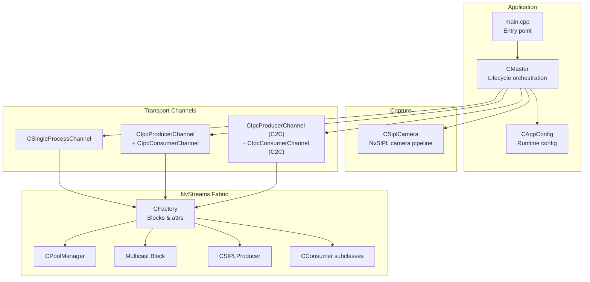
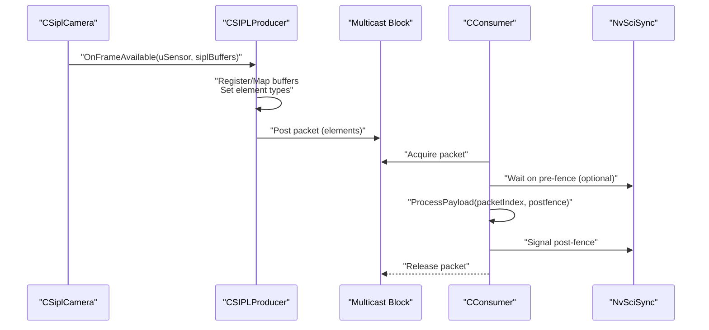
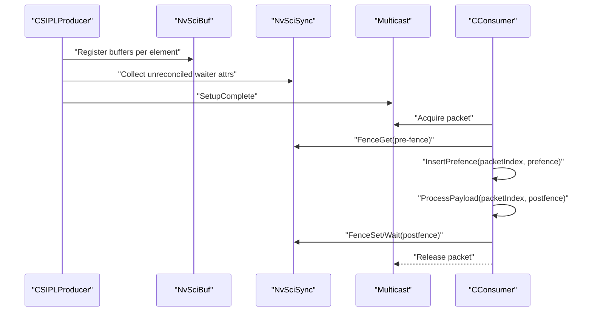
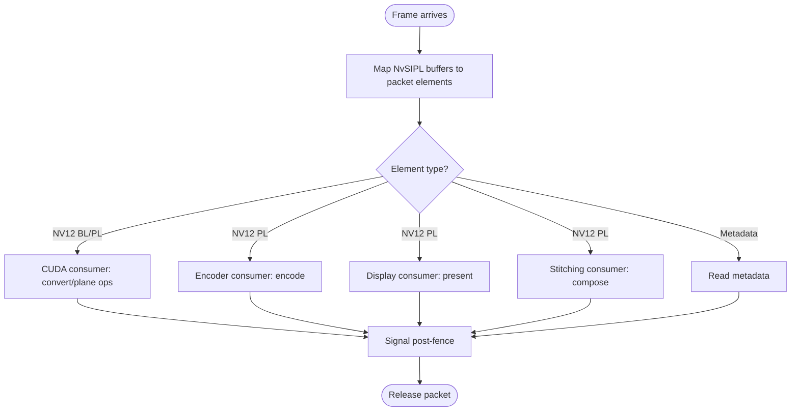
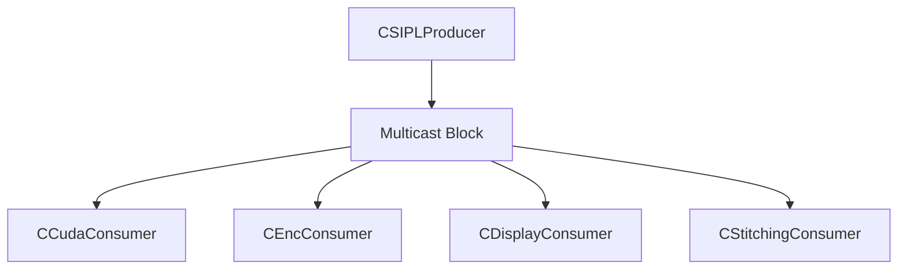
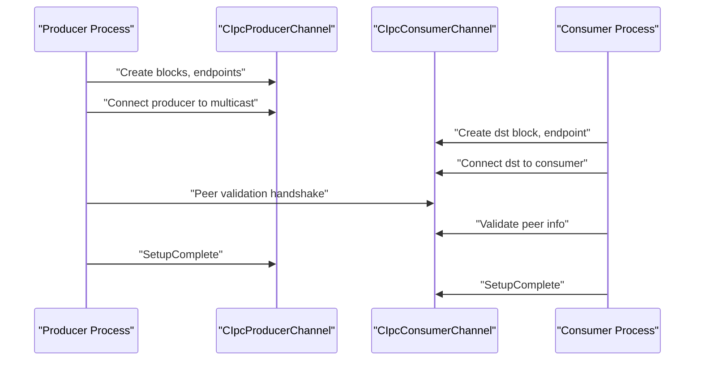
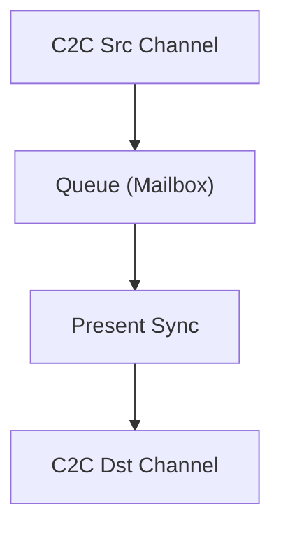
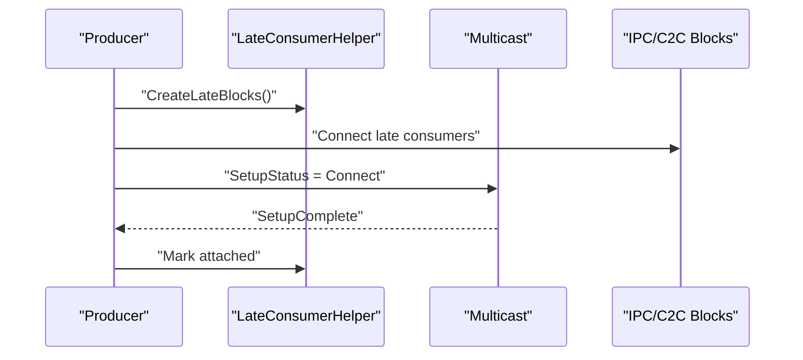
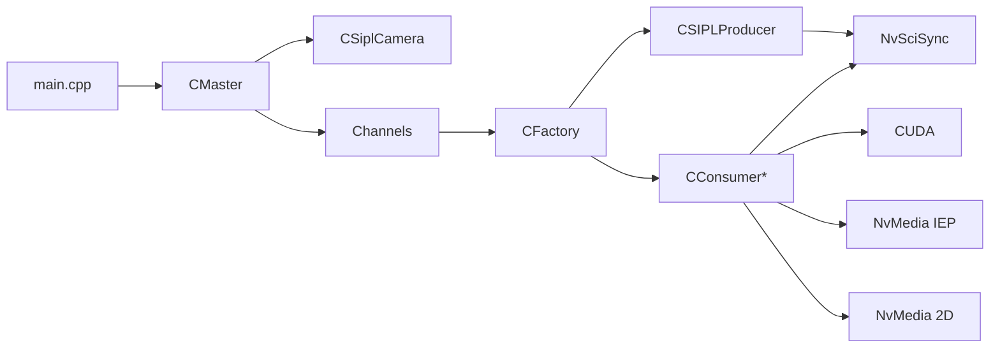

# Data Flow Patterns

<cite>
**Referenced Files in This Document**
- [main.cpp](file://main.cpp)
- [README.md](file://README.md)
- [Common.hpp](file://Common.hpp)
- [CAppConfig.hpp](file://CAppConfig.hpp)
- [CAppConfig.cpp](file://CAppConfig.cpp)
- [CFactory.hpp](file://CFactory.hpp)
- [CFactory.cpp](file://CFactory.cpp)
- [CMaster.hpp](file://CMaster.hpp)
- [CMaster.cpp](file://CMaster.cpp)
- [CSiplCamera.hpp](file://CSiplCamera.hpp)
- [CProducer.hpp](file://CProducer.hpp)
- [CSIPLProducer.hpp](file://CSIPLProducer.hpp)
- [CConsumer.hpp](file://CConsumer.hpp)
- [CCudaConsumer.hpp](file://CCudaConsumer.hpp)
- [CEncConsumer.hpp](file://CEncConsumer.hpp)
- [CDisplayConsumer.hpp](file://CDisplayConsumer.hpp)
- [CStitchingConsumer.hpp](file://CStitchingConsumer.hpp)
- [CIpcProducerChannel.hpp](file://CIpcProducerChannel.hpp)
- [CIpcConsumerChannel.hpp](file://CIpcConsumerChannel.hpp)
- [CSingleProcessChannel.hpp](file://CSingleProcessChannel.hpp)
</cite>

## Table of Contents
1. [Introduction](#introduction)
2. [Project Structure](#project-structure)
3. [Core Components](#core-components)
4. [Architecture Overview](#architecture-overview)
5. [Detailed Component Analysis](#detailed-component-analysis)
6. [Dependency Analysis](#dependency-analysis)
7. [Performance Considerations](#performance-considerations)
8. [Troubleshooting Guide](#troubleshooting-guide)
9. [Conclusion](#conclusion)
10. [Appendices](#appendices)

## Introduction
This document explains the data flow patterns in the NVIDIA SIPL Multicast system. It covers how frames captured by CSiplCamera are transformed and distributed via NvStreams multi-element streams to multiple asynchronous consumers. It documents the Producer-Consumer model built on NvSciBuf/NvSciSync, the multi-element packet composition (including YUV planes and metadata), and the communication modes across intra-process, inter-process (peer-to-peer), and inter-chip (chip-to-chip) environments. Practical flow diagrams and code-path references illustrate typical data pathways.

## Project Structure
The multicast sample orchestrates a camera capture pipeline, a producer-consumer NvStreams topology, and multiple consumer types (CUDA, encoder, display, stitching). Channels encapsulate transport-specific wiring (single-process, IPC, C2C), while a factory creates blocks and manages element attributes and synchronization objects.

**Diagram sources**
- [main.cpp:253-304](file://main.cpp#L253-L304)
- [CMaster.hpp:47-95](file://CMaster.hpp#L47-L95)
- [CSiplCamera.hpp:46-85](file://CSiplCamera.hpp#L46-L85)
- [CSingleProcessChannel.hpp:21-247](file://CSingleProcessChannel.hpp#L21-L247)
- [CIpcProducerChannel.hpp:20-533](file://CIpcProducerChannel.hpp#L20-L533)
- [CIpcConsumerChannel.hpp:19-264](file://CIpcConsumerChannel.hpp#L19-L264)
- [CFactory.hpp:27-95](file://CFactory.hpp#L27-L95)

**Section sources**
- [main.cpp:253-304](file://main.cpp#L253-L304)
- [README.md:11-109](file://README.md#L11-L109)

## Core Components
- CSiplCamera: Manages NvSIPL camera pipelines, notification queues, and frame completion queues. Emits per-sensor frames to the producer via a callback interface.
- CSIPLProducer: Bridges NvSIPL buffers to NvStreams, registering buffers and mapping NvSIPL output types to packet elements, coordinating pre/post fences.
- Consumers: CConsumer base plus CCudaConsumer, CEncConsumer, CDisplayConsumer, CStitchingConsumer implement payload processing and fence signaling.
- Channels: CSingleProcessChannel (intra-process), CIpcProducerChannel/CIpcConsumerChannel (inter-process), and C2C variants (inter-chip) construct the transport graph.
- Factory: Creates blocks, sets element attributes, and wires endpoints for IPC/C2C.

**Section sources**
- [CSiplCamera.hpp:46-85](file://CSiplCamera.hpp#L46-L85)
- [CProducer.hpp:16-53](file://CProducer.hpp#L16-L53)
- [CSIPLProducer.hpp:18-84](file://CSIPLProducer.hpp#L18-L84)
- [CConsumer.hpp:16-45](file://CConsumer.hpp#L16-L45)
- [CCudaConsumer.hpp:25-81](file://CCudaConsumer.hpp#L25-L81)
- [CEncConsumer.hpp:17-66](file://CEncConsumer.hpp#L17-L66)
- [CDisplayConsumer.hpp:15-49](file://CDisplayConsumer.hpp#L15-L49)
- [CStitchingConsumer.hpp:17-74](file://CStitchingConsumer.hpp#L17-L74)
- [CSingleProcessChannel.hpp:21-247](file://CSingleProcessChannel.hpp#L21-L247)
- [CIpcProducerChannel.hpp:20-533](file://CIpcProducerChannel.hpp#L20-L533)
- [CIpcConsumerChannel.hpp:19-264](file://CIpcConsumerChannel.hpp#L19-L264)
- [CFactory.hpp:27-95](file://CFactory.hpp#L27-L95)

## Architecture Overview
The system follows a multi-stage pipeline:
- Capture: CSiplCamera pulls frames from NvSIPL pipelines and aggregates per-sensor outputs.
- Distribution: CSIPLProducer registers buffers and maps NvSIPL output types to packet elements (e.g., NV12 planes, metadata). It posts packets to a multicast NvStreams block.
- Consumption: Consumers acquire packets, wait on pre-fences, process payloads (conversion, encoding, display, stitching), and signal post-fences.
- Transport: Channels wire producer/consumer blocks via IPC or C2C queues and present syncs, with optional late-attach support.

**Diagram sources**
- [CSiplCamera.hpp:520-620](file://CSiplCamera.hpp#L520-L620)
- [CSIPLProducer.hpp:26-84](file://CSIPLProducer.hpp#L26-L84)
- [CConsumer.hpp:17-94](file://CConsumer.hpp#L17-L94)

**Section sources**
- [README.md:11-109](file://README.md#L11-L109)
- [Common.hpp:35-86](file://Common.hpp#L35-L86)

## Detailed Component Analysis

### Producer-Consumer Pattern with NvSciBuf/NvSciSync
- Producer lifecycle:
  - Initialize client and stream, register buffers per element type, reconcile attributes, and finalize setup.
  - On frame arrival, map NvSIPL buffers to packet elements, optionally insert pre-fences, and post the packet.
- Consumer lifecycle:
  - Acquire packet, optionally wait on pre-fence, process payload, and set post-fence (CPU wait or set fence on packet).
  - Release packet back to producer.

**Diagram sources**
- [CProducer.hpp:26-51](file://CProducer.hpp#L26-L51)
- [CConsumer.hpp:17-94](file://CConsumer.hpp#L17-L94)
- [CSIPLProducer.hpp:30-56](file://CSIPLProducer.hpp#L30-L56)

**Section sources**
- [CProducer.hpp:16-53](file://CProducer.hpp#L16-L53)
- [CConsumer.hpp:16-45](file://CConsumer.hpp#L16-L45)
- [CSIPLProducer.hpp:18-84](file://CSIPLProducer.hpp#L18-L84)

### Data Transformation Pipeline: YUV Processing and Metadata
- Element types:
  - NV12 block-linear and planar mapped to packet elements.
  - Metadata element included for downstream consumers.
- CUDA consumer:
  - Converts block-linear NV12 to planar layout for GPU processing.
  - Optionally runs inference (car detection) and supports dumping raw buffers.
- Encoder consumer:
  - Uses NvMedia IEP to encode frames; handles EOF signaling and post-fence semantics.
- Display/Stitching consumers:
  - Display consumer integrates with WFD controller; stitching composes multiple views.

**Diagram sources**
- [Common.hpp:78-86](file://Common.hpp#L78-L86)
- [CCudaConsumer.hpp:25-81](file://CCudaConsumer.hpp#L25-L81)
- [CEncConsumer.hpp:17-66](file://CEncConsumer.hpp#L17-L66)
- [CDisplayConsumer.hpp:15-49](file://CDisplayConsumer.hpp#L15-L49)
- [CStitchingConsumer.hpp:17-74](file://CStitchingConsumer.hpp#L17-L74)

**Section sources**
- [Common.hpp:78-86](file://Common.hpp#L78-L86)
- [CCudaConsumer.hpp:25-81](file://CCudaConsumer.hpp#L25-L81)
- [CEncConsumer.hpp:17-66](file://CEncConsumer.hpp#L17-L66)
- [CDisplayConsumer.hpp:15-49](file://CDisplayConsumer.hpp#L15-L49)
- [CStitchingConsumer.hpp:17-74](file://CStitchingConsumer.hpp#L17-L74)

### Communication Patterns Across Modes

#### Intra-Process Mode
- Single process hosts producer and multiple consumers.
- Channel constructs a multicast block and connects producer to consumers locally.

**Diagram sources**
- [CSingleProcessChannel.hpp:87-209](file://CSingleProcessChannel.hpp#L87-L209)

**Section sources**
- [CSingleProcessChannel.hpp:21-247](file://CSingleProcessChannel.hpp#L21-L247)

#### Inter-Process (Peer-to-Peer)
- Producer and consumers run in separate processes.
- IPC endpoints and blocks are created and connected; peer validation ensures consistent platform configuration.

**Diagram sources**
- [CIpcProducerChannel.hpp:133-203](file://CIpcProducerChannel.hpp#L133-L203)
- [CIpcConsumerChannel.hpp:85-128](file://CIpcConsumerChannel.hpp#L85-L128)

**Section sources**
- [CIpcProducerChannel.hpp:20-533](file://CIpcProducerChannel.hpp#L20-L533)
- [CIpcConsumerChannel.hpp:19-264](file://CIpcConsumerChannel.hpp#L19-L264)
- [README.md:47-66](file://README.md#L47-L66)

#### Inter-Chip (Chip-to-Chip)
- C2C source and destination channels are used; optional mailbox queue and present sync blocks enable presentation coordination.

**Diagram sources**
- [CIpcProducerChannel.hpp:411-530](file://CIpcProducerChannel.hpp#L411-L530)
- [CIpcConsumerChannel.hpp:184-261](file://CIpcConsumerChannel.hpp#L184-L261)

**Section sources**
- [CIpcProducerChannel.hpp:411-530](file://CIpcProducerChannel.hpp#L411-L530)
- [CIpcConsumerChannel.hpp:184-261](file://CIpcConsumerChannel.hpp#L184-L261)
- [README.md:67-79](file://README.md#L67-L79)

### Late-/Re-Attach Mechanism
- Late consumer helper enables attaching new consumers after initial setup.
- Producer indicates readiness and reconnects multicast with newly created IPC/C2C blocks.

**Diagram sources**
- [CIpcProducerChannel.hpp:205-272](file://CIpcProducerChannel.hpp#L205-L272)

**Section sources**
- [CIpcProducerChannel.hpp:58-76](file://CIpcProducerChannel.hpp#L58-L76)
- [CIpcProducerChannel.hpp:304-327](file://CIpcProducerChannel.hpp#L304-L327)
- [README.md:80-91](file://README.md#L80-L91)

### Frame Filtering and Timing Control
- Consumers can filter frames (e.g., process every k-th frame) and enforce runtime duration limits via application configuration.

**Section sources**
- [CConsumer.hpp:37-43](file://CConsumer.hpp#L37-L43)
- [CAppConfig.hpp:42-46](file://CAppConfig.hpp#L42-L46)
- [CAppConfig.cpp](file://CAppConfig.cpp)

## Dependency Analysis
The system exhibits layered dependencies:
- Application entry (main) constructs CMaster, which initializes CSiplCamera and channels.
- Channels depend on CFactory for block creation and element attribute reconciliation.
- Producers and consumers depend on NvSciBuf/NvSciSync for memory and synchronization.
- Consumer implementations depend on device libraries (CUDA, NvMedia IEP, 2D composition).

**Diagram sources**
- [main.cpp:253-304](file://main.cpp#L253-L304)
- [CMaster.hpp:47-95](file://CMaster.hpp#L47-L95)
- [CFactory.hpp:27-95](file://CFactory.hpp#L27-L95)
- [CCudaConsumer.hpp:25-81](file://CCudaConsumer.hpp#L25-L81)
- [CEncConsumer.hpp:17-66](file://CEncConsumer.hpp#L17-L66)
- [CStitchingConsumer.hpp:17-74](file://CStitchingConsumer.hpp#L17-L74)

**Section sources**
- [CFactory.hpp:27-95](file://CFactory.hpp#L27-L95)
- [CMaster.hpp:47-95](file://CMaster.hpp#L47-L95)

## Performance Considerations
- Fence-based synchronization avoids CPU polling; consumers can wait on pre-fences or set post-fences efficiently.
- Multi-element packets reduce transport overhead by carrying multiple planes and metadata in one transaction.
- Late-attach minimizes cold-start latency by deferring consumer attachment until needed.
- Queue types (FIFO vs Mailbox) influence freshness guarantees; mailbox prioritizes latest buffers.

[No sources needed since this section provides general guidance]

## Troubleshooting Guide
- Lifecycle errors: Verify SetupComplete events for producer, multicast, and consumers; ensure peer validation passes in inter-process mode.
- Frame drops and timeouts: Inspect pipeline notifications for warnings and errors; adjust frame filtering and runtime duration.
- IPC/C2C connectivity: Confirm endpoint creation and block connections; ensure queue and present sync blocks are queried to completion.

**Section sources**
- [CIpcProducerChannel.hpp:172-203](file://CIpcProducerChannel.hpp#L172-L203)
- [CIpcConsumerChannel.hpp:94-117](file://CIpcConsumerChannel.hpp#L94-L117)
- [CSiplCamera.hpp:414-485](file://CSiplCamera.hpp#L414-L485)

## Conclusion
The NVIDIA SIPL Multicast system implements a robust, scalable data flow from camera capture to multi-element NvStreams distribution. Using NvSciBuf/NvSciSync, it coordinates producers and consumers across intra-process, inter-process, and inter-chip modes. The modular design, element-based packetization, and late-attach capability enable flexible deployments and efficient processing pipelines.

[No sources needed since this section summarizes without analyzing specific files]

## Appendices

### Typical Data Path References
- Producer posting frames:
  - [CSIPLProducer::Post](file://CSIPLProducer.hpp#L27)
  - [CProducer::HandlePayload](file://CProducer.hpp#L30)
- Consumer processing loop:
  - [CConsumer::HandlePayload:17-94](file://CConsumer.hpp#L17-L94)
- Element types and packet mapping:
  - [Common.hpp PacketElementType:78-86](file://Common.hpp#L78-L86)
  - [CSIPLProducer mapping helpers:65-74](file://CSIPLProducer.hpp#L65-L74)
- Channel wiring:
  - [CSingleProcessChannel::Connect:161-209](file://CSingleProcessChannel.hpp#L161-L209)
  - [CIpcProducerChannel::Connect:133-183](file://CIpcProducerChannel.hpp#L133-L183)
  - [CIpcConsumerChannel::Connect:85-117](file://CIpcConsumerChannel.hpp#L85-L117)