# Integration Interfaces

<cite>
**Referenced Files in This Document**
- [CClientCommon.hpp](file://CClientCommon.hpp)
- [CClientCommon.cpp](file://CClientCommon.cpp)
- [CEventHandler.hpp](file://CEventHandler.hpp)
- [CProducer.hpp](file://CProducer.hpp)
- [CConsumer.hpp](file://CConsumer.hpp)
- [CSIPLProducer.hpp](file://CSIPLProducer.hpp)
- [CSIPLProducer.cpp](file://CSIPLProducer.cpp)
- [CSiplCamera.hpp](file://CSiplCamera.hpp)
- [CSiplCamera.cpp](file://CSiplCamera.cpp)
- [CFactory.hpp](file://CFactory.hpp)
- [CFactory.cpp](file://CFactory.cpp)
- [Common.hpp](file://Common.hpp)
- [CAppConfig.hpp](file://CAppConfig.hpp)
- [CAppConfig.cpp](file://CAppConfig.cpp)
- [CDisplayProducer.hpp](file://CDisplayProducer.hpp)
- [CDisplayConsumer.hpp](file://CDisplayConsumer.hpp)
- [CEncConsumer.hpp](file://CEncConsumer.hpp)
</cite>

## Table of Contents
1. [Introduction](#introduction)
2. [Project Structure](#project-structure)
3. [Core Components](#core-components)
4. [Architecture Overview](#architecture-overview)
5. [Detailed Component Analysis](#detailed-component-analysis)
6. [Dependency Analysis](#dependency-analysis)
7. [Performance Considerations](#performance-considerations)
8. [Troubleshooting Guide](#troubleshooting-guide)
9. [Conclusion](#conclusion)
10. [Appendices](#appendices)

## Introduction
This document explains the integration interfaces and external system connections in the NVIDIA SIPL Multicast architecture. It focuses on:
- Integration with the NVIDIA SIPL camera pipeline
- NvStreams multi-element distribution via NvSciBuf/NvSciSync
- NvMedia hardware acceleration paths
- Cross-process coordination using NvSciBuf/NvSciSync primitives
- The CClientCommon base class providing shared functionality and synchronization
- Event handling, error propagation, and graceful shutdown
- Integration examples with external processing libraries and custom display systems

## Project Structure
The multicast module organizes integration interfaces around a small set of core classes:
- Base synchronization and stream client: CClientCommon
- Producer and consumer base classes: CProducer, CConsumer
- SIPL camera producer: CSIPLProducer
- Camera pipeline wrapper: CSiplCamera
- Factory for building blocks: CFactory
- Application configuration: CAppConfig
- Additional consumers/producers for display and encoding: CDisplayConsumer, CDisplayProducer, CEncConsumer

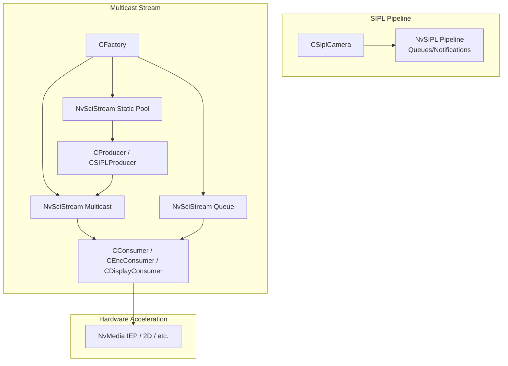

**Diagram sources**
- [CFactory.cpp:11-221](file://CFactory.cpp#L11-L221)
- [CSIPLProducer.cpp:16-35](file://CSIPLProducer.cpp#L16-L35)
- [CSiplCamera.cpp:209-286](file://CSiplCamera.cpp#L209-L286)
- [CProducer.hpp:16-51](file://CProducer.hpp#L16-L51)
- [CConsumer.hpp:16-44](file://CConsumer.hpp#L16-L44)

**Section sources**
- [CFactory.cpp:11-221](file://CFactory.cpp#L11-L221)
- [Common.hpp:14-34](file://Common.hpp#L14-L34)

## Core Components
This section describes the foundational integration interfaces and synchronization primitives.

- CClientCommon: Base class implementing NvSciBuf/NvSciSync attribute negotiation, packet lifecycle, and event-driven runtime. Provides:
  - Element attribute setup (data and metadata)
  - Waiter/signaler attribute reconciliation and sync object allocation
  - Packet creation, mapping, and payload handling
  - Cookie-based packet indexing and cookie assignment
  - CPU wait support and fence insertion
- CEventHandler: Event loop abstraction used by clients to process NvSciStream events
- CProducer: Producer-side specialization of CClientCommon with Post semantics and fence handling
- CConsumer: Consumer-side specialization with payload processing hooks and optional CPU wait

Key integration points:
- NvSciBuf attribute lists define buffer layouts and permissions
- NvSciSync attribute lists define signaling/wait semantics across processes
- ElementInfo declares which elements are used and whether siblings share sync objects

**Section sources**
- [CClientCommon.hpp:47-199](file://CClientCommon.hpp#L47-L199)
- [CClientCommon.cpp:95-205](file://CClientCommon.cpp#L95-L205)
- [CEventHandler.hpp:23-51](file://CEventHandler.hpp#L23-L51)
- [CProducer.hpp:16-51](file://CProducer.hpp#L16-L51)
- [CConsumer.hpp:16-44](file://CConsumer.hpp#L16-L44)

## Architecture Overview
The SIPL Multicast architecture integrates the NvSIPL camera pipeline with NvStreams for multi-element distribution and NvMedia for hardware-accelerated processing.

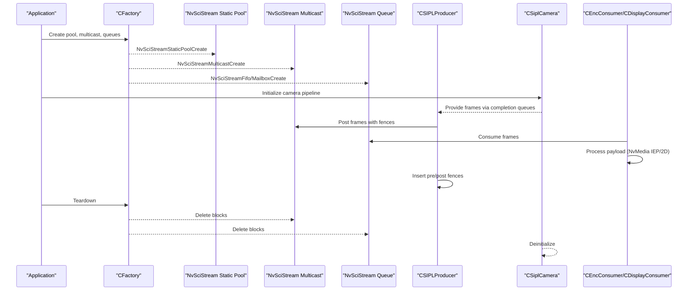

**Diagram sources**
- [CFactory.cpp:11-221](file://CFactory.cpp#L11-L221)
- [CSIPLProducer.cpp:367-404](file://CSIPLProducer.cpp#L367-L404)
- [CSiplCamera.cpp:209-286](file://CSiplCamera.cpp#L209-L286)
- [CConsumer.hpp:29-35](file://CConsumer.hpp#L29-L35)

## Detailed Component Analysis

### CClientCommon: Shared Synchronization and Stream Client
CClientCommon orchestrates:
- Element attribute export/import
- Waiter/signaler attribute reconciliation and sync object allocation
- Packet creation, mapping, and payload delivery
- Cookie-based packet indexing and cookie assignment
- CPU wait support and fence insertion

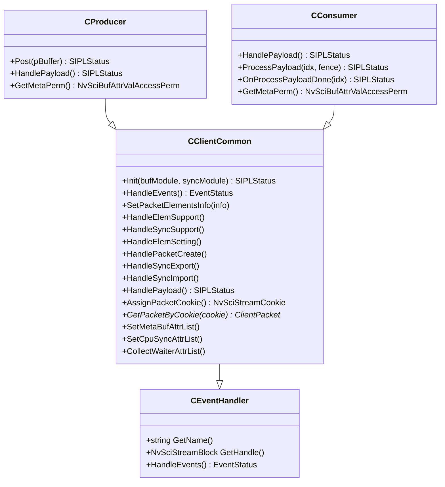

**Diagram sources**
- [CEventHandler.hpp:23-51](file://CEventHandler.hpp#L23-L51)
- [CClientCommon.hpp:47-199](file://CClientCommon.hpp#L47-L199)
- [CProducer.hpp:16-51](file://CProducer.hpp#L16-L51)
- [CConsumer.hpp:16-44](file://CConsumer.hpp#L16-L44)

**Section sources**
- [CClientCommon.cpp:95-205](file://CClientCommon.cpp#L95-L205)
- [CClientCommon.cpp:300-325](file://CClientCommon.cpp#L300-L325)
- [CClientCommon.cpp:327-365](file://CClientCommon.cpp#L327-L365)
- [CClientCommon.cpp:367-408](file://CClientCommon.cpp#L367-L408)
- [CClientCommon.cpp:410-467](file://CClientCommon.cpp#L410-L467)
- [CClientCommon.cpp:469-553](file://CClientCommon.cpp#L469-L553)
- [CClientCommon.cpp:555-591](file://CClientCommon.cpp#L555-L591)
- [CClientCommon.cpp:593-604](file://CClientCommon.cpp#L593-L604)
- [CClientCommon.cpp:606-624](file://CClientCommon.cpp#L606-L624)
- [CClientCommon.cpp:626-633](file://CClientCommon.cpp#L626-L633)

### CSIPLProducer: SIPL Camera Pipeline Integration
CSIPLProducer bridges the NvSIPL camera pipeline to NvStreams:
- Maps SIPL output types to packet elements
- Sets NvSciBuf attributes for image formats and CPU access
- Registers NvSciSync objects with the camera for EOF/PRE synchronization
- Inserts pre/post fences and presents packets to consumers

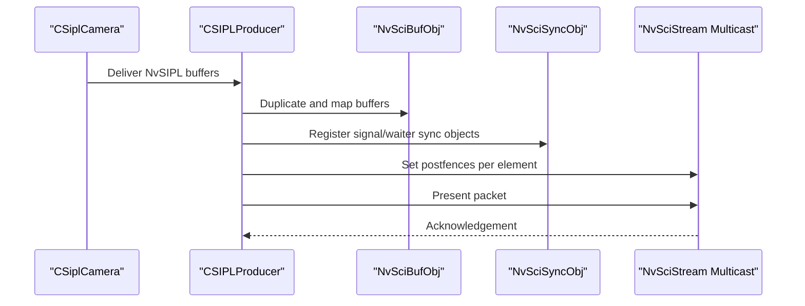

**Diagram sources**
- [CSIPLProducer.cpp:367-404](file://CSIPLProducer.cpp#L367-L404)
- [CSIPLProducer.cpp:179-206](file://CSIPLProducer.cpp#L179-L206)
- [CSIPLProducer.cpp:208-241](file://CSIPLProducer.cpp#L208-L241)
- [CSIPLProducer.cpp:254-269](file://CSIPLProducer.cpp#L254-L269)

**Section sources**
- [CSIPLProducer.hpp:18-81](file://CSIPLProducer.hpp#L18-L81)
- [CSIPLProducer.cpp:54-61](file://CSIPLProducer.cpp#L54-L61)
- [CSIPLProducer.cpp:75-105](file://CSIPLProducer.cpp#L75-L105)
- [CSIPLProducer.cpp:107-177](file://CSIPLProducer.cpp#L107-L177)
- [CSIPLProducer.cpp:179-206](file://CSIPLProducer.cpp#L179-L206)
- [CSIPLProducer.cpp:208-241](file://CSIPLProducer.cpp#L208-L241)
- [CSIPLProducer.cpp:254-269](file://CSIPLProducer.cpp#L254-L269)
- [CSIPLProducer.cpp:271-287](file://CSIPLProducer.cpp#L271-L287)
- [CSIPLProducer.cpp:326-346](file://CSIPLProducer.cpp#L326-L346)
- [CSIPLProducer.cpp:367-404](file://CSIPLProducer.cpp#L367-L404)

### CSiplCamera: NvSIPL Pipeline Wrapper
CSiplCamera initializes and manages the NvSIPL camera pipeline:
- Builds platform configuration and sensor lists
- Creates pipeline queues and notification handlers
- Manages frame completion queues and dispatches frames to CSIPLProducer
- Handles device block and pipeline notifications

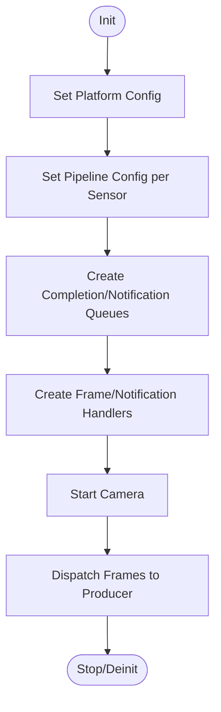

**Diagram sources**
- [CSiplCamera.cpp:209-286](file://CSiplCamera.cpp#L209-L286)
- [CSiplCamera.cpp:289-323](file://CSiplCamera.cpp#L289-L323)
- [CSiplCamera.cpp:523-618](file://CSiplCamera.cpp#L523-L618)

**Section sources**
- [CSiplCamera.hpp:46-85](file://CSiplCamera.hpp#L46-L85)
- [CSiplCamera.cpp:137-169](file://CSiplCamera.cpp#L137-L169)
- [CSiplCamera.cpp:209-286](file://CSiplCamera.cpp#L209-L286)
- [CSiplCamera.cpp:289-323](file://CSiplCamera.cpp#L289-L323)
- [CSiplCamera.cpp:523-618](file://CSiplCamera.cpp#L523-L618)

### CFactory: Building Blocks and IPC
CFactory constructs and wires the integration components:
- Static pools, multicast blocks, and queues
- Producer/consumer creation with element sets
- IPC endpoints and C2C channels for inter-process and inter-chip communication
- Present sync creation for display timing

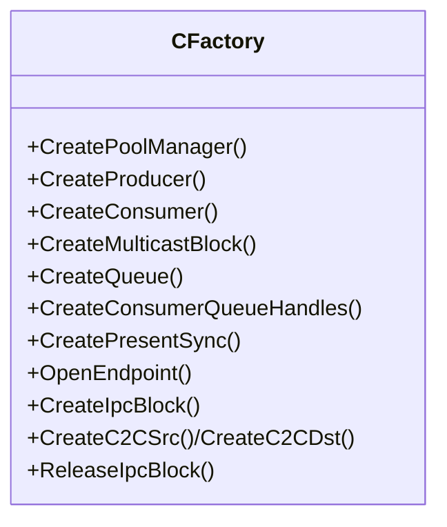

**Diagram sources**
- [CFactory.hpp:27-92](file://CFactory.hpp#L27-L92)
- [CFactory.cpp:11-221](file://CFactory.cpp#L11-L221)

**Section sources**
- [CFactory.cpp:11-221](file://CFactory.cpp#L11-L221)
- [CFactory.cpp:223-314](file://CFactory.cpp#L223-L314)

### NvSciBuf/NvSciSync Synchronization Primitives
Cross-process coordination relies on:
- Element attribute lists exported by producers and imported by consumers
- Waiter/signaler attribute reconciliation and sync object allocation
- Fence insertion for pipeline ordering (pre/post)
- Optional CPU wait contexts for host-side synchronization

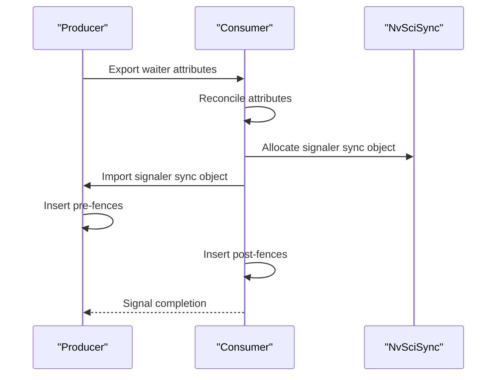

**Diagram sources**
- [CClientCommon.cpp:469-553](file://CClientCommon.cpp#L469-L553)
- [CClientCommon.cpp:555-591](file://CClientCommon.cpp#L555-L591)
- [CClientCommon.cpp:593-604](file://CClientCommon.cpp#L593-L604)
- [CClientCommon.cpp:606-624](file://CClientCommon.cpp#L606-L624)

**Section sources**
- [CClientCommon.cpp:327-365](file://CClientCommon.cpp#L327-L365)
- [CClientCommon.cpp:469-553](file://CClientCommon.cpp#L469-L553)
- [CClientCommon.cpp:555-591](file://CClientCommon.cpp#L555-L591)

### Event Handling, Error Propagation, and Graceful Shutdown
- Event handling: CClientCommon::HandleEvents processes NvSciStream events (elements, packet create/delete, setup complete, packet ready, error, disconnected)
- Error propagation: Errors are logged and mapped to status codes; consumers can stop on errors
- Graceful shutdown: CFactory deletes blocks and closes endpoints; CSiplCamera deinitializes handlers and camera

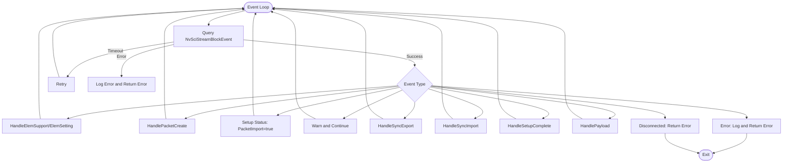

**Diagram sources**
- [CClientCommon.cpp:119-205](file://CClientCommon.cpp#L119-L205)

**Section sources**
- [CClientCommon.cpp:119-205](file://CClientCommon.cpp#L119-L205)
- [CFactory.cpp:265-274](file://CFactory.cpp#L265-L274)
- [CSiplCamera.cpp:289-323](file://CSiplCamera.cpp#L289-L323)

### Integration Examples

#### Example 1: Integrating with External Processing Libraries
- Producer side: CSIPLProducer maps NvSIPL buffers to NvSciBufObj and registers them with the camera for synchronization
- Consumer side: CEncConsumer/CCudaConsumer map buffers and use NvMedia IEP or CUDA for processing
- Synchronization: Pre/post fences inserted by producer/consumer ensure correct ordering across libraries

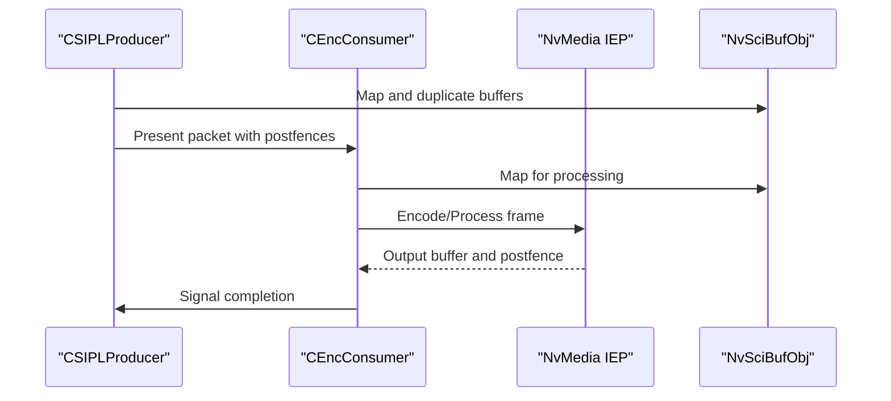

**Diagram sources**
- [CSIPLProducer.cpp:179-206](file://CSIPLProducer.cpp#L179-L206)
- [CSIPLProducer.cpp:367-404](file://CSIPLProducer.cpp#L367-L404)
- [CEncConsumer.hpp:17-66](file://CEncConsumer.hpp#L17-L66)

**Section sources**
- [CSIPLProducer.cpp:179-206](file://CSIPLProducer.cpp#L179-L206)
- [CSIPLProducer.cpp:367-404](file://CSIPLProducer.cpp#L367-L404)
- [CEncConsumer.hpp:17-66](file://CEncConsumer.hpp#L17-L66)

#### Example 2: Custom Display Systems
- Producer side: CDisplayProducer prepares display buffers and inserts pre-fences from downstream compositors
- Consumer side: CDisplayConsumer renders frames via NvMedia 2D and signals completion
- Synchronization: CPU wait contexts and present sync used for timing and coordination

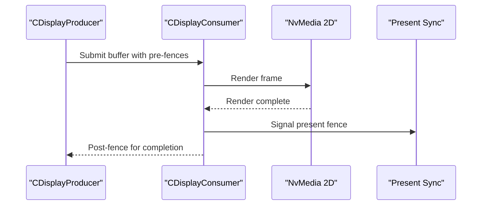

**Diagram sources**
- [CDisplayProducer.hpp:18-128](file://CDisplayProducer.hpp#L18-L128)
- [CDisplayConsumer.hpp:15-49](file://CDisplayConsumer.hpp#L15-L49)

**Section sources**
- [CDisplayProducer.hpp:18-128](file://CDisplayProducer.hpp#L18-L128)
- [CDisplayConsumer.hpp:15-49](file://CDisplayConsumer.hpp#L15-L49)

## Dependency Analysis
The integration depends on:
- NvStreams for multi-element distribution and synchronization
- NvSIPL for camera pipeline and buffer management
- NvMedia for hardware-accelerated encoding and display
- CFactory for wiring components and managing IPC/C2C

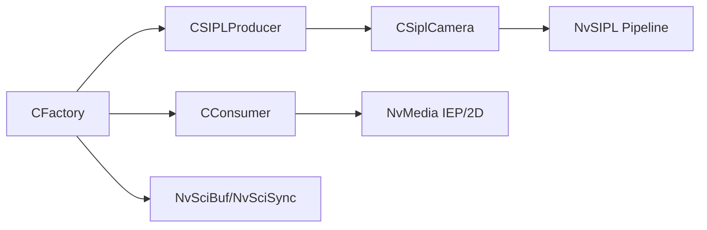

**Diagram sources**
- [CFactory.cpp:68-94](file://CFactory.cpp#L68-L94)
- [CSIPLProducer.cpp:16-35](file://CSIPLProducer.cpp#L16-L35)
- [CSiplCamera.cpp:209-286](file://CSiplCamera.cpp#L209-L286)
- [CConsumer.hpp:16-44](file://CConsumer.hpp#L16-L44)

**Section sources**
- [CFactory.cpp:68-94](file://CFactory.cpp#L68-L94)
- [CFactory.cpp:138-205](file://CFactory.cpp#L138-L205)
- [Common.hpp:78-84](file://Common.hpp#L78-L84)

## Performance Considerations
- Minimize CPU involvement in the hot path; leverage NvSciSync CPU wait contexts only when necessary
- Use appropriate queue types (FIFO vs Mailbox) based on latency and throughput requirements
- Enable multi-element outputs selectively to avoid unnecessary buffer duplication
- Tune packet counts and buffer attributes to match hardware capabilities

## Troubleshooting Guide
- Event timeouts: Investigate NvSciStream event query timeouts and adjust QUERY_TIMEOUT
- Attribute reconciliation failures: Verify that producer and consumer attribute lists align; check sibling element sharing
- Fence errors: Ensure pre/post fences are inserted consistently across producer/consumer boundaries
- Camera pipeline errors: Review device block and pipeline notification handlers for fatal conditions
- IPC/C2C connectivity: Confirm endpoint opening and block creation success; ensure channel names match

**Section sources**
- [CClientCommon.cpp:119-205](file://CClientCommon.cpp#L119-L205)
- [CFactory.cpp:223-314](file://CFactory.cpp#L223-L314)
- [CSiplCamera.cpp:315-355](file://CSiplCamera.cpp#L315-L355)
- [CSiplCamera.cpp:487-521](file://CSiplCamera.cpp#L487-L521)

## Conclusion
The NVIDIA SIPL Multicast architecture integrates tightly with NvSIPL, NvStreams, and NvMedia to deliver efficient, synchronized multi-element video distribution across processes and chips. CClientCommon provides a robust foundation for producer/consumer synchronization, while CSIPLProducer and CSiplCamera bridge the camera pipeline into the multicast fabric. The CFactory simplifies construction and wiring of the integration, and the event/error handling mechanisms ensure reliable operation and graceful shutdown.

## Appendices

### Configuration and Element Mapping
- CAppConfig controls platform configuration, queue types, and feature flags affecting element availability
- ElementInfo defines which elements are used and whether siblings share sync objects

**Section sources**
- [CAppConfig.hpp:19-82](file://CAppConfig.hpp#L19-L82)
- [CAppConfig.cpp:21-109](file://CAppConfig.cpp#L21-L109)
- [CFactory.cpp:24-66](file://CFactory.cpp#L24-L66)
- [Common.hpp:78-84](file://Common.hpp#L78-L84)