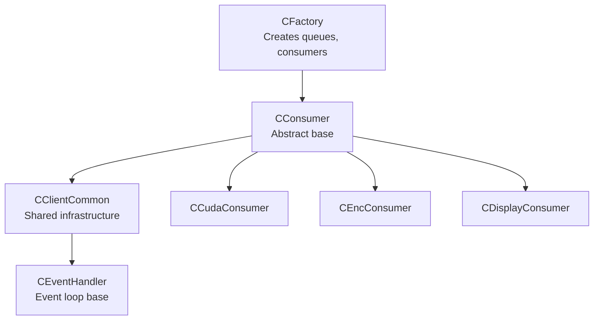
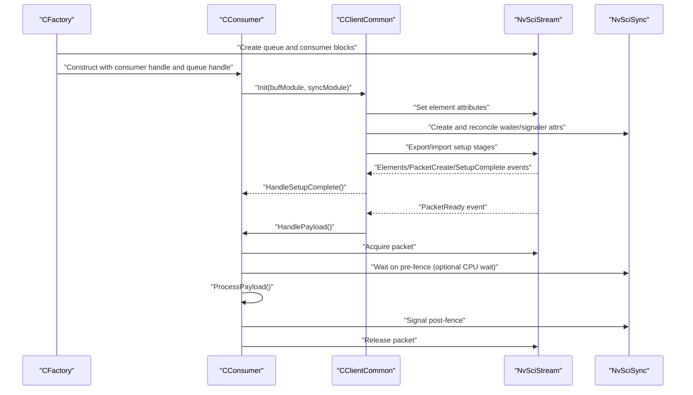
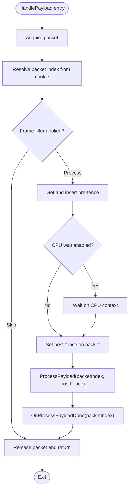
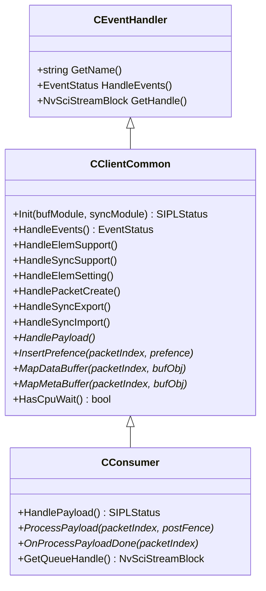
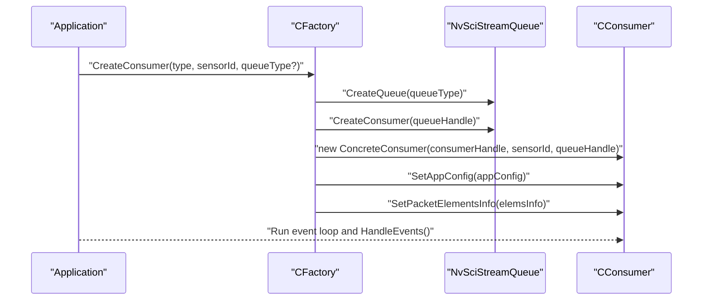
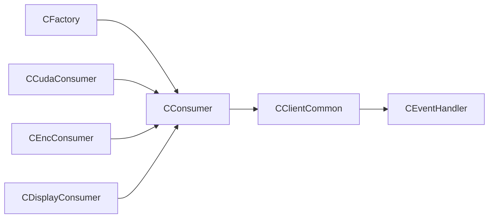

# Consumer Framework

<cite>
**Referenced Files in This Document**
- [CConsumer.hpp](file://CConsumer.hpp)
- [CConsumer.cpp](file://CConsumer.cpp)
- [CClientCommon.hpp](file://CClientCommon.hpp)
- [CClientCommon.cpp](file://CClientCommon.cpp)
- [CEventHandler.hpp](file://CEventHandler.hpp)
- [CFactory.hpp](file://CFactory.hpp)
- [CFactory.cpp](file://CFactory.cpp)
- [CCudaConsumer.hpp](file://CCudaConsumer.hpp)
- [CCudaConsumer.cpp](file://CCudaConsumer.cpp)
- [CEncConsumer.hpp](file://CEncConsumer.hpp)
- [CEncConsumer.cpp](file://CEncConsumer.cpp)
- [CDisplayConsumer.hpp](file://CDisplayConsumer.hpp)
- [CDisplayConsumer.cpp](file://CDisplayConsumer.cpp)
- [Common.hpp](file://Common.hpp)
</cite>

## Table of Contents
1. [Introduction](#introduction)
2. [Project Structure](#project-structure)
3. [Core Components](#core-components)
4. [Architecture Overview](#architecture-overview)
5. [Detailed Component Analysis](#detailed-component-analysis)
6. [Dependency Analysis](#dependency-analysis)
7. [Performance Considerations](#performance-considerations)
8. [Troubleshooting Guide](#troubleshooting-guide)
9. [Conclusion](#conclusion)

## Introduction
This document describes the consumer framework that underpins all consumer implementations in the system. It explains the CConsumer abstract base class interface and the shared infrastructure provided by CClientCommon. It also documents the consumer registration process, frame processing callbacks, and resource management patterns. Examples of implementation patterns for specialized consumers are included, along with integration with the factory system, consumer state management, error handling, and graceful shutdown procedures.

## Project Structure
The consumer framework is composed of:
- An abstract base class CConsumer that defines the payload processing contract and integrates with CClientCommon for shared infrastructure.
- A common base class CClientCommon that manages NvSciStream/NvSciBuf/NvSciSync setup, packet lifecycle, synchronization, and buffer mapping.
- Specialized consumers (e.g., CCudaConsumer, CEncConsumer, CDisplayConsumer) that implement the required callbacks for their domains.
- A factory CFactory that creates queues, consumer handles, and consumer instances according to configuration.

**Diagram sources**
- [CFactory.cpp:166-205](file://CFactory.cpp#L166-L205)
- [CConsumer.hpp:16-43](file://CConsumer.hpp#L16-L43)
- [CClientCommon.hpp:47-199](file://CClientCommon.hpp#L47-L199)
- [CEventHandler.hpp:23-51](file://CEventHandler.hpp#L23-L51)
- [CCudaConsumer.hpp:25-78](file://CCudaConsumer.hpp#L25-L78)
- [CEncConsumer.hpp:17-64](file://CEncConsumer.hpp#L17-L64)
- [CDisplayConsumer.hpp:15-47](file://CDisplayConsumer.hpp#L15-L47)

**Section sources**
- [CFactory.cpp:166-205](file://CFactory.cpp#L166-L205)
- [CConsumer.hpp:16-43](file://CConsumer.hpp#L16-L43)
- [CClientCommon.hpp:47-199](file://CClientCommon.hpp#L47-L199)
- [CEventHandler.hpp:23-51](file://CEventHandler.hpp#L23-L51)

## Core Components
- CConsumer: Extends CClientCommon to define the consumer-side payload processing pipeline. It exposes:
  - HandlePayload to orchestrate acquisition, pre/post fence handling, and release.
  - ProcessPayload and OnProcessPayloadDone for domain-specific processing and completion actions.
  - Accessors for queue handle and metadata buffer mapping.
- CClientCommon: Provides shared infrastructure for consumers and producers:
  - Event-driven lifecycle via HandleEvents and a set of virtual hooks for setup and mapping.
  - Element attribute setting, waiter/signaler sync object reconciliation and registration.
  - Packet creation, buffer mapping, and cookie-to-index translation.
  - CPU wait support and fence insertion abstraction.
- CEventHandler: Base class for event-driven components, exposing a HandleEvents method and basic identity/state.

Key responsibilities:
- Synchronization: Uses NvSciSync fences and CPU wait contexts to coordinate producer/consumer handoffs.
- Buffer management: Maps NvSciBuf objects per packet and element, tracks metadata buffers, and supports multiple elements.
- Lifecycle: Manages initialization, setup completion, and teardown with proper resource cleanup.

**Section sources**
- [CConsumer.hpp:16-43](file://CConsumer.hpp#L16-L43)
- [CConsumer.cpp:17-94](file://CConsumer.cpp#L17-L94)
- [CClientCommon.hpp:47-199](file://CClientCommon.hpp#L47-L199)
- [CClientCommon.cpp:95-205](file://CClientCommon.cpp#L95-L205)
- [CEventHandler.hpp:23-51](file://CEventHandler.hpp#L23-L51)

## Architecture Overview
The consumer framework follows a layered pattern:
- Factory constructs queue and consumer blocks and instantiates a concrete consumer.
- The consumer initializes via CClientCommon, sets up elements and sync attributes, and registers waiters/signals.
- During runtime, the consumer receives NvSciStream events, acquires packets, waits on pre-fences, processes payloads, signals post-fences, and releases packets.
- Specialized consumers implement domain-specific mapping, processing, and completion steps.

**Diagram sources**
- [CFactory.cpp:166-205](file://CFactory.cpp#L166-L205)
- [CClientCommon.cpp:95-205](file://CClientCommon.cpp#L95-L205)
- [CClientCommon.cpp:410-467](file://CClientCommon.cpp#L410-L467)
- [CClientCommon.cpp:469-591](file://CClientCommon.cpp#L469-L591)
- [CConsumer.cpp:17-94](file://CConsumer.cpp#L17-L94)

## Detailed Component Analysis

### CConsumer: Abstract Consumer Base
CConsumer encapsulates the consumer-side packet processing loop:
- Acquires a packet, resolves its index from cookie, optionally filters frames based on configuration, and retrieves pre-fences.
- Waits on pre-fences either via CPU wait context or by inserting into the stream depending on configuration.
- Invokes ProcessPayload to perform domain-specific work and obtains a post-fence.
- Calls OnProcessPayloadDone for completion actions and releases the packet.

**Diagram sources**
- [CConsumer.cpp:17-94](file://CConsumer.cpp#L17-L94)

**Section sources**
- [CConsumer.hpp:16-43](file://CConsumer.hpp#L16-L43)
- [CConsumer.cpp:17-94](file://CConsumer.cpp#L17-L94)

### CClientCommon: Shared Infrastructure
CClientCommon provides:
- Initialization and setup stages:
  - HandleStreamInit and HandleClientInit for subclass hooks.
  - HandleElemSupport and HandleSyncSupport to configure element and sync attributes.
  - HandleElemSetting to import reconciled attributes and mark readiness.
  - HandleSyncExport and HandleSyncImport to reconcile and register sync objects.
- Packet lifecycle:
  - HandlePacketCreate to allocate and map buffers per element, assign cookies, and publish packet status.
- Event handling:
  - HandleEvents dispatches NvSciStream events to appropriate handlers and transitions to streaming phase on SetupComplete.
- Synchronization abstractions:
  - InsertPrefence and SetEofSyncObj for pre/post fence handling.
  - HasCpuWait and CPU wait context creation for CPU-side waiting.
- Buffer mapping:
  - MapDataBuffer and MapMetaBuffer for per-element buffer mapping and metadata exposure.

**Diagram sources**
- [CEventHandler.hpp:23-51](file://CEventHandler.hpp#L23-L51)
- [CClientCommon.hpp:47-199](file://CClientCommon.hpp#L47-L199)
- [CConsumer.hpp:16-43](file://CConsumer.hpp#L16-L43)

**Section sources**
- [CClientCommon.hpp:47-199](file://CClientCommon.hpp#L47-L199)
- [CClientCommon.cpp:95-205](file://CClientCommon.cpp#L95-L205)
- [CClientCommon.cpp:300-365](file://CClientCommon.cpp#L300-L365)
- [CClientCommon.cpp:367-408](file://CClientCommon.cpp#L367-L408)
- [CClientCommon.cpp:410-467](file://CClientCommon.cpp#L410-L467)
- [CClientCommon.cpp:469-591](file://CClientCommon.cpp#L469-L591)

### Specialized Consumers

#### CCudaConsumer: GPU Processing Consumer
- Implements buffer attribute and sync attribute setup for CUDA-backed buffers.
- Maps NvSciBuf to CUDA external memory and mipmapped arrays for block-linear formats; supports pitch-linear mapping to device pointers.
- Inserts pre-fences via CUDA external semaphores and performs optional inference and conversion to host buffers.
- Supports CPU wait via a CPU wait context and optional file dumping of decoded frames.

Implementation highlights:
- Buffer mapping and plane handling for block-linear and pitch-linear layouts.
- Fence insertion using CUDA external semaphores and stream synchronization.
- Optional inference pipeline and file dumping.

**Section sources**
- [CCudaConsumer.hpp:25-78](file://CCudaConsumer.hpp#L25-L78)
- [CCudaConsumer.cpp:112-171](file://CCudaConsumer.cpp#L112-L171)
- [CCudaConsumer.cpp:173-273](file://CCudaConsumer.cpp#L173-L273)
- [CCudaConsumer.cpp:301-322](file://CCudaConsumer.cpp#L301-L322)
- [CCudaConsumer.cpp:386-462](file://CCudaConsumer.cpp#L386-L462)
- [CCudaConsumer.cpp:464-483](file://CCudaConsumer.cpp#L464-L483)

#### CEncConsumer: Encoder Consumer
- Integrates with NvMedia IEP to encode frames and produce H.264 bitstreams.
- Sets buffer attributes and sync attributes for encoder integration.
- Registers NvSciBuf and NvSciSync objects with the encoder and manages pre/post fences.
- Encodes frames and writes output to a file when configured.

Implementation highlights:
- Encoder initialization with configurable parameters.
- Fence insertion and EOF fence retrieval for synchronization.
- Bitstream acquisition and file dumping.

**Section sources**
- [CEncConsumer.hpp:17-64](file://CEncConsumer.hpp#L17-L64)
- [CEncConsumer.cpp:57-92](file://CEncConsumer.cpp#L57-L92)
- [CEncConsumer.cpp:117-140](file://CEncConsumer.cpp#L117-L140)
- [CEncConsumer.cpp:143-156](file://CEncConsumer.cpp#L143-L156)
- [CEncConsumer.cpp:210-228](file://CEncConsumer.cpp#L210-L228)
- [CEncConsumer.cpp:309-317](file://CEncConsumer.cpp#L309-L317)
- [CEncConsumer.cpp:319-345](file://CEncConsumer.cpp#L319-L345)

#### CDisplayConsumer: Display Consumer
- Integrates with a display controller to present frames.
- Sets display-specific NvSciBuf and NvSciSync attributes.
- Creates display sources per packet and flips frames with post-fences.
- Performs a pre-flip during setup to avoid initial timeouts.

Implementation highlights:
- PreInit to bind display controller and pipeline ID.
- Buffer attribute and sync attribute setup delegated to display controller.
- Flip-based presentation and early initialization to avoid timing issues.

**Section sources**
- [CDisplayConsumer.hpp:15-47](file://CDisplayConsumer.hpp#L15-L47)
- [CDisplayConsumer.cpp:18-34](file://CDisplayConsumer.cpp#L18-L34)
- [CDisplayConsumer.cpp:37-52](file://CDisplayConsumer.cpp#L37-L52)
- [CDisplayConsumer.cpp:54-68](file://CDisplayConsumer.cpp#L54-L68)
- [CDisplayConsumer.cpp:70-91](file://CDisplayConsumer.cpp#L70-L91)
- [CDisplayConsumer.cpp:93-113](file://CDisplayConsumer.cpp#L93-L113)
- [CDisplayConsumer.cpp:121-134](file://CDisplayConsumer.cpp#L121-L134)

### Consumer Registration and Factory Integration
The factory system centralizes consumer creation:
- Creates a queue (mailbox or FIFO) and a consumer block.
- Instantiates a concrete consumer and sets element info and app config.
- Supports selecting queue type and consumer type based on configuration.

**Diagram sources**
- [CFactory.cpp:138-176](file://CFactory.cpp#L138-L176)
- [CFactory.cpp:171-205](file://CFactory.cpp#L171-L205)

**Section sources**
- [CFactory.hpp:27-92](file://CFactory.hpp#L27-L92)
- [CFactory.cpp:138-176](file://CFactory.cpp#L138-L176)
- [CFactory.cpp:171-205](file://CFactory.cpp#L171-L205)

## Dependency Analysis
- CConsumer depends on CClientCommon for event handling, setup, and buffer/sync management.
- CClientCommon depends on NvSciStream/NvSciBuf/NvSciSync APIs and CEventHandler for event loop integration.
- Specialized consumers depend on domain libraries (CUDA, NvMedia IEP, display controller) but remain cohesive around the CConsumer contract.
- CFactory orchestrates creation of queues, consumer blocks, and concrete consumers, decoupling clients from low-level NvSci constructs.

**Diagram sources**
- [CFactory.cpp:166-205](file://CFactory.cpp#L166-L205)
- [CConsumer.hpp:16-43](file://CConsumer.hpp#L16-L43)
- [CClientCommon.hpp:47-199](file://CClientCommon.hpp#L47-L199)
- [CEventHandler.hpp:23-51](file://CEventHandler.hpp#L23-L51)
- [CCudaConsumer.hpp:25-78](file://CCudaConsumer.hpp#L25-L78)
- [CEncConsumer.hpp:17-64](file://CEncConsumer.hpp#L17-L64)
- [CDisplayConsumer.hpp:15-47](file://CDisplayConsumer.hpp#L15-L47)

**Section sources**
- [CFactory.cpp:166-205](file://CFactory.cpp#L166-L205)
- [CConsumer.hpp:16-43](file://CConsumer.hpp#L16-L43)
- [CClientCommon.hpp:47-199](file://CClientCommon.hpp#L47-L199)

## Performance Considerations
- Fence-based synchronization minimizes CPU overhead by leveraging GPU/CPU wait contexts; ensure HasCpuWait aligns with hardware capabilities.
- Buffer layout selection impacts performance: block-linear with CUDA mipmapped arrays enables efficient GPU sampling; pitch-linear reduces conversion overhead.
- Frame filtering reduces processing load by skipping intermediate frames.
- Proper cleanup of external resources (CUDA streams, semaphores, display sources) prevents leaks and improves stability.

[No sources needed since this section provides general guidance]

## Troubleshooting Guide
Common issues and resolutions:
- Event timeouts: HandleEvents returns a timed-out status; investigate producer availability or setup completeness.
- Unknown or error events: The event handler logs and returns an error; verify setup stages and element/sync attribute reconciliation.
- Invalid state during processing: Some consumers guard against processing before initialization; ensure HandleSetupComplete has completed.
- Resource cleanup: Specialized consumers must unregister sync objects and destroy CUDA/encoder/display resources in destructors.

**Section sources**
- [CClientCommon.cpp:119-205](file://CClientCommon.cpp#L119-L205)
- [CCudaConsumer.cpp:71-110](file://CCudaConsumer.cpp#L71-L110)
- [CEncConsumer.cpp:94-114](file://CEncConsumer.cpp#L94-L114)
- [CDisplayConsumer.cpp:121-134](file://CDisplayConsumer.cpp#L121-L134)

## Conclusion
The consumer framework provides a robust, extensible foundation for implementing diverse consumers. Through CClientCommon, consumers inherit a standardized setup, synchronization, and lifecycle management layer. CConsumer defines a clear processing contract that specialized consumers implement for their domains. The factory system simplifies instantiation and configuration, enabling flexible deployment across encoders, GPUs, displays, and other targets. Adhering to the outlined patterns ensures reliable operation, predictable resource management, and graceful shutdown.