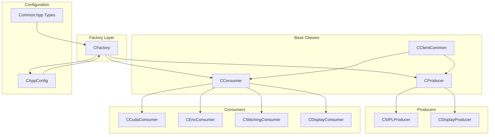
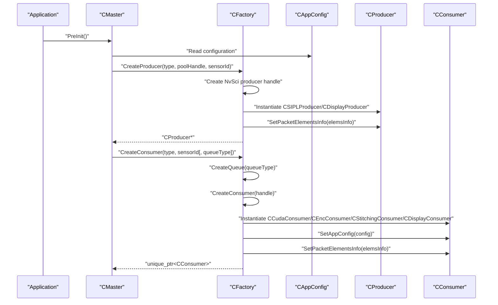
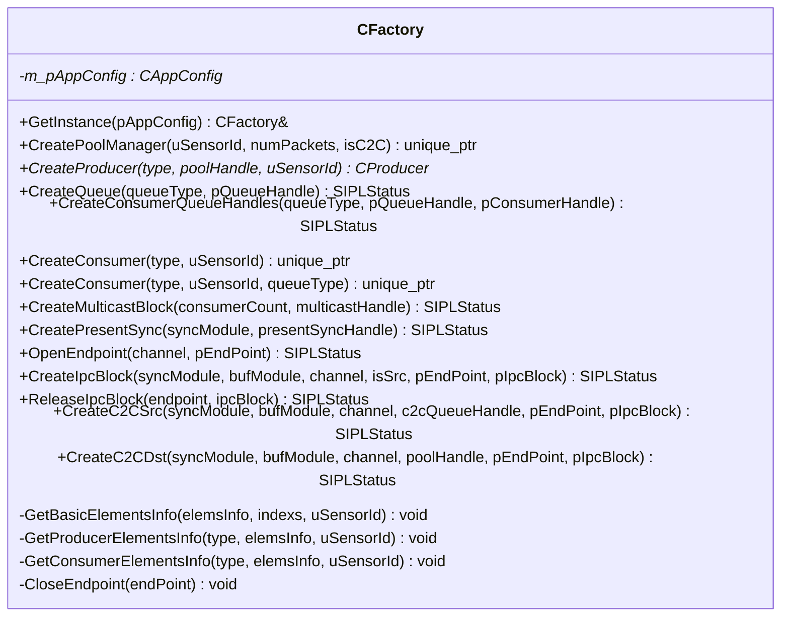
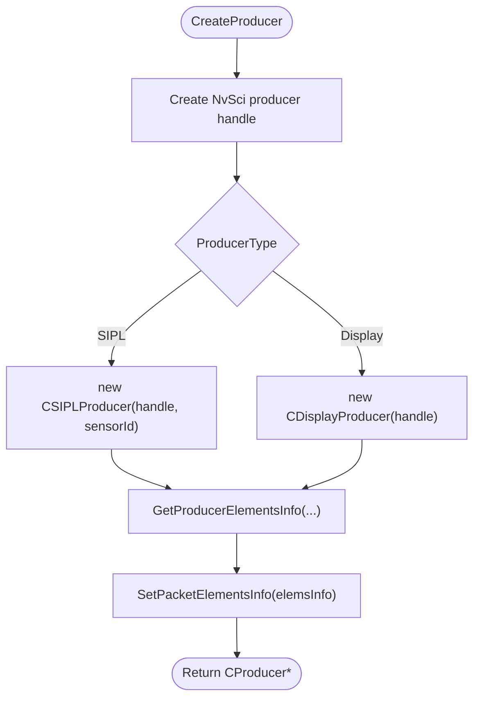
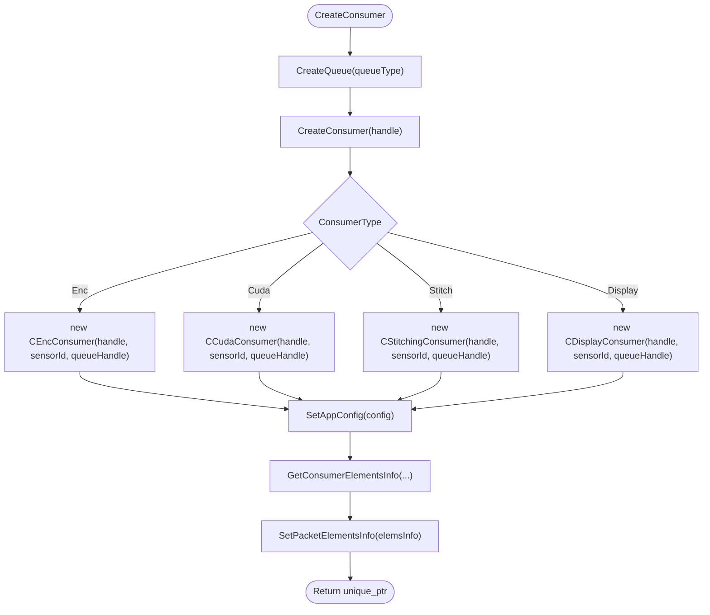
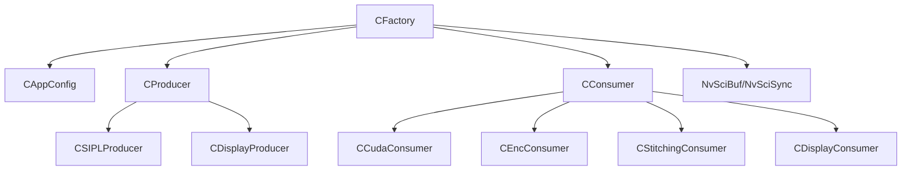

# Factory Pattern Implementation

<cite>
**Referenced Files in This Document**
- [CFactory.hpp](file://CFactory.hpp)
- [CFactory.cpp](file://CFactory.cpp)
- [CConsumer.hpp](file://CConsumer.hpp)
- [CProducer.hpp](file://CProducer.hpp)
- [CCudaConsumer.hpp](file://CCudaConsumer.hpp)
- [CEncConsumer.hpp](file://CEncConsumer.hpp)
- [CStitchingConsumer.hpp](file://CStitchingConsumer.hpp)
- [CDisplayConsumer.hpp](file://CDisplayConsumer.hpp)
- [CSIPLProducer.hpp](file://CSIPLProducer.hpp)
- [CDisplayProducer.hpp](file://CDisplayProducer.hpp)
- [CAppConfig.hpp](file://CAppConfig.hpp)
- [Common.hpp](file://Common.hpp)
- [CClientCommon.hpp](file://CClientCommon.hpp)
- [main.cpp](file://main.cpp)
</cite>

## Table of Contents
1. [Introduction](#introduction)
2. [Project Structure](#project-structure)
3. [Core Components](#core-components)
4. [Architecture Overview](#architecture-overview)
5. [Detailed Component Analysis](#detailed-component-analysis)
6. [Dependency Analysis](#dependency-analysis)
7. [Performance Considerations](#performance-considerations)
8. [Troubleshooting Guide](#troubleshooting-guide)
9. [Conclusion](#conclusion)

## Introduction
This document explains the CFactory pattern implementation that dynamically creates consumer and producer objects based on configuration. It documents the factory method pattern usage for specialized consumer types (CUDA, encoder, display, stitching) and producer implementations, along with object creation logic, parameter validation, and resource management. It also covers the relationship between factory configuration and runtime object instantiation, provides examples for extending the factory with new consumer types, and addresses thread-safety considerations and factory state management.

## Project Structure
The factory resides in the multicast module and orchestrates creation of streaming components:
- Factory interface and implementation: CFactory.hpp, CFactory.cpp
- Base classes for streaming components: CConsumer.hpp, CProducer.hpp, CClientCommon.hpp
- Specialized consumers: CCudaConsumer.hpp, CEncConsumer.hpp, CStitchingConsumer.hpp, CDisplayConsumer.hpp
- Specialized producers: CSIPLProducer.hpp, CDisplayProducer.hpp
- Configuration and type definitions: CAppConfig.hpp, Common.hpp
- Application entry point: main.cpp

**Diagram sources**
- [CFactory.hpp:27-92](file://CFactory.hpp#L27-L92)
- [CFactory.cpp:11-315](file://CFactory.cpp#L11-L315)
- [CProducer.hpp:16-51](file://CProducer.hpp#L16-L51)
- [CConsumer.hpp:16-43](file://CConsumer.hpp#L16-L43)
- [CClientCommon.hpp:47-199](file://CClientCommon.hpp#L47-L199)
- [CAppConfig.hpp:19-82](file://CAppConfig.hpp#L19-L82)
- [Common.hpp:35-86](file://Common.hpp#L35-L86)

**Section sources**
- [CFactory.hpp:27-92](file://CFactory.hpp#L27-L92)
- [CFactory.cpp:11-315](file://CFactory.cpp#L11-L315)
- [CAppConfig.hpp:19-82](file://CAppConfig.hpp#L19-L82)
- [Common.hpp:35-86](file://Common.hpp#L35-L86)

## Core Components
- CFactory: Singleton factory responsible for creating producers, consumers, queues, and IPC blocks. It encapsulates configuration-driven object instantiation and resource lifecycle management.
- CProducer and CConsumer: Abstract base classes defining the streaming contract and common initialization logic.
- CClientCommon: Shared base implementing packet handling, synchronization, and element configuration.
- Specialized components: CSIPLProducer, CDisplayProducer, CCudaConsumer, CEncConsumer, CStitchingConsumer, CDisplayConsumer.
- CAppConfig: Central configuration provider exposing runtime flags and defaults.
- Common.hpp: Enumerations and structures defining types used by the factory.

Key responsibilities:
- Factory creation methods: CreatePoolManager, CreateProducer, CreateConsumer, CreateQueue, CreateConsumerQueueHandles, CreateMulticastBlock, CreatePresentSync, CreateIpcBlock, CreateC2CSrc, CreateC2CDst.
- Element configuration: GetBasicElementsInfo, GetProducerElementsInfo, GetConsumerElementsInfo.
- Resource management: Endpoint open/close, IPC block creation/release, queue creation/consumer creation.

**Section sources**
- [CFactory.hpp:27-92](file://CFactory.hpp#L27-L92)
- [CFactory.cpp:11-315](file://CFactory.cpp#L11-L315)
- [CProducer.hpp:16-51](file://CProducer.hpp#L16-L51)
- [CConsumer.hpp:16-43](file://CConsumer.hpp#L16-L43)
- [CClientCommon.hpp:47-199](file://CClientCommon.hpp#L47-L199)
- [CAppConfig.hpp:19-82](file://CAppConfig.hpp#L19-L82)
- [Common.hpp:35-86](file://Common.hpp#L35-L86)

## Architecture Overview
The factory pattern centralizes object creation and configuration. The flow begins with configuration-driven decisions, followed by resource allocation via NvSci APIs, and ends with specialized component instantiation.

**Diagram sources**
- [CFactory.cpp:68-94](file://CFactory.cpp#L68-L94)
- [CFactory.cpp:166-205](file://CFactory.cpp#L166-L205)
- [CFactory.cpp:138-164](file://CFactory.cpp#L138-L164)
- [CFactory.cpp:44-66](file://CFactory.cpp#L44-L66)
- [CFactory.cpp:96-136](file://CFactory.cpp#L96-L136)
- [CAppConfig.hpp:32-46](file://CAppConfig.hpp#L32-L46)

## Detailed Component Analysis

### CFactory: Factory Method Pattern and Configuration-Driven Creation
CFactory implements a singleton factory with:
- Static GetInstance with injected CAppConfig pointer.
- Producer creation: CreateProducer selects implementation based on ProducerType and sets element usage.
- Consumer creation: CreateConsumer supports two overloads; both create queue and consumer handles, instantiate the appropriate consumer subclass, and configure element info.
- Queue and IPC utilities: CreateQueue, CreateConsumerQueueHandles, CreateIpcBlock, CreateC2CSrc, CreateC2CDst, ReleaseIpcBlock, OpenEndpoint, CloseEndpoint.

**Diagram sources**
- [CFactory.hpp:27-92](file://CFactory.hpp#L27-L92)
- [CFactory.cpp:11-315](file://CFactory.cpp#L11-L315)

**Section sources**
- [CFactory.hpp:27-92](file://CFactory.hpp#L27-L92)
- [CFactory.cpp:11-315](file://CFactory.cpp#L11-L315)

### Producer Creation Logic
- CreateProducer validates NvSci producer creation, selects implementation based on ProducerType, configures element usage, and attaches element info to the producer.
- ProducerType options include SIPL and Display, mapped to CSIPLProducer and CDisplayProducer respectively.

**Diagram sources**
- [CFactory.cpp:68-94](file://CFactory.cpp#L68-L94)
- [CFactory.cpp:44-66](file://CFactory.cpp#L44-L66)

**Section sources**
- [CFactory.cpp:68-94](file://CFactory.cpp#L68-L94)
- [CFactory.cpp:44-66](file://CFactory.cpp#L44-L66)

### Consumer Creation Logic
- CreateConsumer overloads create queue and consumer handles, instantiate the appropriate consumer subclass, set app config, and configure element usage.
- ConsumerType options include Enc, Cuda, Stitch, Display, mapped to CEncConsumer, CCudaConsumer, CStitchingConsumer, CDisplayConsumer respectively.

**Diagram sources**
- [CFactory.cpp:166-205](file://CFactory.cpp#L166-L205)
- [CFactory.cpp:138-164](file://CFactory.cpp#L138-L164)
- [CFactory.cpp:96-136](file://CFactory.cpp#L96-L136)

**Section sources**
- [CFactory.cpp:166-205](file://CFactory.cpp#L166-L205)
- [CFactory.cpp:138-164](file://CFactory.cpp#L138-L164)
- [CFactory.cpp:96-136](file://CFactory.cpp#L96-L136)

### Element Configuration and Validation
- GetBasicElementsInfo defines baseline elements and indices, conditionally enabling NV12 variants based on sensor type and multi-element enablement.
- GetProducerElementsInfo marks elements as used for producers based on type and configuration.
- GetConsumerElementsInfo marks elements as used for consumers based on type, sensor type, and display configuration flags.

Validation highlights:
- Sensor-specific element selection ensures compatibility with YUV vs. non-YUV sensors.
- Multi-element enablement toggles between block-linear and planar NV12 configurations.
- Display consumer validation logs an error if no valid element is configured.

**Section sources**
- [CFactory.cpp:24-42](file://CFactory.cpp#L24-L42)
- [CFactory.cpp:44-66](file://CFactory.cpp#L44-L66)
- [CFactory.cpp:96-136](file://CFactory.cpp#L96-L136)

### Resource Management and Cleanup
- Pool manager creation uses NvSciStreamStaticPoolCreate and wraps the handle in a managed object.
- Queue creation supports mailbox and FIFO types; consumer creation pairs queue and consumer handles.
- IPC block creation opens endpoints safely and cleans up on failure.
- ReleaseIpcBlock deletes blocks and closes endpoints safely.
- Endpoint close helper ensures safe closure.

Cleanup responsibilities:
- Unique pointers manage consumer lifetimes.
- Display producer maintains buffers and fences with RAII cleanup in BufferInfo destructor.
- Thread-safe shutdown is handled by higher-level components (see main loop).

**Section sources**
- [CFactory.cpp:11-22](file://CFactory.cpp#L11-L22)
- [CFactory.cpp:138-164](file://CFactory.cpp#L138-L164)
- [CFactory.cpp:223-241](file://CFactory.cpp#L223-L241)
- [CFactory.cpp:243-274](file://CFactory.cpp#L243-L274)
- [CDisplayProducer.hpp:21-59](file://CDisplayProducer.hpp#L21-L59)

### Adding New Consumer Types Through the Factory Pattern
Steps to add a new consumer type:
1. Define a new ConsumerType value in the enumeration.
2. Add the new consumer class inheriting from CConsumer.
3. Extend CFactory::CreateConsumer to instantiate the new consumer subclass.
4. Extend CFactory::GetConsumerElementsInfo to configure element usage for the new type.
5. Ensure the consumer class implements required virtual methods from CConsumer and CClientCommon.

Example extension points:
- Add ConsumerType_NewEnum in Common.hpp.
- Implement CNewConsumer in a new header/source pair.
- Update CreateConsumer and GetConsumerElementsInfo in CFactory.cpp.

Benefits:
- Centralized creation logic remains unchanged.
- Configuration flags and element info remain consistent across new types.

**Section sources**
- [Common.hpp:54-60](file://Common.hpp#L54-L60)
- [CFactory.cpp:171-205](file://CFactory.cpp#L171-L205)
- [CFactory.cpp:96-136](file://CFactory.cpp#L96-L136)

### Thread Safety and Factory State Management
- CFactory is a singleton with a private constructor and deleted copy constructor/operator, ensuring single-instance access.
- Member variables include a pointer to CAppConfig and no mutable shared state, minimizing contention.
- Factory methods operate on local scopes and temporary handles; no global mutable state is modified.
- Higher-level components (e.g., CDisplayProducer) manage internal threading and synchronization.

Recommendations:
- Keep factory stateless beyond the injected configuration pointer.
- Avoid introducing shared mutable state inside the factory.
- Use RAII and unique_ptr for automatic resource cleanup.

**Section sources**
- [CFactory.hpp:77-92](file://CFactory.hpp#L77-L92)
- [CDisplayProducer.hpp:110-126](file://CDisplayProducer.hpp#L110-L126)

## Dependency Analysis
The factory depends on configuration and NvSci resources, and instantiates specialized components.

**Diagram sources**
- [CFactory.hpp:12-22](file://CFactory.hpp#L12-L22)
- [CFactory.cpp:68-94](file://CFactory.cpp#L68-L94)
- [CFactory.cpp:166-205](file://CFactory.cpp#L166-L205)

**Section sources**
- [CFactory.hpp:12-22](file://CFactory.hpp#L12-L22)
- [CFactory.cpp:68-94](file://CFactory.cpp#L68-L94)
- [CFactory.cpp:166-205](file://CFactory.cpp#L166-L205)

## Performance Considerations
- Element configuration minimizes unnecessary buffer usage by marking only required elements as used.
- FIFO vs. mailbox queues offer different throughput/latency trade-offs; selection is configurable.
- CUDA and encoder consumers introduce GPU/CPU workloads; ensure adequate buffer counts and element configurations.
- IPC and C2C blocks add overhead; reuse endpoints and blocks where possible.

## Troubleshooting Guide
Common issues and resolutions:
- NvSci errors during handle creation: Factory logs errors and returns null; check NvSci availability and permissions.
- Display consumer misconfiguration: If no valid element is selected, logging indicates misconfiguration; verify display flags in configuration.
- IPC block failures: Factory closes endpoints on failure; re-check channel names and endpoint states.
- Consumer element mismatch: Ensure GetConsumerElementsInfo aligns with sensor type and multi-element settings.

**Section sources**
- [CFactory.cpp:15-19](file://CFactory.cpp#L15-L19)
- [CFactory.cpp:74-78](file://CFactory.cpp#L74-L78)
- [CFactory.cpp:142-148](file://CFactory.cpp#L142-L148)
- [CFactory.cpp:133-134](file://CFactory.cpp#L133-L134)
- [CFactory.cpp:256-260](file://CFactory.cpp#L256-L260)
- [CFactory.cpp:287-291](file://CFactory.cpp#L287-L291)

## Conclusion
The CFactory pattern provides a clean, configuration-driven mechanism to create producers and consumers, manage queues and IPC resources, and enforce element usage policies. By centralizing creation logic and leveraging RAII, it simplifies extension with new consumer types and ensures robust resource management. Following the outlined steps for adding new consumers preserves consistency and reduces risk.