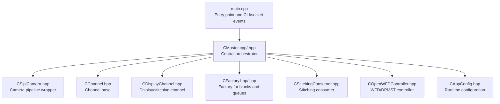
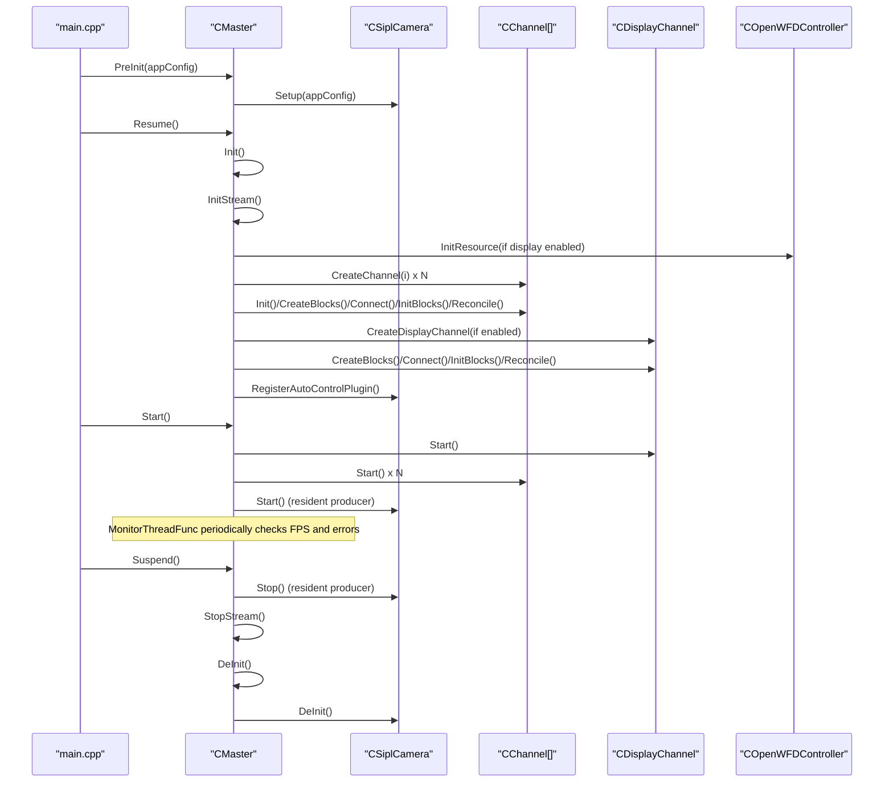
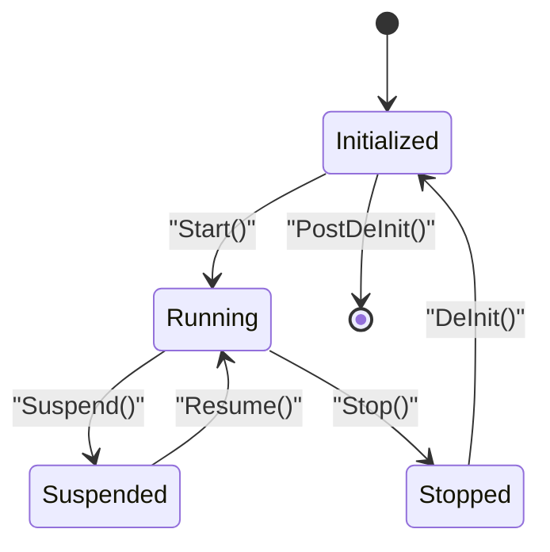
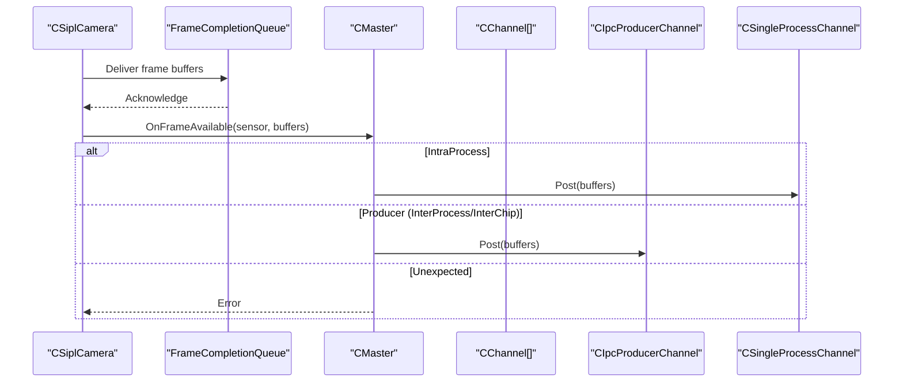
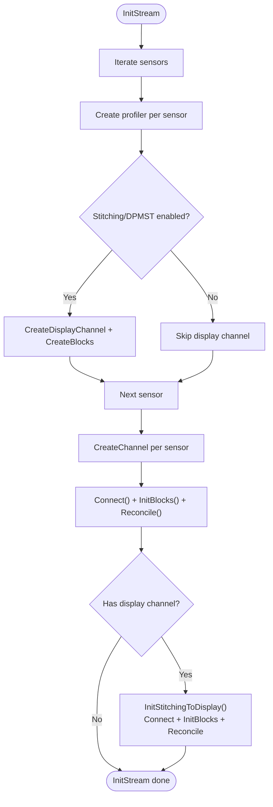
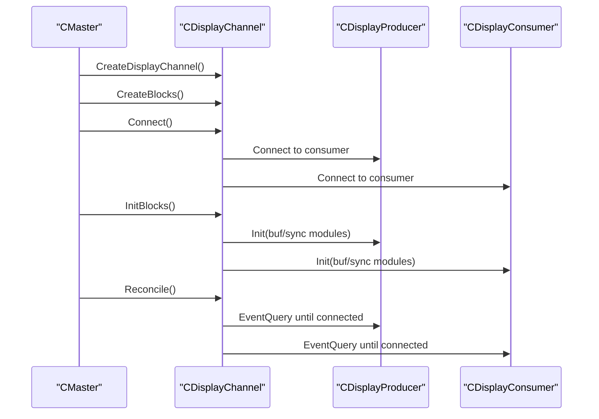
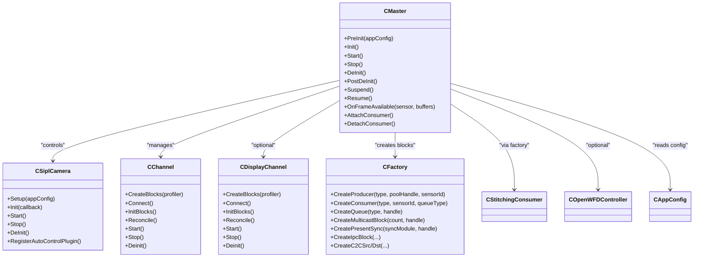

# Master Orchestration

<cite>
**Referenced Files in This Document**
- [CMaster.hpp](file://CMaster.hpp)
- [CMaster.cpp](file://CMaster.cpp)
- [CSiplCamera.hpp](file://CSiplCamera.hpp)
- [CChannel.hpp](file://CChannel.hpp)
- [CDisplayChannel.hpp](file://CDisplayChannel.hpp)
- [CFactory.hpp](file://CFactory.hpp)
- [CFactory.cpp](file://CFactory.cpp)
- [CStitchingConsumer.hpp](file://CStitchingConsumer.hpp)
- [COpenWFDController.hpp](file://COpenWFDController.hpp)
- [CAppConfig.hpp](file://CAppConfig.hpp)
- [main.cpp](file://main.cpp)
</cite>

## Table of Contents
1. [Introduction](#introduction)
2. [Project Structure](#project-structure)
3. [Core Components](#core-components)
4. [Architecture Overview](#architecture-overview)
5. [Detailed Component Analysis](#detailed-component-analysis)
6. [Dependency Analysis](#dependency-analysis)
7. [Performance Considerations](#performance-considerations)
8. [Troubleshooting Guide](#troubleshooting-guide)
9. [Conclusion](#conclusion)
10. [Appendices](#appendices)

## Introduction
This document provides comprehensive documentation for the CMaster class, the central orchestrator of the NVIDIA SIPL Multicast system. It explains how CMaster manages camera setup, consumer coordination, and the end-to-end pipeline lifecycle. The documentation covers the initialization sequence (PreInit, Init, Start, Stop, DeInit), power management with suspend/resume and the PMStatus enumeration, the callback interface for frame availability notifications, channel creation and display channel management, and stitching initialization. It also includes concrete orchestration workflows, error handling patterns, and graceful shutdown procedures.

## Project Structure
The master orchestration spans several key modules:
- CMaster: Central controller managing lifecycle, channels, and callbacks.
- CSiplCamera: Camera pipeline wrapper exposing setup, init/start/stop, and frame completion queues.
- CChannel and derived channels: Abstractions for producer/consumer streams and block lifecycle.
- CDisplayChannel: Specialized channel for display/stitching pipelines.
- CFactory: Factory for creating producers, consumers, queues, pools, and IPC/C2C blocks.
- CStitchingConsumer: Consumer responsible for image composition and display.
- COpenWFDController: Display/WFD resource controller for DPMST and stitching displays.
- CAppConfig: Application configuration controlling communication type, entity type, consumer type, and runtime flags.
- main: Entry point wiring signals, user input, and power management socket events to CMaster.

**Diagram sources**
- [main.cpp:253-304](file://main.cpp#L253-L304)
- [CMaster.cpp:164-232](file://CMaster.cpp#L164-L232)
- [CSiplCamera.hpp:45-85](file://CSiplCamera.hpp#L45-L85)
- [CChannel.hpp:28-157](file://CChannel.hpp#L28-L157)
- [CDisplayChannel.hpp:19-226](file://CDisplayChannel.hpp#L19-L226)
- [CFactory.cpp:68-94](file://CFactory.cpp#L68-L94)
- [CStitchingConsumer.hpp:17-74](file://CStitchingConsumer.hpp#L17-L74)
- [COpenWFDController.hpp:22-57](file://COpenWFDController.hpp#L22-L57)
- [CAppConfig.hpp:19-83](file://CAppConfig.hpp#L19-L83)

**Section sources**
- [main.cpp:253-304](file://main.cpp#L253-L304)
- [CMaster.cpp:164-232](file://CMaster.cpp#L164-L232)
- [CChannel.hpp:28-157](file://CChannel.hpp#L28-L157)
- [CDisplayChannel.hpp:19-226](file://CDisplayChannel.hpp#L19-L226)
- [CFactory.cpp:68-94](file://CFactory.cpp#L68-L94)
- [CStitchingConsumer.hpp:17-74](file://CStitchingConsumer.hpp#L17-L74)
- [COpenWFDController.hpp:22-57](file://COpenWFDController.hpp#L22-L57)
- [CAppConfig.hpp:19-83](file://CAppConfig.hpp#L19-L83)

## Core Components
- CMaster: Implements lifecycle methods (PreInit, Init, Start, Stop, DeInit, PostDeInit), power management (Suspend, Resume), frame callback dispatch, channel creation, display channel management, and stitching initialization. It coordinates NvSciBuf/NvSciSync modules, channels, and the camera pipeline.
- CSiplCamera: Provides camera setup, initialization, start/stop, and frame completion queue handling. It exposes a callback interface for frame availability and maintains notification handlers for pipeline/device-block errors.
- CChannel: Base class for channels, defining CreateBlocks, Connect, InitBlocks, Reconcile, Start, Stop, and event thread management.
- CDisplayChannel: Creates and manages a display pipeline with a producer and consumer, supporting multicast and WFD/DPMST integration.
- CFactory: Creates producers, consumers, queues, pools, and IPC/C2C blocks; configures element lists per sensor and consumer type.
- CStitchingConsumer: Handles NV12 buffers for stitching/composition and integrates with display producer.
- COpenWFDController: Manages WFD resources for DPMST and stitching display modes.
- CAppConfig: Encapsulates runtime configuration including communication type, entity type, consumer type, and flags for stitching, DPMST, multi-elements, and late attach.

**Section sources**
- [CMaster.hpp:46-92](file://CMaster.hpp#L46-L92)
- [CSiplCamera.hpp:45-85](file://CSiplCamera.hpp#L45-L85)
- [CChannel.hpp:28-157](file://CChannel.hpp#L28-L157)
- [CDisplayChannel.hpp:19-226](file://CDisplayChannel.hpp#L19-L226)
- [CFactory.hpp:27-92](file://CFactory.hpp#L27-L92)
- [CStitchingConsumer.hpp:17-74](file://CStitchingConsumer.hpp#L17-L74)
- [COpenWFDController.hpp:22-57](file://COpenWFDController.hpp#L22-L57)
- [CAppConfig.hpp:19-83](file://CAppConfig.hpp#L19-L83)

## Architecture Overview
CMaster orchestrates the entire pipeline:
- PreInit: Configures producer residency and sets up CSiplCamera.
- Init: Initializes NvSci modules, creates channels and optional display channel, reconciles blocks, and registers auto control plugin for producers.
- Start: Starts display channel (if present), starts all channels, launches monitor thread, and starts the camera pipeline for resident producers.
- Stop: Stops camera pipeline for producers, joins monitor thread, and stops channels.
- DeInit: Tears down channels, display channel, WFD controller, and NvSci modules.
- Power Management: Suspend transitions to DeInit then Stop; Resume transitions to Init then Start.

**Diagram sources**
- [main.cpp:271-291](file://main.cpp#L271-L291)
- [CMaster.cpp:164-232](file://CMaster.cpp#L164-L232)
- [CMaster.cpp:50-122](file://CMaster.cpp#L50-L122)
- [CMaster.cpp:320-352](file://CMaster.cpp#L320-L352)
- [CMaster.cpp:282-318](file://CMaster.cpp#L282-L318)
- [CSiplCamera.hpp:60-64](file://CSiplCamera.hpp#L60-L64)

## Detailed Component Analysis

### CMaster Lifecycle and Power Management
- PreInit: Validates configuration, determines producer residency, and sets up CSiplCamera.
- Init: Initializes NvSciBuf/NvSciSync, optionally initializes WFD controller, iterates sensors to create channels and display channel, reconciles blocks, and registers auto control plugin for producers.
- Start: Starts display channel (if present), starts all channels, launches monitor thread, and starts the camera pipeline for resident producers.
- Stop: Stops camera pipeline for producers, signals monitor thread to quit and joins it, then stops channels.
- DeInit: Deinitializes display channel, channels, WFD controller, clears profilers, closes NvSci modules, and deinitializes NvSci IPC if applicable.
- PostDeInit: Resets CSiplCamera pointer.
- Suspend/Resume: Guarded transitions using PMStatus to avoid redundant operations; Suspend calls Stop then DeInit; Resume calls Init then Start.

**Diagram sources**
- [CMaster.cpp:282-318](file://CMaster.cpp#L282-L318)
- [CMaster.cpp:255-275](file://CMaster.cpp#L255-L275)
- [CMaster.cpp:218-232](file://CMaster.cpp#L218-L232)
- [CMaster.cpp:184-193](file://CMaster.cpp#L184-L193)

**Section sources**
- [CMaster.cpp:164-232](file://CMaster.cpp#L164-L232)
- [CMaster.cpp:255-275](file://CMaster.cpp#L255-L275)
- [CMaster.cpp:282-318](file://CMaster.cpp#L282-L318)
- [CMaster.cpp:184-193](file://CMaster.cpp#L184-L193)

### Callback Interface for Frame Availability
- CSiplCamera creates frame completion queues per output type and invokes a callback when frames are ready.
- CMaster implements the ICallback interface to receive OnFrameAvailable and posts buffers to the appropriate channel based on communication type and entity type.
- The callback dispatch selects between single-process or IPC producer channels.

**Diagram sources**
- [CSiplCamera.hpp:523-618](file://CSiplCamera.hpp#L523-L618)
- [CMaster.cpp:405-424](file://CMaster.cpp#L405-L424)

**Section sources**
- [CSiplCamera.hpp:49-57](file://CSiplCamera.hpp#L49-L57)
- [CSiplCamera.hpp:523-618](file://CSiplCamera.hpp#L523-L618)
- [CMaster.cpp:405-424](file://CMaster.cpp#L405-L424)

### Channel Creation and Display Channel Management
- InitStream iterates sensors, creates a profiler per sensor, and constructs channels based on communication type and entity type.
- For display-enabled configurations, a display channel is created and initialized, including creating blocks and reconciling connections.
- CreateChannel selects channel type (single-process, IPC producer/consumer, or C2C producer/consumer) based on configuration.
- CreateDisplayChannel builds a display pipeline with a producer and a display consumer, using the factory to configure elements and queues.

**Diagram sources**
- [CMaster.cpp:50-122](file://CMaster.cpp#L50-L122)
- [CMaster.cpp:426-451](file://CMaster.cpp#L426-L451)
- [CMaster.cpp:459-471](file://CMaster.cpp#L459-L471)
- [CDisplayChannel.hpp:124-202](file://CDisplayChannel.hpp#L124-L202)
- [CFactory.cpp:68-94](file://CFactory.cpp#L68-L94)

**Section sources**
- [CMaster.cpp:50-122](file://CMaster.cpp#L50-L122)
- [CMaster.cpp:426-451](file://CMaster.cpp#L426-L451)
- [CMaster.cpp:459-471](file://CMaster.cpp#L459-L471)
- [CDisplayChannel.hpp:124-202](file://CDisplayChannel.hpp#L124-L202)
- [CFactory.cpp:68-94](file://CFactory.cpp#L68-L94)

### Stitching Initialization
- When stitching display is enabled, CMaster creates a display channel and calls InitStitchingToDisplay to connect and reconcile the display pipeline.
- The display pipeline uses a mailbox queue for the display consumer to ensure latest buffer semantics and connects producer to consumer via either direct connection or multicast.

**Diagram sources**
- [CMaster.cpp:459-471](file://CMaster.cpp#L459-L471)
- [CDisplayChannel.hpp:134-202](file://CDisplayChannel.hpp#L134-L202)

**Section sources**
- [CMaster.cpp:459-471](file://CMaster.cpp#L459-L471)
- [CDisplayChannel.hpp:134-202](file://CDisplayChannel.hpp#L134-L202)

### Late Consumer Attach/Detach (P2P/C2C Producers)
- CMaster supports late attach/detach for IPC producers to dynamically add or remove consumers after initial setup.
- The operations iterate channels and invoke attach/detach helpers on producer-side channels.

**Section sources**
- [CMaster.cpp:473-513](file://CMaster.cpp#L473-L513)

### Monitoring and Error Handling
- MonitorThreadFunc periodically computes FPS per sensor, checks for pipeline/device-block errors via notification handlers, and triggers graceful shutdown on errors or run duration expiry.
- The monitor thread is started during Start and joined during Stop.

**Section sources**
- [CMaster.cpp:354-403](file://CMaster.cpp#L354-L403)

### Power Management Workflow Examples
- Suspend: If not already in suspend prepare/post state, set prepare, call Stop, then DeInit, finally mark post-suspend.
- Resume: If not already in resume prepare/post state, set prepare, call Init, then Start, finally mark post-resume.
- These transitions are guarded by PMStatus to prevent reentrancy.

**Section sources**
- [CMaster.cpp:282-318](file://CMaster.cpp#L282-L318)
- [CMaster.hpp:36-42](file://CMaster.hpp#L36-L42)

## Dependency Analysis
CMaster depends on:
- CSiplCamera for camera pipeline lifecycle and frame delivery.
- CChannel hierarchy for producer/consumer stream management.
- CDisplayChannel for display/stitching pipelines.
- CFactory for constructing producers, consumers, queues, pools, and IPC/C2C blocks.
- COpenWFDController for WFD/DPMST display resources.
- CAppConfig for runtime configuration and feature flags.

**Diagram sources**
- [CMaster.hpp:46-92](file://CMaster.hpp#L46-L92)
- [CSiplCamera.hpp:45-85](file://CSiplCamera.hpp#L45-L85)
- [CChannel.hpp:28-157](file://CChannel.hpp#L28-L157)
- [CDisplayChannel.hpp:19-226](file://CDisplayChannel.hpp#L19-L226)
- [CFactory.hpp:27-92](file://CFactory.hpp#L27-L92)
- [CStitchingConsumer.hpp:17-74](file://CStitchingConsumer.hpp#L17-L74)
- [COpenWFDController.hpp:22-57](file://COpenWFDController.hpp#L22-L57)
- [CAppConfig.hpp:19-83](file://CAppConfig.hpp#L19-L83)

**Section sources**
- [CMaster.hpp:46-92](file://CMaster.hpp#L46-L92)
- [CSiplCamera.hpp:45-85](file://CSiplCamera.hpp#L45-L85)
- [CChannel.hpp:28-157](file://CChannel.hpp#L28-L157)
- [CDisplayChannel.hpp:19-226](file://CDisplayChannel.hpp#L19-L226)
- [CFactory.hpp:27-92](file://CFactory.hpp#L27-L92)
- [CStitchingConsumer.hpp:17-74](file://CStitchingConsumer.hpp#L17-L74)
- [COpenWFDController.hpp:22-57](file://COpenWFDController.hpp#L22-L57)
- [CAppConfig.hpp:19-83](file://CAppConfig.hpp#L19-L83)

## Performance Considerations
- FPS monitoring: The monitor thread computes instantaneous FPS per sensor every fixed interval and prints metrics; this helps detect stalls or underperformance.
- Queue selection: Mailbox queues are used for display consumers to ensure latest buffer semantics, reducing latency for display pipelines.
- Element configuration: Factory configures element lists per sensor and consumer type, enabling efficient data paths and avoiding unnecessary copies.
- Threading model: Each channel runs event threads per block; ensure proper thread naming and timely termination to avoid leaks.

[No sources needed since this section provides general guidance]

## Troubleshooting Guide
- Fatal errors: MonitorThreadFunc checks pipeline and device-block notification handlers; on detection, it triggers graceful shutdown via the global quit mechanism.
- Error ignored mode: Controlled by CAppConfig; when enabled, certain warnings are treated as non-fatal.
- Graceful shutdown: Signals and socket-driven suspend/resume trigger Stop/DeInit sequences; ensure Stop is called before DeInit to release resources cleanly.
- Logging: Verbosity is set via CMaster::SetLogLevel and forwarded to tracing systems; increase verbosity for diagnostics.

**Section sources**
- [CMaster.cpp:354-403](file://CMaster.cpp#L354-L403)
- [CAppConfig.hpp:34-46](file://CAppConfig.hpp#L34-L46)
- [main.cpp:37-58](file://main.cpp#L37-L58)

## Conclusion
CMaster serves as the central coordinator for the NVIDIA SIPL Multicast system, orchestrating camera pipelines, channel lifecycles, display/stitching pipelines, and power management. Its lifecycle methods provide a robust framework for initialization, streaming, and teardown, while the callback interface ensures efficient frame delivery. The factory-based construction of producers, consumers, and IPC/C2C blocks enables flexible deployment across intra-process, inter-process, and cross-chip scenarios. Proper error handling and monitoring facilitate reliable operation and graceful shutdown.

[No sources needed since this section summarizes without analyzing specific files]

## Appendices

### Initialization Sequence Reference
- PreInit: Configure producer residency and camera setup.
- Init: Initialize NvSci modules, create channels and display channel, reconcile blocks, register auto control plugin for producers.
- Start: Start display channel, start all channels, launch monitor thread, start camera pipeline for resident producers.
- Stop: Stop camera pipeline for producers, join monitor thread, stop channels.
- DeInit: Deinitialize display channel, channels, WFD controller, NvSci modules, and NvSci IPC.
- PostDeInit: Reset camera pointer.

**Section sources**
- [CMaster.cpp:164-232](file://CMaster.cpp#L164-L232)
- [CMaster.cpp:255-275](file://CMaster.cpp#L255-L275)
- [CMaster.cpp:218-232](file://CMaster.cpp#L218-L232)
- [CMaster.cpp:184-193](file://CMaster.cpp#L184-L193)

### Power Management States
- PM_SUSPEND_PREPARE: Transitioning to suspend.
- PM_POST_SUSPEND: Fully suspended.
- PM_RESUME_PREPARE: Transitioning to resume.
- PM_POST_RESUME: Fully resumed.

**Section sources**
- [CMaster.hpp:36-42](file://CMaster.hpp#L36-L42)
- [CMaster.cpp:282-318](file://CMaster.cpp#L282-L318)

### Example Workflows
- Startup workflow: main PreInit -> Resume -> Start; monitor prints FPS and checks errors.
- Suspend workflow: Suspend -> Stop -> DeInit; reset modules and channels.
- Resume workflow: Init -> Start; re-establish connections and restart camera pipeline.
- Late attach/detach: Producer-only operations to dynamically adjust consumer count.

**Section sources**
- [main.cpp:271-291](file://main.cpp#L271-L291)
- [CMaster.cpp:282-318](file://CMaster.cpp#L282-L318)
- [CMaster.cpp:473-513](file://CMaster.cpp#L473-L513)