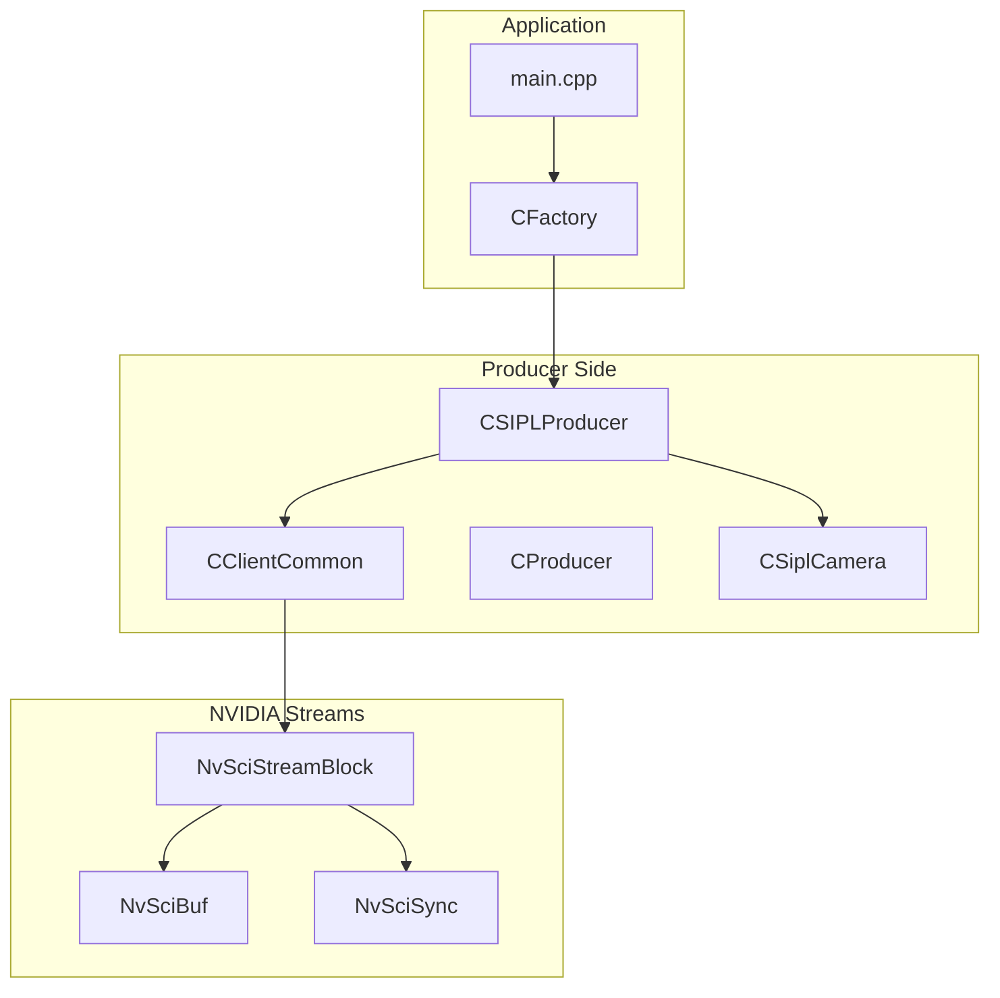
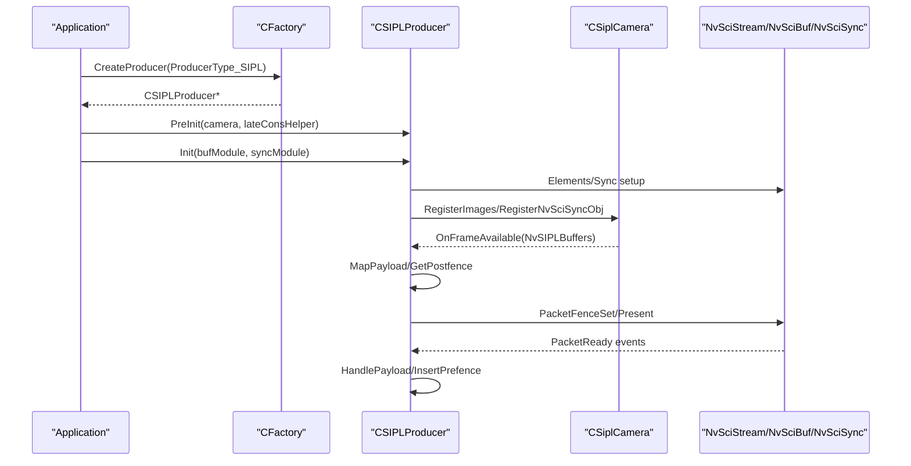
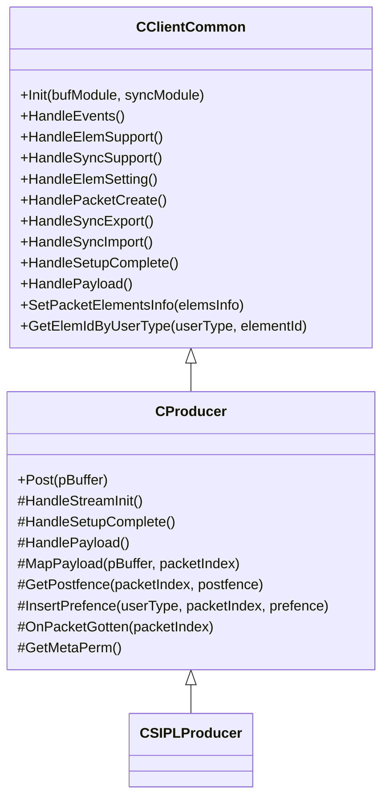
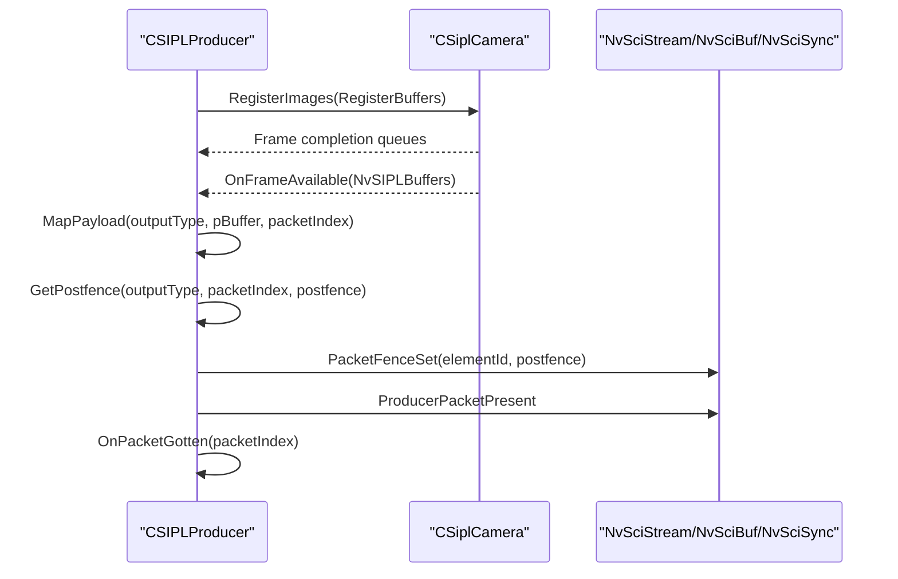
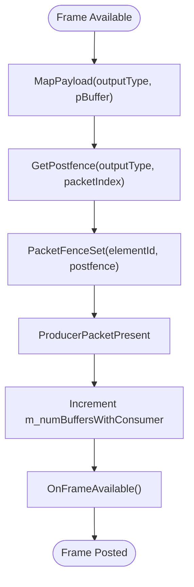
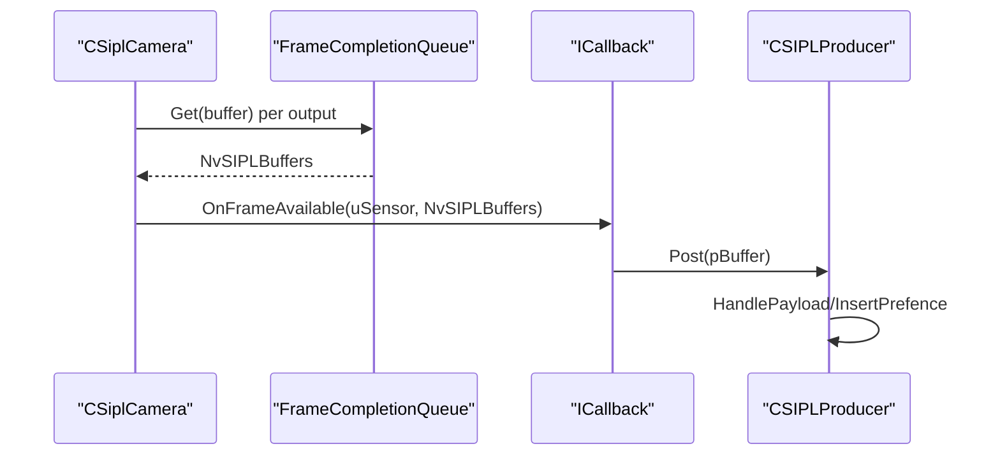
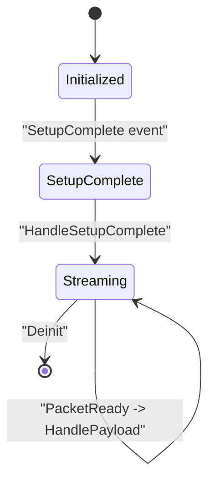
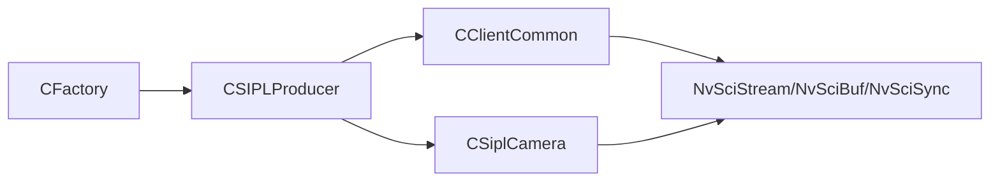

# Producer Framework

<cite>
**Referenced Files in This Document**
- [CProducer.hpp](file://CProducer.hpp)
- [CProducer.cpp](file://CProducer.cpp)
- [CSIPLProducer.hpp](file://CSIPLProducer.hpp)
- [CSIPLProducer.cpp](file://CSIPLProducer.cpp)
- [CClientCommon.hpp](file://CClientCommon.hpp)
- [CClientCommon.cpp](file://CClientCommon.cpp)
- [CSiplCamera.hpp](file://CSiplCamera.hpp)
- [CSiplCamera.cpp](file://CSiplCamera.cpp)
- [CFactory.hpp](file://CFactory.hpp)
- [CFactory.cpp](file://CFactory.cpp)
- [main.cpp](file://main.cpp)
- [README.md](file://README.md)
</cite>

## Table of Contents
1. [Introduction](#introduction)
2. [Project Structure](#project-structure)
3. [Core Components](#core-components)
4. [Architecture Overview](#architecture-overview)
5. [Detailed Component Analysis](#detailed-component-analysis)
6. [Dependency Analysis](#dependency-analysis)
7. [Performance Considerations](#performance-considerations)
8. [Troubleshooting Guide](#troubleshooting-guide)
9. [Conclusion](#conclusion)
10. [Appendices](#appendices)

## Introduction
This document explains the producer framework responsible for capturing camera frames via the NVIDIA SIPL pipeline and distributing them to multiple consumers through NvStreams. It covers the abstract CProducer base class, the CSIPLProducer implementation that integrates with the SIPL camera pipeline, frame distribution mechanisms, multi-element processing, asynchronous frame handling, lifecycle management, error handling, and resource cleanup. It also provides practical examples for initializing producers, streaming frames, and integrating with the broader multicast architecture.

## Project Structure
The producer framework is part of a larger multicast sample that demonstrates camera-to-consumer streaming across intra-process, inter-process, and inter-chip boundaries. The producer-side components are centered around:
- CClientCommon: Base client behavior for producers and consumers (setup, synchronization, packet handling)
- CProducer: Abstract producer interface extending CClientCommon
- CSIPLProducer: Concrete producer implementation for SIPL camera pipelines
- CSiplCamera: Camera orchestration and frame completion queues
- CFactory: Factory for creating producers, consumers, pools, and IPC blocks
- main: Application entry point and lifecycle orchestration

**Diagram sources**
- [main.cpp:253-304](file://main.cpp#L253-L304)
- [CFactory.cpp:68-94](file://CFactory.cpp#L68-L94)
- [CProducer.hpp:16-51](file://CProducer.hpp#L16-L51)
- [CSIPLProducer.hpp:18-81](file://CSIPLProducer.hpp#L18-L81)
- [CSiplCamera.hpp:46-85](file://CSiplCamera.hpp#L46-L85)

**Section sources**
- [README.md:11-109](file://README.md#L11-L109)
- [main.cpp:253-304](file://main.cpp#L253-L304)
- [CFactory.cpp:68-94](file://CFactory.cpp#L68-L94)

## Core Components
- CClientCommon: Implements the common client lifecycle, setup phases, packet creation, synchronization attribute reconciliation, and event-driven runtime loop. It manages element metadata, buffer mapping, and CPU wait contexts.
- CProducer: Extends CClientCommon to define producer-specific behaviors, including payload handling, posting frames, and fence management for multi-element streams.
- CSIPLProducer: Integrates with the SIPL camera pipeline, registers buffers, maps SIPL buffers to NvSciBuf objects, collects postfences, and posts frames to consumers.
- CSiplCamera: Manages camera instances, pipeline configuration, frame completion queues, and notification handlers for device blocks and pipelines.

Key responsibilities:
- Producer lifecycle: initialization, setup, streaming, teardown
- Multi-element support: mapping multiple ISP outputs (e.g., ISP0/ISP1) to separate elements
- Asynchronous frame handling: frame completion queues and event-driven packet processing
- Synchronization: NvSciSync fences for producer-consumer coordination
- Resource management: buffer and sync object allocation/freeing

**Section sources**
- [CClientCommon.hpp:47-201](file://CClientCommon.hpp#L47-L201)
- [CClientCommon.cpp:95-634](file://CClientCommon.cpp#L95-L634)
- [CProducer.hpp:16-51](file://CProducer.hpp#L16-L51)
- [CProducer.cpp:11-157](file://CProducer.cpp#L11-L157)
- [CSIPLProducer.hpp:18-81](file://CSIPLProducer.hpp#L18-L81)
- [CSIPLProducer.cpp:16-405](file://CSIPLProducer.cpp#L16-L405)
- [CSiplCamera.hpp:46-85](file://CSiplCamera.hpp#L46-L85)
- [CSiplCamera.cpp:209-362](file://CSiplCamera.cpp#L209-L362)

## Architecture Overview
The producer framework follows a producer-consumer pattern built on NvStreams:
- Producers create and manage packets, map buffers, and present frames with postfences
- Consumers import buffers and wait on pre-fences from producers
- NvSciBuf provides memory sharing; NvSciSync coordinates timing and ordering
- CSIPLProducer bridges SIPL buffers to NvSciBuf objects and manages multi-element outputs

**Diagram sources**
- [CFactory.cpp:68-94](file://CFactory.cpp#L68-L94)
- [CSIPLProducer.cpp:36-405](file://CSIPLProducer.cpp#L36-L405)
- [CSiplCamera.cpp:209-362](file://CSiplCamera.cpp#L209-L362)
- [CClientCommon.cpp:119-205](file://CClientCommon.cpp#L119-L205)

## Detailed Component Analysis

### CProducer Abstract Base Class
CProducer defines the producer’s responsibilities:
- Initialization and setup phases
- Payload handling and packet ownership transitions
- Fence management for pre/post synchronization
- Metadata permissions and buffer accounting

Key behaviors:
- HandleStreamInit: queries consumer count and sets up wait sync objects
- HandleSetupComplete: obtains initial packet ownership
- HandlePayload: waits on consumer pre-fences, inserts producer pre-fences, invokes OnPacketGotten
- Post: maps payload to packet index, retrieves postfence, presents packet

**Diagram sources**
- [CClientCommon.hpp:47-201](file://CClientCommon.hpp#L47-L201)
- [CProducer.hpp:16-51](file://CProducer.hpp#L16-L51)

**Section sources**
- [CProducer.hpp:16-51](file://CProducer.hpp#L16-L51)
- [CProducer.cpp:17-157](file://CProducer.cpp#L17-L157)
- [CClientCommon.cpp:95-634](file://CClientCommon.cpp#L95-L634)

### CSIPLProducer Implementation
CSIPLProducer integrates with the SIPL camera pipeline:
- PreInit: binds camera and late consumer helper
- Element mapping: maps SIPL output types to internal element types
- Buffer registration: duplicates NvSciBuf objects and registers images with the camera
- Fence handling: collects EOF postfences from SIPL buffers and sets them on packets
- Packet posting: iterates multiple outputs per frame, sets per-element postfences, and presents the packet

**Diagram sources**
- [CSIPLProducer.cpp:243-405](file://CSIPLProducer.cpp#L243-L405)
- [CSiplCamera.cpp:523-618](file://CSiplCamera.cpp#L523-L618)

**Section sources**
- [CSIPLProducer.hpp:18-81](file://CSIPLProducer.hpp#L18-L81)
- [CSIPLProducer.cpp:54-405](file://CSIPLProducer.cpp#L54-L405)
- [CSiplCamera.hpp:523-618](file://CSiplCamera.hpp#L523-L618)

### Frame Distribution Mechanism Through NvStreams
- Elements: Each output type (e.g., ISP0/ISP1) is treated as a distinct element with its own buffer attributes and synchronization
- Packet lifecycle: Packets are created by the pool, mapped to NvSciBuf objects, and presented by the producer
- Multi-element posting: CSIPLProducer iterates outputs and sets per-element postfences before presenting
- Consumer synchronization: Consumers import waiter attributes, allocate sync objects, and wait on pre-fences

**Diagram sources**
- [CSIPLProducer.cpp:367-405](file://CSIPLProducer.cpp#L367-L405)
- [CProducer.cpp:123-151](file://CProducer.cpp#L123-L151)

**Section sources**
- [CClientCommon.cpp:300-467](file://CClientCommon.cpp#L300-L467)
- [CClientCommon.cpp:469-591](file://CClientCommon.cpp#L469-L591)
- [CProducer.cpp:56-151](file://CProducer.cpp#L56-L151)

### Asynchronous Frame Handling and Late Consumer Support
- Frame completion queues: CSiplCamera aggregates per-output completion queues and dispatches frames to the producer callback
- Late consumer helper: CSIPLProducer adjusts wait sync object counts when late consumers join
- CPU wait fallback: Producer can wait on fences via CPU context when required

**Diagram sources**
- [CSiplCamera.cpp:523-618](file://CSiplCamera.cpp#L523-L618)
- [CSIPLProducer.cpp:300-308](file://CSIPLProducer.cpp#L300-L308)
- [CProducer.cpp:56-121](file://CProducer.cpp#L56-L121)

**Section sources**
- [CSiplCamera.cpp:209-362](file://CSiplCamera.cpp#L209-L362)
- [CSIPLProducer.cpp:63-73](file://CSIPLProducer.cpp#L63-L73)
- [CProducer.cpp:17-54](file://CProducer.cpp#L17-L54)

### Producer Lifecycle Management
- Creation: CFactory creates a producer handle and initializes elements
- Initialization: CClientCommon.Init drives setup phases and element/sync attribute negotiation
- Streaming: HandleEvents processes PacketReady events and invokes HandlePayload
- Teardown: Destructor frees buffers, sync objects, and CPU wait context

**Diagram sources**
- [CClientCommon.cpp:119-205](file://CClientCommon.cpp#L119-L205)
- [CClientCommon.cpp:95-112](file://CClientCommon.cpp#L95-L112)

**Section sources**
- [CFactory.cpp:68-94](file://CFactory.cpp#L68-L94)
- [CClientCommon.cpp:95-112](file://CClientCommon.cpp#L95-L112)
- [CClientCommon.cpp:38-93](file://CClientCommon.cpp#L38-L93)

### Error Handling and Resource Cleanup
- Error propagation: Many operations return SIPLStatus or NvSciError; errors are logged and propagated up
- Fence handling: Producer waits on pre-fences or inserts them depending on platform capabilities
- Resource cleanup: Destructor frees NvSciBufObj, NvSciSyncObj, and CPU wait context; buffers are freed during teardown

**Section sources**
- [CProducer.cpp:17-54](file://CProducer.cpp#L17-L54)
- [CProducer.cpp:56-121](file://CProducer.cpp#L56-L121)
- [CClientCommon.cpp:38-93](file://CClientCommon.cpp#L38-L93)

## Dependency Analysis
The producer framework depends on:
- NvStreams for packet creation, presentation, and synchronization
- NvSciBuf for buffer sharing and metadata
- NvSciSync for fence-based synchronization
- SIPL camera pipeline for frame capture and completion queues

**Diagram sources**
- [CFactory.cpp:68-94](file://CFactory.cpp#L68-L94)
- [CSIPLProducer.cpp:16-405](file://CSIPLProducer.cpp#L16-L405)
- [CSiplCamera.cpp:209-362](file://CSiplCamera.cpp#L209-L362)

**Section sources**
- [CFactory.cpp:68-94](file://CFactory.cpp#L68-L94)
- [CClientCommon.hpp:15-20](file://CClientCommon.hpp#L15-L20)
- [CSIPLProducer.cpp:16-405](file://CSIPLProducer.cpp#L16-L405)

## Performance Considerations
- Multi-element outputs: Using ISP0/ISP1 enables parallel processing paths; ensure consumers can keep up to avoid backpressure
- CPU wait fallback: Enabling CPU wait can mitigate issues with ISP sync registration but may introduce latency
- Buffer alignment and layouts: Properly setting image attributes reduces overhead and improves consumer throughput
- Frame pacing: Profiler callbacks can be used to track frame availability and detect stalls

[No sources needed since this section provides general guidance]

## Troubleshooting Guide
Common issues and remedies:
- Consumer count exceeded: Ensure the configured consumer count does not exceed limits
- Fence errors: Verify pre-fence collection and CPU wait context setup
- Buffer mapping failures: Confirm SIPL output type to element mapping and buffer duplication
- Late consumer attachment: Adjust wait sync object counts and ensure helper is initialized

**Section sources**
- [CProducer.cpp:17-54](file://CProducer.cpp#L17-L54)
- [CProducer.cpp:56-121](file://CProducer.cpp#L56-L121)
- [CSIPLProducer.cpp:310-346](file://CSIPLProducer.cpp#L310-L346)
- [CSIPLProducer.cpp:63-73](file://CSIPLProducer.cpp#L63-L73)

## Conclusion
The producer framework provides a robust, extensible foundation for camera frame capture and distribution using NVIDIA SIPL and NvStreams. CSIPLProducer encapsulates SIPL integration, while CProducer and CClientCommon standardize lifecycle, synchronization, and packet handling. The design supports multi-element outputs, asynchronous frame handling, and late consumer attachment, enabling flexible deployment across intra-process, inter-process, and inter-chip scenarios.

[No sources needed since this section summarizes without analyzing specific files]

## Appendices

### Producer Initialization Example
- Create producer via factory with ProducerType_SIPL
- Initialize with buffer and sync modules
- Pre-initialize with camera and optional late consumer helper
- Start streaming and handle events

**Section sources**
- [CFactory.cpp:68-94](file://CFactory.cpp#L68-L94)
- [CClientCommon.cpp:95-112](file://CClientCommon.cpp#L95-L112)
- [CSIPLProducer.cpp:36-41](file://CSIPLProducer.cpp#L36-L41)

### Frame Streaming Operations
- Receive frames from CSiplCamera completion queues
- Map SIPL buffers to packet indices
- Collect postfences and present packets
- Handle payload events and insert pre-fences

**Section sources**
- [CSiplCamera.cpp:523-618](file://CSiplCamera.cpp#L523-L618)
- [CSIPLProducer.cpp:326-405](file://CSIPLProducer.cpp#L326-L405)
- [CProducer.cpp:56-121](file://CProducer.cpp#L56-L121)

### Multicast Integration
- Create multicast blocks and producer/consumer handles
- Configure queues and element information
- Manage IPC channels for inter-process and inter-chip scenarios

**Section sources**
- [CFactory.cpp:207-213](file://CFactory.cpp#L207-L213)
- [CFactory.cpp:138-164](file://CFactory.cpp#L138-L164)
- [CFactory.cpp:243-314](file://CFactory.cpp#L243-L314)