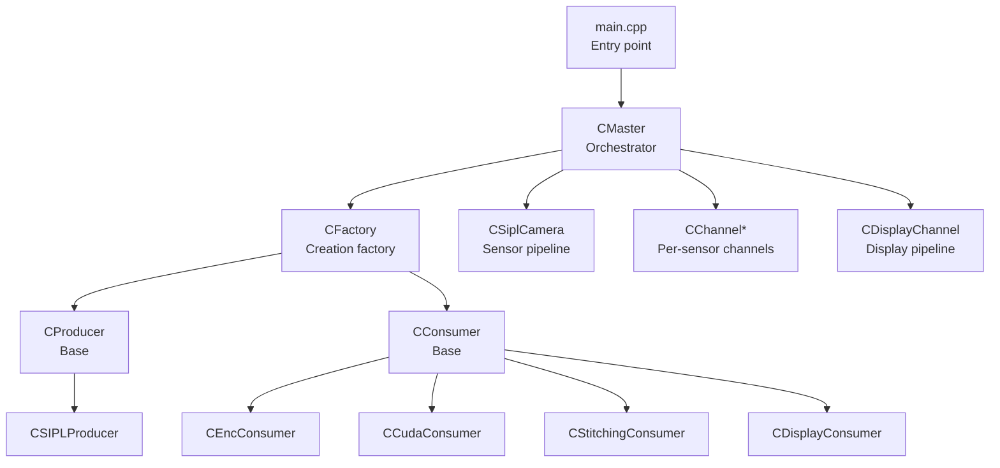
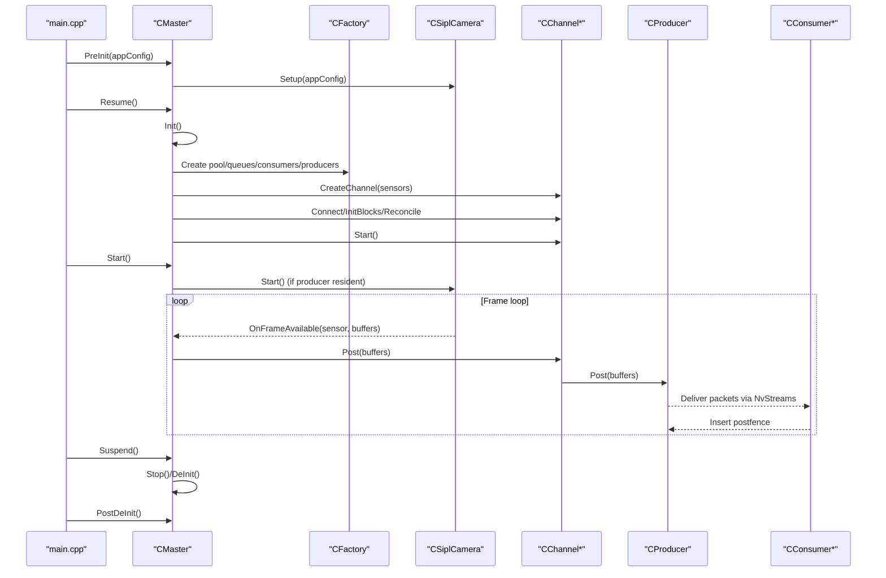
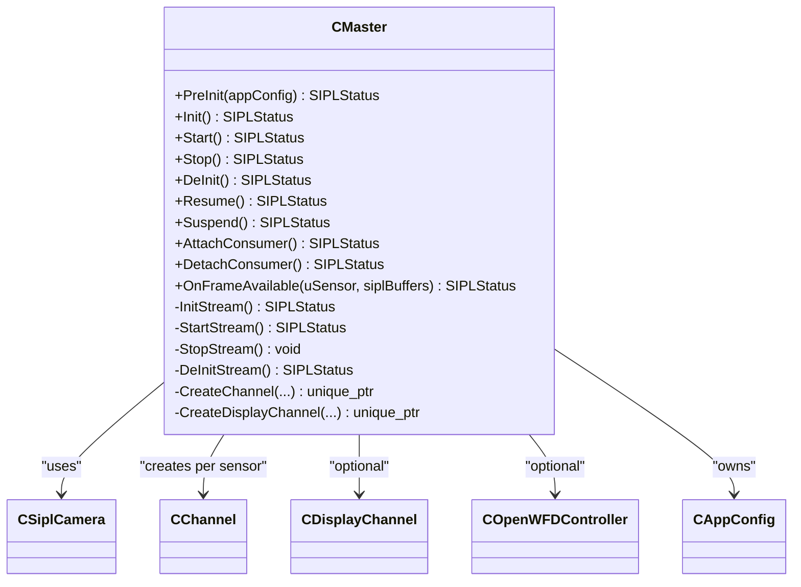
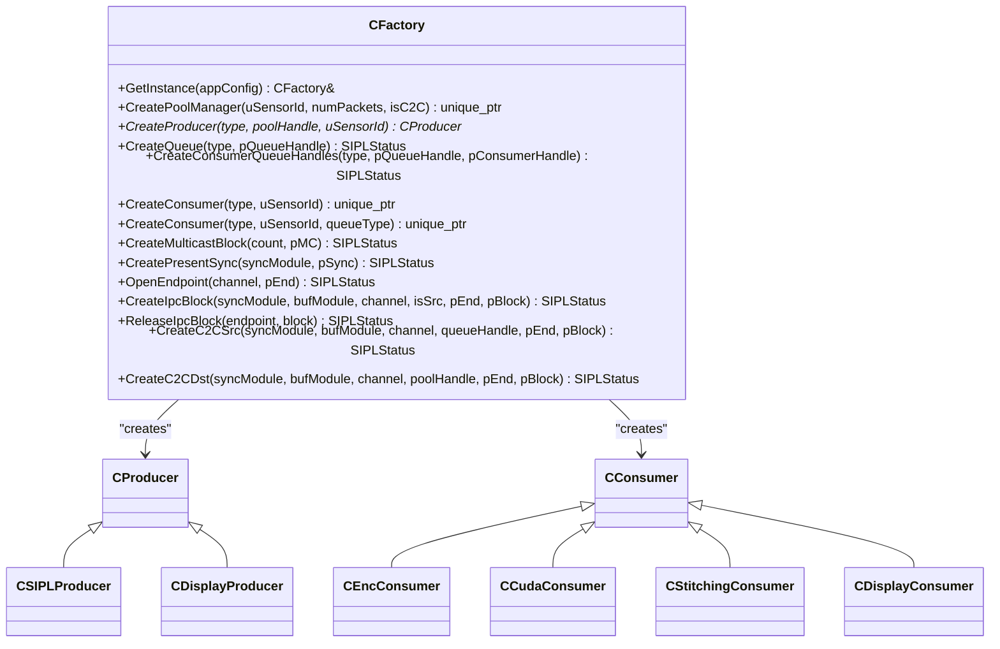
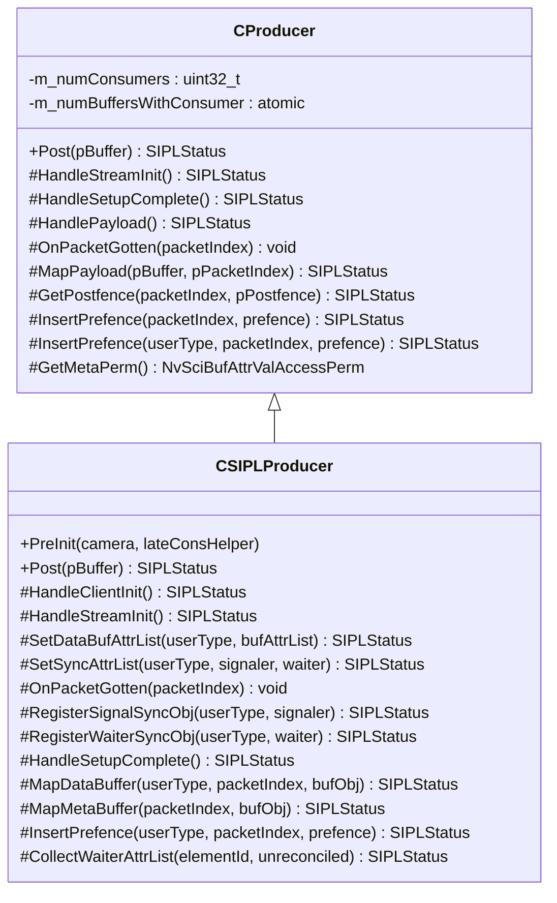
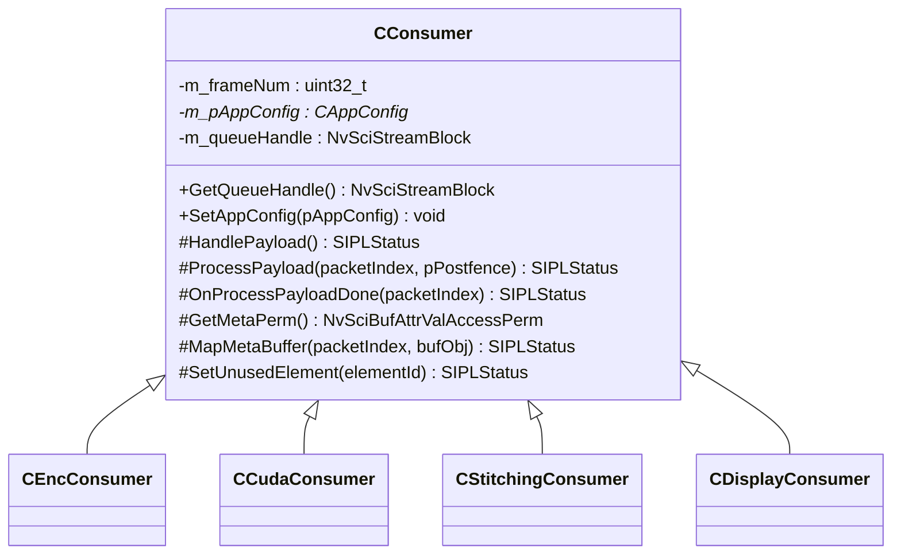
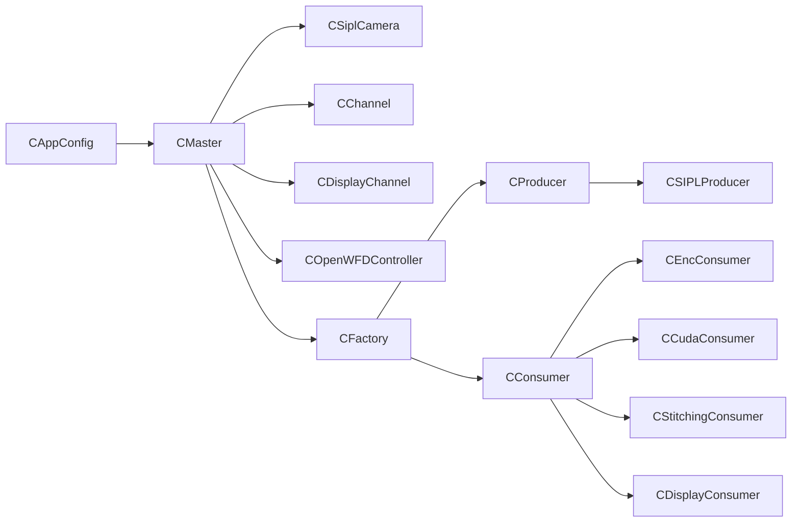

# System Components

<cite>
**Referenced Files in This Document**
- [main.cpp](file://main.cpp)
- [CMaster.hpp](file://CMaster.hpp)
- [CMaster.cpp](file://CMaster.cpp)
- [CFactory.hpp](file://CFactory.hpp)
- [CFactory.cpp](file://CFactory.cpp)
- [CProducer.hpp](file://CProducer.hpp)
- [CProducer.cpp](file://CProducer.cpp)
- [CConsumer.hpp](file://CConsumer.hpp)
- [CConsumer.cpp](file://CConsumer.cpp)
- [CAppConfig.hpp](file://CAppConfig.hpp)
- [CCudaConsumer.hpp](file://CCudaConsumer.hpp)
- [CEncConsumer.hpp](file://CEncConsumer.hpp)
- [CStitchingConsumer.hpp](file://CStitchingConsumer.hpp)
- [CDisplayConsumer.hpp](file://CDisplayConsumer.hpp)
- [CSIPLProducer.hpp](file://CSIPLProducer.hpp)
</cite>

## Table of Contents
1. [Introduction](#introduction)
2. [Project Structure](#project-structure)
3. [Core Components](#core-components)
4. [Architecture Overview](#architecture-overview)
5. [Detailed Component Analysis](#detailed-component-analysis)
6. [Dependency Analysis](#dependency-analysis)
7. [Performance Considerations](#performance-considerations)
8. [Troubleshooting Guide](#troubleshooting-guide)
9. [Conclusion](#conclusion)

## Introduction
This document describes the core system components of the NVIDIA SIPL Multicast architecture. It focuses on the central orchestrator CMaster, the CFactory pattern for dynamic creation of producers and consumers, the CProducer base class interface for frame distribution via NvStreams, and the CConsumer abstract base class with its specialized implementations. It also covers component relationships, initialization sequences, lifecycle management, and practical instantiation patterns.

## Project Structure
The multicast application is organized around a small set of core classes and supporting utilities:
- Application entry point initializes configuration, sets up signal handlers, and drives the lifecycle via CMaster.
- CMaster coordinates camera setup, channel creation, and streaming lifecycle.
- CFactory encapsulates creation of producers, consumers, queues, and IPC/C2C blocks.
- CProducer and CConsumer define the base interfaces for frame distribution and processing.
- Specialized implementations provide CUDA-based processing, encoding, stitching, and display output.

**Diagram sources**
- [main.cpp:253-304](file://main.cpp#L253-L304)
- [CMaster.hpp:46-92](file://CMaster.hpp#L46-L92)
- [CFactory.hpp:27-92](file://CFactory.hpp#L27-L92)
- [CProducer.hpp:16-51](file://CProducer.hpp#L16-L51)
- [CConsumer.hpp:16-43](file://CConsumer.hpp#L16-L43)
- [CEncConsumer.hpp:17-65](file://CEncConsumer.hpp#L17-L65)
- [CCudaConsumer.hpp:25-80](file://CCudaConsumer.hpp#L25-L80)
- [CStitchingConsumer.hpp:17-73](file://CStitchingConsumer.hpp#L17-L73)
- [CDisplayConsumer.hpp:15-48](file://CDisplayConsumer.hpp#L15-L48)
- [CSIPLProducer.hpp:18-83](file://CSIPLProducer.hpp#L18-L83)

**Section sources**
- [main.cpp:253-304](file://main.cpp#L253-L304)
- [CMaster.hpp:46-92](file://CMaster.hpp#L46-L92)
- [CFactory.hpp:27-92](file://CFactory.hpp#L27-L92)

## Core Components
- CMaster: Central orchestrator that manages camera setup, channel creation, display stitching, and the end-to-end streaming lifecycle. It exposes lifecycle methods PreInit, Init, Start, Stop, DeInit, Resume, Suspend, and supports late consumer attach/detach for IPC/C2C scenarios.
- CFactory: Singleton-style factory that creates producers, consumers, queues, pools, multicastr, present sync, and IPC/C2C blocks based on configuration.
- CProducer: Base class for producers that distribute frames to multiple consumers via NvStreams, handling packet acquisition, pre/post fence handling, and payload posting.
- CConsumer: Base class for consumers that process frames from producers, handling packet acquisition, synchronization, payload processing, and release.
- Specialized Consumers: CEncConsumer (encoding), CCudaConsumer (CUDA processing), CStitchingConsumer (image composition), CDisplayConsumer (display output).
- Specialized Producer: CSIPLProducer (integrates with NvSIPL camera pipeline).

**Section sources**
- [CMaster.hpp:46-92](file://CMaster.hpp#L46-L92)
- [CMaster.cpp:164-232](file://CMaster.cpp#L164-L232)
- [CFactory.hpp:27-92](file://CFactory.hpp#L27-L92)
- [CFactory.cpp:68-94](file://CFactory.cpp#L68-L94)
- [CProducer.hpp:16-51](file://CProducer.hpp#L16-L51)
- [CProducer.cpp:17-54](file://CProducer.cpp#L17-L54)
- [CConsumer.hpp:16-43](file://CConsumer.hpp#L16-L43)
- [CConsumer.cpp:17-94](file://CConsumer.cpp#L17-L94)
- [CEncConsumer.hpp:17-65](file://CEncConsumer.hpp#L17-L65)
- [CCudaConsumer.hpp:25-80](file://CCudaConsumer.hpp#L25-L80)
- [CStitchingConsumer.hpp:17-73](file://CStitchingConsumer.hpp#L17-L73)
- [CDisplayConsumer.hpp:15-48](file://CDisplayConsumer.hpp#L15-L48)
- [CSIPLProducer.hpp:18-83](file://CSIPLProducer.hpp#L18-L83)

## Architecture Overview
The system follows a producer-consumer model built on NvStreams and NvSciBuf/NvSciSync. CMaster configures and starts/stops the camera pipeline and channels. CFactory constructs the runtime graph (producers, consumers, queues, and IPC/C2C links). Producers post frames; consumers acquire and process them, coordinating via fences and queues.

**Diagram sources**
- [main.cpp:271-294](file://main.cpp#L271-L294)
- [CMaster.cpp:164-232](file://CMaster.cpp#L164-L232)
- [CFactory.cpp:68-94](file://CFactory.cpp#L68-L94)
- [CProducer.cpp:123-151](file://CProducer.cpp#L123-L151)
- [CConsumer.cpp:17-94](file://CConsumer.cpp#L17-L94)

## Detailed Component Analysis

### CMaster: Central Orchestrator
Responsibilities:
- Pre-initialization: builds configuration and camera setup.
- Initialization: opens NvSci modules, initializes display controller if enabled, registers sensors, creates channels and display channel, reconciles blocks.
- Lifecycle: Start/Stop streams, monitor pipeline health, handle suspend/resume, late attach/detach for IPC/C2C producers.
- Callback: OnFrameAvailable routes incoming frames to the appropriate channel type.

Key methods and flows:
- PreInit: stores app config, determines producer residency, sets up CSiplCamera.
- Init: optionally initializes camera, initializes stream, registers auto control plugin if producer resident.
- Start: starts stream, spawns monitor thread, starts camera if resident.
- Stop: stops camera if resident, joins monitor thread, stops stream.
- Suspend/Resume: wrap Init/Start/Stop/DeInit with state transitions.
- OnFrameAvailable: dispatches to single-process or IPC producer channel based on configuration.
- Late attach/detach: triggers attach/detach on IPC producer channels.

**Diagram sources**
- [CMaster.hpp:46-92](file://CMaster.hpp#L46-L92)
- [CMaster.cpp:164-232](file://CMaster.cpp#L164-L232)

**Section sources**
- [CMaster.hpp:46-92](file://CMaster.hpp#L46-L92)
- [CMaster.cpp:164-232](file://CMaster.cpp#L164-L232)

### CFactory: Dynamic Creation Pattern
Responsibilities:
- CreatePoolManager: allocates static NvSciStream pools.
- CreateProducer: creates CSIPLProducer or CDisplayProducer with configured packet elements.
- CreateConsumer: creates CEncConsumer, CCudaConsumer, CStitchingConsumer, or CDisplayConsumer with queue handles and element usage.
- Queue and IPC/C2C helpers: mailbox/fifo queues, multicast blocks, present sync, endpoint open/close, and IPC/C2C block creation.

**Diagram sources**
- [CFactory.hpp:27-92](file://CFactory.hpp#L27-L92)
- [CFactory.cpp:68-94](file://CFactory.cpp#L68-L94)
- [CFactory.cpp:166-205](file://CFactory.cpp#L166-L205)

**Section sources**
- [CFactory.hpp:27-92](file://CFactory.hpp#L27-L92)
- [CFactory.cpp:68-94](file://CFactory.cpp#L68-L94)
- [CFactory.cpp:166-205](file://CFactory.cpp#L166-L205)

### CProducer: Base Interface for Frame Distribution
Responsibilities:
- Tracks consumer count and manages packet ownership.
- Handles stream init/setup to query consumer count and take initial packet ownership.
- Processes payload by acquiring packets, inserting pre-fences from consumers, invoking derived OnPacketGotten, and posting with post-fences.
- Provides metadata permissions and optional CPU wait integration.

**Diagram sources**
- [CProducer.hpp:16-51](file://CProducer.hpp#L16-L51)
- [CProducer.cpp:17-54](file://CProducer.cpp#L17-L54)
- [CProducer.cpp:123-151](file://CProducer.cpp#L123-L151)
- [CSIPLProducer.hpp:18-83](file://CSIPLProducer.hpp#L18-L83)

**Section sources**
- [CProducer.hpp:16-51](file://CProducer.hpp#L16-L51)
- [CProducer.cpp:17-54](file://CProducer.cpp#L17-L54)
- [CProducer.cpp:123-151](file://CProducer.cpp#L123-L151)
- [CSIPLProducer.hpp:18-83](file://CSIPLProducer.hpp#L18-L83)

### CConsumer: Base Interface for Frame Processing
Responsibilities:
- Acquires packets from the queue, filters frames according to frame filter, waits on pre-fences if required, processes payload, inserts post-fence, and releases packet back to producer.
- Provides metadata mapping and element usage control.
- Exposes queue handle for downstream wiring.

**Diagram sources**
- [CConsumer.hpp:16-43](file://CConsumer.hpp#L16-L43)
- [CConsumer.cpp:17-94](file://CConsumer.cpp#L17-L94)
- [CEncConsumer.hpp:17-65](file://CEncConsumer.hpp#L17-L65)
- [CCudaConsumer.hpp:25-80](file://CCudaConsumer.hpp#L25-L80)
- [CStitchingConsumer.hpp:17-73](file://CStitchingConsumer.hpp#L17-L73)
- [CDisplayConsumer.hpp:15-48](file://CDisplayConsumer.hpp#L15-L48)

**Section sources**
- [CConsumer.hpp:16-43](file://CConsumer.hpp#L16-L43)
- [CConsumer.cpp:17-94](file://CConsumer.cpp#L17-L94)
- [CEncConsumer.hpp:17-65](file://CEncConsumer.hpp#L17-L65)
- [CCudaConsumer.hpp:25-80](file://CCudaConsumer.hpp#L25-L80)
- [CStitchingConsumer.hpp:17-73](file://CStitchingConsumer.hpp#L17-L73)
- [CDisplayConsumer.hpp:15-48](file://CDisplayConsumer.hpp#L15-L48)

### Specialized Consumers

#### CEncConsumer: Encoding Consumer
- Integrates with NvMedia IEP for H.264 encoding.
- Manages encoder lifecycle, buffer attributes, and output file handling.
- Implements pre/post fence insertion and payload processing tailored for encoded output.

**Section sources**
- [CEncConsumer.hpp:17-65](file://CEncConsumer.hpp#L17-L65)

#### CCudaConsumer: CUDA Processing Consumer
- Maps external memory and mipmapped arrays for GPU processing.
- Supports inference and optional dumping of intermediate data.
- Implements CPU wait path and CUDA-specific synchronization.

**Section sources**
- [CCudaConsumer.hpp:25-80](file://CCudaConsumer.hpp#L25-L80)

#### CStitchingConsumer: Image Composition Consumer
- Composes multiple views into a stitched output using NvMedia 2D.
- Manages destination buffer registration and 2D composition parameters.
- Integrates with display producer for final output.

**Section sources**
- [CStitchingConsumer.hpp:17-73](file://CStitchingConsumer.hpp#L17-L73)

#### CDisplayConsumer: Display Consumer
- Integrates with COpenWFDController for display pipelines.
- Manages buffer attributes and display-specific setup.
- Implements CPU wait policy suited for display timing.

**Section sources**
- [CDisplayConsumer.hpp:15-48](file://CDisplayConsumer.hpp#L15-L48)

### Specialized Producer

#### CSIPLProducer: NvSIPL Camera Producer
- Bridges CSiplCamera with the producer interface.
- Registers buffers per output type, maps elements to camera outputs, and posts frames with appropriate post-fences.
- Supports late consumer helper for dynamic consumer attach/detach.

**Section sources**
- [CSIPLProducer.hpp:18-83](file://CSIPLProducer.hpp#L18-L83)

## Dependency Analysis
- CMaster depends on CAppConfig, CSiplCamera, CChannel, CDisplayChannel, COpenWFDController, and NvSci modules. It orchestrates lifecycle and dispatches frames.
- CFactory depends on CAppConfig and creates NvSciStream blocks, queues, and producer/consumer instances.
- CProducer and CConsumer depend on NvSciBuf/NvSciSync and CClientCommon for packet handling and synchronization.
- Specialized consumers/producers extend the base classes and integrate with platform-specific libraries (NvMedia, CUDA).

**Diagram sources**
- [CMaster.hpp:74-91](file://CMaster.hpp#L74-L91)
- [CFactory.hpp:78-91](file://CFactory.hpp#L78-L91)
- [CProducer.hpp:16-23](file://CProducer.hpp#L16-L23)
- [CConsumer.hpp:16-22](file://CConsumer.hpp#L16-L22)
- [CSIPLProducer.hpp:18-26](file://CSIPLProducer.hpp#L18-L26)
- [CEncConsumer.hpp:17-22](file://CEncConsumer.hpp#L17-L22)
- [CCudaConsumer.hpp:25-30](file://CCudaConsumer.hpp#L25-L30)
- [CStitchingConsumer.hpp:17-22](file://CStitchingConsumer.hpp#L17-L22)
- [CDisplayConsumer.hpp:15-20](file://CDisplayConsumer.hpp#L15-L20)

**Section sources**
- [CMaster.hpp:74-91](file://CMaster.hpp#L74-L91)
- [CFactory.hpp:78-91](file://CFactory.hpp#L78-L91)
- [CProducer.hpp:16-23](file://CProducer.hpp#L16-L23)
- [CConsumer.hpp:16-22](file://CConsumer.hpp#L16-L22)

## Performance Considerations
- Fence handling: Both producer and consumer coordinate via pre/post fences. CPU waits are used conditionally to avoid blocking in latency-critical paths.
- Frame filtering: Consumers can skip frames using a configurable frame filter to reduce processing load.
- Profiling: Per-sensor profiling tracks frame rates during monitoring to aid tuning.
- Multi-element support: Enabling multi-elements increases bandwidth and processing but can improve performance by avoiding extra conversions.

[No sources needed since this section provides general guidance]

## Troubleshooting Guide
- Pipeline failures: The monitor thread checks camera notification handlers and device block notification handlers for errors and triggers graceful shutdown.
- Suspend/Resume: Use command-line or socket events to gracefully suspend and resume the pipeline.
- Late attach/detach: Only IPC/C2C producers support late consumer attach/detach; ensure configuration matches.

**Section sources**
- [CMaster.cpp:382-400](file://CMaster.cpp#L382-L400)
- [main.cpp:74-153](file://main.cpp#L74-L153)
- [main.cpp:155-251](file://main.cpp#L155-L251)
- [CMaster.cpp:473-513](file://CMaster.cpp#L473-L513)

## Conclusion
The NVIDIA SIPL Multicast architecture centers on CMaster for orchestration, CFactory for dynamic component creation, and base classes CProducer/CConsumer for robust frame distribution and processing. Specialized implementations enable flexible pipelines for encoding, CUDA processing, stitching, and display. The design cleanly separates concerns, leverages NvSci for synchronization, and supports lifecycle operations and dynamic consumer attachment.