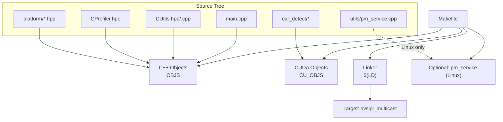
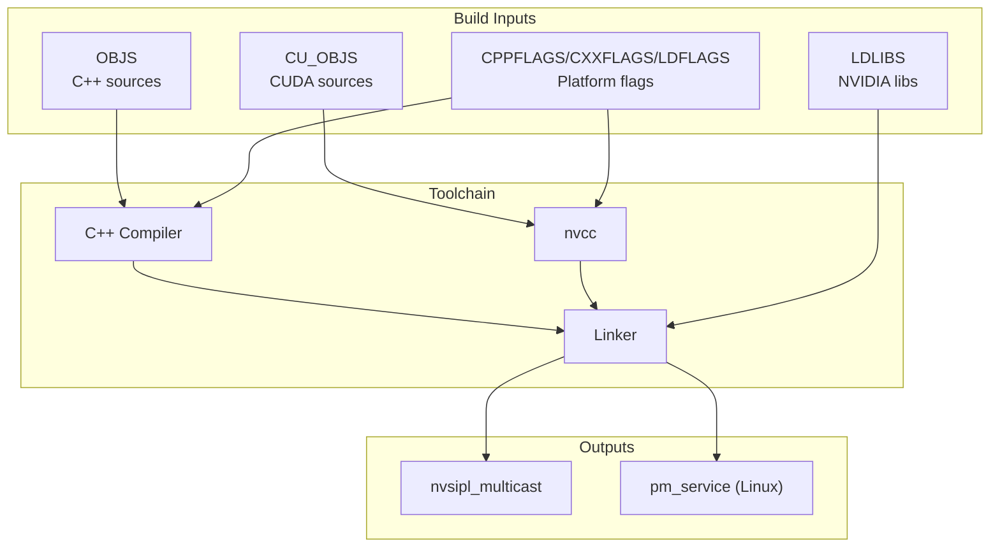
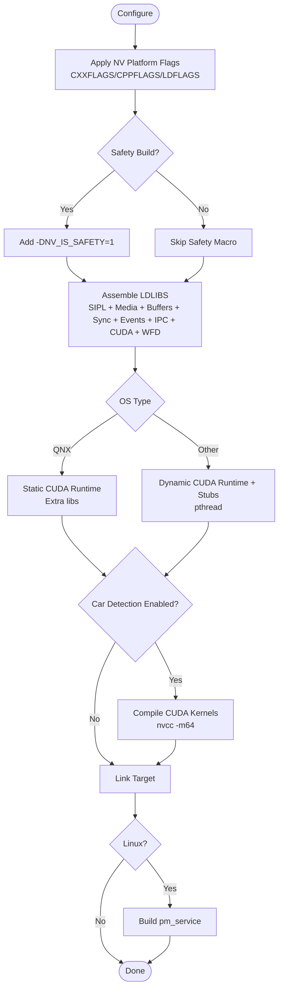
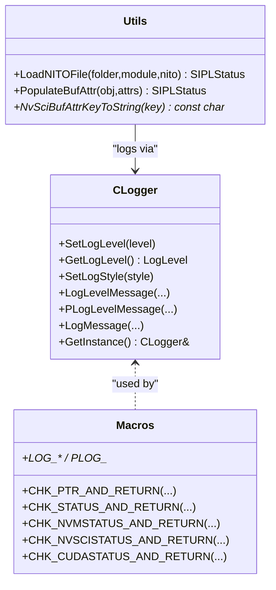
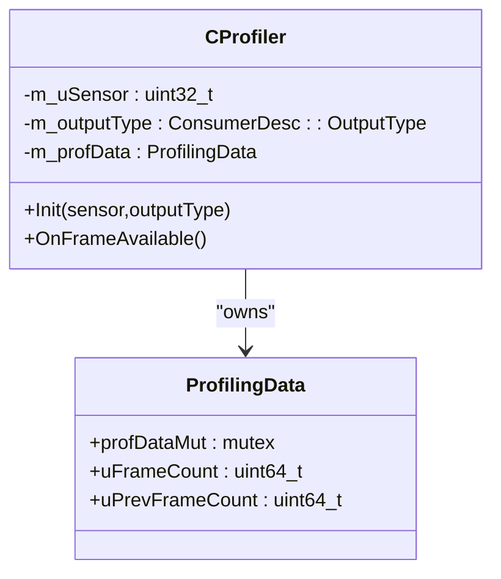
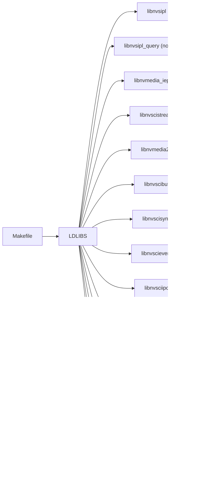

# Build System

<cite>
**Referenced Files in This Document**
- [Makefile](file://Makefile)
- [README.md](file://README.md)
- [main.cpp](file://main.cpp)
- [CUtils.hpp](file://CUtils.hpp)
- [CUtils.cpp](file://CUtils.cpp)
- [CProfiler.hpp](file://CProfiler.hpp)
- [car_detect/CCarDetector.hpp](file://car_detect/CCarDetector.hpp)
- [car_detect/CCudlaContext.hpp](file://car_detect/CCudlaContext.hpp)
- [car_detect/Common.hpp](file://car_detect/Common.hpp)
- [platform/ar0820.hpp](file://platform/ar0820.hpp)
- [utils/pm_service.cpp](file://utils/pm_service.cpp)
</cite>

## Table of Contents
1. [Introduction](#introduction)
2. [Project Structure](#project-structure)
3. [Core Components](#core-components)
4. [Architecture Overview](#architecture-overview)
5. [Detailed Component Analysis](#detailed-component-analysis)
6. [Dependency Analysis](#dependency-analysis)
7. [Performance Considerations](#performance-considerations)
8. [Troubleshooting Guide](#troubleshooting-guide)
9. [Conclusion](#conclusion)
10. [Appendices](#appendices)

## Introduction
This document explains the build system and development utilities for the NVIDIA SIPL Multicast project. It covers the Makefile configuration, platform-specific compilation flags, CUDA integration, build targets for intra-process, inter-process, and inter-chip scenarios, and the development utilities CUtils and CProfiler. It also describes the compilation process, dependency management, cross-compilation support, troubleshooting, optimization flags, debugging configuration, and practical examples for custom builds and CI setup.

## Project Structure
The build system centers on a single Makefile that orchestrates C++ and CUDA compilation, links against NVIDIA libraries, and conditionally enables platform-specific features. The application entry point initializes configuration, logging, and runtime threads. Development utilities provide logging macros, a logger singleton, and a lightweight profiler. Optional car detection components integrate cuDLA for inference.

**Diagram sources**
- [Makefile](file://Makefile)
- [main.cpp](file://main.cpp)
- [CUtils.hpp](file://CUtils.hpp)
- [CUtils.cpp](file://CUtils.cpp)
- [CProfiler.hpp](file://CProfiler.hpp)
- [car_detect/CCarDetector.hpp](file://car_detect/CCarDetector.hpp)
- [car_detect/CCudlaContext.hpp](file://car_detect/CCudlaContext.hpp)
- [car_detect/Common.hpp](file://car_detect/Common.hpp)
- [platform/ar0820.hpp](file://platform/ar0820.hpp)
- [utils/pm_service.cpp](file://utils/pm_service.cpp)

**Section sources**
- [Makefile](file://Makefile)
- [README.md](file://README.md)

## Core Components
- Build orchestration via Makefile with platform-aware flags and library linking.
- CUDA integration for optional car detection features.
- Logging and assertion macros via CUtils.
- Lightweight frame profiling via CProfiler.
- Platform configuration definitions for multiple sensors and boards.

**Section sources**
- [Makefile](file://Makefile)
- [CUtils.hpp](file://CUtils.hpp)
- [CUtils.cpp](file://CUtils.cpp)
- [CProfiler.hpp](file://CProfiler.hpp)
- [car_detect/Common.hpp](file://car_detect/Common.hpp)
- [platform/ar0820.hpp](file://platform/ar0820.hpp)

## Architecture Overview
The build system composes a primary target nvsipl_multicast from a set of C++ object files and optionally CUDA object files. Platform-specific flags and libraries are injected based on environment variables and OS. Optional Linux-only utilities provide power management signaling.

**Diagram sources**
- [Makefile](file://Makefile)

## Detailed Component Analysis

### Makefile Build Configuration
- Targets and object lists define the build graph.
- Platform flags are imported from a shared definition file and applied to CXXFLAGS, CPPFLAGS, and LDFLAGS.
- Conditional safety flag adds a preprocessor macro for safety builds.
- Library list includes NVIDIA SIPL, media, buffers, sync, events, IPC, CUDA, and WFD components.
- OS-specific handling:
  - QNX: Static CUDA runtime linkage and additional libraries.
  - Non-QNX: Dynamic CUDA runtime and stubs, pthreads.
- Optional car detection:
  - CUDA kernels compiled via nvcc with explicit -m64 target.
  - Includes car_detect headers and links cudla.
- Additional Linux utility:
  - A separate pm_service binary is built on Linux for power management signaling.

**Diagram sources**
- [Makefile](file://Makefile)

**Section sources**
- [Makefile](file://Makefile)

### CUDA Integration and Cross-Compilation Support
- CUDA toolkit path is used to locate nvcc and runtime/stub libraries.
- Cross-compilation target is set to 64-bit for CUDA objects.
- Car detection is disabled on QNX and enabled otherwise.
- Static CUDA runtime is used on QNX; dynamic runtime and cudla stubs are used on other OSes.

**Section sources**
- [Makefile](file://Makefile)

### Build Targets and Deployment Scenarios
- Intra-process: Single process hosting producer and consumers.
- Inter-process (peer-to-peer): Separate producer and consumer processes sharing SIPL channels.
- Inter-chip (C2C): Producer and consumer processes communicate across chips.
- Late/re-attach: Consumers can attach/detach dynamically in compatible environments.

These scenarios are exercised via command-line options and documented usage examples.

**Section sources**
- [README.md](file://README.md)

### Development Utilities: CUtils
- Provides assertion and status-check macros for SIPL/NvMedia/NvSci/CUDA/WFD.
- Implements a singleton logger with configurable verbosity and function/line prefixes.
- Utility functions for loading NITO camera metadata and extracting NvSciBuf attributes.

**Diagram sources**
- [CUtils.hpp](file://CUtils.hpp)
- [CUtils.cpp](file://CUtils.cpp)

**Section sources**
- [CUtils.hpp](file://CUtils.hpp)
- [CUtils.cpp](file://CUtils.cpp)

### Performance Monitoring: CProfiler
- Tracks frame availability per sensor and output type.
- Uses a mutex-protected counter to safely update counts across threads.

**Diagram sources**
- [CProfiler.hpp](file://CProfiler.hpp)

**Section sources**
- [CProfiler.hpp](file://CProfiler.hpp)

### Platform-Specific Configuration
- Platform definitions are provided as static headers, enabling compile-time selection of sensor/serializer/deserializer configurations.
- Example platform header defines a 4-lane CPHY configuration with two camera modules.

**Section sources**
- [platform/ar0820.hpp](file://platform/ar0820.hpp)

### Car Detection Integration
- Optional inference pipeline integrates cuDLA for detection tasks.
- Includes context and task abstractions, tensor descriptors, and buffer registration helpers.

**Section sources**
- [car_detect/CCarDetector.hpp](file://car_detect/CCarDetector.hpp)
- [car_detect/CCudlaContext.hpp](file://car_detect/CCudlaContext.hpp)
- [car_detect/Common.hpp](file://car_detect/Common.hpp)

### Power Management Service (Linux)
- A small daemon listens on a UNIX domain socket and forwards kernel netlink messages to clients.
- Supports suspend/resume notifications used by the main application.

**Section sources**
- [utils/pm_service.cpp](file://utils/pm_service.cpp)

## Dependency Analysis
The build depends on NVIDIA-provided libraries and CUDA runtime/stubs. The Makefile injects platform flags and selects libraries based on OS and safety build mode. Optional car detection adds cuDLA dependencies.

**Diagram sources**
- [Makefile](file://Makefile)

**Section sources**
- [Makefile](file://Makefile)

## Performance Considerations
- Prefer release builds with appropriate compiler optimization flags via platform flags.
- Use the profiler to measure throughput per sensor/output type.
- Limit display stitching for performance-sensitive setups.
- Avoid excessive camera counts in stitching to prevent bottlenecks.

[No sources needed since this section provides general guidance]

## Troubleshooting Guide
- Build failures due to missing CUDA toolkit or incorrect target paths:
  - Verify NV_PLATFORM_CUDA_TOOLKIT points to a valid installation and includes aarch64-linux targets.
- Link errors for missing NVIDIA libraries:
  - Ensure all LDLIBS entries are resolvable in the environment’s library path.
- QNX static runtime linkage:
  - Confirm libcudart_static.a exists at the configured path and required extra libraries are present.
- Car detection disabled on QNX:
  - This is expected; enable on non-QNX platforms to compile CUDA kernels.
- Logging and status checks:
  - Use CUtils macros to quickly surface errors and assert preconditions during development.

**Section sources**
- [Makefile](file://Makefile)
- [CUtils.hpp](file://CUtils.hpp)
- [CUtils.cpp](file://CUtils.cpp)

## Conclusion
The build system is designed around a single Makefile that adapts to platform and OS specifics, integrates CUDA for optional inference, and links against NVIDIA libraries. Development utilities streamline logging and status checking, while a lightweight profiler supports performance monitoring. The included examples and platform headers enable flexible deployment across intra-process, inter-process, and inter-chip scenarios.

[No sources needed since this section summarizes without analyzing specific files]

## Appendices

### Build Targets and Options
- Primary target: nvsipl_multicast
- Optional Linux-only target: pm_service
- Cleaning: clean and clobber remove object files and binaries

**Section sources**
- [Makefile](file://Makefile)

### Example Workflows
- Intra-process: Run the single-process example with various options for dumping frames, filtering frames, and specifying platform configurations.
- Inter-process: Launch producer and consumers separately with consistent platform configuration and peer validation.
- Inter-chip: Use C2C variants of producer/consumer launch modes.
- Late/re-attach: Dynamically attach and detach consumers after initial pipeline setup.

**Section sources**
- [README.md](file://README.md)

### Continuous Integration Setup
- Configure CI to set platform variables consumed by the Makefile (e.g., NV_PLATFORM_*).
- Ensure CUDA toolkit is installed and NV_PLATFORM_CUDA_TOOLKIT points to the correct location.
- For QNX builds, provide static CUDA runtime and required SDK libraries.
- For non-QNX, ensure dynamic CUDA runtime and cudla stubs are available.

[No sources needed since this section provides general guidance]