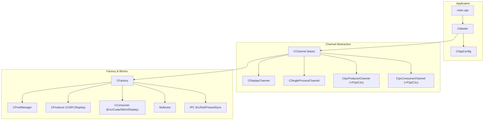
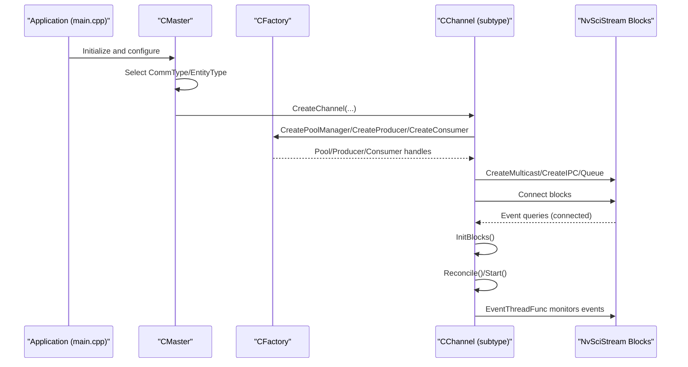
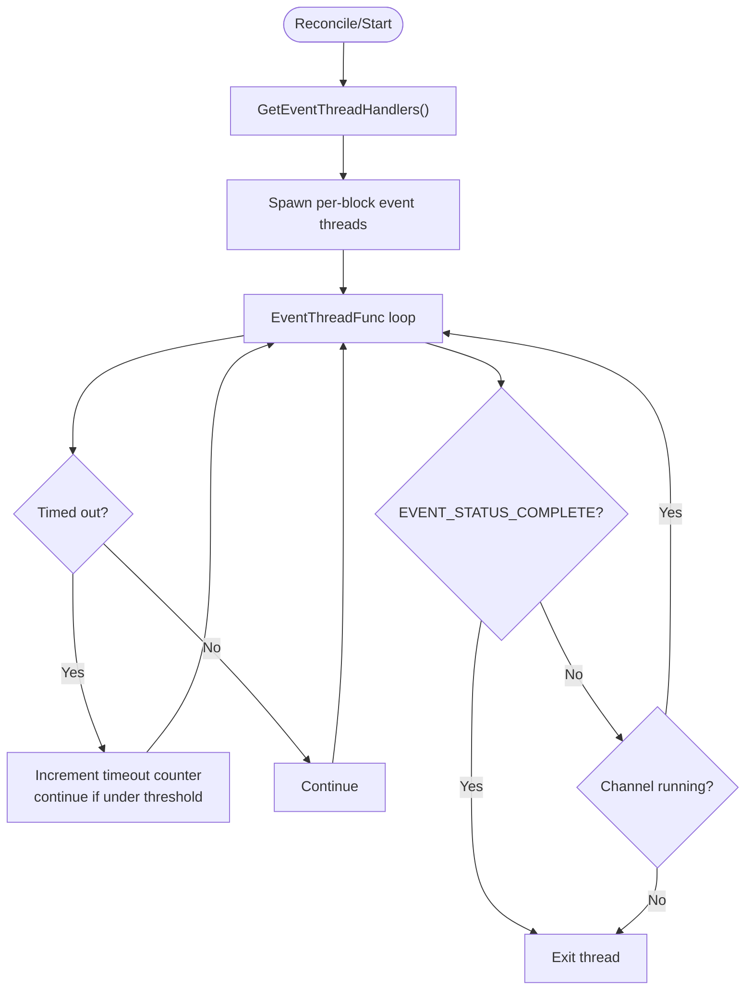
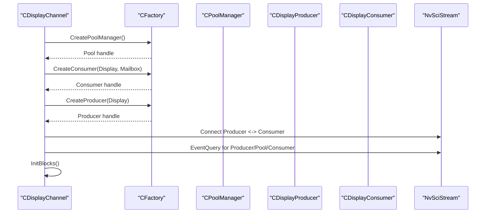
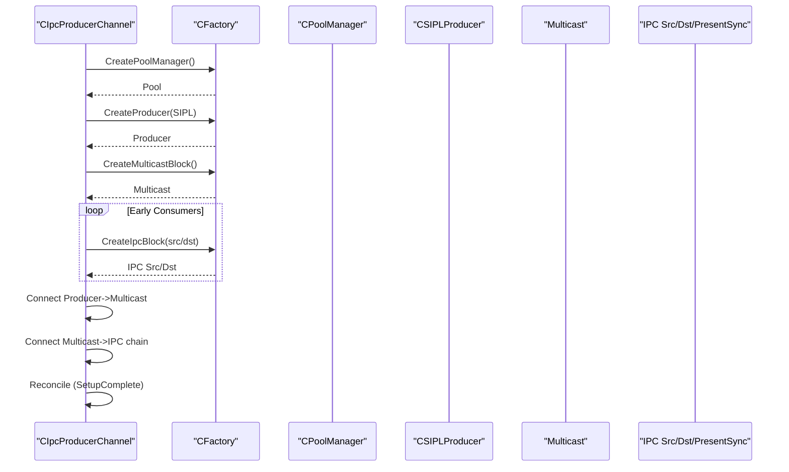
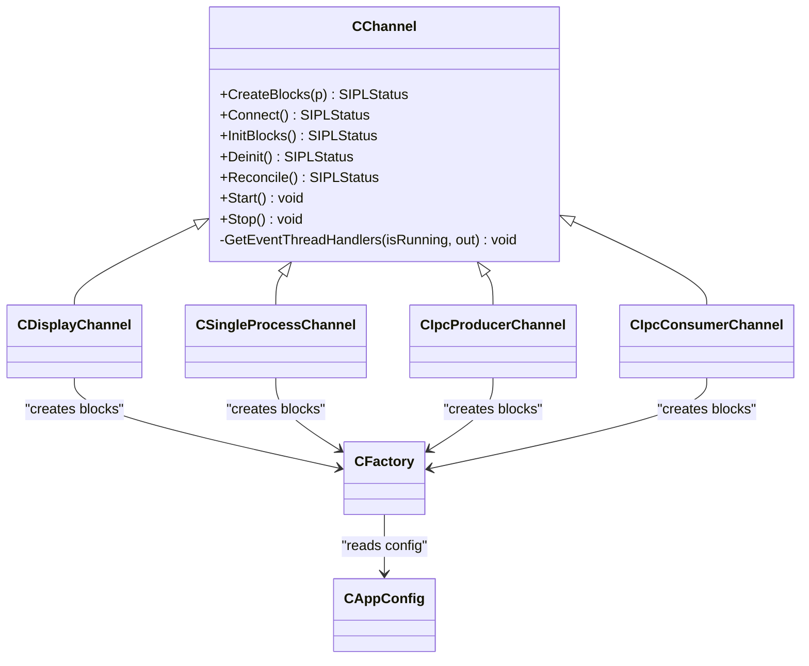

# Channel Architecture

<cite>
**Referenced Files in This Document**
- [CChannel.hpp](file://CChannel.hpp)
- [CDisplayChannel.hpp](file://CDisplayChannel.hpp)
- [CIpcConsumerChannel.hpp](file://CIpcConsumerChannel.hpp)
- [CIpcProducerChannel.hpp](file://CIpcProducerChannel.hpp)
- [CSingleProcessChannel.hpp](file://CSingleProcessChannel.hpp)
- [CFactory.hpp](file://CFactory.hpp)
- [CFactory.cpp](file://CFactory.cpp)
- [Common.hpp](file://Common.hpp)
- [CAppConfig.hpp](file://CAppConfig.hpp)
- [CAppConfig.cpp](file://CAppConfig.cpp)
- [CMaster.hpp](file://CMaster.hpp)
- [CMaster.cpp](file://CMaster.cpp)
- [main.cpp](file://main.cpp)
- [CPoolManager.cpp](file://CPoolManager.cpp)
- [CClientCommon.cpp](file://CClientCommon.cpp)
</cite>

## Table of Contents
1. [Introduction](#introduction)
2. [Project Structure](#project-structure)
3. [Core Components](#core-components)
4. [Architecture Overview](#architecture-overview)
5. [Detailed Component Analysis](#detailed-component-analysis)
6. [Dependency Analysis](#dependency-analysis)
7. [Performance Considerations](#performance-considerations)
8. [Troubleshooting Guide](#troubleshooting-guide)
9. [Conclusion](#conclusion)
10. [Appendices](#appendices)

## Introduction
This document explains the channel architecture used by the NVIDIA SIPL Multicast system. It focuses on the channel abstraction layer that unifies different communication modes (intra-process, inter-process peer-to-peer, inter-chip C2C, and display pipelines), and documents the lifecycle, resource allocation, and cleanup for each channel type. It also covers the factory-driven creation of channel components, synchronization via NvSciStream/NvSciSync, and integration with the producer-consumer framework.

## Project Structure
The channel system is centered around a base channel abstraction and several specialized channel implementations. A factory creates reusable building blocks (producers, consumers, pools, multicast, IPC blocks). Application configuration drives which channel type is instantiated and how resources are wired.

**Diagram sources**
- [main.cpp:253-304](file://main.cpp#L253-L304)
- [CMaster.hpp:47-92](file://CMaster.hpp#L47-L92)
- [CChannel.hpp:28-154](file://CChannel.hpp#L28-L154)
- [CDisplayChannel.hpp:19-223](file://CDisplayChannel.hpp#L19-L223)
- [CSingleProcessChannel.hpp:21-244](file://CSingleProcessChannel.hpp#L21-L244)
- [CIpcProducerChannel.hpp:20-379](file://CIpcProducerChannel.hpp#L20-L379)
- [CIpcConsumerChannel.hpp:19-148](file://CIpcConsumerChannel.hpp#L19-L148)
- [CFactory.hpp:27-92](file://CFactory.hpp#L27-L92)
- [CFactory.cpp:11-315](file://CFactory.cpp#L11-L315)

**Section sources**
- [main.cpp:253-304](file://main.cpp#L253-L304)
- [CMaster.hpp:47-92](file://CMaster.hpp#L47-L92)
- [CChannel.hpp:28-154](file://CChannel.hpp#L28-L154)

## Core Components
- CChannel: Base class defining the channel lifecycle (CreateBlocks, Connect, InitBlocks, Deinit, Reconcile, Start, Stop) and shared NvSci modules. It manages per-block event handlers and a thread-per-block event loop with timeout protection.
- CFactory: Singleton that constructs producers, consumers, pools, multicast blocks, queues, IPC blocks, and present syncs. It encapsulates element configuration for packet composition.
- Channel Types:
  - CDisplayChannel: Display pipeline with a display producer and a display consumer, plus a pool manager.
  - CSingleProcessChannel: Intra-process pipeline combining a SIPL producer and multiple consumers (CUDA, optional stitching, optional display, optional encoder).
  - CIpcProducerChannel and CIpcConsumerChannel: Inter-process and inter-chip pipelines with multicast, IPC blocks, and optional present syncs. Specializations include P2p and C2c variants.
- Configuration: CAppConfig controls communication type, entity type, queue type, consumer count/index, display modes, and platform-specific sensor info.

**Section sources**
- [CChannel.hpp:28-154](file://CChannel.hpp#L28-L154)
- [CFactory.hpp:27-92](file://CFactory.hpp#L27-L92)
- [CFactory.cpp:68-94](file://CFactory.cpp#L68-L94)
- [Common.hpp:35-86](file://Common.hpp#L35-L86)
- [CAppConfig.hpp:19-82](file://CAppConfig.hpp#L19-L82)
- [CAppConfig.cpp:77-108](file://CAppConfig.cpp#L77-L108)

## Architecture Overview
The channel architecture follows a layered design:
- Application entry initializes configuration and master controller.
- Master selects a channel type based on configuration and creates channel instances.
- Each channel composes building blocks via the factory and wires them into NvSciStream constructs (producer, pool, consumer(s), multicast, IPC).
- Event-driven threads monitor block events and coordinate startup and teardown.

**Diagram sources**
- [main.cpp:271-288](file://main.cpp#L271-L288)
- [CMaster.cpp:426-451](file://CMaster.cpp#L426-L451)
- [CChannel.hpp:55-109](file://CChannel.hpp#L55-L109)
- [CFactory.cpp:207-213](file://CFactory.cpp#L207-L213)

## Detailed Component Analysis

### CChannel Base Class
Responsibilities:
- Lifecycle orchestration: CreateBlocks, Connect, InitBlocks, Deinit, Reconcile, Start, Stop.
- Event thread management: One thread per event handler; guarded by a running flag and bounded timeouts.
- Shared resources: NvSciBufModule and NvSciSyncModule passed down to blocks.

Key behaviors:
- Reconcile starts event threads for event handlers returned by subclasses.
- Start/Stop manage thread lifecycle and graceful shutdown.
- EventThreadFunc runs a loop with timeout tracking and transitions on completion or errors.

**Diagram sources**
- [CChannel.hpp:55-140](file://CChannel.hpp#L55-L140)

**Section sources**
- [CChannel.hpp:28-154](file://CChannel.hpp#L28-L154)

### CDisplayChannel
Purpose: Display pipeline with a display producer and a display consumer, plus a pool manager. Supports mailbox queue for latest-buffer semantics.

Lifecycle:
- CreatePipeline builds pool, display consumer, and display producer via factory.
- Connect wires producer to consumer (directly or via multicast).
- InitBlocks initializes pool and blocks.
- Event handlers include pool, producer, and consumer.

Cleanup:
- Deletes pool, producer, consumer queue and handle, and multicast handle if present.

**Diagram sources**
- [CDisplayChannel.hpp:90-202](file://CDisplayChannel.hpp#L90-L202)

**Section sources**
- [CDisplayChannel.hpp:19-223](file://CDisplayChannel.hpp#L19-L223)

### CSingleProcessChannel
Purpose: Intra-process pipeline inside a single process. Composes a SIPL producer with multiple consumers: CUDA, optional stitching, optional display (via WFD controller), optional encoder.

Lifecycle:
- CreateBlocks: Builds pool, SIPL producer, and selected consumers based on configuration and sensor type.
- Connect: Producer connects to multicast; multicast connects to each consumer; queries for readiness.
- InitBlocks: Initializes pool and all clients.
- Event handlers include pool and all clients.

Integration:
- Uses configuration flags to enable stitching display or DP-MST display and conditionally adds consumers accordingly.

**Section sources**
- [CSingleProcessChannel.hpp:21-244](file://CSingleProcessChannel.hpp#L21-L244)

### CIpcProducerChannel and Variants (P2p/C2c)
Purpose: Inter-process (P2p) and inter-chip (C2c) producer channels with multicast and IPC blocks. Supports early and late consumer attachment.

Lifecycle:
- CreateBlocks: Creates pool, SIPL producer, multicast, and early consumer IPC blocks. Sends peer validation info for early consumers.
- Connect: Producer -> multicast; late consumer links chained; sets multicast setup status; queries all blocks.
- Reconcile: Waits for multicast SetupComplete.
- Late attach/detach: Dynamically create/destroy IPC blocks and reconnect to multicast; re-query to streaming.

P2pProducerChannel:
- Uses standard IPC source blocks per consumer.

C2cProducerChannel:
- Adds queue and present sync blocks per consumer; supports mailbox queue with present sync.

**Diagram sources**
- [CIpcProducerChannel.hpp:88-184](file://CIpcProducerChannel.hpp#L88-L184)
- [CIpcProducerChannel.hpp:205-272](file://CIpcProducerChannel.hpp#L205-L272)
- [CIpcProducerChannel.hpp:304-379](file://CIpcProducerChannel.hpp#L304-L379)

**Section sources**
- [CIpcProducerChannel.hpp:20-379](file://CIpcProducerChannel.hpp#L20-L379)

### CIpcConsumerChannel and Variants (P2p/C2c)
Purpose: Inter-process and inter-chip consumer channels. Creates destination IPC block and consumer, validates peers, and connects to the stream.

Lifecycle:
- CreateBlocks: Creates consumer and destination IPC block/endpoint; optionally creates pool for C2c.
- Connect: Connects dst IPC to consumer; queries queue and consumer readiness; validates peer info.
- InitBlocks: Initializes consumer.

P2pConsumerChannel:
- Computes destination channel ID based on sensor/consumer indices.

C2cConsumerChannel:
- Creates a pool manager and uses C2C destination creation with element skipping based on consumer needs.

**Section sources**
- [CIpcConsumerChannel.hpp:19-148](file://CIpcConsumerChannel.hpp#L19-L148)
- [CIpcConsumerChannel.hpp:150-261](file://CIpcConsumerChannel.hpp#L150-L261)

### Channel Factory Pattern
CFactory centralizes construction of:
- Pools: Static pool with configurable packet count.
- Producers: CSIPL or Display producer with element configuration.
- Consumers: Enc, Cuda, Stitch, Display with queue selection and element configuration.
- Multicast: Creates multicast block sized for configured consumer count.
- Queues: Mailbox or FIFO queues.
- IPC: IPC source/destination blocks and endpoints; C2C variants with queue/pool handles.
- Present sync: Per-consumer present sync for C2c.

Element configuration:
- Elements are composed per producer/consumer type and sensor type, enabling selective usage and sibling relationships.

**Section sources**
- [CFactory.hpp:27-92](file://CFactory.hpp#L27-L92)
- [CFactory.cpp:11-315](file://CFactory.cpp#L11-L315)
- [Common.hpp:68-86](file://Common.hpp#L68-L86)

### Communication Protocols, Data Flow, and Synchronization
- NvSciStream constructs:
  - Producer: Produces packets into a pool.
  - Pool: Pre-allocates packets/buffers; signals readiness.
  - Consumer: Consumes packets from queues; maps buffers for processing.
  - Multicast: Fan-out to multiple consumers.
  - IPC: Peer-to-peer or PCIe-based inter-chip links.
  - Present sync: Frame-synchronized presentation for C2c.
- Synchronization:
  - Event queries ensure connectivity and readiness.
  - Present sync aligns frame boundaries for display.
  - Late attach manipulates multicast setup status to safely add/remove consumers.
- Data flow:
  - Producer posts frames to pool; consumers dequeue and process; display consumer renders.

**Section sources**
- [CFactory.cpp:207-213](file://CFactory.cpp#L207-L213)
- [CIpcProducerChannel.hpp:133-184](file://CIpcProducerChannel.hpp#L133-L184)
- [CIpcConsumerChannel.hpp:85-118](file://CIpcConsumerChannel.hpp#L85-L118)
- [CSingleProcessChannel.hpp:161-209](file://CSingleProcessChannel.hpp#L161-L209)
- [CDisplayChannel.hpp:134-184](file://CDisplayChannel.hpp#L134-L184)

### Channel Lifecycle Management, Resource Allocation, and Cleanup
- Creation:
  - Channels call factory methods to build pool, producer/consumer, multicast, and IPC blocks.
  - Element lists are set per block to define packet composition.
- Connection:
  - Connect methods wire blocks and query readiness; failures abort with cleanup.
- Initialization:
  - InitBlocks invokes Init on pool and all blocks.
- Streaming:
  - Start spawns event threads; Stop joins threads and resets state.
- Cleanup:
  - Destructor deletes all block handles and endpoints; factory releases IPC endpoints.

**Section sources**
- [CChannel.hpp:55-109](file://CChannel.hpp#L55-L109)
- [CSingleProcessChannel.hpp:39-63](file://CSingleProcessChannel.hpp#L39-L63)
- [CIpcProducerChannel.hpp:35-56](file://CIpcProducerChannel.hpp#L35-L56)
- [CIpcConsumerChannel.hpp:32-52](file://CIpcConsumerChannel.hpp#L32-L52)
- [CDisplayChannel.hpp:42-70](file://CDisplayChannel.hpp#L42-L70)

### Dynamic Channel Creation Based on Configuration
- Selection logic:
  - CommType determines channel family (IntraProcess, InterProcess, InterChip).
  - EntityType further selects producer vs consumer specialization.
- Integration points:
  - Master orchestrates channel creation and display channel wiring.
  - Late attach/detach supported for IPC producers.

**Section sources**
- [CMaster.cpp:426-451](file://CMaster.cpp#L426-L451)
- [CMaster.cpp:473-513](file://CMaster.cpp#L473-L513)
- [Common.hpp:35-40](file://Common.hpp#L35-L40)

## Dependency Analysis

**Diagram sources**
- [CChannel.hpp:28-154](file://CChannel.hpp#L28-L154)
- [CDisplayChannel.hpp:19-223](file://CDisplayChannel.hpp#L19-L223)
- [CSingleProcessChannel.hpp:21-244](file://CSingleProcessChannel.hpp#L21-L244)
- [CIpcProducerChannel.hpp:20-379](file://CIpcProducerChannel.hpp#L20-L379)
- [CIpcConsumerChannel.hpp:19-148](file://CIpcConsumerChannel.hpp#L19-L148)
- [CFactory.hpp:27-92](file://CFactory.hpp#L27-L92)
- [CAppConfig.hpp:19-82](file://CAppConfig.hpp#L19-L82)

**Section sources**
- [CChannel.hpp:28-154](file://CChannel.hpp#L28-L154)
- [CFactory.hpp:27-92](file://CFactory.hpp#L27-L92)

## Performance Considerations
- Packet sizing and pool preallocation reduce runtime allocation overhead.
- Mailbox queues ensure latest-frame delivery for display consumers; FIFO queues offer throughput for encoders/CUDA.
- Late attach minimizes startup time by deferring consumer attachment until multicast is ready.
- Event-driven loops with bounded timeouts prevent stalls; excessive timeouts log warnings.
- Element skipping in C2c reduces unnecessary buffer allocations for unused streams.

[No sources needed since this section provides general guidance]

## Troubleshooting Guide
Common issues and diagnostics:
- Connection failures:
  - Verify NvSciStreamBlockEventQuery results for producer, pool, consumer, queue, and multicast.
  - Check IPC endpoint open/close and block creation status.
- Late attach failures:
  - Ensure multicast setup status is complete before attaching late consumers.
  - On failure, delete late blocks and reset state.
- Timeout warnings:
  - Excessive EVENT_STATUS_TIMED_OUT indicates stalled event handlers; inspect block health and thread scheduling.
- Element mismatches:
  - Confirm element lists match sensor type and consumer requirements; verify sibling relationships for multi-element streams.

**Section sources**
- [CIpcProducerChannel.hpp:186-203](file://CIpcProducerChannel.hpp#L186-L203)
- [CIpcProducerChannel.hpp:205-272](file://CIpcProducerChannel.hpp#L205-L272)
- [CIpcConsumerChannel.hpp:85-118](file://CIpcConsumerChannel.hpp#L85-L118)
- [CChannel.hpp:120-140](file://CChannel.hpp#L120-L140)
- [CFactory.cpp:207-213](file://CFactory.cpp#L207-L213)

## Conclusion
The channel architecture provides a unified abstraction for diverse communication modes while leveraging NvSciStream for efficient, synchronized data movement. The factory pattern simplifies component creation and configuration, and the event-driven channel lifecycle ensures robust startup, streaming, and teardown. Late attach capabilities further improve scalability and operational flexibility.

[No sources needed since this section summarizes without analyzing specific files]

## Appendices

### Channel Configuration Examples
- Intra-process:
  - Enable intra-process mode via configuration; channel composes a SIPL producer and multiple consumers within a single process.
- Inter-process (P2p):
  - Configure as producer or consumer; channel creates IPC source/destination blocks and connects to multicast.
- Inter-chip (C2c):
  - Configure as producer or consumer; channel adds queue and present sync per consumer; supports mailbox queue and element skipping.
- Display:
  - Enable stitching or DP-MST display; channel wires a display producer and consumer with mailbox queue for latest-frame semantics.

**Section sources**
- [CAppConfig.hpp:30-46](file://CAppConfig.hpp#L30-L46)
- [Common.hpp:35-40](file://Common.hpp#L35-L40)
- [CSingleProcessChannel.hpp:118-144](file://CSingleProcessChannel.hpp#L118-L144)
- [CIpcProducerChannel.hpp:381-409](file://CIpcProducerChannel.hpp#L381-L409)
- [CIpcConsumerChannel.hpp:150-182](file://CIpcConsumerChannel.hpp#L150-L182)
- [CDisplayChannel.hpp:103-121](file://CDisplayChannel.hpp#L103-L121)

### Integration with Producer-Consumer Framework
- Producer posting:
  - SIPL producer posts frames to the pool; consumer dequeues and processes.
- Buffer mapping:
  - Consumers map buffers per element type; metadata and data buffers handled separately.
- Pool management:
  - Pool pre-creates packets and inserts buffers; notifies setup completion.

**Section sources**
- [CSingleProcessChannel.hpp:74-85](file://CSingleProcessChannel.hpp#L74-L85)
- [CClientCommon.cpp:427-460](file://CClientCommon.cpp#L427-L460)
- [CPoolManager.cpp:269-321](file://CPoolManager.cpp#L269-L321)