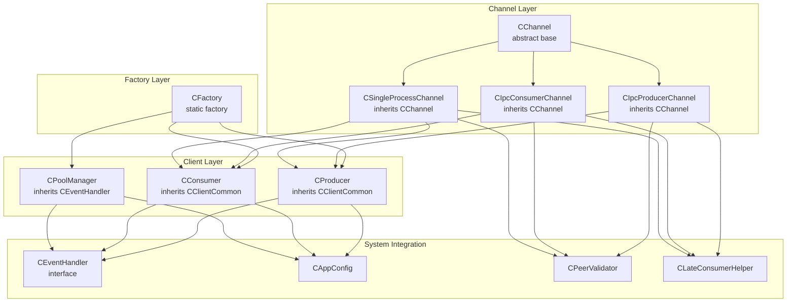
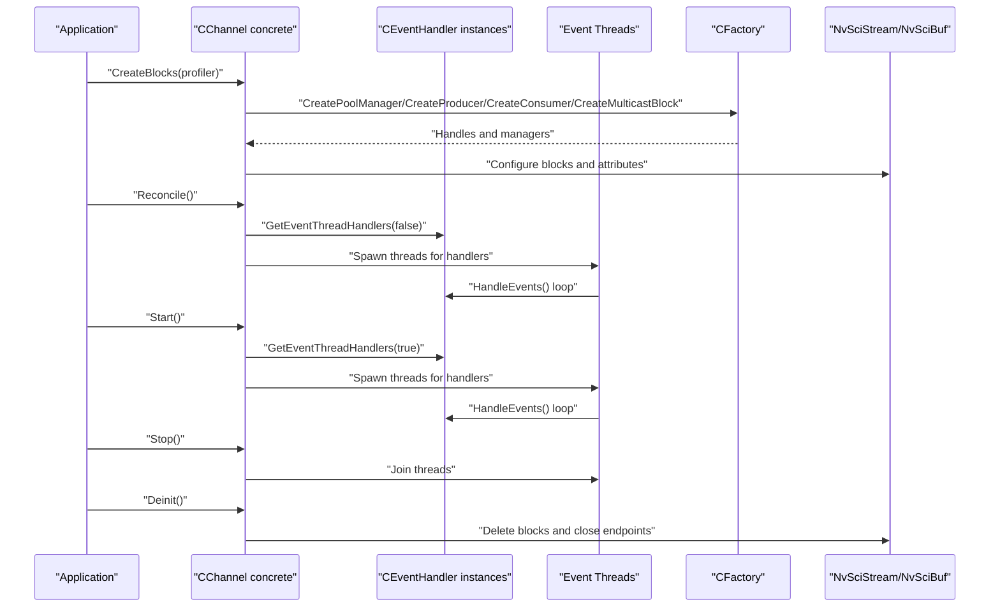
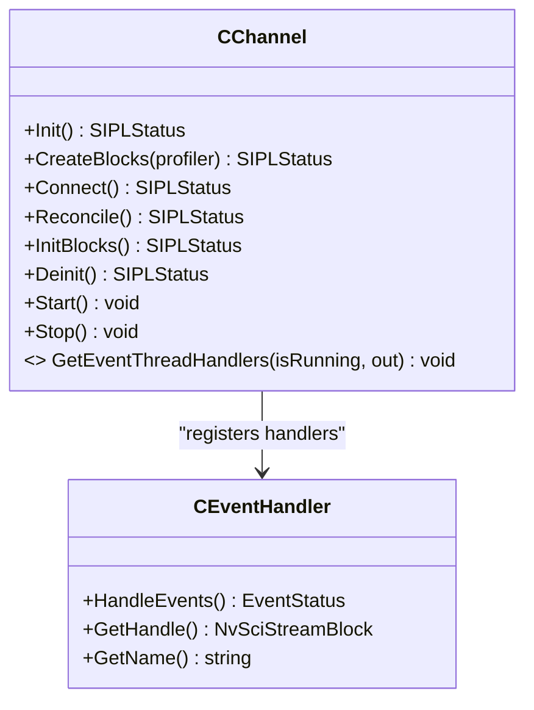
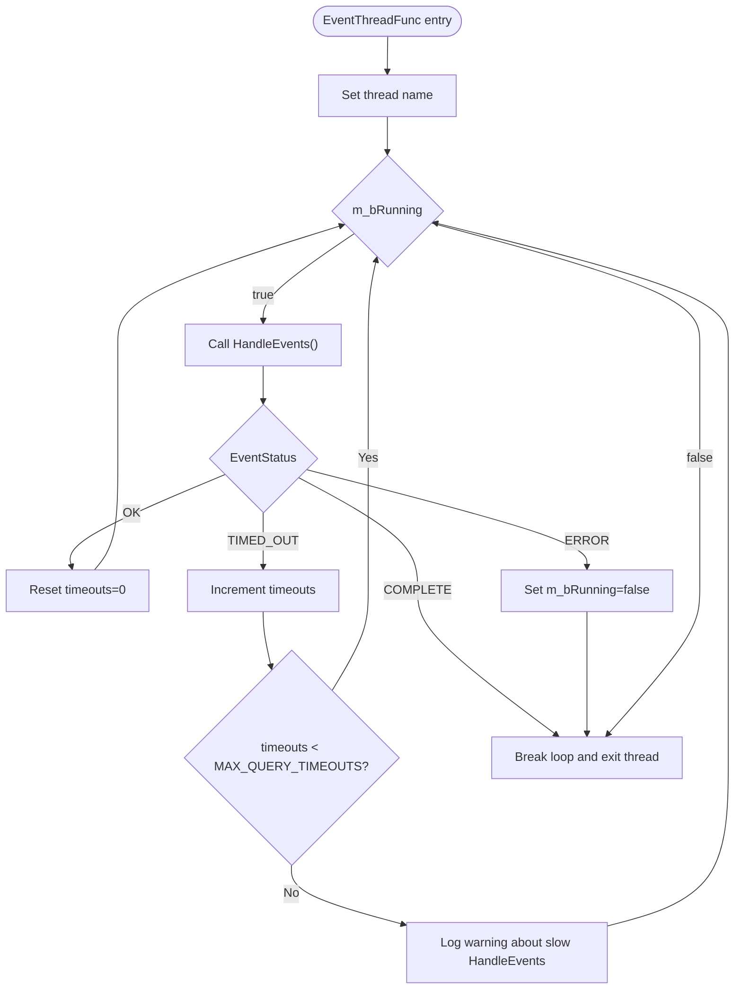
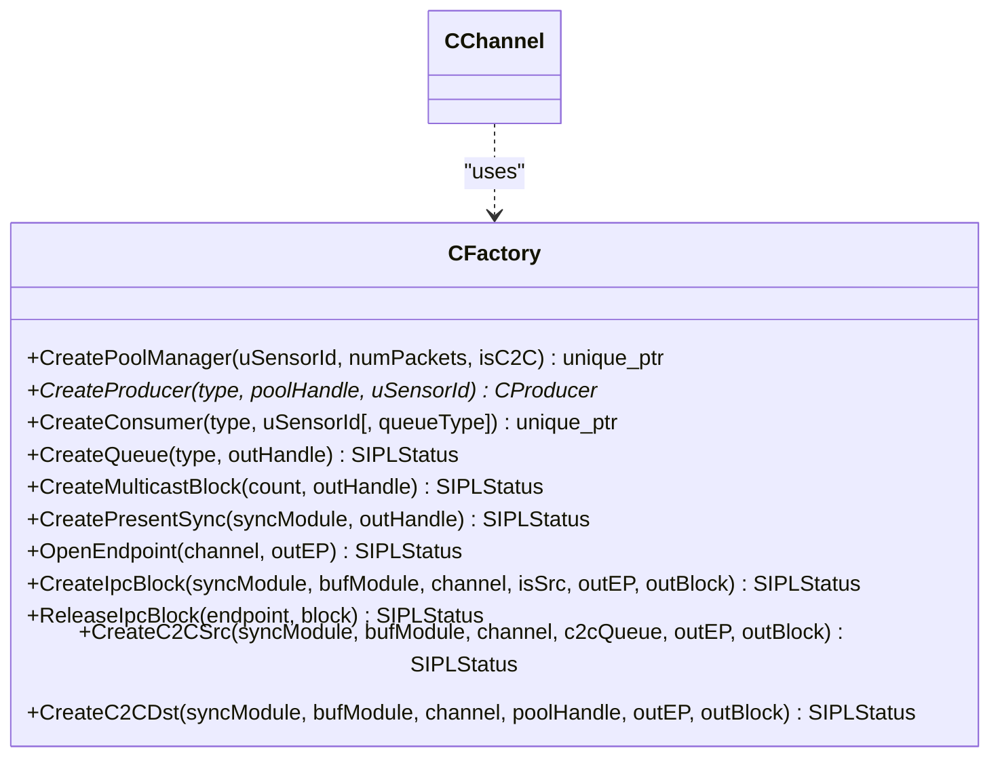
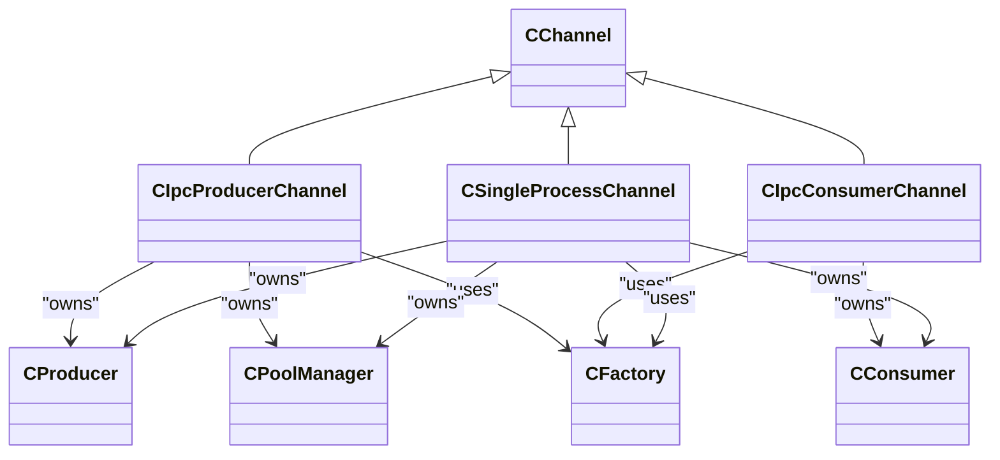
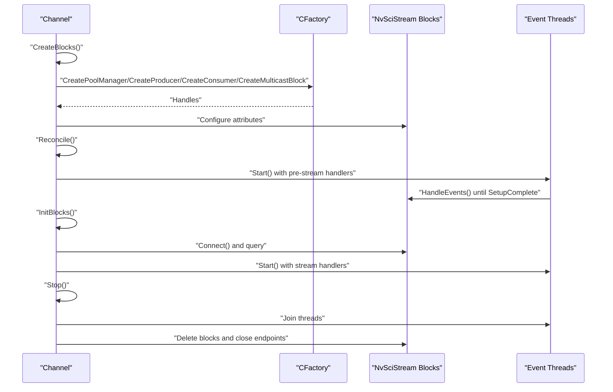
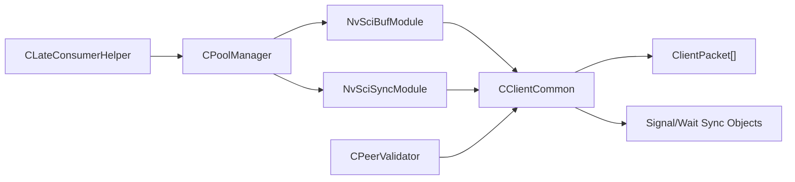
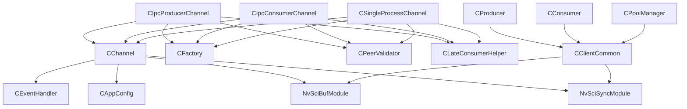

# Channel Management Overview

<cite>
**Referenced Files in This Document**
- [CChannel.hpp](file://CChannel.hpp)
- [CEventHandler.hpp](file://CEventHandler.hpp)
- [CFactory.hpp](file://CFactory.hpp)
- [CFactory.cpp](file://CFactory.cpp)
- [Common.hpp](file://Common.hpp)
- [CIpcProducerChannel.hpp](file://CIpcProducerChannel.hpp)
- [CIpcConsumerChannel.hpp](file://CIpcConsumerChannel.hpp)
- [CSingleProcessChannel.hpp](file://CSingleProcessChannel.hpp)
- [CClientCommon.hpp](file://CClientCommon.hpp)
- [CProducer.hpp](file://CProducer.hpp)
- [CConsumer.hpp](file://CConsumer.hpp)
- [CPoolManager.hpp](file://CPoolManager.hpp)
- [CPeerValidator.hpp](file://CPeerValidator.hpp)
- [CLateConsumerHelper.hpp](file://CLateConsumerHelper.hpp)
- [CAppConfig.hpp](file://CAppConfig.hpp)
</cite>

## Table of Contents
1. [Introduction](#introduction)
2. [Project Structure](#project-structure)
3. [Core Components](#core-components)
4. [Architecture Overview](#architecture-overview)
5. [Detailed Component Analysis](#detailed-component-analysis)
6. [Dependency Analysis](#dependency-analysis)
7. [Performance Considerations](#performance-considerations)
8. [Troubleshooting Guide](#troubleshooting-guide)
9. [Conclusion](#conclusion)
10. [Appendices](#appendices)

## Introduction
This document explains the channel management system in the NVIDIA SIPL Multicast framework. It focuses on the abstract CChannel base class and its role as the foundation for all communication channels. The document covers the channel lifecycle (initialization, reconciliation, connection, and cleanup), the event-driven architecture with thread management and asynchronous processing, the polymorphic channel abstraction enabling different communication modes, the relationship to the factory pattern, resource management and synchronization via NvSciBuf/NvSciSync, and error handling strategies. Practical examples describe channel creation, configuration, and integration with the producer-consumer framework.

## Project Structure
The channel subsystem centers around an abstract base class CChannel and several concrete channel implementations that encapsulate producer/consumer pipelines and inter-process or inter-chip connectivity. A factory class CFactory orchestrates block creation and wiring using NvSciStream and NvSciBuf APIs. Supporting components include event handlers, configuration, peer validation, and pool management.

**Diagram sources**
- [CChannel.hpp:28-154](file://CChannel.hpp#L28-L154)
- [CIpcProducerChannel.hpp:20-379](file://CIpcProducerChannel.hpp#L20-L379)
- [CIpcConsumerChannel.hpp:19-148](file://CIpcConsumerChannel.hpp#L19-L148)
- [CSingleProcessChannel.hpp:21-244](file://CSingleProcessChannel.hpp#L21-L244)
- [CFactory.hpp:27-92](file://CFactory.hpp#L27-L92)
- [CProducer.hpp:16-51](file://CProducer.hpp#L16-L51)
- [CConsumer.hpp:16-43](file://CConsumer.hpp#L16-L43)
- [CPoolManager.hpp:33-68](file://CPoolManager.hpp#L33-L68)
- [CEventHandler.hpp:23-51](file://CEventHandler.hpp#L23-L51)
- [CAppConfig.hpp:19-80](file://CAppConfig.hpp#L19-L80)
- [CPeerValidator.hpp:21-61](file://CPeerValidator.hpp#L21-L61)
- [CLateConsumerHelper.hpp:15-35](file://CLateConsumerHelper.hpp#L15-L35)

**Section sources**
- [CChannel.hpp:28-154](file://CChannel.hpp#L28-L154)
- [CFactory.hpp:27-92](file://CFactory.hpp#L27-L92)
- [Common.hpp:35-86](file://Common.hpp#L35-L86)

## Core Components
- CChannel: Abstract base class defining the channel lifecycle and event-driven thread orchestration. It exposes CreateBlocks, Connect, InitBlocks, Deinit, and Reconcile hooks, and manages a set of threads that process event handlers registered by concrete channels.
- CEventHandler: Interface for event-driven processing with a HandleEvents method returning an EventStatus enumeration and a typed handle for NvSciStream blocks.
- CFactory: Static factory providing creation of producers, consumers, queues, multicast blocks, IPC blocks, and presentation syncs, plus endpoint management for inter-process and inter-chip scenarios.
- CClientCommon: Base for producer/consumer clients implementing event handling, buffer/sync attribute setup, payload processing, and cookie-based packet management.
- CProducer/CConsumer: Specializations of CClientCommon for producer and consumer roles, including post semantics and payload processing callbacks.
- CPoolManager: Manages packet pools, reconciles element attributes, and handles buffer lifecycle for producers/consumers.
- CAppConfig: Central configuration controlling communication type, entity type, consumer type, queue type, and runtime flags.
- CPeerValidator: Validates peer configuration and synchronization across channel boundaries.
- CLateConsumerHelper: Supplies buffer/sync attribute lists and counts for late-attached consumers.

**Section sources**
- [CChannel.hpp:28-154](file://CChannel.hpp#L28-L154)
- [CEventHandler.hpp:15-51](file://CEventHandler.hpp#L15-L51)
- [CFactory.hpp:27-92](file://CFactory.hpp#L27-L92)
- [CClientCommon.hpp:47-199](file://CClientCommon.hpp#L47-L199)
- [CProducer.hpp:16-51](file://CProducer.hpp#L16-L51)
- [CConsumer.hpp:16-43](file://CConsumer.hpp#L16-L43)
- [CPoolManager.hpp:33-68](file://CPoolManager.hpp#L33-L68)
- [CAppConfig.hpp:19-80](file://CAppConfig.hpp#L19-L80)
- [CPeerValidator.hpp:21-61](file://CPeerValidator.hpp#L21-L61)
- [CLateConsumerHelper.hpp:15-35](file://CLateConsumerHelper.hpp#L15-L35)

## Architecture Overview
The channel architecture is built on an event-driven model with dedicated threads per event handler. Channels encapsulate pipeline stages (producer, pool manager, consumer(s), IPC blocks, multicast), and the factory composes these stages into coherent streams. Synchronization is handled by NvSciBuf and NvSciSync modules passed into channel constructors.

**Diagram sources**
- [CChannel.hpp:55-140](file://CChannel.hpp#L55-L140)
- [CFactory.cpp:11-315](file://CFactory.cpp#L11-L315)
- [CIpcProducerChannel.hpp:88-131](file://CIpcProducerChannel.hpp#L88-L131)
- [CIpcConsumerChannel.hpp:63-83](file://CIpcConsumerChannel.hpp#L63-L83)
- [CSingleProcessChannel.hpp:87-159](file://CSingleProcessChannel.hpp#L87-L159)

## Detailed Component Analysis

### CChannel: Abstract Base and Lifecycle
- Lifecycle methods:
  - Init: Optional hook returning success by default.
  - CreateBlocks: Construct pipeline components (e.g., pool, producer/consumer, multicast, IPC).
  - Connect: Wire blocks together and wait for SetupComplete or streaming readiness.
  - Reconcile: Start event threads for pre-stream initialization and validate readiness.
  - InitBlocks: Initialize stage-specific resources (e.g., pool init, producer init).
  - Deinit: Tear down stage-specific resources.
- Event-driven threading:
  - Start/Stop spawn/join threads for event handlers.
  - EventThreadFunc runs each handler’s HandleEvents in a loop with timeout tracking and termination conditions.
- Protected interface:
  - GetEventThreadHandlers: Implemented by derived channels to register handlers for pre-stream and stream-running phases.

**Diagram sources**
- [CChannel.hpp:28-154](file://CChannel.hpp#L28-L154)
- [CEventHandler.hpp:23-51](file://CEventHandler.hpp#L23-L51)

**Section sources**
- [CChannel.hpp:50-140](file://CChannel.hpp#L50-L140)

### Event Handler Abstraction and Asynchronous Processing
- CEventHandler defines the contract for event-driven processing with a typed handle and a name.
- CClientCommon extends CEventHandler to implement producer/consumer event loops, including initialization, setup completion, and payload handling.
- Thread orchestration:
  - CChannel::Start/Stop manage per-handler threads.
  - EventThreadFunc enforces a bounded timeout window for HandleEvents and transitions on completion or error.

**Diagram sources**
- [CChannel.hpp:112-140](file://CChannel.hpp#L112-L140)
- [CEventHandler.hpp:15-21](file://CEventHandler.hpp#L15-L21)

**Section sources**
- [CEventHandler.hpp:15-51](file://CEventHandler.hpp#L15-L51)
- [CClientCommon.hpp:47-199](file://CClientCommon.hpp#L47-L199)

### Factory Pattern Implementation and Resource Management
- CFactory provides static creation methods for:
  - Pool manager, producer, consumer, queue, multicast, present sync, and IPC blocks.
  - Endpoint open/close helpers and C2C variants.
- Factory composes channel pipelines by constructing the appropriate NvSciStream blocks and wiring them according to configuration.
- Resource management:
  - Blocks are created with NvSciStream*Create functions and deleted via NvSciStreamBlockDelete during teardown.
  - Endpoints are opened/closed safely using NvSciIpc* functions.

**Diagram sources**
- [CFactory.hpp:27-92](file://CFactory.hpp#L27-L92)
- [CFactory.cpp:11-315](file://CFactory.cpp#L11-L315)

**Section sources**
- [CFactory.hpp:27-92](file://CFactory.hpp#L27-L92)
- [CFactory.cpp:11-315](file://CFactory.cpp#L11-L315)

### Polymorphic Channel Abstractions
- CIpcProducerChannel: Producer-side IPC channel supporting early and late consumer attachment, multicast, and IPC source blocks. Supports peer validation and late consumer helper integration.
- CIpcConsumerChannel: Consumer-side IPC channel with IPC destination blocks and peer validation.
- CSingleProcessChannel: Single-process channel composing a producer and multiple consumers behind a multicast block, with optional display stitching and WFD controller integration.

**Diagram sources**
- [CIpcProducerChannel.hpp:20-379](file://CIpcProducerChannel.hpp#L20-L379)
- [CIpcConsumerChannel.hpp:19-148](file://CIpcConsumerChannel.hpp#L19-L148)
- [CSingleProcessChannel.hpp:21-244](file://CSingleProcessChannel.hpp#L21-L244)
- [CProducer.hpp:16-51](file://CProducer.hpp#L16-L51)
- [CConsumer.hpp:16-43](file://CConsumer.hpp#L16-L43)
- [CPoolManager.hpp:33-68](file://CPoolManager.hpp#L33-L68)
- [CFactory.hpp:27-92](file://CFactory.hpp#L27-L92)

**Section sources**
- [CIpcProducerChannel.hpp:20-379](file://CIpcProducerChannel.hpp#L20-L379)
- [CIpcConsumerChannel.hpp:19-148](file://CIpcConsumerChannel.hpp#L19-L148)
- [CSingleProcessChannel.hpp:21-244](file://CSingleProcessChannel.hpp#L21-L244)

### Channel Lifecycle: Initialization, Reconciliation, Connection, Cleanup
- Initialization:
  - CreateBlocks constructs pool, producer/consumer, multicast, and IPC blocks via the factory.
  - InitBlocks initializes pool and client components.
- Reconciliation:
  - Spawns event threads for pre-stream tasks and waits for SetupComplete or readiness signals.
- Connection:
  - Connect wires blocks using NvSciStreamBlockConnect and queries event status until streaming-ready.
- Cleanup:
  - Stop joins threads, Deinit tears down client components, and destructors delete blocks and close endpoints.

**Diagram sources**
- [CChannel.hpp:55-109](file://CChannel.hpp#L55-L109)
- [CIpcProducerChannel.hpp:88-184](file://CIpcProducerChannel.hpp#L88-L184)
- [CIpcConsumerChannel.hpp:63-118](file://CIpcConsumerChannel.hpp#L63-L118)
- [CSingleProcessChannel.hpp:87-209](file://CSingleProcessChannel.hpp#L87-L209)

**Section sources**
- [CChannel.hpp:55-109](file://CChannel.hpp#L55-L109)
- [CIpcProducerChannel.hpp:88-184](file://CIpcProducerChannel.hpp#L88-L184)
- [CIpcConsumerChannel.hpp:63-118](file://CIpcConsumerChannel.hpp#L63-L118)
- [CSingleProcessChannel.hpp:87-209](file://CSingleProcessChannel.hpp#L87-L209)

### Synchronization and Resource Management with NvSciBuf/NvSciSync
- Buffer and sync modules are injected into channel constructors and passed to client components for attribute reconciliation and fence/signaling.
- CClientCommon manages buffer/sync attribute lists, packet cookies, and payload mapping.
- CPoolManager reconciles element attributes and buffers for packet pools, supporting late consumer scenarios via CLateConsumerHelper.
- CPeerValidator ensures peer configuration compatibility across channel boundaries.

**Diagram sources**
- [CChannel.hpp:32-43](file://CChannel.hpp#L32-L43)
- [CClientCommon.hpp:164-199](file://CClientCommon.hpp#L164-L199)
- [CPoolManager.hpp:33-68](file://CPoolManager.hpp#L33-L68)
- [CLateConsumerHelper.hpp:15-35](file://CLateConsumerHelper.hpp#L15-L35)
- [CPeerValidator.hpp:21-61](file://CPeerValidator.hpp#L21-L61)

**Section sources**
- [CClientCommon.hpp:164-199](file://CClientCommon.hpp#L164-L199)
- [CPoolManager.hpp:33-68](file://CPoolManager.hpp#L33-L68)
- [CLateConsumerHelper.hpp:15-35](file://CLateConsumerHelper.hpp#L15-L35)
- [CPeerValidator.hpp:21-61](file://CPeerValidator.hpp#L21-L61)

### Examples: Channel Creation, Configuration, and Producer-Consumer Integration
- Creating a single-process channel:
  - Construct CSingleProcessChannel with buffer/sync modules, camera, display producer, and WFD controller.
  - Call CreateBlocks to build pool, producer, and consumers; Connect to wire blocks; Start to launch event threads.
- Creating an IPC producer channel:
  - Construct CIpcProducerChannel with buffer/sync modules, sensor info, app config, and camera.
  - Use factory to create pool, producer, multicast, and IPC source blocks; Connect and reconcile; support late consumer attachment if enabled.
- Creating an IPC consumer channel:
  - Construct CIpcConsumerChannel with buffer/sync modules, sensor info, and app config.
  - Use factory to create consumer and IPC destination; Connect and reconcile; validate peer if needed.

Integration with producer-consumer:
- Producers post frames to the stream; consumers dequeue and process payloads.
- Multicast distributes frames to multiple consumers; pool manager coordinates buffer lifecycles.
- Presentation syncs (when applicable) coordinate display timing.

**Section sources**
- [CSingleProcessChannel.hpp:21-244](file://CSingleProcessChannel.hpp#L21-L244)
- [CIpcProducerChannel.hpp:20-379](file://CIpcProducerChannel.hpp#L20-L379)
- [CIpcConsumerChannel.hpp:19-148](file://CIpcConsumerChannel.hpp#L19-L148)
- [CFactory.cpp:68-205](file://CFactory.cpp#L68-L205)

## Dependency Analysis
- CChannel depends on:
  - CEventHandler for event-driven processing.
  - CAppConfig for runtime configuration.
  - NvSciBuf/NvSciSync modules for resource management.
- Concrete channels depend on:
  - CFactory for block creation and wiring.
  - CPeerValidator for peer validation.
  - CLateConsumerHelper for late consumer support.
- Client components (CProducer/CConsumer/CPoolManager) depend on:
  - CClientCommon for event loop and buffer/sync management.
  - NvSciStream/NvSciBuf/NvSciSync for synchronization and buffer allocation.

**Diagram sources**
- [CChannel.hpp:28-154](file://CChannel.hpp#L28-L154)
- [CIpcProducerChannel.hpp:20-379](file://CIpcProducerChannel.hpp#L20-L379)
- [CIpcConsumerChannel.hpp:19-148](file://CIpcConsumerChannel.hpp#L19-L148)
- [CSingleProcessChannel.hpp:21-244](file://CSingleProcessChannel.hpp#L21-L244)
- [CFactory.hpp:27-92](file://CFactory.hpp#L27-L92)
- [CClientCommon.hpp:47-199](file://CClientCommon.hpp#L47-L199)
- [CPeerValidator.hpp:21-61](file://CPeerValidator.hpp#L21-L61)
- [CLateConsumerHelper.hpp:15-35](file://CLateConsumerHelper.hpp#L15-L35)

**Section sources**
- [CChannel.hpp:28-154](file://CChannel.hpp#L28-L154)
- [CIpcProducerChannel.hpp:20-379](file://CIpcProducerChannel.hpp#L20-L379)
- [CIpcConsumerChannel.hpp:19-148](file://CIpcConsumerChannel.hpp#L19-L148)
- [CSingleProcessChannel.hpp:21-244](file://CSingleProcessChannel.hpp#L21-L244)
- [CFactory.hpp:27-92](file://CFactory.hpp#L27-L92)
- [CClientCommon.hpp:47-199](file://CClientCommon.hpp#L47-L199)
- [CPeerValidator.hpp:21-61](file://CPeerValidator.hpp#L21-L61)
- [CLateConsumerHelper.hpp:15-35](file://CLateConsumerHelper.hpp#L15-L35)

## Performance Considerations
- Event loop timeouts: The event thread loop tracks repeated timeouts and logs warnings after a threshold to detect stalled handlers.
- Query blocking: Connection routines use indefinite blocking queries until SetupComplete or streaming-ready; configure queue types appropriately to balance latency and throughput.
- Late consumer attachment: Minimizes initial connection overhead by deferring late consumers until multicast is ready.
- Buffer/sync attribute reconciliation: Efficiently sets up only used packet elements to reduce overhead.

[No sources needed since this section provides general guidance]

## Troubleshooting Guide
- Event handler stalls:
  - Symptoms: Repeated timeout warnings in event thread loop.
  - Actions: Verify handler logic, reduce work per cycle, check for deadlocks, and ensure proper signaling.
- Connection failures:
  - Symptoms: SetupComplete not reached or event queries failing.
  - Actions: Confirm block connectivity via NvSciStreamBlockConnect, validate queue types, and ensure endpoints are opened/closed correctly.
- Late consumer attachment:
  - Symptoms: Late consumer attach/detach fails or hangs.
  - Actions: Ensure multicast status is set to Setup_Connect before attaching; verify late consumer helper configuration and cleanup on failure.
- Resource leaks:
  - Symptoms: Handles not released or endpoints left open.
  - Actions: Ensure destructors call NvSciStreamBlockDelete and endpoint close functions; use factory-release helpers for IPC blocks.

**Section sources**
- [CChannel.hpp:112-140](file://CChannel.hpp#L112-L140)
- [CIpcProducerChannel.hpp:186-272](file://CIpcProducerChannel.hpp#L186-L272)
- [CIpcConsumerChannel.hpp:85-118](file://CIpcConsumerChannel.hpp#L85-L118)
- [CFactory.cpp:265-274](file://CFactory.cpp#L265-L274)

## Conclusion
The channel management system in the NVIDIA SIPL Multicast framework leverages an abstract CChannel base class to unify diverse communication modes (intra-process, inter-process, inter-chip) under a consistent lifecycle and event-driven model. The CFactory composes pipeline components using NvSciStream and NvSciBuf/NvSciSync for robust synchronization. Concrete channels encapsulate producer/consumer pipelines, peer validation, and late consumer support, enabling flexible and scalable deployments. Proper configuration, resource management, and error handling ensure reliable operation across heterogeneous environments.

[No sources needed since this section summarizes without analyzing specific files]

## Appendices

### Configuration Types and Enums
- Communication types, entity types, producer/consumer types, queue types, and packet element types define the system’s capabilities and runtime behavior.

**Section sources**
- [Common.hpp:35-86](file://Common.hpp#L35-L86)

### Example Workflows: Single-Process Channel
- Build pool, producer, and consumers.
- Wire via multicast and query for streaming readiness.
- Launch event threads and process frames.

**Section sources**
- [CSingleProcessChannel.hpp:87-209](file://CSingleProcessChannel.hpp#L87-L209)

### Example Workflows: IPC Producer/Consumer Channels
- Producer: Create pool, producer, multicast, and IPC source blocks; connect and reconcile; optionally attach late consumers.
- Consumer: Create consumer and IPC destination; connect and reconcile; validate peer.

**Section sources**
- [CIpcProducerChannel.hpp:88-184](file://CIpcProducerChannel.hpp#L88-L184)
- [CIpcConsumerChannel.hpp:63-118](file://CIpcConsumerChannel.hpp#L63-L118)