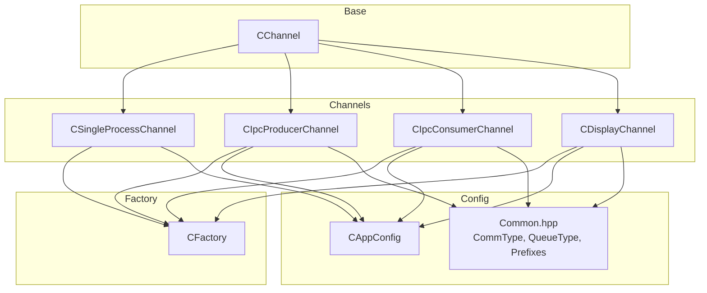
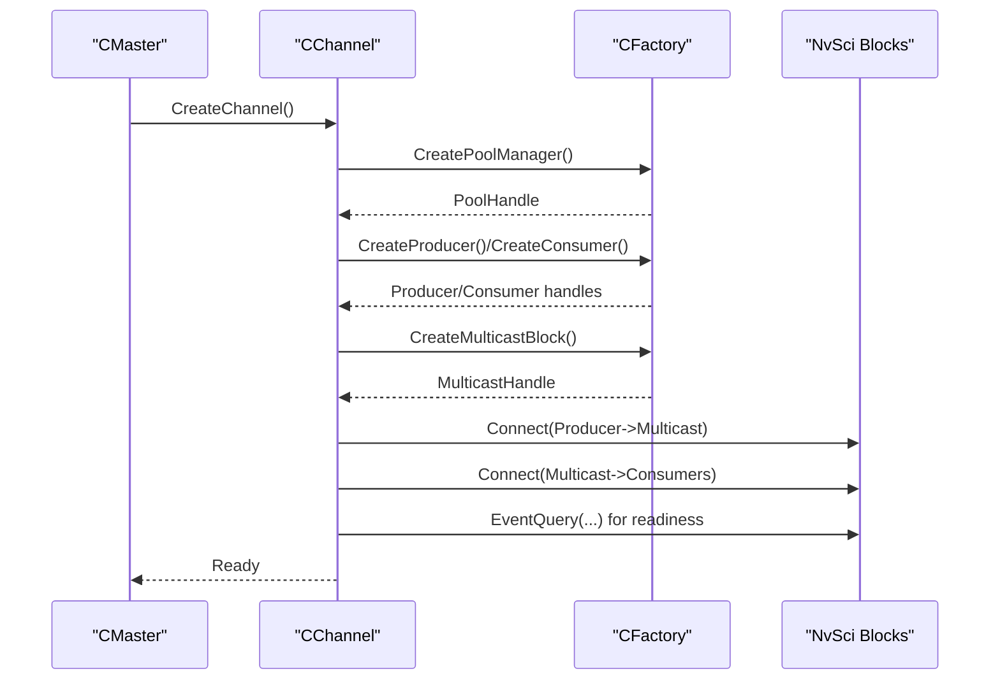
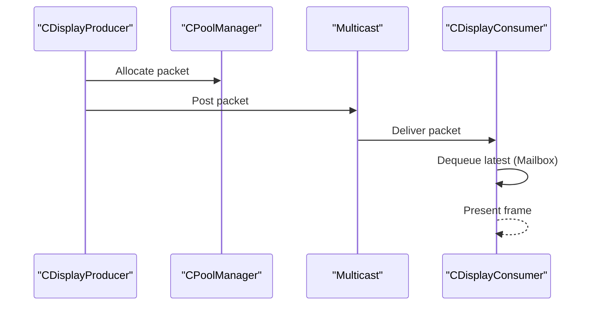
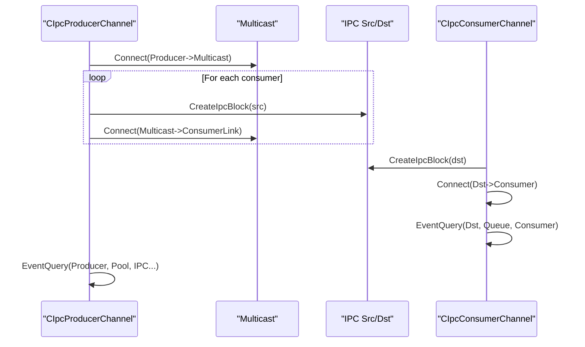
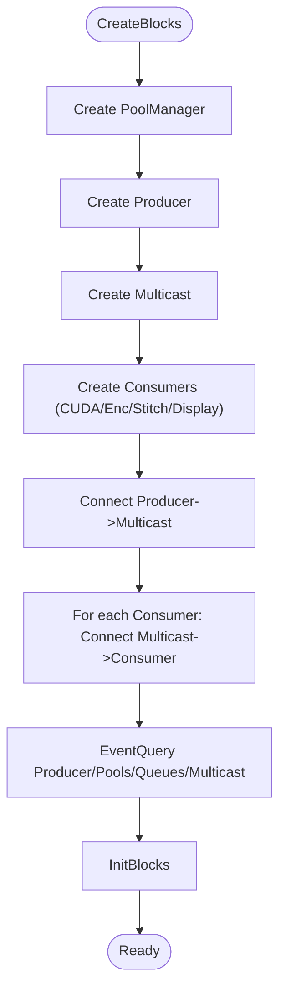
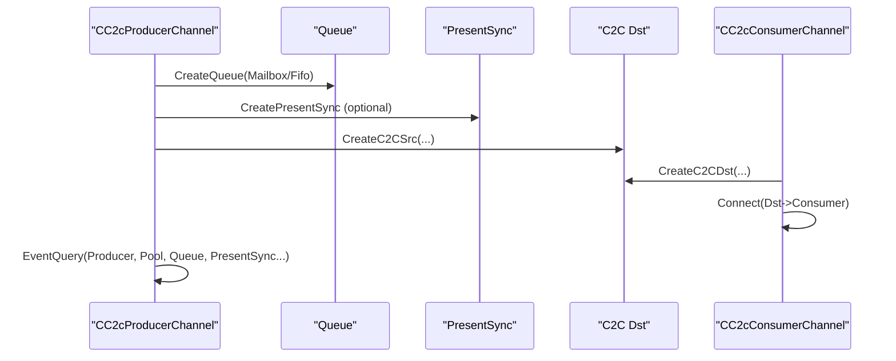
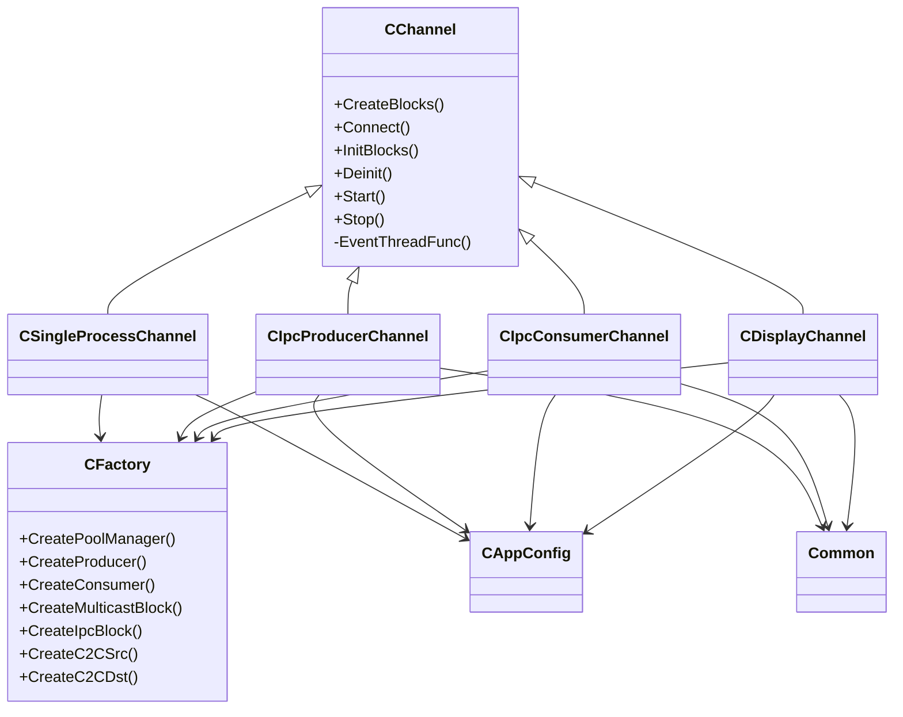

# Communication Modes

<cite>
**Referenced Files in This Document**
- [CChannel.hpp](file://CChannel.hpp)
- [CDisplayChannel.hpp](file://CDisplayChannel.hpp)
- [CIpcConsumerChannel.hpp](file://CIpcConsumerChannel.hpp)
- [CIpcProducerChannel.hpp](file://CIpcProducerChannel.hpp)
- [CSingleProcessChannel.hpp](file://CSingleProcessChannel.hpp)
- [CFactory.hpp](file://CFactory.hpp)
- [CFactory.cpp](file://CFactory.cpp)
- [Common.hpp](file://Common.hpp)
- [CAppConfig.hpp](file://CAppConfig.hpp)
- [CMaster.cpp](file://CMaster.cpp)
- [README.md](file://README.md)
</cite>

## Table of Contents
1. [Introduction](#introduction)
2. [Project Structure](#project-structure)
3. [Core Components](#core-components)
4. [Architecture Overview](#architecture-overview)
5. [Detailed Component Analysis](#detailed-component-analysis)
6. [Dependency Analysis](#dependency-analysis)
7. [Performance Considerations](#performance-considerations)
8. [Troubleshooting Guide](#troubleshooting-guide)
9. [Conclusion](#conclusion)
10. [Appendices](#appendices)

## Introduction
This document explains the communication modes supported by the channel architecture. It covers the implementation and use cases for:
- CDisplayChannel for display output communication
- CIpcConsumerChannel and CIpcProducerChannel for inter-process communication (P2P)
- CSingleProcessChannel for intra-process communication

It documents the protocols, data flow patterns, synchronization mechanisms, configuration parameters, performance characteristics, and resource requirements for each mode. Practical examples show how to configure and use each channel type across deployment scenarios, along with trade-offs and selection guidance.

## Project Structure
The channel architecture is built around a shared base class and specialized channel implementations. Factory classes construct and wire producers, consumers, queues, pools, and IPC blocks. Configuration is driven by CAppConfig and Common constants.

**Diagram sources**
- [CChannel.hpp:28-157](file://CChannel.hpp#L28-L157)
- [CSingleProcessChannel.hpp:21-247](file://CSingleProcessChannel.hpp#L21-L247)
- [CIpcProducerChannel.hpp:20-533](file://CIpcProducerChannel.hpp#L20-L533)
- [CIpcConsumerChannel.hpp:19-264](file://CIpcConsumerChannel.hpp#L19-L264)
- [CDisplayChannel.hpp:19-226](file://CDisplayChannel.hpp#L19-L226)
- [CFactory.hpp:27-95](file://CFactory.hpp#L27-L95)
- [CAppConfig.hpp:19-83](file://CAppConfig.hpp#L19-L83)
- [Common.hpp:35-34](file://Common.hpp#L35-L34)

**Section sources**
- [CChannel.hpp:28-157](file://CChannel.hpp#L28-L157)
- [CFactory.hpp:27-95](file://CFactory.hpp#L27-L95)
- [CAppConfig.hpp:19-83](file://CAppConfig.hpp#L19-L83)
- [Common.hpp:35-34](file://Common.hpp#L35-L34)

## Core Components
- CChannel: Base class defining lifecycle and event-thread orchestration. It manages thread creation, event handling loops, and cleanup.
- CSingleProcessChannel: Intra-process pipeline with a producer and multiple consumers (CUDA, encoder, optional display/stitching) sharing buffers via a multicast tree.
- CIpcProducerChannel and CIpcConsumerChannel: Inter-process (P2P) implementations using NvSci IPC blocks and multicast. Supports late attach/detach for dynamic consumer addition/removal.
- CDisplayChannel: Specialized pipeline for display output using a display producer and a display consumer with mailbox queue semantics.
- CFactory: Central factory for creating producers, consumers, queues, pools, multicast blocks, and IPC blocks.
- CAppConfig and Common: Provide configuration parameters and constants for communication types, queue types, and IPC channel naming.

**Section sources**
- [CChannel.hpp:28-157](file://CChannel.hpp#L28-L157)
- [CSingleProcessChannel.hpp:21-247](file://CSingleProcessChannel.hpp#L21-L247)
- [CIpcProducerChannel.hpp:20-533](file://CIpcProducerChannel.hpp#L20-L533)
- [CIpcConsumerChannel.hpp:19-264](file://CIpcConsumerChannel.hpp#L19-L264)
- [CDisplayChannel.hpp:19-226](file://CDisplayChannel.hpp#L19-L226)
- [CFactory.hpp:27-95](file://CFactory.hpp#L27-L95)
- [CAppConfig.hpp:19-83](file://CAppConfig.hpp#L19-L83)
- [Common.hpp:35-34](file://Common.hpp#L35-L34)

## Architecture Overview
The channel architecture uses NvStreams/NvSci to build producer-consumer pipelines. Channels differ in how blocks are connected and synchronized:
- Intra-process: Producer feeds a multicast block; consumers subscribe via queues.
- Inter-process (P2P): Producer/consumer create IPC endpoints and blocks; multicast connects to IPC blocks.
- Inter-chip (C2C): Similar to P2P but uses C2C-specific channel naming and optional present sync for display.
- Display: Uses a display producer and a display consumer with mailbox queue semantics.

**Diagram sources**
- [CMaster.cpp:426-451](file://CMaster.cpp#L426-L451)
- [CChannel.hpp:124-184](file://CChannel.hpp#L124-L184)
- [CFactory.cpp:11-22](file://CFactory.cpp#L11-L22)
- [CFactory.cpp:68-94](file://CFactory.cpp#L68-L94)
- [CFactory.cpp:48-48](file://CFactory.cpp#L48-L48)

## Detailed Component Analysis

### CDisplayChannel
- Purpose: Display output pipeline with a display producer and a display consumer.
- Protocol: Uses mailbox queue for the display consumer to ensure the latest buffer is presented.
- Data flow:
  - Producer creates frames and posts to the pool.
  - Multicast distributes to the display consumer.
  - Display consumer dequeues the latest frame for presentation.
- Synchronization: NvSciStream event queries ensure producer, pool, queue, and consumer are connected and ready.
- Configuration:
  - QueueType_Mailbox enforced for display consumer.
  - WFD controller integration for DP-MST display.
- Resource requirements: Pool manager, display producer, display consumer, optional multicast.

**Diagram sources**
- [CDisplayChannel.hpp:90-202](file://CDisplayChannel.hpp#L90-L202)

**Section sources**
- [CDisplayChannel.hpp:19-226](file://CDisplayChannel.hpp#L19-L226)
- [CFactory.cpp:138-164](file://CFactory.cpp#L138-L164)

### CIpcProducerChannel and CIpcConsumerChannel (Inter-Process P2P)
- Purpose: Producer and consumer channels for inter-process communication using NvSci IPC blocks.
- Protocol:
  - Producer creates a multicast block and multiple IPC source blocks (one per consumer).
  - Consumer creates an IPC destination block and connects to the producer’s multicast.
  - Peer validation ensures producer and consumers share compatible configurations.
- Data flow:
  - Producer posts to pool, multicast, and IPC blocks.
  - Consumers connect to IPC destinations and dequeue from queues.
- Late attach/detach:
  - Producer initializes early consumers, then dynamically attaches late consumers.
  - Uses NvSciStreamSetup_Connect signaling to coordinate attachment.
- Synchronization: Event queries on producer, pool, IPC blocks, and multicast.
- Configuration:
  - CommType_InterProcess
  - ConsumerType selection
  - QueueType selection (mailbox vs fifo)
  - Late attach enablement

**Diagram sources**
- [CIpcProducerChannel.hpp:133-184](file://CIpcProducerChannel.hpp#L133-L184)
- [CIpcConsumerChannel.hpp:85-118](file://CIpcConsumerChannel.hpp#L85-L118)

**Section sources**
- [CIpcProducerChannel.hpp:20-533](file://CIpcProducerChannel.hpp#L20-L533)
- [CIpcConsumerChannel.hpp:19-264](file://CIpcConsumerChannel.hpp#L19-L264)
- [Common.hpp:31-40](file://Common.hpp#L31-L40)

### CSingleProcessChannel (Intra-Process)
- Purpose: Single-process pipeline with a producer and multiple consumers (CUDA, encoder, optional display/stitching).
- Protocol: Multicast distributes from producer to multiple consumers within the same process.
- Data flow:
  - Producer posts to pool and multicast.
  - Consumers subscribe via queues; display/stitching consumers receive the same multicast stream.
- Synchronization: Event queries on producer, pool, and all consumer queues.
- Configuration:
  - ConsumerType selection
  - QueueType selection
  - Optional stitching or DP-MST display

**Diagram sources**
- [CSingleProcessChannel.hpp:87-209](file://CSingleProcessChannel.hpp#L87-L209)

**Section sources**
- [CSingleProcessChannel.hpp:21-247](file://CSingleProcessChannel.hpp#L21-L247)

### Inter-Chip (C2C) Mode
- Purpose: Inter-chip communication using C2C-specific channel naming and optional present sync for display consumers.
- Protocol:
  - Producer uses C2C src channels and optional present sync blocks.
  - Consumer uses C2C dst channels and pool manager for C2C.
- Data flow:
  - Producer posts via C2C src and optional present sync.
  - Consumer connects to C2C dst and pool.
- Configuration:
  - CommType_InterChip
  - QueueType_Mailbox for display consumers
  - C2C channel naming constants

**Diagram sources**
- [CIpcProducerChannel.hpp:437-530](file://CIpcProducerChannel.hpp#L437-L530)
- [CIpcConsumerChannel.hpp:220-261](file://CIpcConsumerChannel.hpp#L220-L261)
- [Common.hpp:32-33](file://Common.hpp#L32-L33)

**Section sources**
- [CIpcProducerChannel.hpp:411-530](file://CIpcProducerChannel.hpp#L411-L530)
- [CIpcConsumerChannel.hpp:184-261](file://CIpcConsumerChannel.hpp#L184-L261)
- [Common.hpp:32-33](file://Common.hpp#L32-L33)

## Dependency Analysis
- CChannel orchestrates event threads and lifecycle across all channel types.
- CFactory centralizes creation of producers, consumers, queues, pools, multicast, and IPC blocks.
- CAppConfig and Common define runtime configuration and constants.
- CMaster selects the appropriate channel based on CommType and entity type.

**Diagram sources**
- [CChannel.hpp:28-157](file://CChannel.hpp#L28-L157)
- [CSingleProcessChannel.hpp:21-247](file://CSingleProcessChannel.hpp#L21-L247)
- [CIpcProducerChannel.hpp:20-533](file://CIpcProducerChannel.hpp#L20-L533)
- [CIpcConsumerChannel.hpp:19-264](file://CIpcConsumerChannel.hpp#L19-L264)
- [CDisplayChannel.hpp:19-226](file://CDisplayChannel.hpp#L19-L226)
- [CFactory.hpp:27-95](file://CFactory.hpp#L27-L95)
- [CAppConfig.hpp:19-83](file://CAppConfig.hpp#L19-L83)
- [Common.hpp:35-34](file://Common.hpp#L35-L34)

**Section sources**
- [CChannel.hpp:28-157](file://CChannel.hpp#L28-L157)
- [CFactory.hpp:27-95](file://CFactory.hpp#L27-L95)
- [CAppConfig.hpp:19-83](file://CAppConfig.hpp#L19-L83)
- [Common.hpp:35-34](file://Common.hpp#L35-L34)

## Performance Considerations
- Buffer pool sizing:
  - MAX_NUM_PACKETS controls the static pool size; larger pools reduce allocation overhead but increase memory footprint.
- Queue types:
  - Mailbox queue prioritizes the latest frame; FIFO preserves order but may delay newer frames behind older ones.
- Multicast fan-out:
  - Intra-process and P2P/C2C multicast scales fan-out efficiently; late attach adds minimal overhead after initial setup.
- IPC and C2C:
  - IPC/C2C introduce cross-process/cross-chip latency; ensure adequate buffer depth and queue sizes.
- Display pipeline:
  - Mailbox queue ensures low-latency presentation; mailbox contention may drop frames under heavy load.
- Thread orchestration:
  - EventThreadFunc monitors event status and logs timeouts; tune verbosity and monitoring for production deployments.

[No sources needed since this section provides general guidance]

## Troubleshooting Guide
- Connection failures:
  - Use EventQuery on producer, pool, queue, consumer, and multicast to detect setup errors.
  - For P2P/C2C, verify IPC endpoints and channel names match producer configuration.
- Late attach issues:
  - Ensure multicast status transitions to SetupComplete before attaching late consumers.
  - Verify peer validation passes before connecting consumers.
- Timeout handling:
  - EventThreadFunc tracks timeouts; repeated timeouts indicate blocked handlers or misconfigured blocks.
- Display pipeline:
  - Confirm mailbox queue is used for display consumers; otherwise, frames may not appear latest.

**Section sources**
- [CChannel.hpp:112-140](file://CChannel.hpp#L112-L140)
- [CIpcProducerChannel.hpp:133-184](file://CIpcProducerChannel.hpp#L133-L184)
- [CIpcConsumerChannel.hpp:85-118](file://CIpcConsumerChannel.hpp#L85-L118)
- [CDisplayChannel.hpp:124-184](file://CDisplayChannel.hpp#L124-L184)

## Conclusion
The channel architecture provides flexible, scalable communication modes:
- Intra-process for efficient local processing
- Inter-process for distributed pipelines with peer validation and late attach
- Inter-chip for cross-chip scenarios with C2C channel naming and optional present sync
- Display pipeline optimized for latest-frame presentation

Select the mode based on deployment constraints, latency requirements, and resource isolation needs. Use configuration parameters to tailor queue types, consumer counts, and display options.

[No sources needed since this section summarizes without analyzing specific files]

## Appendices

### Configuration Parameters and Constants
- CommType: IntraProcess, InterProcess, InterChip
- QueueType: Mailbox, Fifo
- IPC channel prefix: nvscistream_
- C2C channel prefixes: nvscic2c_pcie_s1_c5_, nvscic2c_pcie_s2_c5_
- Consumer types: Enc, Cuda, Stitch, Display
- Producer types: SIPL, Display
- Defaults: DEFAULT_NUM_CONSUMERS, MAX_NUM_PACKETS

**Section sources**
- [CAppConfig.hpp:30-46](file://CAppConfig.hpp#L30-L46)
- [Common.hpp:35-76](file://Common.hpp#L35-L76)

### Practical Deployment Scenarios and Examples
- Intra-process:
  - Single process with producer, CUDA, encoder, optional display/stitching.
  - Example commands and options are documented in the project README.
- Inter-process (P2P):
  - Separate producer and consumer processes using IPC channels.
  - Peer validation ensures consistent platform configuration.
- Inter-chip (C2C):
  - Producer/consumer on different chips using C2C channels.
  - Mailbox queue for display consumers.
- Late attach:
  - Dynamic attachment/detachment of consumers after initial setup.

**Section sources**
- [README.md:21-109](file://README.md#L21-L109)
- [CMaster.cpp:426-451](file://CMaster.cpp#L426-L451)