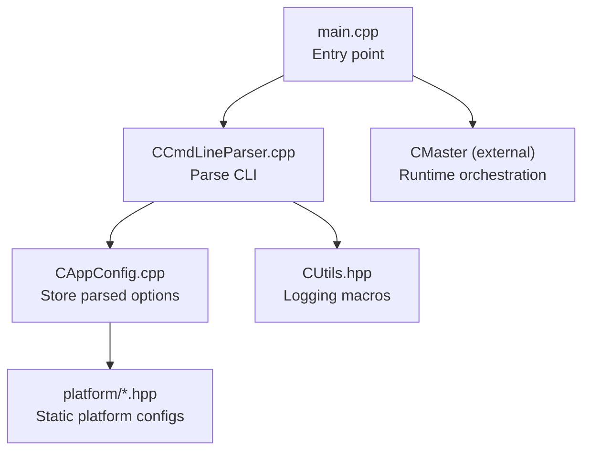
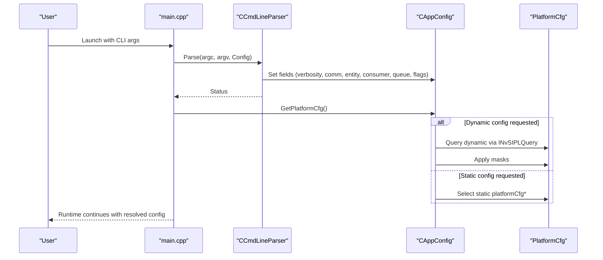
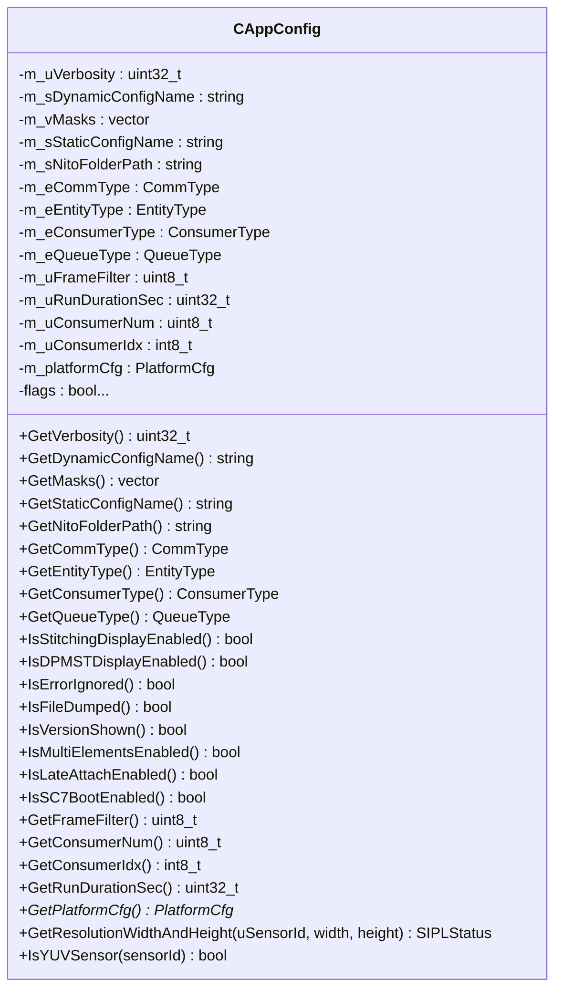
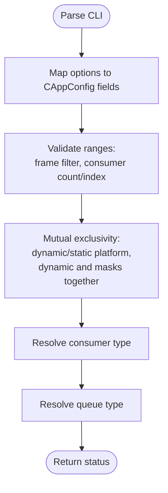
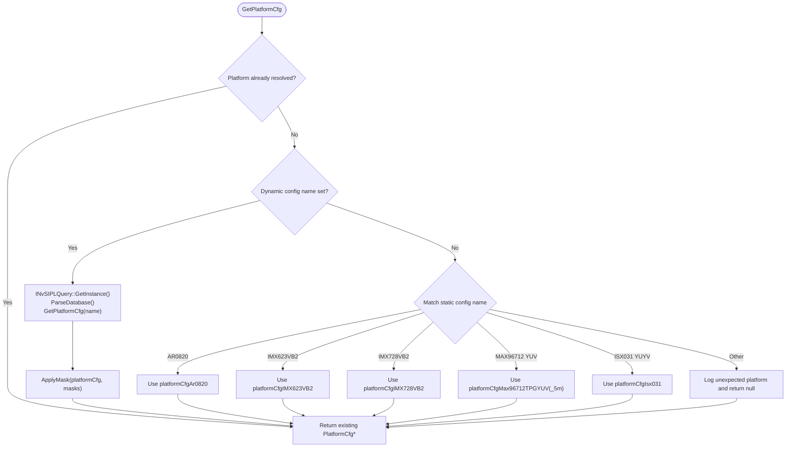
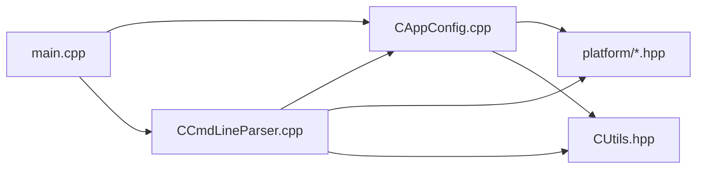

# Application Configuration

<cite>
**Referenced Files in This Document**
- [CAppConfig.hpp](file://CAppConfig.hpp)
- [CAppConfig.cpp](file://CAppConfig.cpp)
- [CCmdLineParser.hpp](file://CCmdLineParser.hpp)
- [CCmdLineParser.cpp](file://CCmdLineParser.cpp)
- [Common.hpp](file://Common.hpp)
- [ar0820.hpp](file://platform/ar0820.hpp)
- [imx623vb2.hpp](file://platform/imx623vb2.hpp)
- [imx728vb2.hpp](file://platform/imx728vb2.hpp)
- [max96712_tpg_yuv.hpp](file://platform/max96712_tpg_yuv.hpp)
- [isx031.hpp](file://platform/isx031.hpp)
- [CUtils.hpp](file://CUtils.hpp)
- [main.cpp](file://main.cpp)
</cite>

## Table of Contents
1. [Introduction](#introduction)
2. [Project Structure](#project-structure)
3. [Core Components](#core-components)
4. [Architecture Overview](#architecture-overview)
5. [Detailed Component Analysis](#detailed-component-analysis)
6. [Dependency Analysis](#dependency-analysis)
7. [Performance Considerations](#performance-considerations)
8. [Troubleshooting Guide](#troubleshooting-guide)
9. [Conclusion](#conclusion)
10. [Appendices](#appendices)

## Introduction
This document describes the application configuration system used by the NVIDIA SIPL Multicast project. It focuses on the CAppConfig class, command-line parsing, platform configuration selection (dynamic vs static), and related runtime parameters. It explains defaults, validation rules, parameter precedence, and provides practical examples for multi-camera setups, consumer combinations, and platform-specific optimizations. It also covers troubleshooting and best practices for production deployments.

## Project Structure
The configuration system spans a small set of focused components:
- CAppConfig: central configuration holder and platform configuration accessor
- CCmdLineParser: parses CLI options into CAppConfig
- Platform configuration headers: static platform definitions
- Common enums and types: communication types, entity types, consumer types, queue types
- Utilities and main: integrate configuration into the application lifecycle

**Diagram sources**
- [main.cpp:253-303](file://main.cpp#L253-L303)
- [CCmdLineParser.cpp:13-208](file://CCmdLineParser.cpp#L13-L208)
- [CAppConfig.cpp:21-75](file://CAppConfig.cpp#L21-L75)
- [ar0820.hpp:14-183](file://platform/ar0820.hpp#L14-L183)
- [imx623vb2.hpp:14-163](file://platform/imx623vb2.hpp#L14-L163)
- [imx728vb2.hpp:14-163](file://platform/imx728vb2.hpp#L14-L163)
- [max96712_tpg_yuv.hpp:14-238](file://platform/max96712_tpg_yuv.hpp#L14-L238)
- [isx031.hpp:14-117](file://platform/isx031.hpp#L14-L117)
- [CUtils.hpp:28-275](file://CUtils.hpp#L28-L275)

**Section sources**
- [main.cpp:253-303](file://main.cpp#L253-L303)
- [CCmdLineParser.cpp:13-208](file://CCmdLineParser.cpp#L13-L208)
- [CAppConfig.cpp:21-75](file://CAppConfig.cpp#L21-L75)

## Core Components
- CAppConfig: holds all application configuration, including verbosity, communication type, entity type, consumer type, queue type, display modes, frame filtering, consumer count/index, run duration, platform configuration, and flags. It exposes getters for all parameters and provides platform configuration access and resolution lookup helpers.
- CCmdLineParser: maps CLI flags to CAppConfig fields, validates ranges and mutual exclusivity, and prints usage and supported platform lists.
- Platform configuration headers: define static platform configurations for multiple sensors and boards.
- Common enums/types: define CommType, EntityType, ConsumerType, QueueType, and related constants.

Key defaults and behaviors:
- Verbosity defaults to a moderate level
- Communication defaults to intra-process producer
- Consumer defaults to encoder consumer with FIFO queues
- Frame filter defaults to processing every frame
- Consumer count defaults to a small number suitable for demos
- Static platform defaults to a common AR0820 configuration when none is specified

Validation highlights:
- Frame filter range enforced
- Consumer count range enforced
- Consumer index range enforced relative to consumer count
- Dynamic and static platform configuration exclusivity
- Dynamic config requires masks when present

**Section sources**
- [CAppConfig.hpp:19-80](file://CAppConfig.hpp#L19-L80)
- [CAppConfig.cpp:21-108](file://CAppConfig.cpp#L21-L108)
- [CCmdLineParser.cpp:13-208](file://CCmdLineParser.cpp#L13-L208)
- [Common.hpp:35-66](file://Common.hpp#L35-L66)

## Architecture Overview
The configuration pipeline is:
- main() constructs CAppConfig and CCmdLineParser
- CCmdLineParser::Parse populates CAppConfig based on CLI
- main() applies verbosity and proceeds to runtime
- CAppConfig::GetPlatformCfg resolves either dynamic or static platform configuration
- Resolution and sensor-type helpers are available for downstream consumers

**Diagram sources**
- [main.cpp:253-278](file://main.cpp#L253-L278)
- [CCmdLineParser.cpp:13-208](file://CCmdLineParser.cpp#L13-L208)
- [CAppConfig.cpp:21-75](file://CAppConfig.cpp#L21-L75)

## Detailed Component Analysis

### CAppConfig Class
Responsibilities:
- Store and expose all application configuration parameters
- Resolve platform configuration (dynamic via SIPL Query or static via platform headers)
- Provide helpers to query sensor resolution and detect YUV sensors
- Expose flags for display modes, error handling, dumping, version, multi-element, late attach, SC7 boot

Defaults and getters:
- Verbosity, consumer count, consumer index, run duration, frame filter, queue type, and flags have explicit defaults
- Communication type defaults to intra-process producer
- Consumer type defaults to encoder consumer
- Static platform name defaults to a common AR0820 configuration when empty

Platform configuration resolution:
- If dynamic config name is provided, it queries the SIPL database, retrieves the platform configuration, and applies link masks
- Otherwise, it selects a static platform based on the static config name
- Returns a pointer to the resolved platform configuration

Resolution and sensor helpers:
- Iterates device blocks and camera modules to match a sensor ID and return width/height
- Determines whether a sensor uses YUV input format

**Diagram sources**
- [CAppConfig.hpp:19-80](file://CAppConfig.hpp#L19-L80)
- [CAppConfig.cpp:21-108](file://CAppConfig.cpp#L21-L108)

**Section sources**
- [CAppConfig.hpp:19-80](file://CAppConfig.hpp#L19-L80)
- [CAppConfig.cpp:21-108](file://CAppConfig.cpp#L21-L108)

### Command-Line Parsing and Validation
CCmdLineParser maps CLI options to CAppConfig fields and enforces validation:
- Verbosity, platform config, masks, consumer type, queue type, frame filter, run duration, consumer count/index, display modes, multi-element, SC7 boot, file dump, version, and late attach
- Enforces ranges for frame filter and consumer count/index
- Validates mutual exclusivity between dynamic/static platform configuration and ensures masks are provided when dynamic config is used
- Provides usage and supported platform listing

**Diagram sources**
- [CCmdLineParser.cpp:13-208](file://CCmdLineParser.cpp#L13-L208)

**Section sources**
- [CCmdLineParser.hpp:34-44](file://CCmdLineParser.hpp#L34-L44)
- [CCmdLineParser.cpp:13-208](file://CCmdLineParser.cpp#L13-L208)

### Platform Configuration Resolution
CAppConfig::GetPlatformCfg selects either:
- Dynamic configuration via INvSIPLQuery when a dynamic config name is provided, then applies masks
- Static configuration by matching the static config name to known platform headers

Supported static platform names and their associated headers:
- AR0820 C-PHY x4
- IMX623VB2 C-PHY x4
- IMX728VB2 C-PHY x4
- MAX96712 YUV TPG C-PHY x4
- MAX96712 YUV 5M TPG D-PHY x4
- ISX031 YUYV C-PHY x4

**Diagram sources**
- [CAppConfig.cpp:21-75](file://CAppConfig.cpp#L21-L75)
- [ar0820.hpp:14-183](file://platform/ar0820.hpp#L14-L183)
- [imx623vb2.hpp:14-163](file://platform/imx623vb2.hpp#L14-L163)
- [imx728vb2.hpp:14-163](file://platform/imx728vb2.hpp#L14-L163)
- [max96712_tpg_yuv.hpp:14-238](file://platform/max96712_tpg_yuv.hpp#L14-L238)
- [isx031.hpp:14-117](file://platform/isx031.hpp#L14-L117)

**Section sources**
- [CAppConfig.cpp:21-75](file://CAppConfig.cpp#L21-L75)

### Resolution Width/Height Retrieval and YUV Detection
CAppConfig provides two helpers that iterate the resolved platform configuration to locate a sensor by ID:
- GetResolutionWidthAndHeight: returns width and height for a given sensor ID
- IsYUVSensor: determines if a sensor uses YUV input format

These helpers are useful for consumers that need to adapt processing based on sensor capabilities.

**Section sources**
- [CAppConfig.cpp:77-108](file://CAppConfig.cpp#L77-L108)

### Relationship Between Static and Dynamic Configuration Names
- Static configuration name: selects among built-in platform definitions
- Dynamic configuration name: requests a platform definition from the SIPL Query database
- Mutual exclusivity: dynamic and static cannot be set simultaneously
- Masks: when using dynamic configuration, masks must be provided together

**Section sources**
- [CCmdLineParser.cpp:184-195](file://CCmdLineParser.cpp#L184-L195)
- [CAppConfig.cpp:25-50](file://CAppConfig.cpp#L25-L50)

### Mask Configurations and Link Control
- Link enable masks are parsed from a space-separated hex string
- Masks are applied to the dynamic platform configuration to selectively disable/enable CSI links
- Masks are only applicable when dynamic configuration is used

**Section sources**
- [CCmdLineParser.cpp:70-79](file://CCmdLineParser.cpp#L70-L79)
- [CAppConfig.cpp:44-50](file://CAppConfig.cpp#L44-L50)

### NITO Folder Path
- The NITO folder path is stored in the configuration and exposed via a getter
- It is intended for locating NITO calibration or tuning files used by consumers

**Section sources**
- [CAppConfig.hpp:29](file://CAppConfig.hpp#L29)
- [CCmdLineParser.cpp:93-95](file://CCmdLineParser.cpp#L93-L95)

## Dependency Analysis
- CAppConfig depends on:
  - Platform headers for static configuration
  - Optional SIPL Query interface for dynamic configuration
  - Logging macros for diagnostics
- CCmdLineParser depends on:
  - CAppConfig to populate fields
  - Platform headers for listing static configs
  - Optional SIPL Query for listing dynamic configs
  - Logging macros for errors and usage
- main integrates configuration into runtime by applying verbosity and invoking PreInit/Resume/PostDeInit

**Diagram sources**
- [CCmdLineParser.cpp:13-208](file://CCmdLineParser.cpp#L13-L208)
- [CAppConfig.cpp:21-108](file://CAppConfig.cpp#L21-L108)
- [CUtils.hpp:28-275](file://CUtils.hpp#L28-L275)
- [main.cpp:253-278](file://main.cpp#L253-L278)

**Section sources**
- [CCmdLineParser.cpp:13-208](file://CCmdLineParser.cpp#L13-L208)
- [CAppConfig.cpp:21-108](file://CAppConfig.cpp#L21-L108)
- [main.cpp:253-278](file://main.cpp#L253-L278)

## Performance Considerations
- Platform configuration resolution occurs once per process initialization; subsequent calls return the cached configuration pointer.
- Frame filtering reduces processing load by skipping frames; choose appropriate values to balance quality and throughput.
- Consumer count and index impact resource allocation; keep within validated ranges to avoid overhead or failures.
- Late attach enables dynamic reconfiguration; use judiciously to minimize disruption.

[No sources needed since this section provides general guidance]

## Troubleshooting Guide
Common configuration issues and resolutions:
- Unexpected platform configuration error: verify static platform name matches one of the supported names
- Dynamic config and masks misconfiguration: ensure both are provided together when using dynamic config
- Invalid frame filter or consumer count/index: adjust to within the documented ranges
- Consumer index out of range: ensure the index is within [0, ConsumerNum-1] or use -1 for automatic assignment
- Dynamic config unavailable: confirm SIPL Query database is parsable and the requested platform exists
- YUV vs RAW mismatch: use IsYUVSensor to detect input format and configure consumers accordingly

**Section sources**
- [CCmdLineParser.cpp:169-207](file://CCmdLineParser.cpp#L169-L207)
- [CAppConfig.cpp:65-67](file://CAppConfig.cpp#L65-L67)
- [CAppConfig.cpp:44-50](file://CAppConfig.cpp#L44-L50)

## Conclusion
The CAppConfig-driven configuration system provides a robust, validated mechanism to control the SIPL Multicast application’s behavior. It supports both dynamic and static platform configurations, comprehensive parameter validation, and helpful utilities for resolution and sensor-type detection. By following the examples and best practices below, you can reliably deploy multi-camera setups and consumer combinations across various platforms.

[No sources needed since this section summarizes without analyzing specific files]

## Appendices

### Parameter Reference and Defaults
- Verbosity: default moderate level; controls logging verbosity
- Communication type: default intra-process producer
- Entity type: default producer
- Consumer type: default encoder consumer
- Queue type: default FIFO
- Frame filter: default 1 (process every frame)
- Consumer count: default small demo-friendly value
- Consumer index: default -1 (automatic)
- Run duration: default 0 (no time limit)
- Display modes: disabled by default
- Flags: error ignore, file dump, version show, multi-element, late attach, SC7 boot: disabled by default
- NITO folder path: empty by default

**Section sources**
- [CAppConfig.hpp:54-79](file://CAppConfig.hpp#L54-L79)
- [Common.hpp:18-19](file://Common.hpp#L18-L19)

### Examples and Scenarios

- Multi-camera AR0820 C-PHY x4:
  - Static platform name: use the AR0820 configuration
  - Consumers: typical encoder or CUDA consumers
  - Queue type: FIFO for low latency
  - Example flags: specify platform name and consumer type

- Dual consumer setup with encoder and CUDA:
  - Set consumer count to 2
  - Assign indices 0 and 1 to separate consumers
  - Choose queue type based on throughput needs

- Dynamic platform with masked links:
  - Provide dynamic platform config name
  - Provide link enable masks for each deserializer
  - Ensure masks and dynamic config are both set

- Platform-specific optimizations:
  - AR0820: higher resolution RAW sensor
  - IMX623/IMX728: lower-resolution RAW sensors
  - MAX96712 YUV TPG: fixed resolution YUV sensor for testing
  - ISX031: YUV sensor on different CSI lanes

**Section sources**
- [CCmdLineParser.cpp:67-153](file://CCmdLineParser.cpp#L67-L153)
- [CAppConfig.cpp:53-68](file://CAppConfig.cpp#L53-L68)

### Best Practices for Production Deployments
- Validate all parameters before launch; rely on parser error messages for quick fixes
- Prefer static platform configuration for deterministic environments; use dynamic configuration for flexible deployments
- Keep frame filter reasonable to balance CPU usage and image quality
- Limit consumer count to hardware capacity; monitor resource utilization
- Use late attach sparingly; test thoroughly in staging
- Store NITO files in a dedicated folder and pass the path via configuration
- Enable file dump only for diagnostics; disable in normal operation

[No sources needed since this section provides general guidance]