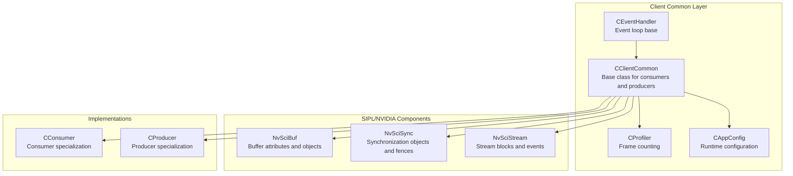
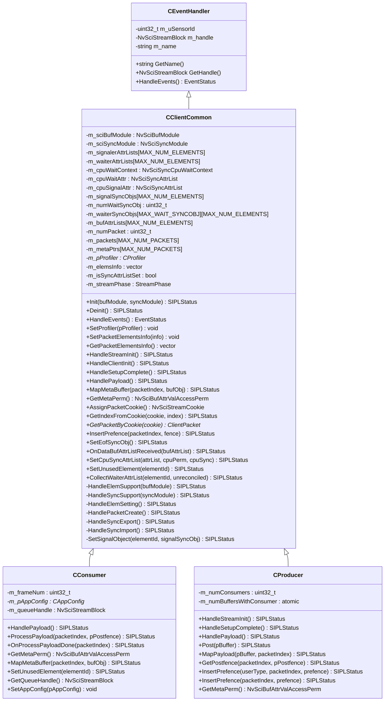
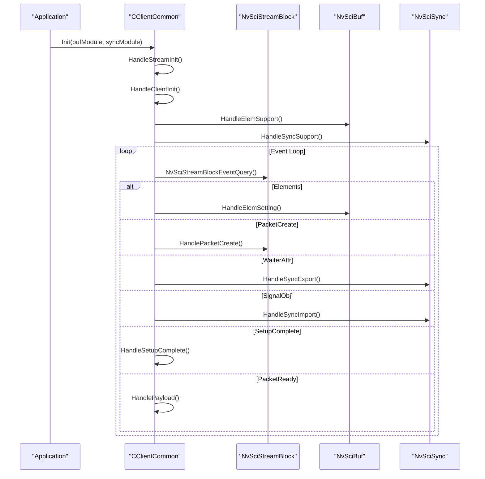
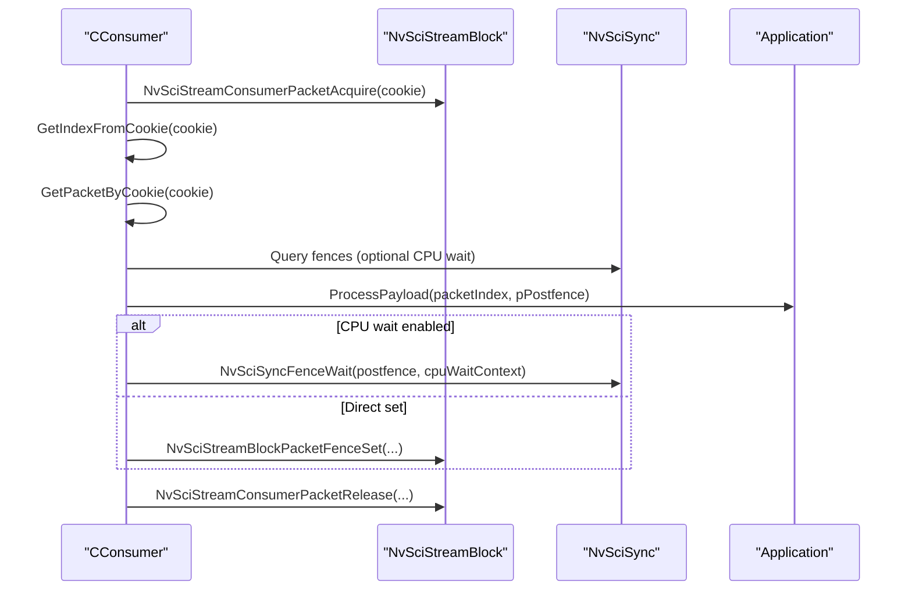
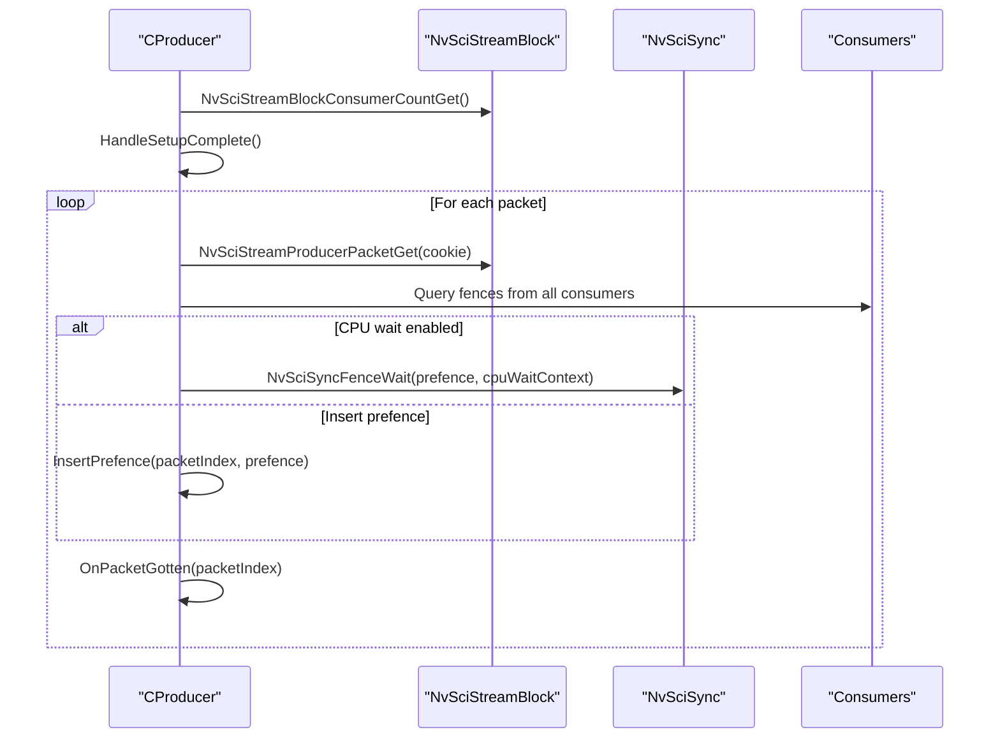
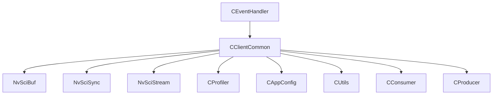

# Client Common Infrastructure

<cite>
**Referenced Files in This Document**
- [CClientCommon.hpp](file://CClientCommon.hpp)
- [CClientCommon.cpp](file://CClientCommon.cpp)
- [CEventHandler.hpp](file://CEventHandler.hpp)
- [CConsumer.hpp](file://CConsumer.hpp)
- [CConsumer.cpp](file://CConsumer.cpp)
- [CProducer.hpp](file://CProducer.hpp)
- [CProducer.cpp](file://CProducer.cpp)
- [Common.hpp](file://Common.hpp)
- [CUtils.hpp](file://CUtils.hpp)
- [CUtils.cpp](file://CUtils.cpp)
- [CProfiler.hpp](file://CProfiler.hpp)
- [CAppConfig.hpp](file://CAppConfig.hpp)
- [CFactory.hpp](file://CFactory.hpp)
</cite>

## Table of Contents
1. [Introduction](#introduction)
2. [Project Structure](#project-structure)
3. [Core Components](#core-components)
4. [Architecture Overview](#architecture-overview)
5. [Detailed Component Analysis](#detailed-component-analysis)
6. [Dependency Analysis](#dependency-analysis)
7. [Performance Considerations](#performance-considerations)
8. [Troubleshooting Guide](#troubleshooting-guide)
9. [Conclusion](#conclusion)
10. [Appendices](#appendices)

## Introduction
This document describes the client common infrastructure in the NVIDIA SIPL Multicast project with a focus on the CClientCommon base class. It explains the shared functionality for consumers and producers, synchronization primitives, and common utilities. It covers thread-safety mechanisms, resource management patterns, cross-platform compatibility features, integration with NVIDIA SIPL components, memory management strategies, error handling patterns, and extension points for custom consumer types. Practical examples of inheritance patterns, initialization sequences, and cleanup procedures are included, along with performance considerations and debugging support.

## Project Structure
The client common infrastructure centers around CClientCommon, which is extended by CConsumer and CProducer. These classes integrate with NVIDIA SIPL components via NvSciBuf and NvSciSync, and leverage shared utilities for logging, configuration, profiling, and factory-based creation of blocks and queues.

**Diagram sources**
- [CClientCommon.hpp:47-200](file://CClientCommon.hpp#L47-L200)
- [CEventHandler.hpp:23-51](file://CEventHandler.hpp#L23-L51)
- [CConsumer.hpp:16-44](file://CConsumer.hpp#L16-L44)
- [CProducer.hpp:16-51](file://CProducer.hpp#L16-L51)
- [Common.hpp:14-87](file://Common.hpp#L14-L87)

**Section sources**
- [CClientCommon.hpp:1-202](file://CClientCommon.hpp#L1-L202)
- [CEventHandler.hpp:1-54](file://CEventHandler.hpp#L1-L54)
- [CConsumer.hpp:1-45](file://CConsumer.hpp#L1-L45)
- [CProducer.hpp:1-53](file://CProducer.hpp#L1-L53)
- [Common.hpp:1-87](file://Common.hpp#L1-L87)

## Core Components
- CClientCommon: Base class providing stream setup, packet lifecycle, synchronization reconciliation, and metadata handling. It orchestrates NvSciBuf and NvSciSync attribute negotiation and object allocation, and manages a fixed-size packet array with associated buffers and metadata pointers.
- CEventHandler: Base class offering a generic event handling interface and common client identity/state (name, sensor ID, NvSciStream block handle).
- CConsumer: Specialization for consumers implementing payload acquisition, pre/post fence handling, and optional CPU waiting.
- CProducer: Specialization for producers implementing packet retrieval, pre-fence collection from consumers, and packet presentation.
- Shared utilities: Logging macros and helpers (CUtils), configuration (CAppConfig), and profiling (CProfiler).

Key responsibilities:
- Initialization sequence: HandleStreamInit -> HandleClientInit -> HandleElemSupport -> HandleSyncSupport
- Runtime event handling: Elements, PacketCreate, PacketsComplete, WaiterAttr, SignalObj, SetupComplete, PacketReady, Error, Disconnected
- Cleanup: UnregisterSyncObjs, free NvSci resources, and reset internal state

**Section sources**
- [CClientCommon.hpp:47-200](file://CClientCommon.hpp#L47-L200)
- [CClientCommon.cpp:95-112](file://CClientCommon.cpp#L95-L112)
- [CEventHandler.hpp:23-51](file://CEventHandler.hpp#L23-L51)
- [CConsumer.hpp:16-44](file://CConsumer.hpp#L16-L44)
- [CProducer.hpp:16-51](file://CProducer.hpp#L16-L51)

## Architecture Overview
CClientCommon encapsulates the common stream orchestration logic. Consumers and producers inherit from it and override virtual methods to implement domain-specific behavior. The class coordinates:
- Element attribute negotiation via NvSciBufAttrList
- Synchronization attribute reconciliation and object allocation via NvSciSync
- Packet creation, mapping, and lifecycle management
- Fence handling for producer-consumer synchronization
- Optional CPU waiting contexts for cross-domain waits

**Diagram sources**
- [CEventHandler.hpp:23-51](file://CEventHandler.hpp#L23-L51)
- [CClientCommon.hpp:47-200](file://CClientCommon.hpp#L47-L200)
- [CConsumer.hpp:16-44](file://CConsumer.hpp#L16-L44)
- [CProducer.hpp:16-51](file://CProducer.hpp#L16-L51)

## Detailed Component Analysis

### CClientCommon: Base Class Implementation
CClientCommon centralizes stream setup, synchronization, and packet lifecycle management. It exposes extension points for derived classes to customize buffer/sync attributes, mapping, and payload processing.

- Initialization and setup
  - Init(bufModule, syncModule): Calls HandleStreamInit, HandleClientInit, HandleElemSupport, HandleSyncSupport.
  - HandleElemSupport: Creates per-element NvSciBufAttrList, sets user-type attributes, exports element support.
  - HandleSyncSupport: Creates signaler/waiter NvSciSyncAttrList per element, optionally creates CPU wait attributes and context if HasCpuWait returns true.

- Event-driven runtime
  - HandleEvents: Processes NvSciStream events and dispatches to:
    - Elements: HandleElemSetting
    - PacketCreate: HandlePacketCreate
    - PacketsComplete: Set import completion
    - WaiterAttr: HandleSyncExport
    - SignalObj: HandleSyncImport
    - SetupComplete: HandleSetupComplete transitions to streaming phase
    - PacketReady: HandlePayload
    - Error/Disconnected: logs and returns error

- Packet lifecycle
  - HandlePacketCreate: Allocates cookies, retrieves packet handles, maps buffers per element, sets packet status.
  - HandlePayload: Implemented by derived classes to process payload.

- Synchronization reconciliation and registration
  - HandleSyncExport: Collects unreconciled waiter attributes, reconciles with signaler and optional CPU wait attributes, allocates signal sync objects, registers and sets them.
  - HandleSyncImport: Imports waiter sync objects from remote endpoints, registers them.

- Utilities
  - Cookie management: AssignPacketCookie, GetIndexFromCookie, GetPacketByCookie
  - Metadata buffer: SetMetaBufAttrList, MapMetaBuffer
  - CPU waiting: SetCpuSyncAttrList, HasCpuWait override
  - Unused elements: SetUnusedElement

- Thread-safety and resource management
  - RAII-like destructor frees NvSciBufAttrList, NvSciSyncAttrList, NvSciSyncObj, NvSciBufObj, and CPU wait context.
  - Atomic counters and mutex-protected profiling data in specialized components (e.g., CProfiler).

**Diagram sources**
- [CClientCommon.cpp:95-205](file://CClientCommon.cpp#L95-L205)
- [CClientCommon.cpp:300-325](file://CClientCommon.cpp#L300-L325)
- [CClientCommon.cpp:328-365](file://CClientCommon.cpp#L328-L365)
- [CClientCommon.cpp:367-408](file://CClientCommon.cpp#L367-L408)
- [CClientCommon.cpp:410-467](file://CClientCommon.cpp#L410-L467)
- [CClientCommon.cpp:469-553](file://CClientCommon.cpp#L469-L553)
- [CClientCommon.cpp:555-591](file://CClientCommon.cpp#L555-L591)

**Section sources**
- [CClientCommon.hpp:47-200](file://CClientCommon.hpp#L47-L200)
- [CClientCommon.cpp:95-634](file://CClientCommon.cpp#L95-L634)

### CEventHandler: Event Loop Base
Provides a uniform interface for event handling and stores client identity and NvSciStream block handle. Derived classes implement HandleEvents to process NvSciStream events.

- Public interface: GetName, GetHandle, HandleEvents
- Protected members: m_uSensorId, m_handle, m_name

**Section sources**
- [CEventHandler.hpp:23-51](file://CEventHandler.hpp#L23-L51)

### CConsumer: Consumer Specialization
Extends CClientCommon to implement consumer-side logic:
- Payload acquisition via NvSciStreamConsumerPacketAcquire
- Pre-fence retrieval from producer, optional CPU wait, processing, and post-fence setting
- Metadata mapping for read-only access
- Optional element usage control via SetUnusedElement

**Diagram sources**
- [CConsumer.cpp:17-94](file://CConsumer.cpp#L17-L94)
- [CConsumer.hpp:16-44](file://CConsumer.hpp#L16-L44)

**Section sources**
- [CConsumer.hpp:16-44](file://CConsumer.hpp#L16-L44)
- [CConsumer.cpp:17-127](file://CConsumer.cpp#L17-L127)

### CProducer: Producer Specialization
Extends CClientCommon to implement producer-side logic:
- Queries number of consumers and sets m_numWaitSyncObj accordingly
- Retrieves initial ownership of packets after SetupComplete
- Collects pre-fences from all consumers, optional CPU wait, and invokes domain-specific OnPacketGotten
- Presents packets with post-fences and updates buffer counters

**Diagram sources**
- [CProducer.cpp:17-151](file://CProducer.cpp#L17-L151)
- [CProducer.hpp:16-51](file://CProducer.hpp#L16-L51)

**Section sources**
- [CProducer.hpp:16-51](file://CProducer.hpp#L16-L51)
- [CProducer.cpp:17-157](file://CProducer.cpp#L17-L157)

### Extension Points and Customization
- Overrideable methods in CClientCommon:
  - HandleStreamInit, HandleClientInit, HandleSetupComplete, HandlePayload
  - SetDataBufAttrList, SetSyncAttrList, MapDataBuffer, MapMetaBuffer
  - RegisterSignalSyncObj, RegisterWaiterSyncObj, InsertPrefence, SetEofSyncObj
  - GetMetaPerm, SetUnusedElement, HasCpuWait
- Derived classes implement:
  - CConsumer: ProcessPayload, OnProcessPayloadDone, MapMetaBuffer, SetUnusedElement
  - CProducer: HandleStreamInit, HandleSetupComplete, HandlePayload, MapPayload, GetPostfence, InsertPrefence, GetMetaPerm

**Section sources**
- [CClientCommon.hpp:66-118](file://CClientCommon.hpp#L66-L118)
- [CConsumer.hpp:30-35](file://CConsumer.hpp#L30-L35)
- [CProducer.hpp:27-47](file://CProducer.hpp#L27-L47)

### Initialization Sequences and Cleanup Procedures
- Initialization
  - Construct CClientCommon-derived instances with name, NvSciStreamBlock handle, and sensor ID.
  - Call Init(bufModule, syncModule) to perform setup.
  - Derived classes implement HandleClientInit to configure element info and permissions.
- Cleanup
  - Destructor frees all allocated NvSci resources and resets arrays.
  - UnregisterSyncObjs is called during teardown to release sync objects.

**Section sources**
- [CClientCommon.cpp:13-93](file://CClientCommon.cpp#L13-L93)
- [CClientCommon.cpp:95-112](file://CClientCommon.cpp#L95-L112)

## Dependency Analysis
CClientCommon depends on:
- NvSciBuf for buffer attributes and objects
- NvSciSync for synchronization attributes, objects, and fences
- NvSciStream for block events and packet lifecycle
- CEventHandler for event loop base
- CProfiler for frame counting
- CAppConfig for runtime configuration
- CUtils for logging macros and helpers

**Diagram sources**
- [CClientCommon.hpp:15-21](file://CClientCommon.hpp#L15-L21)
- [CEventHandler.hpp:23-51](file://CEventHandler.hpp#L23-L51)
- [CConsumer.hpp:13-14](file://CConsumer.hpp#L13-L14)
- [CProducer.hpp:13-14](file://CProducer.hpp#L13-L14)
- [CProfiler.hpp:21-54](file://CProfiler.hpp#L21-L54)
- [CAppConfig.hpp:19-83](file://CAppConfig.hpp#L19-L83)
- [CUtils.hpp:25-311](file://CUtils.hpp#L25-L311)

**Section sources**
- [CClientCommon.hpp:15-21](file://CClientCommon.hpp#L15-L21)
- [CUtils.hpp:25-311](file://CUtils.hpp#L25-L311)

## Performance Considerations
- Fixed-size packet and element arrays limit dynamic allocations and reduce fragmentation.
- Reconciliation of synchronization attributes minimizes mismatches and retries.
- Optional CPU waiting reduces GPU-CPU contention but adds latency; use only when required.
- Frame filtering in consumers reduces processing overhead.
- Mutex-protected profiling data ensures thread-safe statistics without blocking critical paths excessively.

[No sources needed since this section provides general guidance]

## Troubleshooting Guide
- Event timeouts: HandleEvents returns EVENT_STATUS_TIMED_OUT when NvSciStreamBlockEventQuery times out; adjust QUERY_TIMEOUT constants in Common.hpp.
- Error events: HandleEvents logs NvSciStreamEventType_Error and NvSciStreamEventType_Disconnected; inspect underlying NvSciError codes.
- Buffer/sync attribute mismatches: Ensure SetDataBufAttrList/SetSyncAttrList return NVSIPL_STATUS_OK; check HasCpuWait and SetCpuSyncAttrList when CPU waiting is needed.
- Packet overflow: HandlePacketCreate enforces MAX_NUM_PACKETS; ensure consumers keep up to prevent overflow.
- Fence handling: Verify InsertPrefence and SetEofSyncObj are implemented correctly; use CPU wait context when necessary.

**Section sources**
- [CClientCommon.cpp:125-205](file://CClientCommon.cpp#L125-L205)
- [Common.hpp:23-24](file://Common.hpp#L23-L24)

## Conclusion
CClientCommon provides a robust, extensible foundation for SIPL Multicast consumers and producers. It encapsulates stream setup, synchronization, and packet lifecycle while exposing clear extension points for customization. With careful attention to initialization, synchronization, and cleanup, developers can build efficient, thread-safe, and cross-platform streaming applications leveraging NVIDIA SIPL components.

[No sources needed since this section summarizes without analyzing specific files]

## Appendices

### Cross-Platform Compatibility Features
- Uses NvSciBuf/NvSciSync APIs for buffer and synchronization abstraction across platforms.
- Logging macros adapt to platform-specific logging facilities via CLogger.
- Constants in Common.hpp define platform-independent limits and timeouts.

**Section sources**
- [Common.hpp:14-31](file://Common.hpp#L14-L31)
- [CUtils.hpp:175-276](file://CUtils.hpp#L175-L276)

### Memory Management Strategies
- Static arrays for packets, elements, and sync objects bound by compile-time constants.
- RAII-style destructor frees all NvSci resources.
- Optional CPU wait context and buffers managed per packet.

**Section sources**
- [Common.hpp:16-21](file://Common.hpp#L16-L21)
- [CClientCommon.cpp:38-93](file://CClientCommon.cpp#L38-L93)

### Integration with NVIDIA SIPL Components
- NvSciBuf: Element attribute negotiation, metadata buffer setup, and buffer mapping.
- NvSciSync: Attribute reconciliation, signal/waiter object allocation, and fence handling.
- NvSciStream: Block events, packet acquisition/presentation, and setup status signaling.

**Section sources**
- [CClientCommon.cpp:300-325](file://CClientCommon.cpp#L300-L325)
- [CClientCommon.cpp:328-365](file://CClientCommon.cpp#L328-L365)
- [CClientCommon.cpp:410-467](file://CClientCommon.cpp#L410-L467)
- [CClientCommon.cpp:469-553](file://CClientCommon.cpp#L469-L553)
- [CClientCommon.cpp:555-591](file://CClientCommon.cpp#L555-L591)

### Example Inheritance Patterns
- Consumer: Derive from CClientCommon, override HandlePayload, ProcessPayload, OnProcessPayloadDone, MapMetaBuffer, SetUnusedElement, and GetMetaPerm.
- Producer: Derive from CClientCommon, override HandleStreamInit, HandleSetupComplete, HandlePayload, MapPayload, GetPostfence, InsertPrefence, and GetMetaPerm.

**Section sources**
- [CConsumer.hpp:16-44](file://CConsumer.hpp#L16-L44)
- [CProducer.hpp:16-51](file://CProducer.hpp#L16-L51)