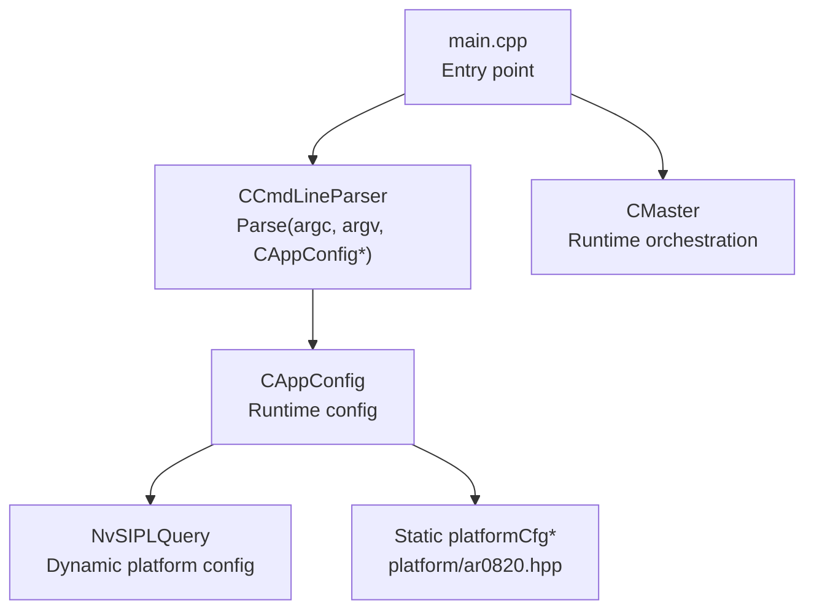
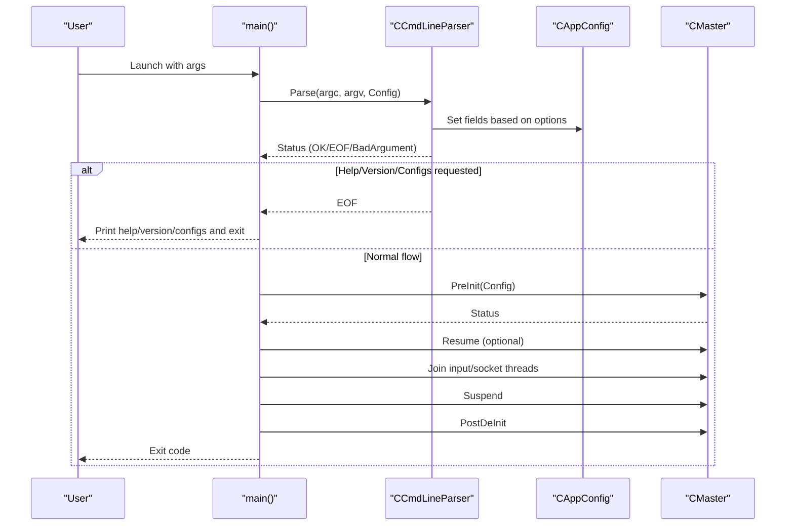
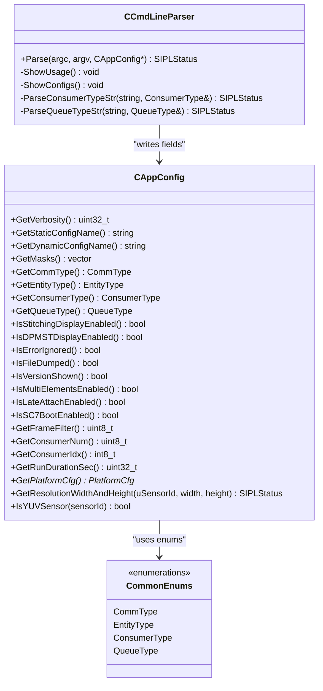

# Command Line Interface

<cite>
**Referenced Files in This Document**
- [CCmdLineParser.hpp](file://CCmdLineParser.hpp)
- [CCmdLineParser.cpp](file://CCmdLineParser.cpp)
- [CAppConfig.hpp](file://CAppConfig.hpp)
- [CAppConfig.cpp](file://CAppConfig.cpp)
- [Common.hpp](file://Common.hpp)
- [main.cpp](file://main.cpp)
- [README.md](file://README.md)
- [platform/ar0820.hpp](file://platform/ar0820.hpp)
</cite>

## Table of Contents
1. [Introduction](#introduction)
2. [Project Structure](#project-structure)
3. [Core Components](#core-components)
4. [Architecture Overview](#architecture-overview)
5. [Detailed Component Analysis](#detailed-component-analysis)
6. [Dependency Analysis](#dependency-analysis)
7. [Performance Considerations](#performance-considerations)
8. [Troubleshooting Guide](#troubleshooting-guide)
9. [Conclusion](#conclusion)
10. [Appendices](#appendices)

## Introduction
This document describes the command-line interface system used by the NVIDIA SIPL Multicast sample application. It focuses on the CCmdLineParser implementation, the supported command-line arguments, parameter validation, and the relationship with CAppConfig for configuration mapping and validation. It also covers argument parsing logic, error handling, help message generation, and provides usage examples for single-process operation, inter-process communication, multi-camera setups, and various consumer configurations. Finally, it documents parameter precedence between command-line arguments and configuration files, and offers troubleshooting guidance and best practices for automation scripts.

## Project Structure
The CLI system is centered around two primary components:
- CCmdLineParser: Parses command-line arguments and populates a CAppConfig instance.
- CAppConfig: Holds runtime configuration values and resolves platform configurations (dynamic or static).

These components integrate with the application entry point (main.cpp) and platform configuration definitions (platform/*.hpp).

**Diagram sources**
- [main.cpp:253-303](file://main.cpp#L253-L303)
- [CCmdLineParser.cpp:13-208](file://CCmdLineParser.cpp#L13-L208)
- [CAppConfig.cpp:21-75](file://CAppConfig.cpp#L21-L75)
- [platform/ar0820.hpp:14-183](file://platform/ar0820.hpp#L14-L183)

**Section sources**
- [main.cpp:253-303](file://main.cpp#L253-L303)
- [CCmdLineParser.hpp:34-44](file://CCmdLineParser.hpp#L34-L44)
- [CAppConfig.hpp:19-80](file://CAppConfig.hpp#L19-L80)

## Core Components
- CCmdLineParser
  - Public method: Parse(int argc, char *argv[], CAppConfig *pAppConfig)
  - Private helpers: ShowUsage(), ShowConfigs(), ParseConsumerTypeStr(), ParseQueueTypeStr()
  - Uses getopt_long for POSIX-compliant option parsing and validates ranges and combinations.
- CAppConfig
  - Holds runtime configuration fields (verbosity, platform config selection, consumer type, queue type, frame filter, run duration, consumer count/index, display modes, flags).
  - Provides GetPlatformCfg() to resolve either dynamic platform configuration via NvSIPLQuery or static platformCfg* from platform headers.
  - Exposes getters for all configuration fields and helper methods for sensor resolution and format checks.

Key configuration fields and defaults:
- Verbosity: default 1
- Static platform config name: default empty (resolved to a static platform)
- Dynamic platform config name: default empty
- Link enable masks: vector of uint32_t (empty by default)
- Communication type: default intra-process
- Entity type: default producer
- Consumer type: default encoder
- Queue type: default FIFO
- Frame filter: default 1
- Run duration: default 0 (no time limit)
- Consumer count: default 2
- Consumer index: default -1 (no specific index)
- Display modes: stitching or DP-MST disabled by default
- Flags: ignore error, file dump, show version, multi-elements, late attach, SC7 boot disabled by default

**Section sources**
- [CCmdLineParser.hpp:34-44](file://CCmdLineParser.hpp#L34-L44)
- [CCmdLineParser.cpp:13-208](file://CCmdLineParser.cpp#L13-L208)
- [CAppConfig.hpp:19-80](file://CAppConfig.hpp#L19-L80)
- [CAppConfig.cpp:21-75](file://CAppConfig.cpp#L21-L75)

## Architecture Overview
The CLI parsing flow integrates with the application lifecycle as follows:
- main() constructs CAppConfig and CCmdLineParser.
- If arguments are present, CCmdLineParser.Parse(...) updates CAppConfig and may print help/version/config lists.
- After optional help/version/config output, main() proceeds to initialize CMaster with the resolved configuration.

**Diagram sources**
- [main.cpp:253-303](file://main.cpp#L253-L303)
- [CCmdLineParser.cpp:13-208](file://CCmdLineParser.cpp#L13-L208)

## Detailed Component Analysis

### CCmdLineParser Implementation
- Supported options and behavior:
  - -h, --help: Prints usage and exits with EOF.
  - -V, --version: Sets version flag and exits with success.
  - -l: Lists supported platform configurations and exits with EOF.
  - -v, --verbosity <level>: Sets verbosity level.
  - -t <platformCfgName>: Selects static platform configuration.
  - -g, --platform-config <name>: Selects dynamic platform configuration (non-safety builds).
  - --link-enable-masks <masks>: Sets link enable masks (non-safety builds).
  - -L, --late-attach: Enables late-attach mode (non-safety builds).
  - -p: Inter-process producer in this process.
  - -c 'type': Inter-process consumer in this process; type supports 'enc' or 'cuda'.
  - -P: Inter-chip producer in this process.
  - -C 'type': Inter-chip consumer in this process; type supports 'enc' or 'cuda'.
  - -f, --filedump: Enables dumping output to files on consumers.
  - -k, --frameFilter <n>: Processes every Nth frame; range 1–5.
  - -q 'f|F|m|M': Selects queue type: FIFO or Mailbox.
  - -r, --runfor <seconds>: Stops after N seconds.
  - -d 'stitch|mst': Enables stitching display or DP-MST display.
  - -e, --multiElem: Enables multiple ISP elements (ISP0/ISP1) use case.
  - -7: Enables SC7 boot mode.
  - -n <count>: Sets total number of consumers (range 1–8).
  - -i <index>: Sets consumer index (range 0..count-1 or -1 to disable).
  - -I: Ignores fatal errors.
  - --nito <folder>: Sets path to NITO files.

- Validation rules enforced during parsing:
  - Frame filter must be within 1–5.
  - Consumer count must be within 1–8.
  - Consumer index must be within 0..count-1 or -1.
  - Dynamic config and link masks must be provided together (non-safety builds).
  - Dynamic and static platform configs cannot be set simultaneously (non-safety builds).
  - Unknown or invalid options trigger help printing and return bad argument.

- Help and configuration listing:
  - ShowUsage prints a comprehensive help message including option semantics and supported values.
  - ShowConfigs lists dynamic platform configurations (via NvSIPLQuery) and static platform configurations.

- Consumer and queue type parsing:
  - Consumer type 'enc' sets encoder consumer; 'cuda' sets CUDA consumer.
  - Queue type 'f|F' selects FIFO; 'm|M' selects Mailbox.

- Safety build differences:
  - Some options (e.g., dynamic platform config, link masks, late-attach) are omitted in safety builds.

**Section sources**
- [CCmdLineParser.cpp:13-208](file://CCmdLineParser.cpp#L13-L208)
- [CCmdLineParser.cpp:238-312](file://CCmdLineParser.cpp#L238-L312)
- [CCmdLineParser.hpp:34-44](file://CCmdLineParser.hpp#L34-L44)

### CAppConfig and Configuration Resolution
- Fields and defaults:
  - Verbosity, consumer type, queue type, frame filter, run duration, consumer count/index, flags, and display modes initialized to safe defaults.
  - Platform configuration selection fields initialized to empty/default.

- Platform configuration resolution:
  - If dynamic config name is set, GetPlatformCfg() uses NvSIPLQuery to parse database, locate the named platform configuration, apply link masks, and return the resolved configuration.
  - Otherwise, GetPlatformCfg() selects a static platformCfg* based on the static config name, defaulting to a known platform if unspecified.

- Helper methods:
  - GetResolutionWidthAndHeight(uSensorId, width, height): Looks up sensor resolution by ID.
  - IsYUVSensor(sensorId): Determines if a sensor uses YUV input format.

- Relationship with CCmdLineParser:
  - CCmdLineParser writes parsed values into CAppConfig fields.
  - CAppConfig exposes getters consumed by CMaster and other subsystems.

**Section sources**
- [CAppConfig.hpp:19-80](file://CAppConfig.hpp#L19-L80)
- [CAppConfig.cpp:21-75](file://CAppConfig.cpp#L21-L75)
- [CAppConfig.cpp:77-108](file://CAppConfig.cpp#L77-L108)

### Argument Parsing Logic and Error Handling
- Parsing loop:
  - Uses getopt_long to iterate through options.
  - Recognizes both short and long forms.
  - Collects values into CAppConfig fields and sets flags.

- Early exits:
  - Help/version/config listing triggers immediate return with EOF.
  - Validation failures return bad argument status.

- Error messages:
  - Invalid options prompt help.
  - Range violations print specific error messages.
  - Combination constraints print explanatory messages.

- Return codes:
  - EOF for help/version/config requests.
  - Bad argument for invalid values or conflicting options.
  - OK for successful parsing.

**Section sources**
- [CCmdLineParser.cpp:13-208](file://CCmdLineParser.cpp#L13-L208)

### Help Message Generation
- ShowUsage prints:
  - Option summaries with short/long forms.
  - Supported values for verbosity (non-safety builds).
  - Descriptions for dynamic/static platform configuration selection.
  - Guidance for link enable masks and late-attach (non-safety builds).
  - Consumer types and queue types.

**Section sources**
- [CCmdLineParser.cpp:238-312](file://CCmdLineParser.cpp#L238-L312)

### Parameter Precedence Between CLI and Configuration Files
- The CLI parser does not read configuration files directly.
- CAppConfig.GetPlatformCfg() resolves platform configuration:
  - If a dynamic config name is provided via CLI, it takes precedence over static selection.
  - If neither dynamic nor static is specified, a default static platform is selected.
- Other CLI flags (e.g., verbosity, consumer type, queue type, frame filter, run duration, consumer count/index, display modes, flags) are set by CLI and persist as runtime configuration.

Note: There is no explicit mechanism in the provided code to load defaults from a configuration file. The precedence is therefore:
- Dynamic platform configuration (CLI) > Static platform configuration (CLI) > Default static platform (hardcoded).
- CLI flags override any implicit defaults.

**Section sources**
- [CAppConfig.cpp:21-75](file://CAppConfig.cpp#L21-L75)
- [CCmdLineParser.cpp:67-69](file://CCmdLineParser.cpp#L67-L69)
- [CCmdLineParser.cpp:88](file://CCmdLineParser.cpp#L88)

### Usage Examples
Below are representative examples derived from the README and CLI behavior. Replace placeholders with actual values as needed.

- Single-process operation
  - Start producer, CUDA consumer, and encoder consumer in a single process:
    - ./nvsipl_multicast
  - Show version:
    - ./nvsipl_multicast -V
  - Dump files on consumers:
    - ./nvsipl_multicast -f
  - Process every 2nd frame:
    - ./nvsipl_multicast -k 2
  - Run for 5 seconds:
    - ./nvsipl_multicast -r 5
  - List available platform configurations:
    - ./nvsipl_multicast -l
  - Use a dynamic platform configuration with link masks (non-safety):
    - ./nvsipl_multicast -g "<platform>" -m "<mask1> <mask2> ..."
  - Specify a static platform configuration:
    - ./nvsipl_multicast -t "<platform>"
  - Enable camera stitching and display:
    - ./nvsipl_multicast -d stitch
  - Enable DP-MST and display:
    - ./nvsipl_multicast -d mst
  - Enable multiple ISP outputs (ISP0/ISP1) and multiple elements:
    - ./nvsipl_multicast -e

- Inter-process (P2P)
  - Producer process:
    - ./nvsipl_multicast -p
  - CUDA consumer process:
    - ./nvsipl_multicast -c "cuda"
  - Encoder consumer process:
    - ./nvsipl_multicast -c "enc"
  - Run with a dynamic platform configuration (ensure consistency across producer and consumers):
    - ./nvsipl_multicast -g "<platform>" -m "<masks>" -p
    - ./nvsipl_multicast -g "<platform>" -m "<masks>" -c "cuda"
    - ./nvsipl_multicast -g "<platform>" -m "<masks>" -c "enc"
  - Enable multiple ISP outputs:
    - ./nvsipl_multicast -p -e
    - ./nvsipl_multicast -c "cuda" -e
    - ./nvsipl_multicast -c "enc" -e

- Inter-chip (C2C)
  - Producer process:
    - ./nvsipl_multicast -P
  - CUDA consumer process:
    - ./nvsipl_multicast -C "cuda"
  - Encoder consumer process:
    - ./nvsipl_multicast -C "enc"

- Late-/re-attach (Linux/QNX standard OS)
  - Producer:
    - ./nvsipl_multicast -g "<platform>" -m "<masks>" -p --late-attach
  - Early consumer (encoder):
    - ./nvsipl_multicast -g "<platform>" -m "<masks>" -c "enc" --late-attach
  - Late consumer (CUDA):
    - ./nvsipl_multicast -g "<platform>" -m "<masks>" -c "cuda" --late-attach
  - Attach/Detach commands in producer console:
    - Enter "at" to attach, "de" to detach.

- Multi-camera and multi-consumer setups
  - Set total consumers and index:
    - ./nvsipl_multicast -n 4 -i 1
  - Use FIFO vs Mailbox queues:
    - ./nvsipl_multicast -q f
    - ./nvsipl_multicast -q m

- Display modes
  - Enable stitching display:
    - ./nvsipl_multicast -d stitch
  - Enable DP-MST display:
    - ./nvsipl_multicast -d mst

- Ignoring fatal errors
  - ./nvsipl_multicast -I

- NITO files path
  - ./nvsipl_multicast --nito "/path/to/nito/folder"

**Section sources**
- [README.md:16-109](file://README.md#L16-L109)
- [CCmdLineParser.cpp:67-69](file://CCmdLineParser.cpp#L67-L69)
- [CCmdLineParser.cpp:88](file://CCmdLineParser.cpp#L88)
- [CCmdLineParser.cpp:132-141](file://CCmdLineParser.cpp#L132-L141)
- [CCmdLineParser.cpp:148-153](file://CCmdLineParser.cpp#L148-L153)
- [CCmdLineParser.cpp:168-172](file://CCmdLineParser.cpp#L168-L172)
- [CCmdLineParser.cpp:197-206](file://CCmdLineParser.cpp#L197-L206)

## Dependency Analysis
- CCmdLineParser depends on:
  - getopt.h for option parsing.
  - CAppConfig for storing parsed values.
  - NvSIPLTrace/NvSIPLQuery for logging and platform configuration queries (non-safety builds).
  - Platform headers for static configuration names.

- CAppConfig depends on:
  - NvSIPLQuery for dynamic configuration resolution (non-safety builds).
  - Platform headers for static configuration selection.

- main() orchestrates:
  - CCmdLineParser.Parse(...)
  - CMaster initialization and lifecycle management.

**Diagram sources**
- [CCmdLineParser.hpp:34-44](file://CCmdLineParser.hpp#L34-L44)
- [CAppConfig.hpp:19-80](file://CAppConfig.hpp#L19-L80)
- [Common.hpp:35-66](file://Common.hpp#L35-L66)

**Section sources**
- [CCmdLineParser.hpp:34-44](file://CCmdLineParser.hpp#L34-L44)
- [CAppConfig.hpp:19-80](file://CAppConfig.hpp#L19-L80)
- [Common.hpp:35-66](file://Common.hpp#L35-L66)

## Performance Considerations
- Frame filtering (-k) reduces processing load by skipping frames.
- FIFO vs Mailbox queue selection (-q) affects throughput and latency characteristics; choose FIFO for higher throughput or Mailbox for lower latency depending on workload.
- Limiting run duration (-r) helps control resource usage in test environments.
- Using dynamic platform configuration with link masks (-g and -m) allows precise control over active lanes, reducing unnecessary bandwidth.

[No sources needed since this section provides general guidance]

## Troubleshooting Guide
- Invalid option or unrecognized option:
  - Symptom: Immediate help is printed and process exits with bad argument.
  - Action: Review the help message and correct the option spelling or combination.

- Invalid frame filter value:
  - Symptom: Error indicating range 1–5.
  - Action: Set -k to a value within 1–5.

- Invalid consumer count or index:
  - Symptom: Error indicating acceptable ranges.
  - Action: Ensure -n is within 1–8 and -i is within 0..n-1 or -1.

- Dynamic config and link masks mismatch:
  - Symptom: Error stating dynamic config and masks must be set together.
  - Action: Provide both -g and -m, or neither.

- Conflicting platform configurations:
  - Symptom: Error stating dynamic and static configs cannot be set together.
  - Action: Choose either -g or -t, not both.

- Late-attach enabled without masks:
  - Symptom: Error indicating masks must be provided when late-attach is enabled.
  - Action: Add link enable masks (-m) when using --late-attach.

- Help/version/config listing:
  - Symptom: Program exits after printing help/version/configs.
  - Action: Use -h for help, -V for version, -l for configs.

- Ignoring fatal errors:
  - Symptom: Application continues despite errors.
  - Action: Use -I to ignore fatal errors; otherwise remove the flag to enforce strict behavior.

**Section sources**
- [CCmdLineParser.cpp:58-62](file://CCmdLineParser.cpp#L58-L62)
- [CCmdLineParser.cpp:169-172](file://CCmdLineParser.cpp#L169-L172)
- [CCmdLineParser.cpp:197-206](file://CCmdLineParser.cpp#L197-L206)
- [CCmdLineParser.cpp:184-195](file://CCmdLineParser.cpp#L184-L195)

## Conclusion
The command-line interface system in the NVIDIA SIPL Multicast project provides a robust, validated configuration mechanism that maps CLI options to runtime configuration fields. CCmdLineParser enforces strict validation and produces helpful diagnostics, while CAppConfig centralizes configuration resolution and exposes getters for downstream components. The system supports single-process, inter-process, and inter-chip scenarios, with clear guidance for multi-camera and multi-consumer setups. Understanding parameter precedence and applying the troubleshooting steps outlined above ensures reliable automation and deployment.

[No sources needed since this section summarizes without analyzing specific files]

## Appendices

### Appendix A: Option Reference
- -h, --help: Print help and exit.
- -V, --version: Print version and exit.
- -l: List supported platform configurations and exit.
- -v, --verbosity <level>: Set verbosity level.
- -t <platformCfgName>: Select static platform configuration.
- -g, --platform-config <name>: Select dynamic platform configuration (non-safety).
- --link-enable-masks <masks>: Enable masks for links (non-safety).
- -L, --late-attach: Enable late-attach (non-safety).
- -p: Inter-process producer in this process.
- -c 'type': Inter-process consumer in this process ('enc' or 'cuda').
- -P: Inter-chip producer in this process.
- -C 'type': Inter-chip consumer in this process ('enc' or 'cuda').
- -f, --filedump: Dump output to files on consumers.
- -k, --frameFilter <n>: Process every Nth frame (1–5).
- -q 'f|F|m|M': Select queue type (FIFO or Mailbox).
- -r, --runfor <seconds>: Exit after N seconds.
- -d 'stitch|mst': Enable stitching or DP-MST display.
- -e, --multiElem: Enable multiple ISP elements.
- -7: Enable SC7 boot mode.
- -n <count>: Total number of consumers (1–8).
- -i <index>: Consumer index (0..count-1 or -1).
- -I: Ignore fatal errors.
- --nito <folder>: Path to NITO files.

**Section sources**
- [CCmdLineParser.cpp:238-312](file://CCmdLineParser.cpp#L238-L312)

### Appendix B: Static Platform Configurations
- F008A120RM0AV2_CPHY_x4
- V1SIM623S4RU5195NB3_CPHY_x4
- V1SIM728S1RU3120NB20_CPHY_x4
- MAX96712_YUV_8_TPG_CPHY_x4
- MAX96712_2880x1860_YUV_8_TPG_DPHY_x4
- ISX031_YUYV_CPHY_x4

These are resolved by CAppConfig.GetPlatformCfg() when -t is used or when no dynamic configuration is provided.

**Section sources**
- [CAppConfig.cpp:53-68](file://CAppConfig.cpp#L53-L68)
- [platform/ar0820.hpp:14-183](file://platform/ar0820.hpp#L14-L183)