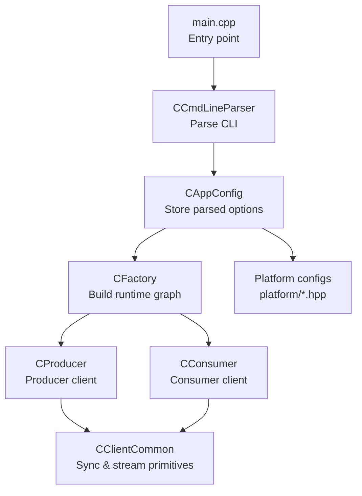
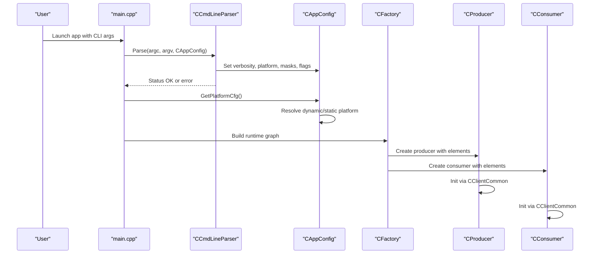
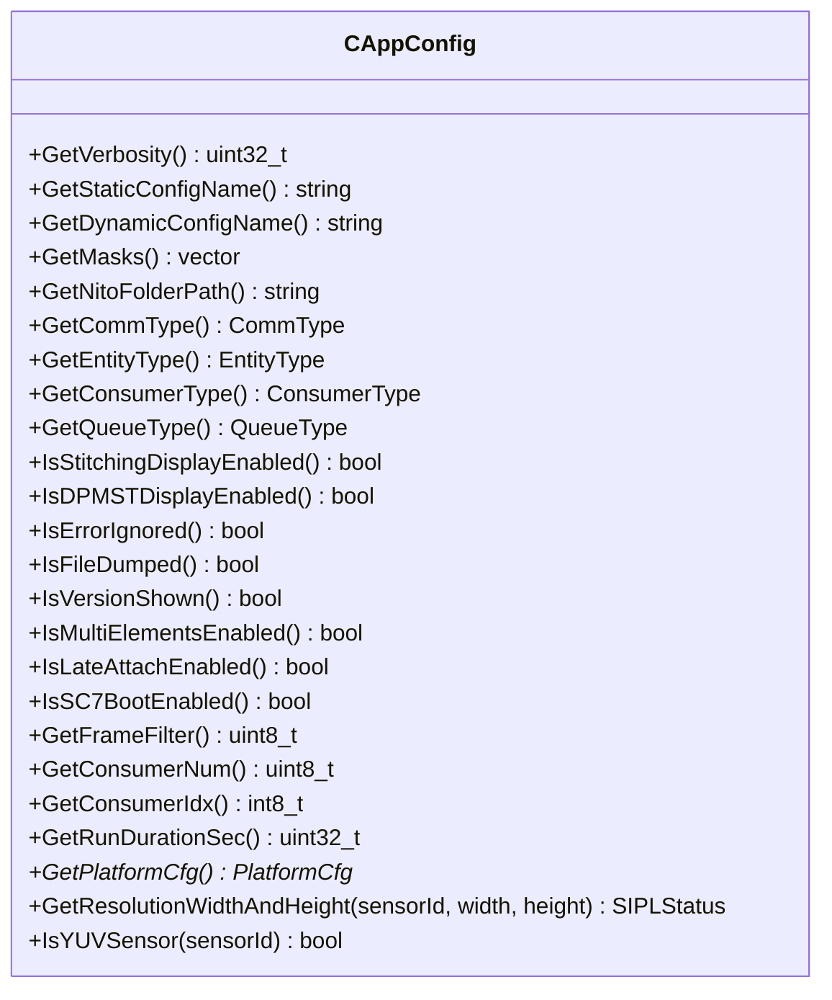
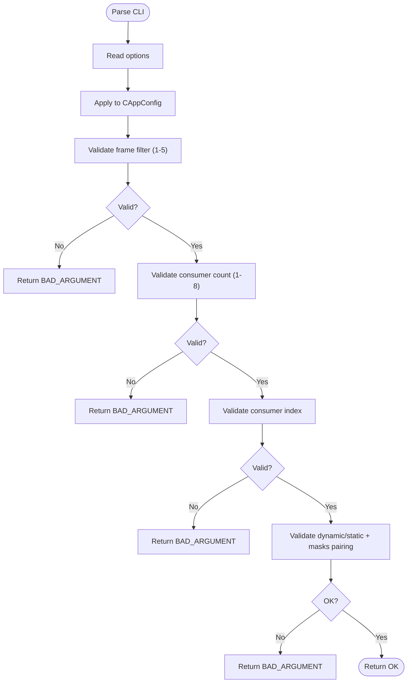
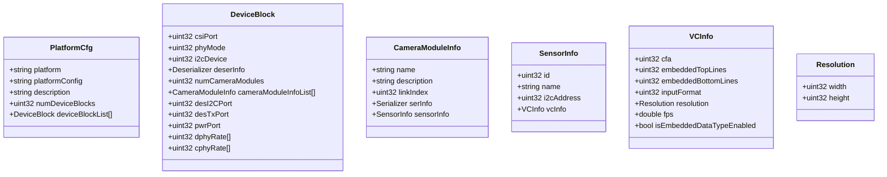
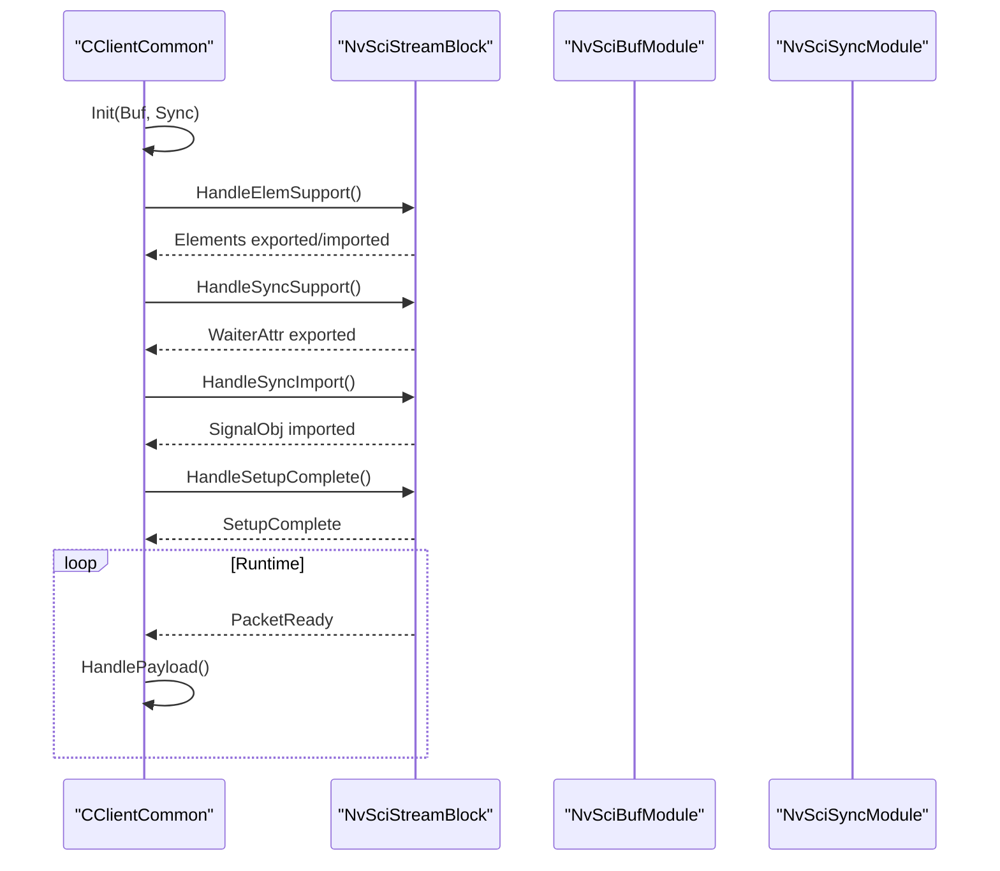
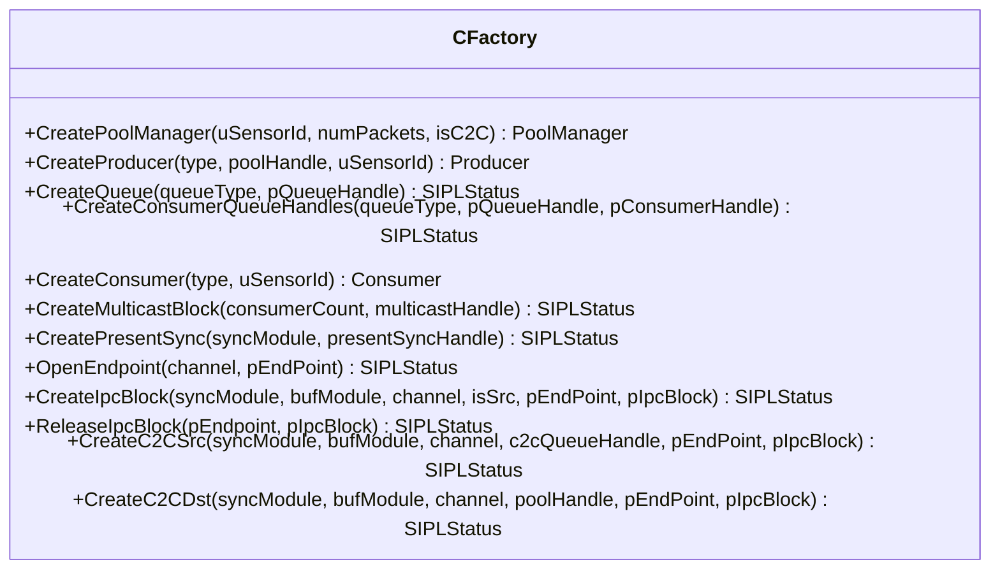
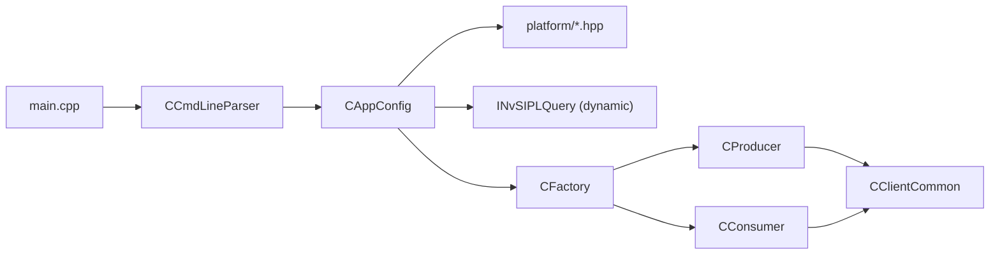

# Configuration System

<cite>
**Referenced Files in This Document**
- [CAppConfig.hpp](file://CAppConfig.hpp)
- [CAppConfig.cpp](file://CAppConfig.cpp)
- [CCmdLineParser.hpp](file://CCmdLineParser.hpp)
- [CCmdLineParser.cpp](file://CCmdLineParser.cpp)
- [CClientCommon.hpp](file://CClientCommon.hpp)
- [CClientCommon.cpp](file://CClientCommon.cpp)
- [ar0820.hpp](file://platform/ar0820.hpp)
- [imx623vb2.hpp](file://platform/imx623vb2.hpp)
- [imx728vb2.hpp](file://platform/imx728vb2.hpp)
- [max96712_tpg_yuv.hpp](file://platform/max96712_tpg_yuv.hpp)
- [isx031.hpp](file://platform/isx031.hpp)
- [Common.hpp](file://Common.hpp)
- [CFactory.hpp](file://CFactory.hpp)
- [CFactory.cpp](file://CFactory.cpp)
- [CConsumer.hpp](file://CConsumer.hpp)
- [CProducer.hpp](file://CProducer.hpp)
- [CPeerValidator.cpp](file://CPeerValidator.cpp)
- [CUtils.hpp](file://CUtils.hpp)
- [main.cpp](file://main.cpp)
</cite>

## Table of Contents
1. [Introduction](#introduction)
2. [Project Structure](#project-structure)
3. [Core Components](#core-components)
4. [Architecture Overview](#architecture-overview)
5. [Detailed Component Analysis](#detailed-component-analysis)
6. [Dependency Analysis](#dependency-analysis)
7. [Performance Considerations](#performance-considerations)
8. [Troubleshooting Guide](#troubleshooting-guide)
9. [Conclusion](#conclusion)
10. [Appendices](#appendices)

## Introduction
This document describes the configuration system for the NVIDIA SIPL Multicast project. It focuses on:
- Application-wide configuration via CAppConfig
- Command-line interface processing via CCmdLineParser
- Platform configuration options for sensors and aggregators
- Shared synchronization and streaming primitives via CClientCommon
- Configuration precedence, validation rules, and practical examples

The goal is to enable reliable multi-camera setups, consumer combinations, and platform-specific optimizations with clear troubleshooting guidance.

## Project Structure
The configuration system spans several modules:
- Application configuration: CAppConfig and CCmdLineParser
- Platform definitions: platform/<sensor>.hpp files
- Runtime configuration consumers: CFactory, CConsumer, CProducer
- Synchronization and streaming: CClientCommon
- Utilities and constants: Common.hpp, CUtils.hpp
- Entry point: main.cpp

**Diagram sources**
- [main.cpp:253-303](file://main.cpp#L253-L303)
- [CCmdLineParser.cpp:13-208](file://CCmdLineParser.cpp#L13-L208)
- [CAppConfig.cpp:21-75](file://CAppConfig.cpp#L21-L75)
- [CFactory.cpp:68-94](file://CFactory.cpp#L68-L94)
- [CProducer.hpp:16-51](file://CProducer.hpp#L16-L51)
- [CConsumer.hpp:16-44](file://CConsumer.hpp#L16-L44)
- [CClientCommon.hpp:47-199](file://CClientCommon.hpp#L47-L199)

**Section sources**
- [main.cpp:253-303](file://main.cpp#L253-L303)
- [CAppConfig.hpp:19-80](file://CAppConfig.hpp#L19-L80)
- [CCmdLineParser.hpp:34-44](file://CCmdLineParser.hpp#L34-L44)
- [CFactory.hpp:27-92](file://CFactory.hpp#L27-L92)
- [CClientCommon.hpp:47-199](file://CClientCommon.hpp#L47-L199)

## Core Components
- CAppConfig: Central configuration holder for runtime behavior, platform selection, and consumer/queue types. Provides platform configuration retrieval and sensor resolution queries.
- CCmdLineParser: Parses CLI options into CAppConfig, validates ranges, and prints usage/help.
- Platform configs: Static definitions per sensor/aggregator in platform/*.hpp.
- CClientCommon: Base class for producers/consumers providing NvSciBuf/NvSciSync setup, packet lifecycle, and synchronization primitives.
- CFactory: Builds runtime components (producers, consumers, queues, multicast blocks) based on CAppConfig.

Key responsibilities:
- Precedence: CLI options populate CAppConfig; CAppConfig selects platform; CFactory derives element sets and consumer/producer types.
- Validation: Range checks for frame filter, consumer count, and consumer index; mutual exclusion for dynamic/static platform configs; mask pairing requirement.

**Section sources**
- [CAppConfig.hpp:19-80](file://CAppConfig.hpp#L19-L80)
- [CAppConfig.cpp:21-109](file://CAppConfig.cpp#L21-L109)
- [CCmdLineParser.cpp:13-208](file://CCmdLineParser.cpp#L13-L208)
- [CFactory.cpp:24-205](file://CFactory.cpp#L24-L205)
- [CClientCommon.cpp:95-112](file://CClientCommon.cpp#L95-L112)

## Architecture Overview
The configuration pipeline:
1. main() constructs CAppConfig and CCmdLineParser
2. CCmdLineParser populates CAppConfig with CLI options and validates them
3. CAppConfig resolves platform configuration (dynamic via SIPL Query or static from platform/*.hpp)
4. CFactory builds producers/consumers and sets element info based on CAppConfig
5. CClientCommon manages NvSciBuf/NvSciSync attributes and packet lifecycle

**Diagram sources**
- [main.cpp:253-288](file://main.cpp#L253-L288)
- [CCmdLineParser.cpp:13-208](file://CCmdLineParser.cpp#L13-L208)
- [CAppConfig.cpp:21-75](file://CAppConfig.cpp#L21-L75)
- [CFactory.cpp:68-94](file://CFactory.cpp#L68-L94)
- [CProducer.hpp:16-51](file://CProducer.hpp#L16-L51)
- [CConsumer.hpp:16-44](file://CConsumer.hpp#L16-L44)

## Detailed Component Analysis

### CAppConfig: Application-wide configuration
Responsibilities:
- Store and expose runtime flags: verbosity, consumer type, queue type, display modes, frame filter, run duration, consumer count/index, and platform selection.
- Resolve platform configuration:
  - Dynamic: Uses INvSIPLQuery to parse database, fetch platform config, apply masks.
  - Static: Selects among platformCfgAr0820, platformCfgIMX623VB2, platformCfgIMX728VB2, platformCfgMax96712TPGYUV(_5m), platformCfgIsx031.
- Provide sensor metadata helpers: GetResolutionWidthAndHeight, IsYUVSensor.

Important behaviors:
- Platform resolution is lazy-evaluated; first call to GetPlatformCfg() triggers resolution.
- Mask application occurs only with dynamic configs.

**Diagram sources**
- [CAppConfig.hpp:19-80](file://CAppConfig.hpp#L19-L80)

**Section sources**
- [CAppConfig.hpp:19-80](file://CAppConfig.hpp#L19-L80)
- [CAppConfig.cpp:21-109](file://CAppConfig.cpp#L21-L109)

### CCmdLineParser: Command-line interface processing
Responsibilities:
- Parse CLI options into CAppConfig
- Validate ranges and mutual exclusions
- Print usage and supported platform lists

Key validations:
- Frame filter: 1–5
- Consumer count: 1–8
- Consumer index: 0..(consumerNum-1) or -1 (all)
- Dynamic config and link masks must be paired
- Dynamic and static platform configs cannot be set together

Supported options summary:
- Verbosity, platform selection, masks, late attach, file dump, frame filter, version, run duration, display modes, multi-elements, SC7 boot, consumer count/index, consumer type, queue type.

**Diagram sources**
- [CCmdLineParser.cpp:13-208](file://CCmdLineParser.cpp#L13-L208)

**Section sources**
- [CCmdLineParser.hpp:34-44](file://CCmdLineParser.hpp#L34-L44)
- [CCmdLineParser.cpp:13-208](file://CCmdLineParser.cpp#L13-L208)

### Platform configuration options
Platform configs define device blocks, camera modules, serializers, deserializers, and sensor capabilities. Supported static platforms:
- AR0820: Two camera modules on CSI-A/B, CPHY, RAW12, 3848x2168@30fps
- IMX623VB2: Two camera modules, CPHY, RAW12RJ
- IMX728VB2: Two camera modules, CPHY, RAW12RJ
- MAX96712 TPG YUV: Two TPG modules, YUV422, 1920x1236 or 2880x1860
- ISX031: Two modules on links 2–3, YUV422, 1920x1536@30fps

Dynamic platform configuration:
- Uses INvSIPLQuery to fetch platform configs and apply link masks per deserializer.

**Diagram sources**
- [ar0820.hpp:14-183](file://platform/ar0820.hpp#L14-L183)
- [imx623vb2.hpp:14-163](file://platform/imx623vb2.hpp#L14-L163)
- [imx728vb2.hpp:14-162](file://platform/imx728vb2.hpp#L14-L162)
- [max96712_tpg_yuv.hpp:14-238](file://platform/max96712_tpg_yuv.hpp#L14-L238)
- [isx031.hpp:14-117](file://platform/isx031.hpp#L14-L117)

**Section sources**
- [CAppConfig.cpp:53-71](file://CAppConfig.cpp#L53-L71)
- [ar0820.hpp:14-183](file://platform/ar0820.hpp#L14-L183)
- [imx623vb2.hpp:14-163](file://platform/imx623vb2.hpp#L14-L163)
- [imx728vb2.hpp:14-162](file://platform/imx728vb2.hpp#L14-L162)
- [max96712_tpg_yuv.hpp:14-238](file://platform/max96712_tpg_yuv.hpp#L14-L238)
- [isx031.hpp:14-117](file://platform/isx031.hpp#L14-L117)

### CClientCommon: Shared synchronization and streaming primitives
Responsibilities:
- Initialize NvSciBuf and NvSciSync modules
- Manage element attributes (data/meta) and packet lifecycle
- Handle NvSciStream events: Elements, PacketCreate, PacketsComplete, WaiterAttr, SignalObj, SetupComplete, PacketReady, Error, Disconnected
- Support CPU wait contexts and signal/waiter sync objects reconciliation
- Cookie-based packet indexing and mapping

Key flows:
- Element support export/import
- Sync attribute reconciliation and allocation
- Packet creation and buffer mapping
- Payload handling and completion signaling

**Diagram sources**
- [CClientCommon.cpp:95-112](file://CClientCommon.cpp#L95-L112)
- [CClientCommon.cpp:135-201](file://CClientCommon.cpp#L135-L201)
- [CClientCommon.cpp:300-325](file://CClientCommon.cpp#L300-L325)
- [CClientCommon.cpp:327-365](file://CClientCommon.cpp#L327-L365)
- [CClientCommon.cpp:469-553](file://CClientCommon.cpp#L469-L553)
- [CClientCommon.cpp:555-591](file://CClientCommon.cpp#L555-L591)

**Section sources**
- [CClientCommon.hpp:47-199](file://CClientCommon.hpp#L47-L199)
- [CClientCommon.cpp:95-634](file://CClientCommon.cpp#L95-L634)

### CFactory: Runtime configuration consumers
Responsibilities:
- Build pools, queues, producers, consumers
- Derive element info per sensor and consumer type
- Respect multi-elements and YUV sensor flags

Highlights:
- Basic elements: ICP_RAW, METADATA; optional NV12_BL and NV12_PL depending on multi-elements and sensor format
- Producer elements: ICP_RAW plus NV12_* if applicable; Display producer adds ABGR8888_PL
- Consumer elements: Enc/Cuda/Stitch/Display choose appropriate elements based on flags and sensor format

**Diagram sources**
- [CFactory.hpp:27-92](file://CFactory.hpp#L27-L92)

**Section sources**
- [CFactory.cpp:24-205](file://CFactory.cpp#L24-L205)

## Dependency Analysis
- main.cpp depends on CCmdLineParser and CAppConfig to initialize configuration, then on CMaster (not shown here) to orchestrate runtime.
- CAppConfig depends on platform/*.hpp for static configs and optionally INvSIPLQuery for dynamic configs.
- CFactory depends on CAppConfig for runtime decisions and builds CProducer/CConsumer instances.
- CProducer/CConsumer depend on CClientCommon for stream/sync primitives.

**Diagram sources**
- [main.cpp:253-288](file://main.cpp#L253-L288)
- [CCmdLineParser.cpp:13-208](file://CCmdLineParser.cpp#L13-L208)
- [CAppConfig.cpp:21-75](file://CAppConfig.cpp#L21-L75)
- [CFactory.cpp:68-94](file://CFactory.cpp#L68-L94)
- [CProducer.hpp:16-51](file://CProducer.hpp#L16-L51)
- [CConsumer.hpp:16-44](file://CConsumer.hpp#L16-L44)

**Section sources**
- [main.cpp:253-288](file://main.cpp#L253-L288)
- [CAppConfig.cpp:21-75](file://CAppConfig.cpp#L21-L75)
- [CFactory.cpp:68-94](file://CFactory.cpp#L68-L94)

## Performance Considerations
- Frame filtering: Use frameFilter to reduce processing load when full-frame rate is unnecessary.
- Multi-elements: Enabling multi-elements splits outputs across ISP0/ISP1; ensure downstream consumers match element availability.
- Queue type: FIFO vs mailbox affects latency and throughput; choose based on consumer requirements.
- Consumer count/index: Tune consumerNum and consumerIdx to balance workload and resource usage.
- Display modes: DP-MST and stitching have different element requirements; pick the appropriate mode to avoid unnecessary conversions.

[No sources needed since this section provides general guidance]

## Troubleshooting Guide
Common issues and resolutions:
- Invalid frame filter: Ensure 1–5; otherwise parser returns BAD_ARGUMENT.
- Invalid consumer count or index: Ensure 1–8 for count and 0..(count-1) or -1 for index.
- Dynamic/static platform mismatch: Dynamic config and link masks must be set together; they cannot be mixed with static platform selection.
- YUV sensor handling: Consumers expecting YUV should use ICP_RAW element; RAW sensors should use NV12_* elements.
- Display mode misconfiguration: For stitching display, ensure proper element selection; for DP-MST, enable the correct flag.
- Peer validation mismatch: CPeerValidator compares platform and masks; ensure producer and consumer share identical static/dynamic platform and masks.

Operational tips:
- Use -l to list supported static platform configurations.
- Use -h/--help to review all CLI options and defaults.
- Enable higher verbosity (-v) for detailed logs during setup and runtime.

**Section sources**
- [CCmdLineParser.cpp:169-207](file://CCmdLineParser.cpp#L169-L207)
- [CCmdLineParser.cpp:184-195](file://CCmdLineParser.cpp#L184-L195)
- [CPeerValidator.cpp:65-92](file://CPeerValidator.cpp#L65-L92)

## Conclusion
The configuration system centers on CAppConfig and CCmdLineParser for robust runtime setup, with platform definitions encapsulated in platform/*.hpp and dynamic resolution via INvSIPLQuery. CFactory and CClientCommon provide the runtime graph and synchronization primitives, enabling flexible multi-camera and multi-consumer deployments. Adhering to validation rules and understanding element selection ensures reliable operation across diverse sensor and display configurations.

[No sources needed since this section summarizes without analyzing specific files]

## Appendices

### Configuration precedence and validation rules
- CLI options populate CAppConfig; dynamic/static platform selection is mutually exclusive with masks.
- Frame filter, consumer count, and consumer index are validated against fixed ranges.
- Platform resolution and masks are applied only for dynamic configs; static configs are selected by name.

**Section sources**
- [CCmdLineParser.cpp:169-207](file://CCmdLineParser.cpp#L169-L207)
- [CAppConfig.cpp:21-75](file://CAppConfig.cpp#L21-L75)

### Practical configuration scenarios
- Single camera, encoder consumer, FIFO queue:
  - Use -t with a static platform name; -c enc; -q f; set consumerNum=1, consumerIdx=-1.
- Dual camera, CUDA consumer, mailbox queue, multi-elements enabled:
  - Use -t with a RAW sensor platform; -c cuda; -q m; -e; set consumerNum=1, consumerIdx=-1.
- Multi-camera stitching display:
  - Use -t with a RAW sensor platform; -d stitch; ensure elements include ABGR8888_PL for display.
- DP-MST display:
  - Use -t with a RAW sensor platform; -d mst; enable DP-MST elements.
- Late attach/re-attach:
  - Use -L for dynamic platform setups requiring reconfiguration without restart.
- SC7 boot mode:
  - Use -7 to integrate with power management service; application waits for socket events.

**Section sources**
- [CCmdLineParser.cpp:238-279](file://CCmdLineParser.cpp#L238-L279)
- [CFactory.cpp:96-136](file://CFactory.cpp#L96-L136)
- [CFactory.cpp:138-151](file://CFactory.cpp#L138-L151)
- [CFactory.cpp:166-205](file://CFactory.cpp#L166-L205)

### Best practices
- Always validate platform selection against hardware; use -l to enumerate supported static configs.
- Match consumer element expectations with sensor format (YUV vs RAW).
- Keep frameFilter reasonable to balance quality and performance.
- Use multi-elements judiciously; ensure downstream consumers support split outputs.
- For dynamic platforms, pair masks with platform names and verify link connectivity.

[No sources needed since this section provides general guidance]