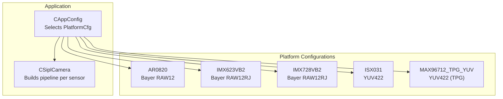
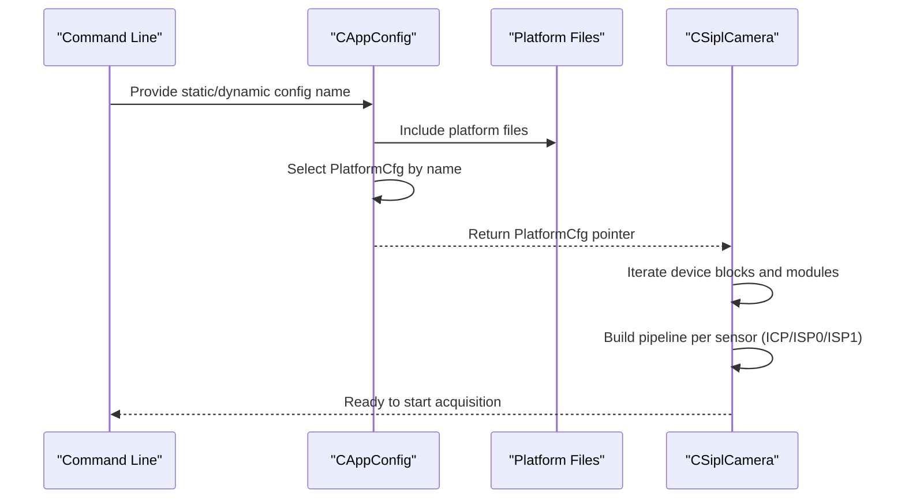
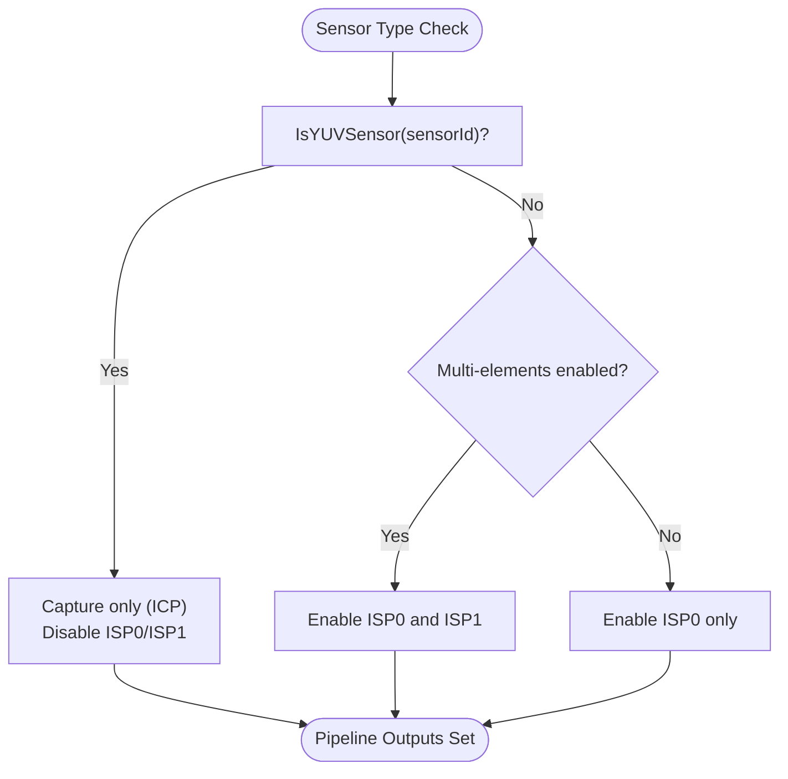
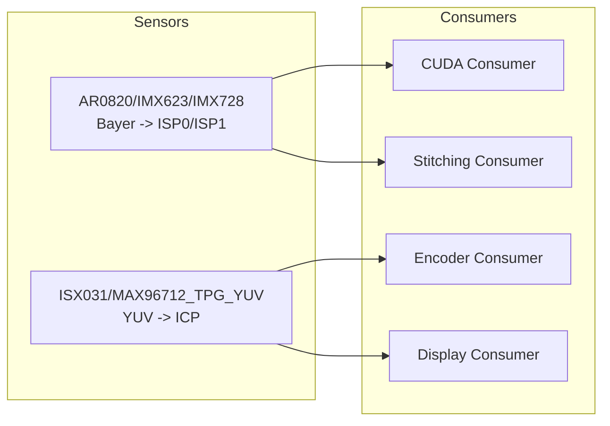
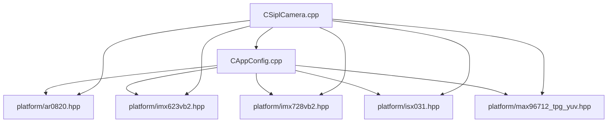

# Platform Configurations

<cite>
**Referenced Files in This Document**
- [ar0820.hpp](file://platform/ar0820.hpp)
- [imx623vb2.hpp](file://platform/imx623vb2.hpp)
- [imx728vb2.hpp](file://platform/imx728vb2.hpp)
- [isx031.hpp](file://platform/isx031.hpp)
- [max96712_tpg_yuv.hpp](file://platform/max96712_tpg_yuv.hpp)
- [CAppConfig.hpp](file://CAppConfig.hpp)
- [CAppConfig.cpp](file://CAppConfig.cpp)
- [CSiplCamera.hpp](file://CSiplCamera.hpp)
- [CSiplCamera.cpp](file://CSiplCamera.cpp)
- [Common.hpp](file://Common.hpp)
</cite>

## Table of Contents
1. [Introduction](#introduction)
2. [Project Structure](#project-structure)
3. [Core Components](#core-components)
4. [Architecture Overview](#architecture-overview)
5. [Detailed Component Analysis](#detailed-component-analysis)
6. [Dependency Analysis](#dependency-analysis)
7. [Performance Considerations](#performance-considerations)
8. [Troubleshooting Guide](#troubleshooting-guide)
9. [Conclusion](#conclusion)

## Introduction
This document explains platform-specific camera configurations in the NVIDIA SIPL Multicast project. It focuses on the platform files for AR0820, IMX623VB2, IMX728VB2, ISX031, and MAX96712_TPG_YUV, detailing the PlatformCfg structure and sensor-specific parameters such as resolution, format, timing, and ISP configurations. It also covers the differences between YUV sensors and Bayer sensors via IsYUVSensor(), the platform abstraction mechanism, sensor detection, automatic configuration selection, platform optimizations, hardware compatibility considerations, and troubleshooting tips. Finally, it documents how platform configurations relate to consumer types, especially for CUDA processing and display requirements.

## Project Structure
The platform configuration files define static PlatformCfg instances per platform. The application selects a configuration based on command-line/static configuration names and uses them to initialize the SIPL camera pipeline. The configuration selection logic resides in CAppConfig, while the camera pipeline adapts ISP outputs depending on whether the sensor is YUV or Bayer.

**Diagram sources**
- [CAppConfig.cpp:21-75](file://CAppConfig.cpp#L21-L75)
- [CSiplCamera.cpp:137-169](file://CSiplCamera.cpp#L137-L169)
- [ar0820.hpp:14-183](file://platform/ar0820.hpp#L14-L183)
- [imx623vb2.hpp:14-163](file://platform/imx623vb2.hpp#L14-L163)
- [imx728vb2.hpp:14-163](file://platform/imx728vb2.hpp#L14-L163)
- [isx031.hpp:14-117](file://platform/isx031.hpp#L14-L117)
- [max96712_tpg_yuv.hpp:14-125](file://platform/max96712_tpg_yuv.hpp#L14-L125)

**Section sources**
- [CAppConfig.cpp:21-75](file://CAppConfig.cpp#L21-L75)
- [CSiplCamera.cpp:137-169](file://CSiplCamera.cpp#L137-L169)

## Core Components
- PlatformCfg: A static configuration structure containing platform identifiers, device blocks, and per-sensor metadata. Each platform file defines one or more PlatformCfg instances.
- SensorInfo: Embedded within CameraModuleInfo, it specifies sensor ID, name, I2C address, pixel format, resolution, FPS, embedded data enablement, trigger mode, and optional TPG flags.
- VCInfo: Holds per-video-channel parameters such as color filter array order, embedded line counts, input format, resolution, FPS, and embedded data enablement.
- DeviceBlockInfo: Describes CSI port, PHY mode, deserializer, serializers, power/control ports, and rates.
- CAppConfig: Selects a PlatformCfg based on static/dynamic configuration names and exposes helpers like IsYUVSensor() and GetResolutionWidthAndHeight().
- CSiplCamera: Uses the selected PlatformCfg to build per-sensor pipelines, sets pipeline outputs (ICP/ISP0/ISP1), and registers auto control plugins for Bayer sensors.

Key helper functions:
- CAppConfig::IsYUVSensor(): Determines if a sensor uses YUV422 vs Bayer RAW formats.
- CAppConfig::GetResolutionWidthAndHeight(): Retrieves resolution for a given sensor ID.
- CSiplCamera::GetPipelineCfg(): Chooses pipeline outputs based on sensor type and multi-elements mode.

**Section sources**
- [CAppConfig.hpp:46-52](file://CAppConfig.hpp#L46-L52)
- [CAppConfig.cpp:77-108](file://CAppConfig.cpp#L77-L108)
- [CSiplCamera.hpp:71-85](file://CSiplCamera.hpp#L71-L85)
- [CSiplCamera.cpp:171-207](file://CSiplCamera.cpp#L171-L207)

## Architecture Overview
The configuration selection and pipeline setup flow:

**Diagram sources**
- [CAppConfig.cpp:21-75](file://CAppConfig.cpp#L21-L75)
- [CSiplCamera.cpp:137-169](file://CSiplCamera.cpp#L137-L169)

## Detailed Component Analysis

### PlatformCfg and Sensor-Specific Parameters
Each platform file defines a static PlatformCfg with:
- Platform identifiers and description
- Device block count and list
- Per-device block:
  - CSI port, PHY mode, I2C device
  - Deserializer info (name, I2C address, CDI API usage)
  - Number of camera modules and module list
  - Power/control ports, D-PHY/C-PHY rates, GPIOs, reset flags
- Per-camera module:
  - Module name, link index, serializer info, EEPROM info
  - SensorInfo with ID, name, I2C address, VCInfo, trigger mode, CDI API usage
- VCInfo includes:
  - Color filter order (Bayer vs YUV)
  - Embedded top/bottom lines
  - Input format (RAW12, RAW12RJ, YUV422)
  - Resolution (width/height)
  - FPS
  - Embedded data enablement

Examples by platform:
- AR0820: Two identical modules on C-PHY x4, Bayer RAW12, 3848x2168@30fps, GRBG CFA.
- IMX623VB2: Two identical modules on C-PHY x4, Bayer RAW12RJ, 1920x1536@30fps, RGGB CFA.
- IMX728VB2: Two identical modules on C-PHY x4, Bayer RAW12RJ, 3840x2160@30fps, RGGB CFA.
- ISX031: Two identical modules on C-PHY x4, YUV422, 1920x1536@30fps, YUYV order.
- MAX96712_TPG_YUV: Two identical modules on C-PHY x4, YUV422, 1920x1236@30fps (and 2880x1860 variant), TPG enabled.

**Section sources**
- [ar0820.hpp:14-183](file://platform/ar0820.hpp#L14-L183)
- [imx623vb2.hpp:14-163](file://platform/imx623vb2.hpp#L14-L163)
- [imx728vb2.hpp:14-163](file://platform/imx728vb2.hpp#L14-L163)
- [isx031.hpp:14-117](file://platform/isx031.hpp#L14-L117)
- [max96712_tpg_yuv.hpp:14-238](file://platform/max96712_tpg_yuv.hpp#L14-L238)

### Platform Abstraction and Automatic Selection
CAppConfig::GetPlatformCfg() selects a PlatformCfg based on the configured static or dynamic name:
- Static names map to specific platform files
- Dynamic configuration uses NvSIPLQuery to parse and retrieve a PlatformCfg from a database
- Masks can be applied to selectively enable/disable links

Board-specific adjustments:
- CSiplCamera::UpdatePlatformCfgPerBoardModel() modifies GPIO power control for specific SKUs (e.g., Drive Orin P3663).

**Section sources**
- [CAppConfig.cpp:21-75](file://CAppConfig.cpp#L21-L75)
- [CSiplCamera.cpp:117-135](file://CSiplCamera.cpp#L117-L135)

### YUV vs Bayer Sensors and IsYUVSensor()
- IsYUVSensor() inspects the sensor’s VCInfo.inputFormat and returns true for YUV422, false otherwise.
- Pipeline selection logic:
  - For YUV sensors: capture output requested (ICP), ISP0/ISP1 disabled
  - For Bayer sensors with multi-elements enabled: ISP0 and ISP1 outputs requested
  - For Bayer sensors without multi-elements: ISP0 output requested, ISP1 disabled

This affects consumer routing and downstream processing (CUDA, encoding, stitching, display).

**Diagram sources**
- [CAppConfig.cpp:96-108](file://CAppConfig.cpp#L96-L108)
- [CSiplCamera.cpp:171-189](file://CSiplCamera.cpp#L171-L189)

**Section sources**
- [CAppConfig.cpp:96-108](file://CAppConfig.cpp#L96-L108)
- [CSiplCamera.cpp:171-189](file://CSiplCamera.cpp#L171-L189)

### Relationship Between Platform Configurations and Consumers
- Capture consumers (e.g., Enc, Display) can consume ICP output from YUV sensors.
- ISP consumers (e.g., CUDA, Stitching) receive ISP0/ISP1 outputs from Bayer sensors.
- The factory and consumers rely on element types and queue types defined in Common.hpp to construct pipelines.

**Diagram sources**
- [CSiplCamera.cpp:191-207](file://CSiplCamera.cpp#L191-L207)
- [Common.hpp:68-84](file://Common.hpp#L68-L84)

**Section sources**
- [CSiplCamera.cpp:191-207](file://CSiplCamera.cpp#L191-L207)
- [Common.hpp:68-84](file://Common.hpp#L68-L84)

## Dependency Analysis
- CAppConfig depends on platform files to select a PlatformCfg.
- CSiplCamera consumes the selected PlatformCfg to enumerate camera modules and configure pipelines.
- IsYUVSensor() and GetResolutionWidthAndHeight() are used by higher-level components to adapt behavior.

**Diagram sources**
- [CAppConfig.cpp:15-19](file://CAppConfig.cpp#L15-L19)
- [CSiplCamera.cpp:17-18](file://CSiplCamera.cpp#L17-L18)

**Section sources**
- [CAppConfig.cpp:15-19](file://CAppConfig.cpp#L15-L19)
- [CSiplCamera.cpp:17-18](file://CSiplCamera.cpp#L17-L18)

## Performance Considerations
- Sensor resolution and FPS directly impact memory bandwidth and downstream consumers. Higher resolutions (e.g., IMX728VB2 3840x2160) require more GPU/CPU resources.
- YUV sensors bypass ISP stages, reducing latency and CPU/GPU load compared to Bayer sensors with ISP processing.
- Multi-elements mode enables dual ISP outputs (ISP0 and ISP1), increasing compute load and memory bandwidth.
- Platform-specific rates (D-PHY/C-PHY) and serializer/deserializer configurations influence link stability and throughput.

[No sources needed since this section provides general guidance]

## Troubleshooting Guide
Common issues and remedies:
- Unexpected platform configuration error during selection:
  - Verify static configuration name matches one of the supported platform names.
  - Ensure platform files are included and compiled.
- YUV vs Bayer misclassification:
  - Confirm VCInfo.inputFormat is set correctly in the platform file.
  - Use IsYUVSensor() to validate selection logic.
- Pipeline output mismatch:
  - For YUV sensors, expect ICP only; for Bayer sensors, check multi-elements mode to enable ISP0/ISP1.
  - Validate consumer types align with requested pipeline outputs.
- Board SKU differences:
  - Drive Orin (P3663) requires GPIO power control; UpdatePlatformCfgPerBoardModel() applies this automatically.
- Sensor resolution retrieval failures:
  - Ensure sensor IDs in the platform match those used by the application; use GetResolutionWidthAndHeight() to confirm.

**Section sources**
- [CAppConfig.cpp:65-68](file://CAppConfig.cpp#L65-L68)
- [CAppConfig.cpp:96-108](file://CAppConfig.cpp#L96-L108)
- [CSiplCamera.cpp:171-189](file://CSiplCamera.cpp#L171-L189)
- [CSiplCamera.cpp:117-135](file://CSiplCamera.cpp#L117-L135)
- [CAppConfig.cpp:77-94](file://CAppConfig.cpp#L77-L94)

## Conclusion
Platform-specific camera configurations in this project are encapsulated in dedicated platform files, each defining a PlatformCfg tailored to a sensor/serializer/deserializer combination. CAppConfig selects the appropriate configuration, while CSiplCamera builds per-sensor pipelines and routes outputs to consumers. The IsYUVSensor() helper distinguishes YUV from Bayer sensors, enabling optimized pipeline selection for CUDA, encoding, stitching, and display. Understanding these configurations and their relationships ensures correct hardware compatibility, efficient resource utilization, and reliable operation across diverse platforms.