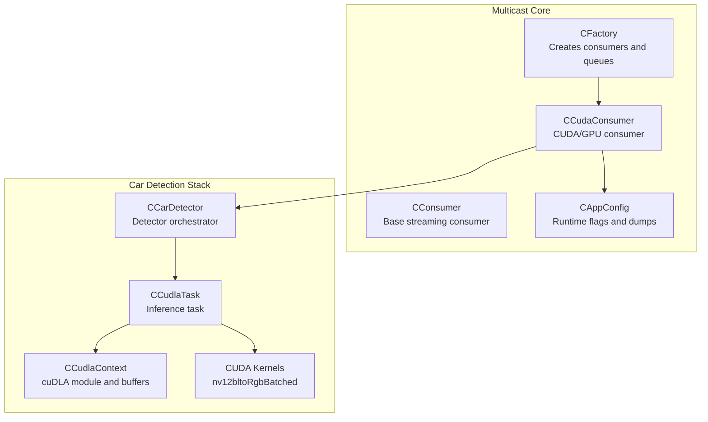
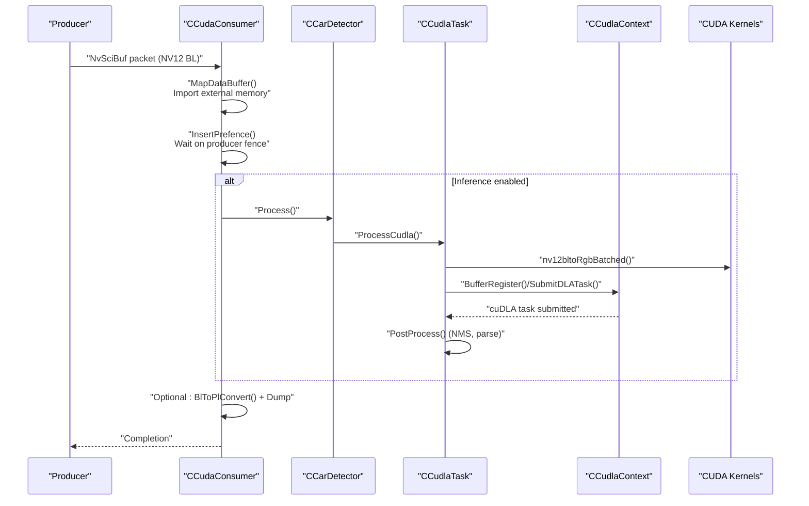
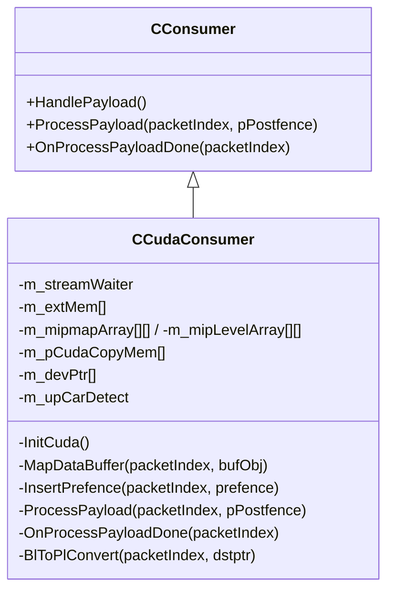
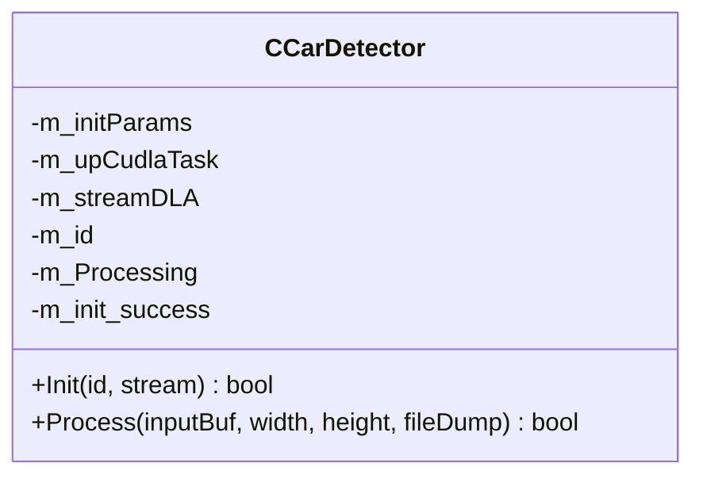
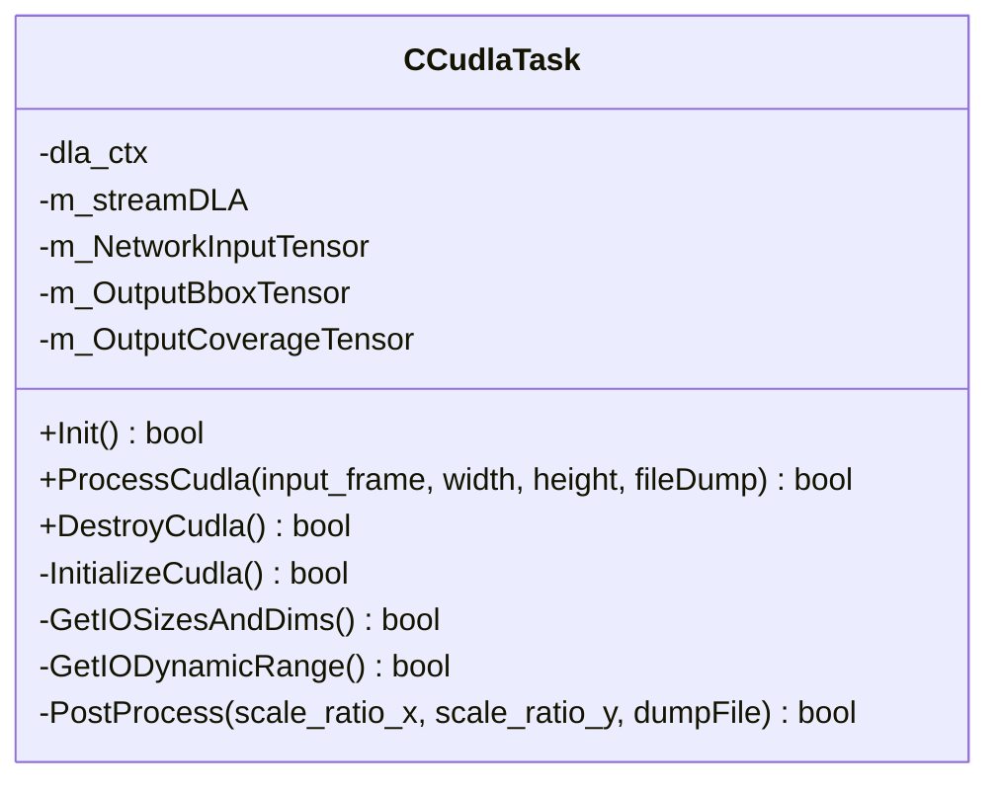
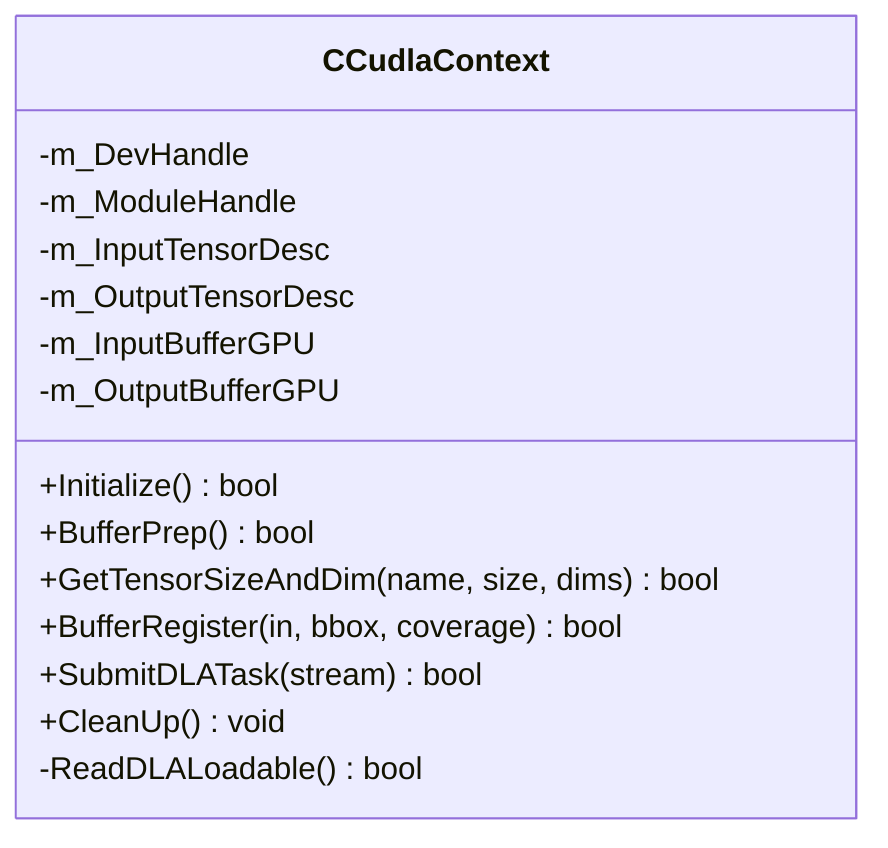
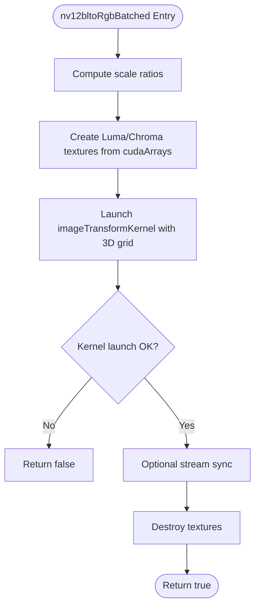
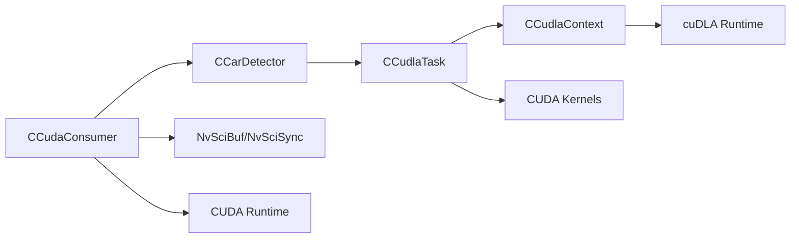

# CUDA Consumer

<cite>
**Referenced Files in This Document**
- [CCudaConsumer.hpp](file://CCudaConsumer.hpp)
- [CCudaConsumer.cpp](file://CCudaConsumer.cpp)
- [CCarDetector.hpp](file://car_detect/CCarDetector.hpp)
- [CCarDetector.cpp](file://car_detect/CCarDetector.cpp)
- [CCudlaContext.hpp](file://car_detect/CCudlaContext.hpp)
- [CCudlaContext.cpp](file://car_detect/CCudlaContext.cpp)
- [CCudlaTask.hpp](file://car_detect/CCudlaTask.hpp)
- [CCudlaTask.cpp](file://car_detect/CCudlaTask.cpp)
- [cuda_kernels.h](file://car_detect/cuda_kernels.h)
- [cuda_kernels.cu](file://car_detect/cuda_kernels.cu)
- [Common.hpp](file://car_detect/Common.hpp)
- [CConsumer.hpp](file://CConsumer.hpp)
- [CFactory.hpp](file://CFactory.hpp)
- [CFactory.cpp](file://CFactory.cpp)
- [CAppConfig.hpp](file://CAppConfig.hpp)
- [main.cpp](file://main.cpp)
</cite>

## Table of Contents
1. [Introduction](#introduction)
2. [Project Structure](#project-structure)
3. [Core Components](#core-components)
4. [Architecture Overview](#architecture-overview)
5. [Detailed Component Analysis](#detailed-component-analysis)
6. [Dependency Analysis](#dependency-analysis)
7. [Performance Considerations](#performance-considerations)
8. [Troubleshooting Guide](#troubleshooting-guide)
9. [Conclusion](#conclusion)
10. [Appendices](#appendices)

## Introduction
This document explains the CUDA Consumer implementation in the NVIDIA SIPL Multicast system. It focuses on the CCudaConsumer class and its role in GPU-accelerated video processing, including NV12 buffer handling, cuDLA context management, and the inference pipeline. It also documents the CCarDetector, CCudlaContext, and CCudlaTask classes, along with configuration parameters, performance optimization techniques, memory management strategies, and troubleshooting guidance. Practical examples show how to set up car detection, integrate with the broader multicast system, and develop custom kernels.

## Project Structure
The CUDA Consumer resides in the multicast directory and integrates with the broader SIPL framework. The car detection stack is organized under car_detect/, with GPU kernels, cuDLA orchestration, and inference logic.

**Diagram sources**
- [CFactory.cpp:166-205](file://CFactory.cpp#L166-L205)
- [CConsumer.hpp:16-43](file://CConsumer.hpp#L16-L43)
- [CCudaConsumer.hpp:25-78](file://CCudaConsumer.hpp#L25-L78)
- [CCarDetector.cpp:33-91](file://car_detect/CCarDetector.cpp#L33-L91)
- [CCudlaTask.cpp:152-186](file://car_detect/CCudlaTask.cpp#L152-L186)
- [CCudlaContext.cpp:69-100](file://car_detect/CCudlaContext.cpp#L69-L100)
- [cuda_kernels.cu:248-316](file://car_detect/cuda_kernels.cu#L248-L316)

**Section sources**
- [CFactory.cpp:166-205](file://CFactory.cpp#L166-L205)
- [CFactory.hpp:27-92](file://CFactory.hpp#L27-L92)
- [CConsumer.hpp:16-43](file://CConsumer.hpp#L16-L43)
- [CCudaConsumer.hpp:25-78](file://CCudaConsumer.hpp#L25-L78)

## Core Components
- CCudaConsumer: Extends the base consumer to process video frames on the GPU, manage CUDA streams and external semaphores, map NvSciBuf images to CUDA memory, convert NV12 block-linear to RGB, and optionally run inference via CCarDetector.
- CCarDetector: Initializes and runs inference using CCudlaTask, manages cuDLA context, and coordinates post-processing.
- CCudlaTask: Encapsulates cuDLA task submission, input/output tensor preparation, and post-processing (NMS and bounding box parsing).
- CCudlaContext: Loads cuDLA modules, prepares and registers tensors, submits tasks, and cleans up resources.
- CUDA Kernels: Provides nv12bltoRgbBatched for efficient NV12 block-linear to RGB conversion on GPU.

Key responsibilities:
- Buffer mapping and layout handling (block-linear vs pitch-linear)
- CUDA stream synchronization and semaphore-based coordination
- cuDLA module loading, registration, and task submission
- Inference post-processing and optional file dumping

**Section sources**
- [CCudaConsumer.cpp:28-53](file://CCudaConsumer.cpp#L28-L53)
- [CCarDetector.cpp:33-91](file://car_detect/CCarDetector.cpp#L33-L91)
- [CCudlaTask.cpp:152-186](file://car_detect/CCudlaTask.cpp#L152-L186)
- [CCudlaContext.cpp:69-100](file://car_detect/CCudlaContext.cpp#L69-L100)
- [cuda_kernels.cu:248-316](file://car_detect/cuda_kernels.cu#L248-L316)

## Architecture Overview
The CCudaConsumer participates in the SIPL streaming pipeline. It creates a CUDA stream, imports NvSciBuf buffers as CUDA memory, waits on producer fences via external semaphores, converts NV12 block-linear to RGB on GPU, and optionally runs inference through CCarDetector -> CCudlaTask -> CCudlaContext. Results can be dumped to files and logged.

**Diagram sources**
- [CCudaConsumer.cpp:386-462](file://CCudaConsumer.cpp#L386-L462)
- [CCarDetector.cpp:93-108](file://car_detect/CCarDetector.cpp#L93-L108)
- [CCudlaTask.cpp:188-244](file://car_detect/CCudlaTask.cpp#L188-L244)
- [CCudlaContext.cpp:199-250](file://car_detect/CCudlaContext.cpp#L199-L250)
- [cuda_kernels.cu:248-316](file://car_detect/cuda_kernels.cu#L248-L316)

## Detailed Component Analysis

### CCudaConsumer
Responsibilities:
- Initialize CUDA device and stream
- Map NvSciBuf to CUDA memory (block-linear mipmapped arrays or pitch-linear buffers)
- Convert NV12 block-linear to RGB on GPU and optionally copy to host for dumping
- Coordinate with NvSciSync external semaphores for producer-consumer synchronization
- Optionally run car detection via CCarDetector

Key implementation highlights:
- Device setup and stream creation
- Buffer attribute population and external memory import
- Block-linear to RGB conversion using CUDA arrays and 2D async copies
- Pitch-linear direct device-to-host copies
- Fence waiting via external semaphore and CUDA wait operation

**Diagram sources**
- [CConsumer.hpp:16-43](file://CConsumer.hpp#L16-L43)
- [CCudaConsumer.hpp:25-78](file://CCudaConsumer.hpp#L25-L78)

**Section sources**
- [CCudaConsumer.cpp:28-53](file://CCudaConsumer.cpp#L28-L53)
- [CCudaConsumer.cpp:173-273](file://CCudaConsumer.cpp#L173-L273)
- [CCudaConsumer.cpp:300-322](file://CCudaConsumer.cpp#L300-L322)
- [CCudaConsumer.cpp:386-462](file://CCudaConsumer.cpp#L386-L462)
- [CCudaConsumer.cpp:464-483](file://CCudaConsumer.cpp#L464-L483)

### CCarDetector
Responsibilities:
- Initialize CUDA context and set device
- Configure inference parameters (network mode, model cache paths, thresholds)
- Create and initialize CCudlaTask
- Run ProcessCudla on incoming cudaArray inputs

Key implementation highlights:
- Device enumeration and selection
- Parameter initialization for FP16/INT8 modes
- Task creation and initialization
- Guarded processing based on initialization success

**Diagram sources**
- [CCarDetector.hpp:17-32](file://car_detect/CCarDetector.hpp#L17-L32)

**Section sources**
- [CCarDetector.cpp:33-91](file://car_detect/CCarDetector.cpp#L33-L91)

### CCudlaTask
Responsibilities:
- Load cuDLA module and prepare buffers
- Prepare input/output tensor descriptors and sizes
- Register tensors with cuDLA device
- Launch nv12bltoRgbBatched kernel to convert NV12 block-linear to RGB
- Submit cuDLA task and synchronize
- Post-process detections (NMS and bounding box parsing)

Key implementation highlights:
- Dynamic range handling for INT8
- Tensor size/dimension queries via CCudlaContext
- Stream attachment for managed allocations
- Kernel launch parameters and batched processing
- CPU-side NMS and bounding box parsing

**Diagram sources**
- [CCudlaTask.hpp:16-96](file://car_detect/CCudlaTask.hpp#L16-L96)

**Section sources**
- [CCudlaTask.cpp:35-52](file://car_detect/CCudlaTask.cpp#L35-L52)
- [CCudlaTask.cpp:152-186](file://car_detect/CCudlaTask.cpp#L152-L186)
- [CCudlaTask.cpp:188-244](file://car_detect/CCudlaTask.cpp#L188-L244)
- [CCudlaTask.cpp:291-352](file://car_detect/CCudlaTask.cpp#L291-L352)

### CCudlaContext
Responsibilities:
- Load cuDLA module from file
- Enumerate and register tensors
- Register GPU buffers with cuDLA
- Submit cuDLA tasks on a given CUDA stream
- Cleanup and unregistration

Key implementation highlights:
- Module load from memory buffer
- Tensor descriptor queries and caching
- Memory registration and unregistration
- Task submission with stream binding

**Diagram sources**
- [CCudlaContext.hpp:22-57](file://car_detect/CCudlaContext.hpp#L22-L57)

**Section sources**
- [CCudlaContext.cpp:33-67](file://car_detect/CCudlaContext.cpp#L33-L67)
- [CCudlaContext.cpp:69-100](file://car_detect/CCudlaContext.cpp#L69-L100)
- [CCudlaContext.cpp:113-197](file://car_detect/CCudlaContext.cpp#L113-L197)
- [CCudlaContext.cpp:199-250](file://car_detect/CCudlaContext.cpp#L199-L250)
- [CCudlaContext.cpp:252-319](file://car_detect/CCudlaContext.cpp#L252-L319)

### CUDA Kernels (nv12bltoRgbBatched)
Responsibilities:
- Convert NV12 block-linear to RGB on GPU
- Support both FP16 (half) and INT8 (int8) output formats
- Batch processing across multiple frames
- Texture-based sampling from cudaArray inputs

Key implementation highlights:
- Texture objects from cudaArray planes
- Vectorized pixel transformations with clamping
- Batched kernel launches with z-dimension
- Optional dump for debugging

**Diagram sources**
- [cuda_kernels.cu:248-316](file://car_detect/cuda_kernels.cu#L248-L316)

**Section sources**
- [cuda_kernels.h:28-41](file://car_detect/cuda_kernels.h#L28-L41)
- [cuda_kernels.cu:248-316](file://car_detect/cuda_kernels.cu#L248-L316)

## Dependency Analysis
- CCudaConsumer depends on:
  - NvSciBuf/NvSciSync for inter-process buffer sharing and synchronization
  - CUDA runtime for memory mapping, streams, and semaphore import
  - CCarDetector for inference (Linux/QNX standard builds)
- CCarDetector depends on:
  - CCudlaTask for cuDLA orchestration
  - CUDA runtime for device setup and kernel launches
- CCudlaTask depends on:
  - CCudlaContext for module loading and buffer registration
  - CUDA Kernels for NV12 to RGB conversion
  - Common types and structures (NvInferInitParams, Dims32, etc.)
- CCudlaContext depends on:
  - cuDLA runtime for device/module management and task submission

**Diagram sources**
- [CCudaConsumer.hpp:12-24](file://CCudaConsumer.hpp#L12-L24)
- [CCarDetector.cpp:10-13](file://car_detect/CCarDetector.cpp#L10-L13)
- [CCudlaTask.cpp:9-11](file://car_detect/CCudlaTask.cpp#L9-L11)
- [CCudlaContext.cpp:10-11](file://car_detect/CCudlaContext.cpp#L10-L11)

**Section sources**
- [CCudaConsumer.hpp:12-24](file://CCudaConsumer.hpp#L12-L24)
- [CCarDetector.cpp:10-13](file://car_detect/CCarDetector.cpp#L10-L13)
- [CCudlaTask.cpp:9-11](file://car_detect/CCudlaTask.cpp#L9-L11)
- [CCudlaContext.cpp:10-11](file://car_detect/CCudlaContext.cpp#L10-L11)

## Performance Considerations
- Asynchronous operations:
  - Use non-blocking CUDA streams for producer-consumer decoupling
  - Perform device-to-host copies asynchronously and synchronize only when necessary
- Memory management:
  - Prefer pinned host allocations for faster transfers when dumping frames
  - Reuse external memory and mipmapped arrays across frames
  - Attach managed memory to streams to avoid explicit synchronization
- Kernel efficiency:
  - Use texture objects for efficient sampling from cudaArray planes
  - Launch appropriate 3D grids to maximize occupancy
- cuDLA utilization:
  - Register buffers once and reuse registrations
  - Submit tasks on the same stream to leverage implicit synchronization
- Layout handling:
  - Prefer block-linear to RGB conversion on GPU to avoid CPU overhead
  - For pitch-linear layouts, use direct device-to-host copies

[No sources needed since this section provides general guidance]

## Troubleshooting Guide
Common issues and resolutions:
- CUDA errors during device setup or stream creation:
  - Verify GPU availability and compute capability
  - Ensure device limits are acceptable and device ID is valid
- NvSciBuf import failures:
  - Confirm buffer attributes match expectations (block-linear/pitch-linear)
  - Validate NvSciBuf permissions and GPU ID alignment
- External semaphore wait failures:
  - Ensure signal/waiter attributes are configured correctly
  - Verify fence validity and timing of wait operations
- cuDLA initialization failures:
  - Check module file path and loadable size
  - Validate tensor descriptors and sizes
  - Confirm device count and assignment logic
- Inference not running:
  - Check model cache paths and network mode configuration
  - Verify task initialization success and buffer registration
- Frame dumping issues:
  - Confirm file dump flags and frame number ranges
  - Ensure sufficient host memory allocation and proper synchronization

**Section sources**
- [CCudaConsumer.cpp:28-53](file://CCudaConsumer.cpp#L28-L53)
- [CCudaConsumer.cpp:173-273](file://CCudaConsumer.cpp#L173-L273)
- [CCudaConsumer.cpp:300-322](file://CCudaConsumer.cpp#L300-L322)
- [CCudlaContext.cpp:33-67](file://car_detect/CCudlaContext.cpp#L33-L67)
- [CCudlaContext.cpp:69-100](file://car_detect/CCudlaContext.cpp#L69-L100)
- [CCudlaTask.cpp:35-52](file://car_detect/CCudlaTask.cpp#L35-L52)

## Conclusion
The CUDA Consumer integrates seamlessly with the SIPL Multicast framework to deliver GPU-accelerated video processing. It supports NV12 block-linear and pitch-linear layouts, performs efficient conversions to RGB on GPU, and optionally runs inference via cuDLA. The modular design of CCarDetector, CCudlaTask, and CCudlaContext enables flexible configuration and robust resource management. Following the performance and troubleshooting guidance ensures reliable operation in production environments.

[No sources needed since this section summarizes without analyzing specific files]

## Appendices

### Configuration Parameters
- Network mode and model paths:
  - FP16 model cache path
  - INT8 calibration/cache paths (when applicable)
- Inference thresholds:
  - Score threshold
  - NMS threshold
  - Group IOU threshold and group threshold
- Layer names:
  - Input image layer name
  - Output bounding box and coverage layer names
- Scaling factors:
  - Network scale factor
- Labels:
  - Class labels for detection output

These parameters are configured in CCarDetector initialization and consumed by CCudlaTask for tensor sizing, dynamic range, and post-processing.

**Section sources**
- [CCarDetector.cpp:58-76](file://car_detect/CCarDetector.cpp#L58-L76)
- [CCudlaTask.cpp:110-150](file://car_detect/CCudlaTask.cpp#L110-L150)
- [Common.hpp:50-107](file://car_detect/Common.hpp#L50-L107)

### Practical Examples

- Car detection setup:
  - Enable inference in CCudaConsumer by ensuring CCarDetector initialization succeeds
  - Provide correct model cache paths and layer names
  - Adjust thresholds for desired sensitivity and recall

- Custom kernel development:
  - Extend nv12bltoRgbBatched for specialized color transforms or output formats
  - Maintain compatibility with cudaArray inputs and required output strides
  - Ensure proper synchronization and error checking

- Integration with the broader multicast system:
  - Use CFactory to create CCudaConsumer with appropriate queue type and element info
  - Configure CAppConfig for file dumping and logging verbosity
  - Ensure NvSciBuf attributes and sync attributes are set correctly for inter-process sharing

**Section sources**
- [CFactory.cpp:166-205](file://CFactory.cpp#L166-L205)
- [CAppConfig.hpp:19-82](file://CAppConfig.hpp#L19-L82)
- [CCudaConsumer.cpp:112-171](file://CCudaConsumer.cpp#L112-L171)
- [cuda_kernels.cu:248-316](file://car_detect/cuda_kernels.cu#L248-L316)