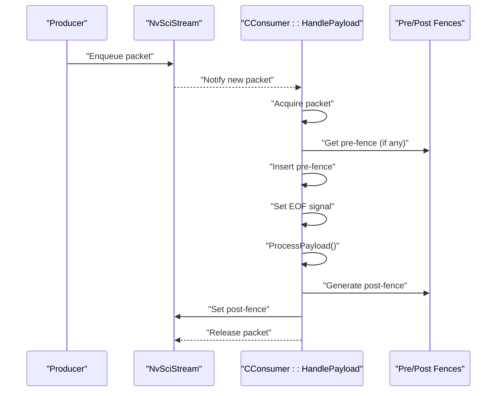
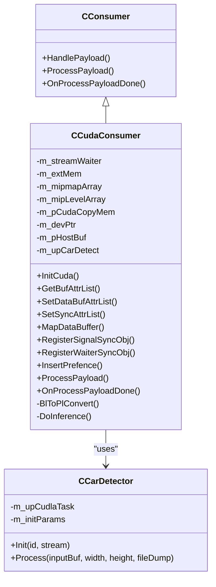
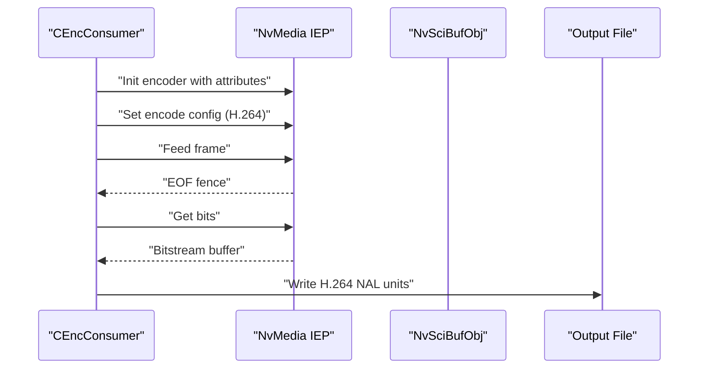
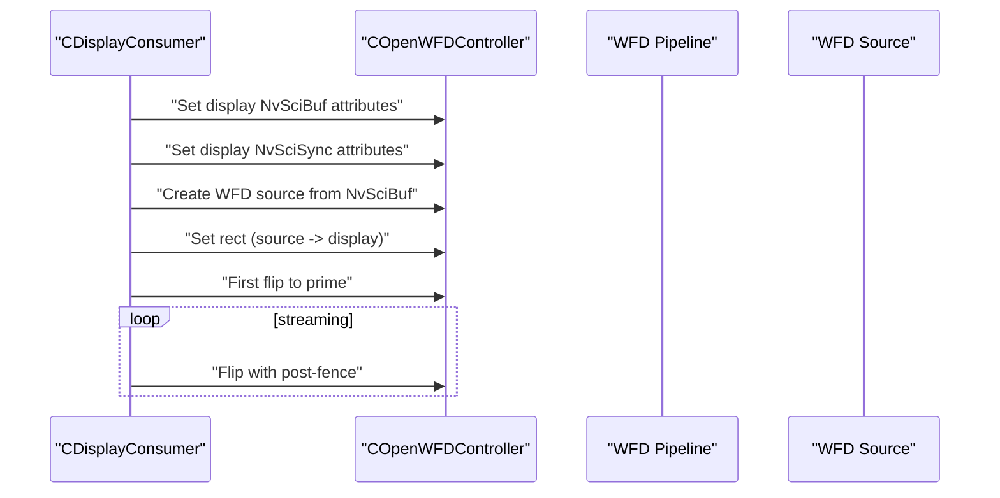
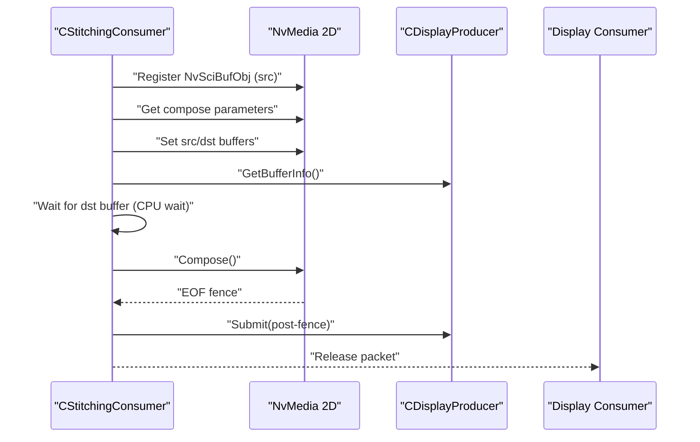
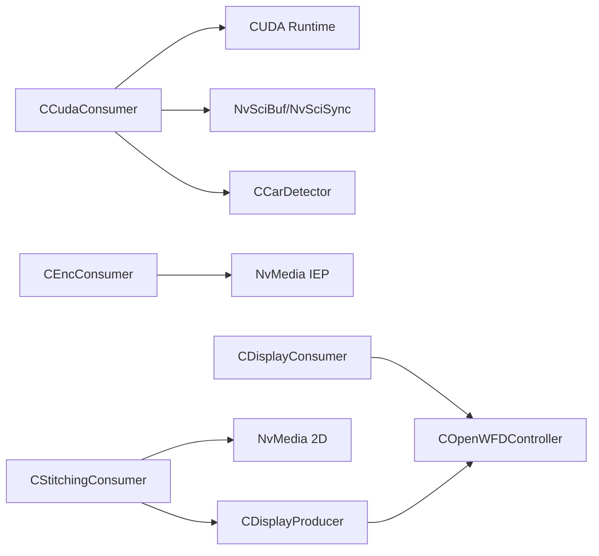

# Consumer Types

<cite>
**Referenced Files in This Document**
- [CConsumer.hpp](file://CConsumer.hpp)
- [CConsumer.cpp](file://CConsumer.cpp)
- [CCudaConsumer.hpp](file://CCudaConsumer.hpp)
- [CCudaConsumer.cpp](file://CCudaConsumer.cpp)
- [CEncConsumer.hpp](file://CEncConsumer.hpp)
- [CEncConsumer.cpp](file://CEncConsumer.cpp)
- [CDisplayConsumer.hpp](file://CDisplayConsumer.hpp)
- [CDisplayConsumer.cpp](file://CDisplayConsumer.cpp)
- [CStitchingConsumer.hpp](file://CStitchingConsumer.hpp)
- [CStitchingConsumer.cpp](file://CStitchingConsumer.cpp)
- [COpenWFDController.hpp](file://COpenWFDController.hpp)
- [COpenWFDController.cpp](file://COpenWFDController.cpp)
- [CDisplayProducer.hpp](file://CDisplayProducer.hpp)
- [CDisplayProducer.cpp](file://CDisplayProducer.cpp)
- [car_detect/CCarDetector.hpp](file://car_detect/CCarDetector.hpp)
- [car_detect/CCarDetector.cpp](file://car_detect/CCarDetector.cpp)
- [car_detect/CCudlaContext.hpp](file://car_detect/CCudlaContext.hpp)
- [car_detect/CCudlaContext.cpp](file://car_detect/CCudlaContext.cpp)
</cite>

## Table of Contents
1. [Introduction](#introduction)
2. [Project Structure](#project-structure)
3. [Core Components](#core-components)
4. [Architecture Overview](#architecture-overview)
5. [Detailed Component Analysis](#detailed-component-analysis)
6. [Dependency Analysis](#dependency-analysis)
7. [Performance Considerations](#performance-considerations)
8. [Troubleshooting Guide](#troubleshooting-guide)
9. [Conclusion](#conclusion)

## Introduction
This document provides comprehensive documentation for all consumer types in the NVIDIA SIPL Multicast system. It covers:
- CCudaConsumer: GPU-accelerated processing with optional car detection via cuDLA integration.
- CEncConsumer: Video encoding to H.264 using NvMedia IEP.
- CDisplayConsumer: Real-time display via OpenWFD controller integration.
- CStitchingConsumer: Multi-camera image stitching and submission to a display pipeline.

For each consumer, we explain implementation details, configuration options, performance characteristics, usage patterns, and troubleshooting guidance. Special emphasis is placed on the car detection workflow from NV12 buffer processing through cuDLA inference to object detection results.

## Project Structure
The consumers are implemented as subclasses of a common base class and integrate with platform-specific libraries:
- Base consumer interface and common logic
- CUDA-based consumer with optional inference
- NvMedia IEP-based encoder consumer
- OpenWFD controller and display producer for real-time display
- cuDLA-based car detection pipeline

```mermaid
graph TB
subgraph "Base"
Base["CConsumer<br/>Base consumer logic"]
end
subgraph "Consumers"
Cuda["CCudaConsumer<br/>CUDA + optional car detection"]
Enc["CEncConsumer<br/>NvMedia IEP H.264"]
Disp["CDisplayConsumer<br/>OpenWFD display"]
Stitch["CStitchingConsumer<br/>NvMedia 2D compositing"]
end
subgraph "Integration"
WFD["COpenWFDController<br/>OpenWFD pipeline"]
Prod["CDisplayProducer<br/>Display producer"]
Car["CCarDetector<br/>cuDLA inference"]
end
Base --> Cuda
Base --> Enc
Base --> Disp
Base --> Stitch
Cuda --> Car
Disp --> WFD
WFD --> Prod
Prod --> Stitch
Stitch --> Disp
```

**Diagram sources**
- [CConsumer.hpp:16-44](file://CConsumer.hpp#L16-L44)
- [CCudaConsumer.hpp:25-81](file://CCudaConsumer.hpp#L25-L81)
- [CEncConsumer.hpp:17-66](file://CEncConsumer.hpp#L17-L66)
- [CDisplayConsumer.hpp:15-49](file://CDisplayConsumer.hpp#L15-L49)
- [CStitchingConsumer.hpp:17-74](file://CStitchingConsumer.hpp#L17-L74)
- [COpenWFDController.hpp:22-57](file://COpenWFDController.hpp#L22-L57)
- [CDisplayProducer.hpp:18-128](file://CDisplayProducer.hpp#L18-L128)

**Section sources**
- [CConsumer.hpp:16-44](file://CConsumer.hpp#L16-L44)
- [CConsumer.cpp:17-127](file://CConsumer.cpp#L17-L127)

## Core Components
- CConsumer: Base class implementing the generic consumer lifecycle, packet acquisition, pre/post fence handling, and payload processing hooks.
- CCudaConsumer: Extends CConsumer to process images on GPU, optionally performing inference using cuDLA, and dumping raw frames if configured.
- CEncConsumer: Extends CConsumer to register buffers with NvMedia IEP, configure H.264 encoding parameters, and produce encoded bitstreams.
- CDisplayConsumer: Extends CConsumer to integrate with OpenWFD, create sources from NvSciBuf, and flip frames to the display pipeline.
- CStitchingConsumer: Extends CConsumer to register buffers with NvMedia 2D, set composition parameters, and submit composed frames to the display producer.

**Section sources**
- [CConsumer.hpp:16-44](file://CConsumer.hpp#L16-L44)
- [CConsumer.cpp:17-127](file://CConsumer.cpp#L17-L127)
- [CCudaConsumer.hpp:25-81](file://CCudaConsumer.hpp#L25-L81)
- [CEncConsumer.hpp:17-66](file://CEncConsumer.hpp#L17-L66)
- [CDisplayConsumer.hpp:15-49](file://CDisplayConsumer.hpp#L15-L49)
- [CStitchingConsumer.hpp:17-74](file://CStitchingConsumer.hpp#L17-L74)

## Architecture Overview
The consumers participate in a NvSciStream-based pipeline. Each consumer:
- Receives packets from the stream
- Optionally waits on pre-fences
- Sets end-of-frame signals
- Processes payload and produces post-fences
- Notifies completion and releases the packet



**Diagram sources**
- [CConsumer.cpp:17-94](file://CConsumer.cpp#L17-L94)

## Detailed Component Analysis

### CCudaConsumer
Purpose:
- Process incoming frames on GPU.
- Optional car detection via cuDLA.
- Dump raw frames to file if enabled.

Key behaviors:
- Initializes CUDA device and stream, sets up external semaphore and memory mappings.
- Supports Block Linear and Pitch Linear buffer layouts.
- Converts Block Linear to Pitch Linear when dumping frames.
- Runs inference using CCarDetector when initialized.
- Writes raw NV12/YUV frames to disk when dumping is enabled.

Implementation highlights:
- Buffer attribute negotiation for GPU access and CPU access flags.
- External semaphore import for synchronization with producer.
- Mipmapped array mapping for Block Linear NV12 planes.
- Host-side buffer allocation for optional frame dumping.

Car detection workflow:
- Initialization loads cuDLA module and prepares tensors.
- For each frame, passes cudaArray pointers to CCarDetector::Process.
- Results are logged; inference errors are handled gracefully.



**Diagram sources**
- [CConsumer.hpp:16-44](file://CConsumer.hpp#L16-L44)
- [CCudaConsumer.hpp:25-81](file://CCudaConsumer.hpp#L25-L81)
- [car_detect/CCarDetector.hpp:17-34](file://car_detect/CCarDetector.hpp#L17-L34)

**Section sources**
- [CCudaConsumer.cpp:11-110](file://CCudaConsumer.cpp#L11-L110)
- [CCudaConsumer.cpp:112-171](file://CCudaConsumer.cpp#L112-L171)
- [CCudaConsumer.cpp:173-298](file://CCudaConsumer.cpp#L173-L298)
- [CCudaConsumer.cpp:300-492](file://CCudaConsumer.cpp#L300-L492)
- [car_detect/CCarDetector.cpp:33-109](file://car_detect/CCarDetector.cpp#L33-L109)

Configuration options:
- File dump: Enable dumping NV12 frames to multicast_cuda_sensor.yuv during a configurable frame window.
- Sensor ID: Used to select GPU/cuDLA device mapping and model cache path.
- Inference enable/disable: Controlled by successful initialization of CCarDetector.

Performance characteristics:
- Uses asynchronous CUDA streams and host/device copies.
- Block Linear to Pitch Linear conversion adds overhead; consider disabling dump for latency-critical scenarios.
- cuDLA inference introduces latency; ensure adequate DLA availability per sensor.

Usage example (conceptual):
- Instantiate CCudaConsumer with stream handle and sensor ID.
- Initialize app config to enable file dump if needed.
- Run pipeline; frames are processed on GPU and optionally dumped.

Integration patterns:
- Works with NvSciBuf Image buffers (Block Linear/Pitch Linear).
- Integrates with NvSciSync for producer-consumer synchronization.

Troubleshooting:
- If car detection fails to initialize, the consumer continues without inference and logs a warning.
- Ensure cuDLA module loadable exists and readable.
- Verify GPU/cuDLa device availability and permissions.

**Section sources**
- [CCudaConsumer.cpp:28-53](file://CCudaConsumer.cpp#L28-L53)
- [CCudaConsumer.cpp:354-396](file://CCudaConsumer.cpp#L354-L396)
- [CCudaConsumer.cpp:398-462](file://CCudaConsumer.cpp#L398-L462)
- [car_detect/CCarDetector.cpp:33-91](file://car_detect/CCarDetector.cpp#L33-L91)

### CEncConsumer
Purpose:
- Encode incoming frames to H.264 using NvMedia IEP.

Key behaviors:
- Negotiates buffer attributes via NvMedia IEP fill helpers.
- Creates NvMedia IEP encoder instance with configured resolution and rate control.
- Sets H.264 parameters (GOP, IDR period, preset, QP).
- Feeds frames to IEP, retrieves bitstreams, and writes to file if dumping is enabled.



**Diagram sources**
- [CEncConsumer.cpp:57-92](file://CEncConsumer.cpp#L57-L92)
- [CEncConsumer.cpp:28-55](file://CEncConsumer.cpp#L28-L55)
- [CEncConsumer.cpp:230-306](file://CEncConsumer.cpp#L230-L306)
- [CEncConsumer.cpp:309-345](file://CEncConsumer.cpp#L309-L345)

Configuration options:
- Resolution: Derived from app config per sensor.
- Rate control: Constant QP mode with intra/inter QPs configured.
- GOP and IDR period: Tunable parameters.
- Dump: Write H.264 bitstreams to multicast_enc_sensor.h264.

Performance characteristics:
- Synchronous bit retrieval loop until data is available.
- Blocking behavior when waiting for encoded data; tune timeouts appropriately.

Usage example (conceptual):
- Instantiate CEncConsumer with stream handle and sensor ID.
- Ensure app config provides width/height for the sensor.
- Run pipeline; H.264 bitstreams are produced and optionally saved.

Integration patterns:
- Requires NvMedia IEP registration of NvSciBuf and NvSciSync objects.
- Uses NvMedia IEP fences for synchronization.

Troubleshooting:
- Ensure NvMedia IEP is available and properly licensed.
- Verify buffer attributes reconciliation and encoder instance selection.

**Section sources**
- [CEncConsumer.cpp:17-26](file://CEncConsumer.cpp#L17-L26)
- [CEncConsumer.cpp:117-140](file://CEncConsumer.cpp#L117-L140)
- [CEncConsumer.cpp:143-156](file://CEncConsumer.cpp#L143-L156)
- [CEncConsumer.cpp:158-189](file://CEncConsumer.cpp#L158-L189)
- [CEncConsumer.cpp:28-55](file://CEncConsumer.cpp#L28-L55)
- [CEncConsumer.cpp:57-92](file://CEncConsumer.cpp#L57-L92)
- [CEncConsumer.cpp:230-345](file://CEncConsumer.cpp#L230-L345)

### CDisplayConsumer
Purpose:
- Real-time display of frames via OpenWFD.

Key behaviors:
- Pre-initializes with a COpenWFDController and pipeline ID.
- Negotiates NvSciBuf and NvSciSync attributes for display.
- Creates WFD sources from NvSciBuf objects and flips frames to the pipeline.
- Performs initial flip to avoid post-fence timeout issues.



**Diagram sources**
- [CDisplayConsumer.cpp:18-27](file://CDisplayConsumer.cpp#L18-L27)
- [CDisplayConsumer.cpp:37-52](file://CDisplayConsumer.cpp#L37-L52)
- [CDisplayConsumer.cpp:54-68](file://CDisplayConsumer.cpp#L54-L68)
- [CDisplayConsumer.cpp:93-113](file://CDisplayConsumer.cpp#L93-L113)
- [CDisplayConsumer.cpp:121-134](file://CDisplayConsumer.cpp#L121-L134)

Configuration options:
- Pipeline ID: Selects which WFD pipeline to use.
- Rectangles: Source rectangle derived from mapped buffer dimensions; destination rectangle matches display port mode.

Performance characteristics:
- Non-blocking commits and post-fence signaling configured for efficient scanout timing.
- CPU wait disabled; relies on GPU pipeline synchronization.

Usage example (conceptual):
- Instantiate COpenWFDController and create pipelines for desired ports.
- Pre-initialize CDisplayConsumer with controller and pipeline ID.
- Run pipeline; frames are flipped to the display.

Integration patterns:
- Integrates tightly with COpenWFDController for resource creation and binding.
- Uses NvSciBuf/NvSciSync attributes tailored for display.

Troubleshooting:
- Ensure WFD device/port/pipeline creation succeeds.
- Verify post-fence registration and non-blocking commit settings.
- Confirm source rectangle matches buffer dimensions.

**Section sources**
- [CDisplayConsumer.cpp:18-27](file://CDisplayConsumer.cpp#L18-L27)
- [CDisplayConsumer.cpp:37-68](file://CDisplayConsumer.cpp#L37-L68)
- [CDisplayConsumer.cpp:93-113](file://CDisplayConsumer.cpp#L93-L113)
- [CDisplayConsumer.cpp:121-134](file://CDisplayConsumer.cpp#L121-L134)
- [COpenWFDController.cpp:29-80](file://COpenWFDController.cpp#L29-L80)
- [COpenWFDController.cpp:197-252](file://COpenWFDController.cpp#L197-L252)
- [COpenWFDController.cpp:337-350](file://COpenWFDController.cpp#L337-L350)

### CStitchingConsumer
Purpose:
- Compose multiple camera feeds into a single display buffer using NvMedia 2D.

Key behaviors:
- Registers destination buffers with NvMedia 2D.
- Sets composition parameters (source and destination surfaces).
- Waits for destination buffer availability via CPU wait context.
- Submits composed frames to the display producer and sets post-fences.



**Diagram sources**
- [CStitchingConsumer.cpp:141-177](file://CStitchingConsumer.cpp#L141-L177)
- [CStitchingConsumer.cpp:207-296](file://CStitchingConsumer.cpp#L207-L296)
- [CStitchingConsumer.cpp:298-317](file://CStitchingConsumer.cpp#L298-L317)
- [CDisplayProducer.cpp:222-245](file://CDisplayProducer.cpp#L222-L245)
- [CDisplayProducer.cpp:276-313](file://CDisplayProducer.cpp#L276-L313)

Configuration options:
- Destination buffer attributes: Negotiated via NvMedia 2D fill helpers.
- Composition geometry: Source rectangle set from display producer; destination is the full display buffer.

Performance characteristics:
- Uses CPU wait context to synchronize with display producer.
- Submits to display producer upon successful composition.

Usage example (conceptual):
- Pre-initialize CDisplayProducer with desired resolution and number of packets.
- Pre-initialize CStitchingConsumer with a pointer to CDisplayProducer.
- Run pipeline; composed frames are posted to the display consumer.

Integration patterns:
- Acts as a compositor feeding CDisplayProducer.
- Uses NvSciBuf/NvSciSync attributes compatible with 2D composition.

Troubleshooting:
- Ensure NvMedia 2D handles are created and registered.
- Verify destination buffer availability and CPU wait context correctness.

**Section sources**
- [CStitchingConsumer.cpp:105-127](file://CStitchingConsumer.cpp#L105-L127)
- [CStitchingConsumer.cpp:130-139](file://CStitchingConsumer.cpp#L130-L139)
- [CStitchingConsumer.cpp:141-177](file://CStitchingConsumer.cpp#L141-L177)
- [CStitchingConsumer.cpp:187-205](file://CStitchingConsumer.cpp#L187-L205)
- [CStitchingConsumer.cpp:207-296](file://CStitchingConsumer.cpp#L207-L296)
- [CStitchingConsumer.cpp:298-317](file://CStitchingConsumer.cpp#L298-L317)
- [CDisplayProducer.cpp:222-245](file://CDisplayProducer.cpp#L222-L245)
- [CDisplayProducer.cpp:276-313](file://CDisplayProducer.cpp#L276-L313)

## Dependency Analysis
- CCudaConsumer depends on:
  - CUDA runtime and NvSciBuf/NvSciSync for GPU buffer mapping and synchronization.
  - CCarDetector for inference; optional.
- CEncConsumer depends on:
  - NvMedia IEP for encoding and fence management.
- CDisplayConsumer depends on:
  - COpenWFDController for pipeline creation and frame flipping.
- CStitchingConsumer depends on:
  - NvMedia 2D for composition and CDisplayProducer for buffer handoff.



**Diagram sources**
- [CCudaConsumer.hpp:12-24](file://CCudaConsumer.hpp#L12-L24)
- [car_detect/CCarDetector.hpp:12-16](file://car_detect/CCarDetector.hpp#L12-L16)
- [CEncConsumer.hpp:12-16](file://CEncConsumer.hpp#L12-L16)
- [CDisplayConsumer.hpp:12-14](file://CDisplayConsumer.hpp#L12-L14)
- [CStitchingConsumer.hpp:12-16](file://CStitchingConsumer.hpp#L12-L16)
- [CDisplayProducer.hpp:14-16](file://CDisplayProducer.hpp#L14-L16)

**Section sources**
- [CCudaConsumer.hpp:12-24](file://CCudaConsumer.hpp#L12-L24)
- [CEncConsumer.hpp:12-16](file://CEncConsumer.hpp#L12-L16)
- [CDisplayConsumer.hpp:12-14](file://CDisplayConsumer.hpp#L12-L14)
- [CStitchingConsumer.hpp:12-16](file://CStitchingConsumer.hpp#L12-L16)
- [CDisplayProducer.hpp:14-16](file://CDisplayProducer.hpp#L14-L16)

## Performance Considerations
- CCudaConsumer:
  - Asynchronous GPU processing reduces CPU bottlenecks; however, Block Linear to Pitch Linear conversion and optional host-to-device copies increase latency.
  - cuDLA inference adds significant latency; ensure sufficient DLA capacity and appropriate model caching.
- CEncConsumer:
  - Bit retrieval loop blocks until data is available; tune timeouts and consider adjusting rate control parameters to balance quality and throughput.
- CDisplayConsumer:
  - Non-blocking commits and post-fence timing are tuned for scanout; ensure proper pipeline configuration to avoid stalls.
- CStitchingConsumer:
  - CPU wait synchronization ensures display buffer readiness; minimize contention by coordinating with producer timing.

[No sources needed since this section provides general guidance]

## Troubleshooting Guide
- CCudaConsumer:
  - If car detection initialization fails, the consumer continues without inference and logs a warning. Verify model cache path and cuDLA availability.
  - Unsupported buffer layout leads to errors; ensure Block Linear or Pitch Linear formats are negotiated.
- CEncConsumer:
  - Encoder creation failures indicate missing IEP or invalid attributes; confirm buffer attribute reconciliation and instance selection.
  - Pending/none-pending statuses during bit retrieval indicate IEP misconfiguration; review rate control and GOP settings.
- CDisplayConsumer:
  - Post-before-init errors occur if display setup is incomplete; ensure HandleSetupComplete runs before streaming.
  - WFD errors during pipeline creation or binding require checking device/port enumeration and commit sequences.
- CStitchingConsumer:
  - No available destination buffer warnings indicate contention with display producer; verify buffer availability and CPU wait context.
  - NvMedia 2D registration failures require re-checking buffer and sync object registration.

**Section sources**
- [CCudaConsumer.cpp:46-51](file://CCudaConsumer.cpp#L46-L51)
- [CCudaConsumer.cpp:260-262](file://CCudaConsumer.cpp#L260-L262)
- [CEncConsumer.cpp:88-91](file://CEncConsumer.cpp#L88-L91)
- [CEncConsumer.cpp:263-302](file://CEncConsumer.cpp#L263-L302)
- [CDisplayConsumer.cpp:123-126](file://CDisplayConsumer.cpp#L123-L126)
- [CStitchingConsumer.cpp:232-239](file://CStitchingConsumer.cpp#L232-L239)
- [CStitchingConsumer.cpp:276-278](file://CStitchingConsumer.cpp#L276-L278)

## Conclusion
The consumer types in the NVIDIA SIPL Multicast system provide flexible, high-performance pathways for GPU-accelerated processing, encoding, real-time display, and multi-camera stitching. By leveraging NvSciBuf/NvSciSync for seamless inter-component synchronization and integrating with platform-specific engines (CUDA/cuDLa, NvMedia IEP, OpenWFD, NvMedia 2D), the system supports diverse use cases from inference pipelines to panoramic displays. Proper configuration, attention to buffer layouts and fence semantics, and awareness of performance trade-offs are essential for robust deployments.