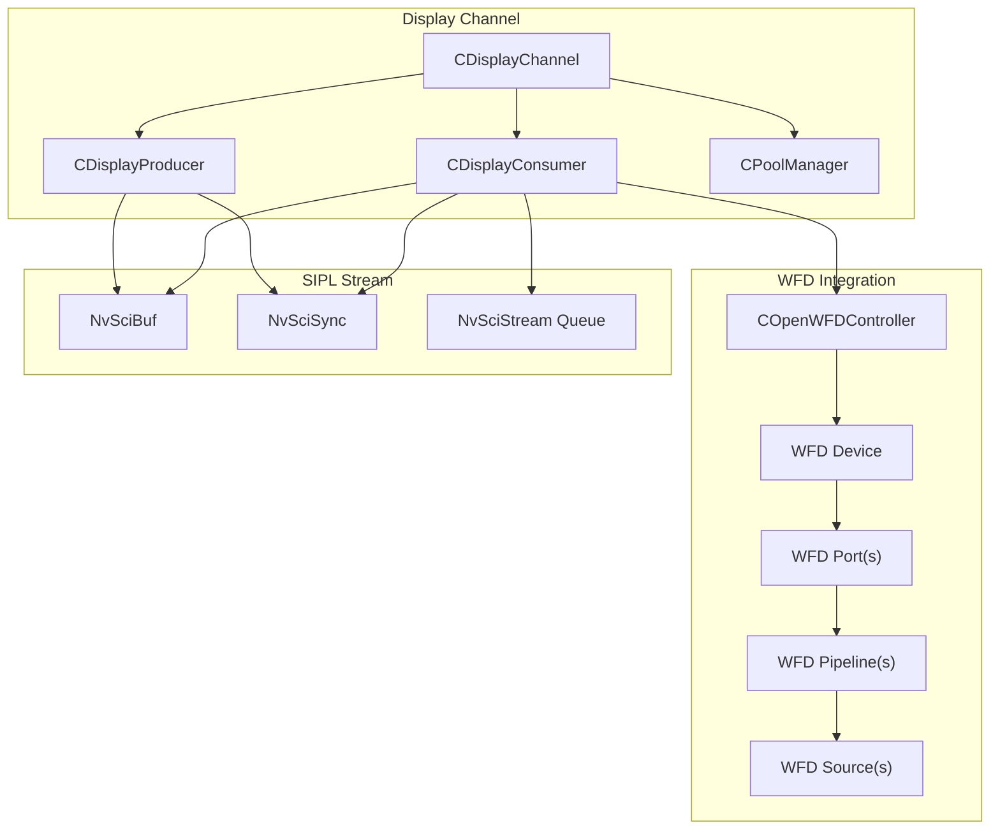
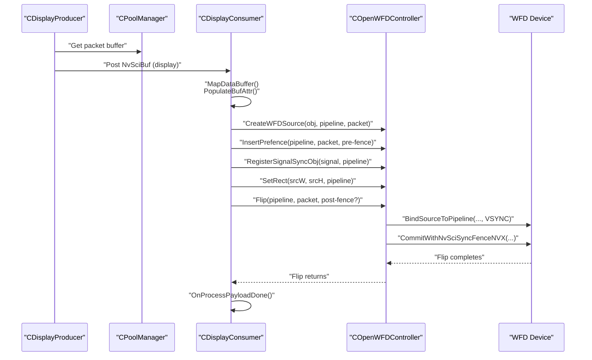
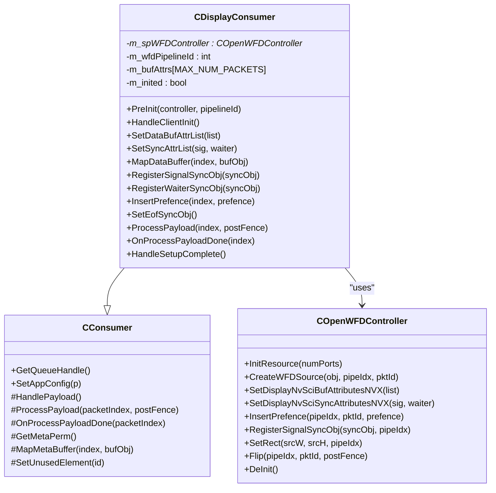
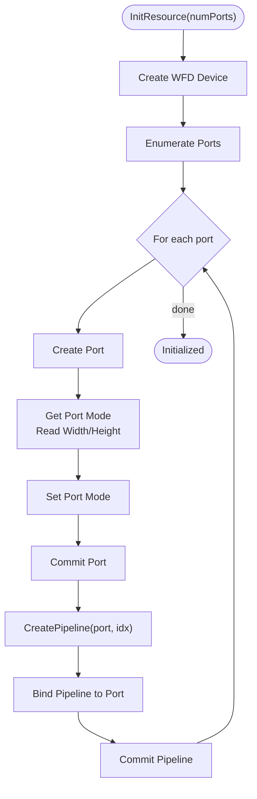
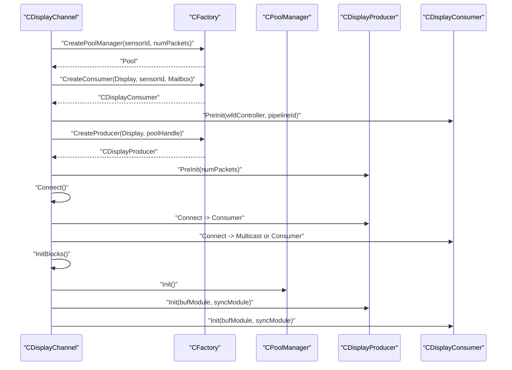
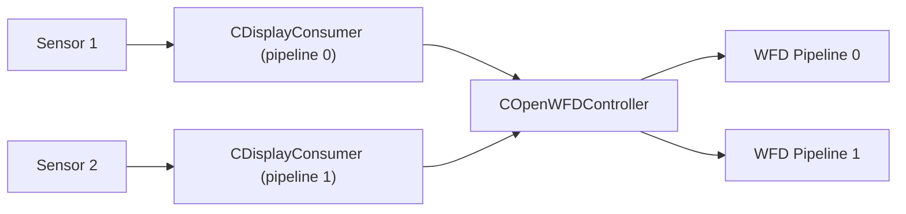
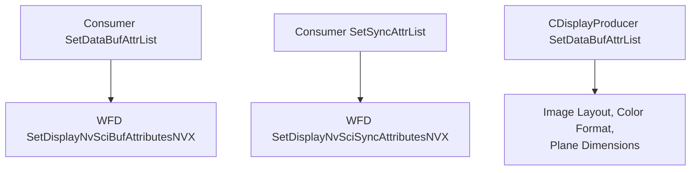
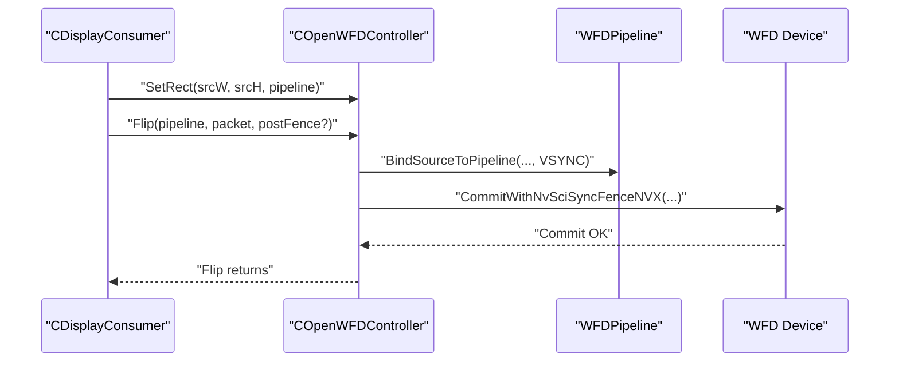
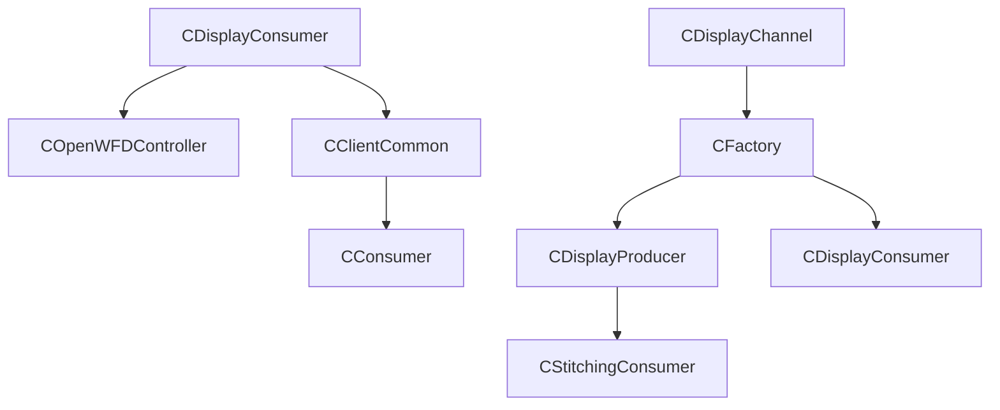

# Display Consumer

<cite>
**Referenced Files in This Document**
- [CDisplayConsumer.hpp](file://CDisplayConsumer.hpp)
- [CDisplayConsumer.cpp](file://CDisplayConsumer.cpp)
- [COpenWFDController.hpp](file://COpenWFDController.hpp)
- [COpenWFDController.cpp](file://COpenWFDController.cpp)
- [CDisplayChannel.hpp](file://CDisplayChannel.hpp)
- [CConsumer.hpp](file://CConsumer.hpp)
- [CConsumer.cpp](file://CConsumer.cpp)
- [CClientCommon.hpp](file://CClientCommon.hpp)
- [CClientCommon.cpp](file://CClientCommon.cpp)
- [Common.hpp](file://Common.hpp)
- [CAppConfig.hpp](file://CAppConfig.hpp)
- [CAppConfig.cpp](file://CAppConfig.cpp)
- [CDisplayProducer.hpp](file://CDisplayProducer.hpp)
- [CDisplayProducer.cpp](file://CDisplayProducer.cpp)
- [CFactory.hpp](file://CFactory.hpp)
- [CFactory.cpp](file://CFactory.cpp)
- [CSingleProcessChannel.hpp](file://CSingleProcessChannel.hpp)
- [main.cpp](file://main.cpp)
</cite>

## Table of Contents
1. [Introduction](#introduction)
2. [Project Structure](#project-structure)
3. [Core Components](#core-components)
4. [Architecture Overview](#architecture-overview)
5. [Detailed Component Analysis](#detailed-component-analysis)
6. [Dependency Analysis](#dependency-analysis)
7. [Performance Considerations](#performance-considerations)
8. [Troubleshooting Guide](#troubleshooting-guide)
9. [Conclusion](#conclusion)
10. [Appendices](#appendices)

## Introduction
This document explains the Display Consumer implementation in the NVIDIA SIPL Multicast system. It focuses on the CDisplayConsumer class and its integration with the COpenWFDController to render real-time video via OpenWFD pipelines. It covers the display pipeline, buffer and synchronization attribute management, rendering via Flip operations, configuration parameters for resolution and multi-display, integration patterns, performance optimization, and troubleshooting guidance.

## Project Structure
The display consumer sits within the broader SIPL Multicast pipeline:
- CDisplayChannel constructs a display pipeline with a display producer and one or more display consumers.
- CDisplayConsumer is a specialized consumer that maps NvSciBuf buffers to WFD sources and drives Flip operations.
- COpenWFDController manages OpenWFD device, port, pipeline, and source lifecycles, and performs Flip operations.
- CDisplayProducer composes frames and posts buffers to the consumer for display.
- CFactory creates the appropriate blocks and wires them into the stream graph.
- CAppConfig supplies configuration flags and sensor resolution used to size display buffers.

**Diagram sources**
- [CDisplayChannel.hpp:19-225](file://CDisplayChannel.hpp#L19-L225)
- [CDisplayProducer.hpp:18-127](file://CDisplayProducer.hpp#L18-L127)
- [CDisplayConsumer.hpp:15-47](file://CDisplayConsumer.hpp#L15-L47)
- [COpenWFDController.hpp:22-55](file://COpenWFDController.hpp#L22-L55)

**Section sources**
- [CDisplayChannel.hpp:19-225](file://CDisplayChannel.hpp#L19-L225)
- [CFactory.cpp:68-94](file://CFactory.cpp#L68-L94)
- [Common.hpp:14-31](file://Common.hpp#L14-L31)

## Core Components
- CDisplayConsumer: Specialized consumer that maps incoming NvSciBuf image buffers to WFD sources and triggers Flip to present frames. It delegates buffer and sync attribute setup to COpenWFDController and coordinates pre/post-fences.
- COpenWFDController: Manages OpenWFD device/port/pipeline/source lifecycle, sets buffer/sync attributes for display, registers sync objects, binds sources to pipelines, and performs Flip with optional post-fence.
- CDisplayChannel: Builds the display pipeline, wires the producer/consumer, and connects blocks to the stream.
- CDisplayProducer: Produces display-ready buffers, computes input rectangles for multi-camera layouts, and posts buffers to the consumer upon composition completion.
- CFactory: Creates pool, producer, consumer, queues, and multicast blocks; configures element usage per consumer type.
- CClientCommon/CConsumer: Base stream client behavior for packet acquisition, pre/post-fence handling, and sync object reconciliation.

**Section sources**
- [CDisplayConsumer.hpp:15-47](file://CDisplayConsumer.hpp#L15-L47)
- [CDisplayConsumer.cpp:12-139](file://CDisplayConsumer.cpp#L12-L139)
- [COpenWFDController.hpp:22-55](file://COpenWFDController.hpp#L22-L55)
- [COpenWFDController.cpp:15-349](file://COpenWFDController.cpp#L15-L349)
- [CDisplayChannel.hpp:19-225](file://CDisplayChannel.hpp#L19-L225)
- [CDisplayProducer.hpp:18-127](file://CDisplayProducer.hpp#L18-L127)
- [CDisplayProducer.cpp:18-382](file://CDisplayProducer.cpp#L18-L382)
- [CFactory.hpp:27-94](file://CFactory.hpp#L27-L94)
- [CFactory.cpp:68-205](file://CFactory.cpp#L68-L205)
- [CClientCommon.hpp:47-201](file://CClientCommon.hpp#L47-L201)
- [CConsumer.hpp:16-44](file://CConsumer.hpp#L16-L44)

## Architecture Overview
The display consumer participates in the NvSIPL streaming model:
- Producer creates display buffers and signals readiness.
- Consumer receives packets, inserts pre-fences, processes payload, and signals post-fences.
- CDisplayConsumer maps buffers to WFD sources and calls Flip to present frames.
- COpenWFDController configures WFD attributes, registers sync objects, and performs Flip with optional post-fence.

**Diagram sources**
- [CDisplayProducer.cpp:356-382](file://CDisplayProducer.cpp#L356-L382)
- [CDisplayConsumer.cpp:54-139](file://CDisplayConsumer.cpp#L54-L139)
- [COpenWFDController.cpp:254-349](file://COpenWFDController.cpp#L254-L349)

## Detailed Component Analysis

### CDisplayConsumer
Responsibilities:
- Pre-initialization with a WFD controller and pipeline index.
- Buffer attribute setup delegated to WFD controller for display buffers.
- Sync attribute setup for display sync objects.
- Mapping incoming NvSciBuf to WFD source per packet.
- Inserting pre-fences and registering signal sync objects.
- Finalizing setup by setting source/destination rectangles and performing an initial Flip.
- Processing payloads by calling Flip with optional post-fence.

Key behaviors:
- Uses a per-packet BufferAttrs cache populated during buffer mapping.
- Enforces initialization guard before processing payloads.
- Delegates all WFD operations to COpenWFDController.

**Diagram sources**
- [CConsumer.hpp:16-44](file://CConsumer.hpp#L16-L44)
- [CDisplayConsumer.hpp:15-47](file://CDisplayConsumer.hpp#L15-L47)
- [COpenWFDController.hpp:22-55](file://COpenWFDController.hpp#L22-L55)

**Section sources**
- [CDisplayConsumer.hpp:15-47](file://CDisplayConsumer.hpp#L15-L47)
- [CDisplayConsumer.cpp:12-139](file://CDisplayConsumer.cpp#L12-L139)

### COpenWFDController
Responsibilities:
- Initialize WFD device and enumerate/configure ports.
- Create and bind pipelines to ports.
- Configure NvSciBuf/NvSciSync attributes for display.
- Create WFD sources from NvSciBuf objects.
- Register signal/waiter sync objects and manage non-blocking commits.
- Bind sources to pipelines and commit with optional post-fences.

Highlights:
- Supports up to configured max ports and pipelines.
- Sets source/destination rectangles per pipeline.
- Enables non-blocking commit and adjusts post-fence scanout timing.

**Diagram sources**
- [COpenWFDController.cpp:29-80](file://COpenWFDController.cpp#L29-L80)
- [COpenWFDController.cpp:82-126](file://COpenWFDController.cpp#L82-L126)

**Section sources**
- [COpenWFDController.hpp:22-55](file://COpenWFDController.hpp#L22-L55)
- [COpenWFDController.cpp:15-194](file://COpenWFDController.cpp#L15-L194)

### Display Pipeline Construction (CDisplayChannel)
- Creates a static pool with a fixed number of packets.
- Creates a display consumer in mailbox queue mode to ensure latest-buffer semantics.
- Creates a display producer and initializes it with packet count and target resolution.
- Connects producer to consumer(s) and waits for stream events.

**Diagram sources**
- [CDisplayChannel.hpp:90-202](file://CDisplayChannel.hpp#L90-L202)
- [CFactory.cpp:68-205](file://CFactory.cpp#L68-L205)

**Section sources**
- [CDisplayChannel.hpp:90-202](file://CDisplayChannel.hpp#L90-L202)
- [CFactory.cpp:68-205](file://CFactory.cpp#L68-L205)

### Multi-Display Support and DP-MST
- DP-MST enables multiple sensors to drive separate WFD pipelines/ports.
- The framework conditionally creates display consumers per sensor up to the maximum number of WFD ports.
- Each consumer is pre-initialized with a distinct pipeline ID.

**Diagram sources**
- [CSingleProcessChannel.hpp:128-138](file://CSingleProcessChannel.hpp#L128-L138)
- [Common.hpp:29-31](file://Common.hpp#L29-L31)

**Section sources**
- [CSingleProcessChannel.hpp:128-138](file://CSingleProcessChannel.hpp#L128-L138)
- [Common.hpp:29-31](file://Common.hpp#L29-L31)

### Buffer and Sync Attribute Management
- Buffer attributes: The consumer requests display-specific NvSciBuf attributes from the WFD controller, including image type, scan type, and access permissions.
- Sync attributes: The consumer requests display-specific NvSciSync attributes for waiter/signaler roles and CPU-side waiting if needed.
- Producer attributes: The display producer sets image layout, color format, and plane dimensions based on configured resolution.

**Diagram sources**
- [CDisplayConsumer.cpp:37-52](file://CDisplayConsumer.cpp#L37-L52)
- [COpenWFDController.cpp:197-252](file://COpenWFDController.cpp#L197-L252)
- [CDisplayProducer.cpp:74-117](file://CDisplayProducer.cpp#L74-L117)

**Section sources**
- [CDisplayConsumer.cpp:37-52](file://CDisplayConsumer.cpp#L37-L52)
- [COpenWFDController.cpp:197-252](file://COpenWFDController.cpp#L197-L252)
- [CDisplayProducer.cpp:74-117](file://CDisplayProducer.cpp#L74-L117)

### Rendering Mechanism (Flip)
- After setup, the consumer sets source/destination rectangles and performs an initial Flip to prime the pipeline.
- During streaming, the consumer calls Flip with the current packet and optional post-fence.
- The WFD controller binds the source to the pipeline at VSYNC and commits with optional post-fence.

**Diagram sources**
- [CDisplayConsumer.cpp:93-113](file://CDisplayConsumer.cpp#L93-L113)
- [COpenWFDController.cpp:316-349](file://COpenWFDController.cpp#L316-L349)

**Section sources**
- [CDisplayConsumer.cpp:93-113](file://CDisplayConsumer.cpp#L93-L113)
- [COpenWFDController.cpp:316-349](file://COpenWFDController.cpp#L316-L349)

## Dependency Analysis
- CDisplayConsumer depends on COpenWFDController for all WFD operations.
- CDisplayChannel orchestrates creation and connection of producer/consumer blocks via CFactory.
- CDisplayProducer depends on CStitchingConsumer for composition and uses NvSciSync fences to coordinate submission.
- CClientCommon/CConsumer provide base stream behavior for packet handling, pre/post-fences, and sync object reconciliation.

**Diagram sources**
- [CDisplayConsumer.hpp:12-13](file://CDisplayConsumer.hpp#L12-L13)
- [COpenWFDController.hpp:15-20](file://COpenWFDController.hpp#L15-L20)
- [CDisplayChannel.hpp:36-40](file://CDisplayChannel.hpp#L36-L40)
- [CFactory.cpp:68-205](file://CFactory.cpp#L68-L205)
- [CDisplayProducer.hpp:17-18](file://CDisplayProducer.hpp#L17-L18)

**Section sources**
- [CDisplayConsumer.hpp:12-13](file://CDisplayConsumer.hpp#L12-L13)
- [COpenWFDController.hpp:15-20](file://COpenWFDController.hpp#L15-L20)
- [CDisplayChannel.hpp:36-40](file://CDisplayChannel.hpp#L36-L40)
- [CFactory.cpp:68-205](file://CFactory.cpp#L68-L205)
- [CDisplayProducer.hpp:17-18](file://CDisplayProducer.hpp#L17-L18)

## Performance Considerations
- Non-blocking commits: The WFD controller enables non-blocking pipeline commits and adjusts post-fence scanout timing to reduce latency.
- Initial Flip: Performing an initial Flip during setup avoids timeouts waiting for post-fences on the first frame.
- Mailbox queue: Using mailbox queue for the display consumer ensures the latest buffer is presented, reducing perceived lag.
- Fence handling: Proper insertion of pre-fences and signaling of post-fences maintains correct ordering between producer/compositor and display consumer.
- Resolution sizing: The display producer’s plane dimensions are derived from configuration to match the intended output resolution.

[No sources needed since this section provides general guidance]

## Troubleshooting Guide
Common issues and diagnostics:
- Initialization order: Ensure HandleSetupComplete is reached before processing payloads; the consumer enforces an initialization guard.
- WFD errors: Use the provided macros to check WFD and NvSci statuses and log detailed error codes.
- Port/pipeline limits: Exceeding maximum ports or pipelines leads to resource errors; verify configuration constants.
- Fence timeouts: If post-fence waits fail, confirm that post-fences are generated and waited on correctly in the producer/consumer chain.
- Attribute mismatches: Ensure buffer/sync attributes are reconciled; missing waiter attributes can lead to null sync objects.

**Section sources**
- [CDisplayConsumer.cpp:121-134](file://CDisplayConsumer.cpp#L121-L134)
- [COpenWFDController.cpp:337-349](file://COpenWFDController.cpp#L337-L349)
- [COpenWFDController.cpp:265-299](file://COpenWFDController.cpp#L265-L299)
- [CClientCommon.cpp:125-205](file://CClientCommon.cpp#L125-L205)

## Conclusion
The Display Consumer integrates tightly with COpenWFDController to deliver real-time video via OpenWFD pipelines. It leverages NvSIPL’s stream model for efficient buffer and sync management, supports multi-display via DP-MST, and uses mailbox queues and non-blocking commits to optimize latency. Correct configuration of resolution and element usage, combined with careful fence handling, yields robust and performant display output.

[No sources needed since this section summarizes without analyzing specific files]

## Appendices

### Configuration Parameters and Integration Patterns
- Resolution: The display producer’s width/height are set during PreInit; these derive from application configuration for the sensor.
- Queue type: Display consumer uses mailbox queue to ensure latest-frame presentation.
- Multi-display: DP-MST enables multiple consumers, each mapped to a separate pipeline/port.
- Element usage: Factory configures element usage for display consumers depending on enabled modes (stitching vs. DP-MST).

**Section sources**
- [CDisplayProducer.cpp:23-28](file://CDisplayProducer.cpp#L23-L28)
- [CAppConfig.cpp:77-94](file://CAppConfig.cpp#L77-L94)
- [CFactory.cpp:126-136](file://CFactory.cpp#L126-L136)
- [CDisplayChannel.hpp:103-108](file://CDisplayChannel.hpp#L103-L108)
- [CSingleProcessChannel.hpp:128-138](file://CSingleProcessChannel.hpp#L128-L138)

### Practical Examples
- Basic display setup: Create a display channel, initialize blocks, connect producer to consumer, and run the stream loop.
- Custom resolution: Adjust the display producer’s width/height during PreInit to match target resolution.
- Multi-display: Enable DP-MST and create a display consumer per sensor; each gets a unique pipeline ID.

**Section sources**
- [CDisplayChannel.hpp:134-202](file://CDisplayChannel.hpp#L134-L202)
- [CDisplayProducer.cpp:23-28](file://CDisplayProducer.cpp#L23-L28)
- [CSingleProcessChannel.hpp:128-138](file://CSingleProcessChannel.hpp#L128-L138)