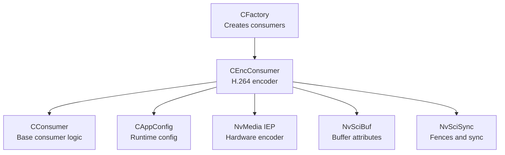
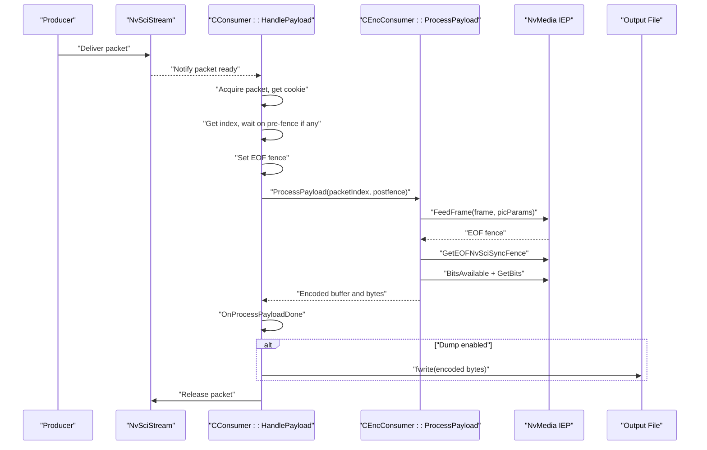
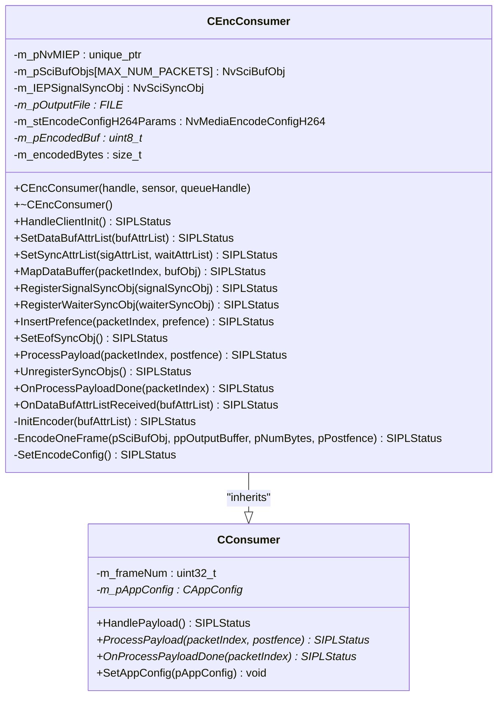
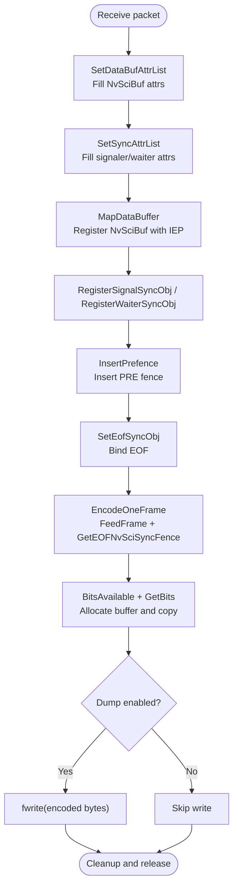
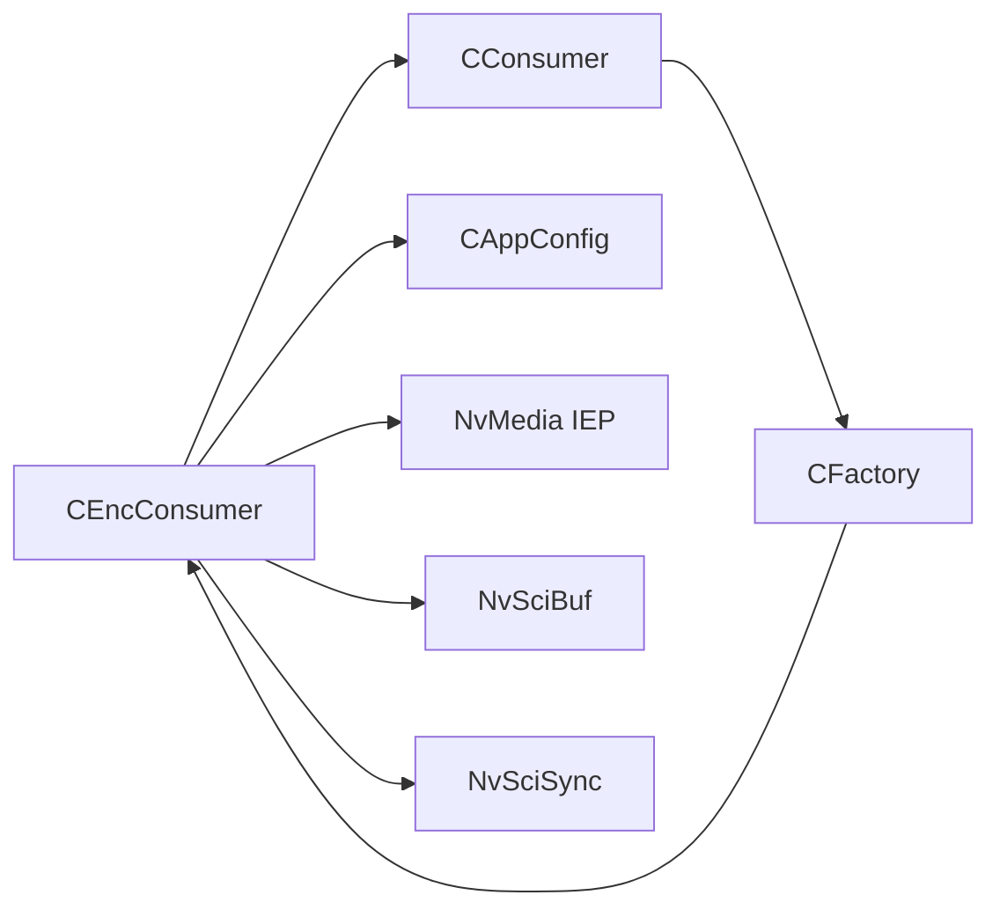

# Encoder Consumer

<cite>
**Referenced Files in This Document**
- [CEncConsumer.hpp](file://CEncConsumer.hpp)
- [CEncConsumer.cpp](file://CEncConsumer.cpp)
- [CConsumer.hpp](file://CConsumer.hpp)
- [CConsumer.cpp](file://CConsumer.cpp)
- [CFactory.hpp](file://CFactory.hpp)
- [CFactory.cpp](file://CFactory.cpp)
- [CAppConfig.hpp](file://CAppConfig.hpp)
- [CAppConfig.cpp](file://CAppConfig.cpp)
- [Common.hpp](file://Common.hpp)
- [README.md](file://README.md)
- [main.cpp](file://main.cpp)
</cite>

## Table of Contents
1. [Introduction](#introduction)
2. [Project Structure](#project-structure)
3. [Core Components](#core-components)
4. [Architecture Overview](#architecture-overview)
5. [Detailed Component Analysis](#detailed-component-analysis)
6. [Dependency Analysis](#dependency-analysis)
7. [Performance Considerations](#performance-considerations)
8. [Troubleshooting Guide](#troubleshooting-guide)
9. [Conclusion](#conclusion)
10. [Appendices](#appendices)

## Introduction
This document describes the Encoder Consumer implementation in the NVIDIA SIPL Multicast system. It focuses on the CEncConsumer class that performs hardware-accelerated H.264 encoding using NvMedia IEP, and explains how it integrates into the broader streaming pipeline. The documentation covers the encoding pipeline, buffer and synchronization management, stream output, configuration parameters for quality and bitrate, and practical guidance for performance tuning and troubleshooting.

## Project Structure
The Encoder Consumer resides in the multicast sample and participates in a producer-consumer model built on NvSciStream and NvMedia IEP. The consumer is created via the factory and inherits from the base CConsumer class, which handles packet acquisition, synchronization, and lifecycle events.

**Diagram sources**
- [CFactory.cpp:166-205](file://CFactory.cpp#L166-L205)
- [CEncConsumer.hpp:17-64](file://CEncConsumer.hpp#L17-L64)
- [CConsumer.hpp:16-44](file://CConsumer.hpp#L16-L44)
- [CAppConfig.hpp:19-83](file://CAppConfig.hpp#L19-L83)

**Section sources**
- [CFactory.cpp:166-205](file://CFactory.cpp#L166-L205)
- [CFactory.hpp:45-46](file://CFactory.hpp#L45-L46)
- [CEncConsumer.hpp:17-64](file://CEncConsumer.hpp#L17-L64)
- [CConsumer.hpp:16-44](file://CConsumer.hpp#L16-L44)

## Core Components
- CEncConsumer: Implements the H.264 encoder consumer. It initializes NvMedia IEP, configures encoding parameters, registers buffers and synchronization objects, encodes frames, and writes output to file when enabled.
- CConsumer: Base class handling packet lifecycle, frame filtering, pre/post fences, and releasing packets back to the producer.
- CFactory: Creates consumer instances and sets up queues and element usage per consumer type.
- CAppConfig: Provides runtime configuration including platform configuration, resolution, and dump flags.

Key responsibilities:
- Buffer attribute negotiation with NvMedia IEP
- Synchronization object registration for pre/post fences
- Frame encoding via NvMedia IEP
- Output buffering and file dumping
- Cleanup of resources and sync objects

**Section sources**
- [CEncConsumer.hpp:17-64](file://CEncConsumer.hpp#L17-L64)
- [CEncConsumer.cpp:17-26](file://CEncConsumer.cpp#L17-L26)
- [CConsumer.cpp:17-94](file://CConsumer.cpp#L17-L94)
- [CFactory.cpp:166-205](file://CFactory.cpp#L166-L205)
- [CAppConfig.cpp:77-94](file://CAppConfig.cpp#L77-L94)

## Architecture Overview
The encoder consumer participates in a multichannel NvSciStream pipeline. The base consumer acquires packets, waits on pre-fences if present, sets EOF fences, invokes the encoder, and releases the packet. The encoder consumes NvSciBuf objects and produces H.264 bitstreams.

**Diagram sources**
- [CConsumer.cpp:17-94](file://CConsumer.cpp#L17-L94)
- [CEncConsumer.cpp:309-317](file://CEncConsumer.cpp#L309-L317)
- [CEncConsumer.cpp:230-306](file://CEncConsumer.cpp#L230-L306)

## Detailed Component Analysis

### CEncConsumer Class
CEncConsumer extends CConsumer and implements the H.264 encoding pipeline. It manages:
- NvMedia IEP encoder lifecycle
- Encoding configuration (GOP, IDR period, rate control, presets)
- Buffer and sync object registration
- Frame encoding and output buffering
- Optional file dumping of encoded frames

**Diagram sources**
- [CConsumer.hpp:16-44](file://CConsumer.hpp#L16-L44)
- [CEncConsumer.hpp:17-64](file://CEncConsumer.hpp#L17-L64)

Key methods and responsibilities:
- Initialization and teardown:
  - Constructor sets up base class and logging identity.
  - Destructor unregisters buffers and sync objects, frees VUI params, and closes output file.
- Buffer and sync setup:
  - SetDataBufAttrList fills NvSciBuf attributes required by NvMedia IEP.
  - SetSyncAttrList fills signaler/waiter NvSciSync attributes for IEP.
  - MapDataBuffer registers NvSciBuf objects with IEP.
  - RegisterSignalSyncObj and RegisterWaiterSyncObj register EOF and PRE sync objects with IEP.
  - InsertPrefence inserts pre-fences into IEP.
  - SetEofSyncObj binds the EOF sync object for completion signaling.
- Encoding pipeline:
  - OnDataBufAttrListReceived initializes the encoder when the reconciled attributes arrive.
  - ProcessPayload delegates to EncodeOneFrame to feed a frame and obtain encoded bytes.
  - EncodeOneFrame sets picture parameters (IDR for first dump frame), feeds the frame to IEP, obtains EOF fence, and retrieves bitstream data.
- Output handling:
  - OnProcessPayloadDone writes encoded bytes to file if dumping is enabled and within the configured frame window.

**Section sources**
- [CEncConsumer.hpp:17-64](file://CEncConsumer.hpp#L17-L64)
- [CEncConsumer.cpp:94-114](file://CEncConsumer.cpp#L94-L114)
- [CEncConsumer.cpp:117-140](file://CEncConsumer.cpp#L117-L140)
- [CEncConsumer.cpp:143-156](file://CEncConsumer.cpp#L143-L156)
- [CEncConsumer.cpp:158-168](file://CEncConsumer.cpp#L158-L168)
- [CEncConsumer.cpp:170-189](file://CEncConsumer.cpp#L170-L189)
- [CEncConsumer.cpp:210-228](file://CEncConsumer.cpp#L210-L228)
- [CEncConsumer.cpp:347-355](file://CEncConsumer.cpp#L347-L355)
- [CEncConsumer.cpp:309-317](file://CEncConsumer.cpp#L309-L317)
- [CEncConsumer.cpp:230-306](file://CEncConsumer.cpp#L230-L306)
- [CEncConsumer.cpp:319-345](file://CEncConsumer.cpp#L319-L345)

### Encoding Pipeline and Buffer Management
- Buffer attributes:
  - NvMedia IEP requires specific NvSciBuf attributes (access permissions, type, CPU cache flags). These are filled and set on the reconciled attribute list.
- Sync objects:
  - Signal and wait lists are filled for IEP. The EOF signal is registered and later used to obtain a fence indicating completion.
  - Pre-fences are inserted into IEP to coordinate with producer writes.
- Frame encoding:
  - Picture parameters include picture type selection (IDR for the first dump frame) and flags to output SPS/PPS.
  - FeedFrame submits the frame; GetEOFNvSciSyncFence retrieves the completion fence.
  - BitsAvailable and GetBits retrieve the encoded bitstream; the consumer allocates a buffer and copies the bitstream.
- Output:
  - Encoded bytes are written to a file when dumping is enabled and within the configured frame window.

**Diagram sources**
- [CEncConsumer.cpp:117-140](file://CEncConsumer.cpp#L117-L140)
- [CEncConsumer.cpp:143-156](file://CEncConsumer.cpp#L143-L156)
- [CEncConsumer.cpp:158-168](file://CEncConsumer.cpp#L158-L168)
- [CEncConsumer.cpp:170-189](file://CEncConsumer.cpp#L170-L189)
- [CEncConsumer.cpp:210-228](file://CEncConsumer.cpp#L210-L228)
- [CEncConsumer.cpp:230-306](file://CEncConsumer.cpp#L230-L306)
- [CEncConsumer.cpp:319-345](file://CEncConsumer.cpp#L319-L345)

**Section sources**
- [CEncConsumer.cpp:117-140](file://CEncConsumer.cpp#L117-L140)
- [CEncConsumer.cpp:143-156](file://CEncConsumer.cpp#L143-L156)
- [CEncConsumer.cpp:158-168](file://CEncConsumer.cpp#L158-L168)
- [CEncConsumer.cpp:170-189](file://CEncConsumer.cpp#L170-L189)
- [CEncConsumer.cpp:210-228](file://CEncConsumer.cpp#L210-L228)
- [CEncConsumer.cpp:230-306](file://CEncConsumer.cpp#L230-L306)
- [CEncConsumer.cpp:319-345](file://CEncConsumer.cpp#L319-L345)

### Configuration Parameters for Video Quality and Bitrate
The encoder configuration is set during initialization and includes:
- GOP length and IDR period
- Repeat SPS/PPS behavior
- Adaptive transform and B-direct modes
- Entropy coding mode and encoder preset
- Rate control mode and QP values for intra/inter frames
- Number of B-frames

These parameters are applied via NvMedia IEP configuration APIs. The consumer reads the target resolution from CAppConfig to initialize the encoder with the correct dimensions.

Practical customization points:
- Adjust GOP length and IDR period for keyframe frequency.
- Modify rate control mode and QP values to balance quality and bitrate.
- Tune encoder preset for performance vs. quality trade-offs.
- Control B-frame usage and adaptive transform settings.

**Section sources**
- [CEncConsumer.cpp:28-55](file://CEncConsumer.cpp#L28-L55)
- [CEncConsumer.cpp:57-92](file://CEncConsumer.cpp#L57-L92)
- [CAppConfig.cpp:77-94](file://CAppConfig.cpp#L77-L94)

### Integration with NvMedia IEP and Hardware-Accelerated Encoding
- Initialization:
  - The encoder is created with NvMedia IEP using the H.264 encode mode and reconciled NvSciBuf attributes.
  - The encoder instance is bound to a specific hardware encoder instance.
- Configuration:
  - The H.264 configuration structure is populated and applied to the encoder.
- Frame processing:
  - Frames are fed to the encoder with picture parameters.
  - Completion is signaled via an EOF NvSciSync fence.
  - Encoded bitstreams are retrieved using BitsAvailable and GetBits.

**Section sources**
- [CEncConsumer.cpp:57-92](file://CEncConsumer.cpp#L57-L92)
- [CEncConsumer.cpp:230-306](file://CEncConsumer.cpp#L230-L306)

### Stream Output Mechanisms
- File dumping:
  - When enabled, encoded frames are written to a .h264 file with a sensor-specific suffix.
  - Writing occurs only within a configurable frame window.
- Packet lifecycle:
  - The base consumer manages packet acquisition, pre-fence insertion, EOF fence setting, and packet release.

**Section sources**
- [CEncConsumer.cpp:17-26](file://CEncConsumer.cpp#L17-L26)
- [CEncConsumer.cpp:319-345](file://CEncConsumer.cpp#L319-L345)
- [CConsumer.cpp:17-94](file://CConsumer.cpp#L17-L94)

### Practical Examples and Integration Patterns
- Creating an encoder consumer:
  - Use the factory to create a consumer with ConsumerType_Enc; the factory sets up the queue and element usage.
- Custom encoding configurations:
  - Modify GOP length, IDR period, rate control mode, and QP values in the encoder configuration routine.
- Integration with other consumers:
  - The factory supports multiple consumer types (CUDA, stitching, display) alongside the encoder, enabling mixed pipelines.

**Section sources**
- [CFactory.cpp:166-205](file://CFactory.cpp#L166-L205)
- [CFactory.hpp:45-46](file://CFactory.hpp#L45-L46)
- [CEncConsumer.cpp:28-55](file://CEncConsumer.cpp#L28-L55)

## Dependency Analysis
CEncConsumer depends on:
- NvMedia IEP for hardware encoding
- NvSciBuf and NvSciSync for buffer and synchronization
- CAppConfig for runtime configuration and resolution
- CConsumer for packet lifecycle and fence management

**Diagram sources**
- [CEncConsumer.hpp:17-64](file://CEncConsumer.hpp#L17-L64)
- [CConsumer.hpp:16-44](file://CConsumer.hpp#L16-L44)
- [CFactory.cpp:166-205](file://CFactory.cpp#L166-L205)

**Section sources**
- [CEncConsumer.hpp:17-64](file://CEncConsumer.hpp#L17-L64)
- [CConsumer.hpp:16-44](file://CConsumer.hpp#L16-L44)
- [CFactory.cpp:166-205](file://CFactory.cpp#L166-L205)

## Performance Considerations
- Frame filtering:
  - The base consumer supports frame filtering via configuration, allowing processing of every nth frame to reduce load.
- Buffer management:
  - Ensure NvSciBuf attributes align with IEP expectations to minimize reconfiguration overhead.
- Fence handling:
  - Proper insertion and clearing of pre/post fences prevents stalls and ensures correct ordering.
- Memory allocation:
  - Allocate encoded buffers only when needed and free them promptly after writing to file.
- Encoder settings:
  - Tune GOP length, IDR period, and rate control mode to balance latency and throughput.
  - Consider encoder preset for performance vs. quality trade-offs.

[No sources needed since this section provides general guidance]

## Troubleshooting Guide
Common issues and resolutions:
- Initialization failures:
  - Verify that NvMedia IEP creation succeeds and that reconciled attributes are valid.
  - Ensure resolution is available from CAppConfig.
- Buffer registration errors:
  - Confirm NvSciBuf attributes are filled and set correctly before registering with IEP.
- Sync object issues:
  - Ensure EOF and PRE sync objects are registered and set appropriately; missing fences can cause deadlocks.
- Encoding errors:
  - Check BitsAvailable and GetBits return codes; handle pending states and byte count mismatches.
- File dumping problems:
  - Validate output file handle and ensure writes occur within the configured frame window.

**Section sources**
- [CEncConsumer.cpp:57-92](file://CEncConsumer.cpp#L57-L92)
- [CEncConsumer.cpp:117-140](file://CEncConsumer.cpp#L117-L140)
- [CEncConsumer.cpp:143-156](file://CEncConsumer.cpp#L143-L156)
- [CEncConsumer.cpp:170-189](file://CEncConsumer.cpp#L170-L189)
- [CEncConsumer.cpp:210-228](file://CEncConsumer.cpp#L210-L228)
- [CEncConsumer.cpp:230-306](file://CEncConsumer.cpp#L230-L306)
- [CEncConsumer.cpp:319-345](file://CEncConsumer.cpp#L319-L345)

## Conclusion
The CEncConsumer provides a robust, hardware-accelerated H.264 encoding pipeline integrated into the SIPL Multicast framework. By leveraging NvMedia IEP and NvSciStream/NvSciBuf primitives, it efficiently transforms incoming frames into compressed bitstreams, with flexible configuration for quality and performance. The base consumer’s packet lifecycle management ensures correct synchronization and resource handling across the pipeline.

[No sources needed since this section summarizes without analyzing specific files]

## Appendices

### Configuration Options Reference
- Resolution:
  - Retrieved from CAppConfig to initialize encoder dimensions.
- Dumping:
  - Enabled via CAppConfig flag; writes encoded frames to .h264 files.
- Frame filtering:
  - Controlled by CAppConfig to process every nth frame.

**Section sources**
- [CAppConfig.cpp:77-94](file://CAppConfig.cpp#L77-L94)
- [CAppConfig.hpp:37-42](file://CAppConfig.hpp#L37-L42)
- [CConsumer.cpp:38-43](file://CConsumer.cpp#L38-L43)

### Example Usage Scenarios
- Single-process pipeline with encoder and CUDA consumers.
- Inter-process and inter-chip pipelines with encoder consumer.
- Late attachment scenarios with encoder consumer as early consumer.

**Section sources**
- [README.md:21-92](file://README.md#L21-L92)