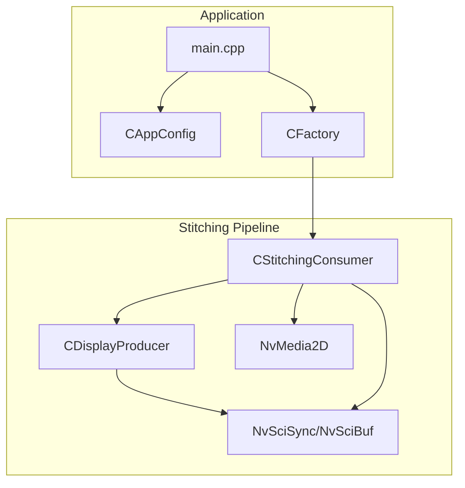
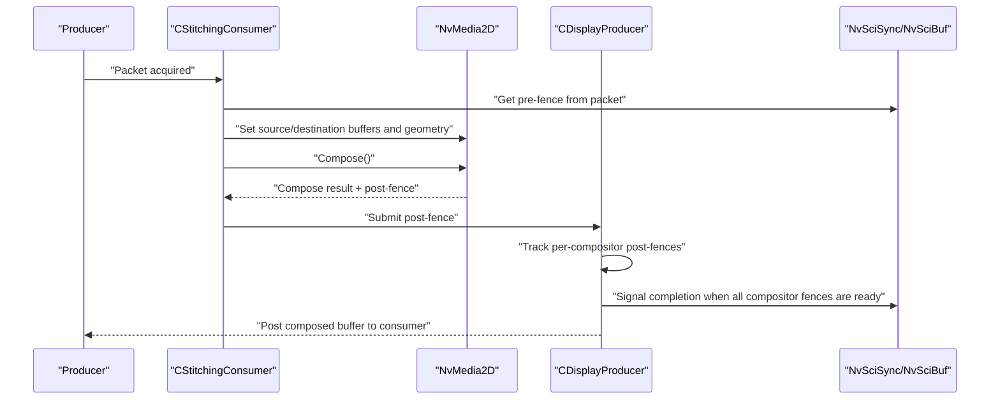
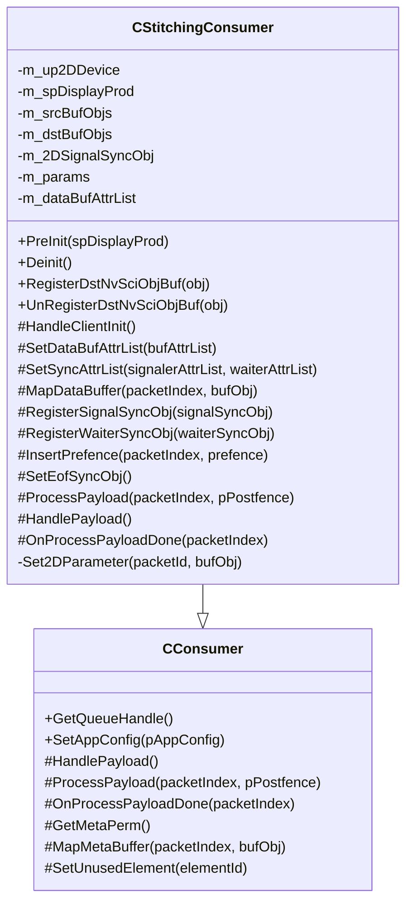
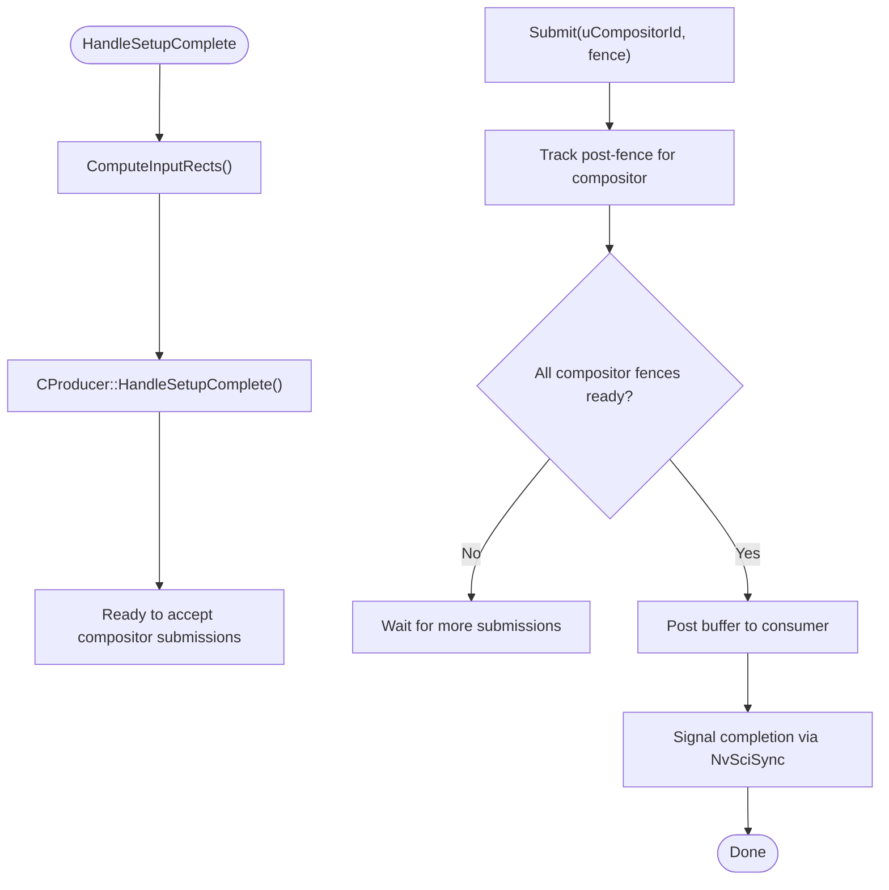
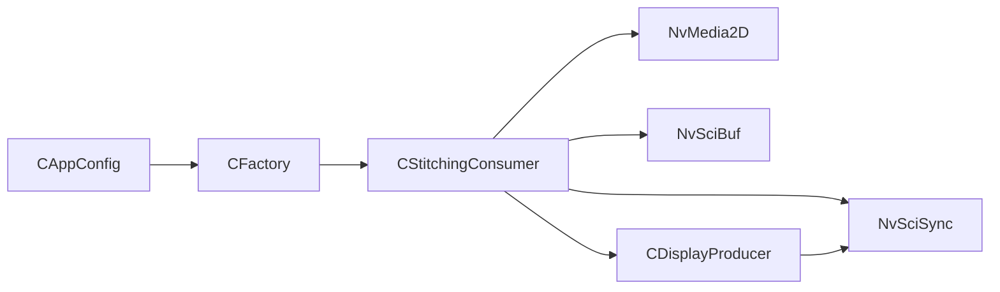

# Stitching Consumer

<cite>
**Referenced Files in This Document**
- [CStitchingConsumer.hpp](file://CStitchingConsumer.hpp)
- [CStitchingConsumer.cpp](file://CStitchingConsumer.cpp)
- [CConsumer.hpp](file://CConsumer.hpp)
- [CConsumer.cpp](file://CConsumer.cpp)
- [CDisplayProducer.hpp](file://CDisplayProducer.hpp)
- [CDisplayProducer.cpp](file://CDisplayProducer.cpp)
- [CFactory.hpp](file://CFactory.hpp)
- [CFactory.cpp](file://CFactory.cpp)
- [Common.hpp](file://Common.hpp)
- [CAppConfig.hpp](file://CAppConfig.hpp)
- [CAppConfig.cpp](file://CAppConfig.cpp)
- [main.cpp](file://main.cpp)
- [README.md](file://README.md)
- [ar0820.hpp](file://platform/ar0820.hpp)
</cite>

## Table of Contents
1. [Introduction](#introduction)
2. [Project Structure](#project-structure)
3. [Core Components](#core-components)
4. [Architecture Overview](#architecture-overview)
5. [Detailed Component Analysis](#detailed-component-analysis)
6. [Dependency Analysis](#dependency-analysis)
7. [Performance Considerations](#performance-considerations)
8. [Troubleshooting Guide](#troubleshooting-guide)
9. [Conclusion](#conclusion)
10. [Appendices](#appendices)

## Introduction
This document describes the Stitching Consumer implementation in the NVIDIA SIPL Multicast system. It focuses on the CStitchingConsumer class, its role in multi-camera image stitching and panoramic display, the image composition pipeline, coordinate transformations, and panorama generation. It also covers configuration parameters for camera calibration, stitching algorithms, and output resolution, along with integration patterns for multiple camera inputs, geometric corrections, color balancing, performance optimizations, memory management strategies, and troubleshooting guidance.

## Project Structure
The stitching pipeline integrates consumers, producers, and synchronization primitives provided by NvMedia and NvSci. The key files for stitching are:
- CStitchingConsumer: the consumer that composes multiple camera frames into a single output surface.
- CDisplayProducer: the producer that manages output buffers and coordinates submission to the display consumer.
- CFactory: constructs consumers and queues, including the stitching consumer.
- CAppConfig: holds runtime configuration including platform and display settings.
- Common.hpp: defines constants and enums used across the system.

**Diagram sources**
- [main.cpp:253-303](file://main.cpp#L253-L303)
- [CFactory.cpp:166-205](file://CFactory.cpp#L166-L205)
- [CStitchingConsumer.cpp:12-15](file://CStitchingConsumer.cpp#L12-L15)
- [CDisplayProducer.cpp:18-21](file://CDisplayProducer.cpp#L18-L21)

**Section sources**
- [main.cpp:253-303](file://main.cpp#L253-L303)
- [CFactory.cpp:166-205](file://CFactory.cpp#L166-L205)
- [Common.hpp:14-86](file://Common.hpp#L14-L86)

## Core Components
- CStitchingConsumer: Inherits from CConsumer and implements the 2D composition logic using NvMedia2D. It registers buffers and sync objects, sets up composition parameters, and submits composed frames to the display producer.
- CDisplayProducer: Manages output buffers, computes input rectangles for each camera, and coordinates multi-compositor submission. It runs a dedicated thread to post buffers to consumers and signals completion via NvSci fences.
- CFactory: Creates the stitching consumer and wires it into the NvSci stream infrastructure, including queue creation and element usage selection.
- CAppConfig: Provides platform configuration and display-related flags, including stitching display enablement and frame filtering.

**Section sources**
- [CStitchingConsumer.hpp:17-72](file://CStitchingConsumer.hpp#L17-L72)
- [CStitchingConsumer.cpp:12-85](file://CStitchingConsumer.cpp#L12-L85)
- [CDisplayProducer.hpp:18-127](file://CDisplayProducer.hpp#L18-L127)
- [CDisplayProducer.cpp:18-72](file://CDisplayProducer.cpp#L18-L72)
- [CFactory.cpp:166-205](file://CFactory.cpp#L166-L205)
- [CAppConfig.hpp:19-82](file://CAppConfig.hpp#L19-L82)

## Architecture Overview
The stitching consumer participates in a multi-stage pipeline:
- Consumers acquire packets from NvSci stream blocks and prepare composition parameters.
- Composition is performed by NvMedia2D using registered NvSciBuf objects and NvSciSync fences.
- The display producer manages output surfaces, tracks per-compositor post-fences, and posts the final image to consumers when all compositors have finished.

**Diagram sources**
- [CStitchingConsumer.cpp:187-296](file://CStitchingConsumer.cpp#L187-L296)
- [CDisplayProducer.cpp:276-313](file://CDisplayProducer.cpp#L276-L313)

## Detailed Component Analysis

### CStitchingConsumer
CStitchingConsumer orchestrates the 2D composition of multiple camera inputs into a single output surface. It:
- Initializes an NvMedia2D device and registers it with NvSciBuf and NvSciSync objects.
- Registers destination buffers provided by the display producer.
- Sets up NvSciBuf attributes and NvSciSync attributes for signaling/waiting.
- Maps incoming source buffers per packet index and registers them with NvMedia2D.
- Inserts pre-fences from producers and sets EOF sync objects for synchronization.
- Performs composition and submits the resulting post-fence to the display producer.

**Diagram sources**
- [CConsumer.hpp:16-43](file://CConsumer.hpp#L16-L43)
- [CStitchingConsumer.hpp:17-72](file://CStitchingConsumer.hpp#L17-L72)

Key implementation highlights:
- Device lifecycle and registration: creates NvMedia2D device, registers NvSciBuf and NvSciSync objects, and cleans them up during deinitialization.
- Buffer and sync setup: fills NvSciBuf attributes for image type and permissions, and NvSciSync attributes for signaler and waiter roles.
- Payload processing: acquires packet, retrieves pre-fences, sets 2D parameters (source and destination), composes, obtains post-fence, and submits to display producer.
- Parameter setting: sets source layer geometry and transform, and destination buffer for composition.

**Section sources**
- [CStitchingConsumer.cpp:12-85](file://CStitchingConsumer.cpp#L12-L85)
- [CStitchingConsumer.cpp:105-127](file://CStitchingConsumer.cpp#L105-L127)
- [CStitchingConsumer.cpp:130-139](file://CStitchingConsumer.cpp#L130-L139)
- [CStitchingConsumer.cpp:141-151](file://CStitchingConsumer.cpp#L141-L151)
- [CStitchingConsumer.cpp:153-176](file://CStitchingConsumer.cpp#L153-L176)
- [CStitchingConsumer.cpp:187-296](file://CStitchingConsumer.cpp#L187-L296)
- [CStitchingConsumer.cpp:298-316](file://CStitchingConsumer.cpp#L298-L316)

### CDisplayProducer
CDisplayProducer manages output surfaces and coordinates multi-compositor submission:
- Pre-initializes buffer pools with configurable width and height.
- Computes input rectangles for each compositor based on the number of sensors and layout.
- Registers destination buffers with all registered compositors.
- Tracks per-compositor post-fences and posts the buffer to consumers when all compositor operations are complete.
- Runs a dedicated thread to handle posting and synchronization.

**Diagram sources**
- [CDisplayProducer.cpp:315-324](file://CDisplayProducer.cpp#L315-L324)
- [CDisplayProducer.cpp:247-274](file://CDisplayProducer.cpp#L247-L274)
- [CDisplayProducer.cpp:276-313](file://CDisplayProducer.cpp#L276-L313)
- [CDisplayProducer.cpp:326-382](file://CDisplayProducer.cpp#L326-L382)

**Section sources**
- [CDisplayProducer.hpp:18-127](file://CDisplayProducer.hpp#L18-L127)
- [CDisplayProducer.cpp:23-59](file://CDisplayProducer.cpp#L23-L59)
- [CDisplayProducer.cpp:247-274](file://CDisplayProducer.cpp#L247-L274)
- [CDisplayProducer.cpp:276-313](file://CDisplayProducer.cpp#L276-L313)
- [CDisplayProducer.cpp:326-382](file://CDisplayProducer.cpp#L326-L382)

### Integration with Multiple Camera Inputs
- CFactory creates the stitching consumer and sets packet elements to include NV12 buffers for composition.
- CAppConfig provides platform configuration and display flags, including enabling stitching display and frame filtering.
- The display producer computes input rectangles for multiple sensors and ensures each compositor gets the correct region.

Practical integration patterns:
- Enable stitching display via configuration flags and pass the display producer to the stitching consumer during pre-init.
- Configure output resolution and ensure the display producer’s width/height match the intended panorama size.

**Section sources**
- [CFactory.cpp:166-205](file://CFactory.cpp#L166-L205)
- [CAppConfig.cpp:77-94](file://CAppConfig.cpp#L77-L94)
- [CDisplayProducer.cpp:247-274](file://CDisplayProducer.cpp#L247-L274)

## Dependency Analysis
The stitching consumer depends on:
- NvMedia2D for 2D composition operations.
- NvSciBuf and NvSciSync for cross-process buffer sharing and synchronization.
- CDisplayProducer for buffer availability and submission coordination.
- CAppConfig for platform and display configuration.

**Diagram sources**
- [CStitchingConsumer.cpp:28-36](file://CStitchingConsumer.cpp#L28-L36)
- [CDisplayProducer.cpp:18-21](file://CDisplayProducer.cpp#L18-L21)
- [CFactory.cpp:166-205](file://CFactory.cpp#L166-L205)

**Section sources**
- [CStitchingConsumer.cpp:28-36](file://CStitchingConsumer.cpp#L28-L36)
- [CDisplayProducer.cpp:18-21](file://CDisplayProducer.cpp#L18-L21)
- [CFactory.cpp:166-205](file://CFactory.cpp#L166-L205)

## Performance Considerations
- Frame filtering: CConsumer applies a frame filter to reduce processing load by skipping frames based on configuration.
- CPU wait vs. fence signaling: The stitching consumer uses CPU wait contexts when configured, allowing efficient synchronization without busy-wait loops.
- Buffer registration: Reuse of NvSciBuf attribute lists and avoiding repeated registrations reduces overhead.
- Output resolution: Larger output resolutions increase GPU workload; tune output dimensions to balance quality and performance.
- Multi-element support: Enabling multiple elements can distribute bandwidth across lanes, improving throughput for multi-camera setups.

[No sources needed since this section provides general guidance]

## Troubleshooting Guide
Common issues and remedies:
- No available destination buffer: The display producer returns null when buffers are unavailable; ensure sufficient buffer pool size and timely submission.
- Fence wait timeouts: Excessive wait times indicate producer/consumer desynchronization; verify pre/post fence insertion and submission order.
- Buffer registration failures: Ensure NvSciBuf objects are registered with NvMedia2D before composition and unregistered during cleanup.
- Geometry misalignment: Verify input rectangles computed by the display producer match expected camera layouts; adjust output resolution and sensor counts accordingly.
- Platform configuration mismatches: Confirm platform configuration and masks align across producer and consumers to prevent peer validation failures.

**Section sources**
- [CStitchingConsumer.cpp:229-239](file://CStitchingConsumer.cpp#L229-L239)
- [CDisplayProducer.cpp:222-245](file://CDisplayProducer.cpp#L222-L245)
- [CStitchingConsumer.cpp:48-84](file://CStitchingConsumer.cpp#L48-L84)
- [CDisplayProducer.cpp:363-371](file://CDisplayProducer.cpp#L363-L371)

## Conclusion
The CStitchingConsumer provides a robust, GPU-accelerated composition pipeline for multi-camera stitching within the NVIDIA SIPL Multicast framework. By leveraging NvMedia2D and NvSci primitives, it efficiently composes multiple camera inputs into a single panoramic output surface managed by the display producer. Proper configuration of platform settings, output resolution, and buffer management is essential for achieving real-time performance and reliable operation.

[No sources needed since this section summarizes without analyzing specific files]

## Appendices

### Configuration Parameters and Calibration
- Platform configuration: The application selects platform configurations (e.g., AR0820) that define sensor IDs, resolutions, and formats. These influence camera calibration and output dimensions.
- Display settings: Flags in CAppConfig control stitching display enablement and frame filtering.
- Output resolution: The display producer’s width and height determine the final panorama size; adjust according to desired field of view and performance targets.

**Section sources**
- [CAppConfig.cpp:21-75](file://CAppConfig.cpp#L21-L75)
- [CAppConfig.cpp:77-94](file://CAppConfig.cpp#L77-L94)
- [CDisplayProducer.cpp:23-28](file://CDisplayProducer.cpp#L23-L28)
- [ar0820.hpp:72-98](file://platform/ar0820.hpp#L72-L98)

### Practical Examples
- Enabling stitching display: Use the documented command-line option to enable stitching and display; the system defaults to a standard resolution suitable for demonstration.
- Multi-camera setup: The display producer computes input rectangles for multiple sensors; ensure the number of sensors and output resolution are balanced for real-time performance.
- Custom calibration parameters: Platform configuration files define sensor characteristics; modify platform configurations to reflect actual hardware setups.

**Section sources**
- [README.md:38-45](file://README.md#L38-L45)
- [CDisplayProducer.cpp:247-274](file://CDisplayProducer.cpp#L247-L274)
- [ar0820.hpp:14-183](file://platform/ar0820.hpp#L14-L183)