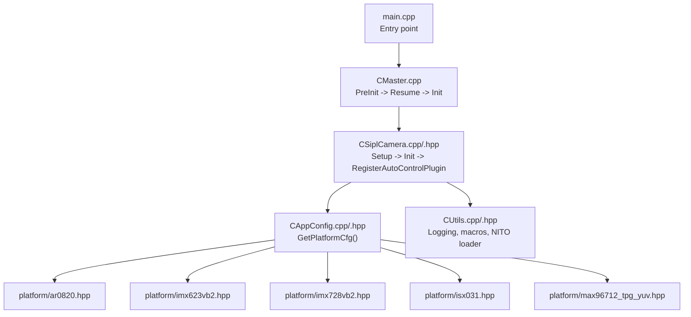
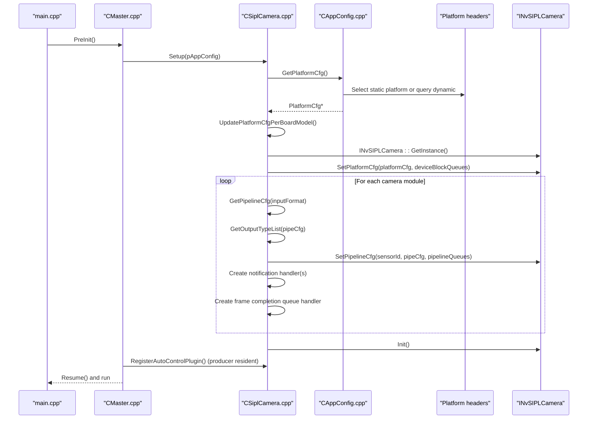
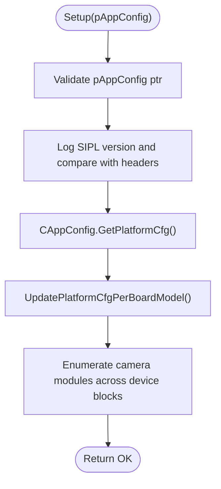
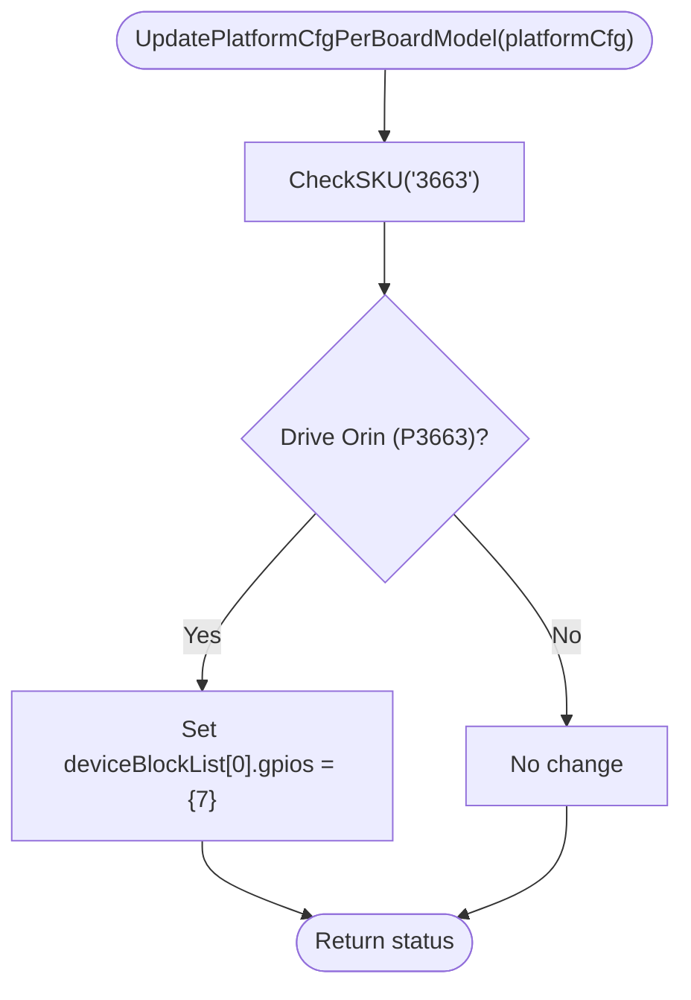
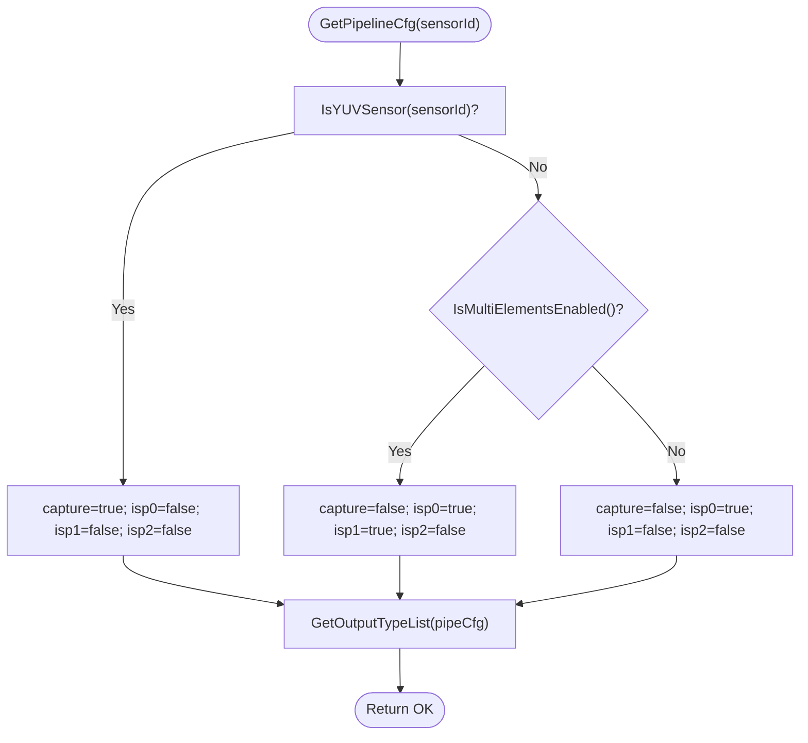
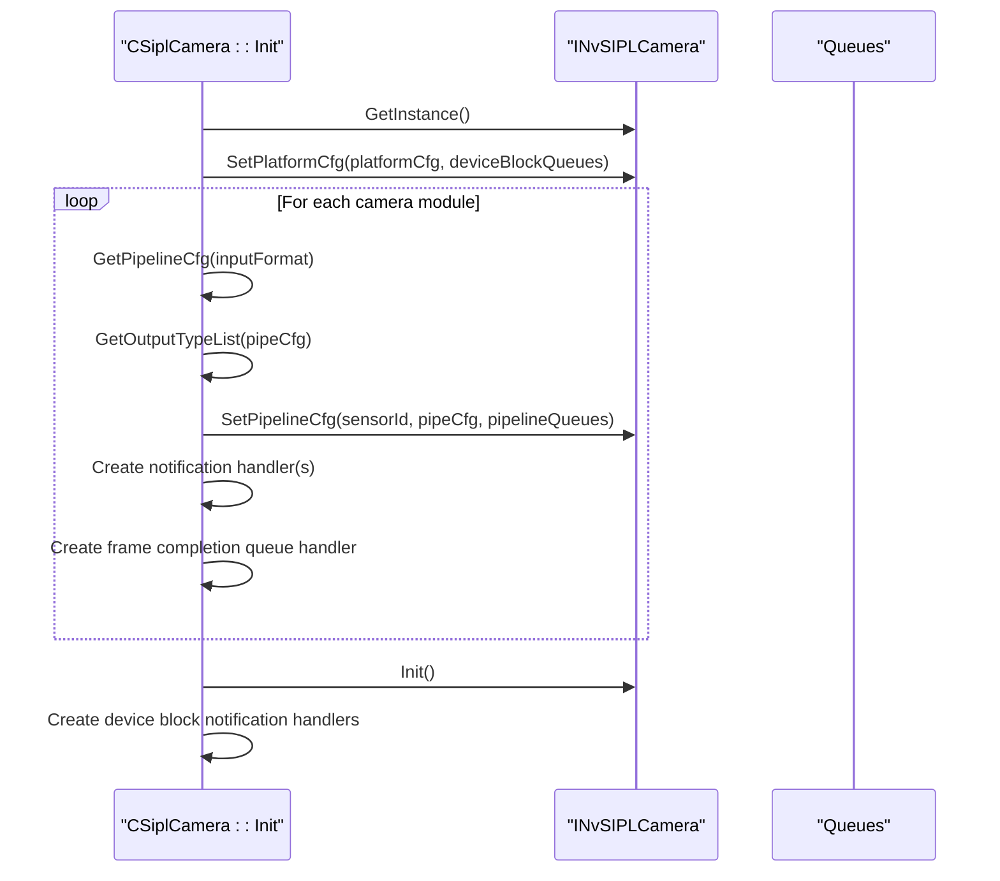
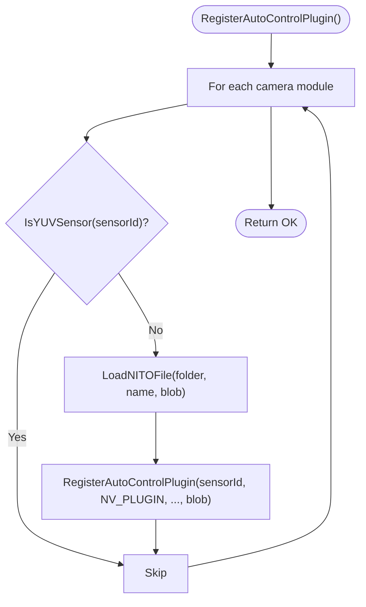
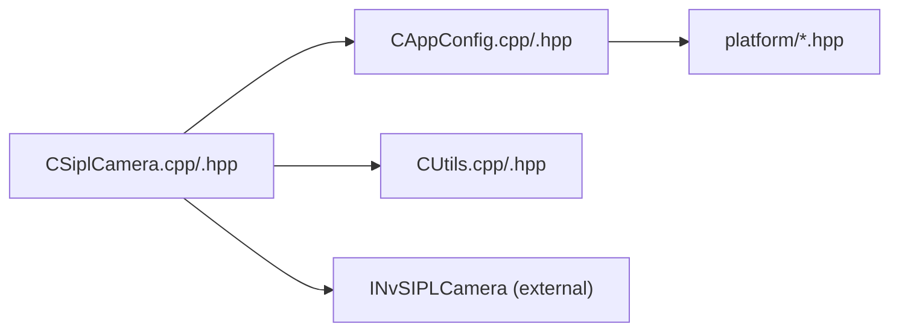

# Camera Initialization and Setup

<cite>
**Referenced Files in This Document**
- [CSiplCamera.hpp](file://CSiplCamera.hpp)
- [CSiplCamera.cpp](file://CSiplCamera.cpp)
- [CAppConfig.hpp](file://CAppConfig.hpp)
- [CAppConfig.cpp](file://CAppConfig.cpp)
- [ar0820.hpp](file://platform/ar0820.hpp)
- [imx623vb2.hpp](file://platform/imx623vb2.hpp)
- [imx728vb2.hpp](file://platform/imx728vb2.hpp)
- [isx031.hpp](file://platform/isx031.hpp)
- [max96712_tpg_yuv.hpp](file://platform/max96712_tpg_yuv.hpp)
- [Common.hpp](file://Common.hpp)
- [CUtils.hpp](file://CUtils.hpp)
- [CUtils.cpp](file://CUtils.cpp)
- [main.cpp](file://main.cpp)
- [CMaster.cpp](file://CMaster.cpp)
</cite>

## Table of Contents
1. [Introduction](#introduction)
2. [Project Structure](#project-structure)
3. [Core Components](#core-components)
4. [Architecture Overview](#architecture-overview)
5. [Detailed Component Analysis](#detailed-component-analysis)
6. [Dependency Analysis](#dependency-analysis)
7. [Performance Considerations](#performance-considerations)
8. [Troubleshooting Guide](#troubleshooting-guide)
9. [Conclusion](#conclusion)

## Introduction
This document explains the camera initialization and setup process in the CSiplCamera component. It covers the Setup method implementation, configuration validation, platform-specific settings, and camera pipeline configuration. It also documents the initialization sequence from CAppConfig integration through camera object creation, the GetPipelineCfg method for retrieving pipeline configurations per sensor, output type list management, and platform configuration updates based on board models. Practical examples, configuration parameter validation, and troubleshooting common initialization failures are included, along with multi-camera setup considerations, resource allocation, and error handling strategies.

## Project Structure
The camera subsystem centers around CSiplCamera, which integrates with CAppConfig to configure platform and sensor pipelines. Platform-specific configurations are provided via dedicated headers under the platform directory. Utility macros and logging support are provided by CUtils. The main application initializes CMaster, which orchestrates PreInit (CSiplCamera::Setup) and later Init (CSiplCamera::Init) and optional plugin registration.

**Diagram sources**
- [main.cpp:253-304](file://main.cpp#L253-L304)
- [CMaster.cpp:164-211](file://CMaster.cpp#L164-L211)
- [CSiplCamera.cpp:137-287](file://CSiplCamera.cpp#L137-L287)
- [CAppConfig.cpp:21-75](file://CAppConfig.cpp#L21-L75)
- [ar0820.hpp:14-183](file://platform/ar0820.hpp#L14-L183)
- [imx623vb2.hpp:14-163](file://platform/imx623vb2.hpp#L14-L163)
- [imx728vb2.hpp:14-161](file://platform/imx728vb2.hpp#L14-L161)
- [isx031.hpp:14-117](file://platform/isx031.hpp#L14-L117)
- [max96712_tpg_yuv.hpp:14-125](file://platform/max96712_tpg_yuv.hpp#L14-L125)
- [CUtils.cpp:145-208](file://CUtils.cpp#L145-L208)

**Section sources**
- [main.cpp:253-304](file://main.cpp#L253-L304)
- [CMaster.cpp:164-211](file://CMaster.cpp#L164-L211)
- [CSiplCamera.hpp:46-85](file://CSiplCamera.hpp#L46-L85)
- [CSiplCamera.cpp:137-287](file://CSiplCamera.cpp#L137-L287)
- [CAppConfig.hpp:19-82](file://CAppConfig.hpp#L19-L82)
- [CAppConfig.cpp:21-75](file://CAppConfig.cpp#L21-L75)

## Core Components
- CSiplCamera: Orchestrates camera setup, pipeline configuration, and runtime handlers for notifications and frame completion queues. Provides Setup, Init, DeInit, Start, Stop, and RegisterAutoControlPlugin.
- CAppConfig: Central configuration provider. Supplies platform configuration (static or dynamic) and sensor metadata. Exposes helpers like IsYUVSensor and GetResolutionWidthAndHeight.
- Platform headers: Define static PlatformCfg structures for supported boards/sensors.
- CUtils: Logging macros, error handling macros, and NITO file loading utility.

Key responsibilities:
- Setup: Validates SIPL version, loads platform config, applies board-specific platform updates, and enumerates camera modules.
- Init: Creates INvSIPLCamera instance, sets platform/pipeline configs, registers notification and frame completion handlers, and starts the camera.
- Pipeline configuration: Selects requested outputs (ICP/ISP0/ISP1/ISP2) based on sensor type and multi-element enablement.
- Auto control plugin registration: Loads NITO blobs and registers plugins per sensor (excluding YUV sensors).

**Section sources**
- [CSiplCamera.hpp:46-85](file://CSiplCamera.hpp#L46-L85)
- [CSiplCamera.cpp:137-287](file://CSiplCamera.cpp#L137-L287)
- [CAppConfig.hpp:19-82](file://CAppConfig.hpp#L19-L82)
- [CAppConfig.cpp:21-109](file://CAppConfig.cpp#L21-L109)
- [CUtils.hpp:28-83](file://CUtils.hpp#L28-L83)
- [CUtils.cpp:145-208](file://CUtils.cpp#L145-L208)

## Architecture Overview
The initialization flow integrates command-line configuration, platform configuration selection, and camera pipeline setup.

**Diagram sources**
- [main.cpp:253-304](file://main.cpp#L253-L304)
- [CMaster.cpp:164-211](file://CMaster.cpp#L164-L211)
- [CSiplCamera.cpp:137-287](file://CSiplCamera.cpp#L137-L287)
- [CAppConfig.cpp:21-75](file://CAppConfig.cpp#L21-L75)
- [ar0820.hpp:14-183](file://platform/ar0820.hpp#L14-L183)

## Detailed Component Analysis

### Setup Method Implementation
Purpose:
- Validate SIPL library/header version compatibility.
- Retrieve PlatformCfg from CAppConfig (dynamic or static).
- Apply board-specific platform updates (e.g., GPIO power control for Drive Orin).
- Enumerate camera modules across device blocks for later pipeline setup.

Implementation highlights:
- Version check logs library and header versions and warns on mismatch.
- UpdatePlatformCfgPerBoardModel inspects SKU and adjusts GPIOs for specific board models.
- Camera modules are collected into m_vCameraModules for downstream pipeline configuration.

**Diagram sources**
- [CSiplCamera.cpp:137-169](file://CSiplCamera.cpp#L137-L169)
- [CAppConfig.cpp:21-75](file://CAppConfig.cpp#L21-L75)
- [CSiplCamera.cpp:117-135](file://CSiplCamera.cpp#L117-L135)

**Section sources**
- [CSiplCamera.cpp:137-169](file://CSiplCamera.cpp#L137-L169)
- [CSiplCamera.cpp:117-135](file://CSiplCamera.cpp#L117-L135)
- [CAppConfig.cpp:21-75](file://CAppConfig.cpp#L21-L75)

### Platform Configuration Updates Based on Board Models
Purpose:
- Adjust platform configuration depending on detected board model (e.g., Drive Orin vs. others).

Implementation highlights:
- CheckSKU reads board model information from OS-specific sources and checks for a substring match.
- UpdatePlatformCfgPerBoardModel modifies device block GPIOs when a specific board model is detected.

**Diagram sources**
- [CSiplCamera.cpp:117-135](file://CSiplCamera.cpp#L117-L135)
- [CSiplCamera.cpp:61-115](file://CSiplCamera.cpp#L61-L115)

**Section sources**
- [CSiplCamera.cpp:117-135](file://CSiplCamera.cpp#L117-L135)
- [CSiplCamera.cpp:61-115](file://CSiplCamera.cpp#L61-L115)

### GetPipelineCfg and Output Type List Management
Purpose:
- Determine which pipeline outputs are requested per sensor:
  - YUV sensors: capture output only.
  - Multi-elements enabled: both ISP0 and ISP1 outputs.
  - Otherwise: ISP0 output only.
- Build the output type list for frame completion queues and notification handlers.

Implementation highlights:
- GetPipelineCfg sets captureOutputRequested, isp0OutputRequested, isp1OutputRequested, and isp2OutputRequested accordingly.
- GetOutputTypeList populates the output list based on pipeline configuration flags.

**Diagram sources**
- [CSiplCamera.cpp:171-207](file://CSiplCamera.cpp#L171-L207)
- [CAppConfig.cpp:77-109](file://CAppConfig.cpp#L77-L109)

**Section sources**
- [CSiplCamera.cpp:171-207](file://CSiplCamera.cpp#L171-L207)
- [CAppConfig.cpp:77-109](file://CAppConfig.cpp#L77-L109)

### Initialization Sequence: From CAppConfig Through Camera Object Creation
Purpose:
- Create INvSIPLCamera instance, apply platform configuration, configure pipelines per sensor, register handlers, and start the camera.

Implementation highlights:
- INvSIPLCamera::GetInstance() creates the camera instance.
- SetPlatformCfg applies platform configuration and returns device block queues.
- For each camera module:
  - Compute pipeline configuration and output types.
  - SetPipelineCfg returns per-output completion queues.
  - Create notification handlers and frame completion queue handlers.
- Initialize camera with Init().
- Create device block notification handlers for global device events.

**Diagram sources**
- [CSiplCamera.cpp:209-287](file://CSiplCamera.cpp#L209-L287)

**Section sources**
- [CSiplCamera.cpp:209-287](file://CSiplCamera.cpp#L209-L287)

### Auto Control Plugin Registration
Purpose:
- Load NITO files and register auto control plugins for non-YUV sensors.

Implementation highlights:
- For each camera module, load NITO file from configured folder or defaults.
- Register auto control plugin per sensor.

**Diagram sources**
- [CSiplCamera.cpp:325-345](file://CSiplCamera.cpp#L325-L345)
- [CUtils.cpp:145-208](file://CUtils.cpp#L145-L208)

**Section sources**
- [CSiplCamera.cpp:325-345](file://CSiplCamera.cpp#L325-L345)
- [CUtils.cpp:145-208](file://CUtils.cpp#L145-L208)

### Multi-Camera Setup Considerations
- Device blocks and camera modules are enumerated from PlatformCfg and stored in m_vCameraModules.
- Per-sensor pipeline configuration and queues are created independently.
- Notification and frame completion handlers are created per sensor and device block.
- Resource allocation:
  - Frame completion queues per output type per sensor.
  - Notification queues per sensor and per device block.
  - Threads for event queue polling and frame completion queue processing.

**Section sources**
- [CSiplCamera.cpp:160-169](file://CSiplCamera.cpp#L160-L169)
- [CSiplCamera.cpp:222-267](file://CSiplCamera.cpp#L222-L267)
- [CSiplCamera.hpp:76-85](file://CSiplCamera.hpp#L76-L85)

### Practical Examples of Camera Setup Workflows
- Static platform configuration:
  - Choose platform by static name in CAppConfig. Supported platforms include AR0820, IMX623, IMX728, ISX031, and MAX96712 TPG variants.
- Dynamic platform configuration:
  - If dynamic config name is provided, CAppConfig queries the database and applies masks.
- Pipeline selection:
  - YUV sensors: capture output only.
  - Multi-elements enabled: ISP0 and ISP1 outputs.
  - Otherwise: ISP0 output only.

**Section sources**
- [CAppConfig.cpp:21-75](file://CAppConfig.cpp#L21-L75)
- [CSiplCamera.cpp:171-207](file://CSiplCamera.cpp#L171-L207)
- [ar0820.hpp:14-183](file://platform/ar0820.hpp#L14-L183)
- [imx623vb2.hpp:14-163](file://platform/imx623vb2.hpp#L14-L163)
- [imx728vb2.hpp:14-161](file://platform/imx728vb2.hpp#L14-L161)
- [isx031.hpp:14-117](file://platform/isx031.hpp#L14-L117)
- [max96712_tpg_yuv.hpp:14-125](file://platform/max96712_tpg_yuv.hpp#L14-L125)

## Dependency Analysis
- CSiplCamera depends on:
  - CAppConfig for platform configuration and sensor metadata.
  - Platform headers for static platform definitions.
  - NvSIPL camera interfaces for platform/pipeline configuration and runtime control.
  - CUtils for logging and error handling macros.
- CAppConfig depends on:
  - NvSIPL query interface for dynamic configuration (non-safety builds).
  - Platform headers for static configuration fallback.

**Diagram sources**
- [CSiplCamera.cpp:137-287](file://CSiplCamera.cpp#L137-L287)
- [CAppConfig.cpp:21-75](file://CAppConfig.cpp#L21-L75)
- [ar0820.hpp:14-183](file://platform/ar0820.hpp#L14-L183)

**Section sources**
- [CSiplCamera.cpp:137-287](file://CSiplCamera.cpp#L137-L287)
- [CAppConfig.cpp:21-75](file://CAppConfig.cpp#L21-L75)

## Performance Considerations
- Logging verbosity: Configure via CAppConfig to reduce overhead in production.
- Queue timeouts: IMAGE_QUEUE_TIMEOUT_US and EVENT_QUEUE_TIMEOUT_US control wait behavior; tune for latency vs. CPU usage trade-offs.
- Multi-element enablement: Enabling multiple elements increases pipeline outputs and handler threads; ensure adequate CPU and memory resources.
- NITO file loading: File I/O occurs during plugin registration; cache or preload where appropriate.

[No sources needed since this section provides general guidance]

## Troubleshooting Guide
Common initialization failures and strategies:
- Version mismatch between NvSIPL library and headers:
  - Detected during Setup; ensure matching versions.
- Null pointer errors:
  - Validate pAppConfig and platformCfg pointers; use CHK_PTR_AND_RETURN macros.
- Platform configuration retrieval failure:
  - Dynamic query failures or unsupported static platform name; verify configuration names and masks.
- Device block or notification queue issues:
  - Device block notification handler validates queue presence and handles timeouts; inspect logs for queue status.
- Pipeline configuration errors:
  - SetPipelineCfg failures indicate invalid sensorId or pipeline configuration; confirm sensor enumeration and format support.
- Auto control plugin registration:
  - NITO file load failures; verify folder path and file existence.

Operational tips:
- Enable higher verbosity to capture detailed logs during Setup and Init.
- Monitor frame drop counters and pipeline warnings via notification handlers.
- Verify board model detection if GPIO power control is required.

**Section sources**
- [CSiplCamera.cpp:137-169](file://CSiplCamera.cpp#L137-L169)
- [CSiplCamera.cpp:209-287](file://CSiplCamera.cpp#L209-L287)
- [CAppConfig.cpp:21-75](file://CAppConfig.cpp#L21-L75)
- [CUtils.cpp:145-208](file://CUtils.cpp#L145-L208)

## Conclusion
The CSiplCamera component provides a robust, configurable camera initialization pipeline integrating CAppConfig platform definitions, board-specific adjustments, and per-sensor pipeline configuration. The design supports multi-camera setups, separates concerns across notification and frame completion handlers, and offers clear extension points for additional sensors and platform configurations. Proper configuration validation, resource allocation, and error handling ensure reliable operation across diverse hardware platforms.