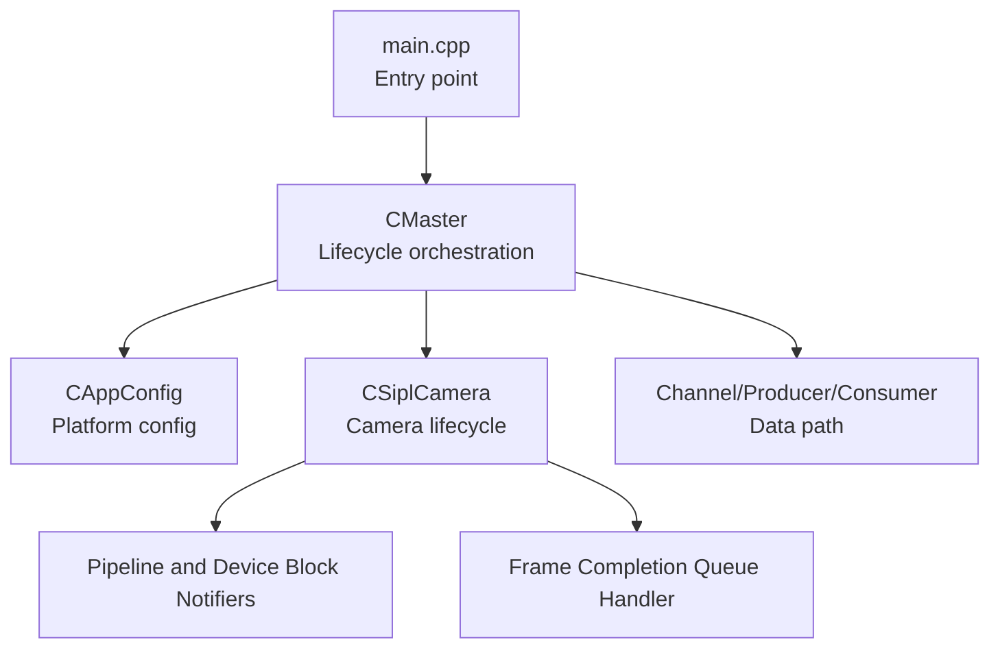
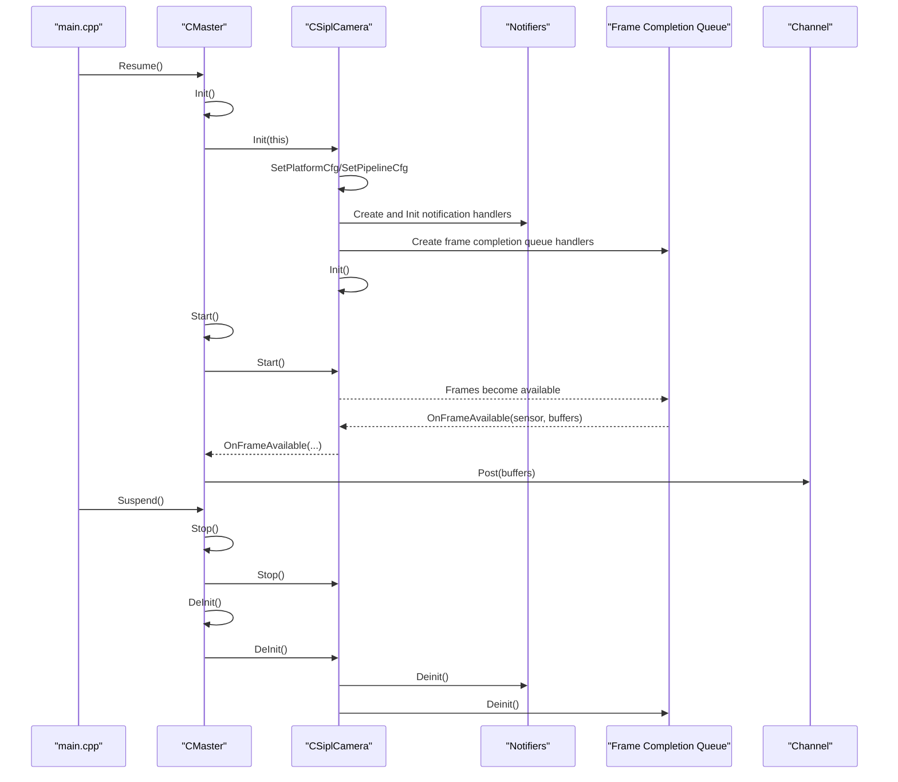
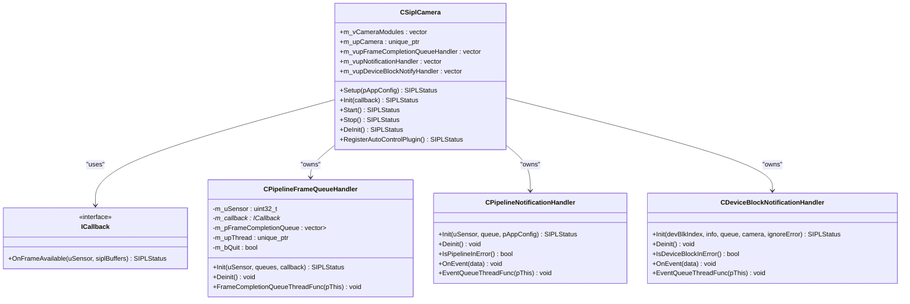
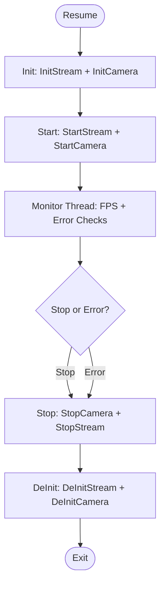
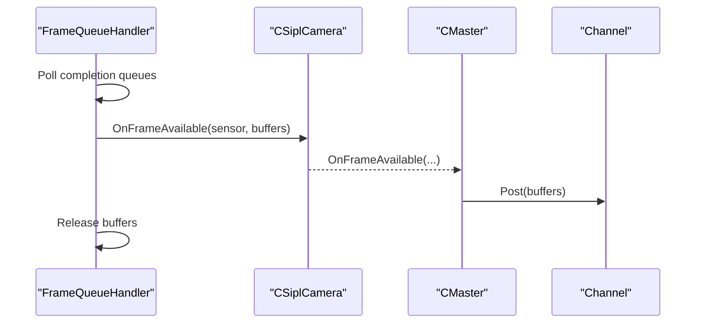
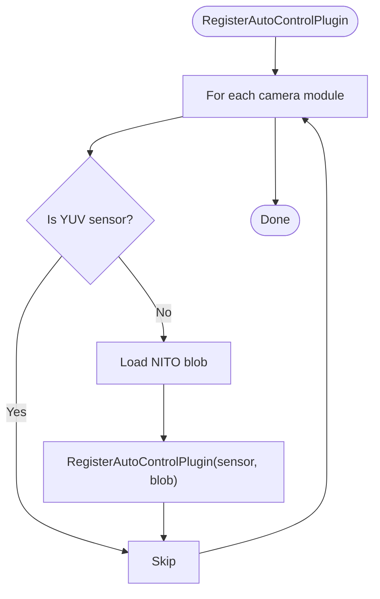
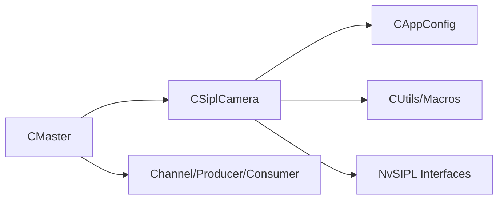

# Camera Lifecycle Management

<cite>
**Referenced Files in This Document**
- [CSiplCamera.hpp](file://CSiplCamera.hpp)
- [CSiplCamera.cpp](file://CSiplCamera.cpp)
- [CMaster.hpp](file://CMaster.hpp)
- [CMaster.cpp](file://CMaster.cpp)
- [CAppConfig.hpp](file://CAppConfig.hpp)
- [CAppConfig.cpp](file://CAppConfig.cpp)
- [CUtils.hpp](file://CUtils.hpp)
- [Common.hpp](file://Common.hpp)
- [main.cpp](file://main.cpp)
</cite>

## Table of Contents
1. [Introduction](#introduction)
2. [Project Structure](#project-structure)
3. [Core Components](#core-components)
4. [Architecture Overview](#architecture-overview)
5. [Detailed Component Analysis](#detailed-component-analysis)
6. [Dependency Analysis](#dependency-analysis)
7. [Performance Considerations](#performance-considerations)
8. [Troubleshooting Guide](#troubleshooting-guide)
9. [Conclusion](#conclusion)
10. [Appendices](#appendices)

## Introduction
This document explains the camera lifecycle management in the multicast application, focusing on the initialization, operation, and cleanup phases. It details the Init, Start, Stop, and DeInit methods, the ICallback interface for frame delivery, and the RegisterAutoControlPlugin mechanism. It also covers threading, resource management, error handling, graceful shutdown, multi-camera coordination, timing synchronization, and practical workflows.

## Project Structure
The camera lifecycle is orchestrated by the master controller and camera subsystem:
- The master controller initializes configuration, sets up channels, and coordinates camera lifecycle.
- The camera subsystem encapsulates NvSIPL camera operations, notification queues, and frame completion queues.
- Utilities and configuration provide shared constants, macros, and platform configuration.

**Diagram sources**
- [main.cpp:253-304](file://main.cpp#L253-L304)
- [CMaster.hpp:47-95](file://CMaster.hpp#L47-L95)
- [CMaster.cpp:164-232](file://CMaster.cpp#L164-L232)
- [CSiplCamera.hpp:46-85](file://CSiplCamera.hpp#L46-L85)
- [CSiplCamera.cpp:137-287](file://CSiplCamera.cpp#L137-L287)

**Section sources**
- [main.cpp:253-304](file://main.cpp#L253-L304)
- [CMaster.hpp:47-95](file://CMaster.hpp#L47-L95)
- [CSiplCamera.hpp:46-85](file://CSiplCamera.hpp#L46-L85)

## Core Components
- CSiplCamera: Encapsulates camera lifecycle, pipeline configuration, notifier threads, and frame delivery via ICallback.
- CMaster: Orchestrates camera lifecycle, stream setup, and runtime monitoring; implements ICallback to deliver frames to channels.
- CAppConfig: Provides platform configuration, sensor detection, and runtime flags.
- Utility macros and types: Logging, error checks, and buffer definitions.

Key responsibilities:
- Setup: Loads platform configuration and enumerates camera modules.
- Init: Creates camera instance, sets platform/pipeline configurations, registers notifiers and frame queue handlers, initializes camera.
- Start: Starts camera capture.
- Stop: Stops camera capture.
- DeInit: Shuts down notifiers, frame queue handlers, and camera cleanly.
- ICallback: Receives frames from frame queue handler and posts to appropriate channel.
- RegisterAutoControlPlugin: Registers auto-control plugin per sensor (non-YUV sensors).

**Section sources**
- [CSiplCamera.cpp:137-287](file://CSiplCamera.cpp#L137-L287)
- [CSiplCamera.cpp:289-361](file://CSiplCamera.cpp#L289-L361)
- [CMaster.cpp:195-232](file://CMaster.cpp#L195-L232)
- [CMaster.cpp:405-424](file://CMaster.cpp#L405-L424)
- [CAppConfig.cpp:21-75](file://CAppConfig.cpp#L21-L75)
- [CUtils.hpp:28-83](file://CUtils.hpp#L28-L83)

## Architecture Overview
The lifecycle spans three layers:
- Application entry and control: main and CMaster manage resume/suspend and lifecycle transitions.
- Camera subsystem: CSiplCamera manages camera, pipelines, notifications, and frame delivery.
- Data path: Channels consume frames and render/display/multicast them.

**Diagram sources**
- [main.cpp:277-294](file://main.cpp#L277-L294)
- [CMaster.cpp:282-318](file://CMaster.cpp#L282-L318)
- [CMaster.cpp:195-232](file://CMaster.cpp#L195-L232)
- [CMaster.cpp:234-275](file://CMaster.cpp#L234-L275)
- [CMaster.cpp:405-424](file://CMaster.cpp#L405-L424)
- [CSiplCamera.cpp:209-287](file://CSiplCamera.cpp#L209-L287)
- [CSiplCamera.cpp:289-361](file://CSiplCamera.cpp#L289-L361)

## Detailed Component Analysis

### CSiplCamera: Lifecycle and Frame Delivery
- Setup: Loads platform configuration and collects camera modules.
- Init:
  - Creates camera instance and sets platform configuration.
  - Iterates camera modules, computes pipeline configuration and output types, sets pipeline configuration, and obtains queues.
  - Creates and initializes notification handlers per sensor and per device block.
  - Creates frame completion queue handlers bound to ICallback.
  - Calls camera Init.
- Start/Stop: Delegates to camera Start/Stop.
- DeInit:
  - Iterates and deinitializes device block notifiers, pipeline notifiers, and frame completion queue handlers.
  - Calls camera Deinit and resets smart pointers.
- RegisterAutoControlPlugin:
  - Skips YUV sensors.
  - Loads NITO blob per module and registers auto-control plugin per sensor.

ICallback interface:
- OnFrameAvailable: Receives sensor ID and buffers; delegates to master to post to the correct channel.

Threading and resource management:
- Notification handlers run in dedicated threads polling notification queues.
- Frame completion queue handler runs a thread polling per-output completion queues, aggregates buffers, and invokes ICallback.
- Buffers are released after delivery to prevent leaks.

Error handling:
- Uses macros to check pointers and statuses, logging and returning early on failure.
- Notification handlers detect fatal errors and mark state accordingly.

**Diagram sources**
- [CSiplCamera.hpp:49-85](file://CSiplCamera.hpp#L49-L85)
- [CSiplCamera.hpp:523-618](file://CSiplCamera.hpp#L523-L618)
- [CSiplCamera.hpp:357-521](file://CSiplCamera.hpp#L357-L521)
- [CSiplCamera.hpp:87-355](file://CSiplCamera.hpp#L87-L355)

**Section sources**
- [CSiplCamera.cpp:137-287](file://CSiplCamera.cpp#L137-L287)
- [CSiplCamera.cpp:289-361](file://CSiplCamera.cpp#L289-L361)
- [CSiplCamera.hpp:49-85](file://CSiplCamera.hpp#L49-L85)
- [CSiplCamera.hpp:523-618](file://CSiplCamera.hpp#L523-L618)
- [CSiplCamera.hpp:357-521](file://CSiplCamera.hpp#L357-L521)
- [CSiplCamera.hpp:87-355](file://CSiplCamera.hpp#L87-L355)

### CMaster: Lifecycle Orchestration and Monitoring
- PreInit: Builds platform configuration and prepares camera subsystem.
- Init: Initializes camera (when resident) and stream infrastructure; registers auto-control plugins.
- Start: Starts streams and launches monitor thread.
- Stop: Stops camera (if resident), waits for monitor thread, stops streams.
- DeInit: Tears down streams and camera.
- OnFrameAvailable: Routes frames to the appropriate channel depending on communication type and entity type.

Monitoring:
- Monitor thread periodically prints FPS metrics and checks for pipeline/device-block errors; triggers graceful exit on failures or duration limits.

Graceful shutdown:
- Signals monitor thread to quit, joins it, and ensures ordered teardown.

**Diagram sources**
- [CMaster.cpp:282-318](file://CMaster.cpp#L282-L318)
- [CMaster.cpp:195-232](file://CMaster.cpp#L195-L232)
- [CMaster.cpp:234-275](file://CMaster.cpp#L234-L275)
- [CMaster.cpp:354-403](file://CMaster.cpp#L354-L403)

**Section sources**
- [CMaster.cpp:164-232](file://CMaster.cpp#L164-L232)
- [CMaster.cpp:282-318](file://CMaster.cpp#L282-L318)
- [CMaster.cpp:354-403](file://CMaster.cpp#L354-L403)
- [CMaster.cpp:405-424](file://CMaster.cpp#L405-L424)

### ICallback and Frame Delivery
- CSiplCamera::ICallback is implemented by CMaster.
- CPipelineFrameQueueHandler polls per-output completion queues, aggregates NvSIPLBuffers, and calls ICallback::OnFrameAvailable.
- CMaster routes frames to the correct channel based on configuration.

**Diagram sources**
- [CSiplCamera.hpp:523-618](file://CSiplCamera.hpp#L523-L618)
- [CSiplCamera.hpp:49-57](file://CSiplCamera.hpp#L49-L57)
- [CMaster.cpp:405-424](file://CMaster.cpp#L405-L424)

**Section sources**
- [CSiplCamera.hpp:49-57](file://CSiplCamera.hpp#L49-L57)
- [CSiplCamera.hpp:523-618](file://CSiplCamera.hpp#L523-L618)
- [CMaster.cpp:405-424](file://CMaster.cpp#L405-L424)

### RegisterAutoControlPlugin
- Iterates camera modules; skips YUV sensors.
- Loads NITO blob per module and registers auto-control plugin via camera API.

**Diagram sources**
- [CSiplCamera.cpp:325-345](file://CSiplCamera.cpp#L325-L345)

**Section sources**
- [CSiplCamera.cpp:325-345](file://CSiplCamera.cpp#L325-L345)

### Threading Considerations
- Device block notifier: Dedicated thread polling device-block notification queue; handles deserializer/serializer/sensor errors.
- Pipeline notifier: Dedicated thread polling per-sensor notification queue; tracks frame drops and fatal errors.
- Frame completion queue handler: Dedicated thread polling per-output completion queues; aggregates buffers and invokes ICallback.
- Monitor thread: Periodic reporting and error checks; controlled via atomic flags and join semantics.

Graceful shutdown:
- Threads set quit flags, poll for EOF/TIMEOUT, and join safely.

**Section sources**
- [CSiplCamera.hpp:87-355](file://CSiplCamera.hpp#L87-L355)
- [CSiplCamera.hpp:357-521](file://CSiplCamera.hpp#L357-L521)
- [CSiplCamera.hpp:523-618](file://CSiplCamera.hpp#L523-L618)
- [CMaster.cpp:354-403](file://CMaster.cpp#L354-L403)

### Resource Management and Cleanup
- Smart pointers manage camera and handler lifetimes.
- DeInit sequences:
  - Device block notifiers -> pipeline notifiers -> frame completion queue handlers -> camera Deinit -> reset pointers.
- Buffers are explicitly released after delivery to avoid leaks.

**Section sources**
- [CSiplCamera.cpp:289-323](file://CSiplCamera.cpp#L289-L323)
- [CSiplCamera.hpp:523-618](file://CSiplCamera.hpp#L523-L618)

### Multi-Camera Coordination and Timing
- Multi-sensor support:
  - Enumerates camera modules from platform configuration.
  - Creates per-sensor pipeline notifiers and frame completion queue handlers.
- Timing synchronization:
  - Monitor thread prints periodic FPS metrics.
  - Frame completion queue handler uses timeouts to avoid indefinite blocking.
  - Optional run-duration limit triggers graceful exit.

**Section sources**
- [CSiplCamera.cpp:137-169](file://CSiplCamera.cpp#L137-L169)
- [CMaster.cpp:354-403](file://CMaster.cpp#L354-L403)
- [Common.hpp:23-28](file://Common.hpp#L23-L28)

## Dependency Analysis
- CSiplCamera depends on:
  - NvSIPL camera interfaces for platform/pipeline configuration and control.
  - CAppConfig for platform configuration and runtime flags.
  - Notification and frame completion queue abstractions.
- CMaster depends on:
  - CSiplCamera for camera lifecycle.
  - Channel implementations for data path routing.
  - CAppConfig for configuration and flags.
- Utilities:
  - Macros for error/status checking and logging.
  - Buffer type definitions for frame delivery.

**Diagram sources**
- [CMaster.hpp:47-95](file://CMaster.hpp#L47-L95)
- [CSiplCamera.hpp:46-85](file://CSiplCamera.hpp#L46-L85)
- [CAppConfig.hpp:19-83](file://CAppConfig.hpp#L19-L83)
- [CUtils.hpp:28-83](file://CUtils.hpp#L28-L83)

**Section sources**
- [CMaster.hpp:47-95](file://CMaster.hpp#L47-L95)
- [CSiplCamera.hpp:46-85](file://CSiplCamera.hpp#L46-L85)
- [CAppConfig.hpp:19-83](file://CAppConfig.hpp#L19-L83)
- [CUtils.hpp:28-83](file://CUtils.hpp#L28-L83)

## Performance Considerations
- Use FIFO queues for lower latency when appropriate.
- Tune run duration and monitoring intervals for desired throughput visibility.
- Avoid excessive logging in performance-critical paths.
- Ensure buffers are released promptly to prevent memory pressure.

## Troubleshooting Guide
Common issues and resolutions:
- Initialization failures:
  - Verify platform configuration and sensor presence.
  - Check pipeline configuration selection (YUV vs ISP outputs).
- Frame drops and timeouts:
  - Inspect pipeline notifier warnings and frame drop counters.
  - Review queue timeouts and buffer availability.
- Fatal errors:
  - Device block and pipeline notifiers mark fatal conditions; investigate logs and hardware connections.
- Auto-control plugin registration:
  - Ensure NITO blobs exist and are loadable; skip YUV sensors intentionally.
- Graceful shutdown:
  - Ensure monitor thread quit flag is observed and threads joined.

Operational tips:
- Use monitor thread output to confirm steady-state FPS.
- Enable error-ignoring mode selectively for link-recovery scenarios.
- Validate communication type and entity type for correct channel routing.

**Section sources**
- [CSiplCamera.cpp:325-345](file://CSiplCamera.cpp#L325-L345)
- [CSiplCamera.hpp:357-521](file://CSiplCamera.hpp#L357-L521)
- [CMaster.cpp:382-400](file://CMaster.cpp#L382-L400)
- [CAppConfig.cpp:21-75](file://CAppConfig.cpp#L21-L75)

## Conclusion
The camera lifecycle is robustly managed through coordinated setup, operation, and teardown phases. CSiplCamera encapsulates camera and pipeline operations with dedicated threads for notifications and frame delivery, while CMaster orchestrates lifecycle transitions, monitors health, and routes frames to consumers. Proper resource management, error handling, and graceful shutdown ensure reliable multi-camera operation.

## Appendices

### Practical Workflows
- Basic camera control:
  - Resume -> Init -> Start -> Observe FPS -> Suspend -> DeInit.
- Late consumer attachment (IPC/P2P/C2C producer):
  - Use attach/detach commands to adjust consumers dynamically.
- Multi-element pipelines:
  - Enable multi-elements for non-YUV sensors to obtain dual ISP outputs.

**Section sources**
- [main.cpp:277-294](file://main.cpp#L277-L294)
- [CMaster.cpp:473-513](file://CMaster.cpp#L473-L513)
- [CAppConfig.cpp:77-108](file://CAppConfig.cpp#L77-L108)