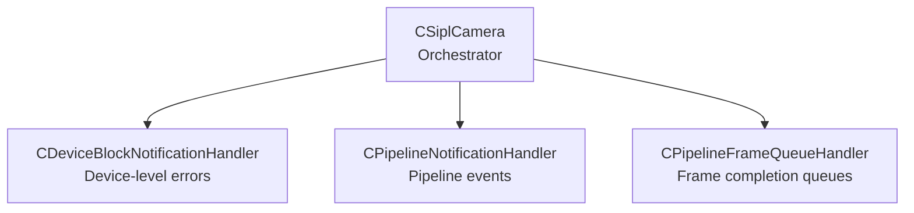
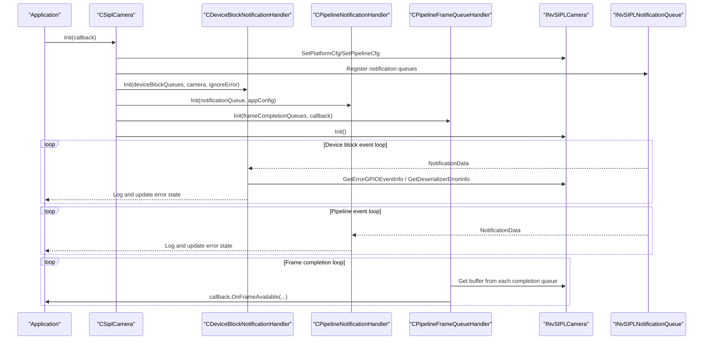
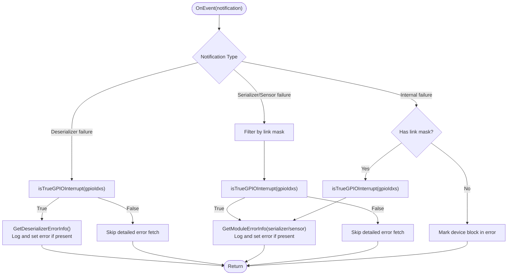
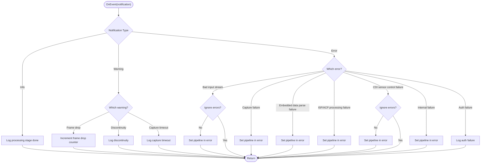
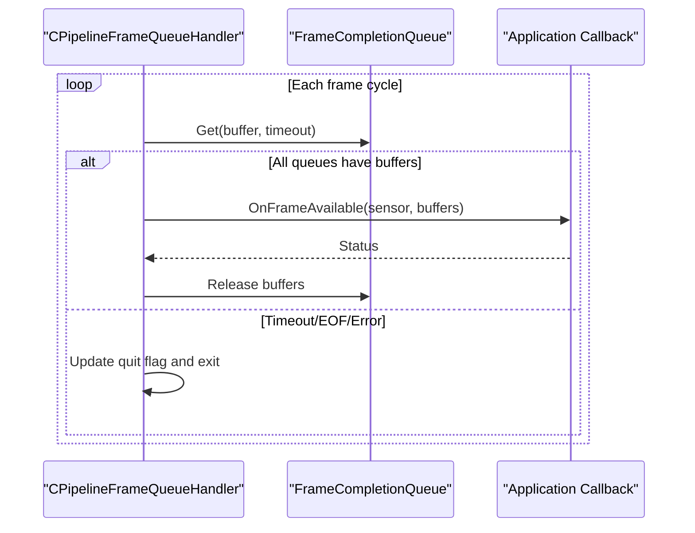
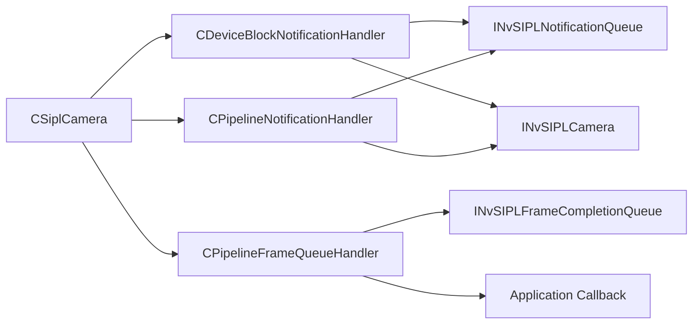

# Camera Notification Handlers

<cite>
**Referenced Files in This Document**
- [CSiplCamera.hpp](file://CSiplCamera.hpp)
- [CSiplCamera.cpp](file://CSiplCamera.cpp)
- [CAppConfig.hpp](file://CAppConfig.hpp)
- [main.cpp](file://main.cpp)
</cite>

## Table of Contents
1. [Introduction](#introduction)
2. [Project Structure](#project-structure)
3. [Core Components](#core-components)
4. [Architecture Overview](#architecture-overview)
5. [Detailed Component Analysis](#detailed-component-analysis)
6. [Dependency Analysis](#dependency-analysis)
7. [Performance Considerations](#performance-considerations)
8. [Troubleshooting Guide](#troubleshooting-guide)
9. [Conclusion](#conclusion)

## Introduction
This document describes the three-tier camera notification system implemented in CSiplCamera. It covers:
- Device-level error monitoring via CDeviceBlockNotificationHandler
- Pipeline-level notifications via CPipelineNotificationHandler
- Frame completion queue management via CPipelineFrameQueueHandler

It explains threading models, event queue processing, error state management, and recovery mechanisms, and provides examples of notification handling workflows, error diagnosis procedures, and performance monitoring techniques for each handler type.

## Project Structure
The camera subsystem is centered around CSiplCamera, which owns and orchestrates:
- One CDeviceBlockNotificationHandler per device block
- One CPipelineNotificationHandler per sensor/pipeline
- One CPipelineFrameQueueHandler per sensor/pipeline

These handlers process asynchronous notifications from the NvSIPL pipeline and camera subsystems, and coordinate with the application’s callback interface for frame availability.

**Diagram sources**
- [CSiplCamera.hpp:77-85](file://CSiplCamera.hpp#L77-L85)
- [CSiplCamera.cpp:209-287](file://CSiplCamera.cpp#L209-L287)

**Section sources**
- [CSiplCamera.hpp:77-85](file://CSiplCamera.hpp#L77-L85)
- [CSiplCamera.cpp:209-287](file://CSiplCamera.cpp#L209-L287)

## Core Components
- CDeviceBlockNotificationHandler: Monitors device-level errors (deserializer, serializer, sensor), validates GPIO interrupts, and propagates remote errors to associated camera modules.
- CPipelineNotificationHandler: Processes pipeline-level events (processing done, authentication status, capture failures, frame drops/discontinuities/timeouts).
- CPipelineFrameQueueHandler: Collects buffers from multiple frame completion queues and invokes the application callback when a full-frame set is ready.

Key runtime characteristics:
- Each handler runs its own dedicated thread.
- Event queues are polled with a fixed timeout.
- Error states are tracked per handler and surfaced to the application during deinitialization.

**Section sources**
- [CSiplCamera.hpp:87-355](file://CSiplCamera.hpp#L87-L355)
- [CSiplCamera.hpp:357-521](file://CSiplCamera.hpp#L357-L521)
- [CSiplCamera.hpp:523-618](file://CSiplCamera.hpp#L523-L618)

## Architecture Overview
The three-tier notification architecture separates concerns:
- Device block level: Detects and isolates hardware-level failures and remote errors.
- Pipeline level: Tracks processing stages, authentication, and capture health.
- Frame completion: Aggregates per-output buffers and delivers frames to the application.

**Diagram sources**
- [CSiplCamera.cpp:209-287](file://CSiplCamera.cpp#L209-L287)
- [CSiplCamera.hpp:315-341](file://CSiplCamera.hpp#L315-L341)
- [CSiplCamera.hpp:487-513](file://CSiplCamera.hpp#L487-L513)
- [CSiplCamera.hpp:550-605](file://CSiplCamera.hpp#L550-L605)

## Detailed Component Analysis

### CDeviceBlockNotificationHandler
Purpose:
- Monitor device-level errors across deserializers, serializers, and sensors.
- Disambiguate GPIO interrupts to distinguish true faults from propagated events.
- Propagate remote errors to affected camera modules.

Threading model:
- Dedicated thread polls INvSIPLNotificationQueue with a fixed timeout.
- Thread exits gracefully on EOF or unexpected status.

Processing logic:
- On NOTIF_ERROR_DESERIALIZER_FAILURE: Optionally validate GPIO interrupts; if true, fetch detailed deserializer error info and mark error state.
- On NOTIF_ERROR_SERIALIZER_FAILURE and NOTIF_ERROR_SENSOR_FAILURE: Filter by link mask against device block modules; validate GPIO interrupts; fetch module-level serializer/sensor error info; mark error state.
- On NOTIF_ERROR_INTERNAL_FAILURE: If link mask is non-zero, apply same logic; otherwise mark error state.

GPIO interrupt handling:
- For each GPIO index, query error event code.
- Treat as true interrupt if NVSIPL_GPIO_EVENT_INTR; treat as fatal if non-NVSIPL_GPIO_EVENT_NOTHING.
- If OS backend does not support event query, allow fetching detailed error info and treat as true interrupt.

Error propagation:
- Remote error flag triggers module-level error checks for all modules in the device block.

Recovery mechanisms:
- Error state is tracked per handler; application can decide recovery based on ignore-error setting.

**Diagram sources**
- [CSiplCamera.hpp:256-313](file://CSiplCamera.hpp#L256-L313)
- [CSiplCamera.hpp:218-254](file://CSiplCamera.hpp#L218-L254)
- [CSiplCamera.hpp:149-185](file://CSiplCamera.hpp#L149-L185)
- [CSiplCamera.hpp:187-216](file://CSiplCamera.hpp#L187-L216)

**Section sources**
- [CSiplCamera.hpp:87-355](file://CSiplCamera.hpp#L87-L355)

### CPipelineNotificationHandler
Purpose:
- Track pipeline-level processing events and health indicators.
- Maintain frame drop counters and expose them to the application.
- Surface authentication status and capture-related failures.

Threading model:
- Dedicated thread polling INvSIPLNotificationQueue with a fixed timeout.
- Error state is tracked per pipeline.

Processing logic:
- Info notifications: Log processing stage completion (ICP/ISP/ACP/CDI).
- Warning notifications: Log frame drops, discontinuities, and capture timeouts; increment frame drop counter for drops.
- Error notifications: Log and set pipeline error state; some errors are treated as fatal depending on configuration.

Recovery mechanisms:
- Application can choose to ignore certain errors based on configuration; fatal errors are recorded for diagnostics.

**Diagram sources**
- [CSiplCamera.hpp:414-485](file://CSiplCamera.hpp#L414-L485)

**Section sources**
- [CSiplCamera.hpp:357-521](file://CSiplCamera.hpp#L357-L521)

### CPipelineFrameQueueHandler
Purpose:
- Aggregate buffers from multiple frame completion queues (ICP/ISP0/ISP1/etc.) for a given sensor.
- Invoke the application callback when a complete frame set is available.

Threading model:
- Dedicated thread polling each completion queue with a fixed timeout.
- Releases buffers after callback returns.

Processing logic:
- For each cycle, attempt to dequeue one buffer from each configured completion queue.
- If all queues yield a buffer, call the application callback with the assembled NvSIPLBuffers.
- Release buffers back to the framework after callback returns.
- Handle timeouts, EOF, and unexpected statuses by updating internal quit flag.

**Diagram sources**
- [CSiplCamera.hpp:550-605](file://CSiplCamera.hpp#L550-L605)

**Section sources**
- [CSiplCamera.hpp:523-618](file://CSiplCamera.hpp#L523-L618)

## Dependency Analysis
- CSiplCamera orchestrates handler initialization and deinitialization, wiring notification queues and frame completion queues to each handler.
- Handlers depend on:
  - INvSIPLNotificationQueue for asynchronous notifications
  - INvSIPLCamera for error inspection APIs (GPIO event info, deserializer/module error info)
  - Application callback for frame delivery
- Configuration influences error handling behavior via CAppConfig (ignore errors flag).

**Diagram sources**
- [CSiplCamera.cpp:209-287](file://CSiplCamera.cpp#L209-L287)
- [CSiplCamera.hpp:77-85](file://CSiplCamera.hpp#L77-L85)

**Section sources**
- [CSiplCamera.cpp:209-287](file://CSiplCamera.cpp#L209-L287)
- [CAppConfig.hpp:36](file://CAppConfig.hpp#L36)

## Performance Considerations
- Fixed timeouts:
  - Device and pipeline event loops poll with a 1-second timeout.
  - Frame completion loop uses a separate image queue timeout.
- Throughput:
  - Frame aggregation occurs per cycle; ensure all output queues are consistently populated to avoid stalls.
- Logging overhead:
  - Frequent logging can impact latency; adjust verbosity via CAppConfig.
- Recovery:
  - Ignoring certain errors can improve resilience; verify trade-offs with data quality.

[No sources needed since this section provides general guidance]

## Troubleshooting Guide

### Device-level error diagnosis (CDeviceBlockNotificationHandler)
- Verify GPIO interrupt validity:
  - If GPIO event query is not supported, detailed error info is still fetched and treated as a true interrupt.
  - If GPIO event indicates a non-NVSIPL_GPIO_EVENT_NOTHING, treat as fatal and mark error state.
- Remote error propagation:
  - When remote error flag is set, iterate all modules in the device block and fetch module-level errors.
- Deserializer error inspection:
  - If deserializer error buffer is non-empty, log and mark error state.

Operational steps:
- Confirm device block index and link masks align with hardware topology.
- Check GPIO configuration and backend support for error event queries.
- Review logs for deserializer and module error buffers.

**Section sources**
- [CSiplCamera.hpp:218-254](file://CSiplCamera.hpp#L218-L254)
- [CSiplCamera.hpp:149-185](file://CSiplCamera.hpp#L149-L185)
- [CSiplCamera.hpp:187-216](file://CSiplCamera.hpp#L187-L216)

### Pipeline-level event monitoring (CPipelineNotificationHandler)
- Frame drops:
  - Use the exposed frame drop counter to track continuity issues.
- Authentication failures:
  - Capture auth failure notifications with frame sequence numbers for correlation.
- Capture failures:
  - Treat capture failure and embedded data parse failures as fatal; investigate upstream pipeline configuration.

Operational steps:
- Enable verbose logging to observe processing stage completions and warnings.
- If errors are ignored via configuration, monitor for persistent warnings indicating degraded operation.

**Section sources**
- [CSiplCamera.hpp:391-405](file://CSiplCamera.hpp#L391-L405)
- [CSiplCamera.hpp:414-485](file://CSiplCamera.hpp#L414-L485)

### Frame completion queue management (CPipelineFrameQueueHandler)
- Symptoms:
  - Frequent timeouts indicate missing buffers from one or more completion queues.
  - Unexpected status leads to handler termination; check upstream pipeline health.
- Resolution:
  - Ensure all requested outputs are enabled and queues are populated.
  - Validate callback return status; any non-OK status causes handler to quit.

Operational steps:
- Confirm output types match pipeline configuration.
- Inspect callback implementation for resource constraints or blocking behavior.

**Section sources**
- [CSiplCamera.hpp:550-605](file://CSiplCamera.hpp#L550-L605)

## Conclusion
The three-tier camera notification system provides robust, layered monitoring:
- Device-level handlers isolate hardware faults and remote errors using GPIO disambiguation.
- Pipeline-level handlers track processing health, authentication, and capture outcomes.
- Frame completion handlers aggregate buffers and deliver frames to the application.

Together, they enable resilient operation, precise diagnostics, and efficient performance tuning across diverse camera topologies.