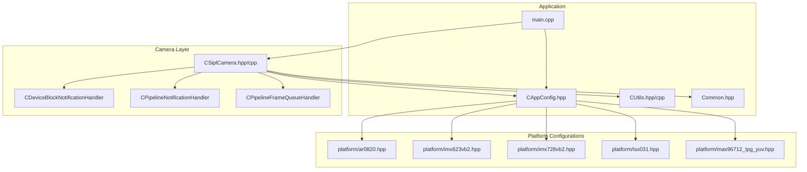
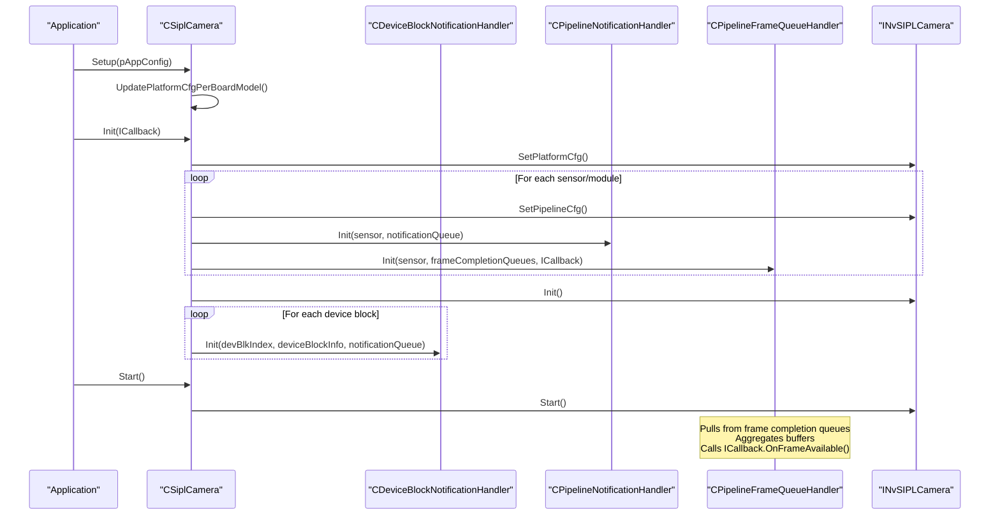
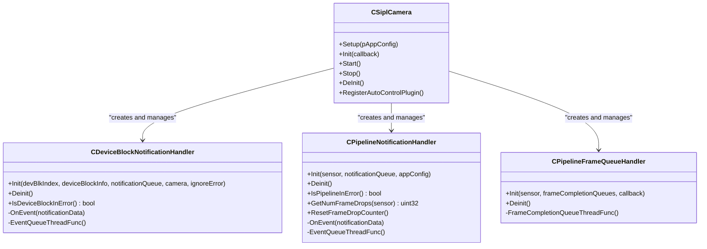
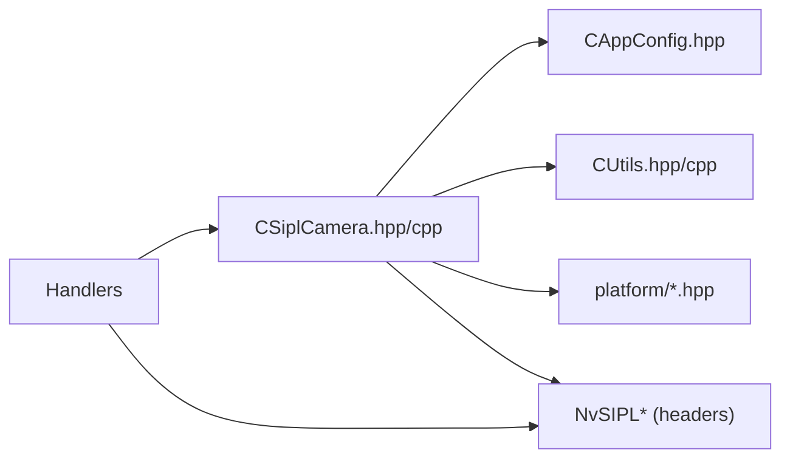

# Camera System

<cite>
**Referenced Files in This Document**
- [CSiplCamera.hpp](file://CSiplCamera.hpp)
- [CSiplCamera.cpp](file://CSiplCamera.cpp)
- [CAppConfig.hpp](file://CAppConfig.hpp)
- [CUtils.hpp](file://CUtils.hpp)
- [CUtils.cpp](file://CUtils.cpp)
- [Common.hpp](file://Common.hpp)
- [ar0820.hpp](file://platform/ar0820.hpp)
- [imx623vb2.hpp](file://platform/imx623vb2.hpp)
- [imx728vb2.hpp](file://platform/imx728vb2.hpp)
- [isx031.hpp](file://platform/isx031.hpp)
- [max96712_tpg_yuv.hpp](file://platform/max96712_tpg_yuv.hpp)
- [main.cpp](file://main.cpp)
</cite>

## Table of Contents
1. [Introduction](#introduction)
2. [Project Structure](#project-structure)
3. [Core Components](#core-components)
4. [Architecture Overview](#architecture-overview)
5. [Detailed Component Analysis](#detailed-component-analysis)
6. [Dependency Analysis](#dependency-analysis)
7. [Performance Considerations](#performance-considerations)
8. [Troubleshooting Guide](#troubleshooting-guide)
9. [Conclusion](#conclusion)
10. [Appendices](#appendices)

## Introduction
This document describes the CSiplCamera component, the core camera abstraction layer in the NVIDIA SIPL Multicast system. It explains camera initialization, platform configuration integration, multi-camera support, and the three-tier notification system. It also covers the ICallback interface for frame delivery, device block notification handling, pipeline notification mechanisms, platform-specific camera configurations, sensor integration, error handling strategies, and practical examples for setup, validation, and troubleshooting.

## Project Structure
The camera system centers around CSiplCamera and its supporting handlers. Platform-specific configurations are provided via dedicated headers under the platform directory. Application configuration and utilities support runtime behavior and logging.

**Diagram sources**
- [main.cpp](file://main.cpp)
- [CSiplCamera.hpp](file://CSiplCamera.hpp)
- [CSiplCamera.cpp](file://CSiplCamera.cpp)
- [CAppConfig.hpp](file://CAppConfig.hpp)
- [CUtils.hpp](file://CUtils.hpp)
- [Common.hpp](file://Common.hpp)
- [ar0820.hpp](file://platform/ar0820.hpp)
- [imx623vb2.hpp](file://platform/imx623vb2.hpp)
- [imx728vb2.hpp](file://platform/imx728vb2.hpp)
- [isx031.hpp](file://platform/isx031.hpp)
- [max96712_tpg_yuv.hpp](file://platform/max96712_tpg_yuv.hpp)

**Section sources**
- [CSiplCamera.hpp](file://CSiplCamera.hpp)
- [CSiplCamera.cpp](file://CSiplCamera.cpp)
- [CAppConfig.hpp](file://CAppConfig.hpp)
- [CUtils.hpp](file://CUtils.hpp)
- [Common.hpp](file://Common.hpp)
- [ar0820.hpp](file://platform/ar0820.hpp)
- [imx623vb2.hpp](file://platform/imx623vb2.hpp)
- [imx728vb2.hpp](file://platform/imx728vb2.hpp)
- [isx031.hpp](file://platform/isx031.hpp)
- [max96712_tpg_yuv.hpp](file://platform/max96712_tpg_yuv.hpp)
- [main.cpp](file://main.cpp)

## Core Components
- CSiplCamera: Orchestrates camera setup, pipeline configuration per sensor, handler registration, and lifecycle control (Init, Start, Stop, DeInit).
- ICallback: Application-defined interface for receiving frames from multiple outputs (ICP, ISP0, ISP1) per sensor.
- CDeviceBlockNotificationHandler: Per-device-block notifier for deserializer/serializer/sensor errors and GPIO events.
- CPipelineNotificationHandler: Per-sensor notifier for pipeline events (info/warn/error) and frame drop tracking.
- CPipelineFrameQueueHandler: Per-sensor frame completion queue consumer that aggregates buffers and invokes ICallback.

Key responsibilities:
- Multi-camera support: Iterates over all device blocks and camera modules to configure pipelines and handlers.
- Platform integration: Applies platform-specific configuration updates (e.g., GPIO power control for specific boards).
- Three-tier notifications: Device block, pipeline, and frame completion queues with dedicated threads and handlers.

**Section sources**
- [CSiplCamera.hpp](file://CSiplCamera.hpp)
- [CSiplCamera.cpp](file://CSiplCamera.cpp)

## Architecture Overview
The camera system initializes platform and pipeline configurations, registers notification handlers, and starts the camera engine. Frames are delivered asynchronously via frame completion queues to the application through ICallback.

**Diagram sources**
- [CSiplCamera.cpp](file://CSiplCamera.cpp)
- [CSiplCamera.hpp](file://CSiplCamera.hpp)

## Detailed Component Analysis

### CSiplCamera
Responsibilities:
- Setup: Validates and loads platform configuration, collects camera modules across device blocks, and applies board-specific updates.
- Init: Configures platform and per-sensor pipelines, creates and initializes notification and frame queue handlers, then initializes the camera engine.
- Lifecycle: Start/Stop/DeInit manage camera operation and handler cleanup.
- Auto-control plugin registration: Loads and registers NITO blobs for supported sensors.

Initialization flow highlights:
- Pipeline configuration selection depends on sensor type and multi-elements enablement.
- Frame completion queues are mapped per output type (ICP/ISP0/ISP1).
- Device block notification queues are bound to device block indices.

Threading model:
- Each handler runs in its own thread with a dedicated event loop polling queues with timeouts.

Error handling:
- Uses macros to check pointers, statuses, and return early with meaningful logs.
- Device block and pipeline handlers expose IsDeviceBlockInError and IsPipelineInError for fatal conditions.

**Section sources**
- [CSiplCamera.cpp](file://CSiplCamera.cpp)
- [CSiplCamera.hpp](file://CSiplCamera.hpp)

### ICallback Interface
Purpose:
- Receive aggregated buffers from multiple outputs for a given sensor.
- Application implements OnFrameAvailable to process frames.

Usage pattern:
- CPipelineFrameQueueHandler constructs NvSIPLBuffers and calls ICallback::OnFrameAvailable when all requested outputs are ready.

**Section sources**
- [CSiplCamera.hpp](file://CSiplCamera.hpp)

### CDeviceBlockNotificationHandler
Responsibilities:
- Monitors device block-level errors (deserializer/serializer/sensor failures).
- Interprets GPIO interrupts to distinguish true faults from propagated events.
- Tracks and reports error details and fatal states.

Key behaviors:
- Allocates per-type error buffers based on maximum error size.
- Reads detailed error info and prints diagnostic buffers.
- Determines fatal error state based on error masks and GPIO events.

Threading:
- Dedicated thread polls device block notification queue with timeout.

**Section sources**
- [CSiplCamera.hpp](file://CSiplCamera.hpp)

### CPipelineNotificationHandler
Responsibilities:
- Handles pipeline-level notifications (info/warn/error).
- Tracks frame drops and exposes counters.
- Supports error-ignoring mode via application config.

Supported notifications include:
- Info: ICP/ISP/ACP processing done, CDI processing done.
- Warnings: Frame drop, discontinuity, capture timeout.
- Errors: Bad input stream, capture failure, embedded data parse failure, ISP/ACP processing failure, CDI sensor control failure, internal failure, ICP authentication failure.

Threading:
- Dedicated thread polls per-sensor notification queue.

**Section sources**
- [CSiplCamera.hpp](file://CSiplCamera.hpp)

### CPipelineFrameQueueHandler
Responsibilities:
- Consumes per-output frame completion queues for a sensor.
- Aggregates buffers into NvSIPLBuffers and invokes ICallback::OnFrameAvailable.
- Releases buffers after callback returns.

Processing logic:
- Iterates through configured output types and waits on corresponding queues with timeout.
- Calls ICallback when all outputs are available.
- Handles timeout, EOF, and unexpected statuses by stopping the handler.

**Section sources**
- [CSiplCamera.hpp](file://CSiplCamera.hpp)

### Platform-Specific Camera Configurations
The system supports multiple platform configurations via dedicated headers. Each defines:
- Device blocks, CSI port, PHY mode, I2C devices.
- Deserializer, serializer, and sensor metadata (addresses, formats, resolutions, FPS).
- Optional TPG and EEPROM support.

Examples:
- AR0820: Two camera modules with RAW12 formats and embedded data.
- IMX623/IMX728: Two camera modules with RAW12RJ formats.
- ISX031: YUV422 format with YUYV order.
- MAX96712 TPG YUV: Dummy sensor/serializer for test pattern generation.

Board-specific update:
- CSiplCamera applies GPIO power control for specific SKUs during platform configuration update.

**Section sources**
- [ar0820.hpp](file://platform/ar0820.hpp)
- [imx623vb2.hpp](file://platform/imx623vb2.hpp)
- [imx728vb2.hpp](file://platform/imx728vb2.hpp)
- [isx031.hpp](file://platform/isx031.hpp)
- [max96712_tpg_yuv.hpp](file://platform/max96712_tpg_yuv.hpp)
- [CSiplCamera.cpp](file://CSiplCamera.cpp)

### Sensor Integration and Pipeline Configuration
- Pipeline configuration selection:
  - YUV sensors: request capture output.
  - Multi-elements enabled: request both ISP0 and ISP1 outputs.
  - Otherwise: request ISP0 only.
- Output type mapping:
  - ICP -> capture completion queue.
  - ISP0 -> isp0 completion queue.
  - ISP1 -> isp1 completion queue.

**Section sources**
- [CSiplCamera.cpp](file://CSiplCamera.cpp)

### Three-Tier Notification System

**Diagram sources**
- [CSiplCamera.hpp](file://CSiplCamera.hpp)

## Dependency Analysis
- CSiplCamera depends on:
  - CAppConfig for runtime flags and platform configuration.
  - CUtils for logging macros and helper utilities.
  - Platform headers for device block and sensor definitions.
  - NvSIPL APIs for platform/pipeline configuration and camera lifecycle.
- Handlers depend on:
  - INvSIPLNotificationQueue and INvSIPLFrameCompletionQueue for asynchronous event delivery.
  - Threading primitives for per-handler worker threads.

**Diagram sources**
- [CSiplCamera.hpp](file://CSiplCamera.hpp)
- [CSiplCamera.cpp](file://CSiplCamera.cpp)
- [CAppConfig.hpp](file://CAppConfig.hpp)
- [CUtils.hpp](file://CUtils.hpp)
- [ar0820.hpp](file://platform/ar0820.hpp)
- [imx623vb2.hpp](file://platform/imx623vb2.hpp)
- [imx728vb2.hpp](file://platform/imx728vb2.hpp)
- [isx031.hpp](file://platform/isx031.hpp)
- [max96712_tpg_yuv.hpp](file://platform/max96712_tpg_yuv.hpp)

**Section sources**
- [CSiplCamera.hpp](file://CSiplCamera.hpp)
- [CSiplCamera.cpp](file://CSiplCamera.cpp)
- [CAppConfig.hpp](file://CAppConfig.hpp)
- [CUtils.hpp](file://CUtils.hpp)

## Performance Considerations
- Threading model:
  - Each handler runs in its own thread; ensure adequate CPU resources for multi-camera setups.
  - Queue timeouts prevent indefinite blocking; tune timeouts based on latency requirements.
- Buffer management:
  - Frame completion queues release buffers after callbacks; avoid long-running callbacks to prevent backpressure.
- Logging verbosity:
  - Excessive debug logs can impact performance; adjust log level via CAppConfig.
- Multi-elements:
  - Enabling dual ISP outputs increases bandwidth and CPU usage; enable only when required.

[No sources needed since this section provides general guidance]

## Troubleshooting Guide
Common issues and remedies:
- Version mismatch between NvSIPL library and headers:
  - Detected during Setup; ensure matching versions.
- Invalid arguments or null pointers:
  - Handlers enforce checks and return BAD_ARGUMENT; verify notification queues and camera instances.
- Device block errors:
  - Deserializer/serializer/sensor failures reported; consult detailed error buffers and GPIO events.
- Pipeline errors:
  - Capture failures, embedded data parse failures, ISP/ACP processing failures; review notification logs and consider enabling error-ignored mode via configuration.
- Frame drops:
  - Monitor per-pipeline frame drop counters; investigate upstream bottlenecks or timing issues.
- Timeout or EOF from queues:
  - Indicates shutdown or timing problems; verify Start/Stop sequences and handler lifecycles.

Operational tips:
- Use I/O redirection and logging to capture detailed diagnostics.
- Validate platform configuration against installed hardware.
- Confirm sensor type and multi-elements flags align with intended pipeline outputs.

**Section sources**
- [CSiplCamera.cpp](file://CSiplCamera.cpp)
- [CSiplCamera.hpp](file://CSiplCamera.hpp)
- [CUtils.hpp](file://CUtils.hpp)

## Conclusion
CSiplCamera provides a robust, multi-threaded camera abstraction integrating platform-specific configurations, multi-camera support, and a three-tier notification system. Its handlers decouple error reporting, pipeline events, and frame delivery, enabling scalable and maintainable camera pipelines. Proper configuration validation, error handling, and performance tuning are essential for reliable operation across diverse platforms and sensor setups.

[No sources needed since this section summarizes without analyzing specific files]

## Appendices

### Practical Examples

- Camera setup and configuration validation
  - Steps:
    - Parse command-line arguments into CAppConfig.
    - Call CSiplCamera.Setup with CAppConfig to load platform configuration and collect camera modules.
    - Verify pipeline configuration selection matches sensor type and multi-elements setting.
  - Validation:
    - Check log messages for version compatibility and platform configuration updates.
    - Confirm device block and sensor lists are populated.

- Multi-camera pipeline initialization
  - Steps:
    - For each camera module, configure pipeline outputs (ICP/ISP0/ISP1) based on sensor type.
    - Initialize per-sensor notification and frame queue handlers.
    - Initialize device block notification handlers for each device block.
    - Call CSiplCamera.Init and then Start.
  - Notes:
    - Ensure frame completion queues are mapped per output type.
    - Handle per-sensor notification queues independently.

- Error handling strategies
  - Device block:
    - Inspect detailed error buffers and GPIO events; treat true interrupts as fatal.
  - Pipeline:
    - Use error-ignoring mode selectively; track frame drops and timeouts.
  - Frame delivery:
    - Ensure ICallback releases buffers promptly; monitor for timeouts or EOF.

- Platform-specific configuration
  - Select appropriate platform header for installed hardware.
  - Confirm sensor metadata (formats, resolutions, FPS) match hardware capabilities.
  - Apply board-specific updates (e.g., GPIO power control) during Setup.

**Section sources**
- [CSiplCamera.cpp](file://CSiplCamera.cpp)
- [CSiplCamera.hpp](file://CSiplCamera.hpp)
- [CAppConfig.hpp](file://CAppConfig.hpp)
- [ar0820.hpp](file://platform/ar0820.hpp)
- [imx623vb2.hpp](file://platform/imx623vb2.hpp)
- [imx728vb2.hpp](file://platform/imx728vb2.hpp)
- [isx031.hpp](file://platform/isx031.hpp)
- [max96712_tpg_yuv.hpp](file://platform/max96712_tpg_yuv.hpp)