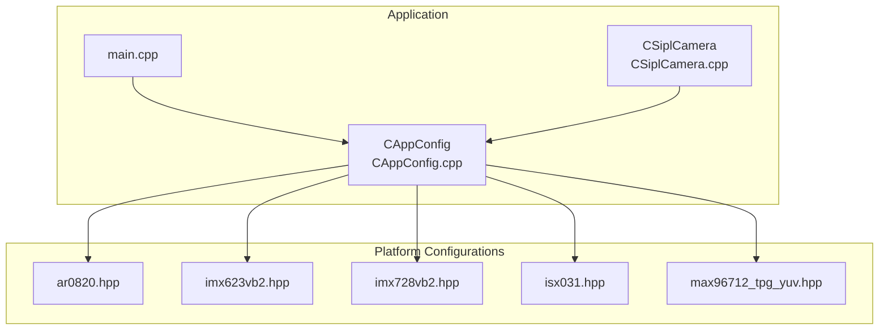
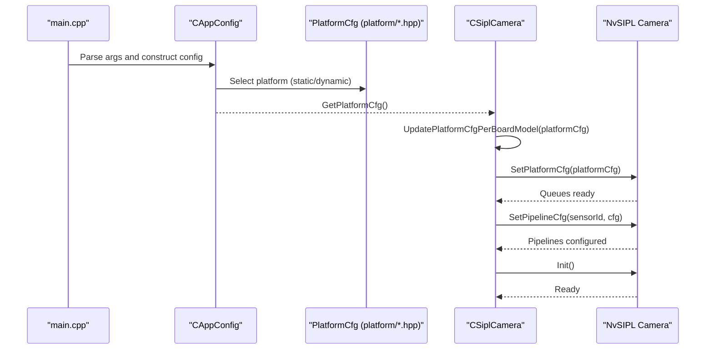
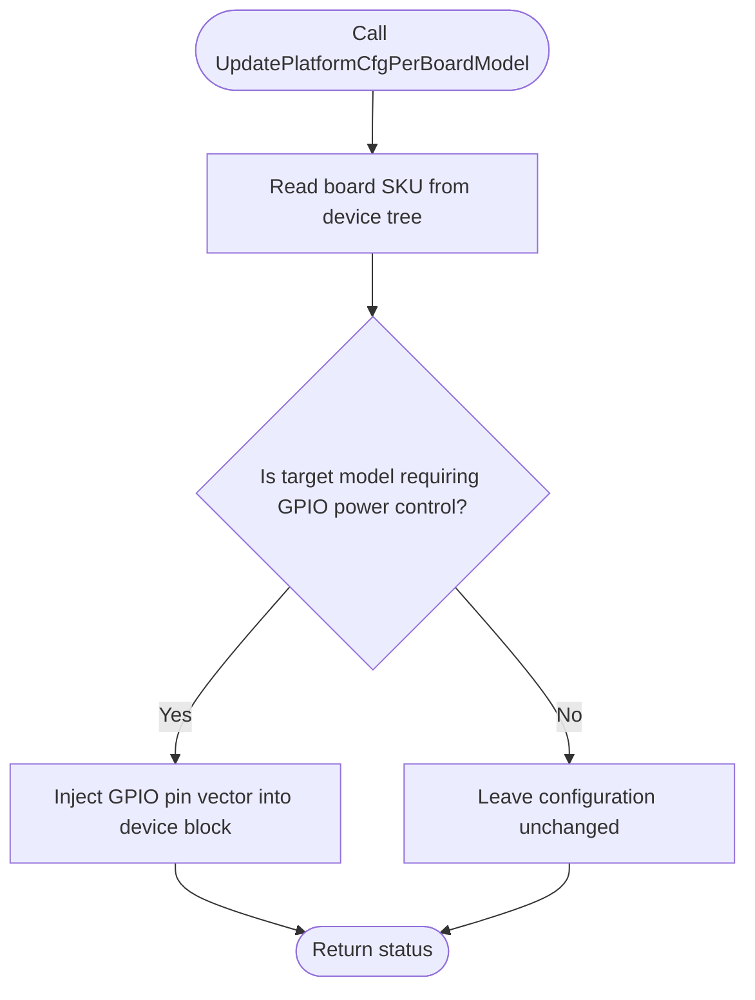
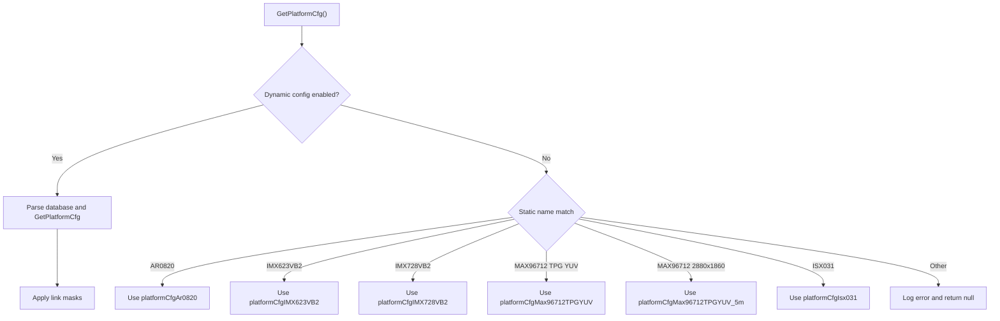
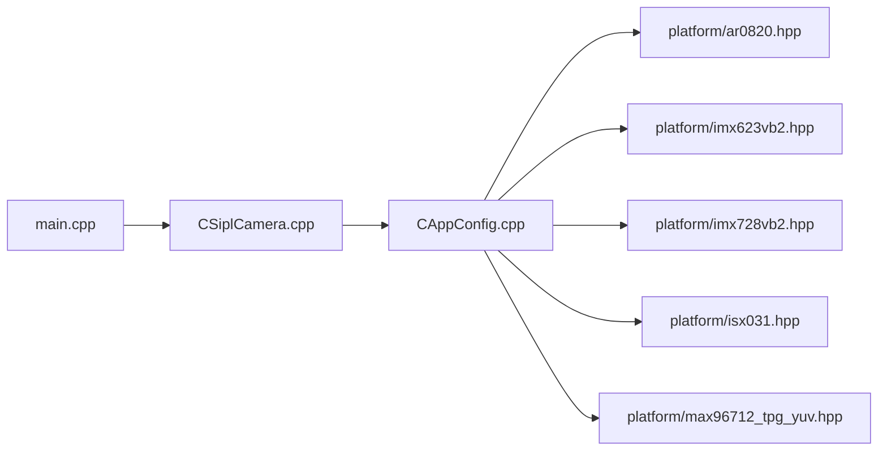

# Platform-Specific Camera Configurations

<cite>
**Referenced Files in This Document**
- [ar0820.hpp](file://platform/ar0820.hpp)
- [imx623vb2.hpp](file://platform/imx623vb2.hpp)
- [imx728vb2.hpp](file://platform/imx728vb2.hpp)
- [isx031.hpp](file://platform/isx031.hpp)
- [max96712_tpg_yuv.hpp](file://platform/max96712_tpg_yuv.hpp)
- [CAppConfig.hpp](file://CAppConfig.hpp)
- [CAppConfig.cpp](file://CAppConfig.cpp)
- [CSiplCamera.hpp](file://CSiplCamera.hpp)
- [CSiplCamera.cpp](file://CSiplCamera.cpp)
- [Common.hpp](file://Common.hpp)
- [main.cpp](file://main.cpp)
</cite>

## Table of Contents
1. [Introduction](#introduction)
2. [Project Structure](#project-structure)
3. [Core Components](#core-components)
4. [Architecture Overview](#architecture-overview)
5. [Detailed Component Analysis](#detailed-component-analysis)
6. [Dependency Analysis](#dependency-analysis)
7. [Performance Considerations](#performance-considerations)
8. [Troubleshooting Guide](#troubleshooting-guide)
9. [Conclusion](#conclusion)
10. [Appendices](#appendices)

## Introduction
This document explains platform-specific camera configurations and sensor integration in the multicast application. It focuses on the platform configuration structure, sensor properties, timing parameters, and hardware-specific optimizations for five platforms: AR0820, IMX623VB2, IMX728VB2, ISX031, and MAX96712_TPG_YUV. It also documents the automatic platform detection and configuration adaptation mechanism via UpdatePlatformCfgPerBoardModel, along with practical guidance for adding new platforms, modifying existing configurations, validating hardware compatibility, and deploying across multiple platforms.

## Project Structure
The platform-specific configurations are defined as static PlatformCfg instances in dedicated header files under the platform directory. The application composes these configurations at runtime based on command-line or dynamic selection and adapts them per target board model.

**Diagram sources**
- [main.cpp:253-304](file://main.cpp#L253-L304)
- [CAppConfig.cpp:15-19](file://CAppConfig.cpp#L15-L19)
- [CAppConfig.cpp:53-68](file://CAppConfig.cpp#L53-L68)
- [CSiplCamera.cpp:137-169](file://CSiplCamera.cpp#L137-L169)

**Section sources**
- [main.cpp:253-304](file://main.cpp#L253-L304)
- [CAppConfig.cpp:15-19](file://CAppConfig.cpp#L15-L19)
- [CAppConfig.cpp:53-68](file://CAppConfig.cpp#L53-L68)
- [CSiplCamera.cpp:137-169](file://CSiplCamera.cpp#L137-L169)

## Core Components
- Platform configuration files define PlatformCfg structures for each supported platform. These structures encapsulate:
  - Platform identifiers and descriptions
  - Device block topology (CSI port, PHY mode, deserializer, serializers, sensors)
  - I2C addresses, GPIO controls, and CDI v2 API usage
  - Sensor virtual channel (VC) configuration including pixel format, resolution, FPS, embedded data, trigger mode, and CFA pattern
- CAppConfig orchestrates platform selection:
  - Static selection by platform name
  - Dynamic selection via NvSIPL database queries (when enabled)
  - Resolution and format helpers for downstream consumers
- CSiplCamera integrates the selected configuration into the NvSIPL camera pipeline and adapts it per board model.

Key responsibilities:
- PlatformCfg composition and exposure in platform/*.hpp
- Static/dynamic platform selection in CAppConfig
- Automatic board-model adaptation in CSiplCamera
- Pipeline configuration and consumer routing decisions based on sensor type

**Section sources**
- [ar0820.hpp:14-183](file://platform/ar0820.hpp#L14-L183)
- [imx623vb2.hpp:14-163](file://platform/imx623vb2.hpp#L14-L163)
- [imx728vb2.hpp:14-163](file://platform/imx728vb2.hpp#L14-L163)
- [isx031.hpp:14-117](file://platform/isx031.hpp#L14-L117)
- [max96712_tpg_yuv.hpp:14-125](file://platform/max96712_tpg_yuv.hpp#L14-L125)
- [CAppConfig.cpp:21-75](file://CAppConfig.cpp#L21-L75)
- [CSiplCamera.cpp:117-135](file://CSiplCamera.cpp#L117-L135)

## Architecture Overview
The configuration flow selects a platform configuration and applies board-specific adaptations before initializing the camera pipeline.

**Diagram sources**
- [main.cpp:258-288](file://main.cpp#L258-L288)
- [CAppConfig.cpp:21-75](file://CAppConfig.cpp#L21-L75)
- [CSiplCamera.cpp:137-169](file://CSiplCamera.cpp#L137-L169)
- [CSiplCamera.cpp:209-287](file://CSiplCamera.cpp#L209-L287)

## Detailed Component Analysis

### Platform Configuration Structure
Each platform file defines a static PlatformCfg instance containing:
- Platform identity and description
- Device blocks with CSI port, PHY mode, deserializer info, and camera modules
- Per-module serializer and sensor info including I2C addresses, VC info, and trigger mode
- Timing parameters (DPHY/C-PHY rates), power/control ports, and optional flags

Representative fields and their roles:
- Platform identifiers: platform, platformConfig, description
- Device block: csiPort, phyMode, i2cDevice, deserInfo, numCameraModules, cameraModuleInfoList
- Module: serInfo (serializer), eepromInfo (optional), sensorInfo (VC info, resolution, FPS)
- Timing: dphyRate, cphyRate
- Control: pwrPort, desI2CPort, desTxPort, gpios, resetAll, group init flags

Examples of platform files:
- AR0820: 2 camera modules with AR0820 sensors, MAX9295 serializers, MAX96712 deserializer, RAW12 GRBG CFA
- IMX623VB2: 2 camera modules with IMX623 sensors, MAX96717F serializers, M24C04 EEPROM
- IMX728VB2: 2 camera modules with IMX728 sensors, MAX96717F serializers, M24C04 EEPROM
- ISX031: 2 camera modules with ISX031 sensors, MAX9295 serializers, YUYV422 format
- MAX96712_TPG_YUV: 2 TPG modules with dummy serializer/dummy sensor, YUYV422 format, optional TPG enable

**Section sources**
- [ar0820.hpp:14-183](file://platform/ar0820.hpp#L14-L183)
- [imx623vb2.hpp:14-163](file://platform/imx623vb2.hpp#L14-L163)
- [imx728vb2.hpp:14-163](file://platform/imx728vb2.hpp#L14-L163)
- [isx031.hpp:14-117](file://platform/isx031.hpp#L14-L117)
- [max96712_tpg_yuv.hpp:14-125](file://platform/max96712_tpg_yuv.hpp#L14-L125)

### Sensor Properties and Timing Parameters
Sensor-level properties include:
- Pixel order (CFA for RAW, YUYV for YUV)
- Embedded data configuration (top/bottom lines)
- Input format (RAW12, RAW12RJ, YUV422)
- Resolution (width, height)
- FPS
- Trigger mode enable/disable
- I2C address and optional simulator mode

Timing parameters:
- DPHY/C-PHY rates per link
- Optional passive mode, group initialization, long cable flags
- Power and I2C/TX port assignments

These properties are embedded in the VC info and sensor info structures within each platform configuration.

**Section sources**
- [ar0820.hpp:72-98](file://platform/ar0820.hpp#L72-L98)
- [imx623vb2.hpp:70-95](file://platform/imx623vb2.hpp#L70-L95)
- [imx728vb2.hpp:70-95](file://platform/imx728vb2.hpp#L70-L95)
- [isx031.hpp:48-65](file://platform/isx031.hpp#L48-L65)
- [max96712_tpg_yuv.hpp:48-68](file://platform/max96712_tpg_yuv.hpp#L48-L68)

### Hardware-Specific Optimizations
Optimizations visible in platform configurations:
- Serializer/Deserializer I2C addresses and CDI v2 API toggles per OS target
- EEPROM presence and addresses for calibration storage
- GPIO pin mappings and power control vectors
- Long cable flags and passive mode toggles for stability tuning

These fields allow per-hardware adjustments without changing application logic.

**Section sources**
- [ar0820.hpp:42-57](file://platform/ar0820.hpp#L42-L57)
- [imx623vb2.hpp:45-56](file://platform/imx623vb2.hpp#L45-L56)
- [imx728vb2.hpp:45-56](file://platform/imx728vb2.hpp#L45-L56)
- [isx031.hpp:37-47](file://platform/isx031.hpp#L37-L47)
- [max96712_tpg_yuv.hpp:36-46](file://platform/max96712_tpg_yuv.hpp#L36-L46)

### UpdatePlatformCfgPerBoardModel Function
Purpose:
- Detect board model at runtime and apply board-specific adaptations to the platform configuration before pipeline initialization.

Mechanism:
- Reads board SKU information from device tree (Linux) or device tree APIs (QNX)
- If the board is identified as a specific model requiring GPIO power control, injects GPIO pin assignments into the device block configuration

Usage:
- Called during CSiplCamera::Setup after obtaining the platform configuration from CAppConfig

**Diagram sources**
- [CSiplCamera.cpp:61-115](file://CSiplCamera.cpp#L61-L115)
- [CSiplCamera.cpp:117-135](file://CSiplCamera.cpp#L117-L135)

**Section sources**
- [CSiplCamera.cpp:61-115](file://CSiplCamera.cpp#L61-L115)
- [CSiplCamera.cpp:117-135](file://CSiplCamera.cpp#L117-L135)

### Platform Selection Logic in CAppConfig
Behavior:
- If dynamic configuration is enabled, load configuration from NvSIPL database and optionally apply link masks
- Otherwise, select a static platform based on configuration name:
  - AR0820, IMX623VB2, IMX728VB2, MAX96712 TPG YUV variants, ISX031
- Provides helpers to query resolution and format by sensor ID

**Diagram sources**
- [CAppConfig.cpp:21-75](file://CAppConfig.cpp#L21-L75)

**Section sources**
- [CAppConfig.cpp:21-75](file://CAppConfig.cpp#L21-L75)

### Pipeline Configuration Adaptation Based on Sensor Type
After platform configuration is applied, the pipeline configuration is adapted per sensor:
- For YUV sensors, capture output is requested and ISP outputs are disabled
- For RAW sensors with multi-elements enabled, both ISP0 and ISP1 outputs are requested
- Otherwise, ISP0 output is requested

This influences downstream consumers and output queues.

**Section sources**
- [CSiplCamera.cpp:171-189](file://CSiplCamera.cpp#L171-L189)

### Adding a New Platform Support
Steps:
1. Define a new static PlatformCfg in a new platform/<name>.hpp file mirroring the structure of existing files
   - Include device blocks, camera modules, serializer/deserializer/eeprom info, and sensor VC info
   - Set platform, platformConfig, and description appropriately
2. Extend CAppConfig::GetPlatformCfg to select the new platform by a new static name
3. Optionally, add board-model checks in UpdatePlatformCfgPerBoardModel if the platform requires board-specific GPIO or control
4. Verify resolution and format helpers work by sensor ID if needed
5. Test with the application using the new platform name

Guidance tips:
- Reuse existing enums and structures for consistency
- Keep I2C addresses and GPIO pin mappings aligned with hardware schematics
- Validate timing parameters (DPHY/C-PHY rates) against sensor and serializer datasheets

**Section sources**
- [CAppConfig.cpp:53-68](file://CAppConfig.cpp#L53-L68)
- [CSiplCamera.cpp:117-135](file://CSiplCamera.cpp#L117-L135)

### Modifying Existing Configurations
Examples:
- Adjust sensor resolution or FPS by updating vcInfo fields
- Change pixel format (e.g., RAW12 to RAW12RJ) for different packing requirements
- Toggle embedded data enable/disable per sensor
- Modify GPIO vectors or power/I2C/TX ports for different hardware revisions
- Enable/disable trigger mode per sensor

Validation:
- After changes, re-run the application and confirm pipeline initialization succeeds
- Use helper functions to verify resolution and format per sensor ID

**Section sources**
- [ar0820.hpp:72-98](file://platform/ar0820.hpp#L72-L98)
- [imx623vb2.hpp:70-95](file://platform/imx623vb2.hpp#L70-L95)
- [imx728vb2.hpp:70-95](file://platform/imx728vb2.hpp#L70-L95)
- [isx031.hpp:48-65](file://platform/isx031.hpp#L48-L65)
- [max96712_tpg_yuv.hpp:48-68](file://platform/max96712_tpg_yuv.hpp#L48-L68)

### Multi-Platform Deployment Scenarios
- Static selection: Choose a platform by name at build/runtime
- Dynamic selection: Use NvSIPL database queries to select platform and apply link masks for flexible deployments
- Board adaptation: UpdatePlatformCfgPerBoardModel ensures GPIO and control settings match the installed board model

Best practices:
- Maintain separate platform files for each hardware variant
- Use descriptive platformConfig names to reflect sensor, serializer, and mode (e.g., CPHY vs DPHY)
- Keep timing parameters conservative and validated across boards

**Section sources**
- [CAppConfig.cpp:25-50](file://CAppConfig.cpp#L25-L50)
- [CSiplCamera.cpp:117-135](file://CSiplCamera.cpp#L117-L135)

### Configuration Validation and Hardware Compatibility Verification
Validation steps:
- Confirm platform selection resolves to the intended configuration
- Verify sensor resolution and format helpers return expected values
- Ensure pipeline configuration matches sensor type (capture vs ISP outputs)
- Check board SKU detection and GPIO injection when applicable

Verification methods:
- Use logging from CAppConfig and CSiplCamera to trace configuration selection and adaptation
- Inspect device block and module lists for expected I2C addresses and GPIO vectors
- Validate that pipeline queues are created for requested output types

**Section sources**
- [CAppConfig.cpp:77-108](file://CAppConfig.cpp#L77-L108)
- [CSiplCamera.cpp:171-207](file://CSiplCamera.cpp#L171-L207)

## Dependency Analysis
The application depends on platform configuration headers and integrates them through CAppConfig and CSiplCamera. The platform files are self-contained static definitions.

**Diagram sources**
- [CAppConfig.cpp:15-19](file://CAppConfig.cpp#L15-L19)
- [CAppConfig.cpp:53-68](file://CAppConfig.cpp#L53-L68)
- [CSiplCamera.cpp:137-169](file://CSiplCamera.cpp#L137-L169)
- [main.cpp:258-288](file://main.cpp#L258-L288)

**Section sources**
- [CAppConfig.cpp:15-19](file://CAppConfig.cpp#L15-L19)
- [CAppConfig.cpp:53-68](file://CAppConfig.cpp#L53-L68)
- [CSiplCamera.cpp:137-169](file://CSiplCamera.cpp#L137-L169)
- [main.cpp:258-288](file://main.cpp#L258-L288)

## Performance Considerations
- Use appropriate pixel formats and resolutions for downstream consumers to avoid unnecessary conversions
- Tune DPHY/C-PHY rates to match sensor capabilities and cable lengths
- Disable embedded data when not needed to reduce bandwidth
- Prefer RAW12RJ for higher throughput when supported by the pipeline stage
- Limit multi-element ISP outputs to required stages to reduce compute load

[No sources needed since this section provides general guidance]

## Troubleshooting Guide
Common issues and remedies:
- Unexpected platform configuration error: Verify static platform name matches one of the supported names
- Dynamic configuration failures: Ensure NvSIPL database parsing and platform retrieval succeed; check link masks application
- Board SKU detection failure: Confirm device tree access permissions and property availability; validate QNX DTB access
- GPIO injection not applied: Ensure the detected board model matches the condition and GPIO vector is valid
- Pipeline misconfiguration: Confirm sensor type detection and pipeline output selection align with intended consumers

Diagnostic aids:
- Logging from CAppConfig and CSiplCamera during platform selection and adaptation
- Error buffers and GPIO event codes for deserializer/serializer/sensor errors
- Frame drop counters and notification handlers for pipeline warnings

**Section sources**
- [CAppConfig.cpp:25-50](file://CAppConfig.cpp#L25-L50)
- [CSiplCamera.cpp:61-115](file://CSiplCamera.cpp#L61-L115)
- [CSiplCamera.cpp:209-287](file://CSiplCamera.cpp#L209-L287)

## Conclusion
The platform-specific camera configuration system provides a modular, extensible way to describe heterogeneous camera setups. Platform files encapsulate sensor, serializer, and deserializer details, while CAppConfig and CSiplCamera coordinate selection, adaptation, and pipeline initialization. The UpdatePlatformCfgPerBoardModel function enables robust multi-board deployments by injecting board-specific controls. Following the documented procedures allows safe addition and modification of platform configurations, with built-in validation and troubleshooting pathways.

[No sources needed since this section summarizes without analyzing specific files]

## Appendices

### Appendix A: Platform Name Mapping
- AR0820: F008A120RM0AV2_CPHY_x4
- IMX623VB2: V1SIM623S4RU5195NB3_CPHY_x4
- IMX728VB2: V1SIM728S1RU3120NB20_CPHY_x4
- MAX96712 TPG YUV: MAX96712_YUV_8_TPG_CPHY_x4
- MAX96712 TPG YUV 2880x1860: MAX96712_2880x1860_YUV_8_TPG_DPHY_x4
- ISX031 YUYV: ISX031_YUYV_CPHY_x4

**Section sources**
- [CAppConfig.cpp:53-68](file://CAppConfig.cpp#L53-L68)

### Appendix B: Sensor Type Helpers
- Resolution lookup by sensor ID
- YUV sensor detection by sensor ID

**Section sources**
- [CAppConfig.cpp:77-108](file://CAppConfig.cpp#L77-L108)