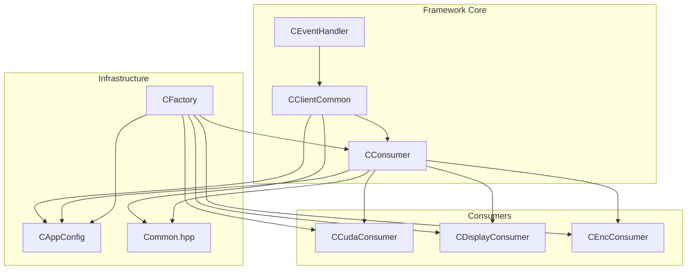
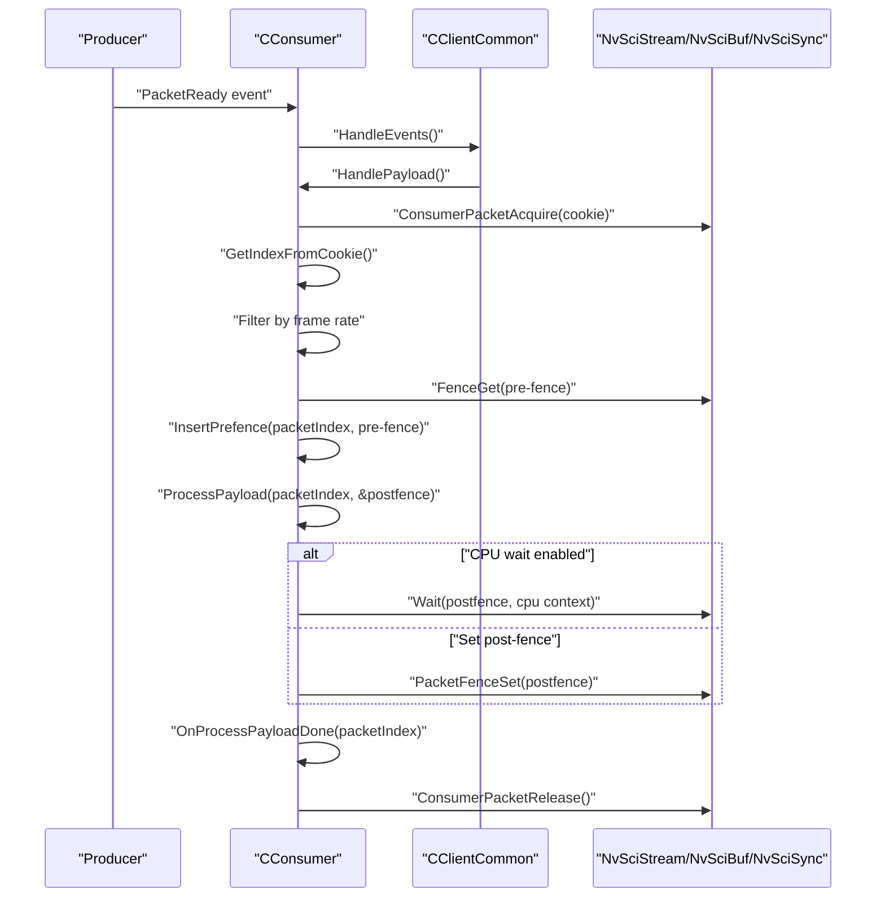
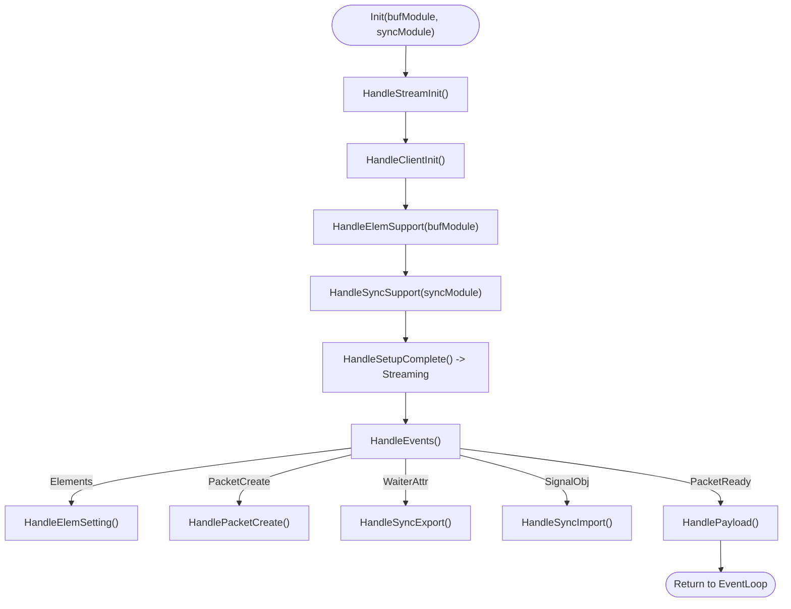
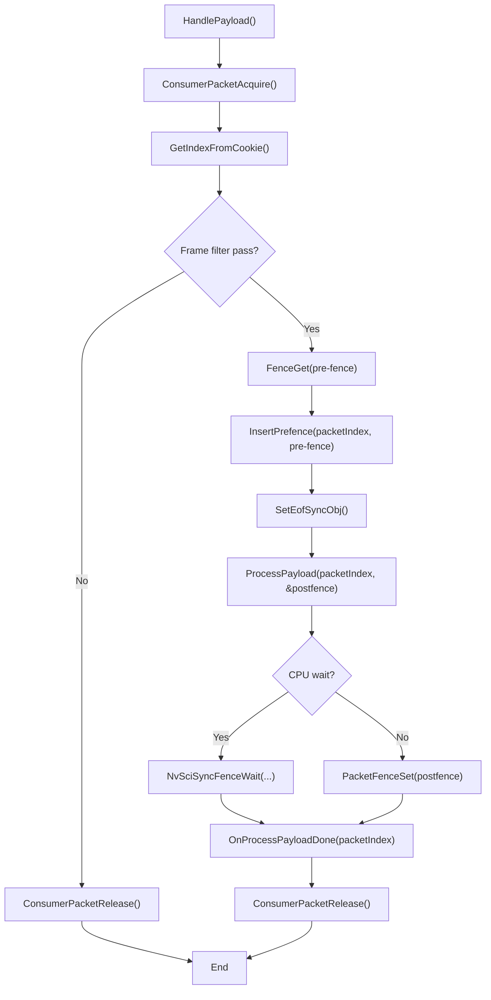
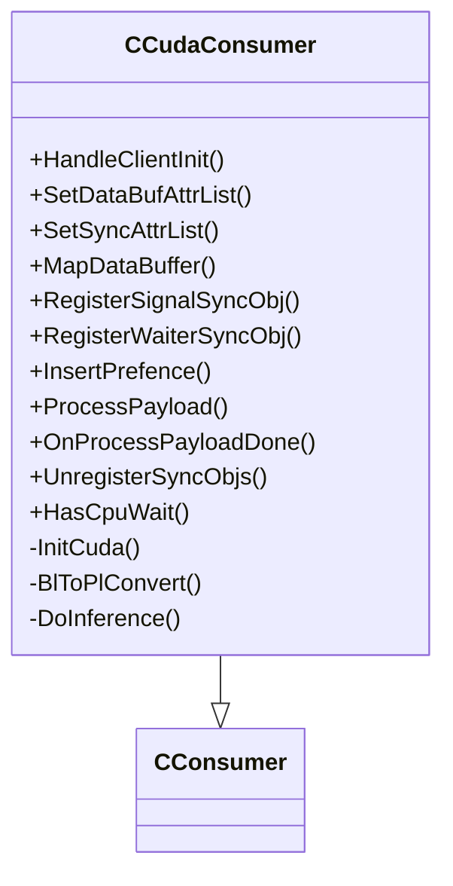
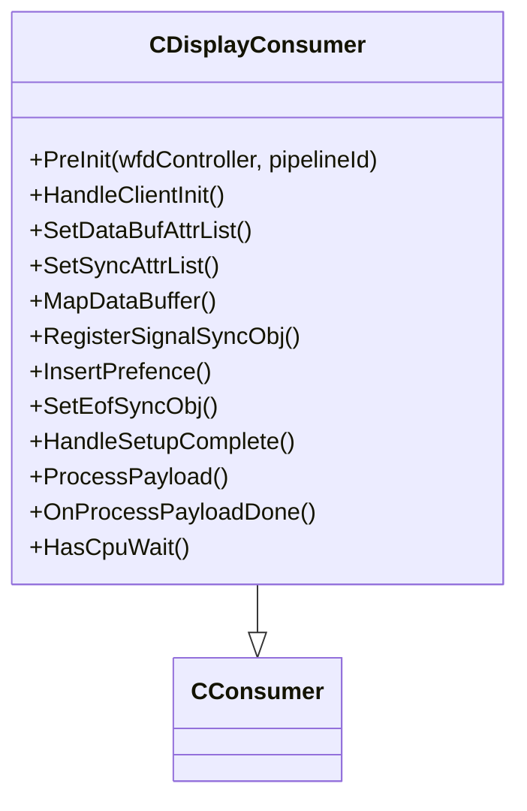
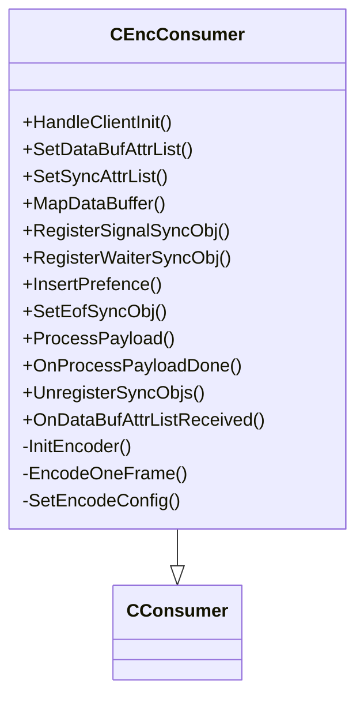
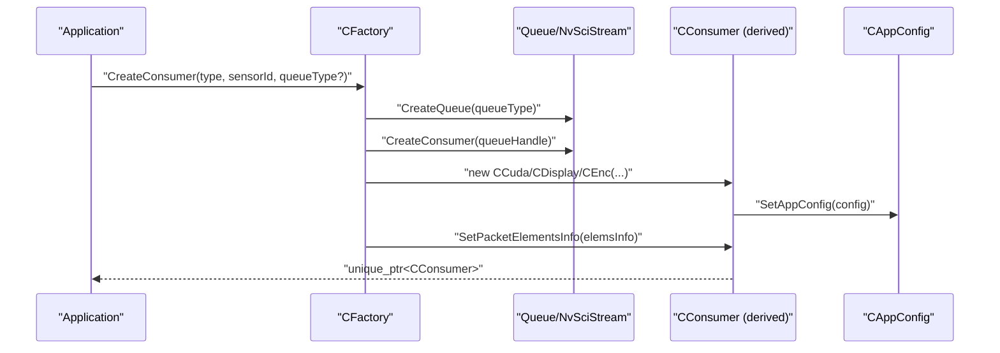
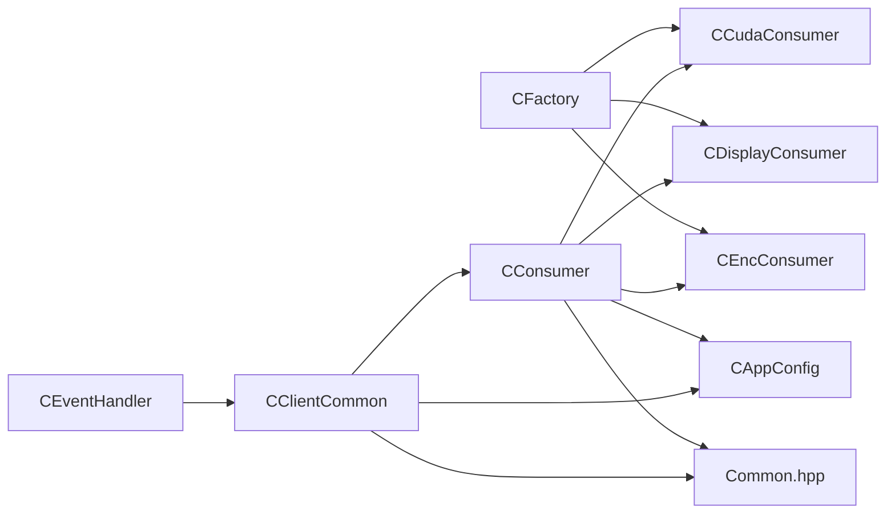

# Consumer Framework

<cite>
**Referenced Files in This Document**
- [CConsumer.hpp](file://CConsumer.hpp)
- [CConsumer.cpp](file://CConsumer.cpp)
- [CClientCommon.hpp](file://CClientCommon.hpp)
- [CClientCommon.cpp](file://CClientCommon.cpp)
- [CCudaConsumer.hpp](file://CCudaConsumer.hpp)
- [CCudaConsumer.cpp](file://CCudaConsumer.cpp)
- [CDisplayConsumer.hpp](file://CDisplayConsumer.hpp)
- [CDisplayConsumer.cpp](file://CDisplayConsumer.cpp)
- [CEncConsumer.hpp](file://CEncConsumer.hpp)
- [CEncConsumer.cpp](file://CEncConsumer.cpp)
- [CEventHandler.hpp](file://CEventHandler.hpp)
- [Common.hpp](file://Common.hpp)
- [CFactory.hpp](file://CFactory.hpp)
- [CFactory.cpp](file://CFactory.cpp)
- [CAppConfig.hpp](file://CAppConfig.hpp)
- [CAppConfig.cpp](file://CAppConfig.cpp)
</cite>

## Table of Contents
1. [Introduction](#introduction)
2. [Project Structure](#project-structure)
3. [Core Components](#core-components)
4. [Architecture Overview](#architecture-overview)
5. [Detailed Component Analysis](#detailed-component-analysis)
6. [Dependency Analysis](#dependency-analysis)
7. [Performance Considerations](#performance-considerations)
8. [Troubleshooting Guide](#troubleshooting-guide)
9. [Conclusion](#conclusion)
10. [Appendices](#appendices)

## Introduction
This document describes the consumer framework used by the NVIDIA SIPL Multicast system to process video frames produced by producers. It focuses on the CConsumer base class and the CClientCommon base class that implement the common streaming lifecycle, synchronization, and event handling. It also documents several concrete consumer implementations (CUDA, Display, Encoder) and the factory-driven consumer registration and initialization pipeline. The guide covers frame reception patterns, asynchronous processing workflows, error handling, resource cleanup, and state management, with practical examples and performance considerations.

## Project Structure
The consumer framework is organized around a small set of core classes and supporting infrastructure:
- Base classes: CClientCommon (common streaming and synchronization) and CConsumer (payload handling and frame filtering)
- Concrete consumers: CCudaConsumer, CDisplayConsumer, CEncConsumer
- Factory: CFactory creates queues, consumers, and related blocks
- Configuration: CAppConfig holds runtime settings and platform configuration
- Event handling: CEventHandler defines the event loop contract

**Diagram sources**
- [CEventHandler.hpp:23-51](file://CEventHandler.hpp#L23-L51)
- [CClientCommon.hpp:47-199](file://CClientCommon.hpp#L47-L199)
- [CConsumer.hpp:16-43](file://CConsumer.hpp#L16-L43)
- [CCudaConsumer.hpp:25-78](file://CCudaConsumer.hpp#L25-L78)
- [CDisplayConsumer.hpp:15-47](file://CDisplayConsumer.hpp#L15-L47)
- [CEncConsumer.hpp:17-64](file://CEncConsumer.hpp#L17-L64)
- [CFactory.hpp:27-92](file://CFactory.hpp#L27-L92)
- [CAppConfig.hpp:19-82](file://CAppConfig.hpp#L19-L82)
- [Common.hpp:14-86](file://Common.hpp#L14-L86)

**Section sources**
- [CEventHandler.hpp:15-54](file://CEventHandler.hpp#L15-L54)
- [CClientCommon.hpp:47-199](file://CClientCommon.hpp#L47-L199)
- [CConsumer.hpp:16-43](file://CConsumer.hpp#L16-L43)
- [CFactory.hpp:27-92](file://CFactory.hpp#L27-L92)
- [CAppConfig.hpp:19-82](file://CAppConfig.hpp#L19-L82)
- [Common.hpp:14-86](file://Common.hpp#L14-L86)

## Core Components
- CEventHandler: Defines the event loop interface and exposes the underlying NvSciStream block handle and entity name.
- CClientCommon: Implements the full consumer-side streaming lifecycle:
  - Initialization and setup phases (elements, sync attributes, packet creation/import)
  - Event-driven packet handling and payload processing
  - Synchronization export/import and CPU wait support
  - Buffer and metadata mapping, fence insertion, and cleanup
- CConsumer: Extends CClientCommon with frame filtering and the abstract payload processing hooks:
  - HandlePayload orchestrates acquisition, fence handling, async processing, and release
  - Abstract methods for ProcessPayload and OnProcessPayloadDone
  - Metadata mapping and unused element marking

Key responsibilities:
- Lifecycle: Init -> SetupComplete -> Streaming -> Deinit
- Asynchronous processing: Wait on pre-fences, invoke ProcessPayload, optionally CPU wait, set post-fences
- Resource management: Packet buffers, NvSciBuf/NvSciSync objects, CUDA resources (in derived consumers)

**Section sources**
- [CEventHandler.hpp:15-54](file://CEventHandler.hpp#L15-L54)
- [CClientCommon.hpp:47-199](file://CClientCommon.hpp#L47-L199)
- [CClientCommon.cpp:95-205](file://CClientCommon.cpp#L95-L205)
- [CConsumer.hpp:16-43](file://CConsumer.hpp#L16-L43)
- [CConsumer.cpp:17-94](file://CConsumer.cpp#L17-L94)

## Architecture Overview
The consumer architecture follows a layered design:
- Event-driven loop: CClientCommon::HandleEvents reacts to NvSciStream events and invokes HandlePayload
- Frame filtering: CConsumer applies frame filter from configuration before processing
- Fence orchestration: Pre-fence from producer is inserted into consumer’s async context; post-fence is either CPU-waited or set back to producer
- Payload processing: Derived consumers implement ProcessPayload and OnProcessPayloadDone

**Diagram sources**
- [CClientCommon.cpp:119-205](file://CClientCommon.cpp#L119-L205)
- [CConsumer.cpp:17-94](file://CConsumer.cpp#L17-L94)

**Section sources**
- [CClientCommon.cpp:119-205](file://CClientCommon.cpp#L119-L205)
- [CConsumer.cpp:17-94](file://CConsumer.cpp#L17-L94)

## Detailed Component Analysis

### CClientCommon: Shared Consumer Utilities and Lifecycle
CClientCommon encapsulates:
- Event handling and state transitions (Initialization -> Streaming)
- Element attribute setting and import/export
- Sync attribute reconciliation and signal/waiter object management
- Packet creation, buffer mapping, and metadata handling
- CPU wait context creation and usage

Notable behaviors:
- Element support: Iterates over configured elements, sets attributes, marks unused elements
- Sync support: Creates signaler/waiter attribute lists per element; optional CPU wait context
- Packet lifecycle: New packet handle retrieval, cookie assignment, buffer mapping, status reporting
- Sync export/import: Reconciles unreconciled waiter attributes, allocates signal objects, registers/import waiter objects
- Payload handling: Abstract HandlePayload to be implemented by derived classes

**Diagram sources**
- [CClientCommon.cpp:95-205](file://CClientCommon.cpp#L95-L205)
- [CClientCommon.cpp:300-408](file://CClientCommon.cpp#L300-L408)
- [CClientCommon.cpp:410-467](file://CClientCommon.cpp#L410-L467)
- [CClientCommon.cpp:469-553](file://CClientCommon.cpp#L469-L553)
- [CClientCommon.cpp:555-591](file://CClientCommon.cpp#L555-L591)

**Section sources**
- [CClientCommon.hpp:47-199](file://CClientCommon.hpp#L47-L199)
- [CClientCommon.cpp:95-205](file://CClientCommon.cpp#L95-L205)
- [CClientCommon.cpp:300-408](file://CClientCommon.cpp#L300-L408)
- [CClientCommon.cpp:410-467](file://CClientCommon.cpp#L410-L467)
- [CClientCommon.cpp:469-553](file://CClientCommon.cpp#L469-L553)
- [CClientCommon.cpp:555-591](file://CClientCommon.cpp#L555-L591)

### CConsumer: Frame Filtering and Payload Orchestration
CConsumer adds:
- Frame filtering via configuration (frame filter ratio)
- Fence handling: Acquire packet, get pre-fence, insert into async context, optionally CPU wait, set post-fence
- Abstract processing hooks: ProcessPayload and OnProcessPayloadDone
- Metadata mapping and unused element marking

Processing flow:
- Acquire packet and resolve index from cookie
- Apply frame filter; if filtered, release immediately
- Query and insert pre-fence; set EOF sync object
- Call ProcessPayload to perform async work; wait or set post-fence
- Invoke OnProcessPayloadDone for completion actions
- Release packet back to producer

**Diagram sources**
- [CConsumer.cpp:17-94](file://CConsumer.cpp#L17-L94)

**Section sources**
- [CConsumer.hpp:16-43](file://CConsumer.hpp#L16-L43)
- [CConsumer.cpp:17-94](file://CConsumer.cpp#L17-L94)

### CCudaConsumer: CUDA-Based Frame Processing
CCudaConsumer demonstrates:
- Device initialization and CUDA stream creation
- Buffer mapping for BlockLinear and PitchLinear layouts
- Fence waiting via imported external semaphore
- Optional inference and host buffer dumping
- Cleanup of CUDA resources and semaphores

Key implementation points:
- Buffer attributes and mapping for CUDA interoperability
- Fence waiting using CUDA external semaphore
- Optional conversion and inference pipeline
- File dumping of decoded frames

**Diagram sources**
- [CCudaConsumer.hpp:25-78](file://CCudaConsumer.hpp#L25-L78)
- [CCudaConsumer.cpp:55-110](file://CCudaConsumer.cpp#L55-L110)
- [CCudaConsumer.cpp:173-273](file://CCudaConsumer.cpp#L173-L273)
- [CCudaConsumer.cpp:301-322](file://CCudaConsumer.cpp#L301-L322)
- [CCudaConsumer.cpp:386-462](file://CCudaConsumer.cpp#L386-L462)
- [CCudaConsumer.cpp:464-483](file://CCudaConsumer.cpp#L464-L483)

**Section sources**
- [CCudaConsumer.hpp:25-78](file://CCudaConsumer.hpp#L25-L78)
- [CCudaConsumer.cpp:55-110](file://CCudaConsumer.cpp#L55-L110)
- [CCudaConsumer.cpp:173-273](file://CCudaConsumer.cpp#L173-L273)
- [CCudaConsumer.cpp:301-322](file://CCudaConsumer.cpp#L301-L322)
- [CCudaConsumer.cpp:386-462](file://CCudaConsumer.cpp#L386-L462)
- [CCudaConsumer.cpp:464-483](file://CCudaConsumer.cpp#L464-L483)

### CDisplayConsumer: Display Pipeline Integration
CDisplayConsumer integrates with the display subsystem:
- Uses a controller to configure NvSciBuf and NvSciSync attributes
- Maps buffers to display sources and performs flips with post-fences
- Handles setup completion to initialize display rectangles and first flip

**Diagram sources**
- [CDisplayConsumer.hpp:15-47](file://CDisplayConsumer.hpp#L15-L47)
- [CDisplayConsumer.cpp:18-34](file://CDisplayConsumer.cpp#L18-L34)
- [CDisplayConsumer.cpp:37-68](file://CDisplayConsumer.cpp#L37-L68)
- [CDisplayConsumer.cpp:80-91](file://CDisplayConsumer.cpp#L80-L91)
- [CDisplayConsumer.cpp:93-113](file://CDisplayConsumer.cpp#L93-L113)
- [CDisplayConsumer.cpp:121-134](file://CDisplayConsumer.cpp#L121-L134)

**Section sources**
- [CDisplayConsumer.hpp:15-47](file://CDisplayConsumer.hpp#L15-L47)
- [CDisplayConsumer.cpp:18-34](file://CDisplayConsumer.cpp#L18-L34)
- [CDisplayConsumer.cpp:37-68](file://CDisplayConsumer.cpp#L37-L68)
- [CDisplayConsumer.cpp:80-91](file://CDisplayConsumer.cpp#L80-L91)
- [CDisplayConsumer.cpp:93-113](file://CDisplayConsumer.cpp#L93-L113)
- [CDisplayConsumer.cpp:121-134](file://CDisplayConsumer.cpp#L121-L134)

### CEncConsumer: Hardware Encoder Consumer
CEncConsumer integrates with NvMedia IEP for encoding:
- Initializes encoder with configuration and resolution from CAppConfig
- Registers NvSciBuf and NvSciSync objects with the encoder
- Encodes frames and writes bitstreams to file when enabled

**Diagram sources**
- [CEncConsumer.hpp:17-64](file://CEncConsumer.hpp#L17-L64)
- [CEncConsumer.cpp:17-26](file://CEncConsumer.cpp#L17-L26)
- [CEncConsumer.cpp:117-140](file://CEncConsumer.cpp#L117-L140)
- [CEncConsumer.cpp:143-156](file://CEncConsumer.cpp#L143-L156)
- [CEncConsumer.cpp:158-168](file://CEncConsumer.cpp#L158-L168)
- [CEncConsumer.cpp:170-189](file://CEncConsumer.cpp#L170-L189)
- [CEncConsumer.cpp:210-228](file://CEncConsumer.cpp#L210-L228)
- [CEncConsumer.cpp:309-317](file://CEncConsumer.cpp#L309-L317)
- [CEncConsumer.cpp:319-345](file://CEncConsumer.cpp#L319-L345)
- [CEncConsumer.cpp:347-355](file://CEncConsumer.cpp#L347-L355)

**Section sources**
- [CEncConsumer.hpp:17-64](file://CEncConsumer.hpp#L17-L64)
- [CEncConsumer.cpp:17-26](file://CEncConsumer.cpp#L17-L26)
- [CEncConsumer.cpp:117-140](file://CEncConsumer.cpp#L117-L140)
- [CEncConsumer.cpp:143-156](file://CEncConsumer.cpp#L143-L156)
- [CEncConsumer.cpp:158-168](file://CEncConsumer.cpp#L158-L168)
- [CEncConsumer.cpp:170-189](file://CEncConsumer.cpp#L170-L189)
- [CEncConsumer.cpp:210-228](file://CEncConsumer.cpp#L210-L228)
- [CEncConsumer.cpp:309-317](file://CEncConsumer.cpp#L309-L317)
- [CEncConsumer.cpp:319-345](file://CEncConsumer.cpp#L319-L345)
- [CEncConsumer.cpp:347-355](file://CEncConsumer.cpp#L347-L355)

### Consumer Registration and Factory Pattern
CFactory drives consumer creation and configuration:
- Creates queues (mailbox or FIFO) and consumer blocks
- Builds element info vectors for consumers based on configuration
- Instantiates appropriate consumer subclass and injects CAppConfig and element info

**Diagram sources**
- [CFactory.cpp:166-205](file://CFactory.cpp#L166-L205)
- [CFactory.cpp:96-136](file://CFactory.cpp#L96-L136)
- [CAppConfig.hpp:19-82](file://CAppConfig.hpp#L19-L82)

**Section sources**
- [CFactory.hpp:27-92](file://CFactory.hpp#L27-L92)
- [CFactory.cpp:166-205](file://CFactory.cpp#L166-L205)
- [CFactory.cpp:96-136](file://CFactory.cpp#L96-L136)
- [CAppConfig.hpp:19-82](file://CAppConfig.hpp#L19-L82)

## Dependency Analysis
- CEventHandler provides the event loop abstraction used by CClientCommon
- CClientCommon depends on NvSciBuf/NvSciSync modules and CAppConfig for runtime settings
- CConsumer depends on CClientCommon and adds frame filtering and abstract payload hooks
- Concrete consumers depend on their respective subsystems (CUDA, Display controller, NvMedia IEP)
- CFactory composes consumers and manages element configuration and queue creation

**Diagram sources**
- [CEventHandler.hpp:23-51](file://CEventHandler.hpp#L23-L51)
- [CClientCommon.hpp:47-199](file://CClientCommon.hpp#L47-L199)
- [CConsumer.hpp:16-43](file://CConsumer.hpp#L16-L43)
- [CCudaConsumer.hpp:25-78](file://CCudaConsumer.hpp#L25-L78)
- [CDisplayConsumer.hpp:15-47](file://CDisplayConsumer.hpp#L15-L47)
- [CEncConsumer.hpp:17-64](file://CEncConsumer.hpp#L17-L64)
- [CFactory.hpp:27-92](file://CFactory.hpp#L27-L92)
- [CAppConfig.hpp:19-82](file://CAppConfig.hpp#L19-L82)
- [Common.hpp:14-86](file://Common.hpp#L14-L86)

**Section sources**
- [CEventHandler.hpp:23-51](file://CEventHandler.hpp#L23-L51)
- [CClientCommon.hpp:47-199](file://CClientCommon.hpp#L47-L199)
- [CConsumer.hpp:16-43](file://CConsumer.hpp#L16-L43)
- [CCudaConsumer.hpp:25-78](file://CCudaConsumer.hpp#L25-L78)
- [CDisplayConsumer.hpp:15-47](file://CDisplayConsumer.hpp#L15-L47)
- [CEncConsumer.hpp:17-64](file://CEncConsumer.hpp#L17-L64)
- [CFactory.hpp:27-92](file://CFactory.hpp#L27-L92)
- [CAppConfig.hpp:19-82](file://CAppConfig.hpp#L19-L82)
- [Common.hpp:14-86](file://Common.hpp#L14-L86)

## Performance Considerations
- Frame filtering: Use CAppConfig frame filter to reduce processing load when needed
- Fence waiting: Prefer GPU waits via external semaphores to avoid CPU blocking; fallback to CPU wait only when necessary
- Buffer layouts: Choose optimal layouts (e.g., PitchLinear) for downstream consumers to minimize conversions
- Memory management: Reuse host/device buffers where possible; ensure proper cleanup to avoid leaks
- Threading model: Consumers operate in an event-driven loop; ensure async processing does not starve the event thread
- Encoder pipeline: Tune encoder configuration and output buffering to balance latency and throughput

[No sources needed since this section provides general guidance]

## Troubleshooting Guide
Common issues and remedies:
- Event timeouts: HandleEvent may return timed out; investigate producer connectivity and setup progress
- Unknown or error events: Log and return error status; query NvSciStream error code for diagnostics
- Packet creation failures: Exceeding MAX_NUM_PACKETS or buffer retrieval errors; adjust configuration or reduce workload
- Fence operations: Failures during FenceGet/FenceSet or Wait indicate misconfiguration or missing pre/post fences
- Cleanup: Ensure UnregisterSyncObjs and destructor logic are executed to prevent resource leaks

**Section sources**
- [CClientCommon.cpp:119-205](file://CClientCommon.cpp#L119-L205)
- [CClientCommon.cpp:410-467](file://CClientCommon.cpp#L410-L467)
- [CConsumer.cpp:17-94](file://CConsumer.cpp#L17-L94)

## Conclusion
The consumer framework provides a robust, extensible foundation for processing multicast video streams. CClientCommon and CConsumer define a consistent lifecycle and synchronization model, while concrete consumers demonstrate integration with CUDA, display, and hardware encoders. The factory pattern simplifies consumer instantiation and configuration, and CAppConfig centralizes runtime settings. Following the patterns documented here enables reliable, high-performance frame processing across diverse consumer types.

## Appendices

### Practical Implementation Examples
- Implementing a new consumer:
  - Derive from CConsumer
  - Override SetDataBufAttrList, SetSyncAttrList, MapDataBuffer, RegisterSignalSyncObj, RegisterWaiterSyncObj
  - Implement InsertPrefence, ProcessPayload, OnProcessPayloadDone
  - Optionally override HasCpuWait and SetEofSyncObj
  - Use CFactory::CreateConsumer to instantiate and configure

- Frame processing logic:
  - Use InsertPrefence to synchronize with producer pre-fences
  - Perform async work in ProcessPayload (e.g., CUDA copies, inference, encoding)
  - OnProcessPayloadDone for post-processing (e.g., file dumping, display flips)

- Integration tips:
  - Align element usage with producer capabilities via element info vectors
  - Leverage CAppConfig for resolution and platform-specific settings
  - Ensure proper fence handling to maintain pipeline timing

**Section sources**
- [CConsumer.hpp:16-43](file://CConsumer.hpp#L16-L43)
- [CConsumer.cpp:17-94](file://CConsumer.cpp#L17-L94)
- [CCudaConsumer.cpp:173-273](file://CCudaConsumer.cpp#L173-L273)
- [CDisplayConsumer.cpp:54-68](file://CDisplayConsumer.cpp#L54-L68)
- [CEncConsumer.cpp:158-168](file://CEncConsumer.cpp#L158-L168)
- [CFactory.cpp:166-205](file://CFactory.cpp#L166-L205)
- [CAppConfig.cpp:77-108](file://CAppConfig.cpp#L77-L108)