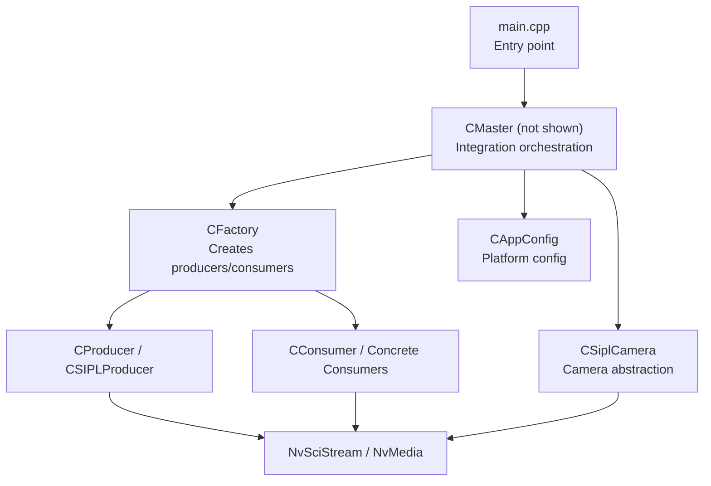
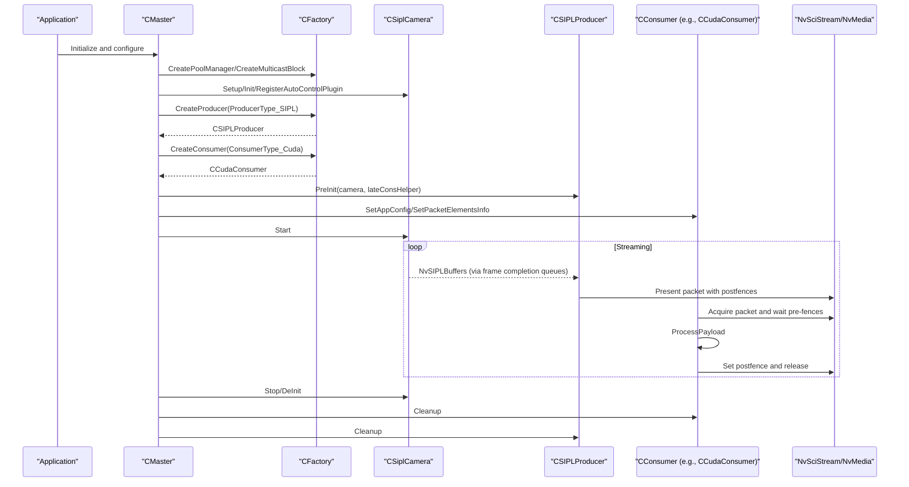
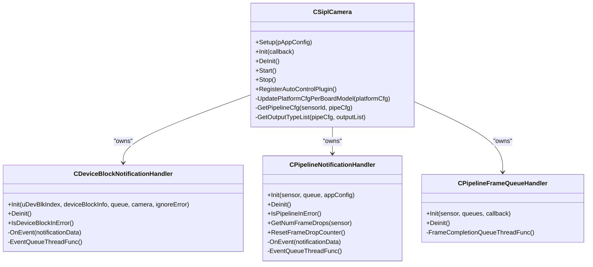
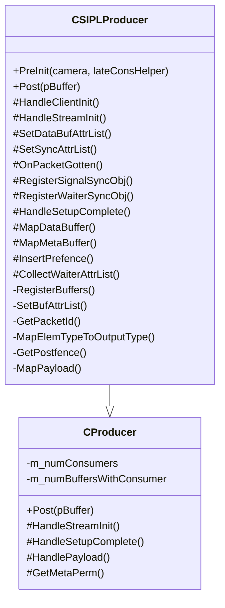
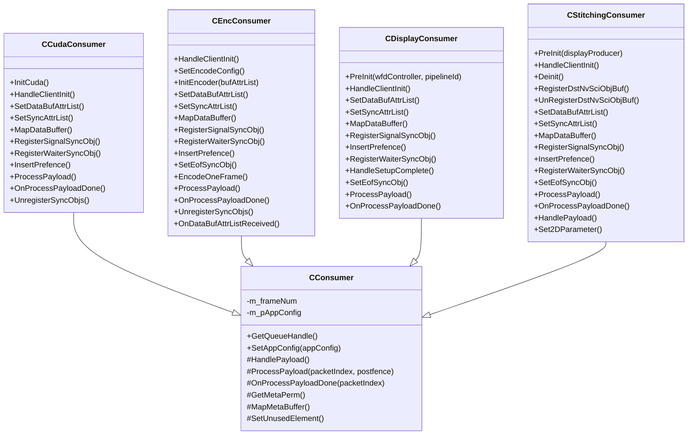
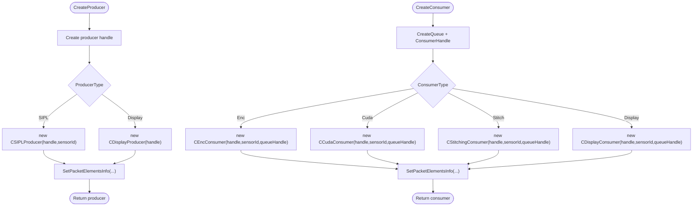
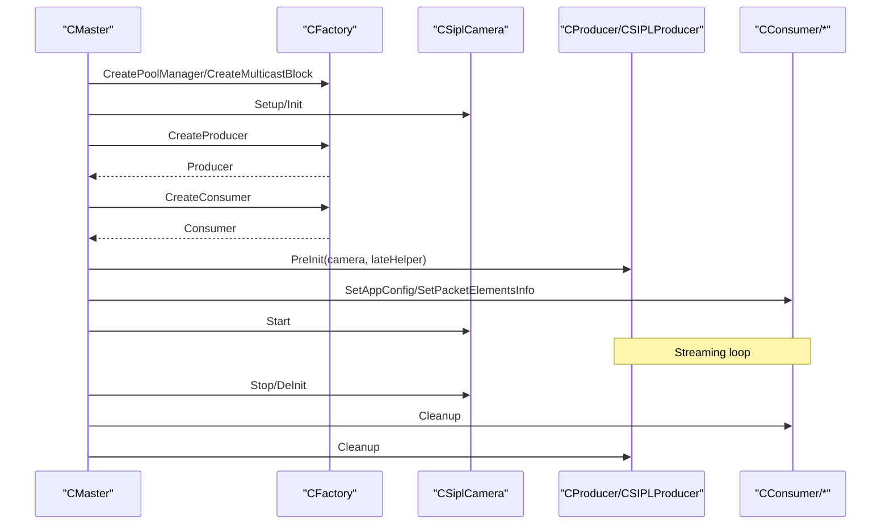
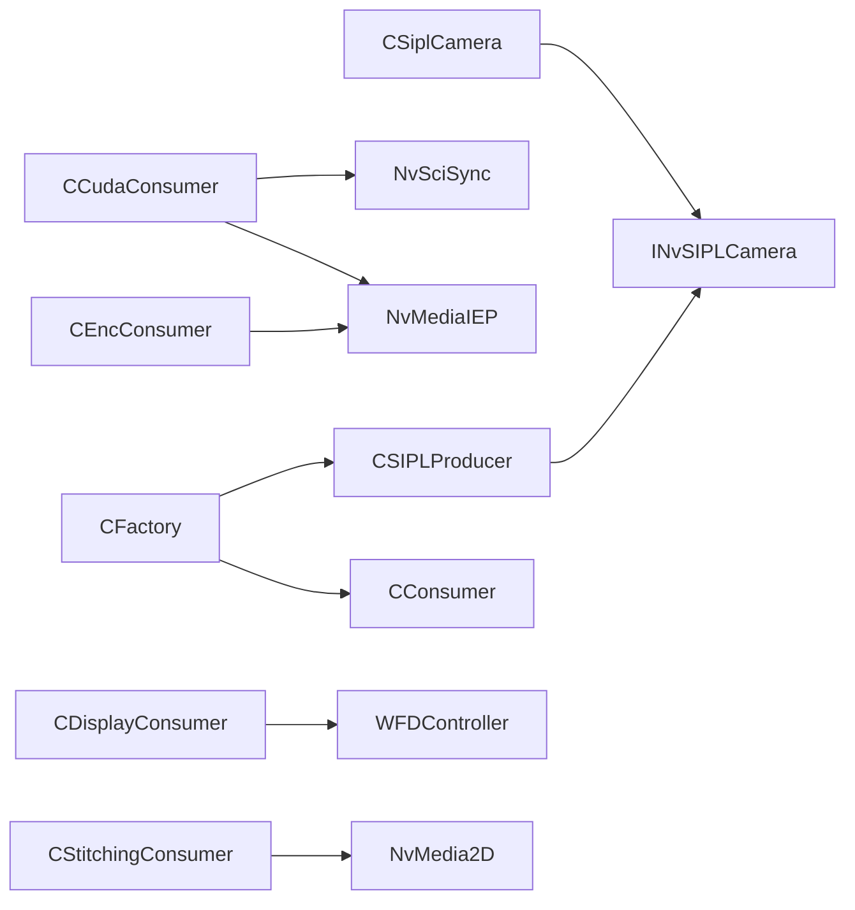

# Core Components

<cite>
**Referenced Files in This Document**
- [CSiplCamera.cpp](file://CSiplCamera.cpp)
- [CSiplCamera.hpp](file://CSiplCamera.hpp)
- [CProducer.cpp](file://CProducer.cpp)
- [CProducer.hpp](file://CProducer.hpp)
- [CSIPLProducer.cpp](file://CSIPLProducer.cpp)
- [CSIPLProducer.hpp](file://CSIPLProducer.hpp)
- [CConsumer.cpp](file://CConsumer.cpp)
- [CConsumer.hpp](file://CConsumer.hpp)
- [CFactory.cpp](file://CFactory.cpp)
- [CFactory.hpp](file://CFactory.hpp)
- [CCudaConsumer.cpp](file://CCudaConsumer.cpp)
- [CEncConsumer.cpp](file://CEncConsumer.cpp)
- [CDisplayConsumer.cpp](file://CDisplayConsumer.cpp)
- [CStitchingConsumer.cpp](file://CStitchingConsumer.cpp)
- [main.cpp](file://main.cpp)
- [CAppConfig.cpp](file://CAppConfig.cpp)
</cite>

## Table of Contents
1. [Introduction](#introduction)
2. [Project Structure](#project-structure)
3. [Core Components](#core-components)
4. [Architecture Overview](#architecture-overview)
5. [Detailed Component Analysis](#detailed-component-analysis)
6. [Dependency Analysis](#dependency-analysis)
7. [Performance Considerations](#performance-considerations)
8. [Troubleshooting Guide](#troubleshooting-guide)
9. [Conclusion](#conclusion)

## Introduction
This document explains the core components of the NVIDIA SIPL Multicast system with emphasis on:
- CSiplCamera: camera abstraction and platform configuration integration
- CProducer and CSIPLProducer: frame distribution via NvStreams
- CConsumer and concrete consumers: factory-driven consumer creation and lifecycle
- CFactory: pluggable consumer types and resource management
It also covers component lifecycle, initialization sequences, inter-component communication, error handling, resource cleanup, and performance considerations.

## Project Structure
The core system orchestrates camera capture, producer-side frame distribution, and consumer-side processing through a factory pattern. The main entry point initializes configuration, creates the master controller, and manages runtime controls.

**Diagram sources**
- [main.cpp:253-304](file://main.cpp#L253-L304)
- [CFactory.cpp:68-94](file://CFactory.cpp#L68-L94)
- [CFactory.cpp:166-205](file://CFactory.cpp#L166-L205)
- [CSiplCamera.cpp:137-362](file://CSiplCamera.cpp#L137-L362)
- [CAppConfig.cpp:21-75](file://CAppConfig.cpp#L21-L75)

**Section sources**
- [main.cpp:253-304](file://main.cpp#L253-L304)
- [CFactory.cpp:68-94](file://CFactory.cpp#L68-L94)
- [CFactory.cpp:166-205](file://CFactory.cpp#L166-L205)
- [CSiplCamera.cpp:137-362](file://CSiplCamera.cpp#L137-L362)
- [CAppConfig.cpp:21-75](file://CAppConfig.cpp#L21-L75)

## Core Components
This section introduces the primary building blocks and their responsibilities.

- CSiplCamera: encapsulates INvSIPLCamera, sets platform/pipeline configurations per sensor, registers notification and frame completion queues, and manages lifecycle threads for device-block and pipeline events.
- CProducer: base class for producers, handles NvSciStream producer lifecycle, packet acquisition, fence handling, and payload posting.
- CSIPLProducer: SIPL-specific producer that maps NvSIPL buffers to NvSciBuf/NvMedia buffers, reconciles attributes, registers images, and posts frames with appropriate fences.
- CConsumer: base class for consumers, handles packet acquisition, pre/post fence synchronization, payload processing, and release semantics.
- CFactory: singleton factory that constructs producers/consumers, queues, multicast blocks, and IPC blocks; supports dynamic selection of consumer types and element usage.

**Section sources**
- [CSiplCamera.hpp:46-85](file://CSiplCamera.hpp#L46-L85)
- [CProducer.hpp:16-51](file://CProducer.hpp#L16-L51)
- [CSIPLProducer.hpp:18-81](file://CSIPLProducer.hpp#L18-L81)
- [CConsumer.hpp:16-44](file://CConsumer.hpp#L16-L44)
- [CFactory.hpp:27-92](file://CFactory.hpp#L27-L92)

## Architecture Overview
The system integrates camera capture, producer distribution, and consumer processing through NvSciStream and NvMedia. The factory pattern enables pluggable consumer implementations and flexible element usage.

**Diagram sources**
- [CSiplCamera.cpp:137-362](file://CSiplCamera.cpp#L137-L362)
- [CSIPLProducer.cpp:36-405](file://CSIPLProducer.cpp#L36-L405)
- [CConsumer.cpp:17-94](file://CConsumer.cpp#L17-L94)
- [CFactory.cpp:68-94](file://CFactory.cpp#L68-L94)
- [CFactory.cpp:166-205](file://CFactory.cpp#L166-L205)

## Detailed Component Analysis

### CSiplCamera: Camera Abstraction and Platform Integration
- Responsibilities:
  - Loads platform configuration and adapts per board SKU (e.g., GPIO power control for specific SKUs).
  - Builds camera module list from platform configuration.
  - Initializes INvSIPLCamera, sets platform/pipeline configurations, and registers notification and frame completion handlers.
  - Manages device-block and pipeline error notification threads.
  - Supports auto-control plugin registration for non-YUV sensors.
- Lifecycle:
  - Setup: validates SIPL library/header versions, loads platform config, updates per-board, collects camera modules.
  - Init: sets platform/pipeline configs, registers notification handlers, starts camera.
  - DeInit: stops camera, tears down notification threads and handlers, resets pointers.
- Inter-component communication:
  - Uses INvSIPLCamera and NvSIPLPipelineNotifier to receive notifications and frame completion queues.
  - Bridges NvSIPL outputs to downstream consumers via frame completion queues.

**Diagram sources**
- [CSiplCamera.hpp:46-85](file://CSiplCamera.hpp#L46-L85)
- [CSiplCamera.hpp:87-355](file://CSiplCamera.hpp#L87-L355)
- [CSiplCamera.hpp:357-621](file://CSiplCamera.hpp#L357-L621)

**Section sources**
- [CSiplCamera.cpp:137-362](file://CSiplCamera.cpp#L137-L362)
- [CSiplCamera.hpp:46-85](file://CSiplCamera.hpp#L46-L85)
- [CSiplCamera.hpp:87-355](file://CSiplCamera.hpp#L87-L355)
- [CSiplCamera.hpp:357-621](file://CSiplCamera.hpp#L357-L621)

### CProducer and CSIPLProducer: Frame Distribution via NvStreams
- CProducer:
  - Base producer managing NvSciStream producer lifecycle.
  - Handles stream initialization, setup completion, payload processing, and packet posting with pre/post fences.
  - Tracks number of buffers with consumers and integrates profiling hooks.
- CSIPLProducer:
  - Extends CProducer for SIPL integration.
  - Maps packet element types to NvSIPL output types, reconciles buffer/sync attributes, registers images, and posts frames.
  - Supports late consumer adjustments and CPU waiter attributes on non-QNX platforms.
  - Manages SIPL buffer objects and metadata pointers.

**Diagram sources**
- [CProducer.hpp:16-51](file://CProducer.hpp#L16-L51)
- [CSIPLProducer.hpp:18-81](file://CSIPLProducer.hpp#L18-L81)

**Section sources**
- [CProducer.cpp:17-157](file://CProducer.cpp#L17-L157)
- [CProducer.hpp:16-51](file://CProducer.hpp#L16-L51)
- [CSIPLProducer.cpp:36-405](file://CSIPLProducer.cpp#L36-L405)
- [CSIPLProducer.hpp:18-81](file://CSIPLProducer.hpp#L18-L81)

### CConsumer and Concrete Consumers: Factory Pattern and Lifecycle
- CConsumer:
  - Base consumer handling packet acquisition, pre/post fence synchronization, payload processing, and release semantics.
  - Integrates frame filtering, profiler hooks, and metadata buffer mapping.
- Concrete Consumers:
  - CCudaConsumer: CUDA-based processing, external semaphore import, device/host buffer mapping, optional inference, and optional file dumping.
  - CEncConsumer: NvMedia encoder integration, buffer/sync attribute reconciliation, frame encoding, and optional file dumping.
  - CDisplayConsumer: WFD controller integration for display, buffer mapping, and flip operations.
  - CStitchingConsumer: 2D composition integration, buffer registration, parameter setup, and submission to display producer.

**Diagram sources**
- [CConsumer.hpp:16-44](file://CConsumer.hpp#L16-L44)
- [CCudaConsumer.cpp:11-492](file://CCudaConsumer.cpp#L11-L492)
- [CEncConsumer.cpp:12-356](file://CEncConsumer.cpp#L12-L356)
- [CDisplayConsumer.cpp:12-140](file://CDisplayConsumer.cpp#L12-L140)
- [CStitchingConsumer.cpp:12-317](file://CStitchingConsumer.cpp#L12-L317)

**Section sources**
- [CConsumer.cpp:17-127](file://CConsumer.cpp#L17-L127)
- [CConsumer.hpp:16-44](file://CConsumer.hpp#L16-L44)
- [CCudaConsumer.cpp:11-492](file://CCudaConsumer.cpp#L11-L492)
- [CEncConsumer.cpp:12-356](file://CEncConsumer.cpp#L12-L356)
- [CDisplayConsumer.cpp:12-140](file://CDisplayConsumer.cpp#L12-L140)
- [CStitchingConsumer.cpp:12-317](file://CStitchingConsumer.cpp#L12-L317)

### CFactory: Pluggable Consumers and Resource Management
- Responsibilities:
  - Creates pool managers, multicast blocks, present sync objects, and IPC blocks (including C2C variants).
  - Constructs producers and consumers based on type, sets packet element usage, and reconciles attributes.
  - Provides queue creation helpers for mailbox/FIFO and consumer handle creation.
- Patterns:
  - Singleton accessor for global configuration.
  - Factory methods for producers and consumers with explicit element usage selection.

**Diagram sources**
- [CFactory.cpp:68-94](file://CFactory.cpp#L68-L94)
- [CFactory.cpp:166-205](file://CFactory.cpp#L166-L205)

**Section sources**
- [CFactory.cpp:11-315](file://CFactory.cpp#L11-L315)
- [CFactory.hpp:27-92](file://CFactory.hpp#L27-L92)

### Component Lifecycle and Initialization Sequences
- Camera lifecycle:
  - Setup: load platform config, update per-board, collect modules.
  - Init: set platform/pipeline configs, register notification handlers, start camera.
  - DeInit: stop camera, tear down notification threads, reset pointers.
- Producer lifecycle:
  - PreInit: bind camera and late consumer helper.
  - HandleSetupComplete: register buffers/images.
  - Streaming: HandlePayload -> OnPacketGotten -> Post.
- Consumer lifecycle:
  - HandleClientInit: initialize device/context (e.g., CUDA streams).
  - HandlePayload: acquire packet, wait pre-fences, process payload, set post-fence, release.
  - OnProcessPayloadDone: finalize actions (e.g., file dump).
- Factory usage:
  - CreatePoolManager -> CreateMulticastBlock -> CreateProducer -> CreateConsumer -> SetPacketElementsInfo -> Start streaming.

**Diagram sources**
- [CSiplCamera.cpp:137-362](file://CSiplCamera.cpp#L137-L362)
- [CFactory.cpp:68-94](file://CFactory.cpp#L68-L94)
- [CFactory.cpp:166-205](file://CFactory.cpp#L166-L205)
- [CProducer.cpp:17-157](file://CProducer.cpp#L17-L157)
- [CConsumer.cpp:17-94](file://CConsumer.cpp#L17-L94)

**Section sources**
- [CSiplCamera.cpp:137-362](file://CSiplCamera.cpp#L137-L362)
- [CFactory.cpp:68-94](file://CFactory.cpp#L68-L94)
- [CFactory.cpp:166-205](file://CFactory.cpp#L166-L205)
- [CProducer.cpp:17-157](file://CProducer.cpp#L17-L157)
- [CConsumer.cpp:17-94](file://CConsumer.cpp#L17-L94)

### Integration Workflows and Examples
- Instantiation and configuration:
  - Use CFactory::GetInstance(appConfig) to obtain the singleton.
  - Create pool and multicast blocks, then create producer and consumer instances with desired types.
  - Configure element usage per sensor (YUV/non-YUV, multi-element) via factory helpers.
- Example references:
  - Producer creation: [CFactory.cpp:68-94](file://CFactory.cpp#L68-L94)
  - Consumer creation: [CFactory.cpp:166-205](file://CFactory.cpp#L166-L205)
  - Camera setup/init: [CSiplCamera.cpp:137-287](file://CSiplCamera.cpp#L137-L287)
  - Application entry point: [main.cpp:253-304](file://main.cpp#L253-L304)
  - Platform configuration: [CAppConfig.cpp:21-75](file://CAppConfig.cpp#L21-L75)

**Section sources**
- [CFactory.cpp:68-94](file://CFactory.cpp#L68-L94)
- [CFactory.cpp:166-205](file://CFactory.cpp#L166-L205)
- [CSiplCamera.cpp:137-287](file://CSiplCamera.cpp#L137-L287)
- [main.cpp:253-304](file://main.cpp#L253-L304)
- [CAppConfig.cpp:21-75](file://CAppConfig.cpp#L21-L75)

## Dependency Analysis
- CSiplCamera depends on INvSIPLCamera and NvSIPLPipelineNotifier for event handling and frame completion queues.
- CSIPLProducer depends on INvSIPLCamera for buffer/sync attribute reconciliation and image registration.
- CConsumer depends on NvSciStream consumer APIs and device-specific integrations (CUDA/NvMedia/WFD).
- CFactory centralizes construction of producers/consumers and NvSciStream/NvMedia resources.

**Diagram sources**
- [CSiplCamera.cpp:209-287](file://CSiplCamera.cpp#L209-L287)
- [CSIPLProducer.cpp:76-105](file://CSIPLProducer.cpp#L76-L105)
- [CCudaConsumer.cpp:148-171](file://CCudaConsumer.cpp#L148-L171)
- [CEncConsumer.cpp:143-156](file://CEncConsumer.cpp#L143-L156)
- [CDisplayConsumer.cpp:46-52](file://CDisplayConsumer.cpp#L46-L52)
- [CStitchingConsumer.cpp:130-139](file://CStitchingConsumer.cpp#L130-L139)
- [CFactory.cpp:68-94](file://CFactory.cpp#L68-L94)
- [CFactory.cpp:166-205](file://CFactory.cpp#L166-L205)

**Section sources**
- [CSiplCamera.cpp:209-287](file://CSiplCamera.cpp#L209-L287)
- [CSIPLProducer.cpp:76-105](file://CSIPLProducer.cpp#L76-L105)
- [CCudaConsumer.cpp:148-171](file://CCudaConsumer.cpp#L148-L171)
- [CEncConsumer.cpp:143-156](file://CEncConsumer.cpp#L143-L156)
- [CDisplayConsumer.cpp:46-52](file://CDisplayConsumer.cpp#L46-L52)
- [CStitchingConsumer.cpp:130-139](file://CStitchingConsumer.cpp#L130-L139)
- [CFactory.cpp:68-94](file://CFactory.cpp#L68-L94)
- [CFactory.cpp:166-205](file://CFactory.cpp#L166-L205)

## Performance Considerations
- Fence handling:
  - Producer queries pre-fences from consumers and inserts them into packets; consumer waits on pre-fences and signals post-fences.
  - CPU wait path is used when configured; otherwise, fences are inserted directly.
- Buffer mapping:
  - CSIPLProducer duplicates NvSciBuf objects and maps to NvMedia buffers; ensure minimal duplication overhead.
  - CCudaConsumer maps external memory and uses asynchronous copies; optimize plane layouts and strides.
- Element usage:
  - Factory selects only used elements per sensor and consumer type to minimize bandwidth and processing.
- Late consumers:
  - CSIPLProducer adjusts waiter sync object counts to exclude late-attached consumers during producer-side sync.

[No sources needed since this section provides general guidance]

## Troubleshooting Guide
- Camera errors:
  - Device-block and pipeline notification handlers report deserializer/serializer/sensor failures and GPIO interrupts; check error buffers and remote error flags.
  - Frame drop counters and timeouts are tracked per pipeline.
- Producer/Consumer synchronization:
  - Verify pre/post fence insertion and waiting; ensure waiter sync objects are registered during initialization.
  - Confirm packet acquisition/release and element usage flags.
- Factory and resource creation:
  - Validate NvSciStream and NvMedia creation statuses; ensure endpoint opens successfully for IPC blocks.
- Application lifecycle:
  - Use signal handlers and PM service socket events to suspend/resume gracefully; ensure proper DeInit order.

**Section sources**
- [CSiplCamera.hpp:149-313](file://CSiplCamera.hpp#L149-L313)
- [CProducer.cpp:77-121](file://CProducer.cpp#L77-L121)
- [CConsumer.cpp:50-94](file://CConsumer.cpp#L50-L94)
- [CFactory.cpp:223-263](file://CFactory.cpp#L223-L263)
- [main.cpp:44-72](file://main.cpp#L44-L72)

## Conclusion
The NVIDIA SIPL Multicast system leverages a robust factory pattern to construct producers and consumers, integrates tightly with NvStreams and NvMedia, and provides modular camera abstraction through CSiplCamera. Proper initialization, synchronization via fences, and careful resource management ensure reliable and efficient frame distribution across diverse consumer types.