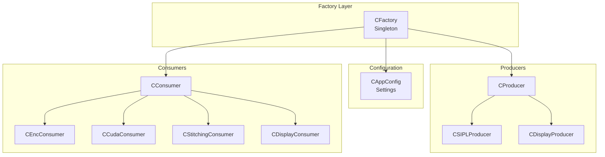
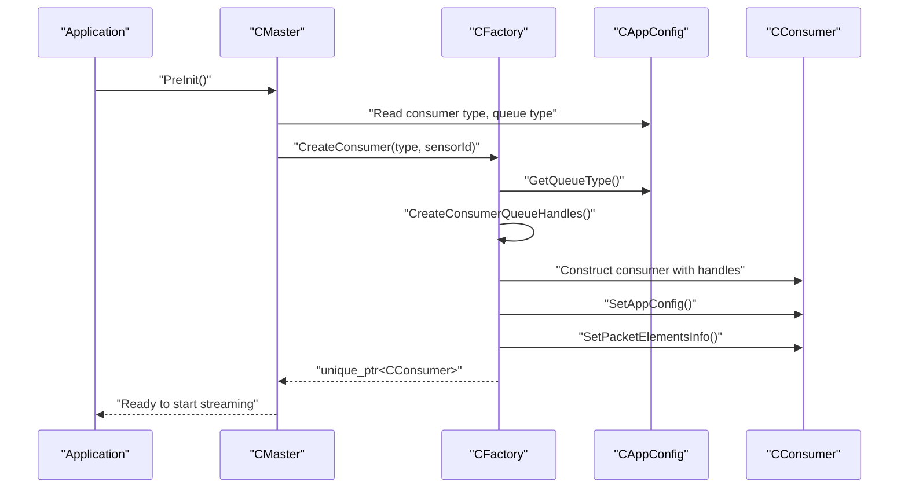
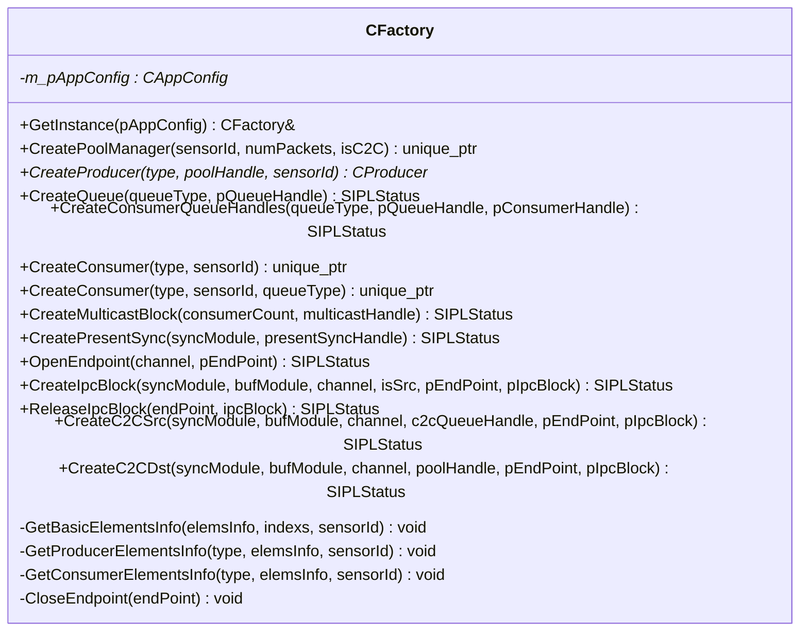
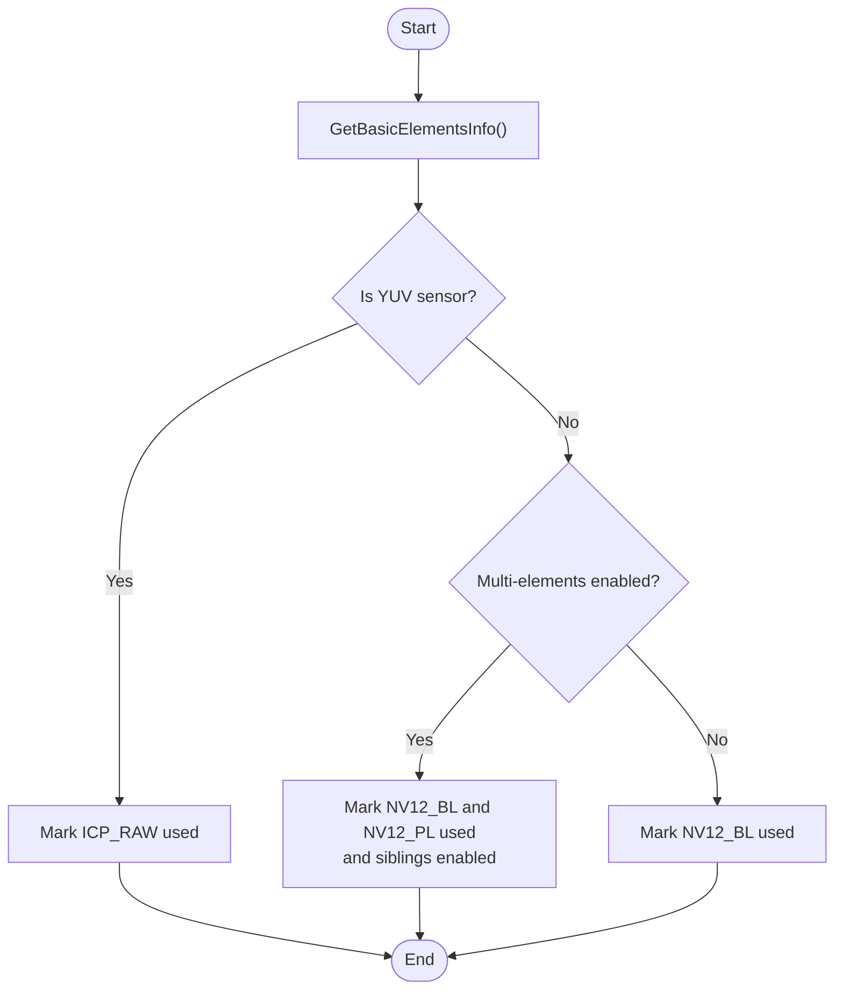
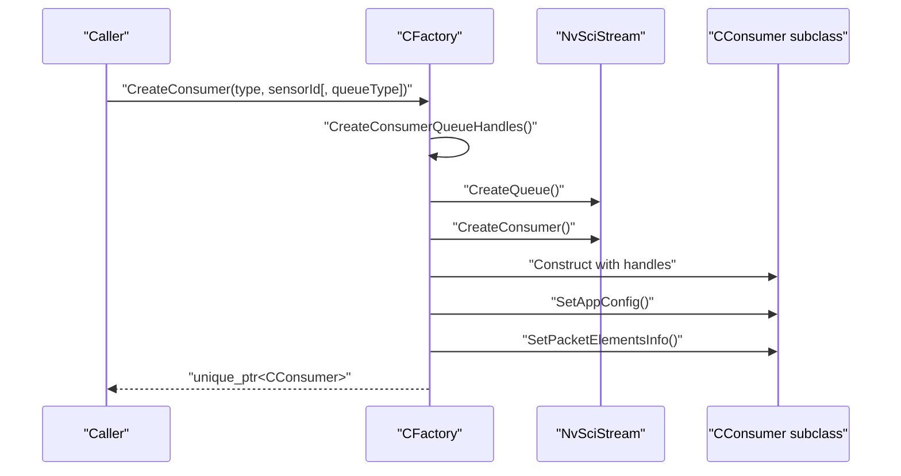
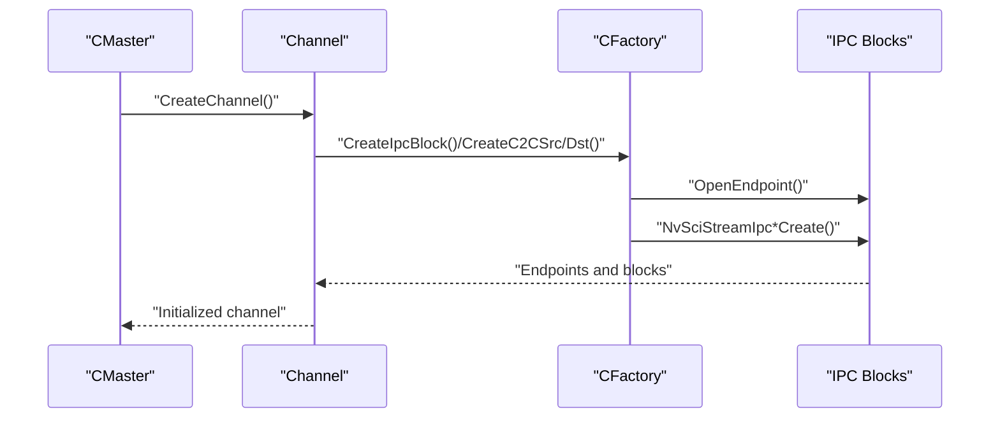
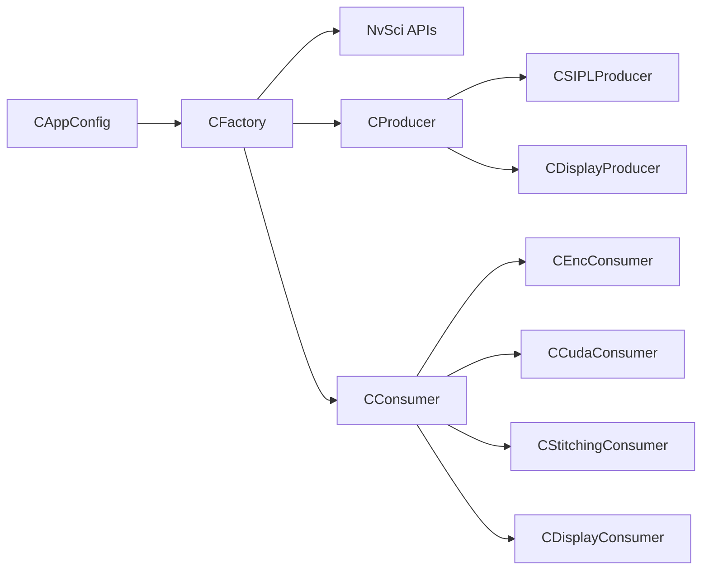

# Factory Pattern Implementation

<cite>
**Referenced Files in This Document**
- [CFactory.hpp](file://CFactory.hpp)
- [CFactory.cpp](file://CFactory.cpp)
- [CAppConfig.hpp](file://CAppConfig.hpp)
- [CAppConfig.cpp](file://CAppConfig.cpp)
- [Common.hpp](file://Common.hpp)
- [CConsumer.hpp](file://CConsumer.hpp)
- [CEncConsumer.hpp](file://CEncConsumer.hpp)
- [CCudaConsumer.hpp](file://CCudaConsumer.hpp)
- [CStitchingConsumer.hpp](file://CStitchingConsumer.hpp)
- [CDisplayConsumer.hpp](file://CDisplayConsumer.hpp)
- [CSIPLProducer.hpp](file://CSIPLProducer.hpp)
- [CDisplayProducer.hpp](file://CDisplayProducer.hpp)
- [CMaster.hpp](file://CMaster.hpp)
- [CMaster.cpp](file://CMaster.cpp)
- [CSingleProcessChannel.hpp](file://CSingleProcessChannel.hpp)
- [CIpcProducerChannel.hpp](file://CIpcProducerChannel.hpp)
- [main.cpp](file://main.cpp)
</cite>

## Table of Contents
1. [Introduction](#introduction)
2. [Project Structure](#project-structure)
3. [Core Components](#core-components)
4. [Architecture Overview](#architecture-overview)
5. [Detailed Component Analysis](#detailed-component-analysis)
6. [Dependency Analysis](#dependency-analysis)
7. [Performance Considerations](#performance-considerations)
8. [Troubleshooting Guide](#troubleshooting-guide)
9. [Conclusion](#conclusion)

## Introduction
This document explains the CFactory pattern implementation that enables dynamic consumer creation and resource management in the NVIDIA SIPL Multicast system. It covers the factory method design, consumer type registration, runtime consumer instantiation, and integration with CAppConfig for configuration-driven consumer selection and parameter management. It also documents the factory lifecycle, resource allocation strategies, cleanup procedures, consumer type mapping, parameter validation, error handling, and extensibility patterns for adding new consumer types.

## Project Structure
The factory resides in the multicast subsystem alongside producers, consumers, configuration, and orchestration components. The primary factory interface and implementation are in CFactory, while configuration is managed by CAppConfig. Consumers and producers are implemented as distinct classes with shared base interfaces.

**Diagram sources**
- [CFactory.hpp:27-92](file://CFactory.hpp#L27-L92)
- [CAppConfig.hpp:19-80](file://CAppConfig.hpp#L19-L80)
- [CConsumer.hpp:16-43](file://CConsumer.hpp#L16-L43)
- [CEncConsumer.hpp:17-64](file://CEncConsumer.hpp#L17-L64)
- [CCudaConsumer.hpp:25-78](file://CCudaConsumer.hpp#L25-L78)
- [CStitchingConsumer.hpp:17-72](file://CStitchingConsumer.hpp#L17-L72)
- [CDisplayConsumer.hpp:15-47](file://CDisplayConsumer.hpp#L15-L47)
- [CSIPLProducer.hpp:18-81](file://CSIPLProducer.hpp#L18-L81)
- [CDisplayProducer.hpp:18-126](file://CDisplayProducer.hpp#L18-L126)

**Section sources**
- [CFactory.hpp:1-95](file://CFactory.hpp#L1-L95)
- [CFactory.cpp:1-315](file://CFactory.cpp#L1-L315)
- [CAppConfig.hpp:1-83](file://CAppConfig.hpp#L1-L83)
- [CAppConfig.cpp:1-109](file://CAppConfig.cpp#L1-L109)
- [Common.hpp:35-84](file://Common.hpp#L35-L84)

## Core Components
- CFactory: Singleton factory responsible for creating producers, consumers, queues, pools, and IPC blocks. It centralizes resource allocation and integrates with CAppConfig for runtime decisions.
- CAppConfig: Encapsulates configuration flags and parameters (e.g., consumer type, queue type, sensor-specific settings) used by the factory.
- Consumer hierarchy: CConsumer base plus specialized consumers (encoder, CUDA, stitching, display).
- Producer hierarchy: CProducer base plus specialized producers (SIPL camera, display).
- Orchestration: CMaster coordinates initialization, stream lifecycle, and channel creation; it uses CFactory for resource creation.

Key responsibilities:
- Dynamic consumer creation via factory methods with overload resolution for queue type.
- Element mapping for packet elements based on sensor type and configuration flags.
- IPC and multicast block creation for inter-process and inter-chip scenarios.
- Cleanup routines for endpoints and blocks.

**Section sources**
- [CFactory.hpp:27-92](file://CFactory.hpp#L27-L92)
- [CFactory.cpp:11-315](file://CFactory.cpp#L11-L315)
- [CAppConfig.hpp:19-80](file://CAppConfig.hpp#L19-L80)
- [CAppConfig.cpp:21-108](file://CAppConfig.cpp#L21-L108)
- [CConsumer.hpp:16-43](file://CConsumer.hpp#L16-L43)
- [CMaster.hpp:47-92](file://CMaster.hpp#L47-L92)

## Architecture Overview
The factory sits at the center of the resource creation pipeline. It reads configuration from CAppConfig to decide:
- Which consumer type to instantiate.
- Whether to use FIFO or Mailbox queues.
- Which packet elements are used by producers/consumers.
- IPC channels and endpoints for inter-process communication.

**Diagram sources**
- [CMaster.cpp:164-182](file://CMaster.cpp#L164-L182)
- [CFactory.cpp:166-205](file://CFactory.cpp#L166-L205)
- [CAppConfig.hpp:32-33](file://CAppConfig.hpp#L32-L33)

## Detailed Component Analysis

### CFactory: Singleton Factory and Resource Manager
- Singleton access via GetInstance with CAppConfig injection.
- Producer creation:
  - Creates NvSciStream producer handle.
  - Instantiates CSIPLProducer or CDisplayProducer based on ProducerType.
  - Computes element usage via GetProducerElementsInfo and applies to producer.
- Consumer creation:
  - Overloads accept consumer type and optional queue type.
  - Builds queue and consumer handles via CreateConsumerQueueHandles.
  - Instantiates CEncConsumer, CCudaConsumer, CStitchingConsumer, or CDisplayConsumer.
  - Applies CAppConfig and element info mapping.
- Queue and multicast:
  - CreateQueue supports mailbox or FIFO.
  - CreateMulticastBlock and CreatePresentSync wrap NvSciStream APIs.
- IPC:
  - OpenEndpoint, CreateIpcBlock, CreateC2CSrc/Dst, ReleaseIpcBlock manage endpoints and blocks.
- Element mapping helpers:
  - GetBasicElementsInfo defines baseline elements.
  - GetProducerElementsInfo and GetConsumerElementsInfo compute usage per type and sensor.

**Diagram sources**
- [CFactory.hpp:27-92](file://CFactory.hpp#L27-L92)
- [CFactory.cpp:11-315](file://CFactory.cpp#L11-L315)

**Section sources**
- [CFactory.hpp:27-92](file://CFactory.hpp#L27-L92)
- [CFactory.cpp:11-315](file://CFactory.cpp#L11-L315)

### CAppConfig: Configuration-Driven Consumer Selection
- Provides getters for consumer type, queue type, and flags such as multi-element enablement, YUV sensor detection, and display modes.
- Supplies platform configuration and sensor resolution queries used by factory element mapping.

Integration points:
- CFactory::CreateConsumer delegates queue type selection to CAppConfig::GetQueueType().
- Element usage depends on IsYUVSensor and IsMultiElementsEnabled.

**Section sources**
- [CAppConfig.hpp:19-80](file://CAppConfig.hpp#L19-L80)
- [CAppConfig.cpp:21-108](file://CAppConfig.cpp#L21-L108)

### Consumer Type Mapping and Element Selection
The factory computes which packet elements are used by producers and consumers based on:
- Sensor type (YUV vs. raw Bayer).
- Multi-element enablement.
- Display-related flags (stitching vs. DPMST).

**Diagram sources**
- [CFactory.cpp:24-66](file://CFactory.cpp#L24-L66)
- [CFactory.cpp:96-136](file://CFactory.cpp#L96-L136)

**Section sources**
- [CFactory.cpp:24-136](file://CFactory.cpp#L24-L136)
- [Common.hpp:68-84](file://Common.hpp#L68-L84)

### Runtime Consumer Instantiation Workflows
- Single-parameter overload: Uses CAppConfig::GetQueueType() to choose queue type.
- Two-parameter overload: Explicit queue type selection.
- After handle creation, the consumer receives:
  - App config pointer for runtime decisions.
  - Packet element info for buffer composition.

**Diagram sources**
- [CFactory.cpp:166-205](file://CFactory.cpp#L166-L205)

**Section sources**
- [CFactory.cpp:166-205](file://CFactory.cpp#L166-L205)

### Integration with CMaster and Channels
- CMaster orchestrates initialization and uses CFactory for resource creation.
- Channels (single-process, IPC producer/consumer, C2C) call into CFactory for IPC blocks and late consumer attachment.

**Diagram sources**
- [CMaster.cpp:426-451](file://CMaster.cpp#L426-L451)
- [CIpcProducerChannel.hpp:301-332](file://CIpcProducerChannel.hpp#L301-L332)
- [CFactory.cpp:243-314](file://CFactory.cpp#L243-L314)

**Section sources**
- [CMaster.cpp:426-451](file://CMaster.cpp#L426-L451)
- [CIpcProducerChannel.hpp:301-332](file://CIpcProducerChannel.hpp#L301-L332)
- [CFactory.cpp:243-314](file://CFactory.cpp#L243-L314)

### Extensibility Patterns for New Consumer Types
To add a new consumer type:
1. Define a new ConsumerType value in the enumeration.
2. Add a new consumer class inheriting from CConsumer.
3. Extend CFactory::CreateConsumer to construct the new consumer.
4. Extend CFactory::GetConsumerElementsInfo to define element usage for the new type.
5. Optionally update CAppConfig getters or flags if the new consumer requires configuration switches.

Validation and error handling:
- Factory methods return null/status on NvSci failures, logging errors and propagating failure upstream.
- Element mapping validates sensor capabilities via CAppConfig (e.g., IsYUVSensor).

**Section sources**
- [Common.hpp:54-66](file://Common.hpp#L54-L66)
- [CFactory.cpp:166-205](file://CFactory.cpp#L166-L205)
- [CFactory.cpp:96-136](file://CFactory.cpp#L96-L136)

## Dependency Analysis
The factory depends on:
- CAppConfig for runtime decisions.
- NvSciStream/NvSciBuf/NvSciSync APIs for resource creation.
- Consumer and producer base classes for polymorphic construction.

**Diagram sources**
- [CFactory.hpp:12-22](file://CFactory.hpp#L12-L22)
- [CFactory.cpp:11-315](file://CFactory.cpp#L11-L315)
- [CAppConfig.hpp:19-80](file://CAppConfig.hpp#L19-L80)

**Section sources**
- [CFactory.hpp:12-22](file://CFactory.hpp#L12-L22)
- [CFactory.cpp:11-315](file://CFactory.cpp#L11-L315)

## Performance Considerations
- Queue selection: Mailbox queues can reduce latency but may increase CPU overhead; FIFO queues balance throughput and CPU usage.
- Element mapping: Limiting used elements reduces memory bandwidth and GPU/CPU processing load.
- IPC/C2C: Endpoint and block creation incur IPC initialization costs; reuse endpoints and blocks where possible.
- Cleanup: Always release IPC blocks and close endpoints to prevent resource leaks.

## Troubleshooting Guide
Common issues and resolutions:
- NvSciStreamProducerCreate/ConsumerCreate failures: Check queue creation and handle validity; log error codes.
- Invalid consumer type or queue type: Ensure CAppConfig values are valid before calling factory methods.
- Display consumer element mismatch: Verify IsDPMSTDisplayEnabled or IsStitchingDisplayEnabled flags and element mapping logic.
- IPC endpoint errors: Confirm channel names and endpoint lifecycle (open/close).

**Section sources**
- [CFactory.cpp:74-78](file://CFactory.cpp#L74-L78)
- [CFactory.cpp:157-163](file://CFactory.cpp#L157-L163)
- [CFactory.cpp:223-234](file://CFactory.cpp#L223-L234)
- [CFactory.cpp:250-262](file://CFactory.cpp#L250-L262)

## Conclusion
The CFactory pattern in the NVIDIA SIPL Multicast system provides a centralized, configuration-driven mechanism for creating producers and consumers, managing queues and IPC resources, and mapping packet elements based on sensor and configuration settings. Its singleton design, combined with CAppConfig integration, ensures flexible runtime selection and robust error handling. The architecture supports extensibility for new consumer types and clean resource lifecycle management across intra-process and inter-process scenarios.