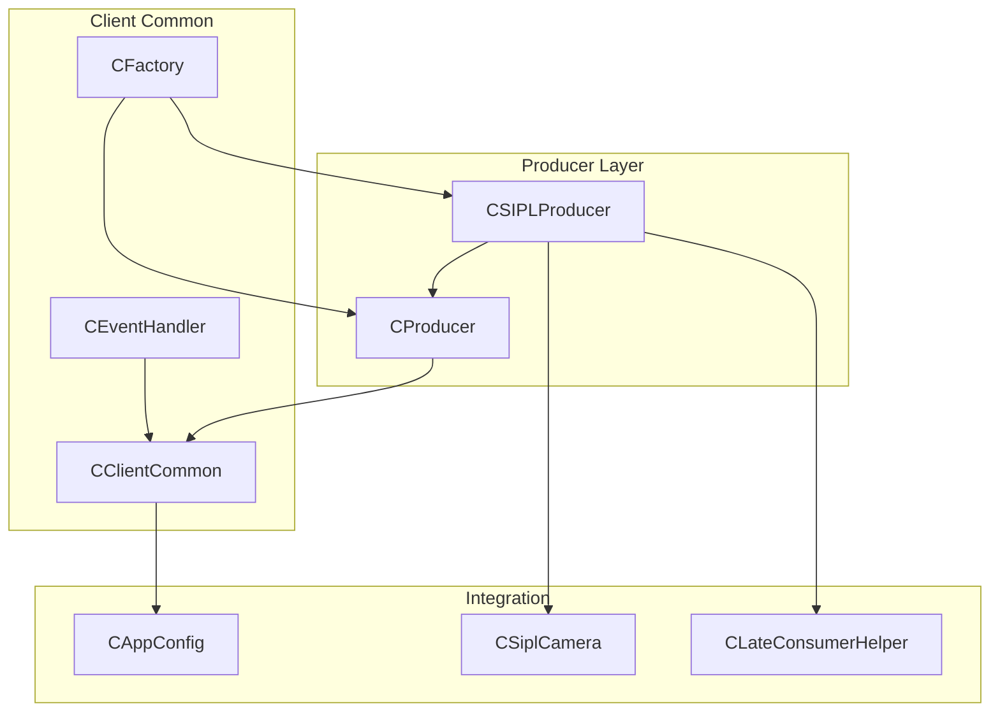
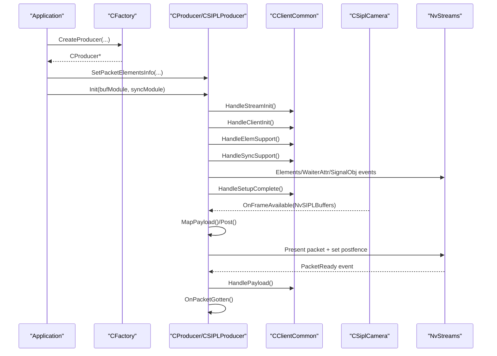
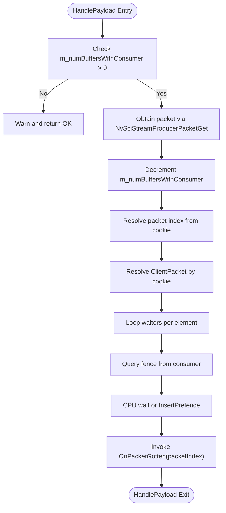
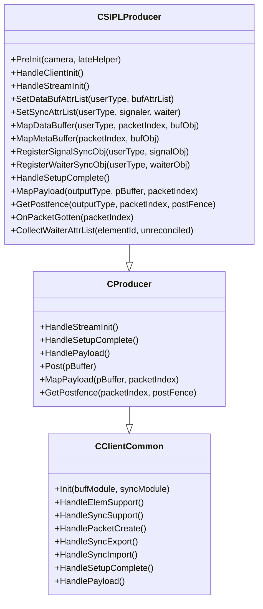
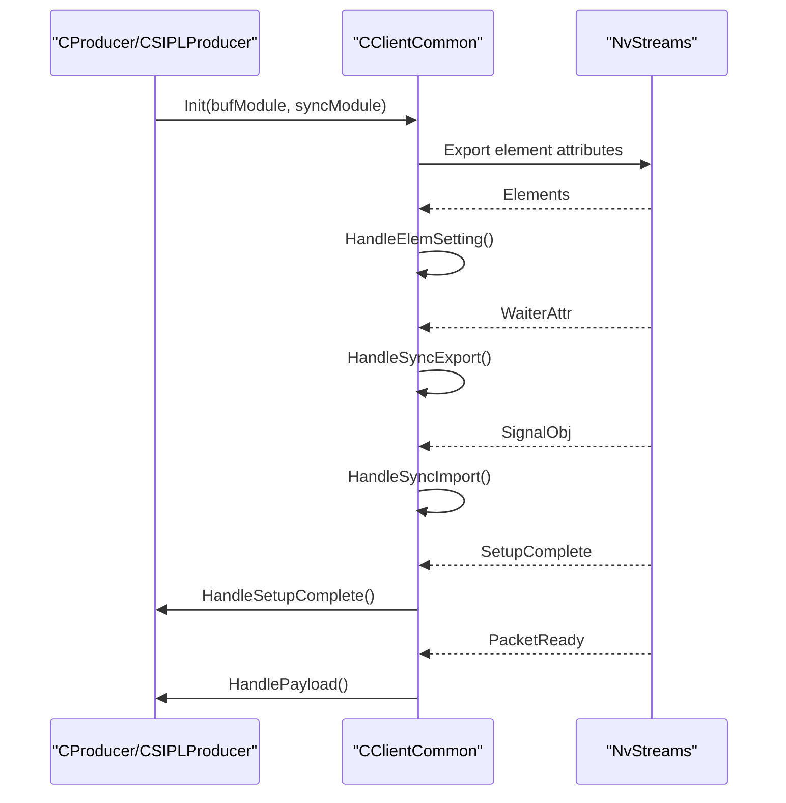
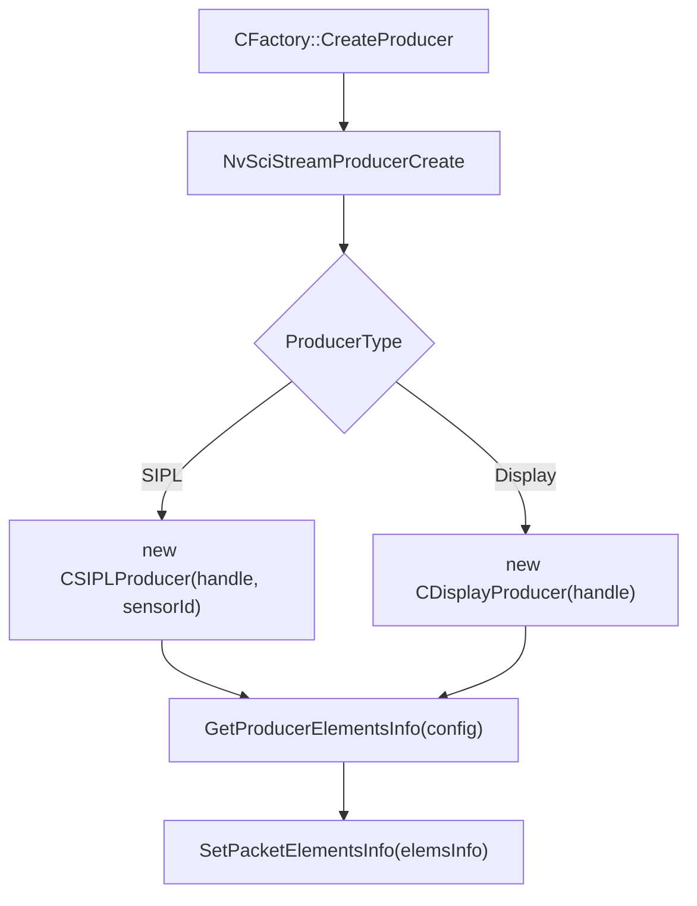
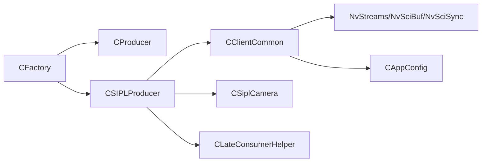

# Producer Framework

<cite>
**Referenced Files in This Document**
- [CProducer.hpp](file://CProducer.hpp)
- [CProducer.cpp](file://CProducer.cpp)
- [CSIPLProducer.hpp](file://CSIPLProducer.hpp)
- [CSIPLProducer.cpp](file://CSIPLProducer.cpp)
- [CClientCommon.hpp](file://CClientCommon.hpp)
- [CClientCommon.cpp](file://CClientCommon.cpp)
- [CEventHandler.hpp](file://CEventHandler.hpp)
- [Common.hpp](file://Common.hpp)
- [CFactory.hpp](file://CFactory.hpp)
- [CFactory.cpp](file://CFactory.cpp)
- [CUtils.hpp](file://CUtils.hpp)
- [CAppConfig.hpp](file://CAppConfig.hpp)
- [CSiplCamera.hpp](file://CSiplCamera.hpp)
- [CLateConsumerHelper.hpp](file://CLateConsumerHelper.hpp)
</cite>

## Table of Contents
1. [Introduction](#introduction)
2. [Project Structure](#project-structure)
3. [Core Components](#core-components)
4. [Architecture Overview](#architecture-overview)
5. [Detailed Component Analysis](#detailed-component-analysis)
6. [Dependency Analysis](#dependency-analysis)
7. [Performance Considerations](#performance-considerations)
8. [Troubleshooting Guide](#troubleshooting-guide)
9. [Conclusion](#conclusion)
10. [Appendices](#appendices)

## Introduction
This document explains the producer framework responsible for video frame distribution in the NVIDIA SIPL Multicast system. It focuses on the CProducer base class, the CSIPLProducer implementation for NvStreams integration, the CClientCommon base class for shared producer utilities and synchronization, and the initialization and lifecycle management of producers. It also covers configuration management, error handling strategies, and practical integration patterns with the camera system.

## Project Structure
The producer framework spans several core files:
- Base producer and client utilities: CProducer, CClientCommon, CEventHandler
- SIPL-specific producer: CSIPLProducer
- Factory and configuration: CFactory, CAppConfig
- Utilities and constants: Common, CUtils
- Camera integration: CSiplCamera
- Late consumer support: CLateConsumerHelper

**Diagram sources**
- [CProducer.hpp:16-51](file://CProducer.hpp#L16-L51)
- [CProducer.cpp:9-157](file://CProducer.cpp#L9-L157)
- [CSIPLProducer.hpp:18-81](file://CSIPLProducer.hpp#L18-L81)
- [CSIPLProducer.cpp:16-405](file://CSIPLProducer.cpp#L16-L405)
- [CClientCommon.hpp:47-200](file://CClientCommon.hpp#L47-L200)
- [CClientCommon.cpp:13-634](file://CClientCommon.cpp#L13-L634)
- [CEventHandler.hpp:23-51](file://CEventHandler.hpp#L23-L51)
- [CFactory.cpp:68-94](file://CFactory.cpp#L68-L94)
- [CSiplCamera.hpp:46-86](file://CSiplCamera.hpp#L46-L86)
- [CAppConfig.hpp:19-83](file://CAppConfig.hpp#L19-L83)
- [CLateConsumerHelper.hpp:15-37](file://CLateConsumerHelper.hpp#L15-L37)

**Section sources**
- [CProducer.hpp:16-51](file://CProducer.hpp#L16-L51)
- [CProducer.cpp:9-157](file://CProducer.cpp#L9-L157)
- [CSIPLProducer.hpp:18-81](file://CSIPLProducer.hpp#L18-L81)
- [CSIPLProducer.cpp:16-405](file://CSIPLProducer.cpp#L16-L405)
- [CClientCommon.hpp:47-200](file://CClientCommon.hpp#L47-L200)
- [CClientCommon.cpp:13-634](file://CClientCommon.cpp#L13-L634)
- [CEventHandler.hpp:23-51](file://CEventHandler.hpp#L23-L51)
- [CFactory.cpp:68-94](file://CFactory.cpp#L68-L94)
- [CSiplCamera.hpp:46-86](file://CSiplCamera.hpp#L46-L86)
- [CAppConfig.hpp:19-83](file://CAppConfig.hpp#L19-L83)
- [CLateConsumerHelper.hpp:15-37](file://CLateConsumerHelper.hpp#L15-L37)

## Core Components
- CProducer: Base class extending CClientCommon. Provides the core producer lifecycle, packet ownership handover, payload handling, and posting frames to the stream. It manages consumer counts, waits for PacketReady events, and coordinates pre/post fences.
- CSIPLProducer: NvStreams producer for NvSIPL camera outputs. Integrates with CSiplCamera, maps NvSIPL buffers to NvSciBuf objects, registers images/sync objects, and posts multi-element frames.
- CClientCommon: Shared producer/consumer utilities. Handles element attribute negotiation, buffer mapping, sync object reconciliation/import/export, packet creation, and event-driven lifecycle transitions.
- CEventHandler: Base class for event handling with a uniform interface for HandleEvents.
- CFactory: Creates producers, consumers, queues, multicast blocks, and manages element info wiring.
- CSiplCamera: Camera integration facade exposing frame completion queues and callbacks for producer-side frame delivery.
- CLateConsumerHelper: Supplies late-attach consumer attributes for sync reconciliation.

**Section sources**
- [CProducer.hpp:16-51](file://CProducer.hpp#L16-L51)
- [CProducer.cpp:17-151](file://CProducer.cpp#L17-L151)
- [CSIPLProducer.hpp:18-81](file://CSIPLProducer.hpp#L18-L81)
- [CSIPLProducer.cpp:16-405](file://CSIPLProducer.cpp#L16-L405)
- [CClientCommon.hpp:47-200](file://CClientCommon.hpp#L47-L200)
- [CClientCommon.cpp:95-634](file://CClientCommon.cpp#L95-L634)
- [CEventHandler.hpp:23-51](file://CEventHandler.hpp#L23-L51)
- [CFactory.cpp:68-94](file://CFactory.cpp#L68-L94)
- [CSiplCamera.hpp:46-86](file://CSiplCamera.hpp#L46-L86)
- [CLateConsumerHelper.hpp:15-37](file://CLateConsumerHelper.hpp#L15-L37)

## Architecture Overview
The producer framework orchestrates frame distribution via NvStreams:
- Producers create NvSciStream packets, map buffers, and present them to consumers.
- CSIPLProducer bridges NvSIPL camera outputs to NvStreams by mapping NvSIPL buffers to NvSciBuf objects and registering them with the camera.
- CClientCommon coordinates element attribute negotiation, sync object reconciliation/import/export, and packet lifecycle.
- CFactory wires element usage and creates producers with appropriate element info.

**Diagram sources**
- [CFactory.cpp:68-94](file://CFactory.cpp#L68-L94)
- [CProducer.cpp:17-151](file://CProducer.cpp#L17-L151)
- [CClientCommon.cpp:95-634](file://CClientCommon.cpp#L95-L634)
- [CSIPLProducer.cpp:367-405](file://CSIPLProducer.cpp#L367-L405)
- [CSiplCamera.hpp:49-57](file://CSiplCamera.hpp#L49-L57)

## Detailed Component Analysis

### CProducer Base Class
CProducer encapsulates the producer’s lifecycle and packet handling:
- Lifecycle
  - HandleStreamInit queries consumer count and sets wait sync object count.
  - HandleSetupComplete acquires initial ownership of packets upon receiving PacketReady events.
  - HandlePayload obtains a packet, waits on pre-fences from consumers, invokes OnPacketGotten, and updates buffer counters.
  - Post maps a user buffer to a packet, retrieves a post-fence, sets it on the packet, presents it, and increments buffer-with-consumer count.
- Synchronization
  - Manages m_numBuffersWithConsumer atomically and interacts with NvSciStream fences.
  - Provides default implementations for MapPayload and GetPostfence returning success, allowing derived classes to override.

**Diagram sources**
- [CProducer.cpp:56-121](file://CProducer.cpp#L56-L121)

**Section sources**
- [CProducer.hpp:16-51](file://CProducer.hpp#L16-L51)
- [CProducer.cpp:17-151](file://CProducer.cpp#L17-L151)

### CSIPLProducer Implementation
CSIPLProducer integrates with NvSIPL camera outputs:
- Initialization
  - PreInit binds the camera and optional late consumer helper.
  - HandleClientInit maps element types to camera output types.
  - HandleStreamInit adjusts wait sync object count for late consumers.
- Buffer and metadata mapping
  - SetDataBufAttrList and SetBufAttrList configure NvSciBuf attributes for ISP/ICP outputs, including CPU access and cache for non-ICP paths.
  - MapDataBuffer duplicates NvSciBuf objects and stores them per output type; MapMetaBuffer maps metadata CPU pointer.
- Sync object registration
  - SetSyncAttrList configures signaler/waiter attributes; CPU waiter attributes are set on non-QNX platforms.
  - RegisterSignalSyncObj registers EOF fences; RegisterWaiterSyncObj registers pre-sync objects during initialization.
- Frame posting
  - Post iterates over NvSIPLBuffers, maps each output to a packet, retrieves post-fences, sets element-specific post-fences, presents the packet, and updates counters.
  - OnPacketGotten releases per-output NvMedia buffers.
- Late consumer support
  - CollectWaiterAttrList augments unreconciled waiter attributes with late consumer attributes and reduces m_numWaitSyncObj accordingly.

**Diagram sources**
- [CClientCommon.hpp:47-200](file://CClientCommon.hpp#L47-L200)
- [CProducer.hpp:16-51](file://CProducer.hpp#L16-L51)
- [CSIPLProducer.hpp:18-81](file://CSIPLProducer.hpp#L18-L81)

**Section sources**
- [CSIPLProducer.hpp:18-81](file://CSIPLProducer.hpp#L18-L81)
- [CSIPLProducer.cpp:16-405](file://CSIPLProducer.cpp#L16-L405)

### CClientCommon Base Class and Shared Utilities
CClientCommon centralizes producer/consumer setup and packet lifecycle:
- Initialization sequence
  - Init calls HandleStreamInit, HandleClientInit, HandleElemSupport, HandleSyncSupport.
  - HandleElemSupport sets element attributes and exports them; HandleSyncSupport creates signaler/waiter attribute lists and optionally CPU wait context.
- Packet lifecycle
  - HandleElemSetting reconciles element attributes and marks import/export complete.
  - HandlePacketCreate allocates cookies, retrieves buffers, maps data/meta buffers, and sets packet status.
  - HandleSyncExport reconciles waiter attributes, allocates signal sync objects, registers them, and sets them per element (including siblings).
  - HandleSyncImport imports waiter sync objects from consumers and registers them.
- Event handling
  - HandleEvents processes NvSciStream events: Elements, PacketCreate, PacketsComplete, WaiterAttr, SignalObj, SetupComplete, PacketReady, Error, Disconnected.
- Utilities
  - Cookie-to-index mapping, packet lookup, element ID resolution, and CPU sync attribute helpers.

**Diagram sources**
- [CClientCommon.cpp:95-634](file://CClientCommon.cpp#L95-L634)

**Section sources**
- [CClientCommon.hpp:47-200](file://CClientCommon.hpp#L47-L200)
- [CClientCommon.cpp:95-634](file://CClientCommon.cpp#L95-L634)

### Producer Initialization and Configuration Management
- Factory-driven creation
  - CFactory::CreateProducer creates a producer handle, instantiates CSIPLProducer or CDisplayProducer, computes element usage based on configuration, and sets element info on the producer.
  - Element info includes usage flags and sibling relationships for shared sync objects.
- Configuration-driven behavior
  - CAppConfig controls multi-element enablement, YUV sensor detection, queue type, and late-attach enablement.
  - CLateConsumerHelper supplies late consumer attributes for sync reconciliation and adjusts wait sync object counts.

**Diagram sources**
- [CFactory.cpp:68-94](file://CFactory.cpp#L68-L94)
- [CAppConfig.hpp:19-83](file://CAppConfig.hpp#L19-L83)
- [CLateConsumerHelper.hpp:15-37](file://CLateConsumerHelper.hpp#L15-L37)

**Section sources**
- [CFactory.cpp:68-94](file://CFactory.cpp#L68-L94)
- [CAppConfig.hpp:19-83](file://CAppConfig.hpp#L19-L83)
- [CLateConsumerHelper.hpp:15-37](file://CLateConsumerHelper.hpp#L15-L37)

### Frame Distribution Mechanisms and Multi-Element Processing
- Multi-element mapping
  - CSIPLProducer maintains per-output buffers and maps NvSIPL buffers to NvSciBuf objects, storing duplicates for packet mapping.
  - Metadata is mapped to CPU-accessible pointers for timestamp embedding.
- Posting pipeline
  - Post iterates NvSIPLBuffers, resolves element IDs, retrieves post-fences per element, sets them on the packet, and presents it.
  - OnPacketGotten releases per-output NvMedia buffers to avoid leaks.
- Late consumer coordination
  - CollectWaiterAttrList augments unreconciled waiter attributes with late consumer attributes and reduces m_numWaitSyncObj to exclude late consumers from pre-fence queries.

**Section sources**
- [CSIPLProducer.cpp:254-405](file://CSIPLProducer.cpp#L254-L405)
- [CClientCommon.cpp:469-591](file://CClientCommon.cpp#L469-L591)

### Synchronization Primitives and Producer-Consumer Coordination
- Fence handling
  - Pre-fences: Producer queries fences from consumers for each element and either CPU-waits or inserts them into NvSIPL buffers.
  - Post-fences: CSIPLProducer retrieves EOF fences from NvSIPL buffers and sets them per element on the packet.
- Sync object reconciliation
  - HandleSyncExport reconciles waiter attributes (including CPU waiter), allocates signal sync objects, and sets them per element, handling sibling sharing.
  - HandleSyncImport imports waiter sync objects and registers them.
- CPU waiting
  - HasCpuWait enables CPU waiter attributes and a CPU wait context on non-QNX platforms.

**Section sources**
- [CProducer.cpp:56-121](file://CProducer.cpp#L56-L121)
- [CClientCommon.cpp:469-591](file://CClientCommon.cpp#L469-L591)
- [CSIPLProducer.cpp:76-105](file://CSIPLProducer.cpp#L76-L105)

## Dependency Analysis
The producer framework exhibits clear separation of concerns:
- CClientCommon depends on NvStreams APIs for element/sync management and packet lifecycle.
- CSIPLProducer depends on CSiplCamera for frame delivery and buffer mapping.
- CFactory constructs producers and wires element usage based on configuration.
- CLateConsumerHelper augments sync reconciliation for late consumers.

**Diagram sources**
- [CFactory.cpp:68-94](file://CFactory.cpp#L68-L94)
- [CProducer.hpp:16-51](file://CProducer.hpp#L16-L51)
- [CSIPLProducer.hpp:18-81](file://CSIPLProducer.hpp#L18-L81)
- [CClientCommon.hpp:47-200](file://CClientCommon.hpp#L47-L200)
- [CSiplCamera.hpp:46-86](file://CSiplCamera.hpp#L46-L86)
- [CLateConsumerHelper.hpp:15-37](file://CLateConsumerHelper.hpp#L15-L37)
- [CAppConfig.hpp:19-83](file://CAppConfig.hpp#L19-L83)

**Section sources**
- [CFactory.cpp:68-94](file://CFactory.cpp#L68-L94)
- [CProducer.hpp:16-51](file://CProducer.hpp#L16-L51)
- [CSIPLProducer.hpp:18-81](file://CSIPLProducer.hpp#L18-L81)
- [CClientCommon.hpp:47-200](file://CClientCommon.hpp#L47-L200)
- [CSiplCamera.hpp:46-86](file://CSiplCamera.hpp#L46-L86)
- [CLateConsumerHelper.hpp:15-37](file://CLateConsumerHelper.hpp#L15-L37)
- [CAppConfig.hpp:19-83](file://CAppConfig.hpp#L19-L83)

## Performance Considerations
- Buffer management
  - Use NvSciBufObjDup to maintain independent references per packet; ensure proper cleanup in destructor.
  - Enable CPU access and cache for non-ICP outputs to reduce host-side processing overhead when needed.
- Fence handling
  - Prefer inserting pre-fences into NvSIPL buffers over CPU waits when feasible to minimize latency.
  - CPU waits are used as a workaround for ISP sync registration issues; avoid unnecessary waits.
- Packet lifecycle
  - Minimize packet creation/destruction churn; reuse buffers and metadata pointers where possible.
  - Ensure timely Present calls to prevent backpressure buildup.
- Multi-element coordination
  - Share signal sync objects for sibling elements to reduce sync object allocation overhead.
- Late consumers
  - Adjust m_numWaitSyncObj to exclude late consumers from pre-fence queries to avoid blocking.

[No sources needed since this section provides general guidance]

## Troubleshooting Guide
- Event handling errors
  - HandleEvents logs unknown events and error/disconnect events; inspect logs for NvSciStreamEventType_Error and Disconnected.
- Initialization failures
  - HandleElemSupport/SetDataBufAttrList failures indicate mismatched element attributes; verify element info and image attributes from camera.
  - HandleSyncSupport failures suggest missing or incompatible waiter attributes; confirm SetSyncAttrList and CPU waiter setup.
- Packet creation issues
  - Exceeding MAX_NUM_PACKETS triggers overflow status; increase capacity or reduce parallelism.
  - Buffer retrieval failures imply pool misconfiguration; check NvSciStreamBlock setup.
- Fence and sync problems
  - Empty or cleared fences are handled gracefully; ensure NvSIPL buffers expose valid EOF fences.
  - Pre-fence wait failures require CPU fallback or reconfiguration of waiter attributes.
- Late consumer mismatches
  - Mismatched unreconciled attributes or incorrect wait sync object counts can stall setup; validate CLateConsumerHelper usage.

**Section sources**
- [CClientCommon.cpp:119-205](file://CClientCommon.cpp#L119-L205)
- [CClientCommon.cpp:300-408](file://CClientCommon.cpp#L300-L408)
- [CClientCommon.cpp:469-591](file://CClientCommon.cpp#L469-L591)
- [CProducer.cpp:56-121](file://CProducer.cpp#L56-L121)

## Conclusion
The producer framework provides a robust, extensible foundation for distributing video frames across NvStreams. CProducer defines the core lifecycle and packet coordination, CSIPLProducer integrates tightly with NvSIPL camera outputs, and CClientCommon unifies element/sync management and event handling. With factory-driven configuration and late consumer support, the framework supports flexible deployment scenarios while maintaining strong error handling and performance characteristics.

[No sources needed since this section summarizes without analyzing specific files]

## Appendices

### Producer Instantiation and Integration Examples
- Instantiate a producer via factory:
  - Create producer handle, construct CSIPLProducer or CDisplayProducer, compute element info from configuration, and set element info on the producer.
- Integrate with camera:
  - Bind camera via PreInit and rely on CSiplCamera’s frame completion queues to deliver NvSIPLBuffers to Post.
- Configure elements:
  - Use CFactory to derive element usage from CAppConfig, enabling multi-element outputs and sibling sharing.

**Section sources**
- [CFactory.cpp:68-94](file://CFactory.cpp#L68-L94)
- [CSIPLProducer.cpp:36-40](file://CSIPLProducer.cpp#L36-L40)
- [CSiplCamera.hpp:522-618](file://CSiplCamera.hpp#L522-L618)

### Constants and Types
- Element types and limits are defined in Common.hpp, including maximum sensors, outputs, packets, elements, and timeouts.

**Section sources**
- [Common.hpp:14-87](file://Common.hpp#L14-L87)