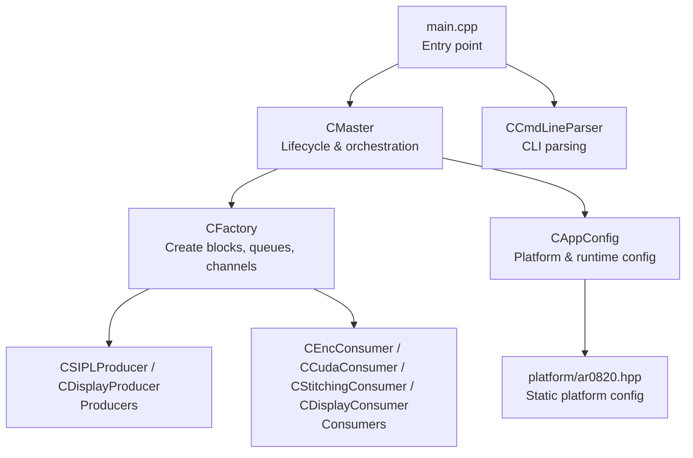
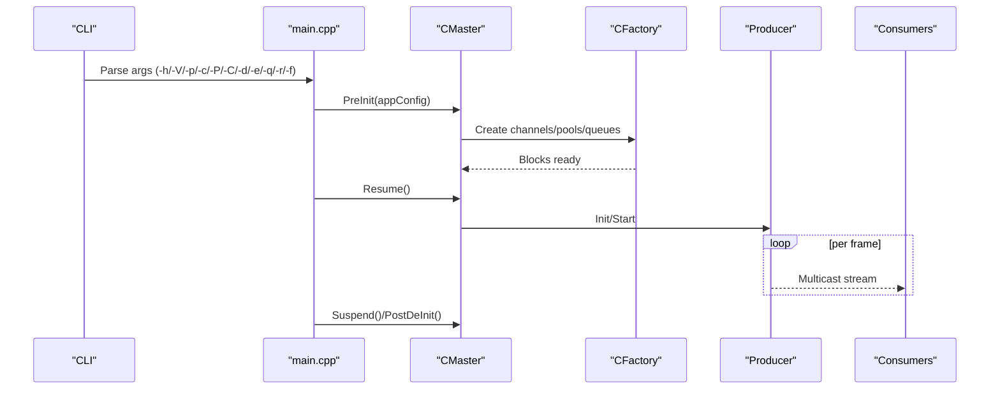
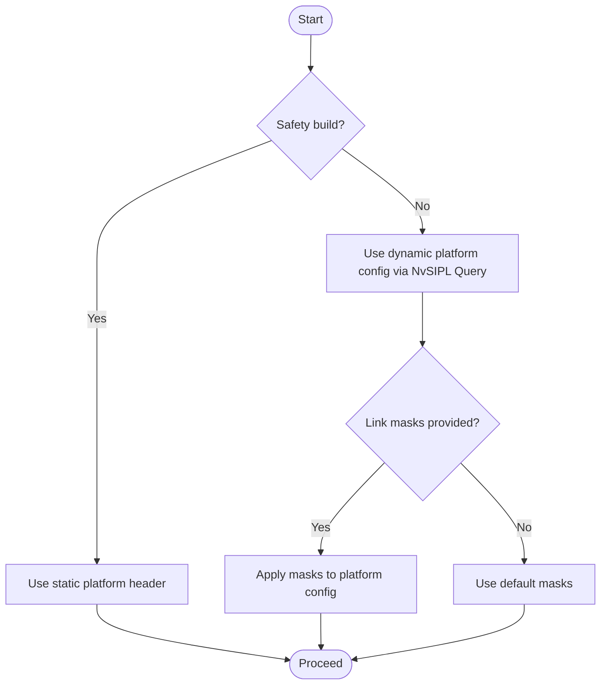
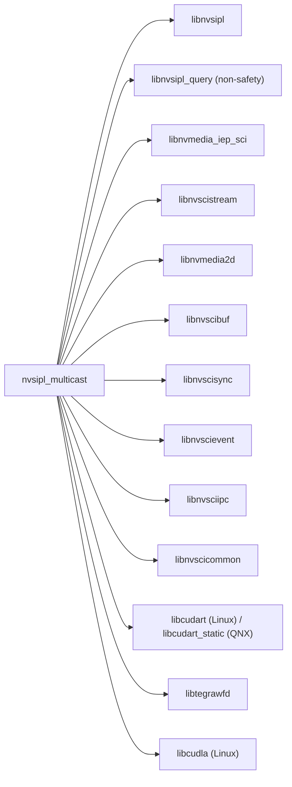

# Deployment Guide

<cite>
**Referenced Files in This Document**
- [README.md](file://README.md)
- [ReleaseNote.md](file://ReleaseNote.md)
- [main.cpp](file://main.cpp)
- [Makefile](file://Makefile)
- [Common.hpp](file://Common.hpp)
- [CAppConfig.hpp](file://CAppConfig.hpp)
- [CAppConfig.cpp](file://CAppConfig.cpp)
- [CCmdLineParser.hpp](file://CCmdLineParser.hpp)
- [CCmdLineParser.cpp](file://CCmdLineParser.cpp)
- [CMaster.hpp](file://CMaster.hpp)
- [CMaster.cpp](file://CMaster.cpp)
- [CFactory.hpp](file://CFactory.hpp)
- [CFactory.cpp](file://CFactory.cpp)
- [platform/ar0820.hpp](file://platform/ar0820.hpp)
</cite>

## Table of Contents
1. [Introduction](#introduction)
2. [Project Structure](#project-structure)
3. [Core Components](#core-components)
4. [Architecture Overview](#architecture-overview)
5. [Detailed Component Analysis](#detailed-component-analysis)
6. [Dependency Analysis](#dependency-analysis)
7. [Performance Considerations](#performance-considerations)
8. [Troubleshooting Guide](#troubleshooting-guide)
9. [Conclusion](#conclusion)
10. [Appendices](#appendices)

## Introduction
This guide provides end-to-end deployment instructions for the NVIDIA SIPL Multicast system. It covers system requirements, installation, environment configuration, deployment scenarios (single process, inter-process, inter-chip), verification, performance benchmarking, troubleshooting, production best practices, security, monitoring, containerization, packaging, upgrades/rollbacks, and validation checklists.

## Project Structure
The multicast sample demonstrates producer/consumer pipelines using NvStreams and SIPL APIs. Key areas:
- Application entrypoint and lifecycle management
- Command-line configuration and platform selection
- Stream orchestration and channel creation
- Factory for creating producers, consumers, queues, and IPC/C2C blocks
- Platform configuration headers for supported sensors and boards

**Diagram sources**
- [main.cpp:253-304](file://main.cpp#L253-L304)
- [CMaster.hpp:47-95](file://CMaster.hpp#L47-L95)
- [CMaster.cpp:164-182](file://CMaster.cpp#L164-L182)
- [CFactory.hpp:27-95](file://CFactory.hpp#L27-L95)
- [CAppConfig.hpp:19-83](file://CAppConfig.hpp#L19-L83)
- [platform/ar0820.hpp:14-186](file://platform/ar0820.hpp#L14-L186)
- [CCmdLineParser.hpp:34-47](file://CCmdLineParser.hpp#L34-L47)

**Section sources**
- [README.md:11-109](file://README.md#L11-L109)
- [main.cpp:253-304](file://main.cpp#L253-L304)
- [CMaster.cpp:164-182](file://CMaster.cpp#L164-L182)
- [CAppConfig.cpp:21-75](file://CAppConfig.cpp#L21-L75)
- [platform/ar0820.hpp:14-186](file://platform/ar0820.hpp#L14-L186)
- [CCmdLineParser.cpp:13-208](file://CCmdLineParser.cpp#L13-L208)

## Core Components
- Application lifecycle and control:
  - Signal handling, input events, suspend/resume, and runtime control
- Configuration and platform selection:
  - Dynamic and static platform configuration selection
  - Verbosity, queue type, frame filtering, run duration, and display modes
- Stream orchestration:
  - NvSciBuf/NvSciSync initialization, channel creation, and lifecycle
- Factory:
  - Creation of pools, queues, multicast blocks, and IPC/C2C endpoints

Key responsibilities and integration points are documented in the sections below.

**Section sources**
- [main.cpp:37-153](file://main.cpp#L37-L153)
- [CAppConfig.hpp:19-83](file://CAppConfig.hpp#L19-L83)
- [CAppConfig.cpp:21-75](file://CAppConfig.cpp#L21-L75)
- [CMaster.cpp:50-122](file://CMaster.cpp#L50-L122)
- [CFactory.cpp:11-22](file://CFactory.cpp#L11-L22)

## Architecture Overview
The system supports three deployment modes:
- Single process: producer and consumers coexist in one process
- Inter-process (P2P): producer and consumers run in separate processes
- Inter-chip (C2C): producer and consumers span chips via C2C channels

**Diagram sources**
- [main.cpp:253-304](file://main.cpp#L253-L304)
- [CMaster.cpp:164-216](file://CMaster.cpp#L164-L216)
- [CFactory.cpp:68-94](file://CFactory.cpp#L68-L94)
- [CCmdLineParser.cpp:13-208](file://CCmdLineParser.cpp#L13-L208)

## Detailed Component Analysis

### System Requirements and Dependencies
- NVIDIA platform and driver OS:
  - The sample targets NVIDIA Driver OS environments and integrates with NvSIPL/NvMedia stack
- CUDA runtime:
  - CUDA runtime linked statically on QNX; dynamically on Linux
- Libraries and SDKs:
  - NvSIPL, NvSIPL Query (non-safety), NvMedia IEP/SCI, NvSciBuf, NvSciSync, NvSciEvent, NvSciIPC, NvSciStream, NvMedia2D, OpenWFD/Tegra WFD
- Optional:
  - cuDLA/cuda kernels for car detection (Linux only)

Build-time and runtime linkage is defined in the Makefile and platform-specific flags.

**Section sources**
- [Makefile:44-67](file://Makefile#L44-L67)
- [Makefile:68-82](file://Makefile#L68-L82)
- [Makefile:95-104](file://Makefile#L95-L104)

### Environment Configuration and Permissions
- Runtime permissions:
  - Access to CSI lanes, serializers/deserializers, and I2C devices for camera modules
  - Permissions for NvSciBuf/NvSciSync channels and IPC endpoints
- Linux-specific:
  - Optional power manager service socket path for suspend/resume control
- QNX-specific:
  - Static CUDA runtime linking and socket library linkage

**Section sources**
- [main.cpp:176-251](file://main.cpp#L176-L251)
- [Makefile:58-67](file://Makefile#L58-L67)

### Installation Procedures

#### Build and Link
- Use the provided Makefile to compile the sample binary and optional power manager service on Linux
- Ensure environment variables for platform SDK/toolkit paths are set (referenced by NV_PLATFORM_* macros)

**Section sources**
- [Makefile:9-17](file://Makefile#L9-L17)
- [Makefile:92-98](file://Makefile#L92-L98)

#### Single Process Deployment
- Launch the single-process pipeline with defaults or selected options (e.g., dump to file, frame filter, run duration)
- Use the help/version options to discover capabilities

**Section sources**
- [README.md:21-46](file://README.md#L21-L46)
- [CCmdLineParser.cpp:238-279](file://CCmdLineParser.cpp#L238-L279)

#### Inter-Process (P2P) Deployment
- Start producer and consumers in separate processes
- Ensure platform configuration consistency across processes
- Optional: enable multi-element ISP outputs and late-/re-attach

**Section sources**
- [README.md:47-92](file://README.md#L47-L92)
- [CCmdLineParser.cpp:100-116](file://CCmdLineParser.cpp#L100-L116)

#### Inter-Chip (C2C) Deployment
- Use C2C channel naming conventions for source and destination channels
- Start producer and consumers on respective chips

**Section sources**
- [README.md:67-79](file://README.md#L67-L79)

### Configuration and Platform Selection
- Static platform configuration:
  - Select among supported platform headers (e.g., AR0820, IMX variants, TPG YUV)
- Dynamic platform configuration:
  - Query platform database and apply link masks (non-safety builds)

**Diagram sources**
- [CAppConfig.cpp:21-75](file://CAppConfig.cpp#L21-L75)
- [CCmdLineParser.cpp:67-79](file://CCmdLineParser.cpp#L67-L79)

**Section sources**
- [CAppConfig.cpp:21-75](file://CAppConfig.cpp#L21-L75)
- [CCmdLineParser.cpp:13-208](file://CCmdLineParser.cpp#L13-L208)
- [platform/ar0820.hpp:14-186](file://platform/ar0820.hpp#L14-L186)

### Runtime Control and Monitoring
- Suspend/Resume via CLI or socket events
- Frame-rate monitoring and periodic reporting
- Optional run-for duration to auto-stop

**Section sources**
- [main.cpp:74-153](file://main.cpp#L74-L153)
- [main.cpp:155-251](file://main.cpp#L155-L251)
- [CMaster.cpp:354-403](file://CMaster.cpp#L354-L403)

### Late-/Re-attach (Linux/QNX Standard OS)
- Producer starts with early consumers, later late-attach additional consumers
- Supports re-attach and detach commands

**Section sources**
- [README.md:80-92](file://README.md#L80-L92)
- [CMaster.cpp:473-513](file://CMaster.cpp#L473-L513)

### Display and Multi-Element Pipeline
- Enable stitching and/or DP-MST display
- Multi-element pipeline to carry ISP0/ISP1 outputs to different consumers

**Section sources**
- [README.md:38-46](file://README.md#L38-L46)
- [CFactory.cpp:24-66](file://CFactory.cpp#L24-L66)
- [CFactory.cpp:96-136](file://CFactory.cpp#L96-L136)

### Car Detection (cuDLA) Workflow
- Demonstrates cuDLA inference pipeline from raw NV12 to detections
- Requires TRT engine generation with appropriate IO formats

**Section sources**
- [README.md:93-109](file://README.md#L93-L109)

## Dependency Analysis
The application depends on NVIDIA media and stream libraries, with platform-specific linking and optional power management service.

**Diagram sources**
- [Makefile:44-67](file://Makefile#L44-L67)
- [Makefile:68-82](file://Makefile#L68-L82)

**Section sources**
- [Makefile:44-67](file://Makefile#L44-L67)
- [Makefile:68-82](file://Makefile#L68-L82)

## Performance Considerations
- Frame-rate monitoring is integrated; use the monitor thread output to assess throughput
- Adjust frame filter to reduce processing load
- Choose FIFO vs mailbox queues based on latency/throughput needs
- Limit display stitching to manageable camera counts to avoid performance degradation

**Section sources**
- [CMaster.cpp:354-403](file://CMaster.cpp#L354-L403)
- [CCmdLineParser.cpp:269-271](file://CCmdLineParser.cpp#L269-L271)
- [README.md:38-40](file://README.md#L38-L40)

## Troubleshooting Guide
- Platform configuration mismatch:
  - Ensure consistent platform config across producer and consumers in P2P/C2C
- Dynamic config and masks:
  - Dynamic config and link masks must be provided together
- Invalid arguments:
  - Frame filter range, consumer count/index, queue type
- Power management:
  - Verify socket endpoint connectivity for suspend/resume on Linux
- Display failures:
  - Confirm correct element selection for display consumers

**Section sources**
- [CCmdLineParser.cpp:184-207](file://CCmdLineParser.cpp#L184-L207)
- [CCmdLineParser.cpp:238-279](file://CCmdLineParser.cpp#L238-L279)
- [main.cpp:176-251](file://main.cpp#L176-L251)
- [CFactory.cpp:138-151](file://CFactory.cpp#L138-L151)

## Conclusion
This guide outlined deployment of the NVIDIA SIPL Multicast system across single-process, inter-process, and inter-chip scenarios. It covered requirements, build/linking, configuration, runtime controls, verification, performance tuning, and troubleshooting. Production deployments should emphasize consistent platform configuration, robust monitoring, and adherence to the provided checklists.

## Appendices

### A. System Requirements Checklist
- NVIDIA Driver OS environment
- Supported platform headers present
- Required libraries installed and linked
- Permissions for CSI/I2C and NvSci channels
- Optional: cuDLA toolchain for inference

**Section sources**
- [Makefile:44-67](file://Makefile#L44-L67)
- [platform/ar0820.hpp:14-186](file://platform/ar0820.hpp#L14-L186)

### B. Installation Steps Summary
- Build: use provided Makefile
- Linux: optionally build power manager service
- QNX: ensure static CUDA runtime availability

**Section sources**
- [Makefile:92-104](file://Makefile#L92-L104)

### C. Deployment Scenarios Quick Reference
- Single process: run the binary directly
- P2P: start producer and consumers separately with consistent platform config
- C2C: use C2C channel naming and ensure chip connectivity

**Section sources**
- [README.md:21-79](file://README.md#L21-L79)

### D. Verification and Benchmarking
- Use monitor thread output for FPS metrics
- Validate file dumps and encoder outputs when enabled
- Compare against baseline configurations

**Section sources**
- [CMaster.cpp:354-403](file://CMaster.cpp#L354-L403)
- [CCmdLineParser.cpp:269-271](file://CCmdLineParser.cpp#L269-L271)

### E. Security and Monitoring
- Restrict platform configuration exposure
- Monitor pipeline/device block notifications
- Use logging verbosity appropriately

**Section sources**
- [CMaster.cpp:382-400](file://CMaster.cpp#L382-L400)
- [CCmdLineParser.cpp:250-258](file://CCmdLineParser.cpp#L250-L258)

### F. Containerization and Packaging
- Package the binary and required shared libraries
- Include platform configuration headers if using static configs
- Provide environment variables for SDK paths during build

**Section sources**
- [Makefile:9-17](file://Makefile#L9-L17)

### G. Upgrade and Rollback Procedures
- Review release notes for breaking changes and fixes
- Maintain backward-compatible platform configurations
- Keep previous binaries for rollback

**Section sources**
- [ReleaseNote.md:11-118](file://ReleaseNote.md#L11-L118)

### H. Validation Checklists
- Pre-deployment
  - Confirm platform config matches hardware
  - Verify library versions and CUDA runtime
- Post-deployment
  - Check FPS stability and frame drops
  - Validate display stitching and encoder outputs
  - Confirm suspend/resume and late-attach if used

**Section sources**
- [README.md:21-92](file://README.md#L21-L92)
- [CMaster.cpp:354-403](file://CMaster.cpp#L354-L403)