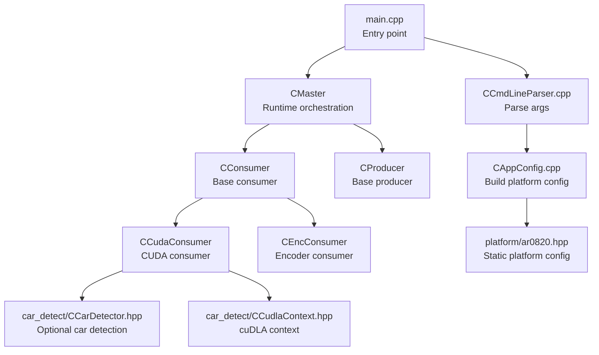
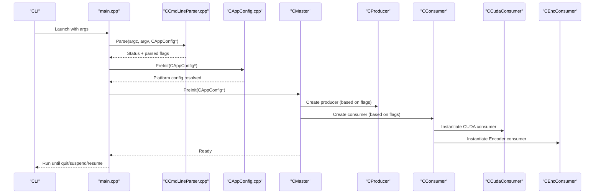
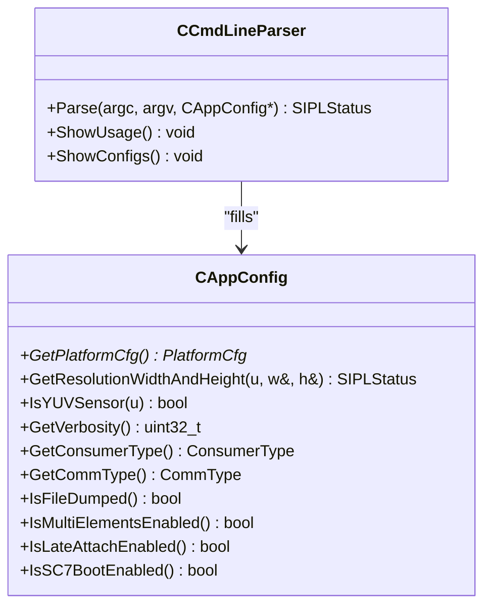
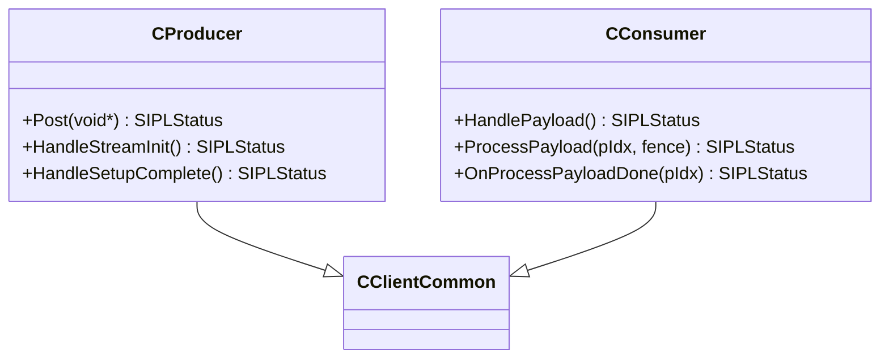
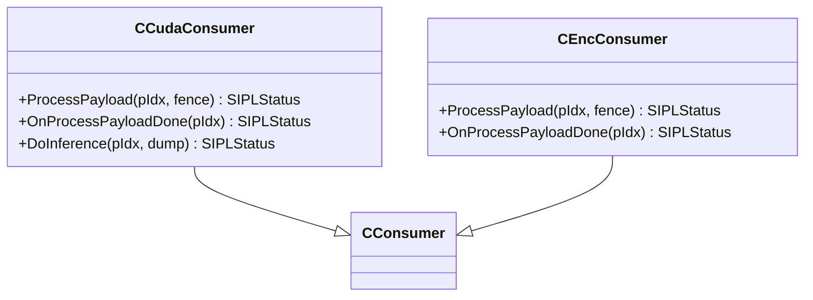
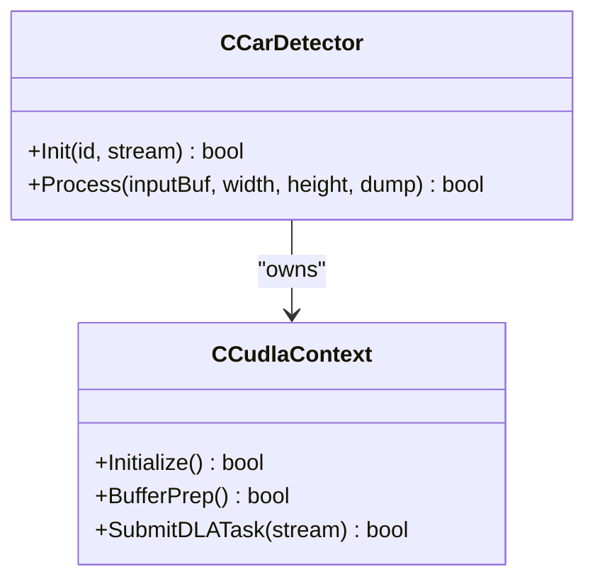
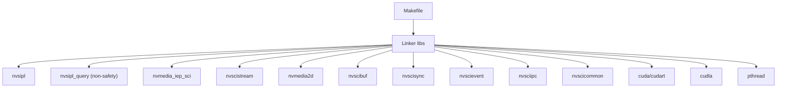

# Getting Started

<cite>
**Referenced Files in This Document**
- [README.md](file://README.md)
- [Makefile](file://Makefile)
- [main.cpp](file://main.cpp)
- [CCmdLineParser.cpp](file://CCmdLineParser.cpp)
- [CCmdLineParser.hpp](file://CCmdLineParser.hpp)
- [CAppConfig.cpp](file://CAppConfig.cpp)
- [CAppConfig.hpp](file://CAppConfig.hpp)
- [Common.hpp](file://Common.hpp)
- [CProducer.hpp](file://CProducer.hpp)
- [CConsumer.hpp](file://CConsumer.hpp)
- [CCudaConsumer.hpp](file://CCudaConsumer.hpp)
- [CEncConsumer.hpp](file://CEncConsumer.hpp)
- [car_detect/CCarDetector.hpp](file://car_detect/CCarDetector.hpp)
- [car_detect/CCudlaContext.hpp](file://car_detect/CCudlaContext.hpp)
- [platform/ar0820.hpp](file://platform/ar0820.hpp)
- [ReleaseNote.md](file://ReleaseNote.md)
</cite>

## Table of Contents
1. [Introduction](#introduction)
2. [Project Structure](#project-structure)
3. [Prerequisites](#prerequisites)
4. [Installation](#installation)
5. [Basic Usage](#basic-usage)
6. [Command-Line Reference](#command-line-reference)
7. [Configuration Options](#configuration-options)
8. [Architecture Overview](#architecture-overview)
9. [Detailed Component Analysis](#detailed-component-analysis)
10. [Dependency Analysis](#dependency-analysis)
11. [Performance Considerations](#performance-considerations)
12. [Troubleshooting Guide](#troubleshooting-guide)
13. [Verification Steps](#verification-steps)
14. [Conclusion](#conclusion)

## Introduction
This guide helps you quickly build and run the NVIDIA SIPL Multicast sample. It covers prerequisites, building with the provided Makefile, and running the application in intra-process, inter-process (peer-to-peer), and inter-chip (C2C) modes. It also documents command-line parameters, essential configuration options, and troubleshooting tips.

## Project Structure
The multicast sample is organized around a small set of core components:
- Command-line parsing and application configuration
- Producer/consumer base classes and concrete implementations
- Platform configuration definitions
- Optional car detection with cuDLA

**Diagram sources**
- [main.cpp:253-304](file://main.cpp#L253-L304)
- [CCmdLineParser.cpp:13-208](file://CCmdLineParser.cpp#L13-L208)
- [CAppConfig.cpp:21-75](file://CAppConfig.cpp#L21-L75)
- [CProducer.hpp:16-51](file://CProducer.hpp#L16-L51)
- [CConsumer.hpp:16-44](file://CConsumer.hpp#L16-L44)
- [CCudaConsumer.hpp:25-81](file://CCudaConsumer.hpp#L25-L81)
- [CEncConsumer.hpp:17-66](file://CEncConsumer.hpp#L17-L66)
- [platform/ar0820.hpp:14-183](file://platform/ar0820.hpp#L14-L183)
- [car_detect/CCarDetector.hpp:17-34](file://car_detect/CCarDetector.hpp#L17-L34)
- [car_detect/CCudlaContext.hpp:22-60](file://car_detect/CCudlaContext.hpp#L22-L60)

**Section sources**
- [README.md:11-109](file://README.md#L11-L109)
- [main.cpp:253-304](file://main.cpp#L253-L304)
- [CCmdLineParser.cpp:13-208](file://CCmdLineParser.cpp#L13-L208)
- [CAppConfig.cpp:21-75](file://CAppConfig.cpp#L21-L75)
- [CProducer.hpp:16-51](file://CProducer.hpp#L16-L51)
- [CConsumer.hpp:16-44](file://CConsumer.hpp#L16-L44)
- [CCudaConsumer.hpp:25-81](file://CCudaConsumer.hpp#L25-L81)
- [CEncConsumer.hpp:17-66](file://CEncConsumer.hpp#L17-L66)
- [platform/ar0820.hpp:14-183](file://platform/ar0820.hpp#L14-L183)
- [car_detect/CCarDetector.hpp:17-34](file://car_detect/CCarDetector.hpp#L17-L34)
- [car_detect/CCudlaContext.hpp:22-60](file://car_detect/CCudlaContext.hpp#L22-L60)

## Prerequisites
- NVIDIA platform and driver stack supporting NvStreams and SIPL
- CUDA Toolkit installed and discoverable by the build system
- Required libraries linked by the Makefile:
  - nvsipl, nvsipl_query (non-safety), nvmedia_iep_sci, nvscistream, nvmedia2d, nvscibuf, nvscisync, nvscievent, nvsciipc, nvscicommon, cuda/cudart, cudla, pthread, and optional libcudart_static on QNX
- Optional: cuDLA for car detection (Linux/QNX standard OS)
- Access to platform configuration headers (static platform configs included)

Notes:
- The Makefile integrates with platform-specific definitions and links against NVIDIA SDKs and CUDA libraries.
- Dynamic platform configuration requires nvsipl_query (non-safety builds).

**Section sources**
- [Makefile:9-82](file://Makefile#L9-L82)
- [CAppConfig.cpp:11-20](file://CAppConfig.cpp#L11-L20)

## Installation
Follow these steps to configure and build the sample:

1. Ensure your environment satisfies prerequisites.
2. Build the target using the provided Makefile:
   - Invoke make in the multicast directory to compile the binary and optional car detection components.
3. Verify the binary exists:
   - The Makefile produces the executable named nvsipl_multicast.

Build-time notes:
- The Makefile sets compiler and linker flags appropriate for the platform and selects CUDA runtime linkage based on OS (QNX vs Linux).
- Car detection components are compiled conditionally on non-QNX platforms.

**Section sources**
- [Makefile:84-105](file://Makefile#L84-L105)

## Basic Usage
Start with simple intra-process scenarios, then progress to inter-process and inter-chip modes.

### Intra-process (single process)
- Run the default pipeline with producer and two consumers (CUDA and encoder):
  - ./nvsipl_multicast
- Show version:
  - ./nvsipl_multicast -V
- Dump raw frames and encoded streams to files:
  - ./nvsipl_multicast -f
- Process every Nth frame:
  - ./nvsipl_multicast -k 2
- Run for a fixed duration:
  - ./nvsipl_multicast -r 5
- List supported platform configurations:
  - ./nvsipl_multicast -l
- Use a dynamic platform configuration on non-safety OS:
  - ./nvsipl_multicast -g <name> -m "<masks>"
- Select a static platform configuration:
  - ./nvsipl_multicast -t <name>
- Enable camera stitching and display:
  - ./nvsipl_multicast -d stitch
- Enable multiple ISP outputs (ISP0/ISP1) with separate elements:
  - ./nvsipl_multicast -e

### Inter-process (P2P)
- Default use case:
  - Producer process: ./nvsipl_multicast -p
  - CUDA consumer process: ./nvsipl_multicast -c "cuda"
  - Encoder consumer process: ./nvsipl_multicast -c "enc"
- Dynamic platform configuration (ensure consistency across producer and consumers):
  - Producer: ./nvsipl_multicast -g <name> -m "<masks>" -p
  - Consumers: ./nvsipl_multicast -g <name> -m "<masks>" -c "cuda" and -c "enc"
- Enable multiple ISP outputs:
  - Producer: ./nvsipl_multicast -p -e
  - Consumers: ./nvsipl_multicast -c "cuda" -e and ./nvsipl_multicast -c "enc" -e
- Enable cuDLA car detection:
  - ./nvsipl_multicast -c "cuda_inf"

### Inter-chip (C2C)
- Default use case:
  - Producer: ./nvsipl_multicast -P
  - CUDA consumer: ./nvsipl_multicast -C "cuda"
  - Encoder consumer: ./nvsipl_multicast -C "enc"

### Late-/Re-attach (Linux/QNX standard OS)
- Producer starts with encoder consumer, then late-attach CUDA consumer:
  - Producer: ./nvsipl_multicast -g <name> -m "<masks>" -p --late-attach
  - Encoder: ./nvsipl_multicast -g <name> -m "<masks>" -c "enc" --late-attach
  - CUDA: ./nvsipl_multicast -g <name> -m "<masks>" -c "cuda" --late-attach
  - At the producer prompt, enter "at" to attach and "de" to detach.

Car detection usage:
- ./nvsipl_multicast -C "cuda"

**Section sources**
- [README.md:16-109](file://README.md#L16-L109)

## Command-Line Reference
The application parses command-line options to configure runtime behavior, platform selection, and communication mode.

Key options:
- -h, --help: Print help
- -g, --platform-config: Dynamic platform configuration name (non-safety)
- --link-enable-masks: Link enable masks per deserializer (non-safety)
- -L, --late-attach: Enable late-/re-attach (Linux/QNX standard)
- -v, --verbosity: Logging verbosity level
- -t: Static platform configuration name
- -l: List supported configurations
- --nito: Path to NITO files
- -I: Ignore fatal errors
- -p: Producer in this process (inter-process)
- -c: Consumer in this process ("cuda" or "enc")
- -P: Producer in this process (inter-chip)
- -C: Consumer in this process ("cuda" or "enc")
- -f, --filedump: Dump outputs to files
- -k, --frameFilter: Process every Nth frame (range 1-5)
- -q: Queue type ("f"|"F" for FIFO, "m"|"M" for Mailbox)
- -V, --version: Show version
- -r, --runfor: Exit after N seconds
- -d: Display mode ("stitch" or "mst")
- -e, --multiElem: Enable multiple ISP outputs
- -7: Enable SC7 boot mode
- -n: Consumer count
- -i: Consumer index

Behavioral constraints enforced by the parser:
- Dynamic config and link masks must be provided together (non-safety)
- Dynamic and static configs cannot be used simultaneously (non-safety)
- Frame filter must be within [1,5]
- Consumer count must be within [1,8]
- Consumer index must be within [0, num-1] or -1 (unspecified)

**Section sources**
- [CCmdLineParser.cpp:13-208](file://CCmdLineParser.cpp#L13-L208)
- [CCmdLineParser.cpp:238-279](file://CCmdLineParser.cpp#L238-L279)
- [CCmdLineParser.cpp:281-313](file://CCmdLineParser.cpp#L281-L313)
- [CAppConfig.cpp:11-20](file://CAppConfig.cpp#L11-L20)

## Configuration Options
Platform selection:
- Static platform configuration: -t <name>
  - Defaults to a predefined static config if not specified
- Dynamic platform configuration: -g <name> and --link-enable-masks "<masks>" (non-safety)
  - Requires nvsipl_query availability and database parse success

Runtime parameters:
- Verbosity: -v <level>
- File dump: -f
- Frame filter: -k <n> (1-5)
- Run duration: -r <seconds>
- Queue type: -q "f|F|m|M"
- Display: -d "stitch|mst"
- Multi-element: -e
- SC7 boot: -7
- Consumer count/index: -n <count>, -i <index>

Consumer types:
- -c "cuda": CUDA consumer
- -c "enc": Encoder consumer
- -C "cuda": CUDA consumer (C2C)
- -C "enc": Encoder consumer (C2C)

**Section sources**
- [CAppConfig.cpp:21-75](file://CAppConfig.cpp#L21-L75)
- [CAppConfig.hpp:19-83](file://CAppConfig.hpp#L19-L83)
- [Common.hpp:35-87](file://Common.hpp#L35-L87)
- [CCmdLineParser.cpp:67-154](file://CCmdLineParser.cpp#L67-L154)

## Architecture Overview
The application orchestrates producers and consumers over NvStreams. The runtime is controlled by CMaster, which reads configuration from CAppConfig and creates the appropriate producer/consumer instances based on command-line options.

**Diagram sources**
- [main.cpp:253-304](file://main.cpp#L253-L304)
- [CCmdLineParser.cpp:13-208](file://CCmdLineParser.cpp#L13-L208)
- [CAppConfig.cpp:21-75](file://CAppConfig.cpp#L21-L75)
- [CProducer.hpp:16-51](file://CProducer.hpp#L16-L51)
- [CConsumer.hpp:16-44](file://CConsumer.hpp#L16-L44)
- [CCudaConsumer.hpp:25-81](file://CCudaConsumer.hpp#L25-L81)
- [CEncConsumer.hpp:17-66](file://CEncConsumer.hpp#L17-L66)

## Detailed Component Analysis

### Command-Line Parsing and Configuration
- CCmdLineParser parses short and long options, validates ranges, and populates CAppConfig.
- CAppConfig resolves platform configuration (dynamic via nvsipl_query or static from headers) and exposes getters for runtime decisions.

**Diagram sources**
- [CCmdLineParser.cpp:13-208](file://CCmdLineParser.cpp#L13-L208)
- [CAppConfig.cpp:21-75](file://CAppConfig.cpp#L21-L75)
- [CAppConfig.hpp:19-83](file://CAppConfig.hpp#L19-L83)

**Section sources**
- [CCmdLineParser.cpp:13-208](file://CCmdLineParser.cpp#L13-L208)
- [CAppConfig.cpp:21-75](file://CAppConfig.cpp#L21-L75)
- [CAppConfig.hpp:19-83](file://CAppConfig.hpp#L19-L83)

### Producer and Consumer Base Classes
- CProducer handles stream initialization, payload posting, and synchronization primitives.
- CConsumer manages payload reception, metadata mapping, and per-consumer processing hooks.

**Diagram sources**
- [CProducer.hpp:16-51](file://CProducer.hpp#L16-L51)
- [CConsumer.hpp:16-44](file://CConsumer.hpp#L16-L44)

**Section sources**
- [CProducer.hpp:16-51](file://CProducer.hpp#L16-L51)
- [CConsumer.hpp:16-44](file://CConsumer.hpp#L16-L44)

### Concrete Consumers
- CCudaConsumer: Maps buffers, registers CUDA external memory and semaphores, performs conversions, and optionally runs inference via cuDLA.
- CEncConsumer: Initializes encoder, encodes frames, and writes bitstreams.

**Diagram sources**
- [CCudaConsumer.hpp:25-81](file://CCudaConsumer.hpp#L25-L81)
- [CEncConsumer.hpp:17-66](file://CEncConsumer.hpp#L17-L66)

**Section sources**
- [CCudaConsumer.hpp:25-81](file://CCudaConsumer.hpp#L25-L81)
- [CEncConsumer.hpp:17-66](file://CEncConsumer.hpp#L17-L66)

### Car Detection (cuDLA)
- Optional on Linux/QNX standard OS.
- Uses CCudlaContext to initialize cuDLA, register buffers, and submit tasks.
- CCarDetector coordinates inference on CUDA arrays.

**Diagram sources**
- [car_detect/CCudlaContext.hpp:22-60](file://car_detect/CCudlaContext.hpp#L22-L60)
- [car_detect/CCarDetector.hpp:17-34](file://car_detect/CCarDetector.hpp#L17-L34)

**Section sources**
- [car_detect/CCudlaContext.hpp:22-60](file://car_detect/CCudlaContext.hpp#L22-L60)
- [car_detect/CCarDetector.hpp:17-34](file://car_detect/CCarDetector.hpp#L17-L34)

## Dependency Analysis
The build system links against NVIDIA libraries and CUDA runtime. The application depends on:
- SIPL/NvStreams for streaming
- CUDA/cuDLA for GPU processing
- NvMedia IEP for encoding
- Optional QNX static CUDA runtime on QNX

**Diagram sources**
- [Makefile:44-82](file://Makefile#L44-L82)

**Section sources**
- [Makefile:44-82](file://Makefile#L44-L82)

## Performance Considerations
- Use -k to reduce processing load by skipping frames.
- Limit display stitching to manageable camera counts to avoid performance degradation.
- Choose FIFO or Mailbox queues (-q) depending on latency and throughput needs.
- For C2C and P2P, ensure consistent platform configurations across producer and consumers to avoid re-negotiation overhead.

## Troubleshooting Guide
Common issues and resolutions:
- Dynamic platform configuration errors:
  - Ensure nvsipl_query is available and database parse succeeds.
  - Verify -g and --link-enable-masks are both provided together (non-safety).
- Consumer count/index invalid:
  - Ensure -n is within [1,8] and -i within [0, n-1] or -1.
- Frame filter out of range:
  - Use -k with a value in [1,5].
- Display mode conflicts:
  - Display is not supported with NvSciBufPath in this sample.
- QNX static CUDA runtime:
  - On QNX, the build links against libcudart_static.a; ensure availability.
- SC7 boot mode:
  - When using -7, the application waits for events from pm_service; ensure the service is running.

**Section sources**
- [CCmdLineParser.cpp:169-207](file://CCmdLineParser.cpp#L169-L207)
- [CAppConfig.cpp:21-75](file://CAppConfig.cpp#L21-L75)
- [Makefile:58-82](file://Makefile#L58-L82)
- [ReleaseNote.md:25-30](file://ReleaseNote.md#L25-L30)

## Verification Steps
After building:
1. Confirm binary creation:
   - Check that nvsipl_multicast exists in the build directory.
2. List supported configurations:
   - ./nvsipl_multicast -l
3. Show version:
   - ./nvsipl_multicast -V
4. Run intra-process:
   - ./nvsipl_multicast
5. Run with file dump:
   - ./nvsipl_multicast -f
6. Run for a few seconds:
   - ./nvsipl_multicast -r 5
7. Inter-process (P2P):
   - Start producer: ./nvsipl_multicast -p
   - Start consumers: ./nvsipl_multicast -c "cuda" and ./nvsipl_multicast -c "enc"
8. Inter-chip (C2C):
   - Start producer: ./nvsipl_multicast -P
   - Start consumers: ./nvsipl_multicast -C "cuda" and ./nvsipl_multicast -C "enc"

**Section sources**
- [README.md:16-109](file://README.md#L16-L109)
- [Makefile:84-105](file://Makefile#L84-L105)

## Conclusion
You now have the essentials to build, configure, and run the NVIDIA SIPL Multicast sample across intra-process, inter-process, and inter-chip scenarios. Use the command-line reference to tailor platform selection, consumer types, and runtime parameters. If issues arise, consult the troubleshooting section and verification steps to confirm correct setup.