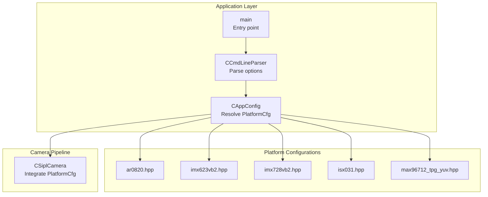
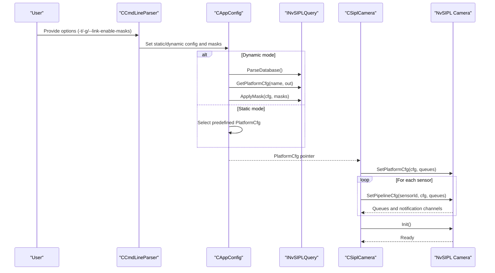
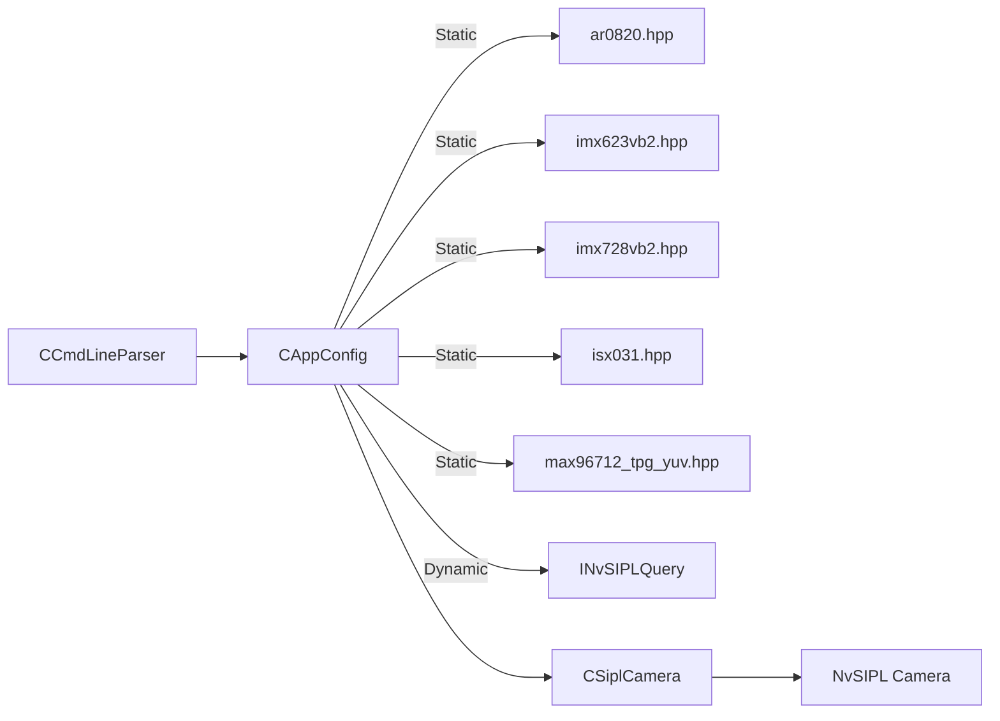

# Platform Support

<cite>
**Referenced Files in This Document**
- [ar0820.hpp](file://platform/ar0820.hpp)
- [imx623vb2.hpp](file://platform/imx623vb2.hpp)
- [imx728vb2.hpp](file://platform/imx728vb2.hpp)
- [isx031.hpp](file://platform/isx031.hpp)
- [max96712_tpg_yuv.hpp](file://platform/max96712_tpg_yuv.hpp)
- [CAppConfig.hpp](file://CAppConfig.hpp)
- [CAppConfig.cpp](file://CAppConfig.cpp)
- [CSiplCamera.hpp](file://CSiplCamera.hpp)
- [CSiplCamera.cpp](file://CSiplCamera.cpp)
- [CCmdLineParser.hpp](file://CCmdLineParser.hpp)
- [CCmdLineParser.cpp](file://CCmdLineParser.cpp)
- [Common.hpp](file://Common.hpp)
- [main.cpp](file://main.cpp)
</cite>

## Table of Contents
1. [Introduction](#introduction)
2. [Project Structure](#project-structure)
3. [Core Components](#core-components)
4. [Architecture Overview](#architecture-overview)
5. [Detailed Component Analysis](#detailed-component-analysis)
6. [Dependency Analysis](#dependency-analysis)
7. [Performance Considerations](#performance-considerations)
8. [Troubleshooting Guide](#troubleshooting-guide)
9. [Conclusion](#conclusion)
10. [Appendices](#appendices)

## Introduction
This document explains platform support in the NVIDIA SIPL Multicast system with a focus on the platform abstraction layer and sensor-specific configurations. It covers:
- Platform configuration structure and how it is resolved at runtime
- Hardware compatibility requirements and platform-specific optimizations
- Dynamic platform configuration for non-safety operating systems
- Static platform configuration for safety-critical deployments
- Hardware setup requirements, pin configuration, and validation processes
- Examples of platform configuration for different camera setups
- Troubleshooting, performance tuning, and compatibility matrices
- The relationship between platform configuration and consumer performance optimization

## Project Structure
The platform support spans several modules:
- Platform-specific configuration definitions under the platform/ directory
- Application configuration and selection logic in CAppConfig
- Camera pipeline integration and board-specific adjustments in CSiplCamera
- Command-line interface for selecting static/dynamic configurations in CCmdLineParser
- Shared constants and limits in Common.hpp

**Diagram sources**
- [CCmdLineParser.cpp:13-208](file://CCmdLineParser.cpp#L13-L208)
- [CAppConfig.cpp:21-75](file://CAppConfig.cpp#L21-L75)
- [CSiplCamera.cpp:137-169](file://CSiplCamera.cpp#L137-L169)
- [ar0820.hpp:14-183](file://platform/ar0820.hpp#L14-L183)
- [imx623vb2.hpp:14-163](file://platform/imx623vb2.hpp#L14-L163)
- [imx728vb2.hpp:14-163](file://platform/imx728vb2.hpp#L14-L163)
- [isx031.hpp:14-117](file://platform/isx031.hpp#L14-L117)
- [max96712_tpg_yuv.hpp:14-238](file://platform/max96712_tpg_yuv.hpp#L14-L238)

**Section sources**
- [CCmdLineParser.cpp:13-208](file://CCmdLineParser.cpp#L13-L208)
- [CAppConfig.cpp:21-75](file://CAppConfig.cpp#L21-L75)
- [CSiplCamera.cpp:137-169](file://CSiplCamera.cpp#L137-L169)

## Core Components
- PlatformCfg: The central platform configuration structure that describes CSI interface, deserializer, serializers, EEPROMs, sensors, and per-link rates. It is populated either statically from platform headers or dynamically via SIPL Query.
- CAppConfig: Resolves the active PlatformCfg based on command-line options and environment, supporting both static and dynamic modes.
- CSiplCamera: Integrates the selected PlatformCfg into the NvSIPL camera pipeline, sets pipeline outputs (ICP/ISP0/ISP1), and handles notifications and errors.
- CCmdLineParser: Provides command-line options to choose static or dynamic platform configuration, link masks, verbosity, and other runtime flags.

Key responsibilities:
- Static mode: Selects a predefined PlatformCfg from platform headers.
- Dynamic mode: Uses INvSIPLQuery to parse a database, fetch a named PlatformCfg, and apply link masks.
- Board-specific adjustments: Updates platform configuration depending on detected board SKU.

**Section sources**
- [CAppConfig.hpp:19-80](file://CAppConfig.hpp#L19-L80)
- [CAppConfig.cpp:21-75](file://CAppConfig.cpp#L21-L75)
- [CSiplCamera.hpp:46-85](file://CSiplCamera.hpp#L46-L85)
- [CSiplCamera.cpp:117-169](file://CSiplCamera.cpp#L117-L169)
- [CCmdLineParser.hpp:34-44](file://CCmdLineParser.hpp#L34-L44)
- [CCmdLineParser.cpp:13-208](file://CCmdLineParser.cpp#L13-L208)

## Architecture Overview
The platform abstraction layer integrates with the NvSIPL camera pipeline as follows:

**Diagram sources**
- [CCmdLineParser.cpp:66-83](file://CCmdLineParser.cpp#L66-L83)
- [CAppConfig.cpp:21-75](file://CAppConfig.cpp#L21-L75)
- [CSiplCamera.cpp:209-287](file://CSiplCamera.cpp#L209-L287)

## Detailed Component Analysis

### Platform Configuration Structure
PlatformCfg encapsulates:
- Platform identity and description
- Number and list of device blocks
- Per-device-block CSI port, PHY mode, I2C device, deserializer info, power and GPIO controls
- Per-device-block camera module list (serializer, EEPROM, sensor), including VC info (CFA, embedded lines, input format, resolution, FPS)
- Link rates (DPHY/C-PHY), group initialization, and optional safety-related flags

Sensor-specific structures include:
- SensorInfo: sensor ID, name, I2C address, VC info, trigger mode, GPIOs, and API selection
- SerializerInfo: name, I2C address, long cable flag, GPIO mappings, and API selection
- EEPROMInfo: name, I2C address, and API selection
- DeserializerInfo: name, I2C address, GPIOs, and API selection

These structures are defined in each platform header and compiled into static PlatformCfg instances.

**Section sources**
- [ar0820.hpp:14-183](file://platform/ar0820.hpp#L14-L183)
- [imx623vb2.hpp:14-163](file://platform/imx623vb2.hpp#L14-L163)
- [imx728vb2.hpp:14-163](file://platform/imx728vb2.hpp#L14-L163)
- [isx031.hpp:14-117](file://platform/isx031.hpp#L14-L117)
- [max96712_tpg_yuv.hpp:14-238](file://platform/max96712_tpg_yuv.hpp#L14-L238)

### Dynamic Platform Configuration (Non-Safety)
Dynamic configuration allows runtime selection of platform profiles and link masking:
- Command-line options:
  - --platform-config to specify a dynamic profile name
  - --link-enable-masks to enable/disable specific links per deserializer
  - --late-attach to enable late attach/re-attach behavior
- Resolution flow:
  - Parse INvSIPLQuery database
  - Fetch PlatformCfg by name
  - Apply masks to disable unwanted links
  - Return PlatformCfg pointer to the application

Validation and error handling:
- Null INvSIPLQuery instance returns an error
- ParseDatabase failure returns an error
- GetPlatformCfg and ApplyMask failures log errors and return null

**Section sources**
- [CCmdLineParser.cpp:66-83](file://CCmdLineParser.cpp#L66-L83)
- [CAppConfig.cpp:21-50](file://CAppConfig.cpp#L21-L50)

### Static Platform Configuration (Safety-Critical)
Static configuration is selected via the -t option and compiled into the binary:
- Supported static profiles include AR0820, IMX623VB2, IMX728VB2, MAX96712 TPG YUV (two variants), and ISX031 YUYV
- If no static name is provided, the default AR0820 configuration is used
- Static selection is mutually exclusive with dynamic configuration

**Section sources**
- [CCmdLineParser.cpp:88-89](file://CCmdLineParser.cpp#L88-L89)
- [CAppConfig.cpp:53-68](file://CAppConfig.cpp#L53-L68)

### Board-Specific Adjustments
CSiplCamera performs board-specific updates:
- Detects board SKU (e.g., Drive Orin P3663 vs others)
- Enables GPIO power control for specific SKUs
- Applies GPIO configuration to device blocks accordingly

This ensures correct power sequencing and pin control for different hardware platforms.

**Section sources**
- [CSiplCamera.cpp:117-135](file://CSiplCamera.cpp#L117-L135)

### Pipeline Output Selection Based on Platform
CSiplCamera selects pipeline outputs per sensor:
- YUV sensors: capture output only (no ISP outputs)
- Multi-elements enabled: ISP0 and ISP1 outputs
- Otherwise: ISP0 output only

This mapping aligns platform configuration with consumer performance needs.

**Section sources**
- [CSiplCamera.cpp:171-189](file://CSiplCamera.cpp#L171-L189)

### Error Handling and Validation
- Device block and module error reporting via notification queues
- GPIO interrupt disambiguation to distinguish true faults from propagated events
- Optional error ignore mode to treat certain warnings as non-fatal
- Validation of masks and configuration combinations

**Section sources**
- [CSiplCamera.hpp:87-355](file://CSiplCamera.hpp#L87-L355)
- [CSiplCamera.cpp:149-189](file://CSiplCamera.cpp#L149-L189)

## Dependency Analysis
The platform support depends on:
- Platform headers for static definitions
- INvSIPLQuery for dynamic resolution
- NvSIPL Camera APIs for setting platform and pipeline configurations
- Command-line parser for user-driven configuration selection

**Diagram sources**
- [CCmdLineParser.cpp:13-208](file://CCmdLineParser.cpp#L13-L208)
- [CAppConfig.cpp:21-75](file://CAppConfig.cpp#L21-L75)
- [CSiplCamera.cpp:209-287](file://CSiplCamera.cpp#L209-L287)
- [ar0820.hpp:14-183](file://platform/ar0820.hpp#L14-L183)
- [imx623vb2.hpp:14-163](file://platform/imx623vb2.hpp#L14-L163)
- [imx728vb2.hpp:14-163](file://platform/imx728vb2.hpp#L14-L163)
- [isx031.hpp:14-117](file://platform/isx031.hpp#L14-L117)
- [max96712_tpg_yuv.hpp:14-238](file://platform/max96712_tpg_yuv.hpp#L14-L238)

**Section sources**
- [CCmdLineParser.cpp:13-208](file://CCmdLineParser.cpp#L13-L208)
- [CAppConfig.cpp:21-75](file://CAppConfig.cpp#L21-L75)
- [CSiplCamera.cpp:209-287](file://CSiplCamera.cpp#L209-L287)

## Performance Considerations
- Output selection:
  - YUV sensors bypass ISP outputs to reduce CPU/GPU load
  - Multi-elements enable dual ISP outputs for advanced consumers
- Link masking reduces bandwidth and power by disabling unused lanes
- Board-specific GPIO control ensures stable power sequencing and minimizes retries
- Frame filtering and consumer queue types influence throughput and latency trade-offs

[No sources needed since this section provides general guidance]

## Troubleshooting Guide
Common issues and resolutions:
- Version mismatch between NvSIPL library and headers
  - Symptom: Warning during setup
  - Action: Align library and headers to matching major/minor/patch versions
- INvSIPLQuery errors
  - Symptom: Null instance or parse failures
  - Action: Verify availability of INvSIPLQuery and database presence
- Unexpected platform configuration
  - Symptom: Error logged when selecting static config
  - Action: Confirm the -t argument matches one of the supported static names
- Link mask misuse
  - Symptom: No frames or partial frames
  - Action: Ensure masks are provided together with dynamic config and match deserializer topology
- GPIO interrupts and errors
  - Symptom: Frequent deserializer/sensor errors
  - Action: Check GPIO interrupt disambiguation and board SKU-dependent GPIO settings
- Multi-elements and ISP outputs
  - Symptom: Consumers not receiving expected outputs
  - Action: Enable multi-elements to request ISP0 and ISP1 outputs

**Section sources**
- [CSiplCamera.cpp:144-152](file://CSiplCamera.cpp#L144-L152)
- [CAppConfig.cpp:28-50](file://CAppConfig.cpp#L28-L50)
- [CCmdLineParser.cpp:184-195](file://CCmdLineParser.cpp#L184-L195)
- [CSiplCamera.hpp:218-313](file://CSiplCamera.hpp#L218-L313)

## Conclusion
The NVIDIA SIPL Multicast system provides a robust platform abstraction layer that supports both dynamic runtime configuration and static safety-critical deployment. Platform-specific headers define sensor, serializer, EEPROM, and deserializer details, while CAppConfig resolves the active configuration based on command-line inputs. CSiplCamera integrates these configurations into the NvSIPL pipeline, applies board-specific adjustments, and manages notifications and errors. Dynamic configuration enables flexible hardware setups and link masking, while static configuration guarantees deterministic behavior for safety environments.

[No sources needed since this section summarizes without analyzing specific files]

## Appendices

### A. Platform Configuration Examples
- AR0820 (RGGB, RAW12, 3848x2168):
  - Static name: F008A120RM0AV2_CPHY_x4
  - Deserializer: MAX96712, Serializers: MAX9295, Sensors: AR0820
  - CSI C-PHY, 4-lane, 2000000 kbps
- IMX623VB2 (RGGB, RAW12RJ, 1920x1536):
  - Static name: V1SIM623S4RU5195NB3_CPHY_x4
  - Deserializer: MAX96712_Fusa_nv, Serializers: MAX96717F, Sensors: IMX623
  - CSI C-PHY, 4-lane, 2500000 kbps
- IMX728VB2 (RGGB, RAW12RJ, 3840x2160):
  - Static name: V1SIM728S1RU3120NB20_CPHY_x4
  - Deserializer: MAX96712_Fusa_nv, Serializers: MAX96717F, Sensors: IMX728
  - CSI C-PHY, 4-lane, 2500000 kbps
- ISX031 YUYV (YUV422, 1920x1536):
  - Static name: ISX031_YUYV_CPHY_x4
  - Deserializer: MAX96712, Serializers: MAX9295, Sensors: ISX031
  - CSI C-PHY, 4-lane, 2000000 kbps
- MAX96712 TPG YUV (YUV422, 1920x1236):
  - Static name: MAX96712_YUV_8_TPG_CPHY_x4
  - Alternative resolution: MAX96712_2880x1860_YUV_8_TPG_DPHY_x4
  - Deserializer: MAX96712, Serializers: dummy, Sensors: MAX96712_TPG_SENSOR
  - CSI C-PHY or D-PHY, 4-lane

**Section sources**
- [ar0820.hpp:14-183](file://platform/ar0820.hpp#L14-L183)
- [imx623vb2.hpp:14-163](file://platform/imx623vb2.hpp#L14-L163)
- [imx728vb2.hpp:14-163](file://platform/imx728vb2.hpp#L14-L163)
- [isx031.hpp:14-117](file://platform/isx031.hpp#L14-L117)
- [max96712_tpg_yuv.hpp:14-238](file://platform/max96712_tpg_yuv.hpp#L14-L238)

### B. Hardware Compatibility and Pin Configuration
- CSI interface type and PHY mode:
  - CSI AB with C-PHY or D-PHY
- Deserializer I2C address and GPIOs
- Serializer I2C addresses and optional long cable mode
- Sensor I2C addresses and trigger mode
- Power and reset controls per device block
- GPIO pin mappings for serializer deserializer signaling

Board-specific power GPIOs are applied for certain SKUs to ensure stable operation.

**Section sources**
- [ar0820.hpp:24-181](file://platform/ar0820.hpp#L24-L181)
- [imx623vb2.hpp:24-161](file://platform/imx623vb2.hpp#L24-L161)
- [imx728vb2.hpp:24-161](file://platform/imx728vb2.hpp#L24-L161)
- [isx031.hpp:22-116](file://platform/isx031.hpp#L22-L116)
- [max96712_tpg_yuv.hpp:22-124](file://platform/max96712_tpg_yuv.hpp#L22-L124)
- [CSiplCamera.cpp:125-132](file://CSiplCamera.cpp#L125-L132)

### C. Relationship Between Platform Configuration and Consumer Performance
- YUV sensors: capture output only; suitable for direct YUV consumers
- Multi-elements: enables ISP0 and ISP1 outputs for advanced consumers
- Link masks: reduce bandwidth and improve stability by disabling unused links
- Queue types and frame filters: tune throughput and latency

**Section sources**
- [CSiplCamera.cpp:171-189](file://CSiplCamera.cpp#L171-L189)
- [CCmdLineParser.cpp:184-195](file://CCmdLineParser.cpp#L184-L195)