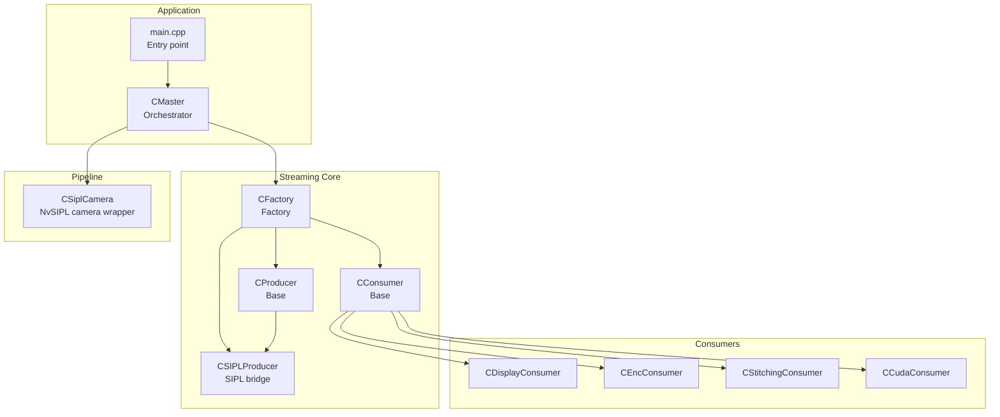
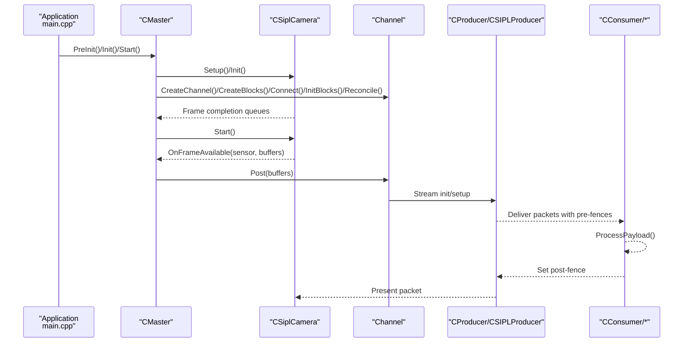
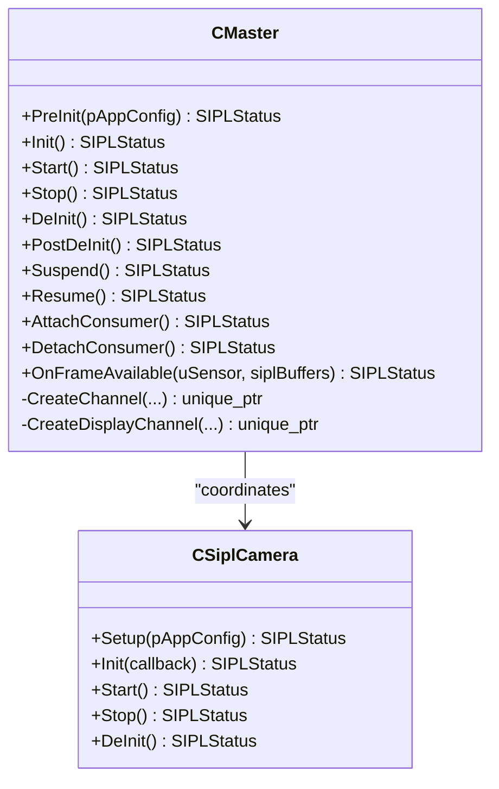
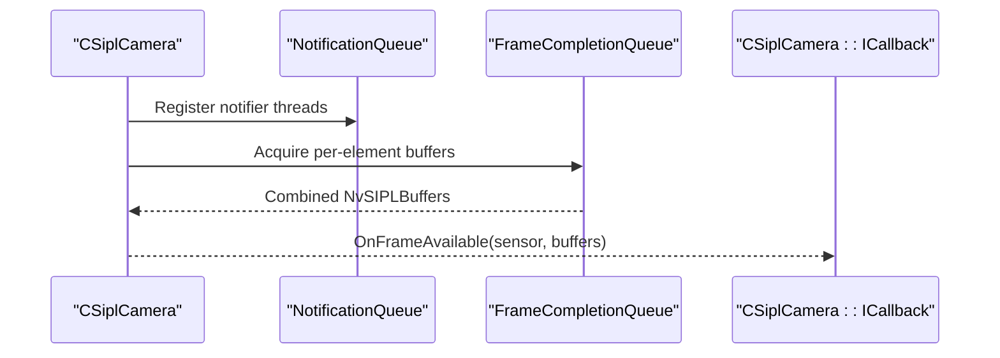
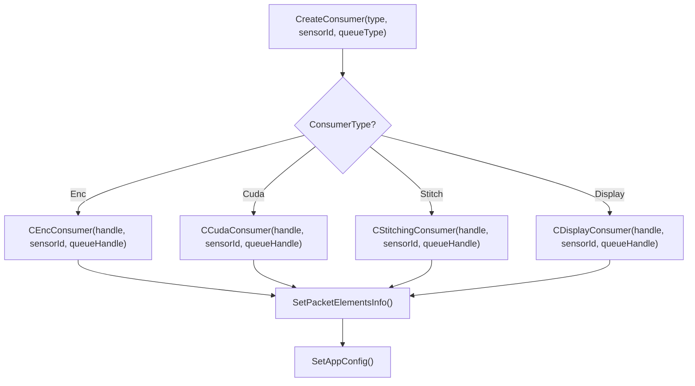
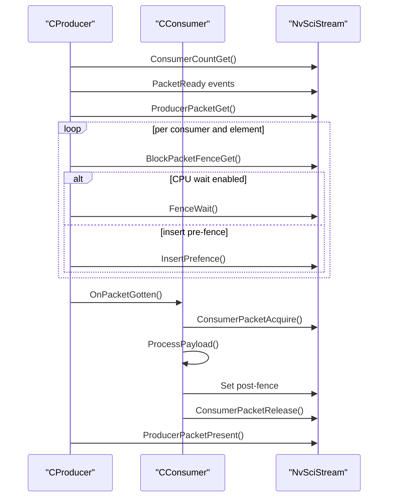
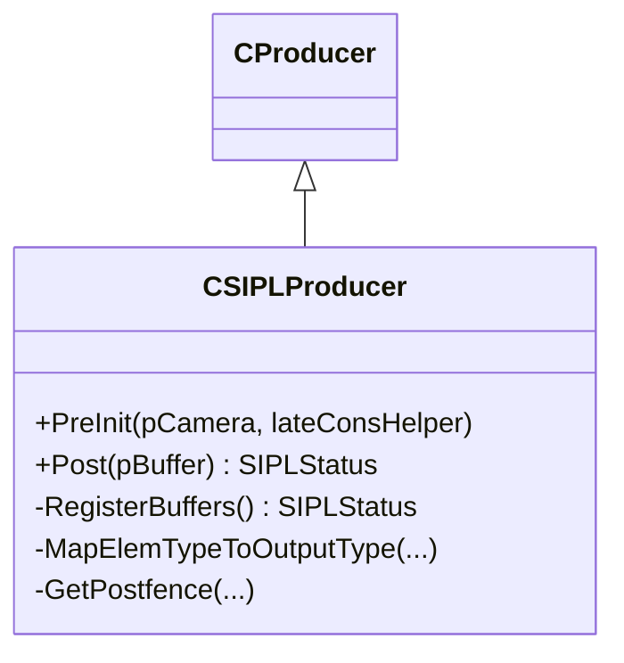
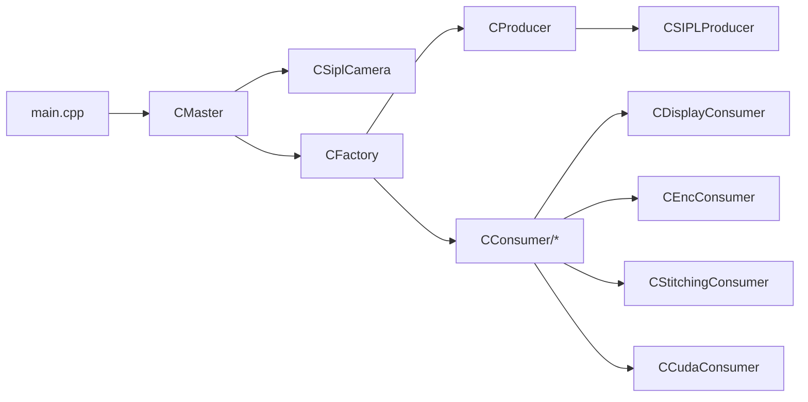

# Architecture Overview

<cite>
**Referenced Files in This Document**
- [main.cpp](file://main.cpp)
- [CMaster.hpp](file://CMaster.hpp)
- [CMaster.cpp](file://CMaster.cpp)
- [CSiplCamera.hpp](file://CSiplCamera.hpp)
- [CFactory.hpp](file://CFactory.hpp)
- [CFactory.cpp](file://CFactory.cpp)
- [CProducer.hpp](file://CProducer.hpp)
- [CProducer.cpp](file://CProducer.cpp)
- [CConsumer.hpp](file://CConsumer.hpp)
- [CConsumer.cpp](file://CConsumer.cpp)
- [CSIPLProducer.hpp](file://CSIPLProducer.hpp)
- [CDisplayConsumer.hpp](file://CDisplayConsumer.hpp)
- [CEncConsumer.hpp](file://CEncConsumer.hpp)
- [CStitchingConsumer.hpp](file://CStitchingConsumer.hpp)
- [CCudaConsumer.hpp](file://CCudaConsumer.hpp)
</cite>

## Table of Contents
1. [Introduction](#introduction)
2. [Project Structure](#project-structure)
3. [Core Components](#core-components)
4. [Architecture Overview](#architecture-overview)
5. [Detailed Component Analysis](#detailed-component-analysis)
6. [Dependency Analysis](#dependency-analysis)
7. [Performance Considerations](#performance-considerations)
8. [Troubleshooting Guide](#troubleshooting-guide)
9. [Conclusion](#conclusion)

## Introduction
This document describes the architecture of the NVIDIA SIPL Multicast system. It focuses on the high-level design showing the relationships among CSiplCamera, CProducer, CFactory, and various CConsumer implementations. It explains the producer-consumer pattern, the factory pattern for dynamic consumer creation, and the central orchestrator role of CMaster. It also documents system boundaries, component interactions, data flow patterns, and extensibility mechanisms for adding new consumer types and platform configurations.

## Project Structure
The multicast application is organized around a small set of core classes and a factory-driven composition model:
- Entry point initializes configuration, sets up logging, and drives lifecycle via CMaster.
- CMaster orchestrates initialization, streaming, monitoring, and teardown.
- CSiplCamera integrates with the NvSIPL camera pipeline and exposes frame completion queues to the application.
- CFactory creates producers, consumers, queues, and inter-process/chip blocks.
- CProducer and CConsumer define the streaming base classes for packet acquisition, synchronization, and payload processing.
- Specialized consumers (CDisplayConsumer, CEncConsumer, CStitchingConsumer, CCudaConsumer) implement platform-specific processing.
- CSIPLProducer bridges the NvSIPL camera pipeline to the streaming framework.

**Diagram sources**
- [main.cpp:253-304](file://main.cpp#L253-L304)
- [CMaster.hpp:47-92](file://CMaster.hpp#L47-L92)
- [CFactory.hpp:27-92](file://CFactory.hpp#L27-L92)
- [CProducer.hpp:16-51](file://CProducer.hpp#L16-L51)
- [CConsumer.hpp:16-43](file://CConsumer.hpp#L16-L43)
- [CSIPLProducer.hpp:18-81](file://CSIPLProducer.hpp#L18-L81)
- [CDisplayConsumer.hpp:15-47](file://CDisplayConsumer.hpp#L15-L47)
- [CEncConsumer.hpp:17-64](file://CEncConsumer.hpp#L17-L64)
- [CStitchingConsumer.hpp:17-72](file://CStitchingConsumer.hpp#L17-L72)
- [CCudaConsumer.hpp:25-80](file://CCudaConsumer.hpp#L25-L80)
- [CSiplCamera.hpp:46-85](file://CSiplCamera.hpp#L46-L85)

**Section sources**
- [main.cpp:253-304](file://main.cpp#L253-L304)
- [CMaster.hpp:47-92](file://CMaster.hpp#L47-L92)
- [CFactory.hpp:27-92](file://CFactory.hpp#L27-L92)

## Core Components
- CMaster: Central orchestrator managing lifecycle, stream initialization, channel creation, and monitoring. Implements CSiplCamera::ICallback to receive frames and dispatch to channels.
- CSiplCamera: Wraps NvSIPL camera pipeline, manages notification handlers, and exposes per-sensor frame completion queues to the application.
- CFactory: Singleton-style factory providing creation of producers, consumers, queues, multicast blocks, present sync, and IPC/C2C blocks. Drives element usage selection per consumer type and sensor configuration.
- CProducer: Base producer class handling consumer count discovery, initial packet ownership, pre-fence collection, and packet posting with post-fences.
- CConsumer: Base consumer class handling packet acquisition, pre-fence insertion, payload processing, and release semantics.
- CSIPLProducer: Producer specialization bridging NvSIPL camera outputs to the streaming framework, mapping outputs to packet elements and handling SIPL buffers.
- Consumers: Specializations for display, encoding, stitching, and CUDA-based processing, each implementing payload processing and synchronization.

**Section sources**
- [CMaster.hpp:47-92](file://CMaster.hpp#L47-L92)
- [CMaster.cpp:164-232](file://CMaster.cpp#L164-L232)
- [CSiplCamera.hpp:46-85](file://CSiplCamera.hpp#L46-L85)
- [CFactory.hpp:27-92](file://CFactory.hpp#L27-L92)
- [CFactory.cpp:68-205](file://CFactory.cpp#L68-L205)
- [CProducer.hpp:16-51](file://CProducer.hpp#L16-L51)
- [CProducer.cpp:17-151](file://CProducer.cpp#L17-L151)
- [CConsumer.hpp:16-43](file://CConsumer.hpp#L16-L43)
- [CConsumer.cpp:17-127](file://CConsumer.cpp#L17-L127)
- [CSIPLProducer.hpp:18-81](file://CSIPLProducer.hpp#L18-L81)

## Architecture Overview
The system follows a producer-consumer pattern with explicit synchronization via NvSciStream/NvSciBuf. CMaster coordinates initialization and runtime behavior, while CSiplCamera integrates with the NvSIPL camera pipeline. CFactory encapsulates creation and configuration of streaming primitives. Consumers implement specialized processing and are dynamically selected via the factory.

**Diagram sources**
- [main.cpp:271-288](file://main.cpp#L271-L288)
- [CMaster.cpp:195-275](file://CMaster.cpp#L195-L275)
- [CSiplCamera.hpp:49-64](file://CSiplCamera.hpp#L49-L64)
- [CProducer.cpp:56-121](file://CProducer.cpp#L56-L121)
- [CConsumer.cpp:17-94](file://CConsumer.cpp#L17-L94)

## Detailed Component Analysis

### CMaster: Central Orchestrator
Responsibilities:
- Lifecycle management: PreInit, Init, Start, Stop, DeInit, PostDeInit.
- Stream orchestration: Opens NvSci modules, initializes display controller, creates channels per sensor, reconciles blocks, starts/stops streams.
- Monitoring: Periodic FPS reporting and error checks against camera notification handlers.
- Runtime controls: Suspend/Resume, attach/detach consumers for IPC late attachment.
- Callback integration: Implements CSiplCamera::ICallback to route frames to appropriate channels.

Key interactions:
- Creates channels based on communication type and entity type.
- Uses CFactory for producer/consumer creation and IPC/C2C blocks.
- Manages display channel when stitching or DPMST display is enabled.

**Diagram sources**
- [CMaster.hpp:47-92](file://CMaster.hpp#L47-L92)
- [CMaster.cpp:164-232](file://CMaster.cpp#L164-L232)
- [CSiplCamera.hpp:49-64](file://CSiplCamera.hpp#L49-L64)

**Section sources**
- [CMaster.hpp:47-92](file://CMaster.hpp#L47-L92)
- [CMaster.cpp:164-232](file://CMaster.cpp#L164-L232)

### CSiplCamera: Camera Pipeline Integration
Responsibilities:
- Integrates with NvSIPL camera pipeline, exposing per-sensor frame completion queues and notification queues.
- Provides callbacks to deliver frames to the application via CSiplCamera::ICallback.
- Manages device block and pipeline notification handlers and frame queue handlers.

Runtime flow:
- Starts camera pipeline and registers notification queues.
- Frame queue handlers collect per-element buffers and invoke the callback with combined buffers.
- Notification handlers monitor pipeline/device-block errors and frame drops.

**Diagram sources**
- [CSiplCamera.hpp:523-618](file://CSiplCamera.hpp#L523-L618)
- [CSiplCamera.hpp:357-521](file://CSiplCamera.hpp#L357-L521)

**Section sources**
- [CSiplCamera.hpp:49-85](file://CSiplCamera.hpp#L49-L85)
- [CSiplCamera.hpp:523-618](file://CSiplCamera.hpp#L523-L618)

### CFactory: Dynamic Creation and Configuration
Responsibilities:
- Creates producers and consumers based on type and sensor configuration.
- Builds queues (mailbox/FIFO), consumer handles, and multicast blocks.
- Configures packet element usage per consumer type and sensor characteristics (YUV vs raw, multi-element enablement).
- Supports IPC and C2C block creation and endpoint management.

Creation patterns:
- Producer creation selects CSIPLProducer or CDisplayProducer and sets element usage.
- Consumer creation selects CEncConsumer, CCudaConsumer, CStitchingConsumer, or CDisplayConsumer, sets element usage, and applies app config.

**Diagram sources**
- [CFactory.cpp:166-205](file://CFactory.cpp#L166-L205)
- [CFactory.cpp:96-136](file://CFactory.cpp#L96-L136)

**Section sources**
- [CFactory.hpp:27-92](file://CFactory.hpp#L27-L92)
- [CFactory.cpp:68-205](file://CFactory.cpp#L68-L205)

### Producer-Consumer Pattern Implementation
Core mechanics:
- Producer queries consumer count and takes initial packet ownership upon setup completion.
- Producer collects pre-fences from each consumer for each element, optionally CPU-waiting or inserting fences.
- Consumer acquires packet, waits on pre-fences if present, processes payload, and sets post-fence.
- Producer presents packet after processing and updates buffer availability counters.

**Diagram sources**
- [CProducer.cpp:17-121](file://CProducer.cpp#L17-L121)
- [CConsumer.cpp:17-94](file://CConsumer.cpp#L17-L94)

**Section sources**
- [CProducer.hpp:16-51](file://CProducer.hpp#L16-L51)
- [CProducer.cpp:17-151](file://CProducer.cpp#L17-L151)
- [CConsumer.hpp:16-43](file://CConsumer.hpp#L16-L43)
- [CConsumer.cpp:17-127](file://CConsumer.cpp#L17-L127)

### CSIPLProducer: SIPL Camera Bridge
Responsibilities:
- Bridges NvSIPL camera outputs to the streaming framework.
- Maps outputs to packet elements and maintains SIPL buffer metadata.
- Handles element-type-to-output-type mapping and post-fence retrieval per output type.
- Supports late consumer attachment via helper.

**Diagram sources**
- [CSIPLProducer.hpp:18-81](file://CSIPLProducer.hpp#L18-L81)

**Section sources**
- [CSIPLProducer.hpp:18-81](file://CSIPLProducer.hpp#L18-L81)

### Consumer Specializations
- CDisplayConsumer: Integrates with display pipeline via WFD controller, handles ABGR presentation for stitching or DPMST.
- CEncConsumer: Encodes frames using NvMedia IEP, writes encoded bitstreams, and manages encoder configuration.
- CStitchingConsumer: Performs 2D compositing for multi-camera stitching, interacts with display producer buffers.
- CCudaConsumer: Processes frames on GPU, supports inference and conversions, uses CUDA external memory and semaphores.

Extensibility:
- New consumers derive from CConsumer and implement payload processing, pre/post fence handling, and buffer mapping.
- Factory supports registration of new consumer types by extending the consumer selection logic.

**Section sources**
- [CDisplayConsumer.hpp:15-47](file://CDisplayConsumer.hpp#L15-L47)
- [CEncConsumer.hpp:17-64](file://CEncConsumer.hpp#L17-L64)
- [CStitchingConsumer.hpp:17-72](file://CStitchingConsumer.hpp#L17-L72)
- [CCudaConsumer.hpp:25-80](file://CCudaConsumer.hpp#L25-L80)

## Dependency Analysis
High-level dependencies:
- main.cpp depends on CMaster for lifecycle control.
- CMaster depends on CSiplCamera for frame delivery and on CFactory for stream primitives.
- CFactory depends on consumer/producer headers and NvSci APIs.
- CSIPLProducer depends on NvSIPL camera interfaces.
- Consumers depend on NvSciBuf/NvSciSync and platform libraries (display, encoding, CUDA).

**Diagram sources**
- [main.cpp:253-304](file://main.cpp#L253-L304)
- [CMaster.hpp:47-92](file://CMaster.hpp#L47-L92)
- [CFactory.hpp:14-22](file://CFactory.hpp#L14-L22)
- [CProducer.hpp:16-23](file://CProducer.hpp#L16-L23)
- [CConsumer.hpp:16-23](file://CConsumer.hpp#L16-L23)
- [CSIPLProducer.hpp:18-26](file://CSIPLProducer.hpp#L18-L26)
- [CDisplayConsumer.hpp:15-22](file://CDisplayConsumer.hpp#L15-L22)
- [CEncConsumer.hpp:17-22](file://CEncConsumer.hpp#L17-L22)
- [CStitchingConsumer.hpp:17-22](file://CStitchingConsumer.hpp#L17-L22)
- [CCudaConsumer.hpp:25-30](file://CCudaConsumer.hpp#L25-L30)

**Section sources**
- [main.cpp:253-304](file://main.cpp#L253-L304)
- [CMaster.hpp:47-92](file://CMaster.hpp#L47-L92)
- [CFactory.hpp:14-22](file://CFactory.hpp#L14-L22)

## Performance Considerations
- Fence handling: CPU waiting is optional and controlled per consumer; enabling CPU wait avoids blocking but may increase latency.
- Frame filtering: Consumers can skip frames based on configured filter to reduce processing load.
- Multi-element usage: Factory configures element usage per sensor and consumer type to minimize unnecessary copies.
- Monitoring: CMaster periodically reports FPS and checks for fatal errors to maintain stability.

[No sources needed since this section provides general guidance]

## Troubleshooting Guide
Common areas to check:
- Initialization failures: Verify NvSci module opens and IPC initialization for inter-process/chip modes.
- Consumer count mismatch: Ensure the number of consumers does not exceed limits and pre-fences are properly registered.
- Frame drops and timeouts: Review notification handlers for pipeline warnings and timeouts.
- Late consumer attach: Confirm producer residency and IPC mode before attempting attach/detach.

Operational controls:
- Suspend/Resume via signals or socket interface.
- Manual attach/detach for IPC producers.

**Section sources**
- [CMaster.cpp:320-403](file://CMaster.cpp#L320-L403)
- [CMaster.cpp:473-513](file://CMaster.cpp#L473-L513)
- [main.cpp:74-153](file://main.cpp#L74-L153)
- [main.cpp:155-251](file://main.cpp#L155-L251)

## Conclusion
The NVIDIA SIPL Multicast system employs a clean producer-consumer architecture orchestrated by CMaster, with CSiplCamera bridging the NvSIPL camera pipeline to the streaming framework. CFactory enables dynamic creation and configuration of producers, consumers, and transport blocks, supporting flexible consumer combinations and runtime configuration. The modular design allows straightforward extension with new consumer types and platform configurations while maintaining robust synchronization and error handling.