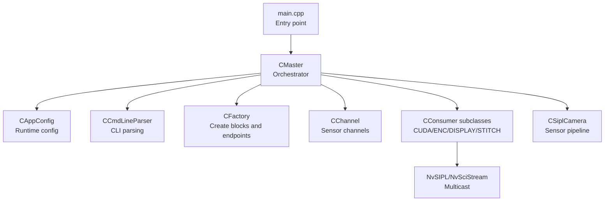
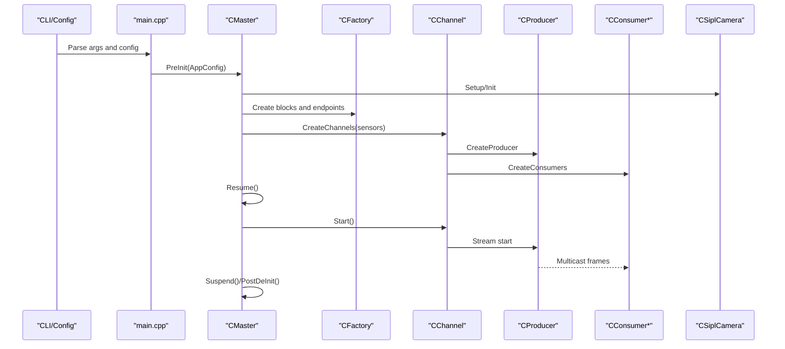
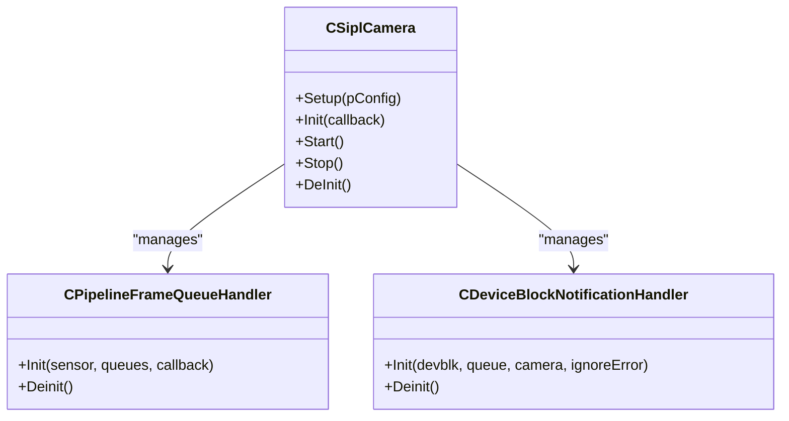
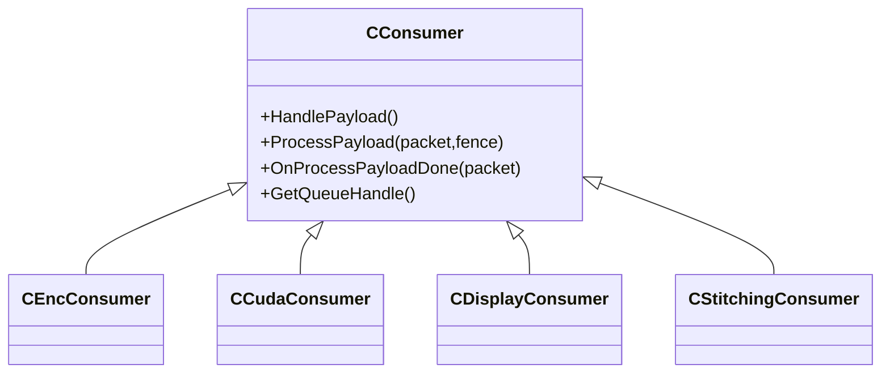
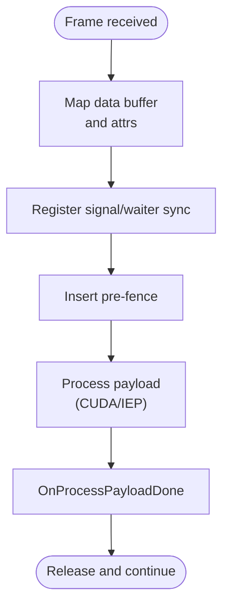
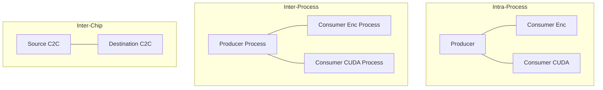
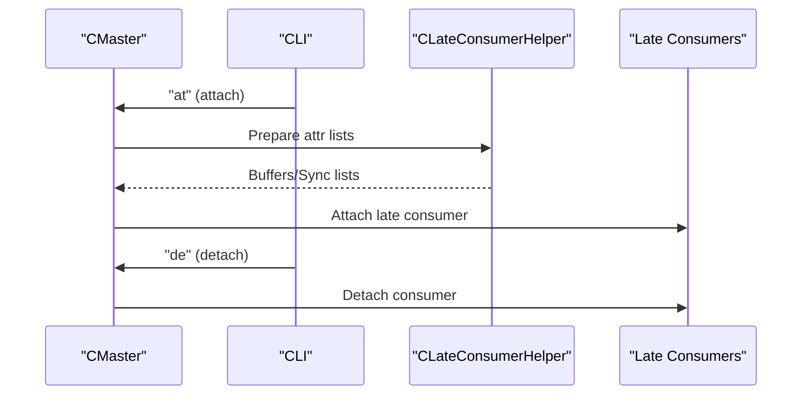
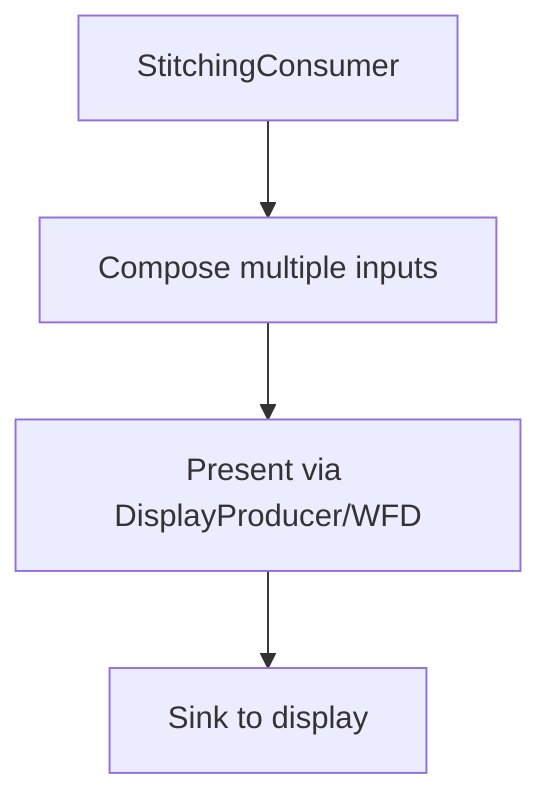
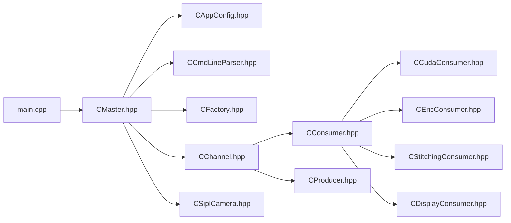

# Core Features

<cite>
**Referenced Files in This Document**
- [README.md](file://README.md)
- [main.cpp](file://main.cpp)
- [CAppConfig.hpp](file://CAppConfig.hpp)
- [CCmdLineParser.hpp](file://CCmdLineParser.hpp)
- [CFactory.hpp](file://CFactory.hpp)
- [CProducer.hpp](file://CProducer.hpp)
- [CConsumer.hpp](file://CConsumer.hpp)
- [CCudaConsumer.hpp](file://CCudaConsumer.hpp)
- [CEncConsumer.hpp](file://CEncConsumer.hpp)
- [CStitchingConsumer.hpp](file://CStitchingConsumer.hpp)
- [CDisplayConsumer.hpp](file://CDisplayConsumer.hpp)
- [CMaster.hpp](file://CMaster.hpp)
- [CLateConsumerHelper.hpp](file://CLateConsumerHelper.hpp)
- [CChannel.hpp](file://CChannel.hpp)
- [Common.hpp](file://Common.hpp)
- [CSiplCamera.hpp](file://CSiplCamera.hpp)
</cite>

## Table of Contents
1. [Introduction](#introduction)
2. [Project Structure](#project-structure)
3. [Core Components](#core-components)
4. [Architecture Overview](#architecture-overview)
5. [Detailed Component Analysis](#detailed-component-analysis)
6. [Dependency Analysis](#dependency-analysis)
7. [Performance Considerations](#performance-considerations)
8. [Troubleshooting Guide](#troubleshooting-guide)
9. [Conclusion](#conclusion)
10. [Appendices](#appendices)

## Introduction
This document explains the core features of the NVIDIA SIPL Multicast system as implemented in the repository. It focuses on:
- Multi-camera support (up to 16 cameras)
- Multi-consumer distribution (CUDA, encoder, display, stitching)
- Real-time GPU-accelerated processing
- Flexible communication modes (intra-process, inter-process, inter-chip)
- Dynamic platform configuration and late consumer attachment
- Camera stitching and display
- Command-line interface, configuration parameters, and runtime customization

The goal is to help both new and experienced users understand how the system is structured, how to configure it, and how to operate it effectively across different deployment scenarios.

## Project Structure
The multicast sample is organized around a small set of core modules:
- Application entry point and orchestration
- Configuration and command-line parsing
- Producer/consumer abstractions and factories
- Channel abstraction for building streaming pipelines
- Consumers for CUDA, encoder, display, and stitching
- Master controller coordinating sensors, channels, and runtime controls
- Platform configuration and camera pipeline management

**Diagram sources**
- [main.cpp:253-304](file://main.cpp#L253-L304)
- [CMaster.hpp:47-95](file://CMaster.hpp#L47-L95)
- [CAppConfig.hpp:19-83](file://CAppConfig.hpp#L19-L83)
- [CCmdLineParser.hpp:34-47](file://CCmdLineParser.hpp#L34-L47)
- [CFactory.hpp:27-95](file://CFactory.hpp#L27-L95)
- [CChannel.hpp:28-157](file://CChannel.hpp#L28-L157)
- [CConsumer.hpp:16-45](file://CConsumer.hpp#L16-L45)
- [CSiplCamera.hpp:46-86](file://CSiplCamera.hpp#L46-L86)

**Section sources**
- [README.md:11-109](file://README.md#L11-L109)
- [main.cpp:253-304](file://main.cpp#L253-L304)
- [CAppConfig.hpp:19-83](file://CAppConfig.hpp#L19-L83)
- [CCmdLineParser.hpp:34-47](file://CCmdLineParser.hpp#L34-L47)
- [CFactory.hpp:27-95](file://CFactory.hpp#L27-L95)
- [CChannel.hpp:28-157](file://CChannel.hpp#L28-L157)
- [CConsumer.hpp:16-45](file://CConsumer.hpp#L16-L45)
- [CSiplCamera.hpp:46-86](file://CSiplCamera.hpp#L46-L86)

## Core Components
- Application configuration and CLI:
  - Runtime flags and platform configuration selection
  - Verbosity, frame filtering, run duration, and consumer selection
- Producer/consumer base classes:
  - Unified streaming lifecycle and payload handling
  - Fence and synchronization primitives
- Factories and channels:
  - Build multicast blocks, queues, IPC/C2C endpoints
  - Manage per-sensor channels and event loops
- Consumers:
  - CUDA: GPU-accelerated processing and optional inference
  - Encoder: hardware encoding to H.264
  - Display/Stitching: composition and presentation
- Master controller:
  - Initialize, start, suspend/resume, and teardown
  - Late consumer attach/detach and runtime commands
- Camera pipeline:
  - Sensor setup, notifications, and frame completion queues

**Section sources**
- [CAppConfig.hpp:19-83](file://CAppConfig.hpp#L19-L83)
- [CProducer.hpp:16-53](file://CProducer.hpp#L16-L53)
- [CConsumer.hpp:16-45](file://CConsumer.hpp#L16-L45)
- [CFactory.hpp:27-95](file://CFactory.hpp#L27-L95)
- [CChannel.hpp:28-157](file://CChannel.hpp#L28-L157)
- [CCudaConsumer.hpp:25-81](file://CCudaConsumer.hpp#L25-L81)
- [CEncConsumer.hpp:17-66](file://CEncConsumer.hpp#L17-L66)
- [CStitchingConsumer.hpp:17-74](file://CStitchingConsumer.hpp#L17-L74)
- [CDisplayConsumer.hpp:15-49](file://CDisplayConsumer.hpp#L15-L49)
- [CMaster.hpp:47-95](file://CMaster.hpp#L47-L95)
- [CSiplCamera.hpp:46-86](file://CSiplCamera.hpp#L46-L86)

## Architecture Overview
The system builds a multicast pipeline from sensors to multiple consumers. The Master coordinates sensor initialization, channel creation, and runtime controls. Factories construct NvSciBuf/NvSciSync blocks and endpoints for intra-process, inter-process, or inter-chip communication. Consumers register buffers and fences, process frames asynchronously, and hand off to GPU or display.

**Diagram sources**
- [main.cpp:253-304](file://main.cpp#L253-L304)
- [CMaster.hpp:50-65](file://CMaster.hpp#L50-L65)
- [CFactory.hpp:36-76](file://CFactory.hpp#L36-L76)
- [CChannel.hpp:46-109](file://CChannel.hpp#L46-L109)
- [CProducer.hpp:16-53](file://CProducer.hpp#L16-L53)
- [CConsumer.hpp:16-45](file://CConsumer.hpp#L16-L45)
- [CSiplCamera.hpp:59-64](file://CSiplCamera.hpp#L59-L64)

## Detailed Component Analysis

### Multi-Camera Support (1–16 Cameras)
- The system supports up to 16 sensors concurrently, with per-sensor channels and frame completion queues.
- Each sensor’s pipeline is managed independently, enabling multi-output streams and multiple ISP outputs per sensor.
- The camera subsystem handles device block notifications, pipeline events, and frame drop tracking.

**Diagram sources**
- [CSiplCamera.hpp:46-86](file://CSiplCamera.hpp#L46-L86)
- [CSiplCamera.hpp:523-621](file://CSiplCamera.hpp#L523-L621)

**Section sources**
- [Common.hpp:14-18](file://Common.hpp#L14-L18)
- [CSiplCamera.hpp:59-64](file://CSiplCamera.hpp#L59-L64)
- [CSiplCamera.hpp:523-621](file://CSiplCamera.hpp#L523-L621)

### Multi-Consumer Distribution (CUDA, Encoder, Display, Stitching)
- Consumers implement a common base with payload processing hooks and fence registration.
- Supported consumer types include encoder, CUDA, display, and stitching.
- Each consumer registers buffer attributes and waits/signal sync objects to coordinate with producers.

**Diagram sources**
- [CConsumer.hpp:16-45](file://CConsumer.hpp#L16-L45)
- [CEncConsumer.hpp:17-66](file://CEncConsumer.hpp#L17-L66)
- [CCudaConsumer.hpp:25-81](file://CCudaConsumer.hpp#L25-L81)
- [CDisplayConsumer.hpp:15-49](file://CDisplayConsumer.hpp#L15-L49)
- [CStitchingConsumer.hpp:17-74](file://CStitchingConsumer.hpp#L17-L74)

**Section sources**
- [CConsumer.hpp:16-45](file://CConsumer.hpp#L16-L45)
- [CEncConsumer.hpp:17-66](file://CEncConsumer.hpp#L17-L66)
- [CCudaConsumer.hpp:25-81](file://CCudaConsumer.hpp#L25-L81)
- [CDisplayConsumer.hpp:15-49](file://CDisplayConsumer.hpp#L15-L49)
- [CStitchingConsumer.hpp:17-74](file://CStitchingConsumer.hpp#L17-L74)

### Real-Time GPU-Accelerated Processing
- CUDA consumer integrates with CUDA external memory and semaphores to process frames asynchronously.
- Optional inference path is available on supported platforms.
- Encoder consumer uses hardware encoding to produce H.264 streams.

**Diagram sources**
- [CCudaConsumer.hpp:35-78](file://CCudaConsumer.hpp#L35-L78)
- [CEncConsumer.hpp:24-64](file://CEncConsumer.hpp#L24-L64)
- [CConsumer.hpp:30-35](file://CConsumer.hpp#L30-L35)

**Section sources**
- [CCudaConsumer.hpp:35-78](file://CCudaConsumer.hpp#L35-L78)
- [CEncConsumer.hpp:24-64](file://CEncConsumer.hpp#L24-L64)
- [CConsumer.hpp:30-35](file://CConsumer.hpp#L30-L35)

### Flexible Communication Modes (Intra-Process, Inter-Process, Inter-Chip)
- Intra-process mode runs producer and consumers in a single process.
- Inter-process (P2P) mode uses named IPC channels for producer-consumer separation.
- Inter-chip (C2C) mode uses PCIe-based channels for cross-chip transport.
- Factories create endpoints and multicast blocks appropriate to the selected mode.

**Diagram sources**
- [CFactory.hpp:52-76](file://CFactory.hpp#L52-L76)
- [Common.hpp:31-33](file://Common.hpp#L31-L33)
- [README.md:47-79](file://README.md#L47-L79)

**Section sources**
- [CFactory.hpp:52-76](file://CFactory.hpp#L52-L76)
- [Common.hpp:31-33](file://Common.hpp#L31-L33)
- [README.md:47-79](file://README.md#L47-L79)

### Dynamic Platform Configuration and Late Consumer Attachment
- Dynamic configuration allows runtime platform selection on non-safety OSes with masks specifying sensor usage.
- Late consumer attachment enables adding or removing consumers after the producer starts, with runtime commands to attach/detach.
- Peer validation ensures consistency between producer and consumers in inter-process mode.

**Diagram sources**
- [main.cpp:74-153](file://main.cpp#L74-L153)
- [CMaster.hpp:63-64](file://CMaster.hpp#L63-L64)
- [CLateConsumerHelper.hpp:15-37](file://CLateConsumerHelper.hpp#L15-L37)
- [README.md:80-92](file://README.md#L80-L92)

**Section sources**
- [CAppConfig.hpp:24-27](file://CAppConfig.hpp#L24-L27)
- [CAppConfig.hpp:67-69](file://CAppConfig.hpp#L67-L69)
- [CLateConsumerHelper.hpp:15-37](file://CLateConsumerHelper.hpp#L15-L37)
- [main.cpp:74-153](file://main.cpp#L74-L153)
- [README.md:80-92](file://README.md#L80-L92)

### Camera Stitching and Display
- The stitching consumer composes multiple camera feeds into a single output suitable for display.
- Display consumer integrates with WFD controller to present the composed image.
- Optional DPMST enablement is exposed via configuration.

**Diagram sources**
- [CStitchingConsumer.hpp:17-74](file://CStitchingConsumer.hpp#L17-L74)
- [CDisplayConsumer.hpp:15-49](file://CDisplayConsumer.hpp#L15-L49)
- [CAppConfig.hpp:34-35](file://CAppConfig.hpp#L34-L35)

**Section sources**
- [CStitchingConsumer.hpp:17-74](file://CStitchingConsumer.hpp#L17-L74)
- [CDisplayConsumer.hpp:15-49](file://CDisplayConsumer.hpp#L15-L49)
- [CAppConfig.hpp:34-35](file://CAppConfig.hpp#L34-L35)
- [README.md:38-45](file://README.md#L38-L45)

### Command-Line Interface, Configuration Parameters, and Runtime Customization
Key options include:
- Version and help
- Verbosity and run duration
- Frame filtering and file dumping
- Platform configuration selection (dynamic/static)
- Consumer type and queue type
- Multi-elements and multi-camera operation
- Late consumer attach toggle
- Inter-process and inter-chip modes
- Display and stitching toggles

Practical usage examples are provided in the repository’s README for intra-process, inter-process, inter-chip, and late attach scenarios.

**Section sources**
- [README.md:16-109](file://README.md#L16-L109)
- [CCmdLineParser.hpp:34-47](file://CCmdLineParser.hpp#L34-L47)
- [CAppConfig.hpp:23-80](file://CAppConfig.hpp#L23-L80)

## Dependency Analysis
The following diagram highlights module-level dependencies and interactions:

**Diagram sources**
- [main.cpp:253-304](file://main.cpp#L253-L304)
- [CMaster.hpp:47-95](file://CMaster.hpp#L47-L95)
- [CAppConfig.hpp:19-83](file://CAppConfig.hpp#L19-L83)
- [CCmdLineParser.hpp:34-47](file://CCmdLineParser.hpp#L34-L47)
- [CFactory.hpp:27-95](file://CFactory.hpp#L27-L95)
- [CChannel.hpp:28-157](file://CChannel.hpp#L28-L157)
- [CConsumer.hpp:16-45](file://CConsumer.hpp#L16-L45)
- [CProducer.hpp:16-53](file://CProducer.hpp#L16-L53)
- [CCudaConsumer.hpp:25-81](file://CCudaConsumer.hpp#L25-L81)
- [CEncConsumer.hpp:17-66](file://CEncConsumer.hpp#L17-L66)
- [CStitchingConsumer.hpp:17-74](file://CStitchingConsumer.hpp#L17-L74)
- [CDisplayConsumer.hpp:15-49](file://CDisplayConsumer.hpp#L15-L49)
- [CSiplCamera.hpp:46-86](file://CSiplCamera.hpp#L46-L86)

**Section sources**
- [Common.hpp:35-87](file://Common.hpp#L35-L87)
- [CFactory.hpp:27-95](file://CFactory.hpp#L27-L95)
- [CChannel.hpp:28-157](file://CChannel.hpp#L28-L157)
- [CConsumer.hpp:16-45](file://CConsumer.hpp#L16-L45)
- [CProducer.hpp:16-53](file://CProducer.hpp#L16-L53)

## Performance Considerations
- Asynchronous processing: Consumers process payloads and signal completion via fences to minimize CPU stalls.
- Multicast distribution: A single producer stream feeds multiple consumers efficiently.
- GPU acceleration: CUDA and hardware encoder consumers reduce CPU load.
- Tunable frame filtering and run duration enable controlled testing and profiling.
- Per-sensor channels isolate workloads and simplify scaling to 16 cameras.

[No sources needed since this section provides general guidance]

## Troubleshooting Guide
- Error notifications: Device block and pipeline handlers report errors and frame drops; fatal vs. recoverable conditions depend on configuration.
- Graceful shutdown: Signals and socket-driven suspend/resume requests are handled by the main loop.
- Late attach/detach: Use runtime commands to adjust consumers dynamically; verify peer validation in inter-process mode.

**Section sources**
- [CSiplCamera.hpp:87-355](file://CSiplCamera.hpp#L87-L355)
- [CSiplCamera.hpp:412-521](file://CSiplCamera.hpp#L412-L521)
- [main.cpp:44-91](file://main.cpp#L44-L91)
- [main.cpp:155-251](file://main.cpp#L155-L251)

## Conclusion
The NVIDIA SIPL Multicast system provides a flexible, high-performance framework for multi-camera, multi-consumer streaming. It supports dynamic platform configuration, GPU-accelerated consumers, and multiple communication modes. The Master orchestrates sensor pipelines, channels, and runtime controls, while the factory and channel abstractions enable scalable deployment across intra-process, inter-process, and inter-chip environments.

[No sources needed since this section summarizes without analyzing specific files]

## Appendices

### Practical Examples and Benefits
- Intra-process: Single-process producer plus CUDA and encoder consumers for low-latency local processing.
- Inter-process: Separate producer and consumers with validated peer configuration for distributed systems.
- Inter-chip: Cross-chip transport for multi-board setups.
- Late attach: Add or remove consumers without restarting the producer, enabling adaptive workloads.
- Display and stitching: Compose multiple camera feeds for visualization and downstream processing.

**Section sources**
- [README.md:16-109](file://README.md#L16-L109)