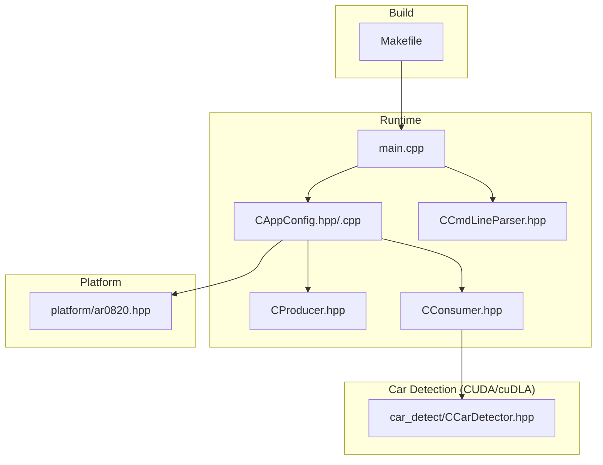
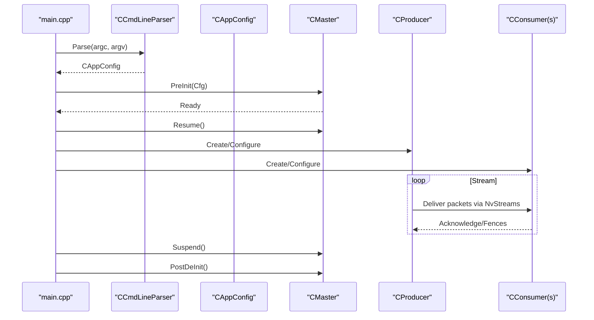

# Getting Started

<cite>
**Referenced Files in This Document**
- [README.md](file://README.md)
- [ReleaseNote.md](file://ReleaseNote.md)
- [Makefile](file://Makefile)
- [main.cpp](file://main.cpp)
- [Common.hpp](file://Common.hpp)
- [CCmdLineParser.hpp](file://CCmdLineParser.hpp)
- [CAppConfig.hpp](file://CAppConfig.hpp)
- [CAppConfig.cpp](file://CAppConfig.cpp)
- [CProducer.hpp](file://CProducer.hpp)
- [CConsumer.hpp](file://CConsumer.hpp)
- [platform/ar0820.hpp](file://platform/ar0820.hpp)
- [car_detect/CCarDetector.hpp](file://car_detect/CCarDetector.hpp)
</cite>

## Table of Contents
1. [Introduction](#introduction)
2. [Project Structure](#project-structure)
3. [Prerequisites](#prerequisites)
4. [Installation](#installation)
5. [Quick Start](#quick-start)
6. [Essential Command-Line Parameters](#essential-command-line-parameters)
7. [Architecture Overview](#architecture-overview)
8. [Verification Steps](#verification-steps)
9. [Troubleshooting Guide](#troubleshooting-guide)
10. [Conclusion](#conclusion)

## Introduction
This guide helps you quickly set up and run the NVIDIA SIPL Multicast sample. It covers prerequisites, building from source, environment setup, and running examples for intra-process usage with a single camera and multiple consumers. It also documents key command-line parameters, provides architecture insights, and offers troubleshooting tips and verification steps.

## Project Structure
The multicast sample demonstrates sending live camera outputs to multiple consumers via NvStreams. It supports intra-process, inter-process (peer-to-peer), inter-chip (C2C), and late/re-attach scenarios. Consumers include CUDA, encoder, display, and stitching.

**Diagram sources**
- [Makefile:1-105](file://Makefile#L1-L105)
- [main.cpp:253-304](file://main.cpp#L253-L304)
- [CAppConfig.hpp:19-83](file://CAppConfig.hpp#L19-L83)
- [CAppConfig.cpp:1-100](file://CAppConfig.cpp#L1-L100)
- [CCmdLineParser.hpp:34-47](file://CCmdLineParser.hpp#L34-L47)
- [CProducer.hpp:16-53](file://CProducer.hpp#L16-L53)
- [CConsumer.hpp:16-45](file://CConsumer.hpp#L16-L45)
- [platform/ar0820.hpp:14-186](file://platform/ar0820.hpp#L14-L186)
- [car_detect/CCarDetector.hpp:17-34](file://car_detect/CCarDetector.hpp#L17-L34)

**Section sources**
- [README.md:11-109](file://README.md#L11-L109)
- [Makefile:1-105](file://Makefile#L1-L105)
- [main.cpp:253-304](file://main.cpp#L253-L304)
- [CAppConfig.hpp:19-83](file://CAppConfig.hpp#L19-L83)
- [CAppConfig.cpp:1-100](file://CAppConfig.cpp#L1-L100)
- [CCmdLineParser.hpp:34-47](file://CCmdLineParser.hpp#L34-L47)
- [CProducer.hpp:16-53](file://CProducer.hpp#L16-L53)
- [CConsumer.hpp:16-45](file://CConsumer.hpp#L16-L45)
- [platform/ar0820.hpp:14-186](file://platform/ar0820.hpp#L14-L186)
- [car_detect/CCarDetector.hpp:17-34](file://car_detect/CCarDetector.hpp#L17-L34)

## Prerequisites
- NVIDIA platform with supported drivers and runtime libraries
- CUDA Toolkit installed and discoverable by the build system
- NVIDIA SIPL libraries and related SDK components available on the target system
- Optional: cuDLA/cuDLA runtime for car detection features
- Optional: Display stack and OpenWFD controller for display stitching

Notes:
- The project integrates with platform-specific build definitions and SDK paths via the Makefile.
- Some features require non-safety builds and optional query libraries.

**Section sources**
- [Makefile:9-17](file://Makefile#L9-L17)
- [Makefile:44-67](file://Makefile#L44-L67)
- [CAppConfig.cpp:11-50](file://CAppConfig.cpp#L11-L50)

## Installation
Follow these steps to compile and install the sample:

1. Build the project
   - Use the provided Makefile to compile the sample.
   - The Makefile links against NVIDIA-provided libraries including SIPL, NvMedia, NvSciBuf/Sync/Stream, CUDA/cuDLA, and platform-specific components.

2. Verify dependencies
   - Ensure CUDA runtime and cuDLA libraries are present on the target system.
   - Confirm that platform configuration headers (e.g., AR0820) are available in the platform directory.

3. Optional: Build car detection components
   - The car detection path is conditionally included for non-QNX targets and requires CUDA/cuDLA toolchain.

4. Optional: Power manager service (Linux)
   - A minimal power manager service binary is built on Linux targets.

**Section sources**
- [Makefile:23-93](file://Makefile#L23-L93)
- [Makefile:68-82](file://Makefile#L68-L82)
- [Makefile:95-104](file://Makefile#L95-L104)
- [platform/ar0820.hpp:14-186](file://platform/ar0820.hpp#L14-L186)

## Quick Start
Run the sample in intra-process mode with a single camera and multiple consumers:

- Start the producer, CUDA consumer, and encoder consumer in a single process:
  - ./nvsipl_multicast

- Show version:
  - ./nvsipl_multicast -V

- Dump .yuv and .h264 files:
  - ./nvsipl_multicast -f

- Process every k-th frame:
  - ./nvsipl_multicast -k 2

- Run for a specific duration (seconds):
  - ./nvsipl_multicast -r 5

- List available platform configurations:
  - ./nvsipl_multicast -l

- Run with a dynamic platform configuration on non-safety OS:
  - ./nvsipl_multicast -g F008A120RM0AV2_CPHY_x4 -m "1 0 0 0"

- Specify a static platform configuration:
  - ./nvsipl_multicast -t F008A120RM0AV2_CPHY_x4

- Enable camera stitching and display:
  - ./nvsipl_multicast -d

- Enable multiple ISP outputs and use multiple elements:
  - ./nvsipl_multicast -e

Inter-process (P2P) and inter-chip (C2C) examples are documented in the README with producer/consumer process commands and peer validation notes.

**Section sources**
- [README.md:16-109](file://README.md#L16-L109)

## Essential Command-Line Parameters
The application parses command-line arguments to configure runtime behavior. Key parameters include:

- Version and help
  - -V: Show version
  - -h: Help (usage information)

- Runtime behavior
  - -f: Enable file dumping (YUV/H.264)
  - -k: Frame filter (process every k-th frame)
  - -r: Run duration in seconds
  - -l: List available platform configurations
  - -q: Queue type selection (mailbox/fifo)
  - -e: Enable multiple ISP outputs and multiple elements
  - -d: Enable stitching and display
  - -p: Producer mode (inter-process)
  - -c: Consumer type selector (e.g., "cuda", "enc")
  - -C: Consumer mode (inter-chip)
  - --late-attach: Enable late/re-attach support

- Platform configuration
  - -g: Dynamic platform configuration name
  - -m: Mask specification for dynamic configuration
  - -t: Static platform configuration name
  - -n: NITO folder path (platform configuration storage)

- Logging and boot
  - -v: Verbosity level
  - -7: SC7 boot mode (requires power manager service)

- Consumer-specific
  - -N: Number of consumers
  - -i: Consumer index
  - -D: Enable DPMST display

These parameters are parsed and applied to the application configuration, which controls producer/consumer creation and pipeline behavior.

**Section sources**
- [README.md:16-109](file://README.md#L16-L109)
- [CCmdLineParser.hpp:34-47](file://CCmdLineParser.hpp#L34-L47)
- [CAppConfig.hpp:22-80](file://CAppConfig.hpp#L22-L80)
- [CAppConfig.cpp:11-50](file://CAppConfig.cpp#L11-L50)

## Architecture Overview
The sample orchestrates producers and consumers over NvStreams with NvSciBuf/NvSciSync for synchronization and IPC/C2C channels for transport. The main entry initializes configuration, sets up signal handlers, and manages lifecycle events.

**Diagram sources**
- [main.cpp:253-304](file://main.cpp#L253-L304)
- [CCmdLineParser.hpp:34-47](file://CCmdLineParser.hpp#L34-L47)
- [CAppConfig.hpp:19-83](file://CAppConfig.hpp#L19-L83)
- [CProducer.hpp:16-53](file://CProducer.hpp#L16-L53)
- [CConsumer.hpp:16-45](file://CConsumer.hpp#L16-L45)

## Verification Steps
To confirm successful installation and basic functionality:

- Build verification
  - Ensure the binary nvsipl_multicast is produced after running make.

- Basic intra-process run
  - Launch the sample without arguments to verify producer/consumer pipeline initialization and streaming.

- Parameter checks
  - Use -V to confirm version output.
  - Use -h to review usage and available options.
  - Use -l to list platform configurations and confirm availability of platform headers.

- Dump and frame filtering
  - Run with -f and -k to verify file dumping and frame skipping behavior.

- Duration and masks
  - Run with -r to test finite-duration operation.
  - Run with -g and -m to validate dynamic configuration loading.

- Display and stitching
  - Run with -d to verify stitching and display pipeline initialization.

- Car detection (optional)
  - Build with car detection enabled and run with appropriate consumer flags to validate cuDLA inference path.

**Section sources**
- [README.md:16-109](file://README.md#L16-L109)
- [Makefile:23-93](file://Makefile#L23-L93)
- [CAppConfig.cpp:11-50](file://CAppConfig.cpp#L11-L50)

## Troubleshooting Guide
Common issues and resolutions:

- Missing CUDA/cuDLA runtime
  - Symptom: Linker or runtime errors related to CUDA/cuDLA.
  - Resolution: Ensure CUDA toolkit and cuDLA libraries are installed and visible to the linker.

- Platform configuration not found
  - Symptom: Errors indicating missing platform configuration or inability to parse database.
  - Resolution: Provide a valid static configuration (-t) or dynamic configuration (-g with -m). Confirm platform headers exist in the platform directory.

- Inter-process or inter-chip mismatch
  - Symptom: Consumers fail to attach or peer validation fails.
  - Resolution: Ensure producer and consumers use consistent platform configuration and masks. Peer validation enforces consistency across processes.

- Late/re-attach not working
  - Symptom: Late consumer attachment/detachment commands do not take effect.
  - Resolution: Verify late-attach mode is enabled on producer and consumers. Use the interactive commands 'at' and 'de' as documented.

- Display or stitching performance issues
  - Symptom: Stuttering or dropped frames during stitching.
  - Resolution: Reduce the number of cameras being stitched or adjust frame processing rate.

- Power manager service (Linux)
  - Symptom: Application waits for power manager events without response.
  - Resolution: Ensure the pm_service is running and reachable via the UNIX socket path used by the application.

**Section sources**
- [README.md:47-91](file://README.md#L47-L91)
- [CAppConfig.cpp:11-50](file://CAppConfig.cpp#L11-L50)
- [main.cpp:74-153](file://main.cpp#L74-L153)
- [main.cpp:155-251](file://main.cpp#L155-L251)

## Conclusion
You now have the essentials to build, configure, and run the NVIDIA SIPL Multicast sample. Start with the intra-process example, verify parameters and platform configuration, and expand to inter-process and inter-chip scenarios as needed. Use the troubleshooting guide to resolve common setup issues and rely on the verification steps to confirm correct operation.