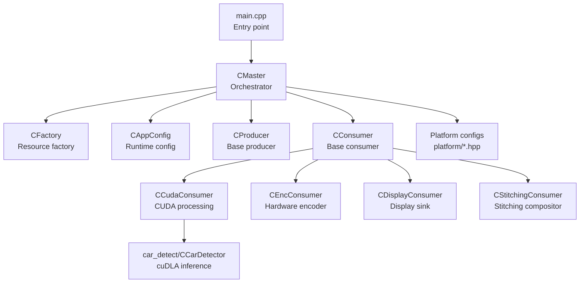
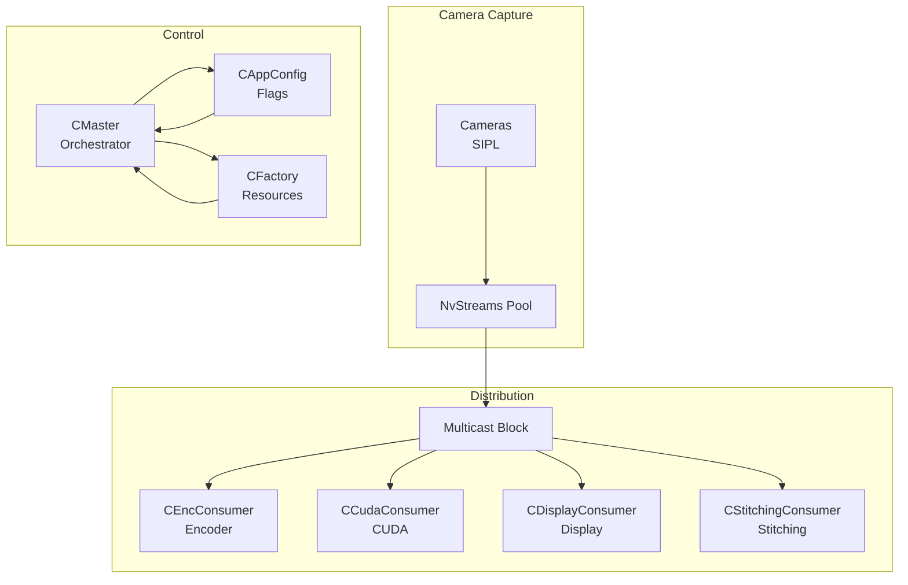
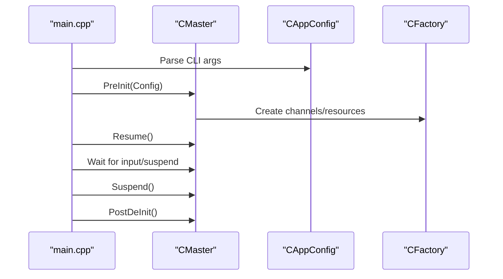
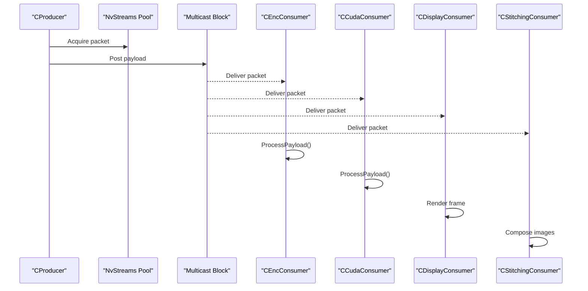
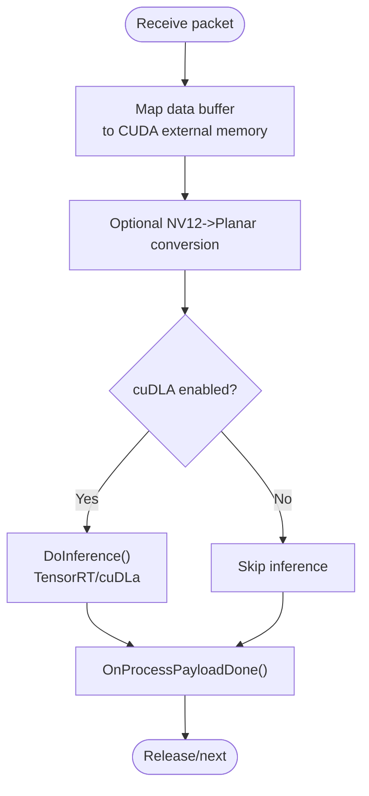
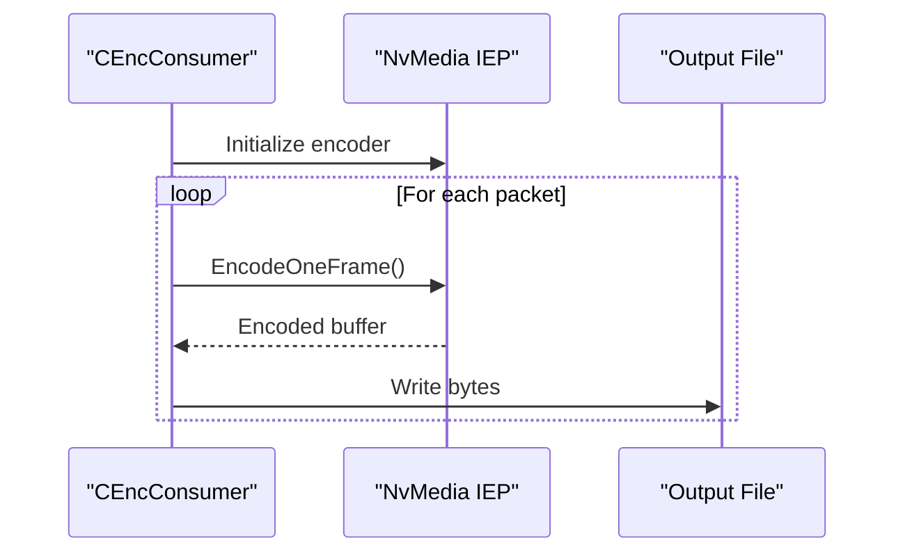
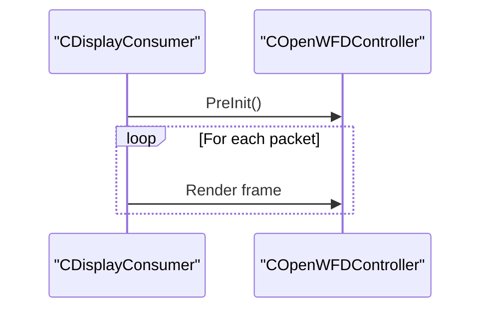
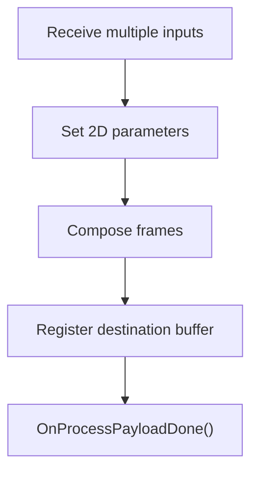
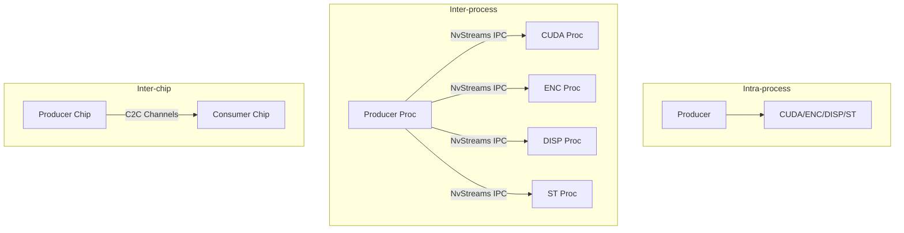
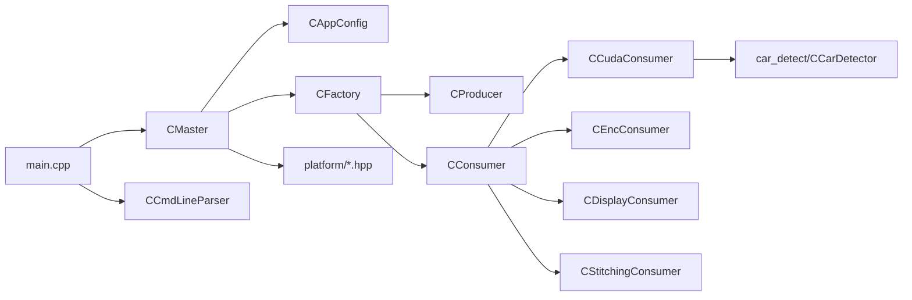

# Project Overview

<cite>
**Referenced Files in This Document**
- [README.md](file://README.md)
- [main.cpp](file://main.cpp)
- [CMaster.hpp](file://CMaster.hpp)
- [CAppConfig.hpp](file://CAppConfig.hpp)
- [Common.hpp](file://Common.hpp)
- [CFactory.hpp](file://CFactory.hpp)
- [CProducer.hpp](file://CProducer.hpp)
- [CConsumer.hpp](file://CConsumer.hpp)
- [CCudaConsumer.hpp](file://CCudaConsumer.hpp)
- [CEncConsumer.hpp](file://CEncConsumer.hpp)
- [CDisplayConsumer.hpp](file://CDisplayConsumer.hpp)
- [CStitchingConsumer.hpp](file://CStitchingConsumer.hpp)
- [CCmdLineParser.hpp](file://CCmdLineParser.hpp)
- [car_detect/CCarDetector.hpp](file://car_detect/CCarDetector.hpp)
- [platform/ar0820.hpp](file://platform/ar0820.hpp)
</cite>

## Table of Contents
1. [Introduction](#introduction)
2. [Project Structure](#project-structure)
3. [Core Components](#core-components)
4. [Architecture Overview](#architecture-overview)
5. [Detailed Component Analysis](#detailed-component-analysis)
6. [Dependency Analysis](#dependency-analysis)
7. [Performance Considerations](#performance-considerations)
8. [Troubleshooting Guide](#troubleshooting-guide)
9. [Conclusion](#conclusion)
10. [Appendices](#appendices)

## Introduction
NVIDIA SIPL Multicast is a high-performance video streaming sample that demonstrates distributing live camera feeds to multiple consumers simultaneously using NVIDIA’s NvStreams infrastructure. It supports multi-camera capture (up to 16 cameras), multi-consumer distribution (CUDA, encoder, display, stitching), real-time GPU-accelerated processing, and flexible communication modes (intra-process, inter-process, inter-chip). The project targets embedded vision developers and NVIDIA platform users who need scalable, low-latency camera data pipelines.

Key capabilities:
- Multi-camera support: up to 16 sensors with configurable ISP outputs per sensor.
- Multi-consumer distribution: CUDA processing, hardware encoder, display, and stitching.
- Real-time GPU acceleration: CUDA streams, cuDLa inference, and NvMedia 2D compositing.
- Flexible communication: intra-process, inter-process (peer-to-peer), and inter-chip (C2C) via NvStreams channels.
- Practical usage: command-line driven with extensive runtime controls and platform configuration options.

## Project Structure
The project is organized around a modular architecture:
- Application entry and orchestration: main application lifecycle, signal handling, and console/IPC event loops.
- Configuration and command-line parsing: runtime flags controlling platform, consumers, queues, and communication modes.
- Pipeline orchestration: master controller that initializes producers/consumers, manages channels, and coordinates stitching/display.
- Producer/consumer abstractions: base classes and specialized implementations for CUDA, encoder, display, and stitching.
- Factory and resource management: creation and lifecycle of NvStreams blocks, IPC endpoints, and synchronization primitives.
- Platform definitions: static platform configurations for supported sensors and boards.
- Optional AI inference: cuDLA-based car detection pipeline integrated with CUDA consumers.

**Diagram sources**
- [main.cpp:253-304](file://main.cpp#L253-L304)
- [CMaster.hpp:47-95](file://CMaster.hpp#L47-L95)
- [CFactory.hpp:27-95](file://CFactory.hpp#L27-L95)
- [CAppConfig.hpp:19-83](file://CAppConfig.hpp#L19-L83)
- [CProducer.hpp:16-53](file://CProducer.hpp#L16-L53)
- [CConsumer.hpp:16-45](file://CConsumer.hpp#L16-L45)
- [CCudaConsumer.hpp:25-81](file://CCudaConsumer.hpp#L25-L81)
- [CEncConsumer.hpp:17-66](file://CEncConsumer.hpp#L17-L66)
- [CDisplayConsumer.hpp:15-49](file://CDisplayConsumer.hpp#L15-L49)
- [CStitchingConsumer.hpp:17-74](file://CStitchingConsumer.hpp#L17-L74)
- [car_detect/CCarDetector.hpp:17-34](file://car_detect/CCarDetector.hpp#L17-L34)
- [platform/ar0820.hpp:14-186](file://platform/ar0820.hpp#L14-L186)

**Section sources**
- [README.md:11-109](file://README.md#L11-L109)
- [main.cpp:253-304](file://main.cpp#L253-L304)
- [CAppConfig.hpp:19-83](file://CAppConfig.hpp#L19-L83)
- [Common.hpp:35-87](file://Common.hpp#L35-L87)

## Core Components
- Application configuration and command-line parsing:
  - Runtime flags control verbosity, platform configuration, consumer type, queue type, multi-element mode, late-attach, SC7 boot, frame filtering, and run duration.
  - Example flags include enabling stitching display, multi-ISP outputs, dynamic/static platform configs, and dumping frames to files.
- Master controller:
  - Initializes and runs the pipeline, handles suspend/resume, attaches/detaches consumers (late-attach), and manages display/stitching.
- Producer/consumer abstractions:
  - Base classes define payload handling, fence/sync registration, and buffer mapping contracts.
  - Specialized consumers implement CUDA processing, hardware encoding, display rendering, and image stitching.
- Factory and resources:
  - Creates pools, queues, multicast blocks, present sync, and IPC/C2C endpoints for inter-process and inter-chip scenarios.
- Platform configurations:
  - Static platform descriptors define sensor counts, CSI lanes, serializers, and resolutions for supported hardware.

Practical usage highlights:
- Intra-process: single-process producer and consumers.
- Inter-process (P2P): separate producer and consumer processes with peer validation.
- Inter-chip (C2C): producer/consumer across chips via PCIe channels.
- Late-attach: attach/detach consumers after pipeline start.
- Car detection: optional cuDLA inference integrated with CUDA consumer.

**Section sources**
- [CAppConfig.hpp:19-83](file://CAppConfig.hpp#L19-L83)
- [CCmdLineParser.hpp:34-47](file://CCmdLineParser.hpp#L34-L47)
- [CMaster.hpp:47-95](file://CMaster.hpp#L47-L95)
- [CProducer.hpp:16-53](file://CProducer.hpp#L16-L53)
- [CConsumer.hpp:16-45](file://CConsumer.hpp#L16-L45)
- [CFactory.hpp:27-95](file://CFactory.hpp#L27-L95)
- [Common.hpp:14-34](file://Common.hpp#L14-L34)
- [README.md:16-109](file://README.md#L16-L109)

## Architecture Overview
The system orchestrates camera capture through NVIDIA SIPL, then distributes frames via NvStreams to multiple consumers. The master controller sets up channels, creates producers/consumers, and coordinates synchronization. Consumers operate independently on GPU resources for processing, encoding, display, or stitching.

**Diagram sources**
- [CMaster.hpp:47-95](file://CMaster.hpp#L47-L95)
- [CFactory.hpp:27-95](file://CFactory.hpp#L27-L95)
- [CProducer.hpp:16-53](file://CProducer.hpp#L16-L53)
- [CConsumer.hpp:16-45](file://CConsumer.hpp#L16-L45)
- [CEncConsumer.hpp:17-66](file://CEncConsumer.hpp#L17-L66)
- [CCudaConsumer.hpp:25-81](file://CCudaConsumer.hpp#L25-L81)
- [CDisplayConsumer.hpp:15-49](file://CDisplayConsumer.hpp#L15-L49)
- [CStitchingConsumer.hpp:17-74](file://CStitchingConsumer.hpp#L17-L74)

## Detailed Component Analysis

### Master Orchestration
The master controller initializes logging, parses configuration, resumes the pipeline, and manages user input and suspend/resume events. It also supports late-attach operations for consumers.

**Diagram sources**
- [main.cpp:253-304](file://main.cpp#L253-L304)
- [CMaster.hpp:55-64](file://CMaster.hpp#L55-L64)
- [CAppConfig.hpp:19-83](file://CAppConfig.hpp#L19-L83)
- [CFactory.hpp:27-95](file://CFactory.hpp#L27-L95)

**Section sources**
- [main.cpp:74-153](file://main.cpp#L74-L153)
- [main.cpp:155-251](file://main.cpp#L155-L251)
- [CMaster.hpp:47-95](file://CMaster.hpp#L47-L95)

### Producer-Consumer Distribution
The producer posts camera frames to a multicast NvStreams block; consumers receive and process them asynchronously. Synchronization fences and waiters coordinate GPU operations.

**Diagram sources**
- [CProducer.hpp:24-51](file://CProducer.hpp#L24-L51)
- [CConsumer.hpp:25-43](file://CConsumer.hpp#L25-L43)
- [CEncConsumer.hpp:24-64](file://CEncConsumer.hpp#L24-L64)
- [CCudaConsumer.hpp:35-78](file://CCudaConsumer.hpp#L35-L78)
- [CDisplayConsumer.hpp:24-47](file://CDisplayConsumer.hpp#L24-L47)
- [CStitchingConsumer.hpp:34-72](file://CStitchingConsumer.hpp#L34-L72)

**Section sources**
- [CProducer.hpp:16-53](file://CProducer.hpp#L16-L53)
- [CConsumer.hpp:16-45](file://CConsumer.hpp#L16-L45)

### CUDA Consumer (GPU Processing and Inference)
The CUDA consumer maps buffers to CUDA external memory, performs conversions and optional inference, and signals completion via NvSciSync fences.

**Diagram sources**
- [CCudaConsumer.hpp:35-78](file://CCudaConsumer.hpp#L35-L78)
- [car_detect/CCarDetector.hpp:17-34](file://car_detect/CCarDetector.hpp#L17-L34)

**Section sources**
- [CCudaConsumer.hpp:25-81](file://CCudaConsumer.hpp#L25-L81)
- [car_detect/CCarDetector.hpp:17-34](file://car_detect/CCarDetector.hpp#L17-L34)

### Encoder Consumer (Hardware Encoding)
The encoder consumer initializes NvMedia IEP, encodes frames to H.264, and writes encoded output.

**Diagram sources**
- [CEncConsumer.hpp:24-64](file://CEncConsumer.hpp#L24-L64)

**Section sources**
- [CEncConsumer.hpp:17-66](file://CEncConsumer.hpp#L17-L66)

### Display Consumer (Rendering)
The display consumer registers with a WFD controller and renders frames to the display pipeline.

**Diagram sources**
- [CDisplayConsumer.hpp:21-47](file://CDisplayConsumer.hpp#L21-L47)

**Section sources**
- [CDisplayConsumer.hpp:15-49](file://CDisplayConsumer.hpp#L15-L49)

### Stitching Consumer (Image Composition)
The stitching consumer composes multiple input frames into a single output using NvMedia 2D composition.

**Diagram sources**
- [CStitchingConsumer.hpp:34-72](file://CStitchingConsumer.hpp#L34-L72)

**Section sources**
- [CStitchingConsumer.hpp:17-74](file://CStitchingConsumer.hpp#L17-L74)

### Communication Modes
- Intra-process: producer and consumers run in a single process.
- Inter-process (P2P): producer and consumers are separate processes sharing NvStreams channels; peer validation ensures consistent platform configuration.
- Inter-chip (C2C): channels are created across chips with predefined prefixes for source and destination endpoints.

**Diagram sources**
- [Common.hpp:31-34](file://Common.hpp#L31-L34)
- [CFactory.hpp:52-76](file://CFactory.hpp#L52-L76)
- [README.md:47-79](file://README.md#L47-L79)

**Section sources**
- [Common.hpp:35-40](file://Common.hpp#L35-L40)
- [CFactory.hpp:52-76](file://CFactory.hpp#L52-L76)
- [README.md:47-79](file://README.md#L47-L79)

## Dependency Analysis
The codebase exhibits clear separation of concerns:
- Entry point depends on master controller and command-line parser.
- Master controller depends on configuration, factory, and platform definitions.
- Factory creates producers/consumers and NvStreams resources.
- Consumers depend on CUDA/cuDLa/NvMedia libraries for GPU operations.
- Platform headers define hardware-specific configurations.

**Diagram sources**
- [main.cpp:253-304](file://main.cpp#L253-L304)
- [CMaster.hpp:47-95](file://CMaster.hpp#L47-L95)
- [CCmdLineParser.hpp:34-47](file://CCmdLineParser.hpp#L34-L47)
- [CFactory.hpp:27-95](file://CFactory.hpp#L27-L95)
- [CProducer.hpp:16-53](file://CProducer.hpp#L16-L53)
- [CConsumer.hpp:16-45](file://CConsumer.hpp#L16-L45)
- [CCudaConsumer.hpp:25-81](file://CCudaConsumer.hpp#L25-L81)
- [CEncConsumer.hpp:17-66](file://CEncConsumer.hpp#L17-L66)
- [CDisplayConsumer.hpp:15-49](file://CDisplayConsumer.hpp#L15-L49)
- [CStitchingConsumer.hpp:17-74](file://CStitchingConsumer.hpp#L17-L74)
- [car_detect/CCarDetector.hpp:17-34](file://car_detect/CCarDetector.hpp#L17-L34)
- [platform/ar0820.hpp:14-186](file://platform/ar0820.hpp#L14-L186)

**Section sources**
- [main.cpp:253-304](file://main.cpp#L253-L304)
- [CMaster.hpp:47-95](file://CMaster.hpp#L47-L95)
- [CFactory.hpp:27-95](file://CFactory.hpp#L27-L95)

## Performance Considerations
- Multi-camera scaling: up to 16 sensors with up to 4 ISP outputs per sensor enable high-throughput pipelines.
- GPU acceleration: CUDA streams and cuDLa offload compute-intensive tasks; ensure proper fence signaling to avoid stalls.
- Inter-process/inter-chip overhead: IPC/C2C channels add latency; minimize cross-boundary copies and align buffer formats.
- Frame filtering: skip frames selectively to reduce load during heavy processing.
- Display/stitching: stitching and display introduce CPU/GPU work; tune resolution and FPS to match platform capabilities.

[No sources needed since this section provides general guidance]

## Troubleshooting Guide
- Suspend/Resume: use console commands to pause and resume the pipeline for safe reconfiguration.
- Late-attach: attach or detach consumers dynamically; ensure peer validation matches producer configuration.
- Logging and verbosity: increase verbosity to diagnose initialization and runtime issues.
- Platform configuration mismatches: inter-process and inter-chip require consistent platform settings; peer validation enforces this.

**Section sources**
- [main.cpp:74-153](file://main.cpp#L74-L153)
- [main.cpp:155-251](file://main.cpp#L155-L251)
- [README.md:47-92](file://README.md#L47-L92)

## Conclusion
NVIDIA SIPL Multicast delivers a production-ready, GPU-accelerated video streaming framework supporting multi-camera, multi-consumer pipelines across intra-process, inter-process, and inter-chip environments. Its modular design integrates seamlessly with NVIDIA technologies (SIPL, NvStreams, CUDA/cuDLa, NvMedia) to enable scalable embedded vision applications.

[No sources needed since this section summarizes without analyzing specific files]

## Appendices

### Target Audience
- Embedded vision developers building camera-centric systems.
- NVIDIA platform users leveraging SIPL and NvStreams for high-throughput pipelines.

### Practical Examples
- Intra-process: run producer and consumers in a single process for development and testing.
- Inter-process: split producer and consumers into separate processes with peer validation.
- Inter-chip: deploy across chips using C2C channels for distributed processing.
- Late-attach: dynamically attach/detach consumers after pipeline start.
- Car detection: integrate cuDLA inference with CUDA consumer for AI-powered analytics.

**Section sources**
- [README.md:16-109](file://README.md#L16-L109)

### Platform Configuration Reference
- Static platform descriptors define sensor count, CSI lanes, serializer/deserializer info, and resolution/fps for supported hardware.

**Section sources**
- [platform/ar0820.hpp:14-186](file://platform/ar0820.hpp#L14-L186)