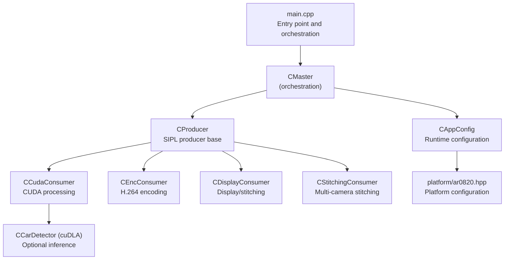
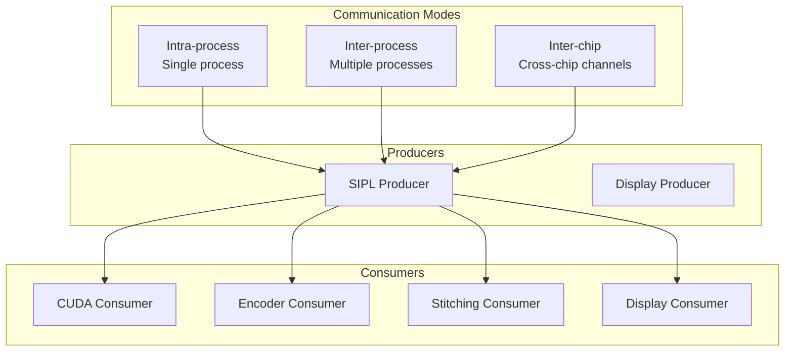
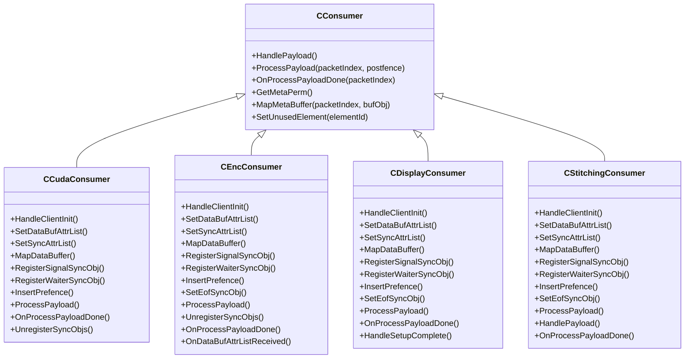
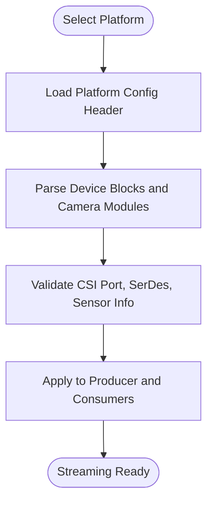
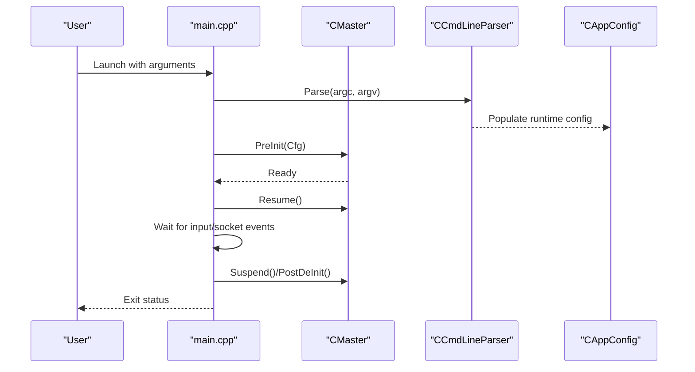
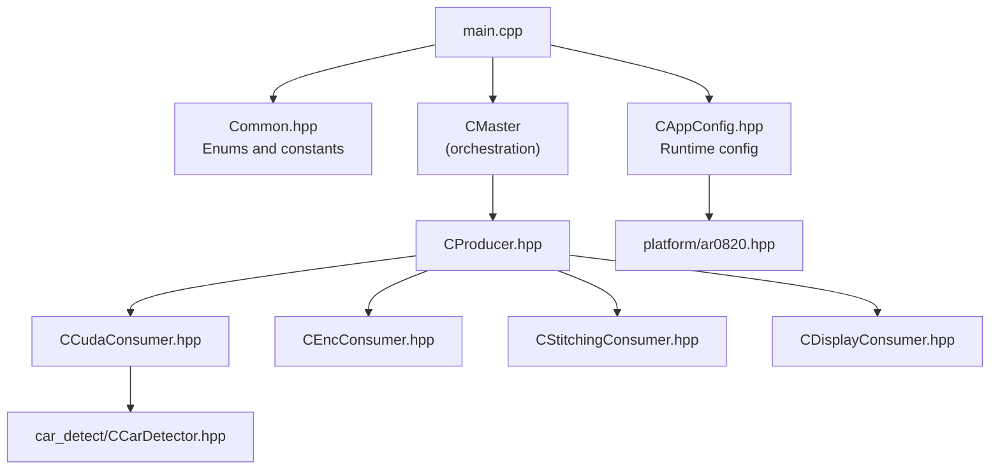

# Target Audience

<cite>
**Referenced Files in This Document**
- [README.md](file://README.md)
- [ReleaseNote.md](file://ReleaseNote.md)
- [main.cpp](file://main.cpp)
- [Common.hpp](file://Common.hpp)
- [CAppConfig.hpp](file://CAppConfig.hpp)
- [CProducer.hpp](file://CProducer.hpp)
- [CConsumer.hpp](file://CConsumer.hpp)
- [CCudaConsumer.hpp](file://CCudaConsumer.hpp)
- [CEncConsumer.hpp](file://CEncConsumer.hpp)
- [CDisplayConsumer.hpp](file://CDisplayConsumer.hpp)
- [CStitchingConsumer.hpp](file://CStitchingConsumer.hpp)
- [car_detect/CCarDetector.hpp](file://car_detect/CCarDetector.hpp)
- [platform/ar0820.hpp](file://platform/ar0820.hpp)
</cite>

## Table of Contents
1. [Introduction](#introduction)
2. [Project Structure](#project-structure)
3. [Core Components](#core-components)
4. [Architecture Overview](#architecture-overview)
5. [Detailed Component Analysis](#detailed-component-analysis)
6. [Dependency Analysis](#dependency-analysis)
7. [Performance Considerations](#performance-considerations)
8. [Troubleshooting Guide](#troubleshooting-guide)
9. [Conclusion](#conclusion)
10. [Appendices](#appendices)

## Introduction
This document defines the target audience for the NVIDIA SIPL Multicast project. It identifies primary users, outlines skill and technical prerequisites, and explains practical use cases across automotive, surveillance, robotics, and industrial automation domains. The content is grounded in the repository’s capabilities, supported platforms, and consumer types demonstrated by the codebase.

## Project Structure
The project demonstrates multi-camera streaming and multi-consumer pipelines using NVIDIA’s Streaming Image Pipeline (SIPL) and NvStreams. It supports intra-process, inter-process, and inter-chip communication modes, and includes consumers for CUDA processing, H.264 encoding, display/stitching, and optional inference on cuDLA.

**Diagram sources**
- [main.cpp:253-304](file://main.cpp#L253-L304)
- [CAppConfig.hpp:19-83](file://CAppConfig.hpp#L19-L83)
- [CProducer.hpp:16-53](file://CProducer.hpp#L16-L53)
- [CCudaConsumer.hpp:25-81](file://CCudaConsumer.hpp#L25-L81)
- [CEncConsumer.hpp:17-66](file://CEncConsumer.hpp#L17-L66)
- [CDisplayConsumer.hpp:15-49](file://CDisplayConsumer.hpp#L15-L49)
- [CStitchingConsumer.hpp:17-74](file://CStitchingConsumer.hpp#L17-L74)
- [car_detect/CCarDetector.hpp:17-34](file://car_detect/CCarDetector.hpp#L17-L34)
- [platform/ar0820.hpp:14-186](file://platform/ar0820.hpp#L14-L186)

**Section sources**
- [README.md:11-109](file://README.md#L11-L109)
- [main.cpp:253-304](file://main.cpp#L253-L304)
- [Common.hpp:35-87](file://Common.hpp#L35-L87)
- [CAppConfig.hpp:19-83](file://CAppConfig.hpp#L19-L83)
- [platform/ar0820.hpp:14-186](file://platform/ar0820.hpp#L14-L186)

## Core Components
- Embedded vision developers: Build and tune multi-camera pipelines, manage SIPL producers and multiple consumers.
- NVIDIA platform engineers: Configure platform-specific sensor/serializer/deserializer topologies and validate streaming paths.
- System integrators: Assemble end-to-end solutions integrating CUDA, encoding, display, and optional inference.

Skill and technical prerequisites:
- C++ programming proficiency: The codebase is C++-centric with modern constructs and extensive use of smart pointers and RAII.
- CUDA development experience: Consumers and inference modules rely on CUDA runtime and external memory/synchronization primitives.
- Familiarity with NVIDIA platform technologies: SIPL, NvMedia, NvSciBuf/NvSciSync, NvStreams, and cuDLA APIs are integral to functionality.
- Understanding of real-time constraints: Synchronization via NvSciSync fences and CPU waits is used to coordinate producers and consumers.

Use cases:
- Automotive vision systems: Multi-camera stitching, display, and optional inference for driver assistance or autonomous driving scenarios.
- Surveillance applications: Multi-channel recording via encoders and real-time display/stitching for monitoring.
- Robotics: Real-time CUDA-based perception tasks (e.g., object detection) integrated with streaming pipelines.
- Industrial automation: High-throughput multi-camera inspection with encoding and downstream AI inference.

**Section sources**
- [README.md:11-109](file://README.md#L11-L109)
- [CCudaConsumer.hpp:25-81](file://CCudaConsumer.hpp#L25-L81)
- [CEncConsumer.hpp:17-66](file://CEncConsumer.hpp#L17-L66)
- [CDisplayConsumer.hpp:15-49](file://CDisplayConsumer.hpp#L15-L49)
- [CStitchingConsumer.hpp:17-74](file://CStitchingConsumer.hpp#L17-L74)
- [car_detect/CCarDetector.hpp:17-34](file://car_detect/CCarDetector.hpp#L17-L34)

## Architecture Overview
The system supports three communication modes:
- Intra-process: Single process hosting producer and multiple consumers.
- Inter-process: Producer and consumers run as separate processes communicating over NvStreams.
- Inter-chip: Producer and consumers span chips, using dedicated C2C channels.

**Diagram sources**
- [README.md:21-79](file://README.md#L21-L79)
- [Common.hpp:35-66](file://Common.hpp#L35-L66)
- [CProducer.hpp:16-53](file://CProducer.hpp#L16-L53)
- [CConsumer.hpp:16-45](file://CConsumer.hpp#L16-L45)

## Detailed Component Analysis

### Target Users and Use Cases
- Embedded vision developers: Implement multi-camera pipelines, configure consumers, and integrate inference.
- NVIDIA platform engineers: Validate platform configurations, tune sensor/serializer/deserializer setups, and ensure timing correctness.
- System integrators: Assemble multi-process deployments, manage inter-process synchronization, and deploy to automotive or industrial environments.

Practical scenarios:
- Automotive: Multi-camera stitching and display with optional car detection via cuDLA.
- Surveillance: Recording multiple streams to H.264 while previewing on display.
- Robotics: Real-time CUDA inference on live camera feeds.
- Industrial automation: Multi-camera inspection with downstream analytics.

**Section sources**
- [README.md:11-109](file://README.md#L11-L109)
- [ReleaseNote.md:11-118](file://ReleaseNote.md#L11-L118)

### Skill and Technical Prerequisites
- C++: Extensive use of classes, smart pointers, RAII, and STL containers.
- CUDA: Required for CUDA consumer and optional cuDLA inference, including external memory and semaphore handling.
- NVIDIA platform APIs: SIPL, NvMedia, NvSciBuf/NvSciSync, NvStreams, and cuDLA.
- Real-time systems: Understanding of synchronization primitives and CPU waits to coordinate streaming.

Recommended background:
- Experience with multi-process and cross-chip communication patterns.
- Familiarity with platform configuration headers and sensor topologies.
- Knowledge of H.264 encoding and display composition APIs.

**Section sources**
- [CCudaConsumer.hpp:25-81](file://CCudaConsumer.hpp#L25-L81)
- [CEncConsumer.hpp:17-66](file://CEncConsumer.hpp#L17-L66)
- [CDisplayConsumer.hpp:15-49](file://CDisplayConsumer.hpp#L15-L49)
- [CStitchingConsumer.hpp:17-74](file://CStitchingConsumer.hpp#L17-L74)
- [car_detect/CCarDetector.hpp:17-34](file://car_detect/CCarDetector.hpp#L17-L34)

### Consumer Types and Capabilities
- CUDA Consumer: Performs GPU-side processing and optional inference using CUDA and cuDLA.
- Encoder Consumer: Encodes video streams to H.264 using NvMedia IEP.
- Display/Stitching Consumers: Compose and render multi-camera views to displays or downstream components.

**Diagram sources**
- [CConsumer.hpp:16-45](file://CConsumer.hpp#L16-L45)
- [CCudaConsumer.hpp:25-81](file://CCudaConsumer.hpp#L25-L81)
- [CEncConsumer.hpp:17-66](file://CEncConsumer.hpp#L17-L66)
- [CDisplayConsumer.hpp:15-49](file://CDisplayConsumer.hpp#L15-L49)
- [CStitchingConsumer.hpp:17-74](file://CStitchingConsumer.hpp#L17-L74)

### Platform Configuration and Hardware Topology
The project includes platform configuration headers that define sensor, serializer, deserializer, and CSI/DPHY characteristics. These are essential for configuring the producer and ensuring compatibility across devices.

**Diagram sources**
- [platform/ar0820.hpp:14-186](file://platform/ar0820.hpp#L14-L186)

**Section sources**
- [platform/ar0820.hpp:14-186](file://platform/ar0820.hpp#L14-L186)

### Command-Line and Runtime Orchestration
The application exposes a rich CLI for selecting communication mode, consumer type, platform configuration, and runtime behaviors such as file dumping, frame filtering, and display stitching.

**Diagram sources**
- [main.cpp:253-304](file://main.cpp#L253-L304)
- [CAppConfig.hpp:19-83](file://CAppConfig.hpp#L19-L83)
- [README.md:16-79](file://README.md#L16-L79)

**Section sources**
- [README.md:16-79](file://README.md#L16-L79)
- [main.cpp:253-304](file://main.cpp#L253-L304)
- [CAppConfig.hpp:19-83](file://CAppConfig.hpp#L19-L83)

## Dependency Analysis
The system relies on NVIDIA-provided libraries and APIs for streaming, synchronization, media processing, and inference. Consumers depend on NvSciBuf/NvSciSync for buffer sharing and synchronization, and on CUDA/cuDLA for GPU acceleration.

**Diagram sources**
- [main.cpp:253-304](file://main.cpp#L253-L304)
- [Common.hpp:35-87](file://Common.hpp#L35-L87)
- [CAppConfig.hpp:19-83](file://CAppConfig.hpp#L19-L83)
- [CProducer.hpp:16-53](file://CProducer.hpp#L16-L53)
- [CCudaConsumer.hpp:25-81](file://CCudaConsumer.hpp#L25-L81)
- [CEncConsumer.hpp:17-66](file://CEncConsumer.hpp#L17-L66)
- [CStitchingConsumer.hpp:17-74](file://CStitchingConsumer.hpp#L17-L74)
- [CDisplayConsumer.hpp:15-49](file://CDisplayConsumer.hpp#L15-L49)
- [car_detect/CCarDetector.hpp:17-34](file://car_detect/CCarDetector.hpp#L17-L34)
- [platform/ar0820.hpp:14-186](file://platform/ar0820.hpp#L14-L186)

**Section sources**
- [Common.hpp:35-87](file://Common.hpp#L35-L87)
- [CAppConfig.hpp:19-83](file://CAppConfig.hpp#L19-L83)
- [CProducer.hpp:16-53](file://CProducer.hpp#L16-L53)
- [CCudaConsumer.hpp:25-81](file://CCudaConsumer.hpp#L25-L81)
- [CEncConsumer.hpp:17-66](file://CEncConsumer.hpp#L17-L66)
- [CStitchingConsumer.hpp:17-74](file://CStitchingConsumer.hpp#L17-L74)
- [CDisplayConsumer.hpp:15-49](file://CDisplayConsumer.hpp#L15-L49)
- [car_detect/CCarDetector.hpp:17-34](file://car_detect/CCarDetector.hpp#L17-L34)
- [platform/ar0820.hpp:14-186](file://platform/ar0820.hpp#L14-L186)

## Performance Considerations
- Buffer sharing and synchronization: Use NvSciBuf/NvSciSync to minimize copies and coordinate producers/consumers efficiently.
- GPU acceleration: Offload compute-intensive tasks to CUDA and cuDLA to meet latency targets.
- Frame filtering and dumping: Use CLI options to reduce workload during testing and enable selective frame processing.
- Display stitching: Be mindful of performance scaling with increasing camera counts.

[No sources needed since this section provides general guidance]

## Troubleshooting Guide
- Late/re-attach support: Useful for dynamic pipeline reconfiguration in Linux/QNX environments.
- Peer validation: Ensures consistency between producer and consumers in inter-process and inter-chip scenarios.
- Power management integration: Optional socket-based integration with a lightweight power manager service.

**Section sources**
- [README.md:80-92](file://README.md#L80-L92)
- [README.md:55-63](file://README.md#L55-L63)
- [main.cpp:176-251](file://main.cpp#L176-L251)

## Conclusion
The NVIDIA SIPL Multicast project targets experienced embedded vision developers, NVIDIA platform engineers, and system integrators who need to implement robust, multi-camera streaming pipelines with multiple consumers. Success depends on strong C++ skills, CUDA expertise, and familiarity with NVIDIA platform technologies. The project supports diverse use cases from automotive and surveillance to robotics and industrial automation, with flexible deployment across intra-process, inter-process, and inter-chip environments.

[No sources needed since this section summarizes without analyzing specific files]

## Appendices
- Example CLI usage and runtime options are documented in the project’s README and release notes.

**Section sources**
- [README.md:16-109](file://README.md#L16-L109)
- [ReleaseNote.md:11-118](file://ReleaseNote.md#L11-L118)