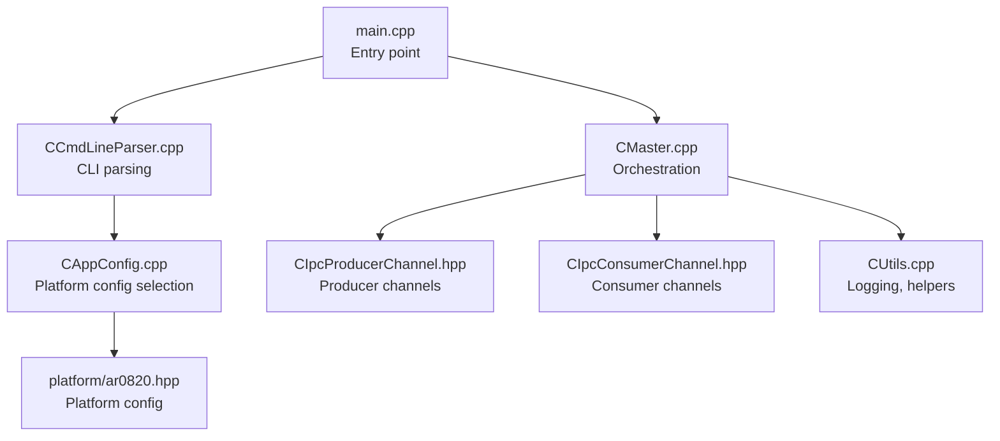
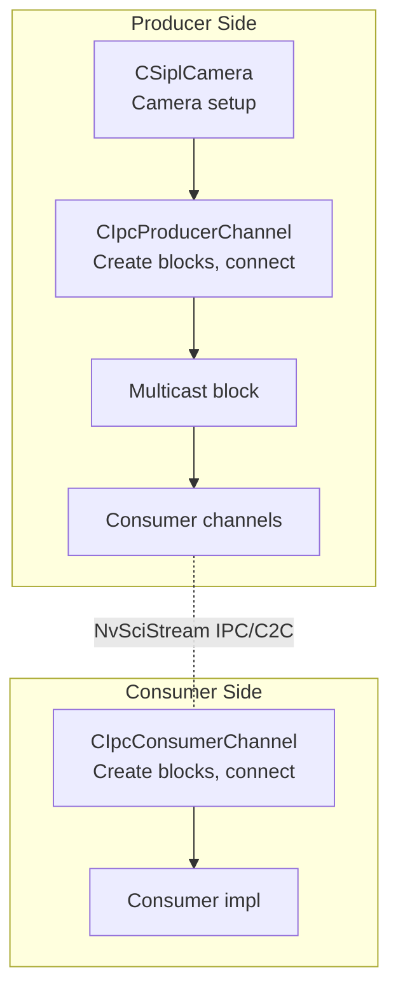
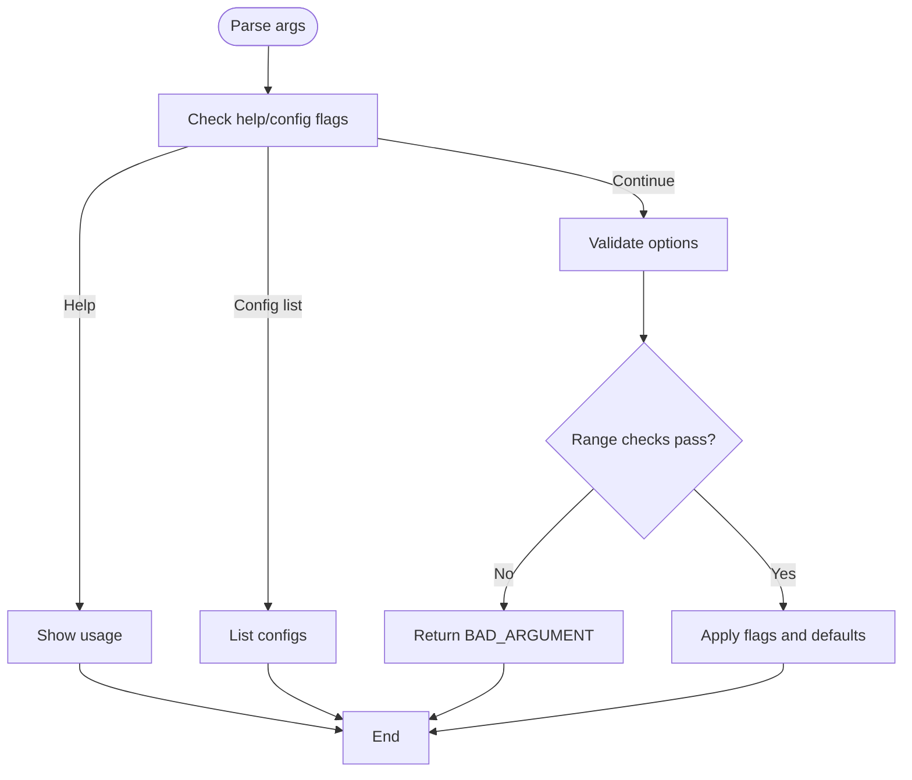
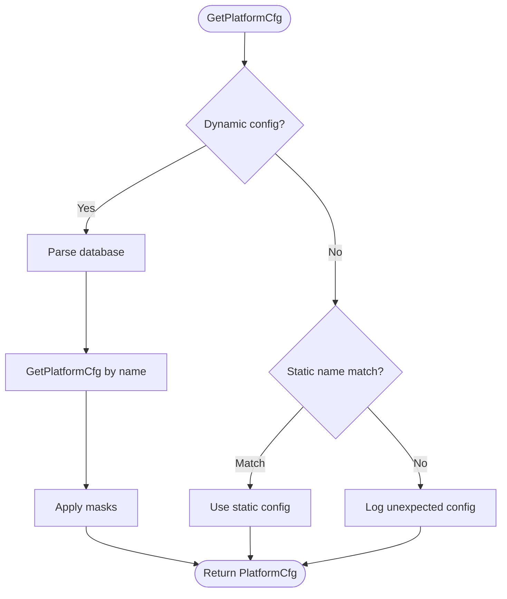
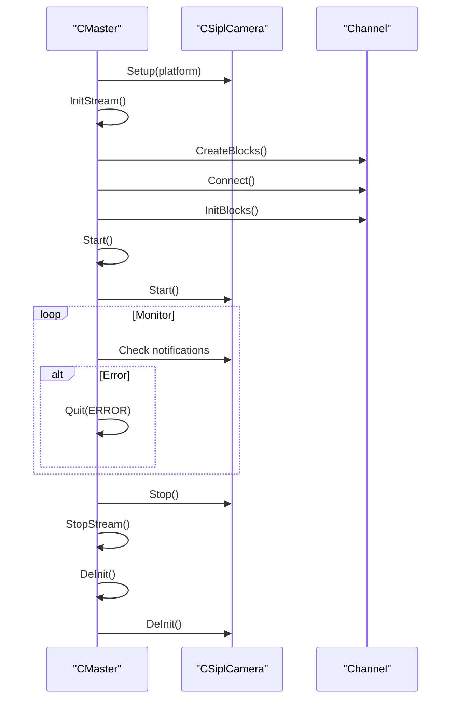
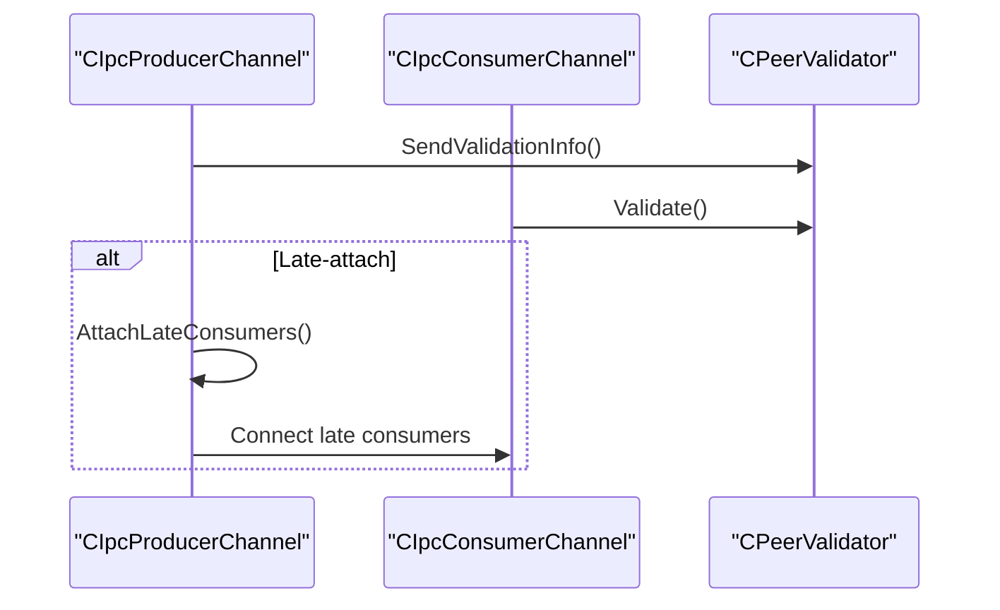
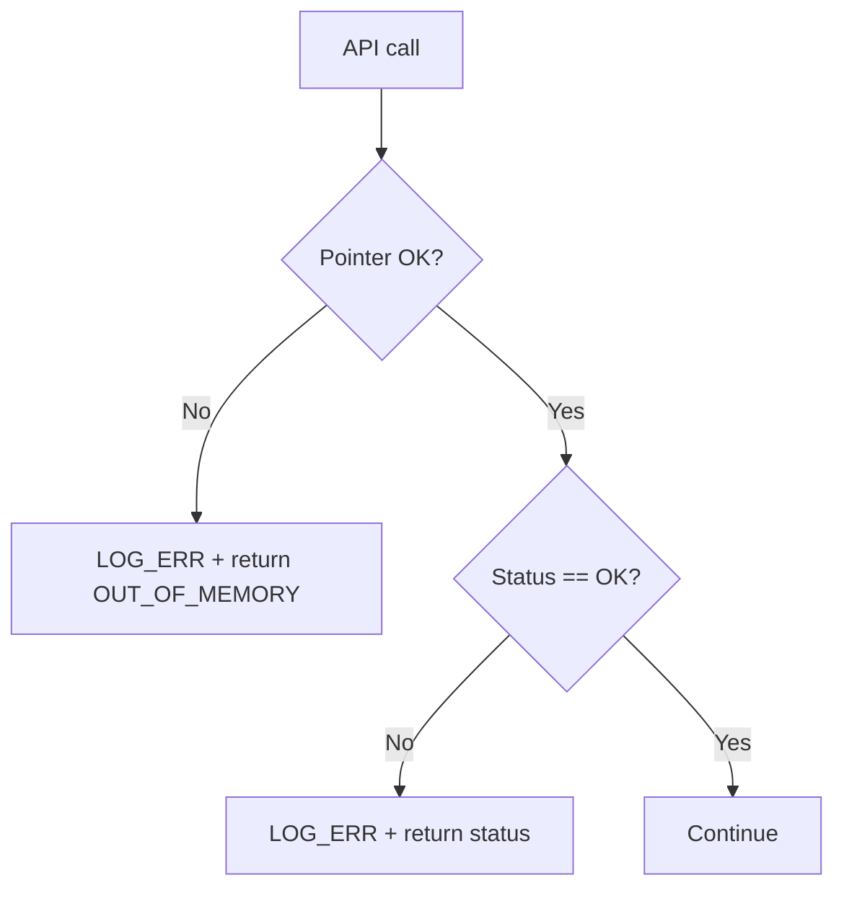
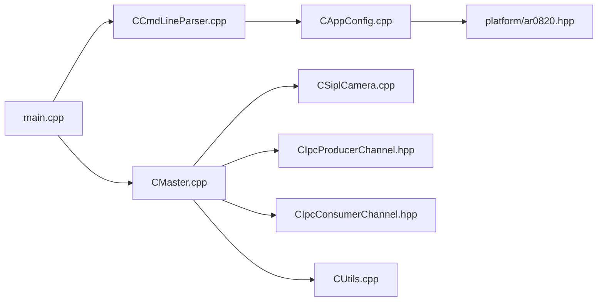

# Troubleshooting Guide

<cite>
**Referenced Files in This Document**
- [README.md](file://README.md)
- [main.cpp](file://main.cpp)
- [Common.hpp](file://Common.hpp)
- [CAppConfig.hpp](file://CAppConfig.hpp)
- [CAppConfig.cpp](file://CAppConfig.cpp)
- [CUtils.hpp](file://CUtils.hpp)
- [CUtils.cpp](file://CUtils.cpp)
- [CMaster.hpp](file://CMaster.hpp)
- [CMaster.cpp](file://CMaster.cpp)
- [CCmdLineParser.hpp](file://CCmdLineParser.hpp)
- [CCmdLineParser.cpp](file://CCmdLineParser.cpp)
- [CProducer.hpp](file://CProducer.hpp)
- [CConsumer.hpp](file://CConsumer.hpp)
- [CIpcProducerChannel.hpp](file://CIpcProducerChannel.hpp)
- [CIpcConsumerChannel.hpp](file://CIpcConsumerChannel.hpp)
- [ar0820.hpp](file://platform/ar0820.hpp)
</cite>

## Table of Contents
1. [Introduction](#introduction)
2. [Project Structure](#project-structure)
3. [Core Components](#core-components)
4. [Architecture Overview](#architecture-overview)
5. [Detailed Component Analysis](#detailed-component-analysis)
6. [Dependency Analysis](#dependency-analysis)
7. [Performance Considerations](#performance-considerations)
8. [Troubleshooting Guide](#troubleshooting-guide)
9. [Conclusion](#conclusion)
10. [Appendices](#appendices)

## Introduction
This guide provides comprehensive troubleshooting procedures for the NVIDIA SIPL Multicast system. It covers build failures, runtime errors, performance issues, camera configuration problems, consumer attachment failures, and communication problems. It also includes diagnostic procedures, log analysis techniques, debugging tools, profiling methods, error codes and warnings, platform-specific issues, and preventive measures.

## Project Structure
The system orchestrates camera acquisition, buffering, and distribution to multiple consumers via NvStreams. Key modules include:
- Application entrypoint and CLI parsing
- Master orchestration and lifecycle
- Camera abstraction and platform configuration
- Producer/consumer channels for intra-process, inter-process (P2P), and inter-chip (C2C)
- Logging and error-handling macros
- Platform-specific sensor configurations

**Diagram sources**
- [main.cpp:253-304](file://main.cpp#L253-L304)
- [CCmdLineParser.cpp:13-313](file://CCmdLineParser.cpp#L13-L313)
- [CAppConfig.cpp:21-75](file://CAppConfig.cpp#L21-L75)
- [CMaster.cpp:164-216](file://CMaster.cpp#L164-L216)
- [CIpcProducerChannel.hpp:20-131](file://CIpcProducerChannel.hpp#L20-L131)
- [CIpcConsumerChannel.hpp:19-83](file://CIpcConsumerChannel.hpp#L19-L83)
- [CUtils.cpp:17-143](file://CUtils.cpp#L17-L143)
- [ar0820.hpp:14-183](file://platform/ar0820.hpp#L14-L183)

**Section sources**
- [README.md:11-109](file://README.md#L11-L109)
- [main.cpp:253-304](file://main.cpp#L253-L304)
- [CCmdLineParser.cpp:13-313](file://CCmdLineParser.cpp#L13-L313)
- [CAppConfig.cpp:21-75](file://CAppConfig.cpp#L21-L75)
- [CMaster.cpp:164-216](file://CMaster.cpp#L164-L216)
- [CIpcProducerChannel.hpp:20-131](file://CIpcProducerChannel.hpp#L20-L131)
- [CIpcConsumerChannel.hpp:19-83](file://CIpcConsumerChannel.hpp#L19-L83)
- [CUtils.cpp:17-143](file://CUtils.cpp#L17-L143)
- [ar0820.hpp:14-183](file://platform/ar0820.hpp#L14-L183)

## Core Components
- Command-line parser validates and applies runtime options, including platform configuration, consumer type, queue type, and late-attach enablement.
- Application configuration encapsulates platform configuration, verbosity, and runtime flags.
- Master manages camera setup, stream initialization, channel creation, and lifecycle control (resume/suspend/start/stop).
- Producer/consumer channels implement IPC/C2C connectivity, peer validation, and late-attach semantics.
- Logging and macros standardize error propagation and reporting across modules.

**Section sources**
- [CCmdLineParser.cpp:13-208](file://CCmdLineParser.cpp#L13-L208)
- [CAppConfig.hpp:19-82](file://CAppConfig.hpp#L19-L82)
- [CAppConfig.cpp:21-75](file://CAppConfig.cpp#L21-L75)
- [CMaster.cpp:195-232](file://CMaster.cpp#L195-L232)
- [CIpcProducerChannel.hpp:58-131](file://CIpcProducerChannel.hpp#L58-L131)
- [CIpcConsumerChannel.hpp:63-83](file://CIpcConsumerChannel.hpp#L63-L83)
- [CUtils.hpp:29-83](file://CUtils.hpp#L29-L83)

## Architecture Overview
The system supports three communication modes:
- Intra-process: Single process with shared buffers
- Inter-process (P2P): Producer and consumers in separate processes
- Inter-chip (C2C): Producer and consumers on different chips

**Diagram sources**
- [CMaster.cpp:426-451](file://CMaster.cpp#L426-L451)
- [CIpcProducerChannel.hpp:88-131](file://CIpcProducerChannel.hpp#L88-L131)
- [CIpcConsumerChannel.hpp:63-83](file://CIpcConsumerChannel.hpp#L63-L83)

## Detailed Component Analysis

### Command-Line Parsing and Validation
- Validates options such as platform configuration, consumer type, queue type, frame filter, and late-attach.
- Enforces constraints (e.g., consumer count range, consumer index validity).
- Provides usage and configuration listing.

**Diagram sources**
- [CCmdLineParser.cpp:13-208](file://CCmdLineParser.cpp#L13-L208)

**Section sources**
- [CCmdLineParser.cpp:13-208](file://CCmdLineParser.cpp#L13-L208)
- [CCmdLineParser.hpp:34-44](file://CCmdLineParser.hpp#L34-L44)

### Application Configuration and Platform Selection
- Selects platform configuration dynamically or statically.
- Applies link masks for dynamic platform configurations.
- Resolves sensor resolution and YUV sensor detection.

**Diagram sources**
- [CAppConfig.cpp:21-75](file://CAppConfig.cpp#L21-L75)

**Section sources**
- [CAppConfig.cpp:21-75](file://CAppConfig.cpp#L21-L75)
- [CAppConfig.hpp:19-82](file://CAppConfig.hpp#L19-L82)

### Master Lifecycle and Stream Management
- Initializes logging and verbosity.
- Creates channels and display channel when enabled.
- Manages start/stop and suspend/resume cycles.
- Monitors pipeline/device-block notifications and exits on errors.

**Diagram sources**
- [CMaster.cpp:195-275](file://CMaster.cpp#L195-L275)
- [CMaster.cpp:354-403](file://CMaster.cpp#L354-L403)

**Section sources**
- [CMaster.cpp:195-275](file://CMaster.cpp#L195-L275)
- [CMaster.cpp:354-403](file://CMaster.cpp#L354-L403)

### Producer/Consumer Channels and Peer Validation
- Producer channels create pool manager, producer, multicast block, and IPC/C2C endpoints.
- Consumer channels create consumer and IPC/C2C endpoints, then validate peer configuration.
- Late-attach enables dynamic attachment/detachment of consumers after initial setup.

**Diagram sources**
- [CIpcProducerChannel.hpp:122-131](file://CIpcProducerChannel.hpp#L122-L131)
- [CIpcConsumerChannel.hpp:77-83](file://CIpcConsumerChannel.hpp#L77-L83)
- [CIpcProducerChannel.hpp:205-272](file://CIpcProducerChannel.hpp#L205-L272)
- [CIpcConsumerChannel.hpp:112-117](file://CIpcConsumerChannel.hpp#L112-L117)

**Section sources**
- [CIpcProducerChannel.hpp:58-131](file://CIpcProducerChannel.hpp#L58-L131)
- [CIpcConsumerChannel.hpp:63-83](file://CIpcConsumerChannel.hpp#L63-L83)
- [CIpcProducerChannel.hpp:205-272](file://CIpcProducerChannel.hpp#L205-L272)
- [CIpcConsumerChannel.hpp:112-117](file://CIpcConsumerChannel.hpp#L112-L117)

### Logging and Error Handling Macros
- Standardized macros for pointer checks, status checks, CUDA/NvSci/NvMedia errors.
- Centralized logger with configurable verbosity and function/line info.

**Diagram sources**
- [CUtils.hpp:29-83](file://CUtils.hpp#L29-L83)
- [CUtils.cpp:17-143](file://CUtils.cpp#L17-L143)

**Section sources**
- [CUtils.hpp:29-83](file://CUtils.hpp#L29-L83)
- [CUtils.cpp:17-143](file://CUtils.cpp#L17-L143)

## Dependency Analysis
- main depends on CLI parser and master orchestration.
- Master depends on camera abstraction, channels, and logging.
- Channels depend on factory, pool manager, and peer validator.
- Platform configuration is injected via app config and platform headers.

**Diagram sources**
- [main.cpp:253-304](file://main.cpp#L253-L304)
- [CCmdLineParser.cpp:13-313](file://CCmdLineParser.cpp#L13-L313)
- [CAppConfig.cpp:21-75](file://CAppConfig.cpp#L21-L75)
- [CMaster.cpp:164-216](file://CMaster.cpp#L164-L216)
- [CIpcProducerChannel.hpp:20-131](file://CIpcProducerChannel.hpp#L20-L131)
- [CIpcConsumerChannel.hpp:19-83](file://CIpcConsumerChannel.hpp#L19-L83)
- [CUtils.cpp:17-143](file://CUtils.cpp#L17-L143)
- [ar0820.hpp:14-183](file://platform/ar0820.hpp#L14-L183)

**Section sources**
- [main.cpp:253-304](file://main.cpp#L253-L304)
- [CCmdLineParser.cpp:13-313](file://CCmdLineParser.cpp#L13-L313)
- [CAppConfig.cpp:21-75](file://CAppConfig.cpp#L21-L75)
- [CMaster.cpp:164-216](file://CMaster.cpp#L164-L216)
- [CIpcProducerChannel.hpp:20-131](file://CIpcProducerChannel.hpp#L20-L131)
- [CIpcConsumerChannel.hpp:19-83](file://CIpcConsumerChannel.hpp#L19-L83)
- [CUtils.cpp:17-143](file://CUtils.cpp#L17-L143)
- [ar0820.hpp:14-183](file://platform/ar0820.hpp#L14-L183)

## Performance Considerations
- Frame rate monitoring is performed periodically by the monitor thread; use this to detect stalls or drops.
- Late-attach reduces startup contention by deferring consumer attachment.
- Multi-element mode allows multiple ISP outputs to feed different consumers concurrently.
- Queue types (fifo/mailbox) influence synchronization and throughput characteristics.

[No sources needed since this section provides general guidance]

## Troubleshooting Guide

### Build Failures
Symptoms
- Compilation errors related to missing headers or undefined symbols.
- Link-time errors for NvSci/NvMedia libraries.

Diagnostic steps
- Verify SDK installation and environment variables for NvSci/NvMedia.
- Confirm matching header/library versions for NvSIPL.
- Ensure platform-specific flags (e.g., NVMEDIA_QNX) are set appropriately.

Resolution
- Align compiler flags and include paths with the target platform.
- Rebuild with consistent versions of NvSIPL and platform headers.

**Section sources**
- [CUtils.hpp:10-21](file://CUtils.hpp#L10-L21)
- [CSiplCamera.cpp:19-23](file://CSiplCamera.cpp#L19-L23)

### Runtime Errors

#### Camera Initialization and Platform Configuration
Symptoms
- Unexpected platform configuration error during platform selection.
- Sensor resolution or format mismatch warnings.

Diagnostic steps
- Validate platform configuration name and masks for dynamic configs.
- Confirm static configuration matches hardware.
- Check sensor YUV RAW format expectations.

Resolution
- Use supported platform names and masks.
- Adjust static configuration to match installed sensors.
- Verify sensor capabilities and formats.

**Section sources**
- [CAppConfig.cpp:21-75](file://CAppConfig.cpp#L21-L75)
- [CAppConfig.hpp:48-49](file://CAppConfig.hpp#L48-L49)
- [ar0820.hpp:72-98](file://platform/ar0820.hpp#L72-L98)

#### Producer/Consumer Connectivity and Peer Validation
Symptoms
- Connect/query failures for producer/consumer blocks.
- Peer validation mismatches causing consumer exit.

Diagnostic steps
- Inspect NvSciStream block events and error codes.
- Verify producer and consumer share identical platform configuration and masks.
- Confirm IPC/C2C channel names and queue types.

Resolution
- Ensure consistent platform configuration across producer and consumers.
- Fix channel naming prefixes and queue types.
- Retry connection after resolving configuration mismatches.

**Section sources**
- [CIpcProducerChannel.hpp:133-184](file://CIpcProducerChannel.hpp#L133-L184)
- [CIpcConsumerChannel.hpp:85-118](file://CIpcConsumerChannel.hpp#L85-L118)
- [CIpcProducerChannel.hpp:122-129](file://CIpcProducerChannel.hpp#L122-L129)
- [CIpcConsumerChannel.hpp:112-117](file://CIpcConsumerChannel.hpp#L112-L117)

#### Late-Attach Failures
Symptoms
- Late consumer attach fails or consumer reports setup errors.
- Detach does not release resources cleanly.

Diagnostic steps
- Confirm multicast is ready for late attach.
- Verify late consumer blocks are created and connected in the correct order.
- Check event queries for late consumers reaching SetupComplete.

Resolution
- Ensure multicast status is set to Connect before late attach.
- Re-query and validate late consumer connections.
- On failure, delete late blocks and retry.

**Section sources**
- [CMaster.cpp:473-513](file://CMaster.cpp#L473-L513)
- [CIpcProducerChannel.hpp:205-272](file://CIpcProducerChannel.hpp#L205-L272)
- [CIpcProducerChannel.hpp:304-327](file://CIpcProducerChannel.hpp#L304-L327)

#### Display and Stitching Issues
Symptoms
- Display initialization or stitching failures.
- WFD errors during display setup.

Diagnostic steps
- Verify display enable flags and port counts.
- Check WFD controller initialization and error reporting.
- Validate stitching pipeline creation and reconciliation.

Resolution
- Enable correct display mode and port count.
- Resolve WFD errors and retry display initialization.
- Reconcile display channel blocks.

**Section sources**
- [CMaster.cpp:64-69](file://CMaster.cpp#L64-L69)
- [CMaster.cpp:459-471](file://CMaster.cpp#L459-L471)
- [CUtils.hpp:109-131](file://CUtils.hpp#L109-L131)

### Performance Problems
Symptoms
- Low FPS, frame drops, or stalls.
- Pipeline notification handlers report errors asynchronously.

Diagnostic steps
- Review monitor thread FPS output for trends.
- Check for asynchronous pipeline or device-block errors.
- Profile per-sensor frame rates and adjust frame filter or queue types.

Resolution
- Reduce workload (frame filter, fewer consumers).
- Switch queue types to optimize synchronization.
- Investigate bottlenecks in producer/consumer implementations.

**Section sources**
- [CMaster.cpp:354-403](file://CMaster.cpp#L354-L403)
- [CProducer.hpp:24-46](file://CProducer.hpp#L24-L46)
- [CConsumer.hpp:26-35](file://CConsumer.hpp#L26-L35)

### Logging and Diagnostics
Log levels and verbosity
- Configure verbosity to capture INFO/WARN/DEBUG logs.
- Use function/line info logging for precise diagnostics.

Common log categories
- ERROR: Fatal or severe failures.
- WARNING: Recoverable issues or misconfigurations.
- INFO: Operational messages and transitions.
- DEBUG: Detailed internal state and timing.

Diagnostic procedures
- Increase verbosity to DEBUG for detailed traces.
- Capture logs around connect/init/reconcile phases.
- Correlate NvSci error codes with log messages.

**Section sources**
- [CUtils.cpp:23-143](file://CUtils.cpp#L23-L143)
- [CMaster.cpp:34-43](file://CMaster.cpp#L34-L43)

### Debugging Tools and Profiling
Tools
- Monitor thread FPS output for real-time performance.
- Use profiler instances per sensor to track frame rates.

Profiling methods
- Enable profiling in channel creation and update counters periodically.
- Compare FPS across sensors and outputs.

**Section sources**
- [CMaster.cpp:370-380](file://CMaster.cpp#L370-L380)
- [CMaster.cpp:73-84](file://CMaster.cpp#L73-L84)

### Error Codes and Warning Messages
Common macros and statuses
- Pointer null checks return OUT_OF_MEMORY.
- Status checks return propagated error codes.
- CUDA/NvSci/NvMedia checks return standardized error codes.

Warnings and messages
- Unexpected platform configuration.
- NvSciStream connect/query failures.
- Late-attach readiness warnings.
- Display/WFD errors.

**Section sources**
- [CUtils.hpp:29-83](file://CUtils.hpp#L29-L83)
- [CUtils.hpp:109-131](file://CUtils.hpp#L109-L131)
- [CIpcProducerChannel.hpp:207-214](file://CIpcProducerChannel.hpp#L207-L214)

### Step-by-Step Resolution Procedures

#### Build Failure: Missing NvSci/NvMedia Headers/Libs
1. Verify SDK installation and environment variables.
2. Confirm matching header/library versions.
3. Rebuild with correct flags and paths.

#### Runtime: Unexpected Platform Configuration
1. List supported configurations and confirm names.
2. For dynamic configs, ensure masks are provided together.
3. For static configs, match hardware.

#### Runtime: Producer/Consumer Connect Failure
1. Check NvSciStream block events and error codes.
2. Validate producer and consumer platform configs are identical.
3. Confirm IPC/C2C channel names and queue types.

#### Runtime: Late-Attach Failure
1. Ensure multicast is ready for late attach.
2. Create and connect late consumer blocks in order.
3. Query and validate SetupComplete for late consumers.
4. On failure, delete late blocks and retry.

#### Runtime: Display/Stitching Failure
1. Verify display enable flags and port counts.
2. Initialize WFD controller and resolve errors.
3. Reconcile display channel blocks.

#### Performance: Low FPS or Drops
1. Increase verbosity to DEBUG and capture logs.
2. Review monitor thread FPS output.
3. Adjust frame filter or queue types.
4. Investigate pipeline/device-block notifications.

**Section sources**
- [CCmdLineParser.cpp:281-312](file://CCmdLineParser.cpp#L281-L312)
- [CAppConfig.cpp:21-75](file://CAppConfig.cpp#L21-L75)
- [CIpcProducerChannel.hpp:133-184](file://CIpcProducerChannel.hpp#L133-L184)
- [CIpcConsumerChannel.hpp:85-118](file://CIpcConsumerChannel.hpp#L85-L118)
- [CMaster.cpp:473-513](file://CMaster.cpp#L473-L513)
- [CMaster.cpp:64-69](file://CMaster.cpp#L64-L69)
- [CMaster.cpp:354-403](file://CMaster.cpp#L354-L403)

### Platform-Specific Issues
- Board model differences may require GPIO updates for power control.
- QNX/Linux may use different CDI API flags.
- Ensure platform configuration aligns with board and sensor variants.

**Section sources**
- [CSiplCamera.cpp:117-135](file://CSiplCamera.cpp#L117-L135)
- [ar0820.hpp:52-56](file://platform/ar0820.hpp#L52-L56)
- [ar0820.hpp:117-121](file://platform/ar0820.hpp#L117-L121)
- [ar0820.hpp:131-135](file://platform/ar0820.hpp#L131-L135)

### Driver Compatibility and Hardware Configuration
- Validate NvSIPL library and header versions match.
- Confirm sensor and deserializer firmware compatibility.
- Ensure CSI lanes and link masks match physical connections.

**Section sources**
- [CSiplCamera.cpp:144-152](file://CSiplCamera.cpp#L144-L152)
- [CAppConfig.cpp:21-75](file://CAppConfig.cpp#L21-L75)

### Preventive Measures and Maintenance
- Regularly check FPS and monitor for anomalies.
- Validate peer configuration before launching consumers.
- Keep platform configurations and masks synchronized.
- Use late-attach to reduce startup contention.

**Section sources**
- [CMaster.cpp:354-403](file://CMaster.cpp#L354-L403)
- [CIpcProducerChannel.hpp:122-129](file://CIpcProducerChannel.hpp#L122-L129)
- [CIpcConsumerChannel.hpp:112-117](file://CIpcConsumerChannel.hpp#L112-L117)

### Escalation and Support
- Collect verbose logs and NvSci error codes.
- Provide platform configuration, masks, and queue types.
- Include hardware and board model details.

**Section sources**
- [CUtils.cpp:23-143](file://CUtils.cpp#L23-L143)
- [CCmdLineParser.cpp:238-279](file://CCmdLineParser.cpp#L238-L279)

## Conclusion
This guide consolidates troubleshooting strategies for the NVIDIA SIPL Multicast system, covering build, runtime, and performance issues. By following the diagnostic procedures, leveraging logging and profiling, and applying the resolution steps, most issues can be identified and resolved efficiently. For persistent problems, escalate with detailed logs and configuration information.

## Appendices

### Common CLI Options and Flags
- Platform configuration: dynamic (-g) and static (-t)
- Link masks: (--link-enable-masks)
- Verbosity: (-v)
- Consumer type: (-c enc|cuda)
- Queue type: (-q f|m)
- Late-attach: (-L)
- Display modes: (-d stitch|mst)
- Multi-element: (-e)
- Run duration: (-r seconds)
- Ignore errors: (-I)
- SC7 boot: (-7)
- Consumer count/index: (-n, -i)
- File dump: (-f)
- Frame filter: (-k)
- Version: (-V)
- Help: (-h)

**Section sources**
- [CCmdLineParser.cpp:238-279](file://CCmdLineParser.cpp#L238-L279)