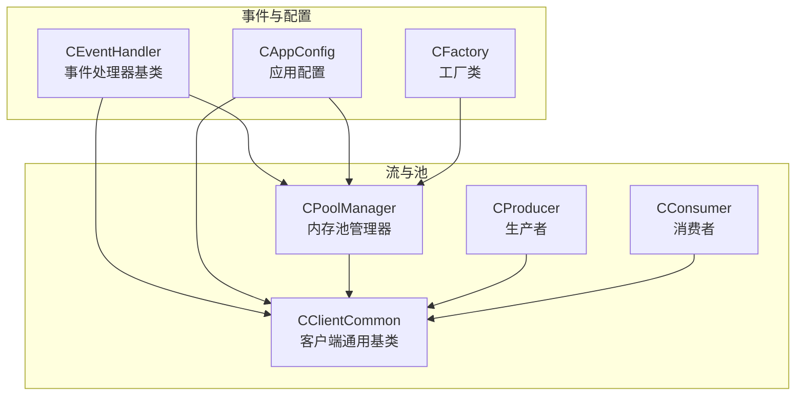
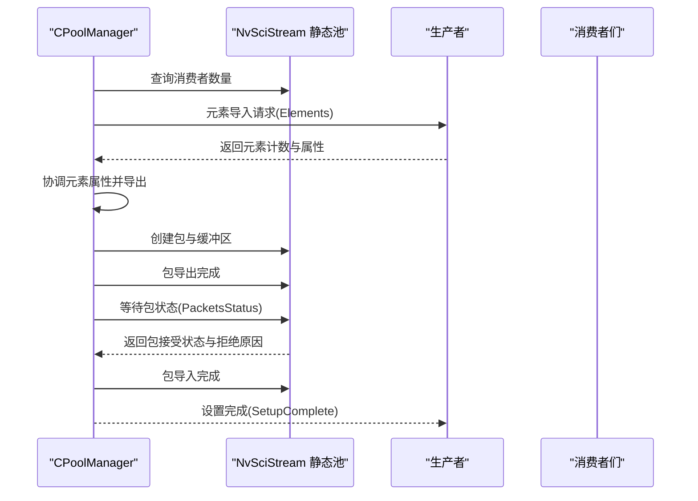
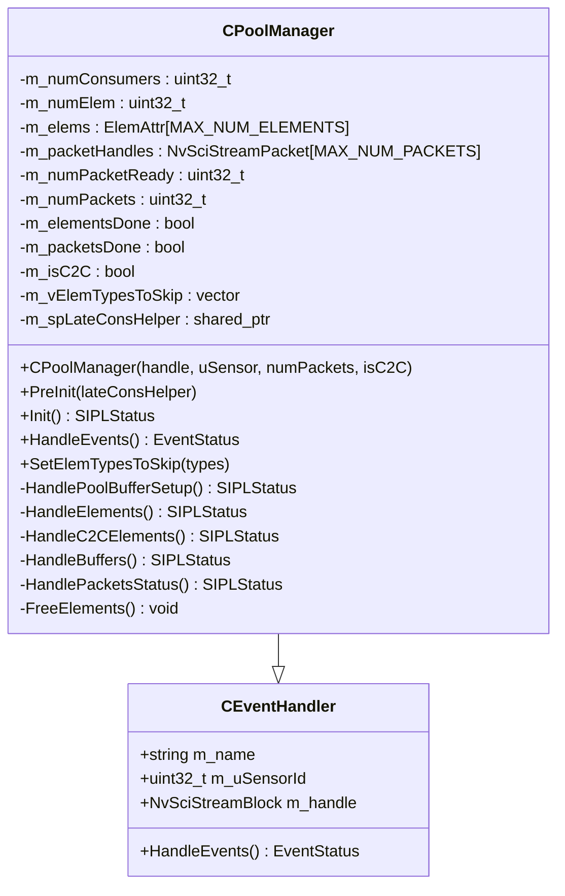
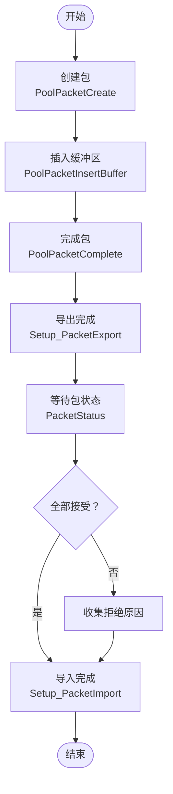
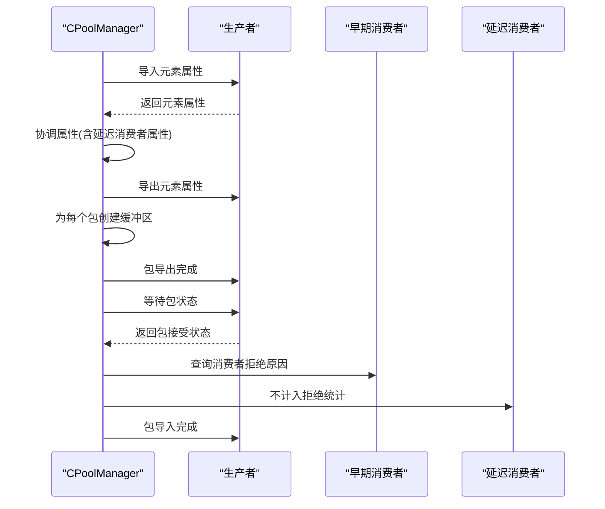
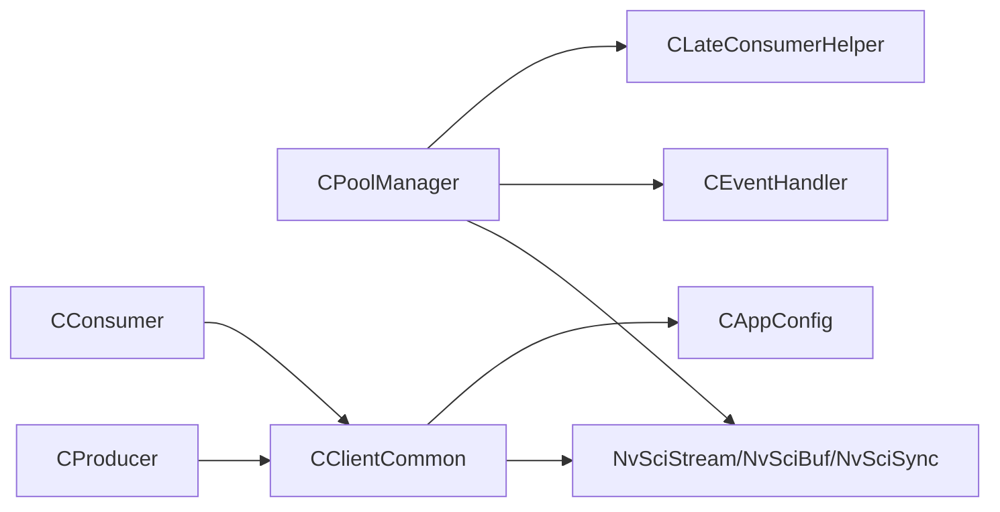

# 内存池管理系统

<cite>
**本文引用的文件**
- [CPoolManager.hpp](file://CPoolManager.hpp)
- [CPoolManager.cpp](file://CPoolManager.cpp)
- [Common.hpp](file://Common.hpp)
- [CEventHandler.hpp](file://CEventHandler.hpp)
- [CClientCommon.hpp](file://CClientCommon.hpp)
- [CClientCommon.cpp](file://CClientCommon.cpp)
- [CAppConfig.hpp](file://CAppConfig.hpp)
- [CAppConfig.cpp](file://CAppConfig.cpp)
- [CFactory.cpp](file://CFactory.cpp)
- [CConsumer.hpp](file://CConsumer.hpp)
- [CProducer.hpp](file://CProducer.hpp)
- [main.cpp](file://main.cpp)
</cite>

## 目录
1. [简介](#简介)
2. [项目结构](#项目结构)
3. [核心组件](#核心组件)
4. [架构总览](#架构总览)
5. [详细组件分析](#详细组件分析)
6. [依赖关系分析](#依赖关系分析)
7. [性能考量](#性能考量)
8. [故障排查指南](#故障排查指南)
9. [结论](#结论)
10. [附录](#附录)

## 简介
本文件面向内存池管理系统，聚焦于 CPoolManager 类的设计与实现，系统性阐述以下主题：
- 内存池初始化流程与事件驱动模型
- 缓冲区管理机制与资源分配策略
- ElemAttr 结构体的作用与属性配置
- NvSciStreamPacket 的使用方法与生命周期管理
- 多消费者环境下的工作原理（元素类型管理、包状态处理、缓冲区设置）
- 内存池配置参数（最大元素数量、包数量限制、跳过元素类型）
- 实际使用示例与最佳实践

## 项目结构
该子系统围绕 NvSciStream 抽象构建，采用事件驱动与分层职责设计：
- CEventHandler：事件处理器基类，统一事件查询与状态返回
- CPoolManager：内存池管理器，负责元素协调、包创建与缓冲区分配
- CClientCommon：客户端通用基类，负责包映射、缓冲区访问与同步对象管理
- CAppConfig：应用配置中心，提供运行时参数与平台信息
- CFactory：工厂类，负责静态池创建与基础元素信息生成

**图表来源**
- [CEventHandler.hpp:23-51](file://CEventHandler.hpp#L23-L51)
- [CPoolManager.hpp:33-68](file://CPoolManager.hpp#L33-L68)
- [CClientCommon.hpp:47-199](file://CClientCommon.hpp#L47-L199)
- [CAppConfig.hpp:19-80](file://CAppConfig.hpp#L19-L80)
- [CFactory.cpp:11-22](file://CFactory.cpp#L11-L22)
- [CProducer.hpp:16-51](file://CProducer.hpp#L16-L51)
- [CConsumer.hpp:16-43](file://CConsumer.hpp#L16-L43)

**章节来源**
- [CPoolManager.hpp:1-71](file://CPoolManager.hpp#L1-L71)
- [CEventHandler.hpp:1-54](file://CEventHandler.hpp#L1-L54)
- [Common.hpp:1-87](file://Common.hpp#L1-L87)
- [CFactory.cpp:1-32](file://CFactory.cpp#L1-L32)

## 核心组件
- CPoolManager：负责 NvSciStream 静态池的元素导入导出、包创建与缓冲区插入、包状态检查与完成通知
- ElemAttr：封装元素名称与 NvSciBuf 属性列表，支持自动释放
- CClientCommon：负责包创建、缓冲区映射、元数据缓冲区设置、同步对象注册与信号/等待属性列表收集
- CAppConfig：提供运行时开关（如多元素、延迟附加）、消费者数量等配置
- CFactory：创建静态池句柄并构造 CPoolManager 实例

**章节来源**
- [CPoolManager.hpp:19-68](file://CPoolManager.hpp#L19-L68)
- [CClientCommon.hpp:47-199](file://CClientCommon.hpp#L47-L199)
- [CAppConfig.hpp:19-80](file://CAppConfig.hpp#L19-L80)
- [CFactory.cpp:11-22](file://CFactory.cpp#L11-L22)

## 架构总览
CPoolManager 在事件驱动框架下，按阶段推进内存池初始化与运行准备：
- 初始化阶段：查询消费者数量、导入元素属性、导出元素属性、创建包与缓冲区、等待包状态
- 运行阶段：根据包状态决定是否进入运行态或错误处理

**图表来源**
- [CPoolManager.cpp:30-98](file://CPoolManager.cpp#L30-L98)
- [CPoolManager.cpp:100-117](file://CPoolManager.cpp#L100-L117)
- [CPoolManager.cpp:269-334](file://CPoolManager.cpp#L269-L334)
- [CPoolManager.cpp:337-395](file://CPoolManager.cpp#L337-L395)

## 详细组件分析

### CPoolManager 类设计与实现
- 继承关系：继承自 CEventHandler，具备统一事件处理接口
- 关键成员：
  - 元素数组与计数：ElemAttr m_elems[MAX_NUM_ELEMENTS]、m_numElem
  - 包句柄数组：NvSciStreamPacket m_packetHandles[MAX_NUM_PACKETS]
  - 状态标志：m_elementsDone、m_packetsDone、m_isC2C
  - 跳过元素类型集合：m_vElemTypesToSkip
  - 延迟消费者辅助：m_spLateConsHelper
- 主要方法：
  - PreInit：注入延迟消费者辅助
  - Init：查询消费者数量
  - HandleEvents：事件分发（Elements、PacketStatus、Error、Disconnected、SetupComplete）
  - HandlePoolBufferSetup：按 C2C 模式选择元素处理路径并创建缓冲区
  - HandleElements：协调生产者与消费者元素属性，导出最终元素
  - HandleC2CElements：C2C 模式直接导入生产者元素
  - HandleBuffers：为每个包按元素类型创建缓冲区并插入
  - HandlePacketsStatus：检查包接受状态并汇总拒绝原因
  - SetElemTypesToSkip：设置跳过元素类型集合

**图表来源**
- [CEventHandler.hpp:23-51](file://CEventHandler.hpp#L23-L51)
- [CPoolManager.hpp:33-68](file://CPoolManager.hpp#L33-L68)

**章节来源**
- [CPoolManager.hpp:19-68](file://CPoolManager.hpp#L19-L68)
- [CPoolManager.cpp:12-401](file://CPoolManager.cpp#L12-L401)

### ElemAttr 结构体
- 字段：
  - userName：元素用户标识（与 ELEMENT_TYPE_* 对应）
  - bufAttrList：NvSciBuf 属性列表指针
- 行为：
  - 析构函数中自动释放属性列表，避免泄漏
- 用途：
  - 作为 CPoolManager 内部的元素属性容器，参与属性协调与导出

**章节来源**
- [CPoolManager.hpp:20-31](file://CPoolManager.hpp#L20-L31)

### NvSciStreamPacket 生命周期与使用
- 创建：通过静态池句柄创建包，并使用唯一 cookie 标识
- 插入缓冲区：按元素索引将 NvSciBufObj 插入包
- 完成：标记包创建完成，触发消费者侧接收
- 状态查询：等待并查询包接受状态，收集生产者与消费者的拒绝原因
- 客户端映射：消费者侧通过 cookie 查包并提取各元素缓冲区对象进行映射

**图表来源**
- [CPoolManager.cpp:279-331](file://CPoolManager.cpp#L279-L331)
- [CPoolManager.cpp:337-395](file://CPoolManager.cpp#L337-L395)
- [CClientCommon.cpp:427-460](file://CClientCommon.cpp#L427-L460)

**章节来源**
- [CPoolManager.cpp:269-334](file://CPoolManager.cpp#L269-L334)
- [CPoolManager.cpp:337-395](file://CPoolManager.cpp#L337-L395)
- [CClientCommon.cpp:427-460](file://CClientCommon.cpp#L427-L460)

### 多消费者环境下的工作原理
- 元素类型管理：
  - 生产者与消费者各自声明元素类型，CPoolManager 协调匹配后导出统一属性
  - 支持延迟消费者附加，动态加入缓冲区属性列表
- 包状态处理：
  - 等待所有包状态返回后，汇总生产者与早期消费者（非延迟）的拒绝原因
  - 任一包被拒绝即视为失败，否则进入运行态
- 缓冲区设置：
  - 按元素类型逐包分配缓冲区对象并插入，支持跳过某些元素类型

**图表来源**
- [CPoolManager.cpp:119-237](file://CPoolManager.cpp#L119-L237)
- [CPoolManager.cpp:239-267](file://CPoolManager.cpp#L239-L267)
- [CPoolManager.cpp:269-334](file://CPoolManager.cpp#L269-L334)
- [CPoolManager.cpp:337-395](file://CPoolManager.cpp#L337-L395)

**章节来源**
- [CPoolManager.cpp:119-237](file://CPoolManager.cpp#L119-L237)
- [CPoolManager.cpp:239-267](file://CPoolManager.cpp#L239-L267)
- [CPoolManager.cpp:269-334](file://CPoolManager.cpp#L269-L334)
- [CPoolManager.cpp:337-395](file://CPoolManager.cpp#L337-L395)

### 配置参数与约束
- 最大元素数量：MAX_NUM_ELEMENTS（来自公共头文件）
- 包数量限制：MAX_NUM_PACKETS（来自公共头文件）
- 跳过元素类型：通过 SetElemTypesToSkip 设置，按 ELEMENT_TYPE_* 值过滤不使用的元素
- 消费者数量：由 NvSciStream 查询，影响包状态统计范围（延迟消费者除外）

**章节来源**
- [Common.hpp:14-34](file://Common.hpp#L14-L34)
- [CPoolManager.hpp:52-67](file://CPoolManager.hpp#L52-L67)
- [CPoolManager.cpp:292-314](file://CPoolManager.cpp#L292-L314)
- [CPoolManager.cpp:371-374](file://CPoolManager.cpp#L371-L374)

### 实际使用示例与最佳实践
- 工厂创建静态池与管理器
  - 使用 CFactory::CreatePoolManager 创建静态池句柄并构造 CPoolManager
  - 参考路径：[CFactory.cpp:11-22](file://CFactory.cpp#L11-L22)
- 设置包数量与模式
  - 构造 CPoolManager 时传入包数量与 C2C 标志
  - 参考路径：[CPoolManager.hpp](file://CPoolManager.hpp#L36)
- 预初始化与延迟消费者
  - PreInit 注入 CLateConsumerHelper，用于动态加入缓冲区属性
  - 参考路径：[CPoolManager.cpp:24-28](file://CPoolManager.cpp#L24-L28)
- 设置跳过元素类型
  - SetElemTypesToSkip 传入 ELEMENT_TYPE_* 列表，避免为不使用元素分配缓冲区
  - 参考路径：[CPoolManager.cpp:397-400](file://CPoolManager.cpp#L397-L400)
- 客户端侧包映射与缓冲区访问
  - 客户端通过 cookie 获取包句柄并提取各元素缓冲区对象进行映射
  - 参考路径：[CClientCommon.cpp:427-460](file://CClientCommon.cpp#L427-L460)
- 元数据缓冲区权限设置
  - 元数据缓冲区需 CPU 可写权限，通过 SetMetaBufAttrList 配置
  - 参考路径：[CClientCommon.cpp:279-298](file://CClientCommon.cpp#L279-L298)

**章节来源**
- [CFactory.cpp:11-22](file://CFactory.cpp#L11-L22)
- [CPoolManager.hpp](file://CPoolManager.hpp#L36)
- [CPoolManager.cpp:24-28](file://CPoolManager.cpp#L24-L28)
- [CPoolManager.cpp:397-400](file://CPoolManager.cpp#L397-L400)
- [CClientCommon.cpp:427-460](file://CClientCommon.cpp#L427-L460)
- [CClientCommon.cpp:279-298](file://CClientCommon.cpp#L279-L298)

## 依赖关系分析
- CPoolManager 依赖：
  - NvSciStream 接口：元素查询/导入/导出、包创建/插入/完成、状态查询
  - CLateConsumerHelper：延迟消费者属性注入
  - CEventHandler：事件查询与状态返回
- CClientCommon 依赖：
  - NvSciStream/NvSciBuf/NvSciSync 接口：包映射、缓冲区映射、同步对象注册
  - CAppConfig：运行时配置（多元素、延迟附加、消费者数量等）

**图表来源**
- [CPoolManager.hpp:12-17](file://CPoolManager.hpp#L12-L17)
- [CClientCommon.hpp:15-20](file://CClientCommon.hpp#L15-L20)
- [CProducer.hpp:16-17](file://CProducer.hpp#L16-L17)
- [CConsumer.hpp:16-17](file://CConsumer.hpp#L16-L17)

**章节来源**
- [CPoolManager.hpp:12-17](file://CPoolManager.hpp#L12-L17)
- [CClientCommon.hpp:15-20](file://CClientCommon.hpp#L15-L20)
- [CProducer.hpp:16-17](file://CProducer.hpp#L16-L17)
- [CConsumer.hpp:16-17](file://CConsumer.hpp#L16-L17)

## 性能考量
- 事件驱动模型：避免轮询，降低 CPU 占用，提升响应性
- 批量属性协调：一次遍历完成元素匹配与属性合并，减少多次往返
- 延迟消费者优化：仅在需要时注入属性，避免不必要的缓冲区分配
- 跳过元素类型：减少无效缓冲区创建与插入，节省内存与时间
- 包状态异步处理：允许生产者与消费者异步确认，提高吞吐

## 故障排查指南
- 事件查询超时：检查 NvSciStream 事件查询超时设置与链路稳定性
  - 参考路径：[CPoolManager.cpp:47-55](file://CPoolManager.cpp#L47-L55)
- 元素数量越界：确保生产者与消费者元素数量不超过 MAX_NUM_ELEMENTS
  - 参考路径：[CPoolManager.cpp:133-137](file://CPoolManager.cpp#L133-L137)
- 属性协调失败：检查 ElemAttr 的 bufAttrList 是否正确释放与重建
  - 参考路径：[CPoolManager.hpp:24-30](file://CPoolManager.hpp#L24-L30)
- 包被拒绝：通过 HandlePacketsStatus 收集生产者与消费者拒绝原因
  - 参考路径：[CPoolManager.cpp:337-395](file://CPoolManager.cpp#L337-L395)
- 客户端映射失败：确认 cookie 有效性与缓冲区对象获取成功
  - 参考路径：[CClientCommon.cpp:427-460](file://CClientCommon.cpp#L427-L460)

**章节来源**
- [CPoolManager.cpp:47-55](file://CPoolManager.cpp#L47-L55)
- [CPoolManager.cpp:133-137](file://CPoolManager.cpp#L133-L137)
- [CPoolManager.hpp:24-30](file://CPoolManager.hpp#L24-L30)
- [CPoolManager.cpp:337-395](file://CPoolManager.cpp#L337-L395)
- [CClientCommon.cpp:427-460](file://CClientCommon.cpp#L427-L460)

## 结论
CPoolManager 以事件驱动为核心，结合 NvSciStream/NvSciBuf/NvSciSync 提供了高可靠、可扩展的内存池管理能力。其关键优势包括：
- 明确的阶段化初始化流程与完善的错误处理
- 灵活的元素类型管理与延迟消费者支持
- 高效的包生命周期管理与状态异步处理
- 可配置的元素跳过策略与严格的资源释放机制

在多消费者场景下，通过包状态聚合与延迟消费者隔离，系统能够稳健地适配不同拓扑与负载。

## 附录
- 元素类型枚举参考：ELEMENT_TYPE_*（定义于公共头文件）
  - 参考路径：[Common.hpp:68-76](file://Common.hpp#L68-L76)
- 应用配置项参考：多元素开关、延迟附加开关、消费者数量等
  - 参考路径：[CAppConfig.hpp:39-46](file://CAppConfig.hpp#L39-L46)
- 工厂创建静态池参考：静态池创建与管理器构造
  - 参考路径：[CFactory.cpp:11-22](file://CFactory.cpp#L11-L22)